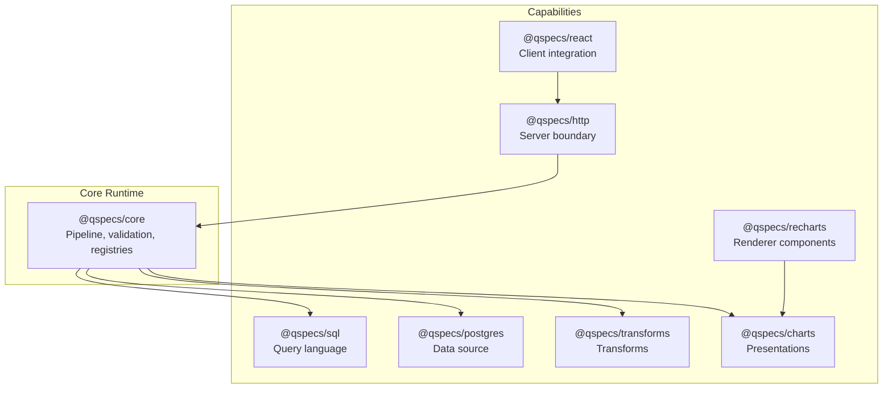
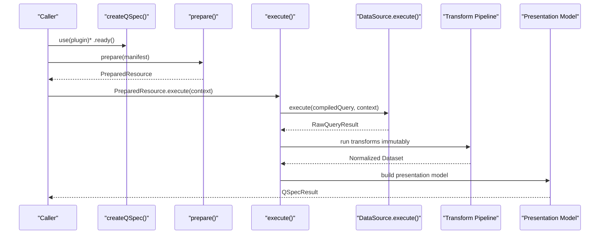
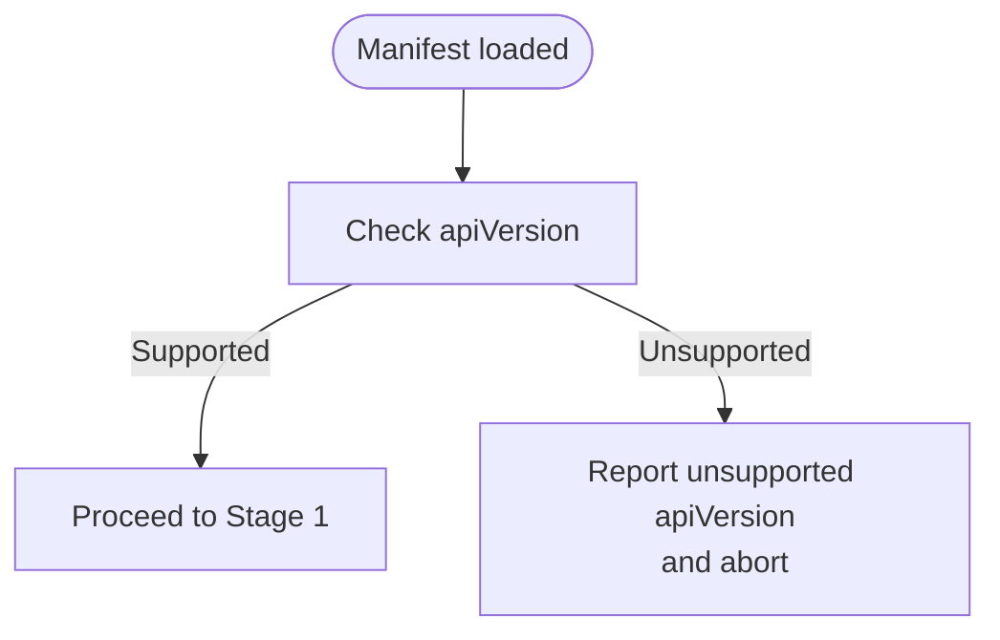
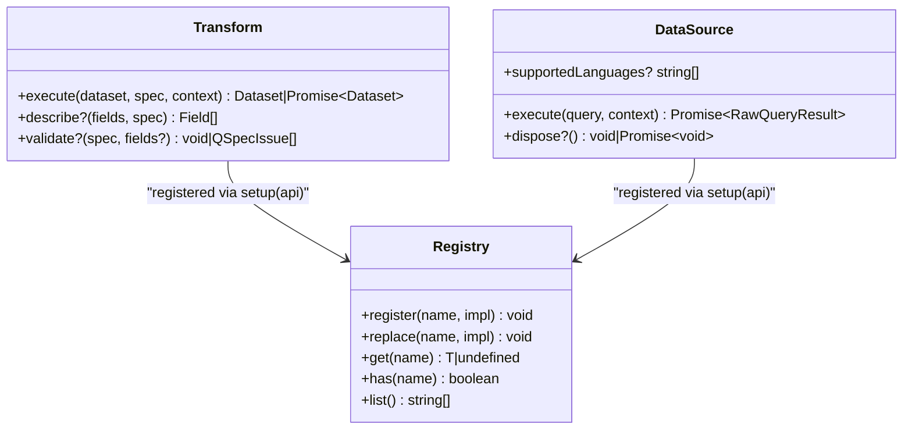
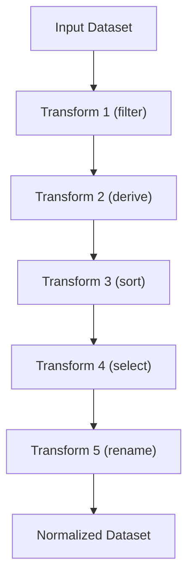
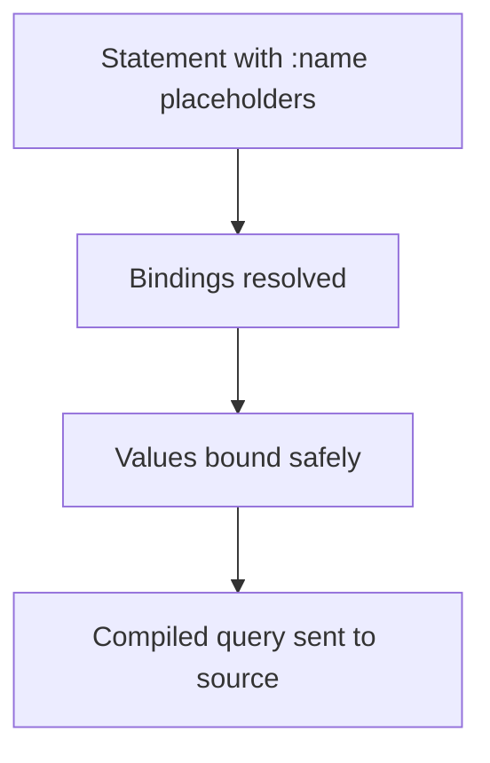
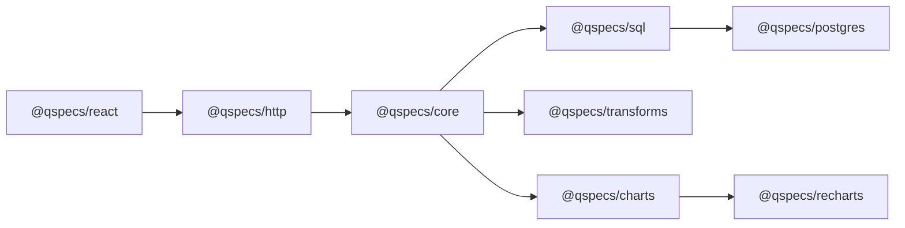

# Advanced Topics

<cite>
**Referenced Files in This Document**
- [architecture.md](file://docs/architecture.md)
- [public-api.md](file://docs/public-api.md)
- [specification-versioning.md](file://docs/specification-versioning.md)
- [known-gaps.md](file://docs/known-gaps.md)
- [plugin-authoring.md](file://docs/plugin-authoring.md)
- [plugins.md](file://docs/plugins.md)
- [transforms.md](file://docs/transforms.md)
- [data-sources.md](file://docs/data-sources.md)
- [parameters.md](file://docs/parameters.md)
- [queries.md](file://docs/queries.md)
- [qspec.json](file://schemas/v1/qspec.json)
- [package.json](file://package.json)
- [prepare.ts](file://packages/core/src/internal/prepare.ts)
- [manifest.test.ts](file://packages/core/src/internal/validate/manifest.test.ts)
- [limit.ts](file://packages/transforms/src/internal/limit.ts)
- [01-complete-manifest.qspec.json](file://examples/01-complete-manifest.qspec.json)
</cite>

## Table of Contents

1. Introduction
2. Project Structure
3. Core Components
4. Architecture Overview
5. Detailed Component Analysis
6. Dependency Analysis
7. Performance Considerations
8. Troubleshooting Guide
9. Conclusion
10. Appendices

## Introduction

This document provides expert-level guidance for advanced QSpec usage and internal architecture. It covers specification versioning, public API boundaries, experimental features, known gaps and limitations with workarounds, advanced plugin development patterns (custom transforms, data sources, presentation types), complex transform pipelines, multi-source queries, performance optimization, memory management, scalability considerations, migration strategies between versions, breaking changes, upgrade procedures, and enterprise deployment best practices.

## Project Structure

QSpec is a monorepo where each capability is a package and most runtime behavior is registry-driven. The core runtime defines the pipeline shape; plugins supply query languages, data sources, transforms, semantic types, resources, presentations, and renderers. A strict public/internal boundary is enforced mechanically via package exports and tests.

**Diagram sources**

- [architecture.md:1-64](file://docs/architecture.md#L1-L64)
- [plugins.md:166-183](file://docs/plugins.md#L166-L183)

**Section sources**

- [architecture.md:1-64](file://docs/architecture.md#L1-L64)
- [plugins.md:166-183](file://docs/plugins.md#L166-L183)

## Core Components

- Pipeline and stages: prepare() performs static work once per manifest; execute() runs per-call dynamic work. Six validation stages gate correctness early.
- Registries: All capabilities are registered at runtime through plugins; core only ships the Dataset resource kind.
- Public/internal boundary: Enforced by package exports and automated tests; nothing under src/internal/ is reachable from outside its package.
- Expression subsystem: Fixed operator set ensures deterministic, portable expressions; depth limits protect against abuse.
- Data sources: Pluggable adapters implement execute(query, context) and optional dispose(), with cancellation support.
- Transforms: Immutable, sequential pipeline with describe() enabling static schema projection and presentation validation before execution.

**Section sources**

- [architecture.md:65-121](file://docs/architecture.md#L65-L121)
- [plugins.md:35-93](file://docs/plugins.md#L35-L93)
- [public-api.md:10-28](file://docs/public-api.md#L10-L28)
- [transforms.md:24-63](file://docs/transforms.md#L24-L63)
- [data-sources.md:11-45](file://docs/data-sources.md#L11-L45)

## Architecture Overview

The runtime pipeline maps directly to SPEC requirements: manifest parsing, schema validation, resource resolution, parameter resolution/validation, query compilation, data source execution, result normalization, dataset validation, transform pipeline, presentation model, and renderer. Stages 1–2 and 6 run during prepare(); stages 3–5 run during execute().

**Diagram sources**

- [architecture.md:9-105](file://docs/architecture.md#L9-L105)

**Section sources**

- [architecture.md:9-105](file://docs/architecture.md#L9-L105)

## Detailed Component Analysis

### Specification Versioning Strategy

- apiVersion identifies the manifest spec version, not npm package versions. Only qspec.dev/v1 is supported today.
- SUPPORTED_API_VERSIONS is a single-element array; unrecognized values fail structural validation with a clear message.
- Backward compatibility: published spec versions never change in a breaking way; new breaking changes require a new apiVersion.
- Plugin compatibility: recommended via peerDependencies on @qspecs/core; QSpecPlugin.version exists but is not read by the runtime.

**Diagram sources**

- [specification-versioning.md:10-53](file://docs/specification-versioning.md#L10-L53)

**Section sources**

- [specification-versioning.md:10-94](file://docs/specification-versioning.md#L10-L94)

### Public API Boundaries and Experimental Features

- Public surface is exactly what is exported from package entry points; internal code lives under src/internal/.
- Mechanical enforcement: exports map limited to "." and "./package.json"; no wildcard re-exports; browser-safe packages cannot import database drivers; no eval/new Function in published source.
- Exceptions promoted intentionally into public contracts when multiple packages need them (e.g., expression subsystem, suggest, isPlainObject/isUnsafeKey).
- No automated API-diff or stability gates exist yet; stability is a policy promise rather than an enforced contract.

**Section sources**

- [public-api.md:10-93](file://docs/public-api.md#L10-L93)
- [architecture.md:158-202](file://docs/architecture.md#L158-L202)

### Known Gaps and Limitations with Workarounds

- UnsupportedApiVersionError is exported but never constructed by application code; errors are emitted as issues inside ManifestValidationError.
- maxManifestBytes applies only to text input; bypassed for already-parsed objects.
- Charts/presentations: formatting block absent; pie lacks resolveSeries equivalent; scatter with date/datetime x uses category axis.
- HTTP handler is unauthenticated by design; host must provide auth/authz.
- SSR/RSC not supported for React/Recharts packages; client-only.
- Automatic parameter forms remain unbuilt; presentation metadata is advisory only.
- Postgres error window remains open for checked-out clients; injection seam not exported.

Workarounds:

- Treat unsupported apiVersion as a manifest-shape failure; validate manifests early with CLI.
- For large manifests, parse server-side and pass parsed objects to avoid size checks on text path; rely on post-parse limits (maxTransforms, maxRows, maxExpressionDepth).
- Use Recharts-aware chart logic; for temporal axes, consider custom rendering or post-processing.
- Always mount createQSpecHandler behind your own authentication layer.
- Avoid SSR/RSC until future plans add support; keep React integrations client-bound.
- Build UI controls around parameters manually using declared types and presentation hints.

**Section sources**

- [known-gaps.md:10-211](file://docs/known-gaps.md#L10-L211)
- [known-gaps.md:213-419](file://docs/known-gaps.md#L213-L419)

### Advanced Plugin Development Patterns

- Custom Transform:
  - Implement execute(dataset, spec, context) returning a fresh Dataset; never mutate input.
  - Provide describe(fields, spec) to project output fields for static validation.
  - Optionally implement validate(spec, fields?) to return issues or throw; degrade gracefully when fields is undefined.
  - Use Object.create(null) rows and Object.hasOwn for prototype safety.
  - Validate against @qspecs/testing’s runTransformContractTests.
- Custom DataSource:
  - Implement execute(query, context) returning positional RawQueryResult; check context.signal before work.
  - Implement dispose() if pooling/cleanup needed; propagate cancellation properly (e.g., second connection for pg_cancel_backend).
  - Declare supportedLanguages to opt into stricter mismatch detection; omitting accepts any language for backward compatibility.
  - Validate with runDataSourceContractTests.
- Custom Presentation Type:
  - Implement validate(), fieldReferences(), and optionally describe-like projections for charts.
  - Ensure field references are complete and paths are string/number segments.
  - Use runPresentationContractTests.

**Diagram sources**

- [plugin-authoring.md:11-230](file://docs/plugin-authoring.md#L11-L230)
- [plugins.md:94-131](file://docs/plugins.md#L94-L131)

**Section sources**

- [plugin-authoring.md:11-275](file://docs/plugin-authoring.md#L11-L275)
- [plugins.md:35-131](file://docs/plugins.md#L35-L131)

### Complex Transform Pipelines

- Order is strict, sequential, immutable: each transform sees only the previous transform’s output; executor reassigns dataset from each return value.
- describe() enables static schema projection across the pipeline; missing describe makes downstream transforms and presentation validation lose static guarantees.
- Built-in transforms include filter, derive, sort, limit, select, rename; aggregate is deliberately absent in v1.
- Expression AST is fixed and non-extensible; operators validated for arity and depth; shorthand comparisons normalize to AST form.

**Diagram sources**

- [transforms.md:24-63](file://docs/transforms.md#L24-L63)
- [transforms.md:65-212](file://docs/transforms.md#L65-L212)

**Section sources**

- [transforms.md:24-419](file://docs/transforms.md#L24-L419)

### Multi-Source Queries

- A manifest declares one query with one source; multi-source composition is achieved by chaining datasets via transforms or by orchestrating multiple prepared resources in the host application.
- To emulate joins or unions across sources:
  - Execute separate manifests for each source.
  - Combine results in application code or via custom transforms that merge datasets.
  - Use consistent field names and types; ensure nullability semantics align.
- For distributed reads, prefer server-side orchestration to avoid exposing credentials or statements to clients.

[No sources needed since this section synthesizes existing constraints without analyzing specific files]

### Custom Parameter Types

- Standard parameter types are fixed in v1; custom types are not extensible via plugins.
- Workaround: encode domain-specific semantics using enum arrays or structured literals bound via bindings; validate in transform.validate or host-side logic.
- Keep parameter declarations minimal and explicit; rely on validation rules (min/max/minLength/maxLength) for constraints.

**Section sources**

- [parameters.md:25-125](file://docs/parameters.md#L25-L125)

### Query Bindings and Statement Safety

- Bindings accept three forms: string shorthand "$parameters.<name>", explicit { parameter }, and { literal }.
- Bare strings must match the parameter reference pattern; other strings are rejected.
- Values are never interpolated into statement text; they are passed as bound parameters to prevent injection.

**Diagram sources**

- [queries.md:43-75](file://docs/queries.md#L43-L75)
- [manifest.test.ts:168-210](file://packages/core/src/internal/validate/manifest.test.ts#L168-L210)

**Section sources**

- [queries.md:43-75](file://docs/queries.md#L43-L75)
- [manifest.test.ts:168-210](file://packages/core/src/internal/validate/manifest.test.ts#L168-L210)

### Data Source Cancellation and Pooling

- Proper cancellation requires reaching the server; for Postgres, open a second client and call pg_cancel_backend with the running query’s backend PID.
- Do not cancel on the blocked connection or destroy sockets; both fail to stop server-side execution.
- Connection pools should be reused; session survives cancellation, allowing reuse.

**Section sources**

- [data-sources.md:131-163](file://docs/data-sources.md#L131-L163)
- [architecture.md:346-375](file://docs/architecture.md#L346-L375)

### Presentations and Series Resolution

- Charts register presentation types; resolveSeries centralizes series pivoting and ordering so renderers do not disagree.
- Scatter does not pivot into wide rows; line/bar/area do via buildWideRows to match Recharts expectations.
- Pie lacks a resolveSeries equivalent; future plan should add resolvePie to unify behavior.

**Section sources**

- [architecture.md:259-279](file://docs/architecture.md#L259-L279)
- [architecture.md:477-511](file://docs/architecture.md#L477-L511)

## Dependency Analysis

- Capability registration order determines override precedence; later plugins can replace earlier implementations via replace().
- Browser-safe packages cannot depend on database drivers; enforced by tests scanning dependencies and imports.
- Core has zero runtime dependencies; schema validation in core is hand-written, not Ajv-based.

**Diagram sources**

- [plugins.md:166-183](file://docs/plugins.md#L166-L183)
- [public-api.md:45-56](file://docs/public-api.md#L45-L56)

**Section sources**

- [plugins.md:132-165](file://docs/plugins.md#L132-L165)
- [public-api.md:45-56](file://docs/public-api.md#L45-L56)

## Performance Considerations

- Prefer prepare() once per manifest and reuse PreparedResource.execute() for many parameter sets to amortize static work.
- Cap expression depth via limits.maxExpressionDepth; malformed or overly deep expressions fail fast during prepare().
- Use limit transform judiciously; it slices rows immutably and preserves null-prototype rows.
- Avoid unnecessary transforms; each adds allocation and processing cost.
- For large datasets, push filtering/sorting to the data source where possible; use transforms for post-query refinement.
- Memory management:
  - Return fresh Datasets from transforms; never mutate inputs.
  - Use positional rows and null-prototype objects to avoid prototype pollution and enable safe property access.
  - Dispose data sources when shutting down to release connections/pools.
- Scalability:
  - Mount createQSpecHandler behind rate limiting and authentication.
  - Use connection pooling and proper cancellation to handle concurrent requests.
  - Cache PreparedResources per manifest; cache QSpecResults per query key in React to deduplicate requests.

**Section sources**

- [architecture.md:65-86](file://docs/architecture.md#L65-L86)
- [transforms.md:312-339](file://docs/transforms.md#L312-L339)
- [limit.ts:14-34](file://packages/transforms/src/internal/limit.ts#L14-L34)
- [data-sources.md:68-105](file://docs/data-sources.md#L68-L105)

## Troubleshooting Guide

- Unsupported apiVersion:
  - Symptom: Validation fails with unsupported apiVersion message.
  - Action: Update manifest to qspec.dev/v1 or upgrade runtime to support newer versions when available.
- Unknown data source or language:
  - Symptom: prepare() reports unknown source/language with suggestions.
  - Action: Ensure plugin registers the required capability; verify supportedLanguages matches manifest.
- Binding errors:
  - Symptom: String binding not matching $parameters.<name>; both parameter and literal present.
  - Action: Use correct binding forms; ensure referenced parameters are declared.
- Transform issues:
  - Symptom: Missing describe leads to lost static validation; collisions in rename; unknown fields in presentation.
  - Action: Implement describe for all transforms; validate rename mappings; ensure presentation references match projected schema.
- Cancellation failures:
  - Symptom: Aborted queries still running on server.
  - Action: Implement proper cancellation (e.g., second connection for pg_cancel_backend); avoid socket destruction.
- HTTP security:
  - Symptom: Unauthenticated endpoint executing queries.
  - Action: Place createQSpecHandler behind your own auth/authz and rate limiting.

**Section sources**

- [specification-versioning.md:10-53](file://docs/specification-versioning.md#L10-L53)
- [prepare.ts:204-239](file://packages/core/src/internal/prepare.ts#L204-L239)
- [manifest.test.ts:168-210](file://packages/core/src/internal/validate/manifest.test.ts#L168-L210)
- [transforms.md:177-212](file://docs/transforms.md#L177-L212)
- [data-sources.md:131-163](file://docs/data-sources.md#L131-L163)
- [known-gaps.md:197-211](file://docs/known-gaps.md#L197-L211)

## Conclusion

QSpec’s architecture emphasizes static validation, registry-driven extensibility, and strict boundaries between server and client. By adhering to the public API, implementing robust plugins, and leveraging the transform pipeline and expression subsystem safely, teams can build scalable, secure analytical applications. Migration between spec versions requires new apiVersion values; upgrades should focus on plugin compatibility and adherence to documented behaviors. Enterprise deployments must enforce authentication, rate limiting, and proper resource disposal.

## Appendices

### Migration Strategies and Upgrade Procedures

- Spec versioning:
  - Breaking changes require a new apiVersion; maintain backward compatibility by supporting multiple versions during migration windows.
  - Validate manifests early with CLI; update manifests to supported apiVersion before upgrading runtime.
- Plugin compatibility:
  - Use peerDependencies to declare compatible @qspecs/core ranges; test upgrades incrementally.
  - Replace capabilities via replace() carefully; document overrides and their precedence.
- Breaking changes checklist:
  - Verify apiVersion acceptance.
  - Confirm data source supportedLanguages alignment.
  - Ensure transforms’ describe() contracts remain valid.
  - Re-validate presentation field references against projected schemas.
  - Re-test cancellation and disposal paths.

**Section sources**

- [specification-versioning.md:71-94](file://docs/specification-versioning.md#L71-L94)
- [plugins.md:132-165](file://docs/plugins.md#L132-L165)

### Enterprise Deployment Checklist

- Authentication and authorization around createQSpecHandler.
- Rate limiting and request quotas.
- Connection pooling and proper disposal.
- Logging and observability via QSpecLogger and hooks.
- Security hardening: no eval/new Function; prototype-safe object handling; strict bindings.
- Monitoring for long-running queries; enforce timeouts and cancellation.
- CI validation with plugin-aware qspec validate --config.

**Section sources**

- [known-gaps.md:197-211](file://docs/known-gaps.md#L197-L211)
- [plugins.md:82-93](file://docs/plugins.md#L82-L93)

### Example Manifest Reference

- Complete manifest demonstrates parameters, query, dataset schema, transforms, and presentation.

**Section sources**

- [01-complete-manifest.qspec.json:1-90](file://examples/01-complete-manifest.qspec.json#L1-L90)
