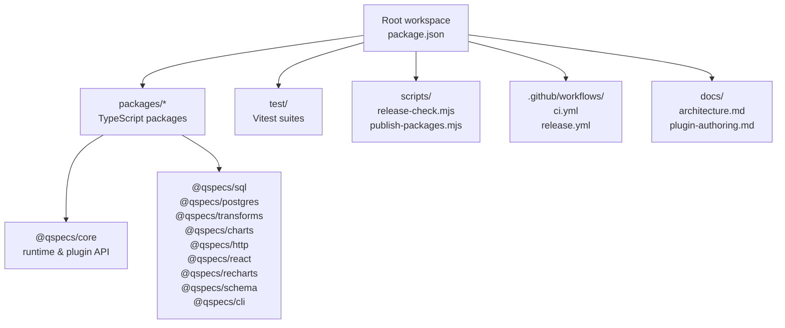
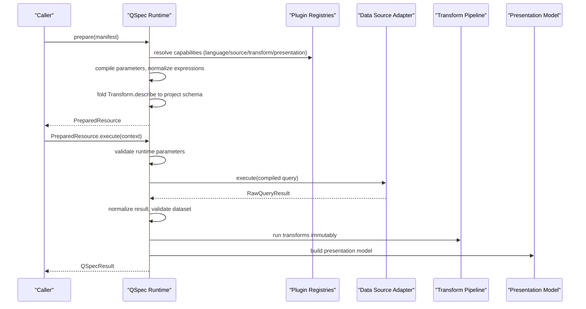
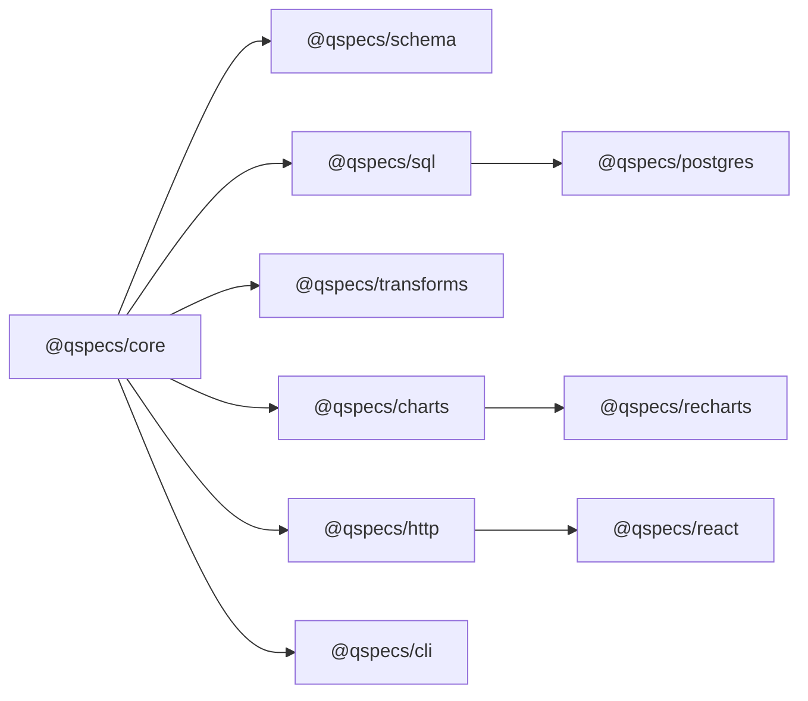

# Contributor Guide

<cite>
**Referenced Files in This Document**
- [package.json](file://package.json)
- [vitest.config.ts](file://vitest.config.ts)
- [tsconfig.base.json](file://tsconfig.base.json)
- [ci.yml](file://.github/workflows/ci.yml)
- [release.yml](file://.github/workflows/release.yml)
- [RELEASING.md](file://RELEASING.md)
- [publish-packages.mjs](file://scripts/publish-packages.mjs)
- [release-check.mjs](file://scripts/release-check.mjs)
- [architecture.md](file://docs/architecture.md)
- [plugin-authoring.md](file://docs/plugin-authoring.md)
- [README.md](file://README.md)
- [pipeline.test.ts](file://test/pipeline.test.ts)
- [postgres-pipeline.test.ts](file://test/postgres-pipeline.test.ts)
- [core package.json](file://packages/core/package.json)
</cite>

## Table of Contents

1. Introduction
2. Project Structure
3. Core Components
4. Architecture Overview
5. Detailed Component Analysis
6. Dependency Analysis
7. Performance Considerations
8. Troubleshooting Guide
9. Conclusion
10. Appendices

## Introduction

This guide is for contributors who want to extend or modify QSpec itself. It explains the internal architecture, core runtime components, plugin development patterns, build and test setup, CI/CD configuration, release process, version management, publishing procedures, coding standards, environment setup, debugging techniques, and the contribution workflow from issue reporting to pull request submission.

QSpec is an extensible declarative specification and runtime for defining parameterized data queries, validating inputs and outputs, transforming datasets, and describing presentation. The core runtime has zero runtime dependencies and exposes a plugin system through which query languages, data sources, transforms, presentations, and renderers are registered.

**Section sources**

- [README.md:1-14](file://README.md#L1-L14)
- [architecture.md:1-10](file://docs/architecture.md#L1-L10)

## Project Structure

The repository is a Node.js monorepo using npm workspaces under packages/*. Each package publishes independently (except private ones like @qspecs/testing). The root orchestrates builds, tests, formatting, and release tooling.

Key top-level elements:

- Root package.json defines workspaces, scripts, engines, and devDependencies including Vitest and Testcontainers.
- tsconfig.base.json sets strict TypeScript settings shared across packages.
- vitest.config.ts configures test discovery and JSX automatic runtime for .tsx tests.
- docs/ contains architecture, plugin authoring, and topic guides.
- test/ holds end-to-end and integration suites, including PostgreSQL-backed tests via Testcontainers.
- scripts/ provides release validation and publishing helpers.
- .github/workflows/ defines CI and Release pipelines.

**Diagram sources**

- [package.json:1-45](file://package.json#L1-L45)
- [vitest.config.ts:1-24](file://vitest.config.ts#L1-L24)
- [tsconfig.base.json:1-24](file://tsconfig.base.json#L1-L24)
- [ci.yml:1-164](file://.github/workflows/ci.yml#L1-L164)
- [release.yml:1-155](file://.github/workflows/release.yml#L1-L155)

**Section sources**

- [package.json:1-45](file://package.json#L1-L45)
- [vitest.config.ts:1-24](file://vitest.config.ts#L1-L24)
- [tsconfig.base.json:1-24](file://tsconfig.base.json#L1-L24)

## Core Components

At runtime, QSpec composes capabilities through plugins. The core runtime provides:

- Manifest parsing and structural validation
- Capability resolution (query languages, data sources, transforms, presentations)
- Parameter compilation and validation
- Query compilation and execution via adapters
- Result normalization and dataset validation
- Transform pipeline execution with immutable semantics
- Presentation model construction and static validation

Plugins register capabilities during setup and are installed before any prepare() call resolves them. The public/internal boundary is enforced by package exports and directory structure; internal modules live under src/internal/ and are not re-exported.

**Section sources**

- [architecture.md:9-105](file://docs/architecture.md#L9-L105)
- [architecture.md:158-203](file://docs/architecture.md#L158-L203)
- [plugin-authoring.md:11-85](file://docs/plugin-authoring.md#L11-L85)

## Architecture Overview

The runtime pipeline maps directly to the specification’s conceptual flow. prepare() performs all static work once per manifest; execute() performs per-call work that depends on runtime parameters or live data.

**Diagram sources**

- [architecture.md:65-105](file://docs/architecture.md#L65-L105)
- [plugin-authoring.md:123-157](file://docs/plugin-authoring.md#L123-L157)

## Detailed Component Analysis

### Build System and TypeScript Configuration

- Root build uses TypeScript project references with tsc --build.
- Shared compiler options enforce strict mode, module resolution, declaration generation, and isolated modules.
- Prebuild step copies schemas into place before building.

Practical implications:

- All packages must compile cleanly with strict checks.
- Declaration and source map generation are enabled for consumers and debugging.
- Packages should keep sideEffects false and only ship dist/.

**Section sources**

- [package.json:16-27](file://package.json#L16-L27)
- [tsconfig.base.json:1-24](file://tsconfig.base.json#L1-L24)

### Testing Strategy with Vitest and Testcontainers

- Tests are discovered under packages/_/src/\**/_.test.(ts|tsx), packages/_/test/\**/_.test.ts, and test/**/*.test.(ts|tsx).
- Vitest runs in node environment by default; .tsx files use automatic JSX transform configured in vitest.config.ts.
- End-to-end and integration tests spin up real PostgreSQL containers via Testcontainers and assert behavior against a live database.
- CI enforces that container-backed suites actually ran and did not skip silently.

Recommended practices:

- Use contract test utilities from @qspecs/testing when implementing new transforms or data sources.
- For network-backed adapters, include cancellation and cleanup assertions.
- Keep fixtures deterministic and small; prefer positional rows and null-prototype objects where appropriate.

**Section sources**

- [vitest.config.ts:1-24](file://vitest.config.ts#L1-L24)
- [postgres-pipeline.test.ts:1-42](file://test/postgres-pipeline.test.ts#L1-L42)
- [postgres-pipeline.test.ts:53-87](file://test/postgres-pipeline.test.ts#L53-L87)
- [pipeline.test.ts:1-163](file://test/pipeline.test.ts#L1-L163)

### Plugin Development Patterns

- Plugins are created with definePlugin and expose a setup(api) hook.
- Capabilities are registered via api.queryLanguages, api.sources, api.transforms, api.presentations, etc.
- Transforms implement execute and optionally describe and validate; describe enables static projection of fields for stage 6 validation.
- Data sources implement execute(query, context) returning RawQueryResult with columns and positional rows; they may also implement dispose and supportedLanguages.

Guidelines:

- Never mutate input datasets; return new datasets.
- Ensure describe and execute agree on field projections.
- Validate specs gracefully even when upstream schema is unknown.
- Return issues rather than throwing when multiple problems can be reported together.

**Section sources**

- [plugin-authoring.md:11-85](file://docs/plugin-authoring.md#L11-L85)
- [plugin-authoring.md:145-230](file://docs/plugin-authoring.md#L145-L230)
- [plugin-authoring.md:232-260](file://docs/plugin-authoring.md#L232-L260)

### Runtime Execution Flow and Validation Stages

- prepare() runs stages 1, 2, and 6 (manifest structure, capability resolution, presentation projection/validation).
- execute() runs stages 3, 4, and 5 (parameter validation, query validation/compilation, dataset validation).
- Transforms run immutably left-to-right; presentation is built after transforms.

Implications for contributors:

- Static validation must fail fast before any data fetch.
- Transforms should implement describe to preserve static guarantees downstream.
- Data sources must respect cancellation signals and return positional results.

**Section sources**

- [architecture.md:65-105](file://docs/architecture.md#L65-L105)
- [architecture.md:204-258](file://docs/architecture.md#L204-L258)

### HTTP Boundary and React Integration

- The HTTP protocol carries only resource name and parameters; no executable query crosses the wire.
- Server-side handler resolves the resource against a host-provided registry and executes with server-only credentials.
- React integration uses Suspense-first patterns; caching stores promise identities to avoid infinite suspension loops.

Contributor notes:

- Do not add query-shape fields to the HTTP request payload.
- Ensure client code never sees connection strings, statements, or table names.
- Cache keys must be stable across parameter key order.

**Section sources**

- [architecture.md:397-451](file://docs/architecture.md#L397-L451)

### SQL and Postgres Adapter Design

- CompiledSqlQuery intentionally omits text to prevent string interpolation; adapters must render placeholders and bind values.
- SQL scanner skips comments, escape strings, identifiers, dollar-quoted strings, and cast operators to avoid false parameter matches.
- Postgres adapter implements proper cancellation via pg_cancel_backend on a separate client and preserves pooled connections.
- numeric/bigint remain strings to preserve precision.

**Section sources**

- [architecture.md:280-396](file://docs/architecture.md#L280-L396)

### Package Boundaries and Public API

- Internal code lives under src/internal/ and is not re-exported.
- Published packages expose exactly two export paths: "." and "./package.json".
- Browser-safe packages must not depend on or import database drivers.
- Enforced by boundaries tests in CI.

**Section sources**

- [architecture.md:158-203](file://docs/architecture.md#L158-L203)
- [core package.json:1-37](file://packages/core/package.json#L1-L37)

## Dependency Analysis

Packages are organized as a dependency graph with lockstep versions. Inter-package dependencies pin exact versions, requiring coordinated releases.

Publish order is derived from the dependency graph to ensure prerequisites exist on the registry before dependents are published.

**Diagram sources**

- [publish-packages.mjs:1-127](file://scripts/publish-packages.mjs#L1-L127)
- [release-check.mjs:190-233](file://scripts/release-check.mjs#L190-L233)

**Section sources**

- [publish-packages.mjs:1-127](file://scripts/publish-packages.mjs#L1-L127)
- [release-check.mjs:1-188](file://scripts/release-check.mjs#L1-L188)

## Performance Considerations

- Prefer immutable transforms to avoid accidental aliasing bugs and enable predictable composition.
- Implement Transform.describe to maintain static validation and avoid runtime failures.
- Avoid unnecessary allocations in hot paths; reuse structures where safe.
- Respect cancellation signals early in data source execute to avoid wasted work.
- Keep manifests small and structured; large datasets should be handled via transforms and limits.

[No sources needed since this section provides general guidance]

## Troubleshooting Guide

Common issues and how to diagnose them:

- Tests skip without Docker/Testcontainers:
  - CI verifies that container-backed suites actually ran and failed if skipped.
  - Locally, ensure Docker is running and accessible; otherwise suites will skip with warnings.

- Presentation validation fails at prepare():
  - Indicates a misspelled or missing field reference after transforms; fix the manifest or adjust transforms’ describe.

- SQL injection concerns:
  - CompiledSqlQuery has no text field; ensure adapters render placeholders and bind values.
  - Verify your adapter does not concatenate user values into SQL strings.

- Precision loss with numeric/bigint:
  - Postgres adapter returns these as strings; parse in application logic with desired precision.

- React Suspense hangs:
  - Ensure caches store promise identities, not wrapped results; keys must be stable.

- Publishing fails mid-release:
  - Use release:dry-run and release:check locally; publish is idempotent and ordered by dependency graph.

**Section sources**

- [ci.yml:38-110](file://.github/workflows/ci.yml#L38-L110)
- [architecture.md:280-396](file://docs/architecture.md#L280-L396)
- [architecture.md:431-451](file://docs/architecture.md#L431-L451)

## Conclusion

QSpec’s design emphasizes a small, stable core with rich extensibility through plugins. Contributors should focus on clear contracts for transforms and data sources, strong static validation via describe, and robust error handling and cancellation. Follow the established build, test, and release processes to maintain consistency and safety across the monorepo.

[No sources needed since this section summarizes without analyzing specific files]

## Appendices

### Development Environment Setup

- Install Node.js meeting the engines requirement.
- Run npm ci to install dependencies.
- Build with npm run build; format with npm run format; check formatting with npm run format:check.
- Typecheck tests with npm run typecheck:tests.

**Section sources**

- [package.json:10-27](file://package.json#L10-L27)

### Running Tests

- Unit tests: npm test
- Watch mode: npm run test:watch
- End-to-end with PostgreSQL: ensure Docker is running; tests will start containers automatically.

**Section sources**

- [package.json:21-22](file://package.json#L21-L22)
- [postgres-pipeline.test.ts:53-87](file://test/postgres-pipeline.test.ts#L53-L87)

### Debugging Techniques

- Use TypeScript source maps for stack traces.
- Add console logs or breakpoints in plugin setup and execute hooks.
- For SQL issues, inspect compiled query segments and parameter names/values in adapters.
- For React/Suspense issues, verify cache identity and key stability.

**Section sources**

- [tsconfig.base.json:16-20](file://tsconfig.base.json#L16-L20)
- [architecture.md:431-451](file://docs/architecture.md#L431-L451)

### Contribution Workflow

- Open an issue describing the problem or feature.
- Fork the repository and create a branch.
- Implement changes following coding standards and add/update tests.
- Run full test suite and formatting checks locally.
- Submit a pull request with a clear description and linked issue.
- CI will run format checks, build, typechecks, tests (including container-backed suites), and pack validations.

**Section sources**

- [ci.yml:8-164](file://.github/workflows/ci.yml#L8-L164)

### Release Process and Version Management

- Releases are lockstep across all packages; inter-package dependencies pin exact versions.
- Local steps: bump versions, run release:check, build, and rehearse publish with release:dry-run.
- Tag with vMAJOR.MINOR.PATCH and push to trigger automated release.
- CI validates metadata, builds, tests, ensures container suites ran, packs cleanly, and publishes in dependency order with provenance.

**Section sources**

- [RELEASING.md:1-100](file://RELEASING.md#L1-L100)
- [release.yml:1-155](file://.github/workflows/release.yml#L1-L155)
- [publish-packages.mjs:1-127](file://scripts/publish-packages.mjs#L1-L127)
- [release-check.mjs:1-188](file://scripts/release-check.mjs#L1-L188)

### Coding Standards

- Strict TypeScript settings apply across packages.
- No eval or dynamic function creation in published sources.
- Maintain browser/server separation; browser-safe packages must not import database drivers.
- Keep packages side-effect free and only ship dist/.

**Section sources**

- [tsconfig.base.json:1-24](file://tsconfig.base.json#L1-L24)
- [architecture.md:158-203](file://docs/architecture.md#L158-L203)
