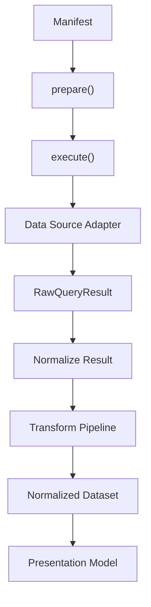
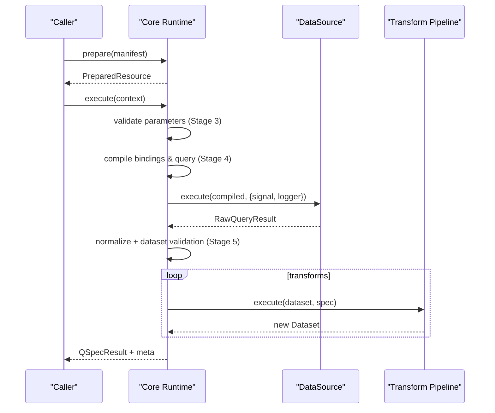
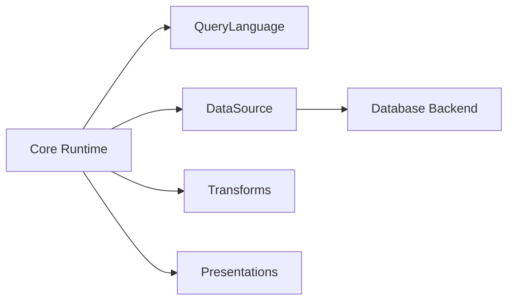
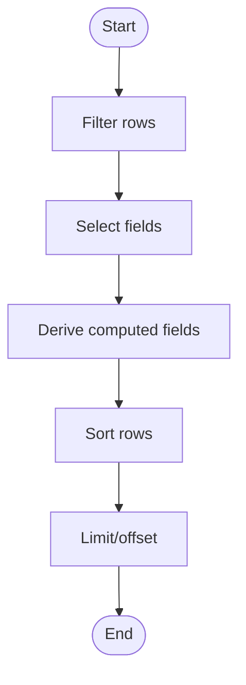
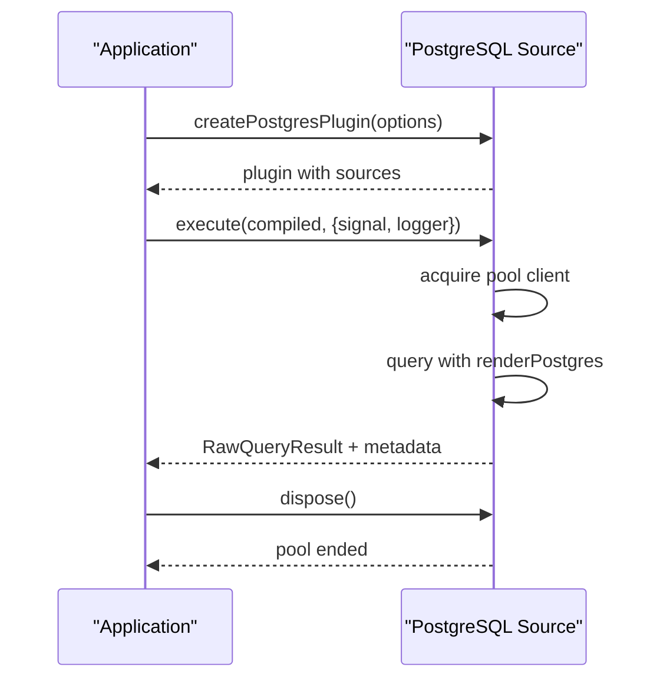

# Performance Optimization

<cite>
**Referenced Files in This Document**
- [README.md](file://README.md)
- [SPEC.md](file://SPEC.md)
- [architecture.md](file://docs/architecture.md)
- [queries.md](file://docs/queries.md)
- [transforms.md](file://docs/transforms.md)
- [data-sources.md](file://docs/data-sources.md)
- [datasets.md](file://docs/datasets.md)
- [presentations.md](file://docs/presentations.md)
- [execute.ts](file://packages/core/src/internal/execute.ts)
- [prepare.ts](file://packages/core/src/internal/prepare.ts)
- [source.ts](file://packages/postgres/src/internal/source.ts)
- [index.ts (transforms)](file://packages/transforms/src/index.ts)
</cite>

## Table of Contents

1. Introduction
2. Project Structure
3. Core Components
4. Architecture Overview
5. Detailed Component Analysis
6. Dependency Analysis
7. Performance Considerations
8. Troubleshooting Guide
9. Conclusion
10. Appendices

## Introduction

This document provides advanced performance optimization guidance for QSpec implementations. It focuses on query optimization techniques, transform pipeline efficiency, memory management strategies, and caching approaches. It also covers best practices for large datasets, connection pooling for database sources, result streaming patterns, profiling techniques, bottleneck identification, scaling considerations for high-throughput scenarios, concrete examples of optimized manifest structures and efficient transform chains, resource management patterns, performance monitoring, debugging slow queries, and optimizing complex analytical workloads.

QSpec’s runtime is designed to be deterministic, extensible, and secure by default. The core separates static preparation from per-call execution, enabling reuse of prepared plans across many parameter sets and minimizing repeated validation overhead. Data sources are pluggable and responsible for connectivity, native execution, cancellation propagation, and raw result acquisition. Transforms operate immutably over normalized datasets, and presentations describe semantic intent without embedding rendering logic.

**Section sources**

- [README.md:1-12](file://README.md#L1-L12)
- [SPEC.md:14-44](file://SPEC.md#L14-L44)
- [architecture.md:9-63](file://docs/architecture.md#L9-L63)

## Project Structure

At a high level, the repository organizes capabilities into packages:

- Core runtime and validation stages
- SQL compilation and PostgreSQL adapter with connection pooling and cancellation
- Standard transforms (filter, derive, sort, limit, select, rename)
- Presentations and chart semantics
- HTTP boundary and React integration for browser/server separation

The runtime pipeline executes in two phases:

- prepare(): parse, validate, resolve capabilities, compile parameters, fold transform describe() to project schema, validate presentation statically
- execute(): validate runtime parameters, compile bindings and query, execute against data source, normalize results, validate dataset, run transform pipeline, build presentation model

**Diagram sources**

- [architecture.md:9-63](file://docs/architecture.md#L9-L63)
- [prepare.ts:144-348](file://packages/core/src/internal/prepare.ts#L144-L348)
- [execute.ts:84-270](file://packages/core/src/internal/execute.ts#L84-L270)

**Section sources**

- [architecture.md:9-63](file://docs/architecture.md#L9-L63)
- [prepare.ts:144-348](file://packages/core/src/internal/prepare.ts#L144-L348)
- [execute.ts:84-270](file://packages/core/src/internal/execute.ts#L84-L270)

## Core Components

Key components that directly influence performance:

- Prepared plan reuse: prepare() performs all static work once; execute() only does per-call work dependent on parameters or live data sources
- Transform pipeline: strict left-to-right execution with immutable dataset reassignment; each transform returns a fresh dataset
- Data source adapters: implement DataSource.execute(query, context), optional dispose(), supportedLanguages declaration
- Normalization: converts RawQueryResult to Dataset with row caps, duplicate column handling, Date normalization, and metadata
- Presentations: declarative semantic models validated statically via Transform.describe() projection

Optimization levers:

- Reuse PreparedResource across multiple executions
- Keep transform pipelines minimal and ordered for early reduction (filter before sort/select)
- Use limits (maxRows, maxTransforms, maxExpressionDepth, queryTimeoutMs) to bound work
- Ensure data sources declare supportedLanguages to fail fast at prepare() time
- Avoid schema-opaque transforms (implement describe()) to preserve static validation and avoid downstream surprises

**Section sources**

- [architecture.md:65-105](file://docs/architecture.md#L65-L105)
- [transforms.md:24-63](file://docs/transforms.md#L24-L63)
- [data-sources.md:11-66](file://docs/data-sources.md#L11-L66)
- [datasets.md:134-163](file://docs/datasets.md#L134-L163)
- [presentations.md:12-60](file://docs/presentations.md#L12-L60)

## Architecture Overview

The runtime enforces six validation stages split between prepare() and execute():

- Stage 1: Manifest structure
- Stage 2: Plugin capabilities
- Stage 3: Parameters
- Stage 4: Query
- Stage 5: Dataset
- Stage 6: Presentation

Preparation freezes manifest nodes and projects field schemas through transforms using describe(). Execution validates runtime parameters, compiles bindings, executes queries with timeout and cancellation, normalizes results, validates datasets, runs transforms, and emits lifecycle hooks for observability.

**Diagram sources**

- [architecture.md:92-105](file://docs/architecture.md#L92-L105)
- [execute.ts:98-236](file://packages/core/src/internal/execute.ts#L98-L236)
- [prepare.ts:168-337](file://packages/core/src/internal/prepare.ts#L168-L337)

**Section sources**

- [architecture.md:92-105](file://docs/architecture.md#L92-L105)
- [execute.ts:98-236](file://packages/core/src/internal/execute.ts#L98-L236)
- [prepare.ts:168-337](file://packages/core/src/internal/prepare.ts#L168-L337)

## Detailed Component Analysis

### Query Optimization Techniques

- Parameter binding model: use string shorthand "$parameters.<name>" or explicit forms; literals must be declared via { literal } to prevent accidental interpolation
- CompiledSqlQuery has no text field to prevent concatenation-based injection; renderers convert segments and values to placeholders safely
- supportedLanguages on data sources enables early rejection of unsupported language/source combinations during prepare()
- Bindings are compiled once in prepare() and resolved per execute() call; missing optional parameters resolve to null rather than erroring

Best practices:

- Prefer filter transforms that reduce rows early
- Use select/rename to minimize payload size before sorting or limiting
- Leverage expression depth limits to avoid deeply nested expressions
- Validate manifests with plugin-aware tools to catch binding and type issues before execution

**Section sources**

- [queries.md:43-148](file://docs/queries.md#L43-L148)
- [architecture.md:287-344](file://docs/architecture.md#L287-L344)
- [data-sources.md:46-66](file://docs/data-sources.md#L46-L66)

### Transform Pipeline Efficiency

- Strict sequential order; each transform receives previous output and returns a fresh dataset
- Built-in transforms: filter, derive, sort, limit, select, rename
- Expression AST used by filter and derive; fixed operator set ensures determinism and portability
- describe() projects field schema statically; omitting describe() makes transforms schema-opaque and disables downstream static validation

Optimization tips:

- Place heavy filters early to reduce dataset size
- Use select to drop unnecessary fields before expensive operations like sort or derive
- Limit expression depth via limits.maxExpressionDepth to guard against deep evaluation costs
- Implement describe() for custom transforms to maintain static validation benefits

**Section sources**

- [transforms.md:24-63](file://docs/transforms.md#L24-L63)
- [transforms.md:65-211](file://docs/transforms.md#L65-L211)
- [transforms.md:213-339](file://docs/transforms.md#L213-L339)
- [architecture.md:204-257](file://docs/architecture.md#L204-L257)

### Memory Management Strategies

- Datasets are normalized JSON-safe shapes; Date cells at top-level are converted to ISO strings for safe transport
- Row cap enforced during normalization; truncated metadata indicates when limits are hit
- Duplicate columns are renamed and reported via lifecycle events
- Prototype-safe access prevents prototype pollution hazards; positional rows avoid object key collisions

Guidelines:

- Set appropriate limits.maxRows to control memory usage
- Use select/rename to reduce field count and row payload
- Be mindful of composite cell types (object/array); nested Dates are not normalized automatically by core
- Monitor duplicate-column events to detect schema mismatches early

**Section sources**

- [datasets.md:113-163](file://docs/datasets.md#L113-L163)
- [architecture.md:204-257](file://docs/architecture.md#L204-L257)

### Caching Approaches

- In-memory cache stores promises keyed by canonical cache keys to support React Suspense convergence and avoid repeated requests
- Cache holds promise references, not results, ensuring identity stability across renders
- For server-side reuse, keep PreparedResource instances and call execute() with different parameter contexts

Recommendations:

- Use cache for client-side queries to coalesce concurrent requests
- On server, prepare once per manifest and reuse across calls
- Ensure cache keys are stable across parameter ordering

**Section sources**

- [architecture.md:431-451](file://docs/architecture.md#L431-L451)

### Large Dataset Handling

- NormalizeResult applies maxRows and marks truncation; adapters may enforce their own limits
- Use transforms to reduce rows and fields before presenting
- Grouped series produce sparse, non-aligned x sets; ensure renderers handle this contract

Practical steps:

- Apply filter and select early
- Use limit with offset for pagination
- Monitor dataset.metadata.truncated to detect oversize results
- Tune limits.maxRows based on workload expectations

**Section sources**

- [datasets.md:134-163](file://docs/datasets.md#L134-L163)
- [presentations.md:173-210](file://docs/presentations.md#L173-L210)

### Connection Pooling for Database Sources

- PostgreSQL adapter uses a lazily-created pg.Pool per logical source name
- Supports statement_timeout configuration and connection error logging without leaking credentials
- Disposal ends the pool cleanly; subsequent execute() after disposal throws to prevent accidental recreation

Configuration tips:

- Set max connections appropriately for concurrency
- Configure statementTimeoutMs to protect backend resources
- Implement dispose() on shutdown to release pools
- Use supportedLanguages to fail fast on mismatched languages

**Section sources**

- [source.ts:56-83](file://packages/postgres/src/internal/source.ts#L56-L83)
- [source.ts:174-289](file://packages/postgres/src/internal/source.ts#L174-L289)
- [data-sources.md:46-66](file://docs/data-sources.md#L46-L66)

### Result Streaming Patterns

- Current implementation returns full RawQueryResult normalized into a Dataset; streaming is not built into the core pipeline
- For large results, apply server-side LIMIT/OFFSET and transform-level limit to constrain payloads
- Use metadata.durationMs and rowCount to assess throughput and adjust batching

Patterns:

- Paginate with limit(offset, count)
- Stream via application-layer chunking if your data source supports it; consume incrementally on the client side
- Combine with presentation models that can handle partial data gracefully

**Section sources**

- [execute.ts:163-184](file://packages/core/src/internal/execute.ts#L163-L184)
- [datasets.md:134-163](file://docs/datasets.md#L134-L163)

### Profiling Techniques and Bottleneck Identification

- Lifecycle hooks emit events for validation, query compile/start/end, transform start/end, and execution complete/error
- Use hooks to measure durations per stage and identify slow transforms or queries
- Inspect meta.durationMs, meta.query.durationMs, and dataset.rowCount to correlate performance with data volume

Actionable steps:

- Attach a logger to capture hook events
- Track transform index and duration to pinpoint bottlenecks
- Correlate queryDurationMs with rowCount to detect inefficient queries
- Use performance.now() measurements around critical sections if needed

**Section sources**

- [execute.ts:98-236](file://packages/core/src/internal/execute.ts#L98-L236)

### Scaling Considerations for High-Throughput Scenarios

- Reuse PreparedResource to avoid repeated static validation and planning
- Tune limits: maxTransforms, maxExpressionDepth, maxRows, queryTimeoutMs
- Ensure data sources declare supportedLanguages to fail fast
- Use connection pooling with appropriate max and timeouts
- Monitor hooks and logs to detect saturation points

Scaling checklist:

- Prepare once per manifest; execute with varied parameters
- Cap expression depth to prevent CPU spikes
- Enforce row limits to avoid memory pressure
- Configure statement timeouts to protect backends
- Observe hook metrics for hotspots

**Section sources**

- [architecture.md:65-105](file://docs/architecture.md#L65-L105)
- [source.ts:56-83](file://packages/postgres/src/internal/source.ts#L56-L83)
- [execute.ts:98-236](file://packages/core/src/internal/execute.ts#L98-L236)

### Concrete Examples of Optimized Manifest Structures

- Early filtering: place filter transforms before sort/select to reduce dataset size
- Field projection: use select to drop internal-only columns before presentation
- Safe renaming: use rename to align field names with presentation requirements while preserving order
- Grouped series: define grouped series to pivot datasets into multiple series consistently

References:

- Filter example manifest path
- Select example manifest path
- Rename example manifest path
- Grouped series chart example manifest path

**Section sources**

- [transforms.md:65-211](file://docs/transforms.md#L65-L211)
- [presentations.md:121-210](file://docs/presentations.md#L121-L210)

### Efficient Transform Chains

- Order matters: filter → select → derive → sort → limit
- Avoid schema-opaque transforms; implement describe() to preserve static validation
- Keep expressions shallow; respect maxExpressionDepth
- Use limit with offset for pagination instead of loading entire datasets

**Section sources**

- [transforms.md:24-63](file://docs/transforms.md#L24-L63)
- [transforms.md:213-339](file://docs/transforms.md#L213-L339)

### Resource Management Patterns

- DataSource.dispose() should close pools or other resources; call on shutdown
- AbortSignal propagation ensures cancellations reach adapters promptly
- Hooks provide structured observability for lifecycle events

Patterns:

- Register sources with supportedLanguages
- Wrap execute() with timeout and abort signals
- Log and monitor hook events for diagnostics

**Section sources**

- [source.ts:183-289](file://packages/postgres/src/internal/source.ts#L183-L289)
- [execute.ts:30-82](file://packages/core/src/internal/execute.ts#L30-L82)

### Performance Monitoring and Debugging Slow Queries

- Use hooks to capture query:compile:start/end, query:execute:start/end, transform:start/end, execution:complete/error
- Inspect meta fields for duration and row counts
- Check dataset.normalize duplicate-column events for schema drift
- Validate manifests with plugin-aware tools to catch binding and type errors early

Debug workflow:

- Enable hooks logging
- Identify slow stages via durations
- Narrow down to specific transforms by index
- Adjust query or transforms accordingly

**Section sources**

- [execute.ts:98-236](file://packages/core/src/internal/execute.ts#L98-L236)
- [queries.md:43-148](file://docs/queries.md#L43-L148)

### Optimizing Complex Analytical Workloads

- Push reductions to the data source where possible (SQL WHERE clauses)
- Minimize in-memory transformations; prefer selective projections
- Use grouped series carefully; understand sparse x sets and ordering implications
- Monitor truncation and adjust limits to balance completeness vs performance

**Section sources**

- [datasets.md:134-163](file://docs/datasets.md#L134-L163)
- [presentations.md:173-210](file://docs/presentations.md#L173-L210)

## Dependency Analysis

Core runtime orchestrates plugins:

- QueryLanguage.compile produces a compiled query shape
- DataSource.execute consumes the compiled query and returns RawQueryResult
- Transforms register implementations and optionally describe() projected schemas
- Presentations register types and validate field references statically

**Diagram sources**

- [architecture.md:92-105](file://docs/architecture.md#L92-L105)
- [data-sources.md:11-66](file://docs/data-sources.md#L11-L66)
- [transforms.md:24-63](file://docs/transforms.md#L24-L63)
- [presentations.md:12-60](file://docs/presentations.md#L12-L60)

**Section sources**

- [architecture.md:92-105](file://docs/architecture.md#L92-L105)
- [data-sources.md:11-66](file://docs/data-sources.md#L11-L66)
- [transforms.md:24-63](file://docs/transforms.md#L24-L63)
- [presentations.md:12-60](file://docs/presentations.md#L12-L60)

## Performance Considerations

- Reuse prepared plans to eliminate repeated static work
- Keep transform pipelines lean and ordered for early reduction
- Enforce limits to bound memory and CPU usage
- Use connection pooling with appropriate sizing and timeouts
- Monitor lifecycle hooks to identify bottlenecks
- Prefer server-side reductions (SQL) over client-side transformations
- Validate manifests with plugin-aware tools to catch issues early

[No sources needed since this section provides general guidance]

## Troubleshooting Guide

Common issues and resolutions:

- Unknown transform or language: ensure plugins are registered and supportedLanguages matches
- Binding errors: verify $parameters.<name> pattern or use { literal } for constants
- Dataset validation failures: check spec.dataset fields and ensure transforms do not remove required fields
- Slow queries: inspect queryDurationMs and rowCount; optimize SQL and add appropriate filters
- Cancellation not effective: confirm signal propagation and adapter implementation

Diagnostic steps:

- Enable hooks logging to trace execution flow
- Validate manifests with plugin-aware CLI to catch static issues
- Inspect meta.durationMs and dataset.metadata.truncated
- Review transform indices and durations to isolate slow steps

**Section sources**

- [queries.md:68-135](file://docs/queries.md#L68-L135)
- [execute.ts:98-236](file://packages/core/src/internal/execute.ts#L98-L236)
- [data-sources.md:46-66](file://docs/data-sources.md#L46-L66)

## Conclusion

QSpec’s architecture enables high-performance, deterministic, and secure analytical workflows through clear separation of concerns, static preparation, and pluggable capabilities. By reusing prepared plans, optimizing transform chains, enforcing limits, leveraging connection pooling, and monitoring lifecycle hooks, you can achieve efficient execution even under high throughput. Adhering to the binding model, implementing describe() for custom transforms, and validating manifests with plugin-aware tools further reduces runtime surprises and improves reliability.

[No sources needed since this section summarizes without analyzing specific files]

## Appendices

### Appendix A: Optimized Manifest Structure Checklist

- Declare parameters with types and defaults where applicable
- Use bindings strictly for parameters or literals
- Include dataset schema to enable static validation
- Order transforms for early reduction (filter → select → derive → sort → limit)
- Define presentation with field references that match projected schema

**Section sources**

- [queries.md:43-148](file://docs/queries.md#L43-L148)
- [transforms.md:24-63](file://docs/transforms.md#L24-L63)
- [presentations.md:12-60](file://docs/presentations.md#L12-L60)

### Appendix B: Transform Chain Flowchart

**Diagram sources**

- [transforms.md:24-63](file://docs/transforms.md#L24-L63)

### Appendix C: PostgreSQL Source Lifecycle

**Diagram sources**

- [source.ts:296-309](file://packages/postgres/src/internal/source.ts#L296-L309)
- [source.ts:236-289](file://packages/postgres/src/internal/source.ts#L236-L289)
