# Public API Boundaries

<cite>
**Referenced Files in This Document**
- [index.ts](file://packages/core/src/index.ts)
- [define.ts](file://packages/core/src/define.ts)
- [runtime.ts](file://packages/core/src/internal/runtime.ts)
- [errors.ts](file://packages/core/src/errors.ts)
- [plugin.ts](file://packages/core/src/types/plugin.ts)
- [runtime-types.ts](file://packages/core/src/types/runtime.ts)
- [events.ts](file://packages/core/src/types/events.ts)
- [dataset.ts](file://packages/core/src/types/dataset.ts)
- [manifest.ts](file://packages/core/src/types/manifest.ts)
- [public-api.md](file://docs/public-api.md)
- [plugins.md](file://docs/plugins.md)
- [plugin-authoring.md](file://docs/plugin-authoring.md)
</cite>

## Table of Contents

1. Introduction
2. Project Structure
3. Core Components
4. Architecture Overview
5. Detailed Component Analysis
6. Dependency Analysis
7. Performance Considerations
8. Troubleshooting Guide
9. Conclusion

## Introduction

This document defines the public API boundaries for QSpec, focusing on what third-party extensions should rely on and what is intentionally internal. It covers:

- The stable surface exported by @qspecs/core
- Plugin registration patterns and lifecycle
- Execution context objects passed to plugins
- Result transformation patterns
- Error handling mechanisms
- Clear separation between public APIs and internal implementation details

The goal is to help plugin authors build compatible integrations while avoiding reliance on internal modules that may change without notice.

**Section sources**

- [public-api.md:1-107](file://docs/public-api.md#L1-L107)

## Project Structure

@qspecs/core exposes a narrow, intentional public surface through its package entry point. Everything reachable from the package name is considered public; anything under src/internal/ is not.

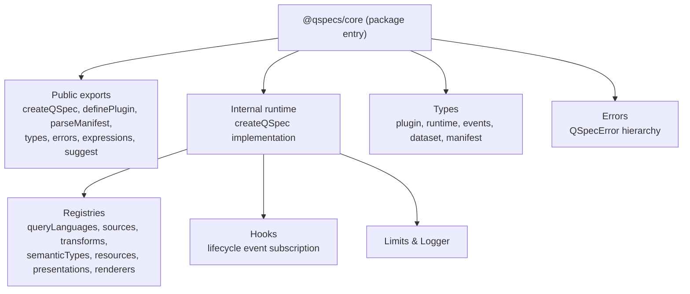

**Diagram sources**

- [index.ts:1-106](file://packages/core/src/index.ts#L1-L106)
- [runtime.ts:44-171](file://packages/core/src/internal/runtime.ts#L44-L171)
- [plugin.ts:11-137](file://packages/core/src/types/plugin.ts#L11-L137)
- [events.ts:1-74](file://packages/core/src/types/events.ts#L1-L74)
- [runtime-types.ts:7-88](file://packages/core/src/types/runtime.ts#L7-L88)

**Section sources**

- [index.ts:1-106](file://packages/core/src/index.ts#L1-L106)
- [public-api.md:30-60](file://docs/public-api.md#L30-L60)

## Core Components

Stable public APIs exposed by @qspecs/core include:

- Runtime creation: createQSpec(options)
- Manifest helpers: defineManifest(), parseManifest(input, options), definePlugin()
- Expression subsystem: evaluateExpression(), normalizeExpression(), related types
- Suggestion helper: suggest()
- JSON safety helpers: isPlainObject(), isUnsafeKey()
- Types and constants: Dataset, Field, RawQueryResult, QSpecPlugin, QSpecPluginAPI, Transform, DataSource, QueryLanguage, Renderer, PresentationType, ResourceKind, ExecutionContext, QSpecResult, PreparedResource, QSpecLimits, DEFAULT_LIMITS, QSpecEventMap, HookRegistry, QSpecLogger
- Errors: QSpecError and all subclasses

What is NOT public:

- Anything under packages/core/src/internal/* is internal and must not be imported by third parties
- Internal registries, hooks implementation, prepare pipeline, and other runtime internals are not part of the public contract

**Section sources**

- [index.ts:1-106](file://packages/core/src/index.ts#L1-L106)
- [public-api.md:10-28](file://docs/public-api.md#L10-L28)

## Architecture Overview

The public boundary centers on createQSpec(). Plugins register capabilities via QSpecPluginAPI during setup, which runs when ready() is awaited or implicitly before prepare()/execute().

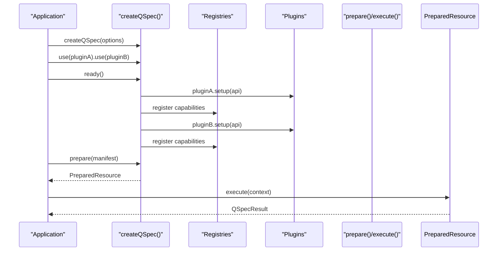

**Diagram sources**

- [runtime.ts:44-171](file://packages/core/src/internal/runtime.ts#L44-L171)
- [plugins.md:133-164](file://docs/plugins.md#L133-L164)

**Section sources**

- [runtime.ts:44-171](file://packages/core/src/internal/runtime.ts#L44-L171)
- [plugins.md:133-164](file://docs/plugins.md#L133-L164)

## Detailed Component Analysis

### createQSpec and Lifecycle

- createQSpec(options) returns a QSpec instance with methods: use(), ready(), prepare(), execute(), on(), dispose(), and limits
- use() queues plugins; ready() drains the queue in order, running each plugin’s setup once
- prepare() validates and prepares a manifest into a PreparedResource; execute() runs it with an ExecutionContext
- dispose() calls dispose() on any registered data source that implements it

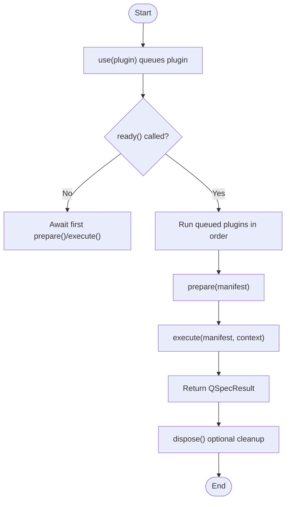

**Diagram sources**

- [runtime.ts:44-171](file://packages/core/src/internal/runtime.ts#L44-L171)
- [runtime-types.ts:72-88](file://packages/core/src/types/runtime.ts#L72-L88)

**Section sources**

- [runtime.ts:44-171](file://packages/core/src/internal/runtime.ts#L44-L171)
- [runtime-types.ts:72-88](file://packages/core/src/types/runtime.ts#L72-L88)

### Plugin Interface Contract

Plugins implement QSpecPlugin with:

- name: unique identifier used to detect duplicate installation
- version?: declared but not enforced at runtime
- setup(api): registers capabilities into one of seven registries

QSpecPluginAPI provides:

- queryLanguages, sources, transforms, semanticTypes, resources, presentations, renderers (all Registry<T>)
- hooks.on: subscribe to lifecycle events (read-only; plugins cannot emit)
- logger: configured QSpecLogger
- limits: resolved QSpecLimits captured at runtime creation

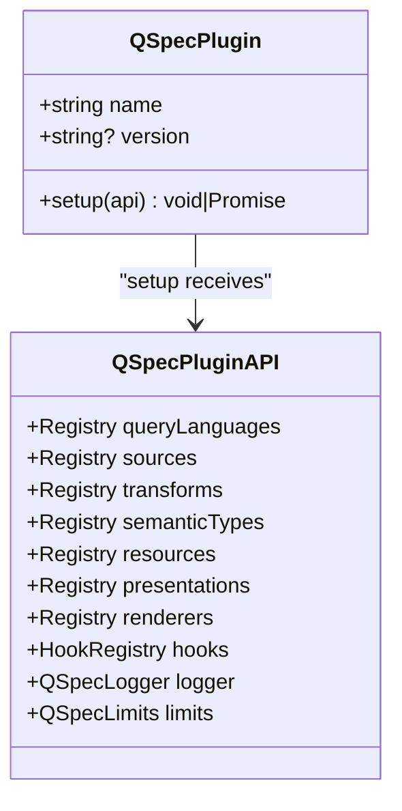

**Diagram sources**

- [plugin.ts:119-137](file://packages/core/src/types/plugin.ts#L119-L137)
- [plugins.md:62-93](file://docs/plugins.md#L62-L93)

**Section sources**

- [plugin.ts:11-137](file://packages/core/src/types/plugin.ts#L11-L137)
- [plugins.md:35-93](file://docs/plugins.md#L35-L93)

### Registries and Capability Registration

- Each capability type has a Registry<T> with register(name, impl), replace(name, impl), get(name), has(name), list()
- register throws on empty name or duplicate name; replace silently overwrites
- Installation order determines override precedence: later plugins can replace earlier registrations

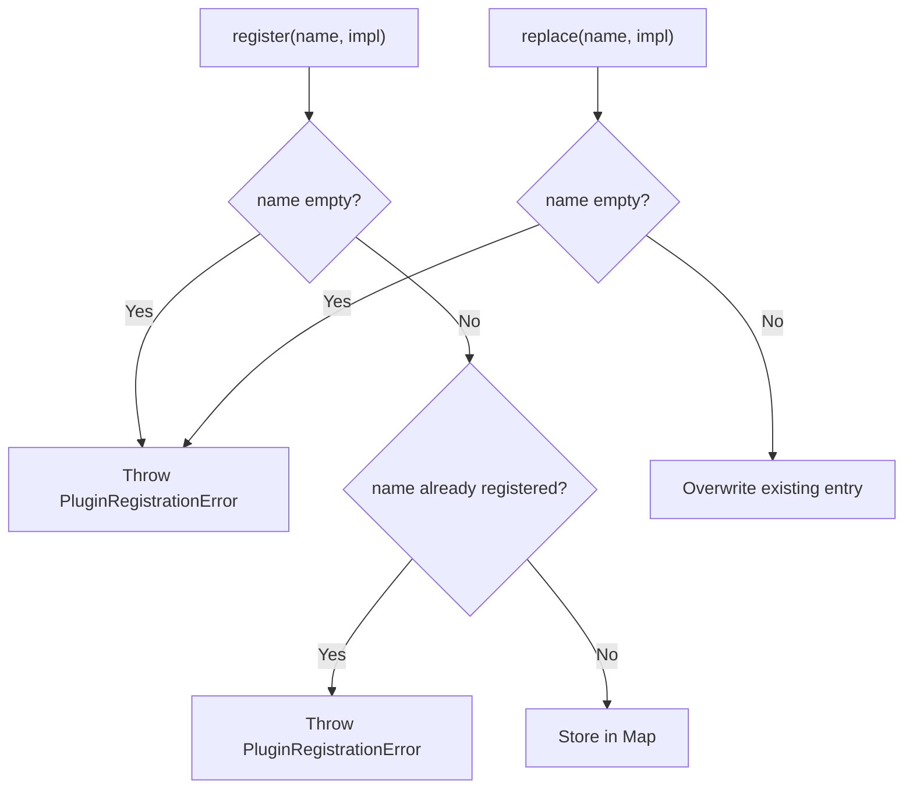

**Diagram sources**

- [plugins.md:94-131](file://docs/plugins.md#L94-L131)

**Section sources**

- [plugins.md:94-131](file://docs/plugins.md#L94-L131)

### Data Sources and Query Languages

- DataSource.execute(query, context) returns RawQueryResult with positional rows and columns
- DataSourceContext includes executionId, signal?, locale?, timezone?, logger
- QueryLanguage.compile(query, context) produces a compiled query shape for the source
- QueryCompileContext includes source, bindings, parameters
- Optional validate(query) for static checks during prepare()

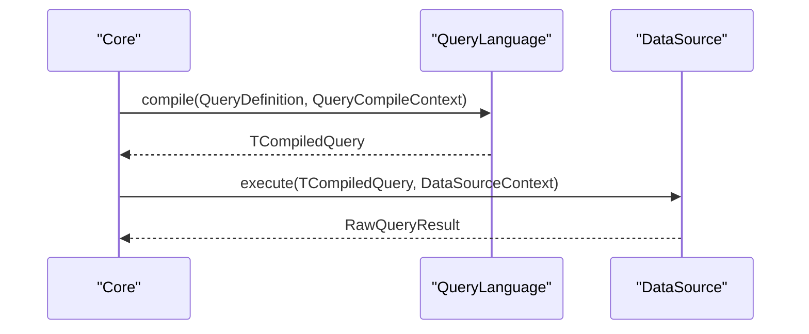

**Diagram sources**

- [plugin.ts:11-56](file://packages/core/src/types/plugin.ts#L11-L56)
- [dataset.ts:60-75](file://packages/core/src/types/dataset.ts#L60-L75)

**Section sources**

- [plugin.ts:11-56](file://packages/core/src/types/plugin.ts#L11-L56)
- [dataset.ts:60-75](file://packages/core/src/types/dataset.ts#L60-L75)

### Transforms and Result Transformation Patterns

- Transform.execute(dataset, spec, context) returns a new Dataset (never mutate input)
- Transform.describe(fields, spec) projects resulting fields for static validation
- Transform.validate(spec, fields?) returns issues or throws
- Context includes executionId, parameters, signal?

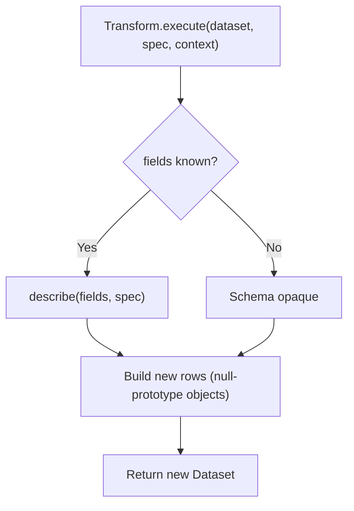

**Diagram sources**

- [plugin-authoring.md:11-114](file://docs/plugin-authoring.md#L11-L114)
- [plugin.ts:58-79](file://packages/core/src/types/plugin.ts#L58-L79)

**Section sources**

- [plugin-authoring.md:11-114](file://docs/plugin-authoring.md#L11-L114)
- [plugin.ts:58-79](file://packages/core/src/types/plugin.ts#L58-L79)

### Execution Contexts and Results

- ExecutionContext: parameters, signal?, locale?, timezone?, metadata?
- QSpecResult: data (Dataset), presentation?, meta (ExecutionMetadata)
- ExecutionMetadata: executionId, durationMs, rowCount, query? (source, language, durationMs?)
- PreparedResource: manifest, kind, name, projectedFields?, execute(context)

```mermaid
classDiagram
class ExecutionContext {
+Record~string, unknown~? parameters
+AbortSignal? signal
+string? locale
+string? timezone
+Record~string, unknown~? metadata
}
class QSpecResult {
+Dataset data
+PresentationDefinition? presentation
+ExecutionMetadata meta
}
class ExecutionMetadata {
+string executionId
+number durationMs
+number rowCount
+{source : string, language : string, durationMs? : number}? query
}
class PreparedResource {
+QSpecManifest manifest
+string kind
+string name
+string[]? projectedFields
+execute(context) Promise~QSpecResult~
}
QSpecResult --> ExecutionMetadata : "contains"
PreparedResource --> QSpecResult : "produces"
```

**Diagram sources**

- [runtime-types.ts:36-70](file://packages/core/src/types/runtime.ts#L36-L70)

**Section sources**

- [runtime-types.ts:36-70](file://packages/core/src/types/runtime.ts#L36-L70)

### Event Hooks and Observability

- HookRegistry.on(event, handler) subscribes to lifecycle events
- Events include manifest parsing, validation stages, query compile/execute, transform lifecycle, execution complete/error
- Payloads exclude sensitive data (bound values, statements, connection details)

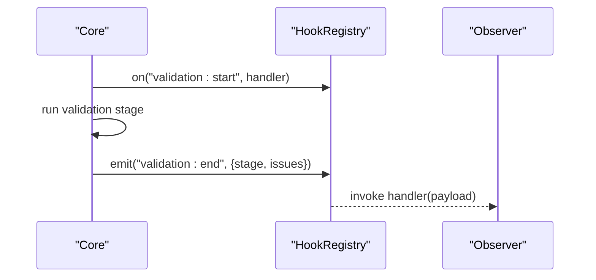

**Diagram sources**

- [events.ts:14-65](file://packages/core/src/types/events.ts#L14-L65)
- [runtime.ts:47-49](file://packages/core/src/internal/runtime.ts#L47-L49)

**Section sources**

- [events.ts:14-65](file://packages/core/src/types/events.ts#L14-L65)
- [runtime.ts:47-49](file://packages/core/src/internal/runtime.ts#L47-L49)

### Error Handling Mechanisms

- QSpecError base class with code, path?, details?
- Aggregate errors carry multiple QSpecIssue entries
- Specific error classes cover manifest validation, parameter validation, dataset validation, presentation errors, unsupported API version, unknown resource/query/language/source, compilation/execution failures, transform failures, plugin registration failures, aborts, and limit exceeded
- formatPath(path) renders structured paths for diagnostics

```mermaid
classDiagram
class QSpecError {
+string code
+PathSegment[]? path
+unknown? details
}
class ManifestValidationError
class ParameterValidationError
class DatasetValidationError
class PresentationError
class UnsupportedApiVersionError
class UnknownResourceKindError
class UnknownQueryLanguageError
class UnknownDataSourceError
class QueryCompilationError
class QueryExecutionError
class TransformError
class PluginRegistrationError
class QSpecAbortError
class LimitExceededError
QSpecError <|-- ManifestValidationError
QSpecError <|-- ParameterValidationError
QSpecError <|-- DatasetValidationError
QSpecError <|-- PresentationError
QSpecError <|-- UnsupportedApiVersionError
QSpecError <|-- UnknownResourceKindError
QSpecError <|-- UnknownQueryLanguageError
QSpecError <|-- UnknownDataSourceError
QSpecError <|-- QueryCompilationError
QSpecError <|-- QueryExecutionError
QSpecError <|-- TransformError
QSpecError <|-- PluginRegistrationError
QSpecError <|-- QSpecAbortError
QSpecError <|-- LimitExceededError
```

**Diagram sources**

- [errors.ts:44-180](file://packages/core/src/errors.ts#L44-L180)

**Section sources**

- [errors.ts:44-180](file://packages/core/src/errors.ts#L44-L180)

### Manifest Parsing and Safety

- defineManifest(manifest) is an identity helper for typing and autocomplete
- parseManifest(input, options) parses JSON strings with maxBytes limit, rejects unsafe keys, and returns a typed manifest
- Enforces prototype-pollution resistance by rejecting unsafe keys

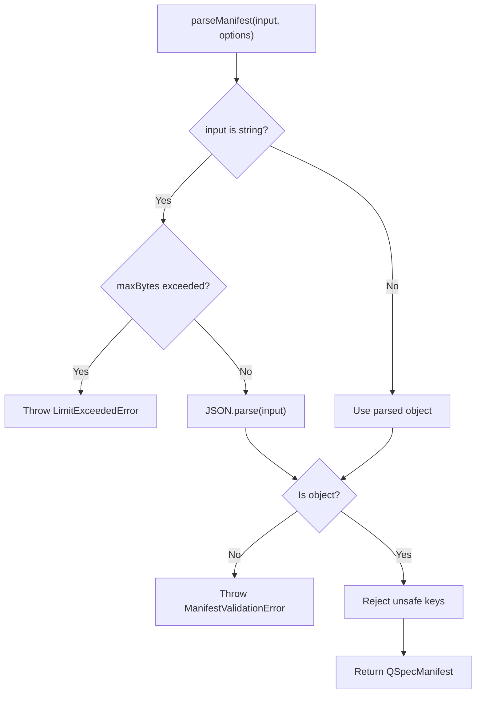

**Diagram sources**

- [define.ts:10-123](file://packages/core/src/define.ts#L10-L123)

**Section sources**

- [define.ts:10-123](file://packages/core/src/define.ts#L10-L123)

## Dependency Analysis

Public APIs depend on well-defined types and do not expose internal modules. Third-party plugins interact only through:

- QSpecPluginAPI registries
- QSpec lifecycle methods
- Public types and errors

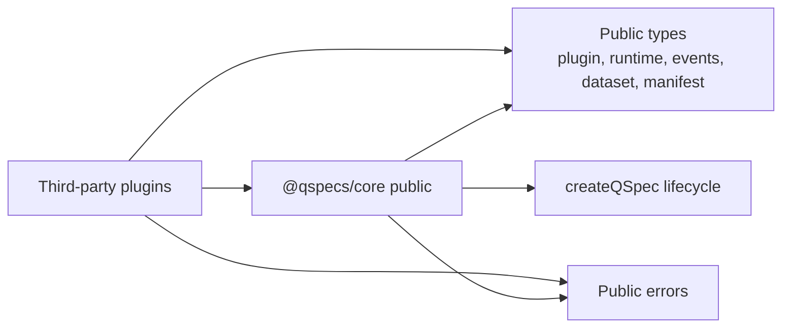

**Diagram sources**

- [index.ts:1-106](file://packages/core/src/index.ts#L1-L106)
- [plugin.ts:11-137](file://packages/core/src/types/plugin.ts#L11-L137)
- [runtime-types.ts:7-88](file://packages/core/src/types/runtime.ts#L7-L88)
- [events.ts:1-74](file://packages/core/src/types/events.ts#L1-L74)
- [dataset.ts:1-75](file://packages/core/src/types/dataset.ts#L1-L75)
- [manifest.ts:1-40](file://packages/core/src/types/manifest.ts#L1-L40)

**Section sources**

- [index.ts:1-106](file://packages/core/src/index.ts#L1-L106)

## Performance Considerations

- Limits govern performance and safety: maxRows, maxTransforms, maxManifestBytes, maxExpressionDepth, queryTimeoutMs
- Expressions have depth limits to prevent deep recursion
- Transforms must return new datasets and avoid mutation to enable deterministic pipelines
- Data sources should check AbortSignal early to avoid wasted work
- Registries use Maps to support safe key names and efficient lookups

[No sources needed since this section provides general guidance]

## Troubleshooting Guide

Common issues and how to handle them:

- Duplicate plugin registration: use register() to fail fast on collisions; use replace() to intentionally override
- Setup failures poison the runtime; subsequent ready() calls rethrow the original error
- Manifest parsing errors: inspect QSpecIssue arrays and formatPath for precise locations
- Query execution errors: distinguish compilation vs execution failures using specific error classes
- Aborts: catch QSpecAbortError when signals fire
- Limits exceeded: catch LimitExceededError and adjust limits or inputs

**Section sources**

- [runtime.ts:83-115](file://packages/core/src/internal/runtime.ts#L83-L115)
- [errors.ts:74-180](file://packages/core/src/errors.ts#L74-L180)
- [define.ts:33-113](file://packages/core/src/define.ts#L33-L113)

## Conclusion

For long-term compatibility, rely exclusively on:

- createQSpec(), definePlugin(), parseManifest(), defineManifest()
- Public types from @qspecs/core (plugin, runtime, events, dataset, manifest)
- The full QSpecError hierarchy and QSpecIssue structure
- Registry-based registration via QSpecPluginAPI
- Lifecycle hooks via on() for observability

Do not import from internal paths or rely on undocumented behavior. Follow the contracts for transforms, data sources, query languages, and renderers to ensure stability across versions.

[No sources needed since this section summarizes without analyzing specific files]
