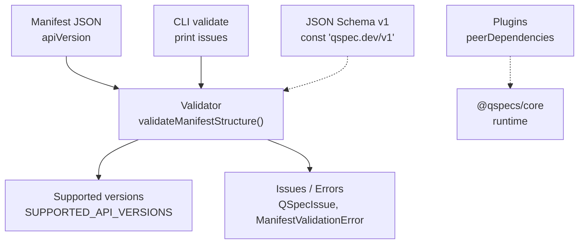
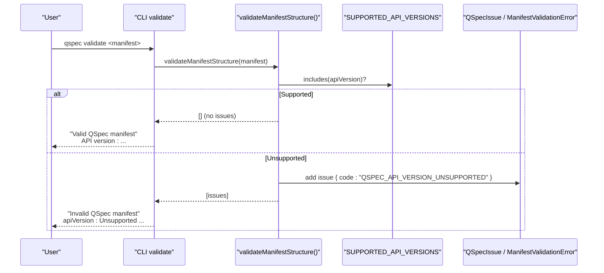
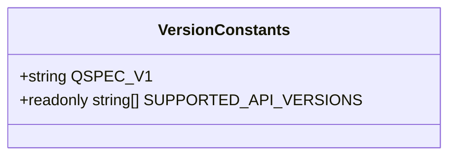
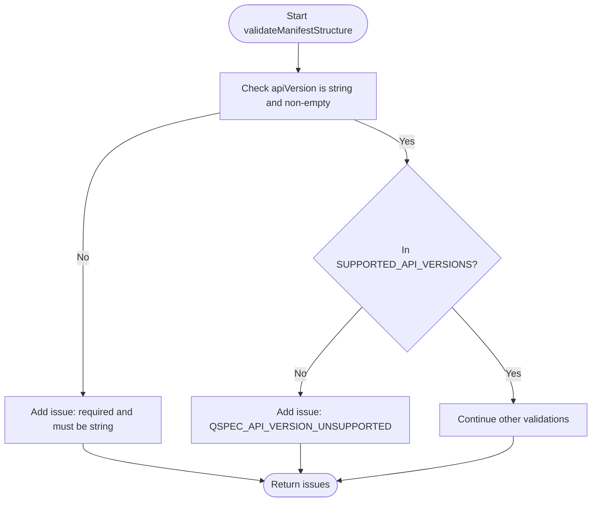
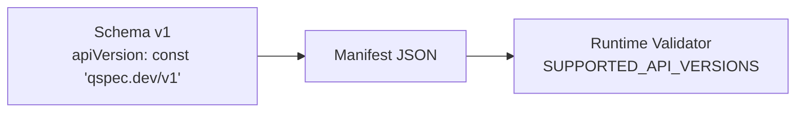
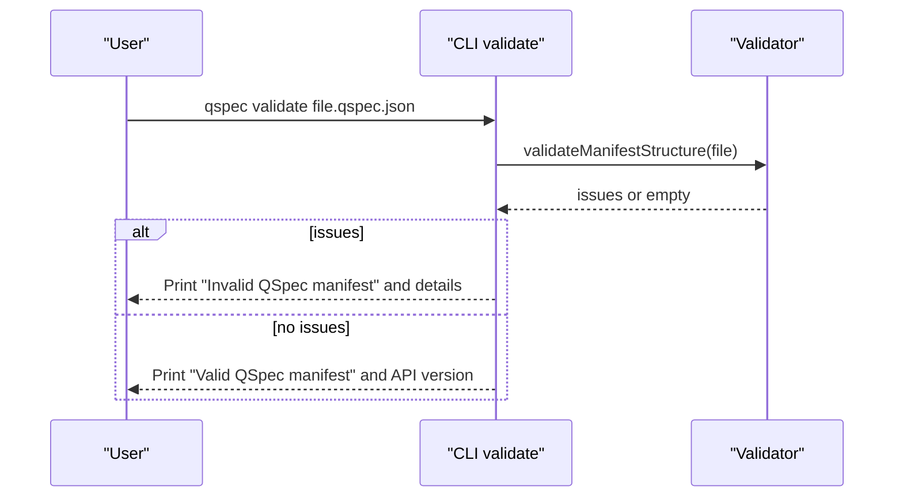
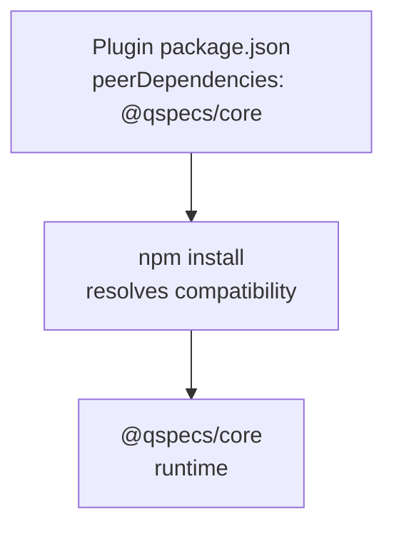
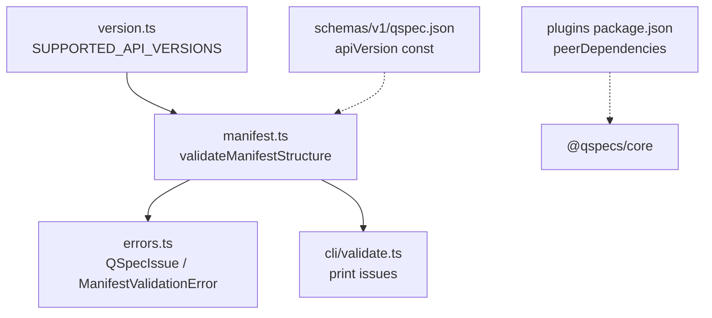

# Specification Versioning

<cite>
**Referenced Files in This Document**
- [version.ts](file://packages/core/src/version.ts)
- [manifest validator](file://packages/core/src/internal/validate/manifest.ts)
- [errors module](file://packages/core/src/errors.ts)
- [v1 JSON Schema](file://schemas/v1/qspec.json)
- [CLI validate command](file://packages/cli/src/commands/validate.ts)
- [example manifest](file://examples/01-complete-manifest.qspec.json)
- [unsupported-version fixture](file://fixtures/invalid/unsupported-version.qspec.json)
- [SQL plugin package.json](file://packages/sql/package.json)
- [Transforms plugin package.json](file://packages/transforms/package.json)
- [Charts plugin package.json](file://packages/charts/package.json)
- [Core package.json](file://packages/core/package.json)
</cite>

## Table of Contents

1. Introduction
2. Project Structure
3. Core Components
4. Architecture Overview
5. Detailed Component Analysis
6. Dependency Analysis
7. Performance Considerations
8. Troubleshooting Guide
9. Conclusion

## Introduction

This document explains QSpec’s specification versioning system with a focus on the apiVersion field, how it differs from npm package versions, and how the runtime enforces supported versions through SUPPORTED_API_VERSIONS. It also covers backward compatibility rules, migration strategies between specification versions, plugin version compatibility via peerDependencies, and practical examples of version declarations and error handling. Finally, it clarifies the distinction between specification versions (document shape and semantics) and runtime versions (npm packages), with concrete references to validation logic in the codebase.

## Project Structure

QSpec’s versioning is implemented across a small set of focused files:

- A constant array declares which specification versions the runtime supports.
- The manifest validator checks apiVersion against that list and emits structured issues.
- A JSON Schema for v1 pins the allowed apiVersion value at the schema level.
- CLI commands surface validation results to users.
- Plugin packages declare compatibility with @qspecs/core using npm peerDependencies.

**Diagram sources**

- [manifest validator:492-532](file://packages/core/src/internal/validate/manifest.ts#L492-L532)
- [version.ts:1-5](file://packages/core/src/version.ts#L1-L5)
- [v1 JSON Schema:7-12](file://schemas/v1/qspec.json#L7-L12)
- [CLI validate:216-261](file://packages/cli/src/commands/validate.ts#L216-L261)

**Section sources**

- [version.ts:1-5](file://packages/core/src/version.ts#L1-L5)
- [manifest validator:492-532](file://packages/core/src/internal/validate/manifest.ts#L492-L532)
- [v1 JSON Schema:7-12](file://schemas/v1/qspec.json#L7-L12)
- [CLI validate:216-261](file://packages/cli/src/commands/validate.ts#L216-L261)

## Core Components

- Specification version constants and registry:
  - QSPEC_V1 defines the current specification version string.
  - SUPPORTED_API_VERSIONS enumerates all specification versions the runtime accepts.
- Manifest structure validator:
  - Checks apiVersion presence, type, and membership in SUPPORTED_API_VERSIONS.
  - Emits a structured issue with code QSPEC_API_VERSION_UNSUPPORTED when unsupported.
  - Aggregates multiple issues into a single ManifestValidationError.
- JSON Schema v1:
  - Declares apiVersion as a const equal to qspec.dev/v1, providing IDE/schema-level enforcement.
- CLI validation:
  - Runs structural validation and prints issues; also prints accepted apiVersion on success.

Practical example manifests:

- Valid v1 manifest uses apiVersion: "qspec.dev/v1".
- Invalid fixture demonstrates an unsupported apiVersion ("qspec.dev/v2") rejected by validation.

**Section sources**

- [version.ts:1-5](file://packages/core/src/version.ts#L1-L5)
- [manifest validator:492-532](file://packages/core/src/internal/validate/manifest.ts#L492-L532)
- [v1 JSON Schema:7-12](file://schemas/v1/qspec.json#L7-L12)
- [CLI validate:216-261](file://packages/cli/src/commands/validate.ts#L216-L261)
- [example manifest:1-10](file://examples/01-complete-manifest.qspec.json#L1-L10)
- [unsupported-version fixture:1-2](file://fixtures/invalid/unsupported-version.qspec.json#L1-L2)

## Architecture Overview

The runtime validates manifests before any plugin or data source is involved. The flow ensures early failure on unsupported specification versions, giving clear diagnostics.

**Diagram sources**

- [CLI validate:216-261](file://packages/cli/src/commands/validate.ts#L216-L261)
- [manifest validator:492-532](file://packages/core/src/internal/validate/manifest.ts#L492-L532)
- [version.ts:1-5](file://packages/core/src/version.ts#L1-L5)

## Detailed Component Analysis

### Specification Version Registry

- Purpose: Centralize the list of specification versions the runtime can execute.
- Design: A readonly array enables future expansion to support multiple versions during migration windows without changing call sites.
- Current state: Only qspec.dev/v1 is supported.

**Diagram sources**

- [version.ts:1-5](file://packages/core/src/version.ts#L1-L5)

**Section sources**

- [version.ts:1-5](file://packages/core/src/version.ts#L1-L5)

### Manifest Validation and Version Checking

- Behavior:
  - Ensures apiVersion is present and a non-empty string.
  - Rejects values not included in SUPPORTED_API_VERSIONS.
  - Emits a structured issue with code QSPEC_API_VERSION_UNSUPPORTED.
  - Aggregates all issues and throws ManifestValidationError if any exist.
- Error model:
  - Issues are collected first to provide full feedback.
  - UnsupportedApiVersionError exists but is not constructed by application code; instead, the condition appears as an issue within ManifestValidationError.

**Diagram sources**

- [manifest validator:492-532](file://packages/core/src/internal/validate/manifest.ts#L492-L532)

**Section sources**

- [manifest validator:492-532](file://packages/core/src/internal/validate/manifest.ts#L492-L532)
- [errors module:74-107](file://packages/core/src/errors.ts#L74-L107)

### JSON Schema Enforcement for v1

- The v1 schema pins apiVersion to qspec.dev/v1 using a const constraint, enabling tooling and editors to enforce the correct value statically.
- This complements runtime validation and helps catch mis-typed versions earlier.

**Diagram sources**

- [v1 JSON Schema:7-12](file://schemas/v1/qspec.json#L7-L12)
- [manifest validator:492-532](file://packages/core/src/internal/validate/manifest.ts#L492-L532)

**Section sources**

- [v1 JSON Schema:7-12](file://schemas/v1/qspec.json#L7-L12)

### CLI Integration and User Feedback

- The CLI runs structural validation and prints issues. On success, it reports the resource’s apiVersion, kind, and name.
- When an unsupported version is declared, the CLI surfaces the structured issue message produced by the validator.

**Diagram sources**

- [CLI validate:216-261](file://packages/cli/src/commands/validate.ts#L216-L261)
- [manifest validator:492-532](file://packages/core/src/internal/validate/manifest.ts#L492-L532)

**Section sources**

- [CLI validate:216-261](file://packages/cli/src/commands/validate.ts#L216-L261)

### Backward Compatibility and Migration Strategy

- Rule: Once a specification version is published, it must not change in a breaking way. Breaking changes require a new apiVersion.
- Migration window: Because SUPPORTED_API_VERSIONS is an array, a future runtime can accept both v1 and v2 simultaneously, allowing gradual migration without forcing all manifests to update atomically.
- Current state: Only v1 is supported; no migration command exists yet.

**Section sources**

- [version.ts:1-5](file://packages/core/src/version.ts#L1-L5)
- [manifest validator:492-532](file://packages/core/src/internal/validate/manifest.ts#L492-L532)

### Plugin Version Compatibility via peerDependencies

- Mechanism: Plugins declare compatibility with @qspecs/core using npm’s peerDependencies. This is enforced by npm at install time, not by QSpec’s runtime at .use() time.
- Example: Several plugins pin exact versions of @qspecs/core in their peerDependencies.
- Note: The QSpecPlugin interface includes an optional version field, but the runtime does not read or enforce it; compatibility relies on npm’s peerDependency resolution.

**Diagram sources**

- [SQL plugin package.json:33-35](file://packages/sql/package.json#L33-L35)
- [Transforms plugin package.json:33-35](file://packages/transforms/package.json#L33-L35)
- [Charts plugin package.json:33-35](file://packages/charts/package.json#L33-L35)
- [Core package.json:1-37](file://packages/core/package.json#L1-L37)

**Section sources**

- [SQL plugin package.json:33-35](file://packages/sql/package.json#L33-L35)
- [Transforms plugin package.json:33-35](file://packages/transforms/package.json#L33-L35)
- [Charts plugin package.json:33-35](file://packages/charts/package.json#L33-L35)
- [Core package.json:1-37](file://packages/core/package.json#L1-L37)

### Practical Examples and Error Handling

- Valid declaration: Use apiVersion: "qspec.dev/v1" in your manifest.
- Unsupported declaration: Using apiVersion: "qspec.dev/v2" triggers a validation failure with a clear message indicating supported versions.
- Error aggregation: Multiple issues are reported together; unsupported apiVersion is one such issue under the same error umbrella.

Examples in this repository:

- A valid v1 manifest demonstrates correct usage.
- An invalid fixture demonstrates rejection of an unsupported version.

**Section sources**

- [example manifest:1-10](file://examples/01-complete-manifest.qspec.json#L1-L10)
- [unsupported-version fixture:1-2](file://fixtures/invalid/unsupported-version.qspec.json#L1-L2)
- [manifest validator:492-532](file://packages/core/src/internal/validate/manifest.ts#L492-L532)

## Dependency Analysis

Specification versioning depends on:

- The version registry (constants).
- The validator (consumes the registry and emits issues).
- The CLI (invokes the validator and renders output).
- The JSON Schema (statically constrains v1).
- Plugin packages (declare compatibility with core via peerDependencies).

**Diagram sources**

- [version.ts:1-5](file://packages/core/src/version.ts#L1-L5)
- [manifest validator:492-532](file://packages/core/src/internal/validate/manifest.ts#L492-L532)
- [errors module:74-107](file://packages/core/src/errors.ts#L74-L107)
- [CLI validate:216-261](file://packages/cli/src/commands/validate.ts#L216-L261)
- [v1 JSON Schema:7-12](file://schemas/v1/qspec.json#L7-L12)
- [SQL plugin package.json:33-35](file://packages/sql/package.json#L33-L35)

**Section sources**

- [version.ts:1-5](file://packages/core/src/version.ts#L1-L5)
- [manifest validator:492-532](file://packages/core/src/internal/validate/manifest.ts#L492-L532)
- [errors module:74-107](file://packages/core/src/errors.ts#L74-L107)
- [CLI validate:216-261](file://packages/cli/src/commands/validate.ts#L216-L261)
- [v1 JSON Schema:7-12](file://schemas/v1/qspec.json#L7-L12)
- [SQL plugin package.json:33-35](file://packages/sql/package.json#L33-L35)

## Performance Considerations

- Early validation: apiVersion is checked before any plugin or data source work begins, minimizing wasted effort on incompatible manifests.
- Issue aggregation: Collecting all issues avoids repeated parsing/validation passes and provides comprehensive feedback in a single run.
- Static schema constraints: Using a JSON Schema const for apiVersion reduces runtime checks and improves developer experience.

[No sources needed since this section provides general guidance]

## Troubleshooting Guide

Common issues and resolutions:

- Unsupported apiVersion:
  - Symptom: Validation fails with a message indicating the runtime supports only specific versions.
  - Cause: Manifest declares an apiVersion not in SUPPORTED_API_VERSIONS.
  - Resolution: Update the manifest to use a supported version (currently qspec.dev/v1).
- Missing or invalid apiVersion:
  - Symptom: Validation reports that apiVersion is required and must be a string.
  - Cause: Field missing or wrong type.
  - Resolution: Add a valid apiVersion string to the manifest.
- Confusion between specification and npm versions:
  - Symptom: Assuming npm package versions control manifest compatibility.
  - Clarification: apiVersion controls manifest compatibility; npm peerDependencies control plugin/runtime package compatibility.

Where to look in the code:

- Version registry and supported list.
- Manifest validator logic for apiVersion checks and issue emission.
- Error types and codes used for diagnostics.
- CLI output formatting for validation results.

**Section sources**

- [version.ts:1-5](file://packages/core/src/version.ts#L1-L5)
- [manifest validator:492-532](file://packages/core/src/internal/validate/manifest.ts#L492-L532)
- [errors module:74-107](file://packages/core/src/errors.ts#L74-L107)
- [CLI validate:216-261](file://packages/cli/src/commands/validate.ts#L216-L261)

## Conclusion

QSpec separates specification versioning from npm package versions. The apiVersion field identifies the manifest’s specification version, validated against SUPPORTED_API_VERSIONS at runtime and constrained by the v1 JSON Schema. Backward compatibility is guaranteed per specification version, and migration paths can leverage multi-version support via the array-based registry. Plugin compatibility is managed through npm peerDependencies rather than runtime checks. For robust development, always ensure apiVersion matches a supported specification version and align plugin peerDependencies with the installed @qspecs/core version.

[No sources needed since this section summarizes without analyzing specific files]
