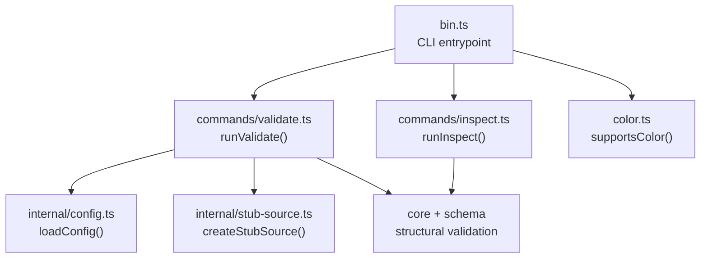
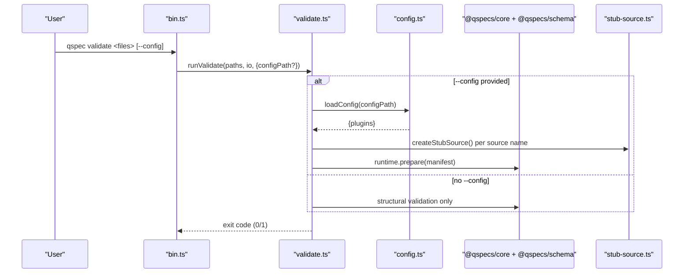
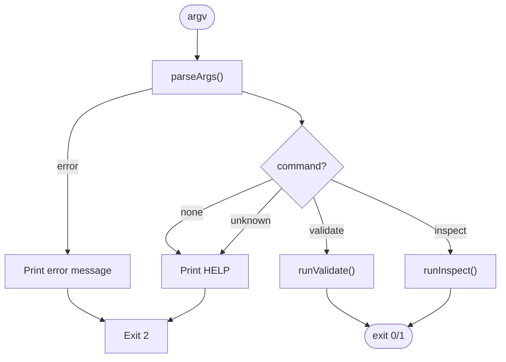
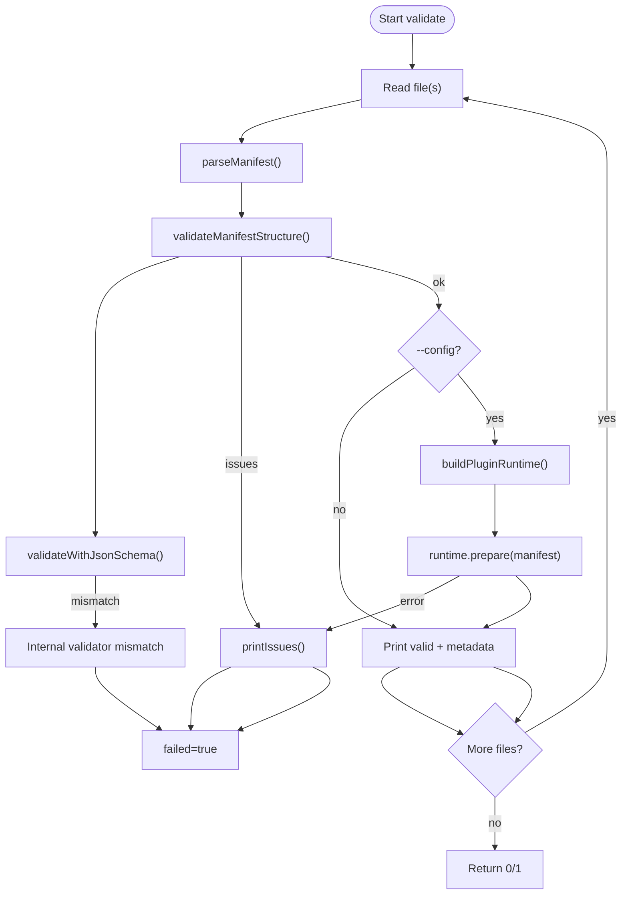
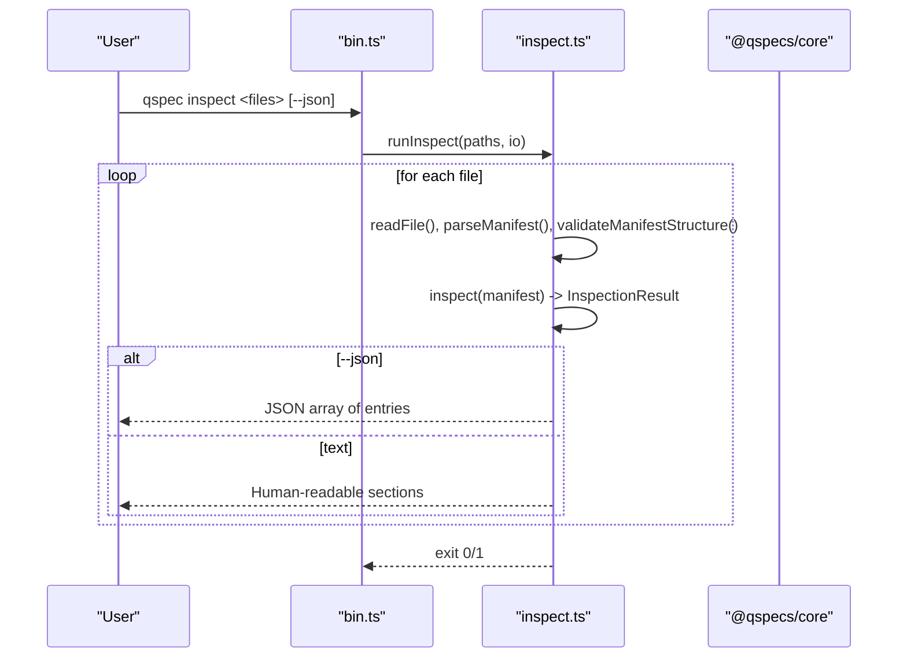
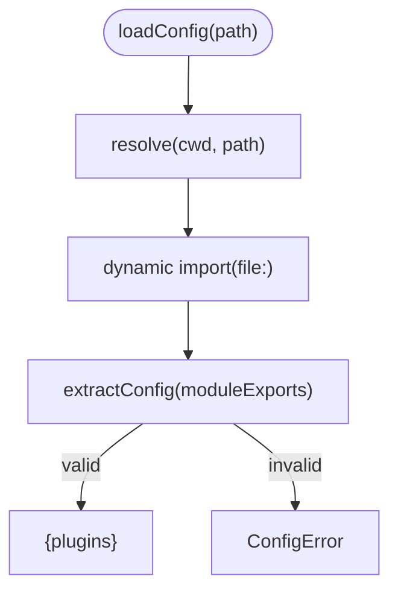
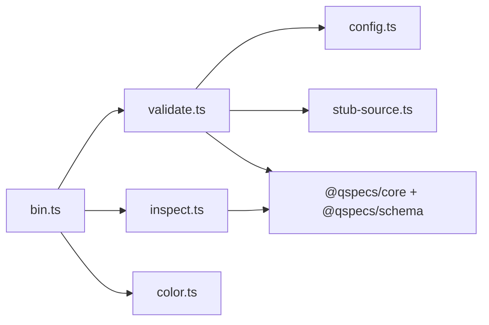

# CLI Tools

<cite>
**Referenced Files in This Document**
- [bin.ts](file://packages/cli/src/bin.ts)
- [validate.ts](file://packages/cli/src/commands/validate.ts)
- [inspect.ts](file://packages/cli/src/commands/inspect.ts)
- [config.ts](file://packages/cli/src/internal/config.ts)
- [stub-source.ts](file://packages/cli/src/internal/stub-source.ts)
- [color.ts](file://packages/cli/src/color.ts)
- [qspec.json](file://schemas/v1/qspec.json)
- [cli.md](file://docs/cli.md)
- [qspec.config.js](file://examples/qspec.config.js)
</cite>

## Table of Contents

1. Introduction
2. Project Structure
3. Core Components
4. Architecture Overview
5. Detailed Component Analysis
6. Dependency Analysis
7. Performance Considerations
8. Troubleshooting Guide
9. Conclusion
10. Appendices

## Introduction

This document explains QSpec’s command-line interface tools, focusing on the qspec binary commands validate and inspect. It covers:

- What each command checks and how it reports results
- Structural validation versus plugin-aware validation using a configuration file
- Inspection capabilities for manifest structure and dependencies
- Command-line options, configuration file format, and integration with development workflows
- Exit codes, output formats, error reporting, CI/CD usage, automated validation, and performance considerations for large manifest collections

## Project Structure

The CLI is implemented as a small Node.js entry point that parses arguments and delegates to two command modules. Supporting internals handle configuration loading, colorized output, and a stub data source used during plugin-aware validation.

**Diagram sources**

- [bin.ts:1-149](file://packages/cli/src/bin.ts#L1-L149)
- [validate.ts:1-262](file://packages/cli/src/commands/validate.ts#L1-L262)
- [inspect.ts:1-327](file://packages/cli/src/commands/inspect.ts#L1-L327)
- [config.ts:1-124](file://packages/cli/src/internal/config.ts#L1-L124)
- [stub-source.ts:1-33](file://packages/cli/src/internal/stub-source.ts#L1-L33)
- [color.ts:1-18](file://packages/cli/src/color.ts#L1-L18)

**Section sources**

- [bin.ts:1-149](file://packages/cli/src/bin.ts#L1-L149)
- [validate.ts:1-262](file://packages/cli/src/commands/validate.ts#L1-L262)
- [inspect.ts:1-327](file://packages/cli/src/commands/inspect.ts#L1-L327)
- [config.ts:1-124](file://packages/cli/src/internal/config.ts#L1-L124)
- [stub-source.ts:1-33](file://packages/cli/src/internal/stub-source.ts#L1-L33)
- [color.ts:1-18](file://packages/cli/src/color.ts#L1-L18)

## Core Components

- Entry point and argument parsing: bin.ts
- Validate command: commands/validate.ts
- Inspect command: commands/inspect.ts
- Configuration loader: internal/config.ts
- Stub data source for plugin-aware validation: internal/stub-source.ts
- Color support: color.ts
- JSON Schema for manifests: schemas/v1/qspec.json

Key responsibilities:

- parseArgs handles flags and positionals; dispatches to validate or inspect
- validate performs structural checks and optional plugin-aware prepare()
- inspect reads static content and prints resource identity, parameters, query, dataset, and presentation references
- config loads a user-provided module exporting plugins
- stub-source ensures prepare() can resolve sources without executing queries
- color provides ANSI formatting when supported

**Section sources**

- [bin.ts:1-149](file://packages/cli/src/bin.ts#L1-L149)
- [validate.ts:1-262](file://packages/cli/src/commands/validate.ts#L1-L262)
- [inspect.ts:1-327](file://packages/cli/src/commands/inspect.ts#L1-L327)
- [config.ts:1-124](file://packages/cli/src/internal/config.ts#L1-L124)
- [stub-source.ts:1-33](file://packages/cli/src/internal/stub-source.ts#L1-L33)
- [color.ts:1-18](file://packages/cli/src/color.ts#L1-L18)
- [qspec.json:1-143](file://schemas/v1/qspec.json#L1-L143)

## Architecture Overview

The CLI follows a simple pipeline:

- Parse argv and route to validate or inspect
- For validate: read files, parse JSON, run structural validators, optionally load config and run prepare() with stub data sources
- For inspect: read files, parse JSON, run structural validator, render human-readable or JSON summary

**Diagram sources**

- [bin.ts:55-114](file://packages/cli/src/bin.ts#L55-L114)
- [validate.ts:158-262](file://packages/cli/src/commands/validate.ts#L158-L262)
- [config.ts:94-124](file://packages/cli/src/internal/config.ts#L94-L124)
- [stub-source.ts:15-33](file://packages/cli/src/internal/stub-source.ts#L15-L33)

## Detailed Component Analysis

### CLI Entry Point (bin.ts)

- Parses help, version, json, and config flags via parseArgs
- Routes unknown or missing commands to usage help and exit code 2
- Delegates to runValidate or runInspect with appropriate options
- Handles unrecognized flags by catching parseArgs errors and returning exit code 2

**Diagram sources**

- [bin.ts:55-114](file://packages/cli/src/bin.ts#L55-L114)

**Section sources**

- [bin.ts:1-149](file://packages/cli/src/bin.ts#L1-L149)

### Validate Command (validate.ts)

- Reads one or more manifest files
- Parses JSON and runs two structural validators (core and JSON Schema)
- If both pass and --config is provided, builds a plugin runtime:
  - Loads config module and installs plugins
  - Registers a stub DataSource for each referenced source name
  - Calls prepare() to catch plugin-specific issues
- Prints success or detailed issues with path hints and suggestions
- Returns exit code 0 if all pass, 1 if any fail

**Diagram sources**

- [validate.ts:158-262](file://packages/cli/src/commands/validate.ts#L158-L262)

**Section sources**

- [validate.ts:1-262](file://packages/cli/src/commands/validate.ts#L1-L262)

### Inspect Command (inspect.ts)

- Reads and structurally validates manifests
- Extracts resource identity, parameters, query, dataset fields, and presentation field references
- Renders either human-readable sections or a single JSON array (--json)
- Rejects --config flag with an explicit error and exit code 2

**Diagram sources**

- [inspect.ts:265-327](file://packages/cli/src/commands/inspect.ts#L265-L327)
- [bin.ts:96-113](file://packages/cli/src/bin.ts#L96-L113)

**Section sources**

- [inspect.ts:1-327](file://packages/cli/src/commands/inspect.ts#L1-L327)
- [bin.ts:96-113](file://packages/cli/src/bin.ts#L96-L113)

### Configuration Loader (config.ts)

- Resolves an explicit path against the current working directory
- Dynamically imports the module and extracts a plugins array from either a named export or a default export shaped like { plugins: [...] }
- Validates the shape and elements, throwing ConfigError on mismatches
- Does not perform implicit discovery; no fallback filenames or directory walking

**Diagram sources**

- [config.ts:94-124](file://packages/cli/src/internal/config.ts#L94-L124)
- [config.ts:45-92](file://packages/cli/src/internal/config.ts#L45-L92)

**Section sources**

- [config.ts:1-124](file://packages/cli/src/internal/config.ts#L1-L124)

### Stub Data Source (stub-source.ts)

- Provides a DataSource that exists solely so prepare() can resolve source names without connecting to a database
- execute() always throws with a specific message to ensure validation never executes queries
- Intentionally omits supportedLanguages to accept any language registered by plugins

**Section sources**

- [stub-source.ts:1-33](file://packages/cli/src/internal/stub-source.ts#L1-L33)

### Color Support (color.ts)

- Honors NO_COLOR and FORCE_COLOR environment variables
- Falls back to TTY detection
- Provides green, red, dim, bold helpers used by CLI output

**Section sources**

- [color.ts:1-18](file://packages/cli/src/color.ts#L1-L18)

## Dependency Analysis

- bin.ts depends on commands/validate.ts and commands/inspect.ts, plus color utilities
- validate.ts depends on core and schema packages for parsing/validation and on internal config and stub-source for plugin-aware mode
- inspect.ts depends on core for parsing/validation and reuses shared issue printing from validate.ts
- config.ts depends on Node’s path and URL utilities to dynamically import user modules
- All commands rely on color.ts for terminal-friendly output

**Diagram sources**

- [bin.ts:1-149](file://packages/cli/src/bin.ts#L1-L149)
- [validate.ts:1-262](file://packages/cli/src/commands/validate.ts#L1-L262)
- [inspect.ts:1-327](file://packages/cli/src/commands/inspect.ts#L1-L327)
- [config.ts:1-124](file://packages/cli/src/internal/config.ts#L1-L124)
- [stub-source.ts:1-33](file://packages/cli/src/internal/stub-source.ts#L1-L33)
- [color.ts:1-18](file://packages/cli/src/color.ts#L1-L18)

**Section sources**

- [bin.ts:1-149](file://packages/cli/src/bin.ts#L1-L149)
- [validate.ts:1-262](file://packages/cli/src/commands/validate.ts#L1-L262)
- [inspect.ts:1-327](file://packages/cli/src/commands/inspect.ts#L1-L327)
- [config.ts:1-124](file://packages/cli/src/internal/config.ts#L1-L124)
- [stub-source.ts:1-33](file://packages/cli/src/internal/stub-source.ts#L1-L33)
- [color.ts:1-18](file://packages/cli/src/color.ts#L1-L18)

## Performance Considerations

- Without --config, validate runs only structural checks and JSON Schema validation; this is fast and safe for large batches
- With --config, each manifest triggers prepare() after structural validation; avoid unnecessary plugin installations and keep plugin lists minimal
- The stub data source prevents actual I/O; however, prepare() may still perform non-trivial work depending on installed plugins
- For large manifest collections, prefer parallel invocations at the shell level or batch processing scripts while keeping memory usage reasonable
- Use inspect for quick static analysis; it does not load plugins and avoids prepare() overhead

[No sources needed since this section provides general guidance]

## Troubleshooting Guide

Common issues and resolutions:

- Unknown command or missing paths: usage help is printed and exit code is 2
- Unrecognized flags: parseArgs error is caught and reported; exit code 2
- Invalid JSON or structural errors: detailed diagnostics with path and suggestion are printed; exit code 1
- Plugin-aware failures: prepare() errors are converted to issues with path and suggestion; exit code 1
- Config loading errors:
  - Missing file: ConfigError indicating the resolved path
  - Wrong shape: ConfigError describing expected vs found types for exports and plugin items
  - Module resolution failures: ERR_MODULE_NOT_FOUND translated into a clear ConfigError
- Unexpected execution: ensure you did not intend to call execute(); the stub data source will throw if invoked during validation

Exit codes:

- 0: All manifests processed successfully
- 1: One or more manifests failed to read, parse, validate, or prepare
- 2: Usage error (missing command, unknown command, unsupported flags, etc.)

Output formats:

- validate: human-readable success line and metadata on success; structured issues on failure
- inspect: human-readable sections or a single JSON array with --json; always an array even for one file

Error reporting:

- Issues include path segments, messages, and optional “Did you mean” suggestions
- printIssues centralizes formatting across commands to keep output consistent

**Section sources**

- [bin.ts:55-114](file://packages/cli/src/bin.ts#L55-L114)
- [validate.ts:25-92](file://packages/cli/src/commands/validate.ts#L25-L92)
- [validate.ts:158-262](file://packages/cli/src/commands/validate.ts#L158-L262)
- [inspect.ts:265-327](file://packages/cli/src/commands/inspect.ts#L265-L327)
- [config.ts:10-92](file://packages/cli/src/internal/config.ts#L10-L92)
- [config.ts:94-124](file://packages/cli/src/internal/config.ts#L94-L124)
- [cli.md:199-213](file://docs/cli.md#L199-L213)

## Conclusion

QSpec’s CLI provides two complementary tools:

- validate: structural and optional plugin-aware validation suitable for CI and pre-commit hooks
- inspect: static inspection of manifests for documentation, dependency mapping, and quality checks

Use validate without --config for fast, safe checks in pipelines. Use --config to enable deeper validation that catches plugin-specific issues. Use inspect for generating machine-readable summaries or human-readable overviews without loading plugins.

[No sources needed since this section summarizes without analyzing specific files]

## Appendices

### Command-Line Options

- qspec validate <manifest.json> [...] [--config <path>]
  - --config: Load a config module exporting plugins and run prepare() against each manifest
- qspec inspect <manifest.json> [...] [--json]
  - --json: Emit a JSON array of inspection entries
- Global options:
  - -h, --help: Show help
  - -v, --version: Show version

**Section sources**

- [bin.ts:9-32](file://packages/cli/src/bin.ts#L9-L32)
- [cli.md:10-13](file://docs/cli.md#L10-L13)

### Configuration File Format

A config module must export a plugins array via either:

- Named export: export const plugins = [...]
- Default export: export default { plugins: [...] }

Example configuration installing SQL, transforms, and charts plugins:

- See examples/qspec.config.js

Notes:

- Path is resolved against the current working directory and imported via dynamic import
- No implicit discovery; --config is required to load user code
- During plugin-aware validation, a stub DataSource is registered for each referenced source name to prevent actual queries

**Section sources**

- [config.ts:45-92](file://packages/cli/src/internal/config.ts#L45-L92)
- [config.ts:94-124](file://packages/cli/src/internal/config.ts#L94-L124)
- [qspec.config.js:1-19](file://examples/qspec.config.js#L1-L19)
- [validate.ts:127-156](file://packages/cli/src/commands/validate.ts#L127-L156)

### Manifest Validation Details

- Two structural validators run in lockstep:
  - Core validator: validateManifestStructure
  - JSON Schema validator: validateWithJsonSchema
- Disagreement between them is treated as an internal error and reported distinctly
- JSON Schema defines top-level properties such as apiVersion, kind, metadata.name, spec.query, spec.dataset, spec.transforms, and spec.presentation

**Section sources**

- [validate.ts:216-236](file://packages/cli/src/commands/validate.ts#L216-L236)
- [qspec.json:1-143](file://schemas/v1/qspec.json#L1-L143)

### CI/CD Integration Examples

- Validate all example manifests structurally:
  - qspec validate examples/*.qspec.json
- Validate with plugin-aware checks:
  - qspec validate --config examples/qspec.config.js examples/*.qspec.json
- Inspect manifests for documentation or dependency analysis:
  - qspec inspect examples/*.qspec.json --json > inspection.json

These commands return exit codes suitable for CI gates:

- 0: success
- 1: validation failure
- 2: usage error

**Section sources**

- [cli.md:110-112](file://docs/cli.md#L110-L112)
- [cli.md:199-213](file://docs/cli.md#L199-L213)

### Output Formats and Diagnostics

- validate:
  - Success: prints a checkmark line and metadata (API version, kind, name)
  - Failure: prints issues with path segments and optional suggestions
- inspect:
  - Text: sections for Resource, Parameters, Query, Dataset, Presentation
  - JSON: array of entries with path, resource, parameters, query, dataset, and presentation.fieldReferences

**Section sources**

- [validate.ts:254-258](file://packages/cli/src/commands/validate.ts#L254-L258)
- [validate.ts:73-92](file://packages/cli/src/commands/validate.ts#L73-L92)
- [inspect.ts:210-246](file://packages/cli/src/commands/inspect.ts#L210-L246)
- [inspect.ts:307-323](file://packages/cli/src/commands/inspect.ts#L307-L323)
