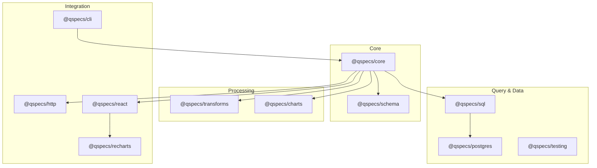
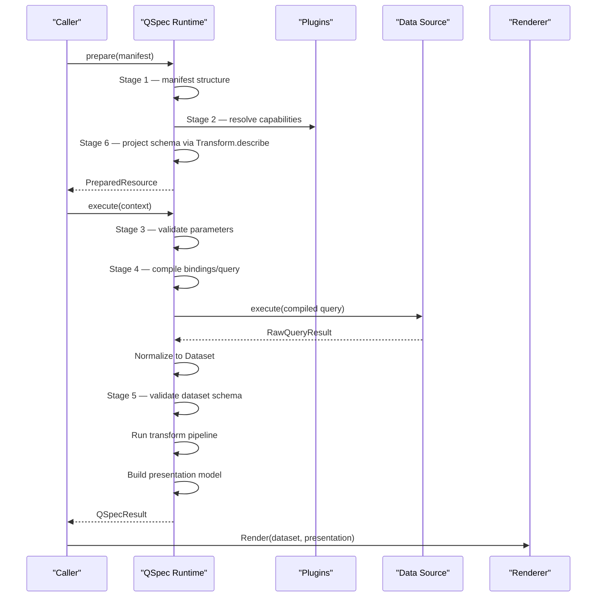
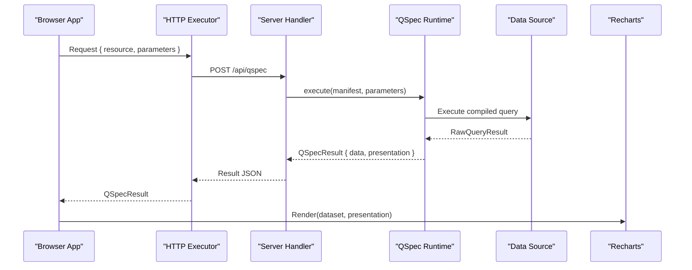
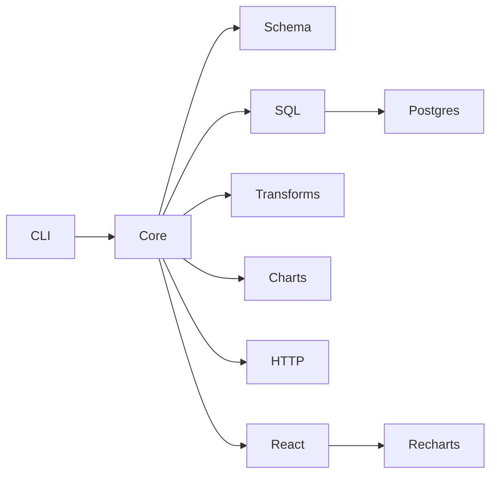

# Core Concepts

<cite>
**Referenced Files in This Document**
- [README.md](file://README.md)
- [SPEC.md](file://SPEC.md)
- [architecture.md](file://docs/architecture.md)
- [manifest-specification.md](file://docs/manifest-specification.md)
- [parameters.md](file://docs/parameters.md)
- [queries.md](file://docs/queries.md)
- [data-sources.md](file://docs/data-sources.md)
- [datasets.md](file://docs/datasets.md)
- [transforms.md](file://docs/transforms.md)
- [presentations.md](file://docs/presentations.md)
- [qspec.json](file://schemas/v1/qspec.json)
- [01-complete-manifest.qspec.json](file://examples/01-complete-manifest.qspec.json)
- [03-parameterized-query.qspec.json](file://examples/03-parameterized-query.qspec.json)
- [04-transform-filter.qspec.json](file://examples/04-transform-filter.qspec.json)
- [05-transform-select.qspec.json](file://examples/05-transform-select.qspec.json)
- [06-transform-rename.qspec.json](file://examples/06-transform-rename.qspec.json)
- [07-transform-derive.qspec.json](file://examples/07-transform-derive.qspec.json)
- [08-transform-sort.qspec.json](file://examples/08-transform-sort.qspec.json)
- [09-transform-limit.qspec.json](file://examples/09-transform-limit.qspec.json)
- [10-chart-grouped-series.qspec.json](file://examples/10-chart-grouped-series.qspec.json)
- [11-chart-pie.qspec.json](file://examples/11-chart-pie.qspec.json)
</cite>

## Table of Contents

1. Introduction
2. Project Structure
3. Core Components
4. Architecture Overview
5. Detailed Component Analysis
6. Dependency Analysis
7. Performance Considerations
8. Troubleshooting Guide
9. Conclusion

## Introduction

QSpec is an extensible, declarative specification and runtime for defining parameterized data queries, validating inputs and outputs, transforming datasets, and describing how results should be presented. A QSpec manifest is a plain JSON document that describes analytical resources such as charts, tables, metrics, or datasets without embedding application-specific execution or visualization code. The core principle is that domain-specific functionality belongs in plugins; the core remains small, stable, deterministic, and extensible.

The conceptual pipeline flows from parameters through validation, query compilation, data source execution, result normalization, dataset validation, transformation, presentation modeling, and finally rendering by a host renderer.

**Section sources**

- [README.md:1-12](file://README.md#L1-L12)
- [SPEC.md:14-45](file://SPEC.md#L14-L45)
- [architecture.md:9-63](file://docs/architecture.md#L9-L63)

## Project Structure

At a high level, this repository organizes capabilities into packages under `packages/`, with shared schemas under `schemas/`, documentation under `docs/`, runnable examples under `examples/`, and tests under `test/`. The core runtime lives in `@qspecs/core`, while query languages, data sources, transforms, presentations, and renderers are implemented as plugins in their own packages.

**Diagram sources**

- [README.md:242-257](file://README.md#L242-L257)
- [architecture.md:388-421](file://docs/architecture.md#L388-L421)

**Section sources**

- [README.md:242-257](file://README.md#L242-L257)
- [architecture.md:333-421](file://docs/architecture.md#L333-L421)

## Core Components

- Manifest model: Every resource follows a top-level shape with `apiVersion`, `kind`, `metadata`, and `spec`. The schema defines required fields and optional extensions.
- Plugin system: Capabilities like query languages, data sources, transforms, semantic types, resource kinds, presentations, and renderers are registered via plugins. Core only registers the minimal `Dataset` kind; everything else is opt-in.
- Execution split: `prepare()` performs static work once per manifest (parsing, structural validation, capability resolution, transform projection, presentation field validation). `execute()` validates runtime parameters, compiles and runs queries, normalizes results, validates datasets against declared schemas, runs transforms, builds presentation models, and returns a result.
- Separation of server and browser: Server-side runtime executes manifests behind your own authentication and authorization. The HTTP boundary carries only a resource name and parameters; no query text, source names, or credentials cross to the client. The browser consumes results via React integration and renders using a renderer package.

**Section sources**

- [manifest-specification.md:13-118](file://docs/manifest-specification.md#L13-L118)
- [architecture.md:65-105](file://docs/architecture.md#L65-L105)
- [architecture.md:158-203](file://docs/architecture.md#L158-L203)
- [architecture.md:397-430](file://docs/architecture.md#L397-L430)

## Architecture Overview

The six-stage validation pipeline ensures correctness before any data is fetched and after it arrives:

1. Manifest structure: Validates well-formedness of the QSpec v1 document.
2. Plugin capabilities: Resolves resource kind, query language, source, transforms, and presentation type from registries.
3. Parameters: Validates runtime parameter values against declarations.
4. Query: Validates compiled query requirements at compile time.
5. Dataset: Validates returned data against declared schema.
6. Presentation: Validates presentation field references against the projected dataset schema.

**Diagram sources**

- [architecture.md:9-105](file://docs/architecture.md#L9-L105)
- [queries.md:125-148](file://docs/queries.md#L125-L148)
- [datasets.md:63-112](file://docs/datasets.md#L63-L112)
- [transforms.md:24-48](file://docs/transforms.md#L24-L48)
- [presentations.md:19-60](file://docs/presentations.md#L19-L60)

**Section sources**

- [architecture.md:9-105](file://docs/architecture.md#L9-L105)

## Detailed Component Analysis

### Manifests and Schema

A manifest declares what to run and how to present it. The top-level shape includes versioning, kind selection, metadata, and a spec containing parameters, query, dataset schema, transforms, and presentation. The JSON schema enforces structural rules and provides machine-readable validation for editors and tools.

Practical example:

- Complete chart manifest demonstrates parameters, SQL query, typed dataset, filter transform, and line presentation.
- Minimal dataset manifest shows the smallest valid resource with an empty spec.

**Section sources**

- [manifest-specification.md:13-118](file://docs/manifest-specification.md#L13-L118)
- [qspec.json:1-143](file://schemas/v1/qspec.json#L1-L143)
- [01-complete-manifest.qspec.json:1-90](file://examples/01-complete-manifest.qspec.json#L1-L90)
- [02-minimal-dataset.qspec.json](file://examples/02-minimal-dataset.qspec.json)

### Parameters and Binding

Parameters are first-class entities declared in the manifest. They define typed inputs, defaults, and constraints. At runtime, caller-supplied values are validated against these declarations. Bindings map query placeholders to either parameter values or literals, ensuring safe substitution without string interpolation.

Key behaviors:

- Bare string bindings must match the parameter reference pattern; otherwise they are rejected statically.
- Object forms require exactly one key (`parameter` or `literal`).
- Undeclared parameter references fail with suggestions.
- Optional parameters without defaults resolve to `null` when absent.

Practical examples:

- Parameterized query manifest binds multiple parameters of different shapes into a SQL statement.
- Complete manifest uses date range and country parameters with defaults.

**Section sources**

- [parameters.md:1-75](file://docs/parameters.md#L1-L75)
- [queries.md:43-136](file://docs/queries.md#L43-L136)
- [03-parameterized-query.qspec.json](file://examples/03-parameterized-query.qspec.json)
- [01-complete-manifest.qspec.json:11-36](file://examples/01-complete-manifest.qspec.json#L11-L36)

### Queries and Data Sources

Queries turn validated parameters into a request a data source can run. A query specifies a logical source name, a language, a statement, and bindings. Data sources are plugin-registered adapters that execute compiled queries and return positional results.

Important design points:

- Language and source are independent; a language plugin defines syntax, a source adapter executes it.
- Data sources return positional rows with column metadata, enabling robust handling of duplicate columns and prototype-safe keys.
- Cancellation propagates via context signals; PostgreSQL adapter cancels statements safely without destroying sessions.

Practical example:

- Complete manifest uses a SQL query bound to parameters and executed against a configured source.

**Section sources**

- [queries.md:1-42](file://docs/queries.md#L1-L42)
- [data-sources.md:1-67](file://docs/data-sources.md#L1-L67)
- [data-sources.md:107-163](file://docs/data-sources.md#L107-L163)
- [01-complete-manifest.qspec.json:27-36](file://examples/01-complete-manifest.qspec.json#L27-L36)

### Datasets and Normalization

Datasets are normalized, JSON-safe structures produced by query execution. They consist of fields, rows, and optional metadata. Normalization converts raw positional results into named fields and handles edge cases like duplicate column names and prototype pollution.

Normalization guarantees:

- Positional rows avoid object-key collisions and preserve all columns.
- Dates at the cell level are converted to ISO strings for safe transport.
- Row caps and truncation flags protect large results.
- Declared field definitions override inferred ones; non-nullable violations are still checked.

**Section sources**

- [datasets.md:1-62](file://docs/datasets.md#L1-L62)
- [datasets.md:63-112](file://docs/datasets.md#L63-L112)
- [datasets.md:113-163](file://docs/datasets.md#L113-L163)

### Transform Pipeline

Transforms are declarative reshaping steps applied sequentially to datasets. Each transform receives the previous output and returns a new dataset immutably. Built-in transforms include filter, derive, sort, limit, select, and rename.

Pipeline properties:

- Strict left-to-right order; declaration order is the only order.
- Transforms implement `describe` to project schema changes, enabling static validation of later stages.
- Expressions used by filter and derive are compiled through a fixed AST with a bounded operator set and depth limits.
- Omitting `describe` makes downstream transforms and presentation validation lose static checks.

Practical examples:

- Filter transform narrows rows using comparison shorthand or full AST.
- Select transform projects a subset of fields in specified order.
- Rename transform renames fields while preserving positions.
- Derive transform computes new fields with explicit types.
- Sort and limit control ordering and pagination.

**Section sources**

- [transforms.md:1-63](file://docs/transforms.md#L1-L63)
- [transforms.md:65-113](file://docs/transforms.md#L65-L113)
- [transforms.md:114-176](file://docs/transforms.md#L114-L176)
- [transforms.md:177-212](file://docs/transforms.md#L177-L212)
- [transforms.md:213-339](file://docs/transforms.md#L213-L339)
- [04-transform-filter.qspec.json](file://examples/04-transform-filter.qspec.json)
- [05-transform-select.qspec.json](file://examples/05-transform-select.qspec.json)
- [06-transform-rename.qspec.json](file://examples/06-transform-rename.qspec.json)
- [07-transform-derive.qspec.json](file://examples/07-transform-derive.qspec.json)
- [08-transform-sort.qspec.json](file://examples/08-transform-sort.qspec.json)
- [09-transform-limit.qspec.json](file://examples/09-transform-limit.qspec.json)

### Presentations and Rendering

Presentations describe semantic intent for how a dataset should be shown. The charts package defines standard presentation types (line, bar, area, scatter, pie) and the Chart resource kind. It does not render pixels; it defines semantics and resolves series for renderers.

Key concepts:

- Cartesian vs pie presentations have distinct shapes.
- Grouped series pivot dataset rows into multiple series at call time, with consistent behavior across renderers.
- `resolveSeries` centralizes series resolution logic so different renderers do not diverge on grouping semantics.
- Recharts adapter pivots cartesian series into wide-row tables for compatible chart components.

Practical examples:

- Grouped series manifest draws one line per distinct group value.
- Pie manifest defines category and value fields without x-axis or series list.

**Section sources**

- [presentations.md:1-71](file://docs/presentations.md#L1-L71)
- [presentations.md:72-120](file://docs/presentations.md#L72-L120)
- [presentations.md:121-210](file://docs/presentations.md#L121-L210)
- [presentations.md:211-271](file://docs/presentations.md#L211-L271)
- [10-chart-grouped-series.qspec.json](file://examples/10-chart-grouped-series.qspec.json)
- [11-chart-pie.qspec.json](file://examples/11-chart-pie.qspec.json)

### Server-Side Execution and Browser Rendering

The separation between server and browser is enforced by design:

- Server hosts the runtime, configures plugins, and exposes a handler that accepts resource names and parameters.
- Client requests carry only a resource name and parameters; no executable query or credentials cross the wire.
- React integration suspends during fetch and rethrows errors to boundaries; it never resolves to loading/error objects.
- Renderers consume resolved datasets and presentation models to draw visuals.

**Diagram sources**

- [architecture.md:397-430](file://docs/architecture.md#L397-L430)
- [README.md:107-180](file://README.md#L107-L180)

**Section sources**

- [architecture.md:397-430](file://docs/architecture.md#L397-L430)
- [README.md:107-180](file://README.md#L107-L180)

## Dependency Analysis

QSpec’s architecture isolates responsibilities into packages with clear dependencies:

- Core has zero runtime dependencies and provides the pipeline, registries, and basic types.
- Schema provides official JSON Schema for validation.
- SQL and Postgres implement query compilation and execution for SQL dialects.
- Transforms provide declarative reshaping operators.
- Charts define presentation semantics and series resolution.
- HTTP, React, and Recharts integrate server and browser rendering paths.
- CLI offers validation and inspection tooling.

**Diagram sources**

- [README.md:242-257](file://README.md#L242-L257)
- [architecture.md:388-421](file://docs/architecture.md#L388-L421)

**Section sources**

- [README.md:242-257](file://README.md#L242-L257)
- [architecture.md:388-421](file://docs/architecture.md#L388-L421)

## Performance Considerations

- Deterministic processing: Given the same manifest, parameters, runtime configuration, and data source response, internal processing is deterministic.
- Static validation reduces unnecessary database queries by catching invalid manifests early.
- Expression depth limits prevent deeply nested expressions from degrading performance.
- Row caps and truncation flags protect large result sets.
- Immutable transforms avoid shared mutation risks and enable predictable pipelines.
- Cancellation avoids long-running queries when callers abort.

[No sources needed since this section provides general guidance]

## Troubleshooting Guide

Common issues and where to look:

- Unknown dataset field in presentation: Stage 6 catches misspellings and suggests corrections based on projected schema.
- Malformed binding: Stage 2–4 catch incorrect binding patterns and undeclared parameter references.
- Unsupported API version: Structural validation rejects unrecognized versions.
- Transform opacity: Missing `describe` disables static validation downstream; ensure custom transforms implement `describe`.
- Parameter defaults mismatch: Defaults are validated against declared types and constraints at compile time.

**Section sources**

- [manifest-specification.md:147-197](file://docs/manifest-specification.md#L147-L197)
- [architecture.md:92-105](file://docs/architecture.md#L92-L105)
- [parameters.md:116-125](file://docs/parameters.md#L116-L125)
- [transforms.md:340-392](file://docs/transforms.md#L340-L392)

## Conclusion

QSpec’s core concepts center on declarative manifests, a robust six-stage validation pipeline, and a plugin-based architecture that keeps core small and extensible. Parameters and bindings ensure safe, typed input flow into queries. Data sources execute compiled queries and return normalized datasets. Transforms reshape data deterministically with schema projection for static validation. Presentations describe semantic intent, leaving rendering to host integrations. The server/browser separation enforces security by carrying only resource names and parameters across the wire. Together, these principles enable portable, maintainable, and secure analytical resources defined entirely in manifests.

[No sources needed since this section summarizes without analyzing specific files]
