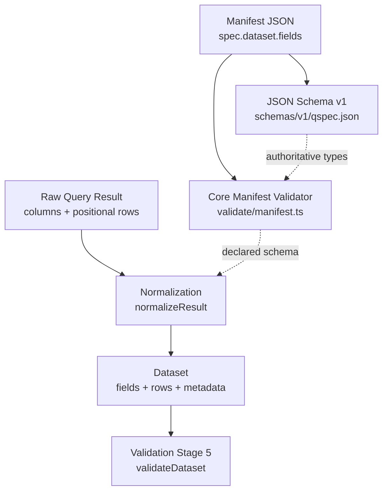
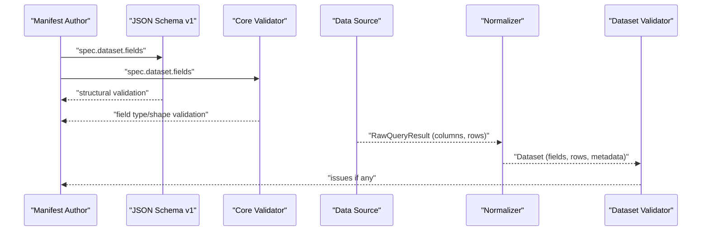
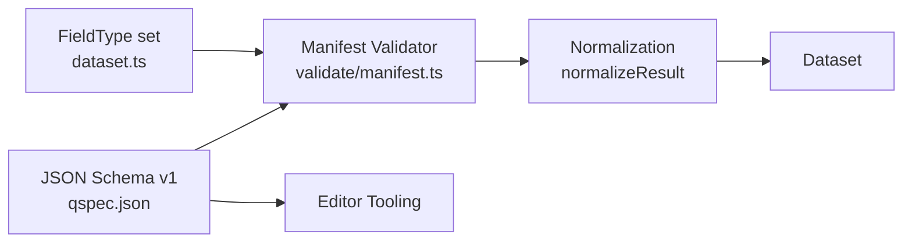

# Datasets and Schema Definition

<cite>
**Referenced Files in This Document**
- [datasets.md](file://docs/datasets.md)
- [manifest-specification.md](file://docs/manifest-specification.md)
- [known-gaps.md](file://docs/known-gaps.md)
- [qspec.json](file://schemas/v1/qspec.json)
- [01-complete-manifest.qspec.json](file://examples/01-complete-manifest.qspec.json)
- [02-minimal-dataset.qspec.json](file://examples/02-minimal-dataset.qspec.json)
- [dataset-fields.qspec.json](file://fixtures/valid/dataset-fields.qspec.json)
- [minimal-dataset.qspec.json](file://fixtures/valid/minimal-dataset.qspec.json)
- [dataset-field-missing-type.qspec.json](file://fixtures/invalid/dataset-field-missing-type.qspec.json)
- [dataset-field-nullable-non-bool.qspec.json](file://fixtures/invalid/dataset-field-nullable-non-bool.qspec.json)
- [normalize-result.test.ts](file://packages/core/src/internal/normalize-result.test.ts)
- [dataset.ts](file://packages/core/src/types/dataset.ts)
- [validate/manifest.ts](file://packages/core/src/internal/validate/manifest.ts)
</cite>

## Table of Contents

1. Introduction
2. Project Structure
3. Core Components
4. Architecture Overview
5. Detailed Component Analysis
6. Dependency Analysis
7. Performance Considerations
8. Troubleshooting Guide
9. Conclusion

## Introduction

This document explains how QSpec datasets represent normalized query results with typed field definitions, how schemas are declared and validated, and how runtime normalization infers or applies field metadata. It covers field types, constraints, nullable properties, validation rules, automatic type inference, manual schema overrides, complex structures (nested objects and arrays), custom validators via semanticType/format, dataset versioning and migration considerations, and performance implications of different schema designs.

## Project Structure

QSpec’s dataset schema is defined declaratively in the manifest’s spec.dataset.fields and enforced by both a JSON Schema and core’s TypeScript validator. The runtime normalizes raw query results into a Dataset with a stable, JSON-safe shape: named fields in column order and rows as null-prototype objects keyed by field name.

**Diagram sources**

- [qspec.json:111-129](file://schemas/v1/qspec.json#L111-L129)
- [validate/manifest.ts:352-377](file://packages/core/src/internal/validate/manifest.ts#L352-L377)
- [normalize-result.test.ts:33-109](file://packages/core/src/internal/normalize-result.test.ts#L33-L109)

**Section sources**

- [manifest-specification.md:13-118](file://docs/manifest-specification.md#L13-L118)
- [qspec.json:111-129](file://schemas/v1/qspec.json#L111-L129)

## Core Components

- Dataset model: fields (ordered), rows (null-prototype objects), optional metadata.
- FieldDefinition: type, nullable, label, semanticType, format.
- FieldType set: string, number, integer, boolean, date, datetime, object, array.
- RawQueryResult: columns (names + nativeType) and positional rows; normalized to Dataset.
- Normalization: converts Date values to ISO strings, infers types from first non-null value, marks nullable based on presence of nulls, preserves column order, handles duplicate column names, and enforces row caps with truncation metadata.
- Validation: structural checks for field.type, nullable, label, semanticType, format; later stage validates dataset against declared schema.

Key behaviors:

- Declared fields override inferred metadata wholesale.
- Inference defaults all-null columns to string.
- Duplicate columns are renamed with suffixes and reported.
- Row cap truncation sets metadata.truncated.

**Section sources**

- [dataset.ts:3-45](file://packages/core/src/types/dataset.ts#L3-L45)
- [datasets.md:22-163](file://docs/datasets.md#L22-L163)
- [normalize-result.test.ts:33-109](file://packages/core/src/internal/normalize-result.test.ts#L33-L109)
- [validate/manifest.ts:352-377](file://packages/core/src/internal/validate/manifest.ts#L352-L377)

## Architecture Overview

The end-to-end flow from manifest to materialized dataset:

**Diagram sources**

- [qspec.json:111-129](file://schemas/v1/qspec.json#L111-L129)
- [validate/manifest.ts:352-377](file://packages/core/src/internal/validate/manifest.ts#L352-L377)
- [datasets.md:63-140](file://docs/datasets.md#L63-L140)

## Detailed Component Analysis

### Field Types and Constraints

- Supported field types: string, number, integer, boolean, date, datetime, object, array.
- Each field must declare type; nullable is optional boolean; label and semanticType are optional strings; format is an arbitrary object.
- Unknown types, non-boolean nullable, non-string label/semanticType, or non-object format produce validation issues.

Examples:

- Valid multi-type schema: [dataset-fields.qspec.json](file://fixtures/valid/dataset-fields.qspec.json)
- Invalid missing type: [dataset-field-missing-type.qspec.json](file://fixtures/invalid/dataset-field-missing-type.qspec.json)
- Invalid non-boolean nullable: [dataset-field-nullable-non-bool.qspec.json](file://fixtures/invalid/dataset-field-nullable-non-bool.qspec.json)

**Section sources**

- [dataset.ts:3-45](file://packages/core/src/types/dataset.ts#L3-L45)
- [qspec.json:108-129](file://schemas/v1/qspec.json#L108-L129)
- [validate/manifest.ts:352-377](file://packages/core/src/internal/validate/manifest.ts#L352-L377)
- [dataset-fields.qspec.json:1-24](file://fixtures/valid/dataset-fields.qspec.json#L1-L24)
- [dataset-field-missing-type.qspec.json:1-13](file://fixtures/invalid/dataset-field-missing-type.qspec.json#L1-L13)
- [dataset-field-nullable-non-bool.qspec.json:1-13](file://fixtures/invalid/dataset-field-nullable-non-bool.qspec.json#L1-L13)

### Automatic Type Inference and Nullable Detection

- If a returned column has no declaration, its type is inferred from the first non-null value seen across rows.
- All-null columns default to string.
- Nullable is true if any row contains null/undefined in that column; otherwise false.
- Adapter nativeType can be carried through as format.nativeType.

Evidence:

- Inference behavior and defaults are exercised in tests.

**Section sources**

- [datasets.md:142-163](file://docs/datasets.md#L142-L163)
- [normalize-result.test.ts:38-72](file://packages/core/src/internal/normalize-result.test.ts#L38-L72)

### Manual Schema Overrides and Metadata Propagation

- When a field is declared in spec.dataset.fields and present in the result, the declared definition is used wholesale (name plus definition).
- Declared fields preserve label, semanticType, and format exactly as declared.
- Declared nullable is stamped onto the resulting field; actual nullability observed in rows is separately checked during validation.

Evidence:

- Tests confirm declared metadata wins over inference.

**Section sources**

- [datasets.md:142-163](file://docs/datasets.md#L142-L163)
- [normalize-result.test.ts:80-99](file://packages/core/src/internal/normalize-result.test.ts#L80-L99)

### Duplicate Columns and Column Order

- Duplicate column names are preserved by renaming subsequent occurrences (e.g., id_2, id_3) and reported via duplicates list.
- Field order matches the original column order.

Evidence:

- Tests assert renaming and order preservation.

**Section sources**

- [datasets.md:89-111](file://docs/datasets.md#L89-L111)
- [normalize-result.test.ts:33-36](file://packages/core/src/internal/normalize-result.test.ts#L33-L36)
- [normalize-result.test.ts:101-109](file://packages/core/src/internal/normalize-result.test.ts#L101-L109)

### Date Normalization and Nested Value Limit

- Top-level Date cells are converted to ISO 8601 strings so datasets remain JSON-safe.
- Dates nested inside object/array cells are not touched; adapters must normalize them before returning RawQueryResult if needed.

Evidence:

- Documentation and tests describe this behavior and limitation.

**Section sources**

- [datasets.md:113-133](file://docs/datasets.md#L113-L133)
- [normalize-result.test.ts:74-78](file://packages/core/src/internal/normalize-result.test.ts#L74-L78)

### Row Cap and Truncation

- A maxRows limit is applied during normalization; exceeding it drops extra rows and sets metadata.truncated to true.
- Adapters may also report truncated independently.

Evidence:

- Documentation describes limits and truncation semantics.

**Section sources**

- [datasets.md:134-140](file://docs/datasets.md#L134-L140)

### Complex Structures: Objects and Arrays

- Fields can be object or array types to hold composite data.
- For such fields, values are expected to be JSON-shaped; adapter responsibility includes ensuring internal Date values are normalized if downstream needs ISO strings.

Evidence:

- Examples include object and array fields; documentation clarifies adapter responsibilities.

**Section sources**

- [dataset-fields.qspec.json:18-19](file://fixtures/valid/dataset-fields.qspec.json#L18-L19)
- [datasets.md:113-133](file://docs/datasets.md#L113-L133)

### Custom Validators via SemanticType and Format

- semanticType annotates meaning without changing storage type (e.g., currency, percentage).
- format is a free-form object; examples include currency formatting hints.
- These are consumed by presentations or renderers rather than enforced by core validation.

Evidence:

- Examples show currency formatting; documentation explains semanticType usage.

**Section sources**

- [01-complete-manifest.qspec.json:37-51](file://examples/01-complete-manifest.qspec.json#L37-L51)
- [datasets.md:47-61](file://docs/datasets.md#L47-L61)

### Relationship Between Query Results and Dataset Schemas

- Positional RawQueryResult is normalized into a Dataset with named fields and rows keyed by field name.
- Declared schema takes precedence when present; otherwise inference fills gaps.
- Later validation stages compare dataset content against declared schema.

Evidence:

- Documentation explains positional vs object rows and normalization rationale.

**Section sources**

- [datasets.md:63-111](file://docs/datasets.md#L63-L111)
- [datasets.md:142-163](file://docs/datasets.md#L142-L163)

### Dataset Versioning and Migration Strategies

- apiVersion is required and currently only supports qspec.dev/v1; unsupported versions fail validation.
- $schema points editors to the JSON Schema for autocomplete/validation but does not affect runtime behavior.
- Manifests accept unknown keys for forward compatibility; plugin-aware validation catches capability-specific issues.

Migration guidance:

- Keep apiVersion pinned to supported versions.
- Use $schema to align editor tooling with the latest schema.
- Introduce new fields gradually; rely on forward-compatibility of unknown keys while validating with plugin-aware tools.

**Section sources**

- [manifest-specification.md:32-42](file://docs/manifest-specification.md#L32-L42)
- [manifest-specification.md:116-118](file://docs/manifest-specification.md#L116-L118)
- [qspec.json:1-12](file://schemas/v1/qspec.json#L1-L12)

### Backward Compatibility Considerations

- Extra keys in spec are tolerated for forward compatibility.
- Plugin capabilities (kinds, transforms, presentations) are resolved at runtime; using unregistered kinds fails early.
- Known gaps include a latent defect where declared-vs-actual type mismatch cannot be reached through execute() due to normalization copying declared metadata wholesale; non-nullable violations are still caught.

**Section sources**

- [manifest-specification.md:116-118](file://docs/manifest-specification.md#L116-L118)
- [known-gaps.md:285-338](file://docs/known-gaps.md#L285-L338)

## Dependency Analysis

- Field types are centralized in core types and reused by both the manifest validator and plugins to avoid drift.
- JSON Schema defines the authoritative structure for manifests; core validator mirrors these rules and adds richer diagnostics.
- Normalization depends on declared schema when available; otherwise infers from data.

**Diagram sources**

- [dataset.ts:3-23](file://packages/core/src/types/dataset.ts#L3-L23)
- [qspec.json:108-129](file://schemas/v1/qspec.json#L108-L129)
- [validate/manifest.ts:352-377](file://packages/core/src/internal/validate/manifest.ts#L352-L377)

**Section sources**

- [dataset.ts:3-23](file://packages/core/src/types/dataset.ts#L3-L23)
- [qspec.json:108-129](file://schemas/v1/qspec.json#L108-L129)
- [validate/manifest.ts:352-377](file://packages/core/src/internal/validate/manifest.ts#L352-L377)

## Performance Considerations

- Prefer declaring fields for hot paths to avoid per-row inference overhead and to stabilize metadata.
- Use row caps to prevent large result sets from impacting memory and rendering.
- Avoid excessive nesting in object/array fields when possible; deep structures increase serialization cost and complicate adapter normalization responsibilities.
- Be mindful of duplicate columns; while supported, they add renaming logic and potential confusion in downstream consumers.
- Leverage semanticType and format for presentation optimization without altering runtime validation costs.

[No sources needed since this section provides general guidance]

## Troubleshooting Guide

Common issues and resolutions:

- Missing field type: Ensure every field under spec.dataset.fields declares a valid type from the supported set.
- Non-boolean nullable: Set nullable to true or false explicitly.
- Unknown field type: Correct the type to one of the supported values; consider suggestions provided by the validator.
- Unexpected nulls: If a field is declared non-nullable but receives nulls, fix upstream data or adjust the schema accordingly.
- Duplicate columns: Expect renames (e.g., id_2); handle in downstream code accordingly.
- Date handling in composite fields: Normalize dates within object/array values in your adapter if you need ISO strings downstream.

**Section sources**

- [dataset-field-missing-type.qspec.json:1-13](file://fixtures/invalid/dataset-field-missing-type.qspec.json#L1-L13)
- [dataset-field-nullable-non-bool.qspec.json:1-13](file://fixtures/invalid/dataset-field-nullable-non-bool.qspec.json#L1-L13)
- [validate/manifest.ts:352-377](file://packages/core/src/internal/validate/manifest.ts#L352-L377)
- [datasets.md:89-133](file://docs/datasets.md#L89-L133)

## Conclusion

QSpec datasets provide a robust, normalized representation of query results with clear schema-driven typing and flexible metadata. Declared schemas take precedence, while inference fills gaps when absent. Validation ensures correctness, and normalization guarantees JSON safety and predictable behavior even with edge cases like duplicate columns and nested dates. By designing schemas thoughtfully—declaring types, leveraging semanticType/format, and applying row caps—you can achieve reliable, performant pipelines that scale with evolving requirements.
