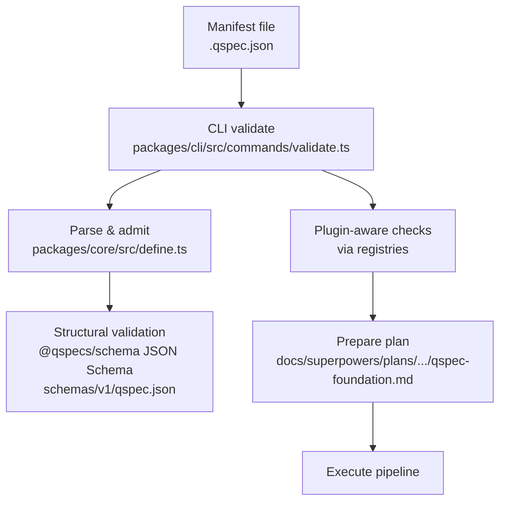
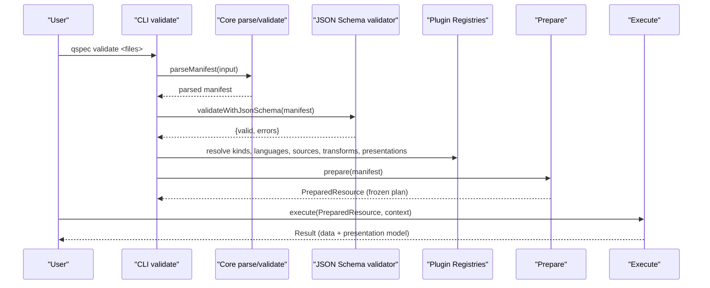
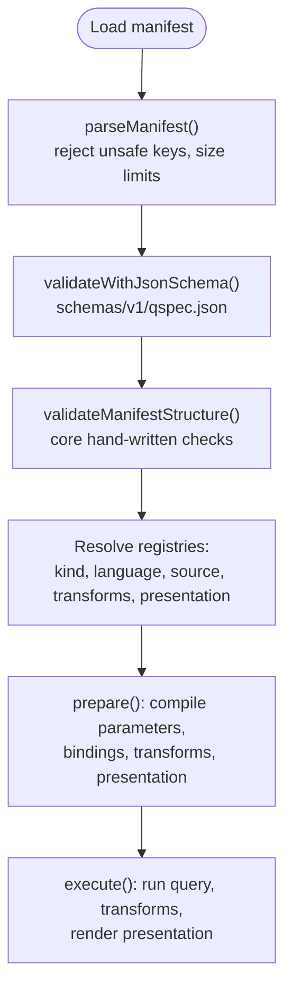

# Manifest Structure and Schema

<cite>
**Referenced Files in This Document**
- [qspec.json](file://schemas/v1/qspec.json)
- [manifest-specification.md](file://docs/manifest-specification.md)
- [specification-versioning.md](file://docs/specification-versioning.md)
- [quick-start.md](file://docs/quick-start.md)
- [01-complete-manifest.qspec.json](file://examples/01-complete-manifest.qspec.json)
- [02-minimal-dataset.qspec.json](file://examples/02-minimal-dataset.qspec.json)
- [03-parameterized-query.qspec.json](file://examples/03-parameterized-query.qspec.json)
- [10-chart-grouped-series.qspec.json](file://examples/10-chart-grouped-series.qspec.json)
- [minimal-dataset.qspec.json](file://fixtures/valid/minimal-dataset.qspec.json)
- [unsupported-version.qspec.json](file://fixtures/invalid/unsupported-version.qspec.json)
- [validate.ts](file://packages/cli/src/commands/validate.ts)
- [define.ts](file://packages/core/src/define.ts)
- [prepare.ts](file://docs/superpowers/plans/2026-08-09-qspec-foundation.md)
</cite>

## Table of Contents

1. [Introduction](#introduction)
2. [Project Structure](#project-structure)
3. [Core Components](#core-components)
4. [Architecture Overview](#architecture-overview)
5. [Detailed Component Analysis](#detailed-component-analysis)
6. [Dependency Analysis](#dependency-analysis)
7. [Performance Considerations](#performance-considerations)
8. [Troubleshooting Guide](#troubleshooting-guide)
9. [Conclusion](#conclusion)
10. [Appendices](#appendices)

## Introduction

This document explains the QSpec manifest structure and schema for v1 manifests. It covers the top-level shape, resource-specific properties, how analytical resources (datasets, charts, tables, metrics, dashboards) are declared declaratively, and how manifests are parsed and validated before execution. It also provides examples of minimal and complete manifests, naming conventions, organization patterns, and versioning guidance.

## Project Structure

QSpec manifests are plain JSON documents validated against a published JSON Schema. The repository includes:

- A machine-readable schema at schemas/v1/qspec.json
- Authoritative documentation of the manifest shape in docs/manifest-specification.md
- Versioning rules in docs/specification-versioning.md
- Worked examples under examples/
- Validation entry points in packages/cli/src/commands/validate.ts and core parsing/validation in packages/core/src/define.ts and prepare logic described in docs/superpowers/plans/...

**Diagram sources**

- [validate.ts:183-217](file://packages/cli/src/commands/validate.ts#L183-L217)
- [define.ts:39-78](file://packages/core/src/define.ts#L39-L78)
- [qspec.json:1-143](file://schemas/v1/qspec.json#L1-L143)
- [prepare.ts:5316-5479](file://docs/superpowers/plans/2026-08-09-qspec-foundation.md#L5316-L5479)

**Section sources**

- [manifest-specification.md:13-118](file://docs/manifest-specification.md#L13-L118)
- [qspec.json:1-143](file://schemas/v1/qspec.json#L1-L143)

## Core Components

A QSpec manifest is a JSON object with four required top-level fields:

- $schema: Optional but recommended; points editors to the JSON Schema URL for autocomplete and inline validation. It has no runtime effect.
- apiVersion: Required; currently only "qspec.dev/v1" is supported. Unsupported values fail structural validation.
- kind: Required; selects the resource kind (e.g., Dataset, Chart). Plugin registry determines whether query/presentation are required.
- metadata: Required object; must include name (a stable slug-like identifier matching a strict pattern). title, description, and tags are optional and descriptive-only.
- spec: Required object; contains the resource definition. All five sections (parameters, query, dataset, transforms, presentation) are structurally optional; kind-specific requirements are enforced later by plugins.

Resource kinds and their typical requirements:

- Dataset: least requirement; no query or presentation required.
- Chart: requires both query and presentation.
- Table, Metric, Dashboard: named in the architecture but not registered in this repository today; using them fails as unregistered kinds.

Examples:

- Minimal Dataset: a manifest with an empty spec is valid for kind=Dataset.
- Complete Chart: demonstrates parameters, query, dataset schema, transforms, and presentation together.

**Section sources**

- [manifest-specification.md:13-118](file://docs/manifest-specification.md#L13-L118)
- [02-minimal-dataset.qspec.json:1-9](file://examples/02-minimal-dataset.qspec.json#L1-L9)
- [01-complete-manifest.qspec.json:1-90](file://examples/01-complete-manifest.qspec.json#L1-L90)

## Architecture Overview

The manifest lifecycle consists of parsing, structural validation, plugin-aware validation, preparation, and execution.

**Diagram sources**

- [validate.ts:183-217](file://packages/cli/src/commands/validate.ts#L183-L217)
- [define.ts:39-78](file://packages/core/src/define.ts#L39-L78)
- [prepare.ts:5316-5479](file://docs/superpowers/plans/2026-08-09-qspec-foundation.md#L5316-L5479)

## Detailed Component Analysis

### Top-level manifest fields

- $schema: Optional string pointing to the schema URL.
- apiVersion: Must be "qspec.dev/v1". Unsupported versions produce a specific validation error.
- kind: String identifying the resource kind. Registered by plugins; unknown kinds fail during capability resolution.
- metadata.name: Required; must match a strict lowercase slug pattern.
- metadata.title, description, tags: Optional descriptive fields.
- spec: Object containing parameters, query, dataset, transforms, presentation. Extra keys are allowed for forward compatibility.

**Section sources**

- [manifest-specification.md:13-118](file://docs/manifest-specification.md#L13-L118)
- [specification-versioning.md:10-53](file://docs/specification-versioning.md#L10-L53)
- [qspec.json:1-34](file://schemas/v1/qspec.json#L1-L34)

### Parameters

Parameters define inputs to a manifest. Each parameter has:

- type: one of string, number, integer, boolean, date, datetime, enum, array.
- required: boolean.
- default: value constrained by its own type/values/items/validation (enforced by core, not JSON Schema).
- description: optional text.
- values: required when type is enum; non-empty array.
- items: required when type is array; defines item type.
- validation: numeric/string bounds for min/max/minLength/maxLength.
- presentation: control hints like label, placeholder, help.

Bindings connect query placeholders to parameters via either literal strings "$parameters.<name>" or objects referencing a parameter name.

**Section sources**

- [qspec.json:35-82](file://schemas/v1/qspec.json#L35-L82)
- [manifest-specification.md:147-197](file://docs/manifest-specification.md#L147-L197)
- [03-parameterized-query.qspec.json:9-52](file://examples/03-parameterized-query.qspec.json#L9-L52)

### Query

A query declares how to fetch data:

- source: name of a configured data source.
- language: name of a registered query language (e.g., sql).
- statement: the query text or AST accepted by the language.
- bindings: map from placeholders to parameter references or literals.

During prepare(), the runtime resolves the query language and data source from registries and compiles bindings. Unknown languages or sources cause early failures.

**Section sources**

- [qspec.json:98-107](file://schemas/v1/qspec.json#L98-L107)
- [prepare.ts:5345-5384](file://docs/superpowers/plans/2026-08-09-qspec-foundation.md#L5345-L5384)
- [01-complete-manifest.qspec.json:27-36](file://examples/01-complete-manifest.qspec.json#L27-L36)

### Dataset

A dataset describes the output schema of rows produced by the pipeline:

- fields: map of field names to definitions.
- Each field has:
  - type: one of string, number, integer, boolean, date, datetime, object, array.
  - nullable: boolean.
  - label: optional human-friendly name.
  - semanticType: optional domain hint (e.g., currency).
  - format: optional formatting configuration (e.g., currency code).

The dataset schema is used to project fields through transforms and to validate presentations.

**Section sources**

- [qspec.json:108-130](file://schemas/v1/qspec.json#L108-L130)
- [01-complete-manifest.qspec.json:37-52](file://examples/01-complete-manifest.qspec.json#L37-L52)
- [03-parameterized-query.qspec.json:45-52](file://examples/03-parameterized-query.qspec.json#L45-L52)

### Transforms

Transforms form a pipeline that modifies datasets:

- transforms: array of transform definitions.
- Each transform requires a type string; additional properties depend on the transform implementation.
- During prepare(), each transform is resolved from the registry, validated, and optionally participates in field projection if it exposes describe().

Common transforms include filter, select, rename, derive, sort, limit (see examples).

**Section sources**

- [qspec.json:131-135](file://schemas/v1/qspec.json#L131-L135)
- [prepare.ts:5386-5418](file://docs/superpowers/plans/2026-08-09-qspec-foundation.md#L5386-L5418)
- [01-complete-manifest.qspec.json:53-68](file://examples/01-complete-manifest.qspec.json#L53-L68)

### Presentation

Presentation defines how to render results:

- presentation: object with a required type string (e.g., line, pie).
- Additional properties vary by presentation type (e.g., x-axis, series, legend, tooltip).
- During prepare(), the presentation type is resolved from registries and validated against projected fields.

Grouped series can be defined by grouping on a field rather than enumerating each series explicitly.

**Section sources**

- [qspec.json:136-140](file://schemas/v1/qspec.json#L136-L140)
- [prepare.ts:5420-5451](file://docs/superpowers/plans/2026-08-09-qspec-foundation.md#L5420-L5451)
- [10-chart-grouped-series.qspec.json:24-41](file://examples/10-chart-grouped-series.qspec.json#L24-L41)

### Resource kinds overview

- Dataset: produces validated, optionally transformed data without requiring query or presentation.
- Chart: requires both query and presentation; cannot render without data and visualization config.
- Table, Metric, Dashboard: part of the architecture but not registered in this repository; using them yields unregistered-kind errors.

**Section sources**

- [manifest-specification.md:44-66](file://docs/manifest-specification.md#L44-L66)

## Dependency Analysis

Manifest validation depends on multiple layers:

- Structural validation via JSON Schema ensures well-formedness and consistent types.
- Core validation enforces constraints not expressible in JSON Schema (e.g., default value consistency, binding cross-references).
- Plugin registries provide capabilities: resource kinds, query languages, data sources, transforms, and presentations.
- Prepare freezes the validated plan for efficient repeated execution.

**Diagram sources**

- [validate.ts:183-217](file://packages/cli/src/commands/validate.ts#L183-L217)
- [define.ts:39-78](file://packages/core/src/define.ts#L39-L78)
- [qspec.json:1-143](file://schemas/v1/qspec.json#L1-L143)
- [prepare.ts:5316-5479](file://docs/superpowers/plans/2026-08-09-qspec-foundation.md#L5316-L5479)

**Section sources**

- [manifest-specification.md:131-197](file://docs/manifest-specification.md#L131-L197)
- [prepare.ts:5316-5479](file://docs/superpowers/plans/2026-08-09-qspec-foundation.md#L5316-L5479)

## Performance Considerations

- prepare() performs all static validation and builds a frozen plan; it does no I/O. Repeated executions reuse the prepared plan, avoiding redundant work.
- Caching prepared plans per resource name improves throughput in request-driven environments.
- Transform count is limited to prevent excessive processing; exceeding limits fails early during prepare().
- Using typed datasets and explicit projections helps downstream components optimize rendering.

[No sources needed since this section provides general guidance]

## Troubleshooting Guide

Common issues and where they surface:

- Unsupported apiVersion: caught by structural validation; see fixture for unsupported version.
- Unknown resource kind: caught during capability resolution; ensure the appropriate plugin is installed and registered.
- Unknown query language or data source: caught during prepare(); verify plugin installation and configuration.
- Unknown transform or presentation type: caught during prepare(); ensure corresponding plugins are installed.
- Invalid parameter defaults or bindings: enforced by core validators; ensure defaults match declared types and bindings reference declared parameters.
- Presentation field mismatches: caught during presentation validation; ensure fields exist in projected dataset schema.

Use the CLI to validate manifests without running them:

- Basic structural validation: runs core and JSON Schema validators.
- Plugin-aware validation with --config: resolves registries and validates bindings, transforms, and presentations without a database.

**Section sources**

- [unsupported-version.qspec.json:1-2](file://fixtures/invalid/unsupported-version.qspec.json#L1-L2)
- [specification-versioning.md:10-53](file://docs/specification-versioning.md#L10-L53)
- [prepare.ts:5334-5451](file://docs/superpowers/plans/2026-08-09-qspec-foundation.md#L5334-L5451)
- [quick-start.md:120-133](file://docs/quick-start.md#L120-L133)

## Conclusion

QSpec manifests provide a declarative way to define analytical resources. The v1 schema defines a consistent top-level shape and rich options for parameters, queries, datasets, transforms, and presentations. Two validators (core and JSON Schema) ensure correctness, while plugin registries extend capabilities. Follow naming conventions, organize manifests by feature, and use versioning rules to maintain compatibility over time.

[No sources needed since this section summarizes without analyzing specific files]

## Appendices

### Minimal vs Complete Manifests

- Minimal Dataset: shows the smallest valid manifest for kind=Dataset with an empty spec.
- Complete Chart: demonstrates parameters, query, dataset schema, transforms, and presentation together.

**Section sources**

- [02-minimal-dataset.qspec.json:1-9](file://examples/02-minimal-dataset.qspec.json#L1-L9)
- [01-complete-manifest.qspec.json:1-90](file://examples/01-complete-manifest.qspec.json#L1-L90)

### Naming Conventions and Organization

- metadata.name must match a strict lowercase slug pattern; use hyphens and alphanumeric characters.
- Organize manifests by feature or domain; group related datasets, charts, and transformations together.
- Use tags in metadata to categorize resources for discovery and filtering.

**Section sources**

- [manifest-specification.md:68-87](file://docs/manifest-specification.md#L68-L87)
- [01-complete-manifest.qspec.json:5-10](file://examples/01-complete-manifest.qspec.json#L5-L10)

### Versioning and Compatibility

- apiVersion identifies the manifest specification version; currently only "qspec.dev/v1" is supported.
- Backward compatibility: once a specification version is released, it must not change in a breaking way; new versions require a new apiVersion.
- Plugin compatibility is managed via npm peerDependencies; the runtime does not enforce plugin version metadata beyond registration.

**Section sources**

- [specification-versioning.md:10-93](file://docs/specification-versioning.md#L10-L93)
