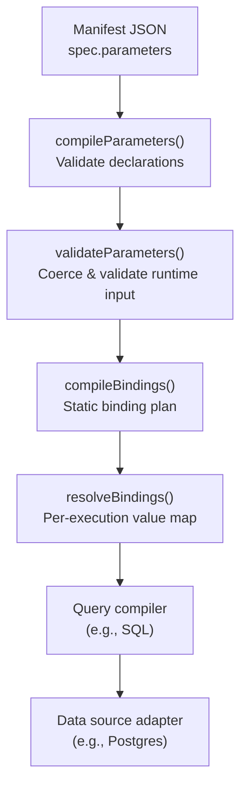
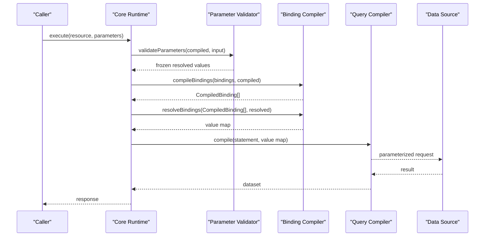
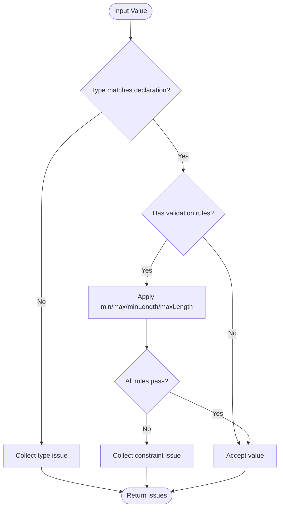
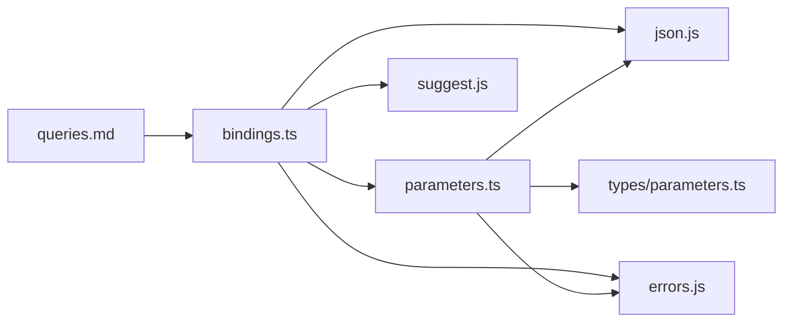

# Parameters and Binding

<cite>
**Referenced Files in This Document**
- [parameters.md](file://docs/parameters.md)
- [queries.md](file://docs/queries.md)
- [security.md](file://docs/security.md)
- [qspec.json](file://schemas/v1/qspec.json)
- [03-parameterized-query.qspec.json](file://examples/03-parameterized-query.qspec.json)
- [01-complete-manifest.qspec.json](file://examples/01-complete-manifest.qspec.json)
- [bad-binding.qspec.json](file://fixtures/invalid/bad-binding.qspec.json)
- [parameter-validation-wrong-type.qspec.json](file://fixtures/invalid/parameter-validation-wrong-type.qspec.json)
- [parameters.ts](file://packages/core/src/internal/validate/parameters.ts)
- [bindings.ts](file://packages/core/src/internal/bindings.ts)
- [query.ts](file://packages/core/src/types/query.ts)
- [manifest.ts](file://packages/core/src/internal/validate/manifest.ts)
</cite>

## Table of Contents

1. Introduction
2. Project Structure
3. Core Components
4. Architecture Overview
5. Detailed Component Analysis
6. Dependency Analysis
7. Performance Considerations
8. Troubleshooting Guide
9. Conclusion

## Introduction

This document explains QSpec’s parameter system and binding model, which enable dynamic, type-safe query execution. Parameters declare the inputs a manifest accepts; bindings connect those parameters to placeholders in queries or other sections. Validation ensures user-provided values are safe and correct before any data source is touched. The result is a secure, predictable pipeline where every runtime value is validated and bound through explicit contracts rather than string interpolation.

## Project Structure

QSpec separates concerns into:

- Parameter declarations and validation (core)
- Binding compilation and resolution (core)
- Query definitions and language-specific rendering (core + plugins)
- Schema definitions for manifests (schema)
- Examples and fixtures demonstrating usage and error cases



**Diagram sources**

- [parameters.ts:53-108](file://packages/core/src/internal/validate/parameters.ts#L53-L108)
- [parameters.ts:278-331](file://packages/core/src/internal/validate/parameters.ts#L278-L331)
- [bindings.ts:32-108](file://packages/core/src/internal/bindings.ts#L32-L108)
- [bindings.ts:112-128](file://packages/core/src/internal/bindings.ts#L112-L128)
- [queries.md:137-148](file://docs/queries.md#L137-L148)

**Section sources**

- [parameters.md:1-23](file://docs/parameters.md#L1-L23)
- [queries.md:1-41](file://docs/queries.md#L1-L41)
- [qspec.json:25-106](file://schemas/v1/qspec.json#L25-L106)

## Core Components

- Parameter types: string, number, integer, boolean, date, datetime, enum, array. Arrays support scalar items only; nested arrays or enums inside arrays are not supported in v1.
- Required/optional and defaults: optional parameters without defaults are absent from the resolved map; null inputs are treated as absent.
- Validation rules: min/max for numbers; minLength/maxLength for strings and arrays; strict enum membership; robust date/datetime parsing with real-calendar checks.
- Bindings: three forms — string reference, object parameter, literal. String references must match a strict pattern; bare strings that do not match are errors.
- Security: no untrusted interpolation into statement text; SQL adapters use parameterized placeholders; cross-boundary boundaries carry resource names, not queries.

**Section sources**

- [parameters.md:25-125](file://docs/parameters.md#L25-L125)
- [parameters.ts:10-33](file://packages/core/src/internal/validate/parameters.ts#L10-L33)
- [parameters.ts:120-256](file://packages/core/src/internal/validate/parameters.ts#L120-L256)
- [bindings.ts:7-12](file://packages/core/src/internal/bindings.ts#L7-L12)
- [queries.md:43-135](file://docs/queries.md#L43-L135)
- [security.md:165-180](file://docs/security.md#L165-L180)

## Architecture Overview

The parameter-to-query flow enforces safety at multiple stages:

1. Manifest schema validates structure.
2. compileParameters validates declaration shapes and default values.
3. validateParameters coerces and validates runtime inputs, collecting all issues.
4. compileBindings builds a static binding plan and verifies referenced parameters exist.
5. resolveBindings produces per-execution values, mapping absent parameters to null.
6. Query compilers render statements using placeholders and bound values, never concatenating user input.



**Diagram sources**

- [parameters.ts:278-331](file://packages/core/src/internal/validate/parameters.ts#L278-L331)
- [bindings.ts:32-108](file://packages/core/src/internal/bindings.ts#L32-L108)
- [bindings.ts:112-128](file://packages/core/src/internal/bindings.ts#L112-L128)
- [queries.md:137-148](file://docs/queries.md#L137-L148)

## Detailed Component Analysis

### Parameter Types and Validation

- Supported types: string, number, integer, boolean, date, datetime, enum, array.
- Date/datetime require ISO-like formats and real calendar dates; invalid dates like February 31 are rejected.
- Enum requires a non-empty values list and uses strict equality.
- Array items must be scalar types; length constraints apply to the array itself.
- Number constraints: finite values only; NaN and Infinity are rejected.
- Default values are validated at compile time against the same rules as runtime values.



**Diagram sources**

- [parameters.ts:120-256](file://packages/core/src/internal/validate/parameters.ts#L120-L256)
- [parameters.ts:278-331](file://packages/core/src/internal/validate/parameters.ts#L278-L331)

**Section sources**

- [parameters.md:25-125](file://docs/parameters.md#L25-L125)
- [parameters.ts:10-33](file://packages/core/src/internal/validate/parameters.ts#L10-L33)
- [parameters.ts:120-256](file://packages/core/src/internal/validate/parameters.ts#L120-L256)
- [parameters.ts:278-331](file://packages/core/src/internal/validate/parameters.ts#L278-L331)

### Binding Mechanism

- Three binding forms:
  - String shorthand: "$parameters.<name>"
  - Object form: { "parameter": "<name>" }
  - Literal form: { "literal": <any JSON value> }
- String bindings must match a strict pattern; otherwise they are manifest errors.
- compileBindings validates that referenced parameters exist and compiles a static plan.
- resolveBindings maps each binding to a value; absent parameters resolve to null.

```mermaid
classDiagram
class CompiledBinding {
+string name
+string kind
+string parameter
+JsonValue value
}
class Binding {
<<union>>
+string
+{ parameter : string }
+{ literal : JsonValue }
}
CompiledBinding <|.. Binding : "compiled from"
```

**Diagram sources**

- [bindings.ts:7-12](file://packages/core/src/internal/bindings.ts#L7-L12)
- [query.ts:3-8](file://packages/core/src/types/query.ts#L3-L8)

**Section sources**

- [queries.md:43-135](file://docs/queries.md#L43-L135)
- [bindings.ts:32-108](file://packages/core/src/internal/bindings.ts#L32-L108)
- [bindings.ts:112-128](file://packages/core/src/internal/bindings.ts#L112-L128)
- [query.ts:3-8](file://packages/core/src/types/query.ts#L3-L8)

### Practical Examples

#### Parameterized Query

A manifest declares typed parameters and binds them to placeholders in a SQL statement. The example shows required dates, an optional country with a default, and an integer limit with range validation.

- Parameter declarations and defaults
- Bindings map placeholders to parameters
- Dataset fields describe output shape

**Section sources**

- [03-parameterized-query.qspec.json:10-43](file://examples/03-parameterized-query.qspec.json#L10-L43)
- [01-complete-manifest.qspec.json:11-35](file://examples/01-complete-manifest.qspec.json#L11-L35)
- [queries.md:137-148](file://docs/queries.md#L137-L148)

#### Form Generation Hints

Parameters can include presentation metadata (control, label, placeholder, help). These are advisory and not consumed by core; they are intended for future UI tooling to generate forms automatically.

**Section sources**

- [parameters.md:127-180](file://docs/parameters.md#L127-L180)

#### Runtime Substitution

At runtime, validated parameters are resolved into a value map. Each binding either carries a literal or looks up its parameter; if absent, it becomes null. For SQL, this results in parameterized requests with no concatenated user text.

**Section sources**

- [bindings.ts:112-128](file://packages/core/src/internal/bindings.ts#L112-L128)
- [queries.md:125-148](file://docs/queries.md#L125-L148)

### Parameter Scoping and Inheritance Patterns

- Parameters are declared at spec.parameters and are scoped to the manifest.
- Bindings reference parameters by name within the same manifest; there is no cross-manifest inheritance in v1.
- If a parameter is optional and has no default, it is absent from the resolved map; bindings referencing it resolve to null.

**Section sources**

- [parameters.md:50-74](file://docs/parameters.md#L50-L74)
- [queries.md:125-135](file://docs/queries.md#L125-L135)

### Security Considerations

- No untrusted interpolation into statement text; bindings always produce bound values.
- SQL compilation avoids concatenation; adapters render parameterized placeholders.
- Cross-boundary communication carries resource names, not queries or credentials.

**Section sources**

- [queries.md:137-148](file://docs/queries.md#L137-L148)
- [security.md:165-180](file://docs/security.md#L165-L180)

## Dependency Analysis

- Parameter validation depends on:
  - JSON utilities (createRow, deepFreeze, setKey, isPlainObject)
  - Error types (ManifestValidationError, ParameterValidationError)
  - Types for parameters
- Binding compilation depends on:
  - Compiled parameters (names and definitions)
  - Suggestion utility for typos
  - JSON utilities and error types
- Query documentation clarifies how compiled bindings become parameterized requests.



**Diagram sources**

- [parameters.ts:1-9](file://packages/core/src/internal/validate/parameters.ts#L1-L9)
- [bindings.ts:1-5](file://packages/core/src/internal/bindings.ts#L1-L5)
- [queries.md:137-148](file://docs/queries.md#L137-L148)

**Section sources**

- [parameters.ts:1-9](file://packages/core/src/internal/validate/parameters.ts#L1-L9)
- [bindings.ts:1-5](file://packages/core/src/internal/bindings.ts#L1-L5)
- [queries.md:137-148](file://docs/queries.md#L137-L148)

## Performance Considerations

- Parameter validation collects all issues in one pass to avoid repeated failures.
- Deep freezing prevents accidental mutation after validation.
- Binding compilation is static (once per prepare), while resolution is per execution but lightweight.
- Avoid overly deep or large parameter structures; HTTP layer enforces maximum nesting depth to prevent abuse.

[No sources needed since this section provides general guidance]

## Troubleshooting Guide

Common scenarios and strategies:

- Unknown parameter type in declaration:
  - Cause: type not in the allowed set.
  - Fix: use one of the supported types.
  - Reference: [parameters.ts:67-74](file://packages/core/src/internal/validate/parameters.ts#L67-L74)

- Missing values for enum:
  - Cause: enum without a non-empty values array.
  - Fix: provide allowed values.
  - Reference: [parameters.ts:75-83](file://packages/core/src/internal/validate/parameters.ts#L75-L83)

- Invalid array items:
  - Cause: items.type not allowed or element type mismatch.
  - Fix: ensure items.type is scalar and elements match.
  - Reference: [parameters.ts:84-93](file://packages/core/src/internal/validate/parameters.ts#L84-L93), [parameters.ts:231-249](file://packages/core/src/internal/validate/parameters.ts#L231-L249)

- Bad binding form:
  - Cause: bare string not matching "$parameters.<name>".
  - Fix: use the string reference form or { "literal": ... }.
  - Reference: [bindings.ts:45-65](file://packages/core/src/internal/bindings.ts#L45-L65), [bad-binding.qspec.json:1-14](file://fixtures/invalid/bad-binding.qspec.json#L1-L14)

- Referencing undeclared parameter:
  - Cause: binding points to a parameter not declared in spec.parameters.
  - Fix: declare the parameter or correct the name; suggestions may be provided.
  - Reference: [bindings.ts:56-63](file://packages/core/src/internal/bindings.ts#L56-L63), [manifest.ts:285-318](file://packages/core/src/internal/validate/manifest.ts#L285-L318)

- Wrong validation rule types:
  - Cause: validation fields have incorrect types (e.g., min as string).
  - Fix: ensure numeric constraints are numbers and length constraints are non-negative integers.
  - Reference: [parameter-validation-wrong-type.qspec.json:1-11](file://fixtures/invalid/parameter-validation-wrong-type.qspec.json#L1-L11), [manifest.ts:285-318](file://packages/core/src/internal/validate/manifest.ts#L285-L318)

- Date/datetime validation failures:
  - Cause: malformed format or impossible calendar date.
  - Fix: use valid ISO-like strings and real calendar dates.
  - Reference: [parameters.ts:147-163](file://packages/core/src/internal/validate/parameters.ts#L147-L163)

- Null treated as absent:
  - Behavior: null falls back to default or required check; optional absent parameters are omitted from the resolved map.
  - Impact: bindings to absent parameters resolve to null.
  - Reference: [parameters.md:50-74](file://docs/parameters.md#L50-L74), [queries.md:125-135](file://docs/queries.md#L125-L135)

**Section sources**

- [parameters.ts:67-93](file://packages/core/src/internal/validate/parameters.ts#L67-L93)
- [parameters.ts:147-163](file://packages/core/src/internal/validate/parameters.ts#L147-L163)
- [bindings.ts:45-65](file://packages/core/src/internal/bindings.ts#L45-L65)
- [manifest.ts:285-318](file://packages/core/src/internal/validate/manifest.ts#L285-L318)
- [bad-binding.qspec.json:1-14](file://fixtures/invalid/bad-binding.qspec.json#L1-L14)
- [parameter-validation-wrong-type.qspec.json:1-11](file://fixtures/invalid/parameter-validation-wrong-type.qspec.json#L1-L11)
- [parameters.md:50-74](file://docs/parameters.md#L50-L74)
- [queries.md:125-135](file://docs/queries.md#L125-L135)

## Conclusion

QSpec’s parameter and binding system provides a robust foundation for dynamic, type-safe query execution. Declarations define precise input contracts; validation enforces correctness early; bindings connect parameters to placeholders safely; and query compilation ensures no untrusted interpolation. Together, these mechanisms deliver security, clarity, and reliability across diverse data sources and integrations.

[No sources needed since this section summarizes without analyzing specific files]
