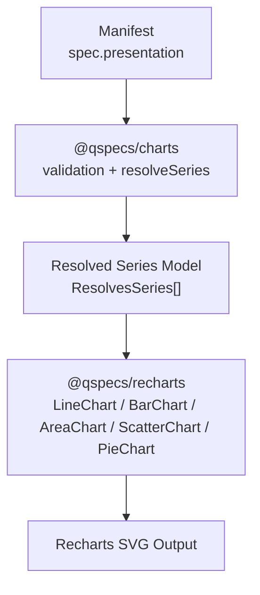
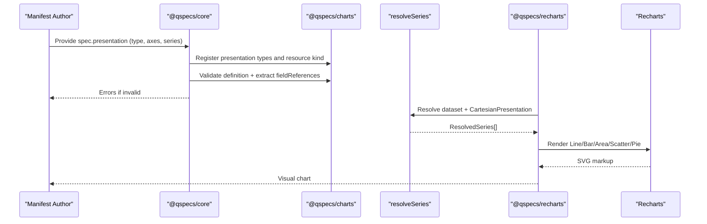
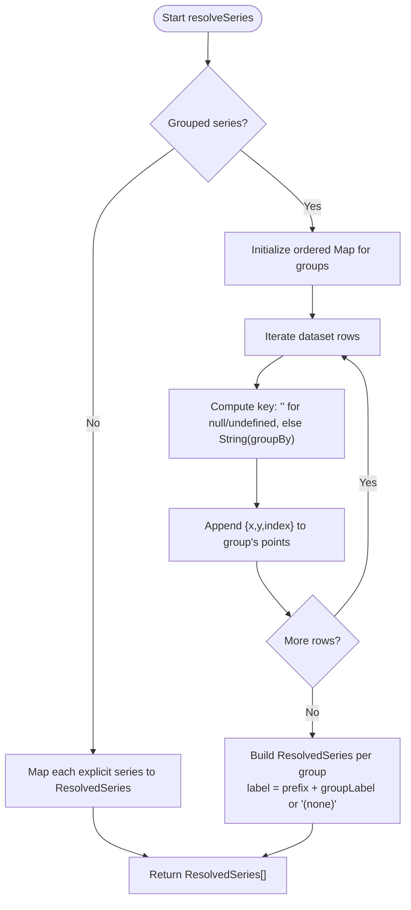
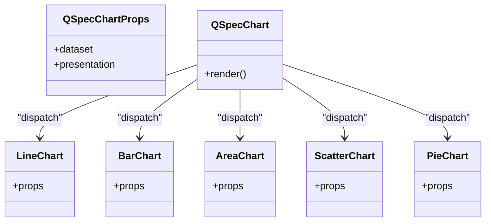
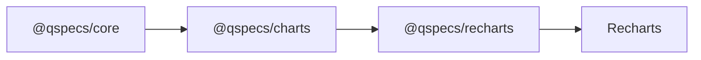

# Presentations and Charts

<cite>
**Referenced Files in This Document**
- [presentations.md](file://docs/presentations.md)
- [10-chart-grouped-series.qspec.json](file://examples/10-chart-grouped-series.qspec.json)
- [11-chart-pie.qspec.json](file://examples/11-chart-pie.qspec.json)
- [index.ts](file://packages/charts/src/index.ts)
- [types.ts](file://packages/charts/src/types.ts)
- [cartesian.ts](file://packages/charts/src/internal/cartesian.ts)
- [pie.ts](file://packages/charts/src/internal/pie.ts)
- [resolve-series.ts](file://packages/charts/src/internal/resolve-series.ts)
- [index.ts](file://packages/recharts/src/index.ts)
</cite>

## Table of Contents

1. Introduction
2. Project Structure
3. Core Components
4. Architecture Overview
5. Detailed Component Analysis
6. Dependency Analysis
7. Performance Considerations
8. Troubleshooting Guide
9. Conclusion

## Introduction

This document explains QSpec’s presentation layer and chart rendering system. It focuses on how presentations define the visual representation of transformed data using declarative chart specifications, how series are resolved, and how the Recharts integration renders charts. It also covers chart types, axis configuration, styling options, responsive design considerations, accessibility features, performance for large datasets, and patterns for custom renderer development.

## Project Structure

QSpec separates chart semantics from rendering:

- @qspecs/charts defines chart presentation types (line, bar, area, scatter, pie), validates them, extracts field references, and resolves series into a stable model without rendering anything.
- @qspecs/recharts provides React components that consume the resolved model and render via Recharts.

**Diagram sources**

- [index.ts:31-54](file://packages/charts/src/index.ts#L31-L54)
- [resolve-series.ts:28-85](file://packages/charts/src/internal/resolve-series.ts#L28-L85)
- [index.ts:1-32](file://packages/recharts/src/index.ts#L1-L32)

**Section sources**

- [presentations.md:19-119](file://docs/presentations.md#L19-L119)
- [index.ts:31-54](file://packages/charts/src/index.ts#L31-L54)
- [index.ts:1-32](file://packages/recharts/src/index.ts#L1-L32)

## Core Components

- Presentation definitions describe semantic intent: axes, series, legends, tooltips. They do not specify pixel-level rendering or library internals.
- Chart types:
  - Cartesian: line, bar, area, scatter share one shape with an x axis and one or more series.
  - Pie: category and value fields; no x axis and no dynamic series list.
- Series resolution:
  - Explicit series: each entry maps to one ResolvedSeries with points derived row-by-row.
  - Grouped series: rows partitioned by a groupBy field into multiple series at call time.
- Shared resolver:
  - resolveSeries centralizes ordering, null handling, and label construction so all renderers agree on the same output.

Key responsibilities:

- Validation and field reference extraction ensure early errors and safe downstream processing.
- The resolved model is immutable to callers and carries enough context (including per-point index) for correct axis ordering when merging series.

**Section sources**

- [presentations.md:19-119](file://docs/presentations.md#L19-L119)
- [presentations.md:121-270](file://docs/presentations.md#L121-L270)
- [types.ts:3-87](file://packages/charts/src/types.ts#L3-L87)
- [resolve-series.ts:28-85](file://packages/charts/src/internal/resolve-series.ts#L28-L85)

## Architecture Overview

The presentation pipeline enforces separation between declaration and rendering:

**Diagram sources**

- [index.ts:31-54](file://packages/charts/src/index.ts#L31-L54)
- [cartesian.ts:18-94](file://packages/charts/src/internal/cartesian.ts#L18-L94)
- [pie.ts:18-43](file://packages/charts/src/internal/pie.ts#L18-L43)
- [resolve-series.ts:28-85](file://packages/charts/src/internal/resolve-series.ts#L28-L85)
- [index.ts:1-32](file://packages/recharts/src/index.ts#L1-L32)

## Detailed Component Analysis

### Chart Types and Specifications

- Cartesian presentations (line, bar, area, scatter):
  - Axes: x required; y optional (label only).
  - Series: either an array of explicit series or a grouped series object.
  - Display blocks: legend and tooltip with visibility toggles.
- Pie presentation:
  - Fields: category (slice label) and value (slice size).
  - No x axis and no series list; legend and tooltip supported similarly.

Styling and display:

- Legend and tooltip currently support visibility flags only. More advanced formatting is intentionally out of scope today.

Examples:

- Grouped line chart manifest demonstrates dynamic series via groupBy.
- Pie chart manifest demonstrates category/value mapping.

**Section sources**

- [types.ts:3-87](file://packages/charts/src/types.ts#L3-L87)
- [cartesian.ts:18-94](file://packages/charts/src/internal/cartesian.ts#L18-L94)
- [pie.ts:18-43](file://packages/charts/src/internal/pie.ts#L18-L43)
- [presentations.md:72-119](file://docs/presentations.md#L72-L119)
- [10-chart-grouped-series.qspec.json:1-44](file://examples/10-chart-grouped-series.qspec.json#L1-L44)
- [11-chart-pie.qspec.json:1-31](file://examples/11-chart-pie.qspec.json#L1-L31)

### Series Resolution and Grouping Behavior

- Explicit series:
  - Each series entry produces one ResolvedSeries with points mapped directly from dataset rows.
- Grouped series:
  - Rows partitioned by distinct values of groupBy into separate series.
  - Group order follows first-appearance order in the dataset.
  - Null/undefined and empty-string group values merge into one series labeled “(none)”.
  - Declared label becomes a prefix combined with the group label.
- Per-point index:
  - Every point carries its original dataset row index to enable correct interleaving when merging series onto a shared axis.

**Diagram sources**

- [resolve-series.ts:28-85](file://packages/charts/src/internal/resolve-series.ts#L28-L85)

**Section sources**

- [presentations.md:121-270](file://docs/presentations.md#L121-L270)
- [resolve-series.ts:28-85](file://packages/charts/src/internal/resolve-series.ts#L28-L85)

### Axis Configuration

- X axis (Cartesian):
  - Requires a field name and optional label.
  - Field must exist in the projected dataset schema; validation uses extracted field references.
- Y axis (Cartesian):
  - Optional; supports label only in current specification.
- Category and Value (Pie):
  - Both require field names and optional labels.

Validation ensures required fields and warns about duplicates in explicit series arrays.

**Section sources**

- [cartesian.ts:18-94](file://packages/charts/src/internal/cartesian.ts#L18-L94)
- [pie.ts:18-43](file://packages/charts/src/internal/pie.ts#L18-L43)
- [presentations.md:72-119](file://docs/presentations.md#L72-L119)

### Styling Options

- Legend and Tooltip:
  - Visibility toggle available across all chart types.
  - Advanced formatting (positioning, content templates, colors) is not represented in the current specification.

**Section sources**

- [presentations.md:110-119](file://docs/presentations.md#L110-L119)
- [types.ts:20-26](file://packages/charts/src/types.ts#L20-L26)

### Integration with Recharts and Custom Renderer Support

- @qspecs/recharts exposes React components for each presentation type and a dispatcher component that routes to the appropriate renderer based on presentation.type.
- The Recharts package depends on Recharts v3 and React and marks itself client-only due to browser-specific rendering.
- Custom renderers can implement their own consumers of the resolved model exported by @qspecs/charts, ensuring consistent behavior across renderers.

**Diagram sources**

- [index.ts:1-32](file://packages/recharts/src/index.ts#L1-L32)

**Section sources**

- [index.ts:1-32](file://packages/recharts/src/index.ts#L1-L32)

### Examples

- Grouped line chart:
  - Demonstrates parameters, query bindings, dataset schema, and a grouped series using groupBy.
- Pie chart:
  - Demonstrates category/value mapping and simple legend/tooltip visibility.

Use these manifests as concrete references for structure and naming conventions.

**Section sources**

- [10-chart-grouped-series.qspec.json:1-44](file://examples/10-chart-grouped-series.qspec.json#L1-L44)
- [11-chart-pie.qspec.json:1-31](file://examples/11-chart-pie.qspec.json#L1-L31)

## Dependency Analysis

- @qspecs/charts registers presentation types and the Chart resource kind, requiring both a query and a presentation.
- @qspecs/recharts depends on @qspecs/charts and Recharts to render.
- Validation and field reference extraction in @qspecs/charts feed core’s static checks against the projected dataset schema.

**Diagram sources**

- [index.ts:31-54](file://packages/charts/src/index.ts#L31-L54)
- [index.ts:1-32](file://packages/recharts/src/index.ts#L1-L32)

**Section sources**

- [index.ts:31-54](file://packages/charts/src/index.ts#L31-L54)
- [index.ts:1-32](file://packages/recharts/src/index.ts#L1-L32)

## Performance Considerations

- Large datasets:
  - resolveSeries allocates fresh arrays and objects per call; avoid repeated calls in tight loops.
  - Point values reference dataset cells directly; mutating composite cell values through points affects the dataset—avoid mutation.
- Grouped series:
  - Group order is deterministic (first-appearance order); avoid relying on sorting unless explicitly applied before resolution.
- Rendering:
  - For very large datasets, consider aggregating or sampling prior to visualization.
  - Use appropriate chart types; scatter plots may be less performant than line/bar for dense categorical axes.
- Memory:
  - Minimize redundant transformations; reuse resolved series where possible.

[No sources needed since this section provides general guidance]

## Troubleshooting Guide

Common issues and resolutions:

- Missing or invalid axes:
  - Ensure x.field exists for Cartesian charts; ensure category and value fields exist for pie charts.
- Duplicate series fields:
  - Explicit series arrays cannot contain duplicate field names; deduplicate or consolidate.
- Grouped series labeling:
  - Null/undefined and empty-string group values merge into one series labeled “(none)”; adjust data or grouping strategy if you need them separated.
- Unknown presentation type:
  - The dispatcher throws a named error for unrecognized types; verify presentation.type matches a registered type.
- Schema mismatches:
  - Field references are validated against the projected dataset schema; fix typos or update transforms to produce expected fields.

**Section sources**

- [cartesian.ts:18-94](file://packages/charts/src/internal/cartesian.ts#L18-L94)
- [pie.ts:18-43](file://packages/charts/src/internal/pie.ts#L18-L43)
- [resolve-series.ts:28-85](file://packages/charts/src/internal/resolve-series.ts#L28-L85)
- [presentations.md:121-270](file://docs/presentations.md#L121-L270)

## Conclusion

QSpec’s presentation layer defines clear, declarative chart specifications that are independent of any rendering library. @qspecs/charts standardizes validation, field referencing, and series resolution, while @qspecs/recharts provides a ready-to-use React-based renderer. This separation enables portability, consistency, and extensibility: authors declare intent once, and renderers implement it consistently. For advanced needs, custom renderers can consume the resolved model to build alternative visuals while preserving the same semantics.
