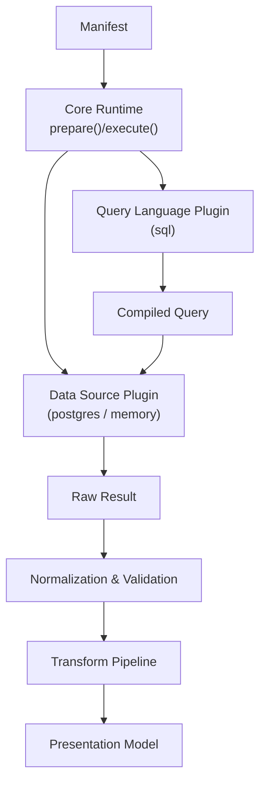
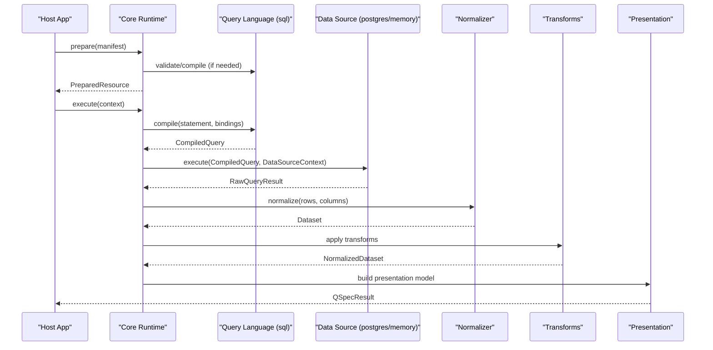
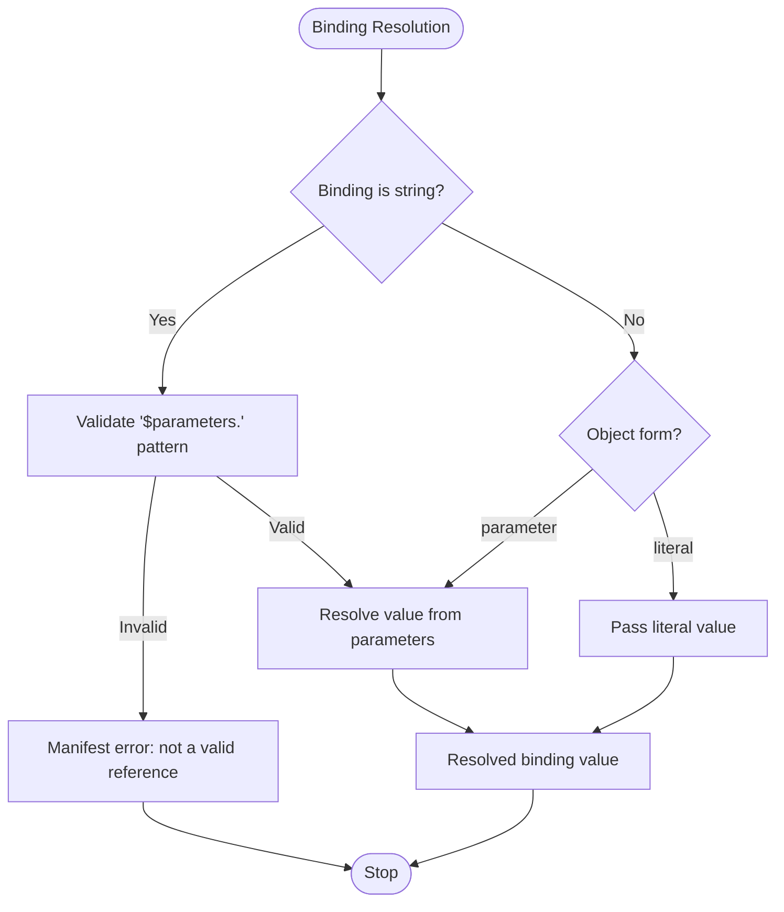
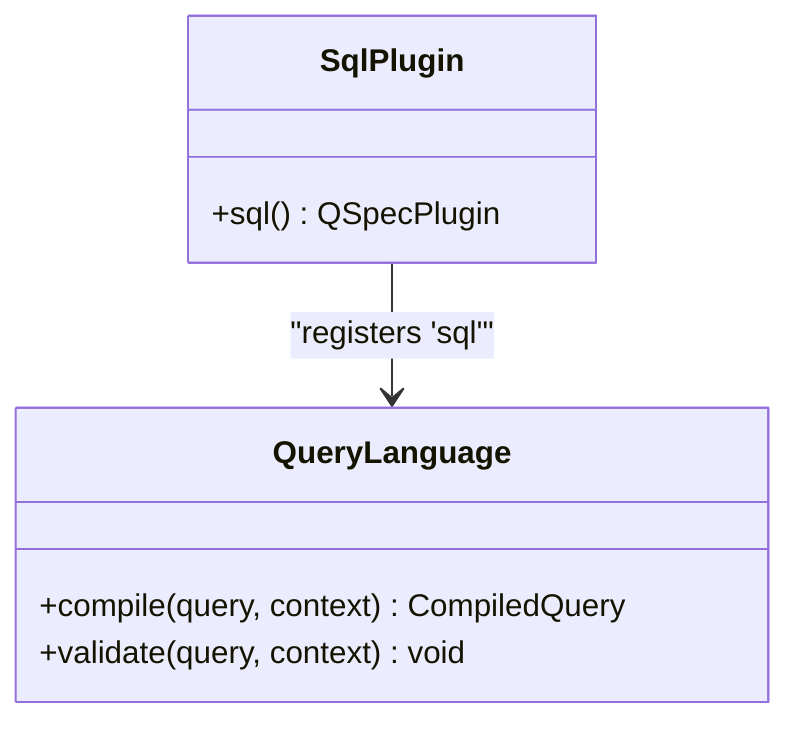
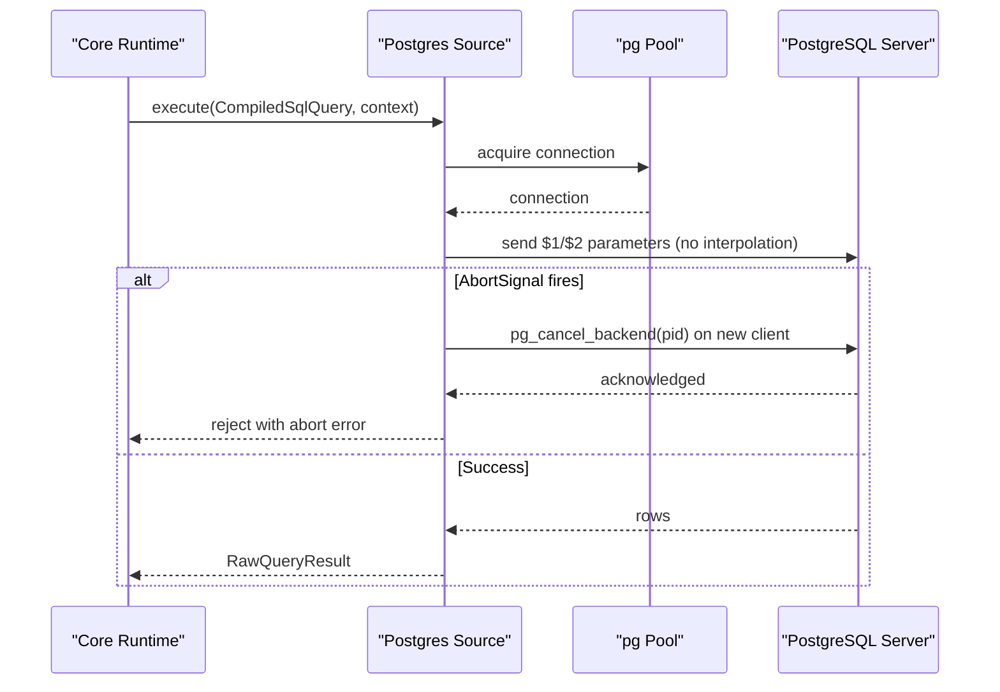
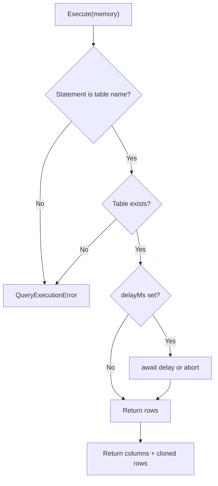
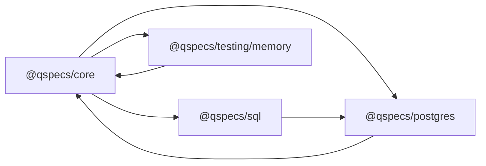

# Queries and Data Sources

<cite>
**Referenced Files in This Document**
- [README.md](file://README.md)
- [architecture.md](file://docs/architecture.md)
- [queries.md](file://docs/queries.md)
- [data-sources.md](file://docs/data-sources.md)
- [manifest-specification.md](file://docs/manifest-specification.md)
- [security.md](file://docs/security.md)
- [core index.ts](file://packages/core/src/index.ts)
- [sql index.ts](file://packages/sql/src/index.ts)
- [postgres index.ts](file://packages/postgres/src/index.ts)
- [memory data source](file://packages/testing/src/memory.ts)
</cite>

## Table of Contents

1. Introduction
2. Project Structure
3. Core Components
4. Architecture Overview
5. Detailed Component Analysis
6. Dependency Analysis
7. Performance Considerations
8. Troubleshooting Guide
9. Conclusion
10. Appendices

## Introduction

This document explains how QSpec compiles queries from manifest definitions and executes them against pluggable data sources. It covers the query language system (SQL and memory-based), data source configuration, connection management, parameter binding, result normalization, error handling, performance considerations, and security guarantees such as parameterized execution and safe boundaries between client and server.

QSpec’s runtime separates static preparation from per-call execution: prepare() performs structural validation, capability resolution, transform projection, and presentation validation; execute() validates runtime parameters, resolves bindings, compiles and runs a query through a registered data source, normalizes results, applies transforms, and builds a presentation model.

**Section sources**

- [README.md:1-10](file://README.md#L1-L10)
- [architecture.md:65-86](file://docs/architecture.md#L65-L86)

## Project Structure

At a high level, the repository is organized into:

- Core runtime and types that define the pipeline, plugin contracts, and public API surface.
- Query language plugins (e.g., SQL).
- Data source plugins (e.g., PostgreSQL, in-memory testing).
- Transforms and presentations for shaping and describing output.
- HTTP and React integration for browser/server separation.

**Diagram sources**

- [architecture.md:9-63](file://docs/architecture.md#L9-L63)
- [sql index.ts:1-30](file://packages/sql/src/index.ts#L1-L30)
- [postgres index.ts:1-40](file://packages/postgres/src/index.ts#L1-L40)
- [memory data source:61-161](file://packages/testing/src/memory.ts#L61-L161)

**Section sources**

- [architecture.md:9-63](file://docs/architecture.md#L9-L63)
- [core index.ts:1-106](file://packages/core/src/index.ts#L1-L106)

## Core Components

- Query language plugin contract: compile(statement, context) produces a compiled query; validate can enforce language-specific rules at prepare/execute time.
- Data source plugin contract: execute(compiledQuery, context) returns RawQueryResult with columns and positional rows; optional dispose(); supportedLanguages declares which languages it can run.
- Binding model: bindings map names referenced in a statement to values from parameters or literals, resolved during prepare() and executed per call.
- Normalization and validation: raw results are normalized into a Dataset and validated against spec.dataset when declared.
- Transform pipeline: declarative steps reshape datasets immutably; describe() enables static schema projection for presentation validation.

Key responsibilities by package:

- @qspecs/core: runtime orchestration, plugin registry, types, limits, and public API.
- @qspecs/sql: dialect-neutral SQL compilation to a structure without concatenated text.
- @qspecs/postgres: pooled connections, cancellation, type handling, and rendering to driver parameters.
- @qspecs/testing/memory: in-memory tables and pass-through language for tests.

**Section sources**

- [data-sources.md:11-67](file://docs/data-sources.md#L11-L67)
- [queries.md:23-148](file://docs/queries.md#L23-L148)
- [architecture.md:204-258](file://docs/architecture.md#L204-L258)
- [sql index.ts:1-30](file://packages/sql/src/index.ts#L1-L30)
- [postgres index.ts:1-40](file://packages/postgres/src/index.ts#L1-L40)
- [memory data source:61-161](file://packages/testing/src/memory.ts#L61-L161)

## Architecture Overview

The end-to-end flow from manifest to result:

**Diagram sources**

- [architecture.md:9-63](file://docs/architecture.md#L9-L63)
- [architecture.md:65-86](file://docs/architecture.md#L65-L86)
- [sql index.ts:16-29](file://packages/sql/src/index.ts#L16-L29)
- [postgres index.ts:30-39](file://packages/postgres/src/index.ts#L30-L39)
- [memory data source:69-159](file://packages/testing/src/memory.ts#L69-L159)

## Detailed Component Analysis

### Query Compilation and Parameter Binding

- source and language are independent: source names a configured data source; language is resolved from the registry.
- Bindings support string shorthand for parameters, explicit object forms, and literal constants. All values reach the data source as bound parameters, never interpolated into statement text.
- For SQL, statements with :name placeholders are scanned and compiled into a structure with segments and values; no concatenated text field exists to prevent injection.
- Bindings are compiled once in prepare() and resolved per execute() call against validated parameters.

**Diagram sources**

- [queries.md:43-148](file://docs/queries.md#L43-L148)

**Section sources**

- [queries.md:23-148](file://docs/queries.md#L23-L148)
- [architecture.md:287-345](file://docs/architecture.md#L287-L345)

### SQL Query Language Plugin

- Registers the "sql" query language with compile and validate hooks.
- Produces a dialect-neutral compiled query suitable for any SQL adapter.

**Diagram sources**

- [sql index.ts:1-30](file://packages/sql/src/index.ts#L1-L30)

**Section sources**

- [sql index.ts:1-30](file://packages/sql/src/index.ts#L1-L30)

### PostgreSQL Data Source Plugin

- Provides a pooled Postgres-backed data source that executes the "sql" language.
- Connection strings are host-supplied configuration, never part of manifests.
- Implements cancellation via a separate backend cancel request and preserves pool reuse semantics.

**Diagram sources**

- [postgres index.ts:1-40](file://packages/postgres/src/index.ts#L1-L40)
- [architecture.md:346-375](file://docs/architecture.md#L346-L375)

**Section sources**

- [postgres index.ts:1-40](file://packages/postgres/src/index.ts#L1-L40)
- [data-sources.md:131-163](file://docs/data-sources.md#L131-L163)
- [architecture.md:346-375](file://docs/architecture.md#L346-L375)

### In-Memory Data Source and Memory Query Language

- Provides an in-memory data source plus a pass-through query language for tests.
- Statement is a table name; bindings are recorded but not applied (filtering belongs to transforms).
- Supports delay and AbortSignal to exercise cancellation paths.

**Diagram sources**

- [memory data source:61-161](file://packages/testing/src/memory.ts#L61-L161)

**Section sources**

- [memory data source:61-161](file://packages/testing/src/memory.ts#L61-L161)

### Data Source Configuration and Connection Management

- Data sources are registered by name; manifests reference logical names only.
- PostgreSQL uses pooling; cancellation opens a dedicated client to issue a backend cancel command, then waits for acknowledgment before rejecting the caller.
- Omitting supportedLanguages accepts all languages for backward compatibility; explicitly declaring it enables fail-fast checks.

**Section sources**

- [data-sources.md:11-67](file://docs/data-sources.md#L11-L67)
- [data-sources.md:131-163](file://docs/data-sources.md#L131-L163)
- [security.md:17-33](file://docs/security.md#L17-L33)

### Query Optimization Strategies

- Static validation and transform projection occur in prepare(), preventing unnecessary database calls for unrenderable manifests.
- Parameterized queries avoid injection and enable efficient execution plans on backends.
- Presentation validation happens before execution using projected schemas from transforms’ describe().

**Section sources**

- [architecture.md:65-86](file://docs/architecture.md#L65-L86)
- [architecture.md:204-258](file://docs/architecture.md#L204-L258)

### Multi-Source Retrieval Patterns

- Each manifest targets one source and one language; multi-source retrieval is achieved by composing multiple manifests/resources and merging results at the application layer.
- The HTTP boundary carries only resource names and parameters, keeping queries and credentials server-side.

**Section sources**

- [queries.md:23-41](file://docs/queries.md#L23-L41)
- [security.md:148-180](file://docs/security.md#L148-L180)

### Query Result Normalization and Validation

- RawQueryResult contains columns and positional rows; core normalizes this into a Dataset.
- If spec.dataset is declared, returned data is validated against the schema after normalization.

**Section sources**

- [data-sources.md:11-44](file://docs/data-sources.md#L11-L44)
- [architecture.md:65-86](file://docs/architecture.md#L65-L86)

### Error Handling

- Manifest errors (binding patterns, undeclared parameters) fail early in prepare().
- Query execution errors and aborts are surfaced with structured codes; drivers’ sensitive messages are not logged or forwarded verbatim.
- HTTP handler maps non-validation errors to safe responses.

**Section sources**

- [queries.md:68-135](file://docs/queries.md#L68-L135)
- [security.md:124-147](file://docs/security.md#L124-L147)

### Security Aspects

- No credentials in manifests; connection details are host configuration.
- SQL adapters must use native parameterization; the compiled query structure prevents concatenation.
- No eval/new Function; expressions use a fixed AST interpreter.
- Prototype pollution resistance across parsing, storage, registries, and wire protocol.
- Resource limits enforced at runtime.
- HTTP boundary carries only resource name and parameters; server resolves manifests internally.

**Section sources**

- [security.md:17-147](file://docs/security.md#L17-L147)
- [security.md:148-199](file://docs/security.md#L148-L199)

## Dependency Analysis

**Diagram sources**

- [core index.ts:1-106](file://packages/core/src/index.ts#L1-L106)
- [sql index.ts:1-30](file://packages/sql/src/index.ts#L1-L30)
- [postgres index.ts:1-40](file://packages/postgres/src/index.ts#L1-L40)
- [memory data source:1-161](file://packages/testing/src/memory.ts#L1-L161)

**Section sources**

- [core index.ts:1-106](file://packages/core/src/index.ts#L1-L106)
- [sql index.ts:1-30](file://packages/sql/src/index.ts#L1-L30)
- [postgres index.ts:1-40](file://packages/postgres/src/index.ts#L1-L40)
- [memory data source:1-161](file://packages/testing/src/memory.ts#L1-L161)

## Performance Considerations

- Use prepare() to cache prepared resources and reuse across many parameter sets.
- Keep transforms minimal and leverage server-side filtering where possible; remember memory source does not apply bindings—use transforms for filtering.
- Avoid large result sets; rely on limits and pagination strategies at the application layer.
- Prefer parameterized queries to benefit from backend plan caching and avoid injection overhead.

[No sources needed since this section provides general guidance]

## Troubleshooting Guide

Common issues and resolutions:

- Binding string not matching parameter reference pattern: ensure format "$parameters.<name>" or use { "parameter": "<name>" }.
- Undeclared parameter reference: check spec.parameters and fix typos; diagnostics include suggestions.
- Missing table in memory source: verify table name matches configured tables.
- Aborted queries: ensure AbortSignal is passed and handled; for Postgres, cancellation uses a separate backend call.
- Unexpected column types: numeric/bigint remain strings in Postgres; parse in transforms if needed.

**Section sources**

- [queries.md:68-135](file://docs/queries.md#L68-L135)
- [memory data source:80-141](file://packages/testing/src/memory.ts#L80-L141)
- [architecture.md:376-395](file://docs/architecture.md#L376-L395)

## Conclusion

QSpec’s query processing and data source architecture cleanly separates manifest-driven declarations from runtime execution. The pluggable query language and data source model enable SQL and memory-based execution with strong safety guarantees. Parameter binding, result normalization, and transform pipelines provide predictable, testable behavior. Security is enforced by design: no credentials in manifests, parameterized queries, strict boundaries over HTTP, and robust error handling.

[No sources needed since this section summarizes without analyzing specific files]

## Appendices

### Example References

- Parameterized SQL query example manifest path: [examples/03-parameterized-query.qspec.json](file://examples/03-parameterized-query.qspec.json)
- Complete manifest example path: [examples/01-complete-manifest.qspec.json](file://examples/01-complete-manifest.qspec.json)

**Section sources**

- [queries.md:150-155](file://docs/queries.md#L150-L155)
