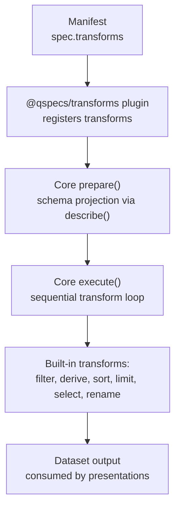
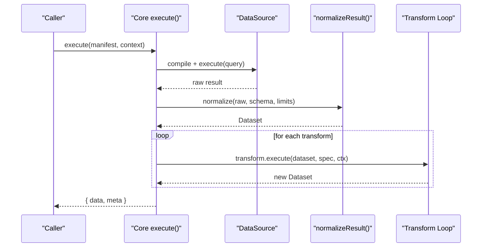
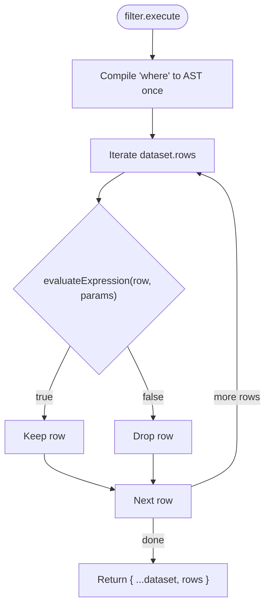
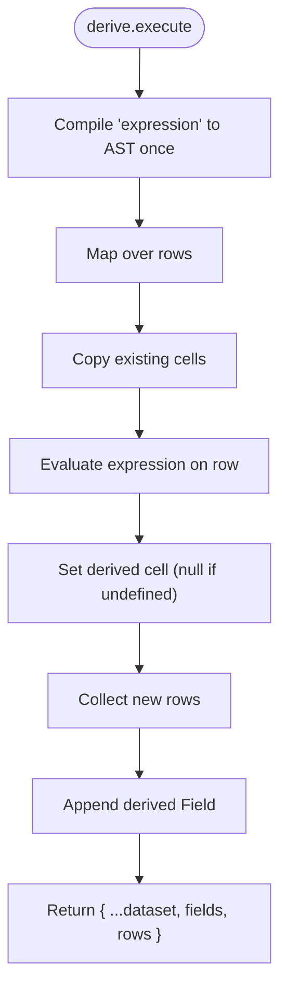
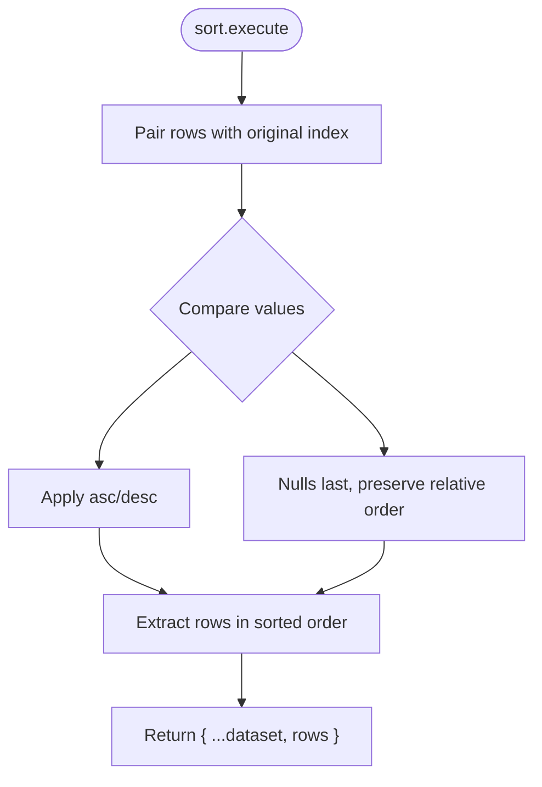
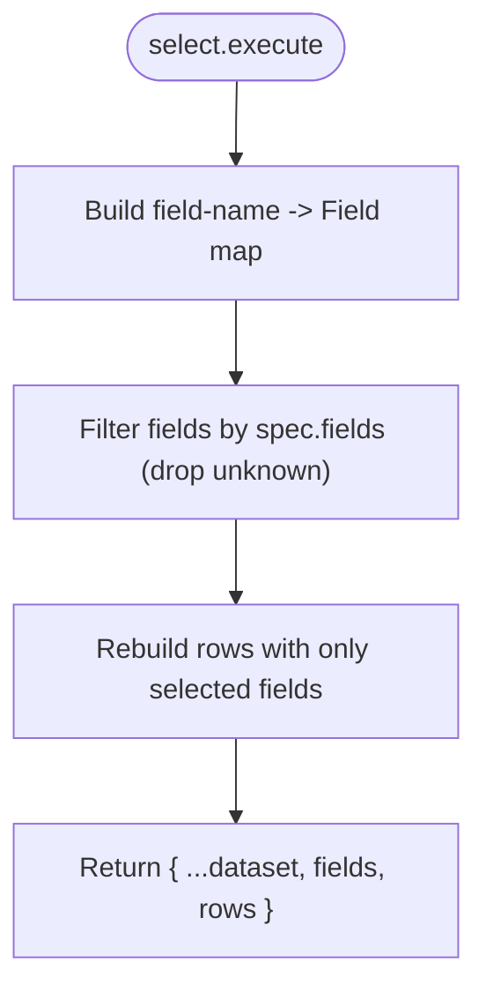
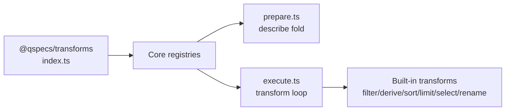

# Transform Pipeline

<cite>
**Referenced Files in This Document**
- [transforms.md](file://docs/transforms.md)
- [architecture.md](file://docs/architecture.md)
- [index.ts](file://packages/transforms/src/index.ts)
- [filter.ts](file://packages/transforms/src/internal/filter.ts)
- [derive.ts](file://packages/transforms/src/internal/derive.ts)
- [sort.ts](file://packages/transforms/src/internal/sort.ts)
- [select.ts](file://packages/transforms/src/internal/select.ts)
- [limit.ts](file://packages/transforms/src/internal/limit.ts)
- [rename.ts](file://packages/transforms/src/internal/rename.ts)
- [prepare.ts](file://packages/core/src/internal/prepare.ts)
- [execute.ts](file://packages/core/src/internal/execute.ts)
- [04-transform-filter.qspec.json](file://examples/04-transform-filter.qspec.json)
- [05-transform-select.qspec.json](file://examples/05-transform-select.qspec.json)
- [06-transform-rename.qspec.json](file://examples/06-transform-rename.qspec.json)
- [07-transform-derive.qspec.json](file://examples/07-transform-derive.qspec.json)
- [08-transform-sort.qspec.json](file://examples/08-transform-sort.qspec.json)
- [09-transform-limit.qspec.json](file://examples/09-transform-limit.qspec.json)
</cite>

## Table of Contents

1. [Introduction](#introduction)
2. [Project Structure](#project-structure)
3. [Core Components](#core-components)
4. [Architecture Overview](#architecture-overview)
5. [Detailed Component Analysis](#detailed-component-analysis)
6. [Dependency Analysis](#dependency-analysis)
7. [Performance Considerations](#performance-considerations)
8. [Troubleshooting Guide](#troubleshooting-guide)
9. [Conclusion](#conclusion)
10. [Appendices](#appendices)

## Introduction

This document explains QSpec’s transform pipeline: how raw dataset results are transformed into presentation-ready formats through declarative operations. It covers the six built-in transforms (filter, select, rename, derive, sort, limit), composition and chaining patterns, performance characteristics, state management, error handling, debugging, and caching strategies grounded in the codebase.

## Project Structure

The transform system is implemented as a plugin that registers standard transforms with the core runtime. The core orchestrates preparation (static validation and schema projection) and execution (querying, normalization, and sequential transform application). Examples demonstrate each transform in real manifests.

**Diagram sources**

- [index.ts:21-39](file://packages/transforms/src/index.ts#L21-L39)
- [prepare.ts:262-284](file://packages/core/src/internal/prepare.ts#L262-L284)
- [execute.ts:187-211](file://packages/core/src/internal/execute.ts#L187-L211)

**Section sources**

- [transforms.md:1-48](file://docs/transforms.md#L1-L48)
- [architecture.md:204-226](file://docs/architecture.md#L204-L226)
- [index.ts:21-39](file://packages/transforms/src/index.ts#L21-L39)
- [prepare.ts:262-284](file://packages/core/src/internal/prepare.ts#L262-L284)
- [execute.ts:187-211](file://packages/core/src/internal/execute.ts#L187-L211)

## Core Components

- Transform interface: execute, optional describe, optional validate.
- Plugin registration: @qspecs/transforms registers all built-ins; expression-based transforms capture maxExpressionDepth at setup.
- Pipeline orchestration: prepare projects fields through describe; execute runs transforms sequentially, reassigning dataset from each return value.

Key responsibilities:

- filter: row-level filtering using expressions or comparison shorthand.
- derive: append a new computed field per row and extend fields.
- sort: stable ordering with nulls-last semantics.
- limit: slice rows with count and offset.
- select: project to named fields in spec order.
- rename: rename fields without reordering; collision-safe.

**Section sources**

- [transforms.md:49-211](file://docs/transforms.md#L49-L211)
- [index.ts:21-39](file://packages/transforms/src/index.ts#L21-L39)
- [prepare.ts:262-284](file://packages/core/src/internal/prepare.ts#L262-L284)
- [execute.ts:187-211](file://packages/core/src/internal/execute.ts#L187-L211)

## Architecture Overview

The pipeline enforces strict, sequential execution with immutable inputs. Each transform returns a fresh Dataset; the executor never mutates the input dataset. Schema projection happens statically via describe before any query runs, enabling early validation of downstream references.

**Diagram sources**

- [execute.ts:187-211](file://packages/core/src/internal/execute.ts#L187-L211)
- [prepare.ts:262-284](file://packages/core/src/internal/prepare.ts#L262-L284)

**Section sources**

- [transforms.md:24-48](file://docs/transforms.md#L24-L48)
- [architecture.md:204-226](file://docs/architecture.md#L204-L226)
- [execute.ts:187-211](file://packages/core/src/internal/execute.ts#L187-L211)

## Detailed Component Analysis

### filter

- Purpose: Keep rows where an expression evaluates truthy.
- Expression support: AST form or comparison shorthand; compiled once per execution.
- Schema impact: No field changes; describe returns input fields unchanged.
- Validation: Ensures required where; compiles expression during validate to report precise issues; checks referenced fields against known schema when available.

**Diagram sources**

- [filter.ts:26-43](file://packages/transforms/src/internal/filter.ts#L26-L43)

**Section sources**

- [transforms.md:65-78](file://docs/transforms.md#L65-L78)
- [filter.ts:26-83](file://packages/transforms/src/internal/filter.ts#L26-L83)
- [04-transform-filter.qspec.json:23-28](file://examples/04-transform-filter.qspec.json#L23-L28)

### derive

- Purpose: Compute a new field per row and append it to both rows and fields.
- Expression support: Full AST; compiled once per execution.
- Schema impact: Appends a new Field with nullable true; describe mirrors execute to keep static and runtime schemas aligned.
- Validation: Requires field name, fieldType, and expression; validates fieldType; checks for collisions and referenced fields.

**Diagram sources**

- [derive.ts:46-70](file://packages/transforms/src/internal/derive.ts#L46-L70)

**Section sources**

- [transforms.md:80-113](file://docs/transforms.md#L80-L113)
- [derive.ts:46-146](file://packages/transforms/src/internal/derive.ts#L46-L146)
- [07-transform-derive.qspec.json:22-32](file://examples/07-transform-derive.qspec.json#L22-L32)

### sort

- Purpose: Order rows by a single field with direction control.
- Semantics: Nulls sort last in both directions; stable via indexed decorate-sort-undecorate; comparison rules mirror expression evaluator to avoid drift.
- Schema impact: No field changes.

**Diagram sources**

- [sort.ts:25-49](file://packages/transforms/src/internal/sort.ts#L25-L49)

**Section sources**

- [transforms.md:114-139](file://docs/transforms.md#L114-L139)
- [sort.ts:25-72](file://packages/transforms/src/internal/sort.ts#L25-L72)
- [08-transform-sort.qspec.json:21-27](file://examples/08-transform-sort.qspec.json#L21-L27)

### limit

- Purpose: Slice rows using count and optional offset.
- Semantics: Plain slice; no cursor semantics beyond caller-provided offset.
- Schema impact: No field changes.

**Section sources**

- [transforms.md:141-155](file://docs/transforms.md#L141-L155)
- [limit.ts:1-200](file://packages/transforms/src/internal/limit.ts#L1-L200)
- [09-transform-limit.qspec.json:21-27](file://examples/09-transform-limit.qspec.json#L21-L27)

### select

- Purpose: Project dataset to a specified set of fields in the order listed.
- Semantics: Unknown names are silently dropped at runtime; static validation catches unknowns when schema is available.
- Schema impact: describe mirrors execute to ensure projected fields match runtime output.

**Diagram sources**

- [select.ts:9-32](file://packages/transforms/src/internal/select.ts#L9-L32)

**Section sources**

- [transforms.md:157-176](file://docs/transforms.md#L157-L176)
- [select.ts:9-67](file://packages/transforms/src/internal/select.ts#L9-L67)
- [05-transform-select.qspec.json:23-28](file://examples/05-transform-select.qspec.json#L23-L28)

### rename

- Purpose: Rename listed fields while preserving positions of others.
- Semantics: Collision detection at both validate and execute time; prototype-safe property access to avoid accidental Object.prototype reads.
- Schema impact: describe mirrors execute so downstream stages see renamed names.

**Section sources**

- [transforms.md:177-211](file://docs/transforms.md#L177-L211)
- [rename.ts:1-200](file://packages/transforms/src/internal/rename.ts#L1-L200)
- [06-transform-rename.qspec.json:22-31](file://examples/06-transform-rename.qspec.json#L22-L31)

### Expression AST and operators

- Supported forms: field, literal, parameter, operator with arguments; plus a comparison shorthand expanded to AST.
- Fixed operator set: comparison, logical, membership, null, arithmetic, other; arity enforced at compile time.
- Null semantics: propagate through arithmetic; comparisons with null yield false; eq/ne treat two nulls as equal.
- Depth limit: maxExpressionDepth enforced at both prepare and execute; errors downgraded to issues during validate.

**Section sources**

- [transforms.md:213-339](file://docs/transforms.md#L213-L339)
- [filter.ts:26-83](file://packages/transforms/src/internal/filter.ts#L26-L83)
- [derive.ts:46-146](file://packages/transforms/src/internal/derive.ts#L46-L146)

### describe contract and schema opacity

- describe is purely static: given incoming fields, returns outgoing fields without touching data.
- If any transform lacks describe, projection stops there; downstream static validation is lost.
- All six built-ins implement describe to preserve static guarantees.

**Section sources**

- [transforms.md:340-392](file://docs/transforms.md#L340-L392)
- [prepare.ts:262-284](file://packages/core/src/internal/prepare.ts#L262-L284)

## Dependency Analysis

- Plugin boundary: @qspecs/transforms registers transforms with the core registry; expression-based transforms capture limits at setup.
- Core boundaries: prepare computes projected fields via describe; execute runs transforms sequentially, wrapping non-QSpecError failures into TransformError and preserving abort semantics.
- Example manifests show concrete usage of each transform.

**Diagram sources**

- [index.ts:21-39](file://packages/transforms/src/index.ts#L21-L39)
- [prepare.ts:262-284](file://packages/core/src/internal/prepare.ts#L262-L284)
- [execute.ts:187-211](file://packages/core/src/internal/execute.ts#L187-L211)

**Section sources**

- [index.ts:21-39](file://packages/transforms/src/index.ts#L21-L39)
- [prepare.ts:262-284](file://packages/core/src/internal/prepare.ts#L262-L284)
- [execute.ts:187-211](file://packages/core/src/internal/execute.ts#L187-L211)

## Performance Considerations

- Sequential execution: Transforms run strictly in declared order; no parallelization or reordering.
- Immutability: Each transform returns a new Dataset; this avoids shared-mutation bugs but creates copies. Prefer efficient transforms (e.g., limit early) to reduce work downstream.
- Expression compilation: filter and derive compile expressions once per execution, not per row.
- Sorting: Stable, indexed decorate-sort-undecorate ensures deterministic tie-breaking; nulls-last behavior avoids unexpected ordering.
- Projection: Use select early to drop unnecessary columns; use limit early to reduce row counts.
- Schema projection: Implement describe for custom transforms to enable static validation and avoid silent failures later.

[No sources needed since this section provides general guidance]

## Troubleshooting Guide

- Unknown transform type: prepare reports unknown transform with suggestions based on registered transforms.
- Missing describe: If a transform omits describe, downstream static validation is disabled; fix by implementing describe to restore guarantees.
- Expression errors: Malformed operators, wrong arity, or depth exceeded are reported with precise paths during validate; at runtime, depth violations surface as LimitExceededError.
- Field collisions: rename detects collisions at both validate and execute time; derive rejects duplicate field names.
- Abort/cancellation: Aborts are preserved through the pipeline; transform failures are wrapped as TransformError unless already QSpecError or abort-like.

**Section sources**

- [prepare.ts:262-284](file://packages/core/src/internal/prepare.ts#L262-L284)
- [execute.ts:187-211](file://packages/core/src/internal/execute.ts#L187-L211)
- [transforms.md:340-392](file://docs/transforms.md#L340-L392)
- [filter.ts:45-83](file://packages/transforms/src/internal/filter.ts#L45-L83)
- [derive.ts:72-146](file://packages/transforms/src/internal/derive.ts#L72-L146)
- [rename.ts:1-200](file://packages/transforms/src/internal/rename.ts#L1-L200)

## Conclusion

QSpec’s transform pipeline provides a robust, declarative way to shape datasets for presentation. Its design emphasizes immutability, static schema projection via describe, and predictable execution semantics. By composing built-in transforms thoughtfully and following the guidelines above, authors can build reliable, efficient pipelines that are easy to validate and debug.

[No sources needed since this section summarizes without analyzing specific files]

## Appendices

### Practical examples

- Filter with comparison shorthand: [04-transform-filter.qspec.json:23-28](file://examples/04-transform-filter.qspec.json#L23-L28)
- Select to drop internal columns: [05-transform-select.qspec.json:23-28](file://examples/05-transform-select.qspec.json#L23-L28)
- Rename snake_case to clean names: [06-transform-rename.qspec.json:22-31](file://examples/06-transform-rename.qspec.json#L22-L31)
- Derive computed totals: [07-transform-derive.qspec.json:22-32](file://examples/07-transform-derive.qspec.json#L22-L32)
- Sort descending: [08-transform-sort.qspec.json:21-27](file://examples/08-transform-sort.qspec.json#L21-L27)
- Paginate with limit: [09-transform-limit.qspec.json:21-27](file://examples/09-transform-limit.qspec.json#L21-L27)

**Section sources**

- [04-transform-filter.qspec.json:23-28](file://examples/04-transform-filter.qspec.json#L23-L28)
- [05-transform-select.qspec.json:23-28](file://examples/05-transform-select.qspec.json#L23-L28)
- [06-transform-rename.qspec.json:22-31](file://examples/06-transform-rename.qspec.json#L22-L31)
- [07-transform-derive.qspec.json:22-32](file://examples/07-transform-derive.qspec.json#L22-L32)
- [08-transform-sort.qspec.json:21-27](file://examples/08-transform-sort.qspec.json#L21-L27)
- [09-transform-limit.qspec.json:21-27](file://examples/09-transform-limit.qspec.json#L21-L27)

### Custom transform development checklist

- Implement execute to return a new Dataset without mutating input.
- Implement describe to project fields accurately; omitting it disables downstream static validation.
- Optionally implement validate to check spec structure and field references when schema is available.
- Respect abort signals and do not block cancellation.
- Avoid global state; prefer pure functions for predictability.

**Section sources**

- [architecture.md:204-226](file://docs/architecture.md#L204-L226)
- [transforms.md:340-392](file://docs/transforms.md#L340-L392)
- [execute.ts:187-211](file://packages/core/src/internal/execute.ts#L187-L211)
