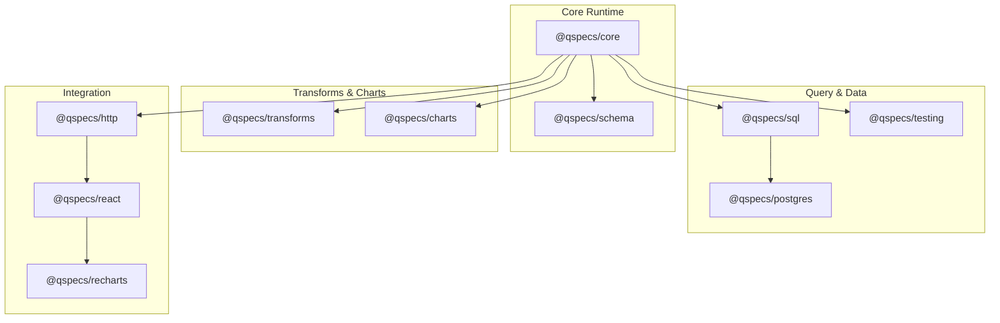
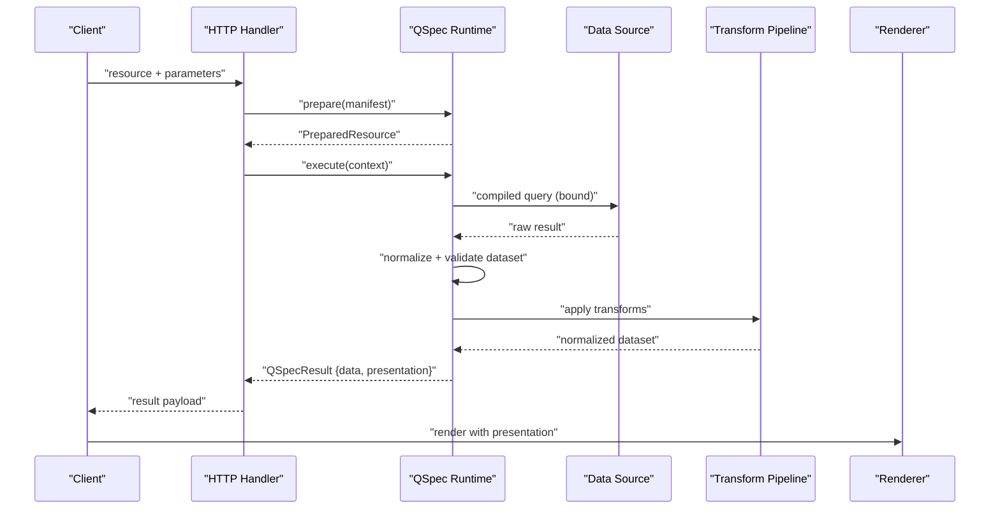
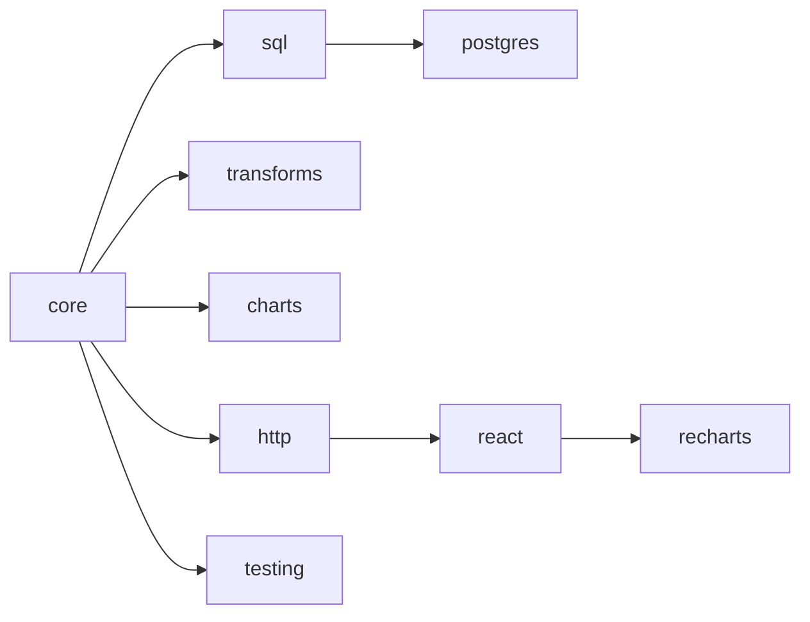

# Advanced Patterns

<cite>
**Referenced Files in This Document**
- [README.md](file://README.md)
- [SPEC.md](file://SPEC.md)
- [architecture.md](file://docs/architecture.md)
- [queries.md](file://docs/queries.md)
- [transforms.md](file://docs/transforms.md)
- [presentations.md](file://docs/presentations.md)
- [01-complete-manifest.qspec.json](file://examples/01-complete-manifest.qspec.json)
- [10-chart-grouped-series.qspec.json](file://examples/10-chart-grouped-series.qspec.json)
- [11-chart-pie.qspec.json](file://examples/11-chart-pie.qspec.json)
- [monthly-revenue-chart.qspec.json](file://fixtures/valid/monthly-revenue-chart.qspec.json)
- [pipeline.test.ts](file://test/pipeline.test.ts)
- [postgres-pipeline.test.ts](file://test/postgres-pipeline.test.ts)
- [react-pipeline.test.tsx](file://test/react-pipeline.test.tsx)
</cite>

## Table of Contents

1. Introduction
2. Project Structure
3. Core Components
4. Architecture Overview
5. Detailed Component Analysis
6. Dependency Analysis
7. Performance Considerations
8. Troubleshooting Guide
9. Conclusion
10. Appendices

## Introduction

This document focuses on advanced QSpec patterns and complex use cases: multi-source queries, complex transform compositions, advanced chart configurations, time-series analysis, aggregations, real-world dashboards, testing strategies with fixtures and mock data, handling large datasets with pagination, query performance optimization, integration patterns with external systems, deployment considerations, troubleshooting for complex scenarios, and performance tuning techniques. It synthesizes the repository’s specification, architecture, examples, and tests into actionable guidance for sophisticated analytical scenarios.

## Project Structure

QSpec is a modular monorepo where each capability lives in its own package under packages/. The runtime composes plugins to form an execution pipeline that validates manifests, compiles queries, executes against data sources, normalizes results, applies transforms, and produces presentation models. Examples and fixtures demonstrate end-to-end usage, while tests validate behavior across memory, PostgreSQL, HTTP, and React rendering paths.

**Diagram sources**

- [README.md:15-33](file://README.md#L15-L33)
- [architecture.md:1-63](file://docs/architecture.md#L1-L63)

**Section sources**

- [README.md:15-33](file://README.md#L15-L33)
- [architecture.md:1-63](file://docs/architecture.md#L1-L63)

## Core Components

- Manifest model and runtime: A declarative JSON manifest describes parameters, queries, dataset schema, transforms, and presentation. The runtime performs staged validation and deterministic processing.
- Query language and binding: Queries are compiled independently from data sources; bindings map placeholders to parameter values or literals without string interpolation.
- Transform pipeline: Declarative, ordered steps (filter, derive, sort, limit, select, rename) operate immutably on normalized datasets.
- Presentation model: Semantic descriptions (line, bar, area, scatter, pie) define how to render datasets without embedding renderer-specific details.
- Integration layers: HTTP server handler, React provider/resource, and Recharts renderer compose a full browser/server loop.

Key references:

- Pipeline stages and prepare/execute split
- Binding model and security guarantees
- Transform semantics and expression AST
- Chart model and series resolution

**Section sources**

- [SPEC.md:14-45](file://SPEC.md#L14-L45)
- [architecture.md:65-105](file://docs/architecture.md#L65-L105)
- [queries.md:23-148](file://docs/queries.md#L23-L148)
- [transforms.md:24-339](file://docs/transforms.md#L24-L339)
- [presentations.md:19-120](file://docs/presentations.md#L19-L120)

## Architecture Overview

The runtime pipeline enforces strict separation between static preparation and dynamic execution, ensuring early failure for invalid manifests and safe, bound query execution.

**Diagram sources**

- [architecture.md:1-63](file://docs/architecture.md#L1-L63)
- [react-pipeline.test.tsx:23-45](file://test/react-pipeline.test.tsx#L23-L45)

**Section sources**

- [architecture.md:1-105](file://docs/architecture.md#L1-L105)
- [react-pipeline.test.tsx:23-45](file://test/react-pipeline.test.tsx#L23-L45)

## Detailed Component Analysis

### Multi-source Queries and Plugin Composition

- Use multiple data sources by registering them under distinct names and referencing them via spec.query.source.
- Combine query languages and sources through plugins; keep source configuration out of manifests.
- Validate capabilities at prepare() time to catch unknown sources or languages before execution.

Practical pattern:

- Register postgres() with named sources.
- Compose sql(), transforms(), charts().
- Reference a logical source name in manifests; host wires it to credentials.

**Section sources**

- [README.md:44-97](file://README.md#L44-L97)
- [architecture.md:123-156](file://docs/architecture.md#L123-L156)

### Complex Transform Compositions

- Order matters: transforms execute sequentially and immutably; each step sees only the previous output.
- Use filter to narrow rows, derive to compute new fields, sort to order, limit/offset for pagination, select to project columns, rename to align downstream schemas.
- Expression AST supports comparison shorthand and full operator trees; depth limits protect against abuse.

Advanced composition example:

- Filter revenue > 0
- Derive bonus = revenue * 0.1
- Sort by bonus desc
- Limit count and offset for paging

**Section sources**

- [transforms.md:24-155](file://docs/transforms.md#L24-L155)
- [transforms.md:213-339](file://docs/transforms.md#L213-L339)
- [pipeline.test.ts:69-120](file://test/pipeline.test.ts#L69-L120)

### Advanced Chart Configurations and Series Resolution

- Cartesian types (line, bar, area, scatter) share a common shape: x axis plus series list or grouped series.
- Pie type uses category/value instead of x/series.
- Grouped series derive series at render time from a grouping field; resolveSeries centralizes pivoting logic for portability.
- UNGROUPED_LABEL merges null/undefined group values into one series labeled "(none)".

Examples:

- Grouped line chart by region
- Pie chart by category with value field

**Section sources**

- [presentations.md:72-120](file://docs/presentations.md#L72-L120)
- [presentations.md:121-210](file://docs/presentations.md#L121-L210)
- [10-chart-grouped-series.qspec.json:1-44](file://examples/10-chart-grouped-series.qspec.json#L1-L44)
- [11-chart-pie.qspec.json:1-31](file://examples/11-chart-pie.qspec.json#L1-L31)

### Time-Series Analysis and Aggregations

- Aggregate in the query layer (e.g., GROUP BY month) and present as time-series charts.
- Use dataset semanticType and format metadata to annotate currency or other domains.
- Apply transforms post-query to refine series (e.g., filter negative values, derive derived metrics).

Reference manifests:

- Monthly revenue aggregation with date range parameters
- Currency-formatted revenue field

**Section sources**

- [01-complete-manifest.qspec.json:1-90](file://examples/01-complete-manifest.qspec.json#L1-L90)
- [monthly-revenue-chart.qspec.json:1-111](file://fixtures/valid/monthly-revenue-chart.qspec.json#L1-L111)

### Real-World Dashboard Implementations

- Server-side: mount createQSpecHandler behind authentication; expose resource names only.
- Browser-side: use QSpecProvider/QSpecResource to fetch and render; never see SQL or credentials.
- End-to-end test proves Suspense-based loading, re-execution on parameter change, and no secrets on wire or DOM.

**Section sources**

- [react-pipeline.test.tsx:23-45](file://test/react-pipeline.test.tsx#L23-L45)
- [react-pipeline.test.tsx:187-237](file://test/react-pipeline.test.tsx#L187-L237)
- [react-pipeline.test.tsx:476-539](file://test/react-pipeline.test.tsx#L476-L539)
- [react-pipeline.test.tsx:541-597](file://test/react-pipeline.test.tsx#L541-L597)
- [react-pipeline.test.tsx:599-667](file://test/react-pipeline.test.tsx#L599-L667)

### Testing Strategies with Fixtures and Mock Data

- In-memory data source enables fast, deterministic tests without databases.
- Fixture tables define columns and rows; assertions verify transform outcomes and series resolution.
- Rename projection tests ensure static schema projection works across transforms.

Patterns:

- Build a minimal manifest with memory source, transforms, and charts.
- Assert projected fields, row counts, and series points.
- Verify prepare() fails early for misspelled presentation fields.

**Section sources**

- [pipeline.test.ts:14-67](file://test/pipeline.test.ts#L14-L67)
- [pipeline.test.ts:69-162](file://test/pipeline.test.ts#L69-L162)
- [pipeline.test.ts:165-229](file://test/pipeline.test.ts#L165-L229)

### Handling Large Datasets and Pagination

- Use limit with count and offset to page results after sorting.
- Keep heavy aggregation in the query layer; apply light transforms client-side if needed.
- Ensure stable ordering before pagination to maintain consistent pages.

Example:

- Page two of products ordered by revenue using limit count=10, offset=10.

**Section sources**

- [transforms.md:141-155](file://docs/transforms.md#L141-L155)
- [09-transform-limit.qspec.json:1-29](file://examples/09-transform-limit.qspec.json#L1-L29)

### Optimizing Query Performance

- Prefer filtering and aggregation in the database; minimize data transferred.
- Bind parameters safely to avoid injection and enable plan caching.
- Use dataset schema to fail fast when results do not match expectations.
- Leverage prepare() to catch presentation errors before querying.

Evidence:

- Bound parameters never reach DB as interpolated strings.
- Stage 6 runs during prepare() to prevent unnecessary queries.

**Section sources**

- [queries.md:43-148](file://docs/queries.md#L43-L148)
- [architecture.md:65-105](file://docs/architecture.md#L65-L105)

### Integration Patterns with External Systems

- HTTP boundary: server holds runtime and manifests; client sends resource name and parameters.
- React integration: Suspense-first fetching; error boundaries handle failures.
- Security: no SQL, table names, or credentials cross the wire; meta.query omits bound values.

**Section sources**

- [react-pipeline.test.tsx:23-45](file://test/react-pipeline.test.tsx#L23-L45)
- [react-pipeline.test.tsx:541-597](file://test/react-pipeline.test.tsx#L541-L597)

### Deployment Considerations

- Mount createQSpecHandler behind your framework’s auth and rate limiting.
- Provide connection strings via environment variables to data source plugins, never in manifests.
- Use CLI validate --config to run plugin-aware checks in CI.

**Section sources**

- [README.md:35-42](file://README.md#L35-L42)
- [README.md:261-327](file://README.md#L261-L327)

## Dependency Analysis

QSpec’s design isolates domain-specific functionality in plugins, keeping core small and stable. Packages depend on core and optionally on each other through well-defined interfaces.

**Diagram sources**

- [README.md:243-258](file://README.md#L243-L258)
- [architecture.md:158-200](file://docs/architecture.md#L158-L200)

**Section sources**

- [README.md:243-258](file://README.md#L243-L258)
- [architecture.md:158-200](file://docs/architecture.md#L158-L200)

## Performance Considerations

- Push computation to the data source: aggregate, filter, and sort in SQL where possible.
- Use dataset schema to validate results early and avoid downstream failures.
- Apply limit/offset for pagination; ensure deterministic ordering.
- Avoid deep expression nesting; respect maxExpressionDepth.
- Reuse PreparedResource across executions to amortize static work.

[No sources needed since this section provides general guidance]

## Troubleshooting Guide

Common issues and resolutions:

- Unknown dataset field in presentation: caught statically during prepare(); fix field names or adjust transforms to project required fields.
- Missing or mis-typed bindings: ensure bindings reference declared parameters or use literal forms; bare strings must match $parameters.<name>.
- Transform collisions: rename detects duplicate target names; adjust mapping to avoid conflicts.
- Parameter changes not reflected: verify QSpecResource re-executes on parameter updates; confirm cache keys include parameters.
- Secrets leakage: ensure createQSpecHandler is mounted behind auth; verify request/response bodies and rendered DOM do not contain sensitive data.

**Section sources**

- [pipeline.test.ts:122-149](file://test/pipeline.test.ts#L122-L149)
- [queries.md:68-124](file://docs/queries.md#L68-L124)
- [transforms.md:177-211](file://docs/transforms.md#L177-L211)
- [react-pipeline.test.tsx:541-597](file://test/react-pipeline.test.tsx#L541-L597)

## Conclusion

QSpec enables sophisticated analytical workflows through a robust, extensible pipeline: secure parameterized queries, deterministic transforms, and semantic presentations. By composing plugins, leveraging the transform chain, and integrating via HTTP/React, teams can build scalable dashboards and reports. Tests and examples provide concrete patterns for validation, performance, and security. Adhering to the documented practices ensures reliable, maintainable analytics resources.

[No sources needed since this section summarizes without analyzing specific files]

## Appendices

### Example Manifests and Fixtures

- Complete chart manifest with parameters, SQL, dataset schema, transforms, and presentation.
- Grouped series chart demonstrating dynamic series derivation.
- Pie chart showcasing category/value presentation.
- Valid monthly revenue fixture mirroring the complete manifest structure.

**Section sources**

- [01-complete-manifest.qspec.json:1-90](file://examples/01-complete-manifest.qspec.json#L1-L90)
- [10-chart-grouped-series.qspec.json:1-44](file://examples/10-chart-grouped-series.qspec.json#L1-L44)
- [11-chart-pie.qspec.json:1-31](file://examples/11-chart-pie.qspec.json#L1-L31)
- [monthly-revenue-chart.qspec.json:1-111](file://fixtures/valid/monthly-revenue-chart.qspec.json#L1-L111)

### End-to-End Pipeline Proofs

- Memory-based pipeline demonstrates filter -> derive -> sort -> limit and series resolution.
- PostgreSQL pipeline validates the full flow against a real database, including normalization and dataset validation.
- React pipeline confirms Suspense-based fetching, parameter-driven re-execution, and absence of secrets on wire/DOM.

**Section sources**

- [pipeline.test.ts:69-162](file://test/pipeline.test.ts#L69-L162)
- [postgres-pipeline.test.ts:11-41](file://test/postgres-pipeline.test.ts#L11-L41)
- [postgres-pipeline.test.ts:147-188](file://test/postgres-pipeline.test.ts#L147-L188)
- [postgres-pipeline.test.ts:246-328](file://test/postgres-pipeline.test.ts#L246-L328)
- [react-pipeline.test.tsx:476-539](file://test/react-pipeline.test.tsx#L476-L539)
- [react-pipeline.test.tsx:599-667](file://test/react-pipeline.test.tsx#L599-L667)
