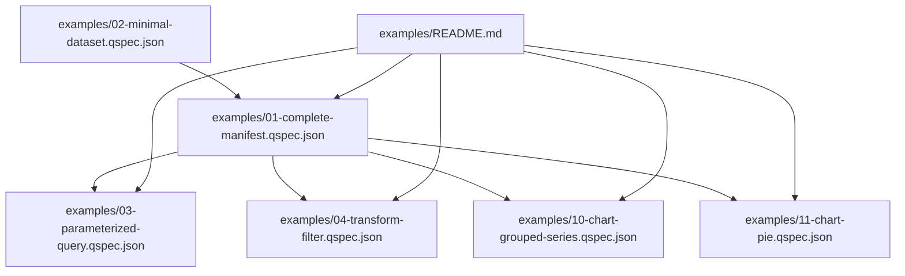
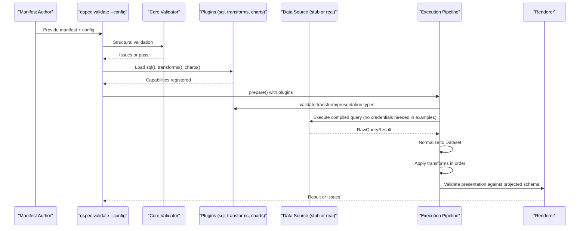
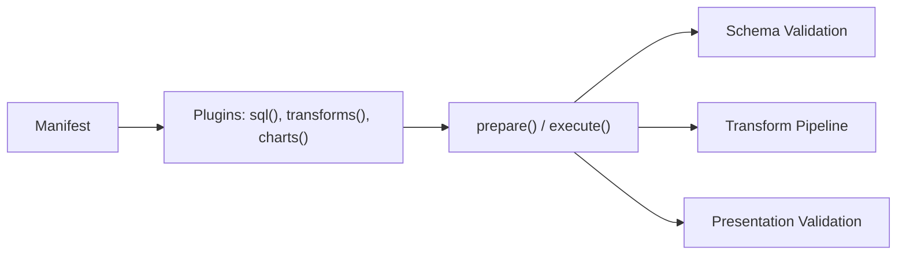

# Basic Examples

<cite>
**Referenced Files in This Document**
- [01-complete-manifest.qspec.json](file://examples/01-complete-manifest.qspec.json)
- [02-minimal-dataset.qspec.json](file://examples/02-minimal-dataset.qspec.json)
- [03-parameterized-query.qspec.json](file://examples/03-parameterized-query.qspec.json)
- [04-transform-filter.qspec.json](file://examples/04-transform-filter.qspec.json)
- [10-chart-grouped-series.qspec.json](file://examples/10-chart-grouped-series.qspec.json)
- [11-chart-pie.qspec.json](file://examples/11-chart-pie.qspec.json)
- [README.md](file://examples/README.md)
- [manifest-specification.md](file://docs/manifest-specification.md)
- [parameters.md](file://docs/parameters.md)
- [queries.md](file://docs/queries.md)
- [datasets.md](file://docs/datasets.md)
- [transforms.md](file://docs/transforms.md)
- [presentations.md](file://docs/presentations.md)
- [qspec.json](file://schemas/v1/qspec.json)
</cite>

## Table of Contents

1. [Introduction](#introduction)
2. [Project Structure](#project-structure)
3. [Core Components](#core-components)
4. [Architecture Overview](#architecture-overview)
5. [Detailed Component Analysis](#detailed-component-analysis)
6. [Dependency Analysis](#dependency-analysis)
7. [Performance Considerations](#performance-considerations)
8. [Troubleshooting Guide](#troubleshooting-guide)
9. [Conclusion](#conclusion)

## Introduction

This document explains the basic QSpec examples that demonstrate fundamental concepts and simple usage patterns. It starts with the smallest valid manifest, then walks through a complete manifest that includes parameters, queries, datasets, transforms, and presentations. For each section, it explains purpose, required versus optional fields, and how they work together. It also covers how to modify these examples for different use cases, the relationship between manifests, plugins, and execution context, and how JSON schema validation and common configuration options apply.

## Project Structure

The examples live under the examples directory and are validated in CI using plugin-aware mode. The minimal dataset shows the smallest acceptable manifest shape. The complete manifest demonstrates all major sections working together: parameters, query bindings, typed dataset schema, transforms, and a presentation. Additional examples illustrate parameterized queries, individual transforms, and chart presentations (grouped series and pie).

**Diagram sources**

- [README.md:25-112](file://examples/README.md#L25-L112)
- [01-complete-manifest.qspec.json:1-90](file://examples/01-complete-manifest.qspec.json#L1-L90)
- [02-minimal-dataset.qspec.json:1-9](file://examples/02-minimal-dataset.qspec.json#L1-L9)
- [03-parameterized-query.qspec.json:1-55](file://examples/03-parameterized-query.qspec.json#L1-L55)
- [04-transform-filter.qspec.json:1-31](file://examples/04-transform-filter.qspec.json#L1-L31)
- [10-chart-grouped-series.qspec.json:1-44](file://examples/10-chart-grouped-series.qspec.json#L1-L44)
- [11-chart-pie.qspec.json:1-31](file://examples/11-chart-pie.qspec.json#L1-L31)

**Section sources**

- [README.md:1-24](file://examples/README.md#L1-L24)
- [manifest-specification.md:13-31](file://docs/manifest-specification.md#L13-L31)

## Core Components

A QSpec manifest is a plain JSON document with a top-level shape: $schema (optional), apiVersion (required), kind (required), metadata (required, name required), and spec (required). Within spec, the five sections are parameters, query, dataset, transforms, and presentation. At the structural level, all spec sections are optional; whether a specific kind requires certain sections is enforced by plugins during prepare().

Key points:

- apiVersion must be qspec.dev/v1.
- kind selects the resource type (e.g., Dataset or Chart).
- metadata.name must match a strict pattern and is required.
- spec sections are individually optional structurally; kind-specific requirements come from plugins.

**Section sources**

- [manifest-specification.md:13-118](file://docs/manifest-specification.md#L13-L118)
- [qspec.json:1-34](file://schemas/v1/qspec.json#L1-L34)

## Architecture Overview

At a high level, a manifest defines:

- Parameters: typed inputs with defaults and constraints.
- Query: a source, language, statement, and bindings that map parameters into the statement safely.
- Dataset: a declared schema for the result set.
- Transforms: an ordered pipeline that reshapes data after normalization.
- Presentation: semantic intent for rendering (charts, tables, etc.).

The runtime validates structure first, then uses installed plugins to validate capabilities (query languages, transforms, presentations), compiles bindings, executes queries against stub or real data sources, normalizes results, applies transforms, and finally validates presentation field references against the projected schema.

**Diagram sources**

- [manifest-specification.md:147-207](file://docs/manifest-specification.md#L147-L207)
- [queries.md:1-42](file://docs/queries.md#L1-L42)
- [transforms.md:1-48](file://docs/transforms.md#L1-L48)
- [presentations.md:1-37](file://docs/presentations.md#L1-L37)

## Detailed Component Analysis

### Minimal Dataset Example

The minimal dataset is the smallest valid manifest: a Dataset with an empty spec. All spec sections are optional at the structural level, and Dataset does not require a query or presentation. This is the foundation for building more complex manifests.

How to modify:

- Add metadata.title and metadata.description for clarity.
- Add a query if you want to fetch data.
- Add a dataset schema to declare field types and semantics.
- Add transforms to filter, sort, or project columns.
- Add a presentation to render a chart or table.

**Section sources**

- [02-minimal-dataset.qspec.json:1-9](file://examples/02-minimal-dataset.qspec.json#L1-L9)
- [README.md:36-42](file://examples/README.md#L36-L42)
- [manifest-specification.md:27-31](file://docs/manifest-specification.md#L27-L31)

### Complete Manifest Example

The complete manifest demonstrates every major section working together:

- Parameters: required and optional parameters with types and defaults.
- Query: SQL statement bound to parameters via bindings.
- Dataset: typed fields including a currency-formatted number.
- Transforms: a filter to narrow rows.
- Presentation: a line chart mapping x-axis and series to dataset fields.

How to modify:

- Change parameters to accept different ranges or categories.
- Adjust the SQL statement to compute different metrics.
- Update dataset fields to reflect new column names or types.
- Insert additional transforms (select, rename, derive, sort, limit) before the filter.
- Switch presentation to bar, area, scatter, or pie depending on data shape.

**Section sources**

- [01-complete-manifest.qspec.json:1-90](file://examples/01-complete-manifest.qspec.json#L1-L90)
- [README.md:27-35](file://examples/README.md#L27-L35)
- [manifest-specification.md:120-129](file://docs/manifest-specification.md#L120-L129)

### Parameterized Query Example

This example declares four parameters: two required dates, one optional string with a default, and one optional integer with min/max validation. The SQL binds all four parameters using the $parameters.<name> shorthand.

How to modify:

- Add or remove parameters and update bindings accordingly.
- Use enum or array types where appropriate.
- Tighten validation constraints (min, max, minLength, maxLength).
- Bind literals when a constant value is needed instead of a parameter.

**Section sources**

- [03-parameterized-query.qspec.json:1-55](file://examples/03-parameterized-query.qspec.json#L1-L55)
- [parameters.md:1-24](file://docs/parameters.md#L1-L24)
- [queries.md:43-67](file://docs/queries.md#L43-L67)

### Filter Transform Example

This example narrows rows using the filter transform’s comparison shorthand { field, operator, value }. Both the shorthand and the full AST form compile to the same expression; the shorthand is the common case for single comparisons.

How to modify:

- Change the field, operator, and value to implement different filters.
- Combine multiple conditions using logical operators in the AST form.
- Place filter early in the transforms array to reduce downstream work.

**Section sources**

- [04-transform-filter.qspec.json:1-31](file://examples/04-transform-filter.qspec.json#L1-L31)
- [transforms.md:65-79](file://docs/transforms.md#L65-L79)
- [transforms.md:239-262](file://docs/transforms.md#L239-L262)

### Grouped Series Chart Example

This chart uses a grouped series definition so one line is drawn per distinct group value derived at render time. It maps month to the x-axis and revenue to the series values, grouping by region.

How to modify:

- Change groupBy to partition by a different dimension.
- Adjust labels for axes and series.
- Toggle legend and tooltip visibility.
- Switch to another cartesian type (bar, area, scatter) while keeping the same shape.

**Section sources**

- [10-chart-grouped-series.qspec.json:1-44](file://examples/10-chart-grouped-series.qspec.json#L1-L44)
- [presentations.md:72-119](file://docs/presentations.md#L72-L119)
- [presentations.md:121-210](file://docs/presentations.md#L121-L210)

### Pie Chart Example

This chart uses the pie presentation type, which has no x-axis and no series list. Instead, it specifies a category field for slice labels and a value field for slice sizes.

How to modify:

- Change category and value fields to match your aggregated data.
- Enable or disable legend and tooltip.
- Ensure the dataset returns one row per category with its total value.

**Section sources**

- [11-chart-pie.qspec.json:1-31](file://examples/11-chart-pie.qspec.json#L1-L31)
- [presentations.md:90-119](file://docs/presentations.md#L90-L119)

## Dependency Analysis

Manifests depend on plugins to resolve kinds, query languages, transforms, and presentation types. In examples, plugin-aware validation loads sql(), transforms(), and charts() without requiring a database adapter or credentials. This ensures examples remain portable and testable.

**Diagram sources**

- [README.md:1-21](file://examples/README.md#L1-L21)
- [manifest-specification.md:198-207](file://docs/manifest-specification.md#L198-L207)

**Section sources**

- [README.md:103-112](file://examples/README.md#L103-L112)
- [manifest-specification.md:44-66](file://docs/manifest-specification.md#L44-L66)

## Performance Considerations

- Keep transforms efficient by filtering early to reduce downstream work.
- Use select to project only needed fields before expensive operations.
- Limit result sets with limit when appropriate to avoid large payloads.
- Prefer grouped series when many series share the same x-axis to simplify definitions.
- Be mindful of dataset size limits and truncation behavior during normalization.

[No sources needed since this section provides general guidance]

## Troubleshooting Guide

Common issues and how to address them:

- Unknown parameter reference in bindings: ensure every binding references a declared parameter name; typos fail fast with suggestions.
- Missing required parameters: provide values or add defaults; required parameters without values cause validation errors.
- Invalid parameter types or constraints: coerce and validate types; enforce min/max or length constraints as needed.
- Unknown transform or presentation type: ensure the corresponding plugin is loaded in the config used for validation.
- Field name mismatches after transforms: use describe-aware transforms (built-ins do) so presentation validation can catch unknown fields statically.
- Literal vs parameter binding confusion: use literal objects for constants; bare strings must match the parameter reference pattern.

**Section sources**

- [queries.md:68-124](file://docs/queries.md#L68-L124)
- [parameters.md:50-75](file://docs/parameters.md#L50-L75)
- [transforms.md:340-405](file://docs/transforms.md#L340-L405)
- [presentations.md:19-70](file://docs/presentations.md#L19-L70)

## Conclusion

Start with the minimal dataset to understand the baseline manifest shape. Then adopt the complete manifest as a template for adding parameters, queries, datasets, transforms, and presentations. Modify each section incrementally to fit your use case, relying on plugin-aware validation to catch issues early. Use the provided examples as starting points for parameterization, transformation pipelines, and chart presentations. Always keep in mind the separation between manifest structure (validated by core/schema) and plugin-driven capabilities (validated by prepare/execute with plugins).

[No sources needed since this section summarizes without analyzing specific files]
