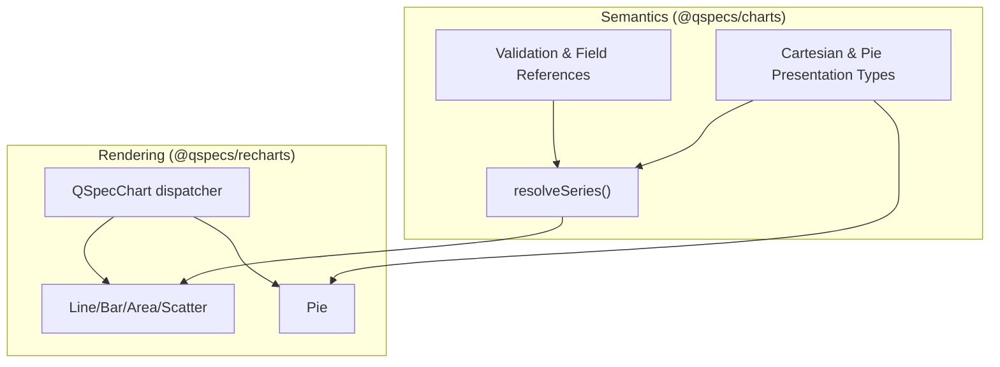
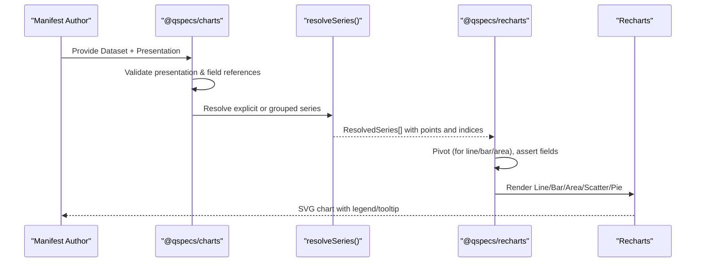
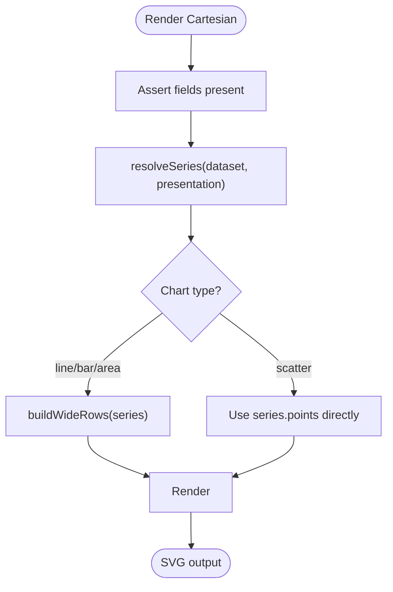
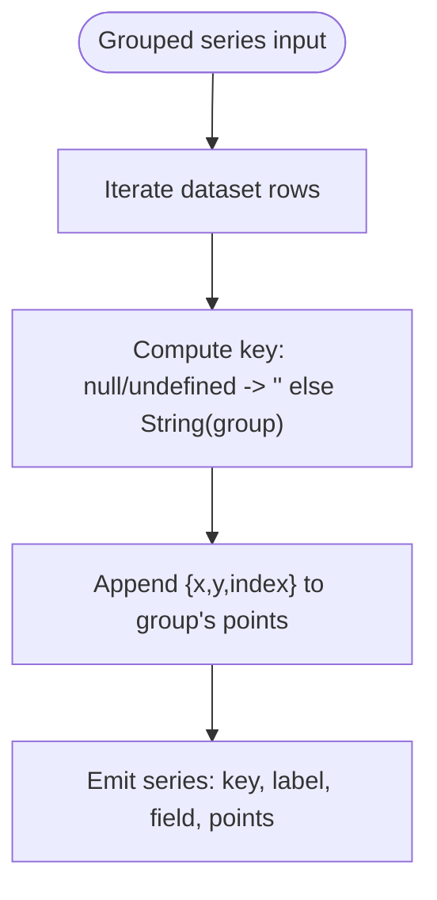
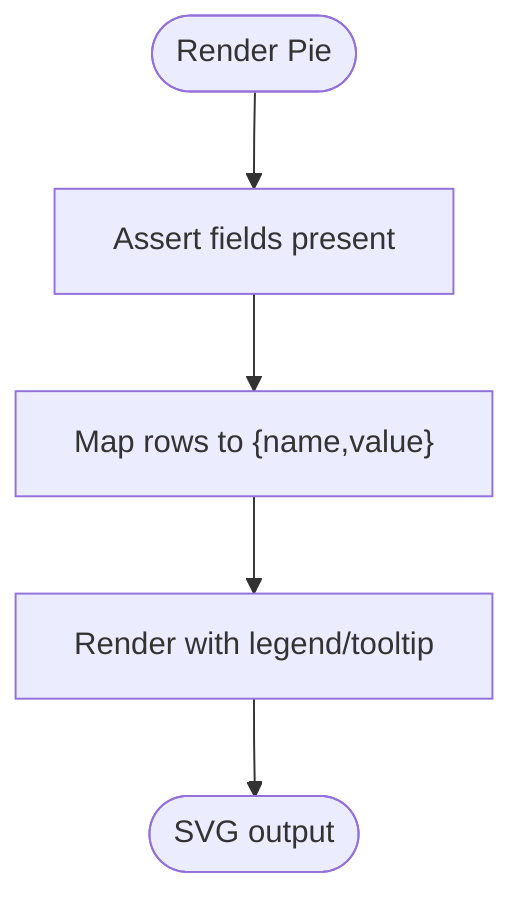
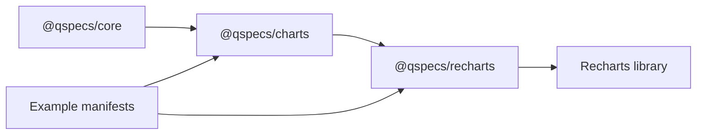

# Chart Presentations

<cite>
**Referenced Files in This Document**
- [presentations.md](file://docs/presentations.md)
- [10-chart-grouped-series.qspec.json](file://examples/10-chart-grouped-series.qspec.json)
- [11-chart-pie.qspec.json](file://examples/11-chart-pie.qspec.json)
- [README.md (examples)](file://examples/README.md)
- [index.ts (charts plugin)](file://packages/charts/src/index.ts)
- [types.ts (charts types)](file://packages/charts/src/types.ts)
- [cartesian.ts (charts validation)](file://packages/charts/src/internal/cartesian.ts)
- [pie.ts (charts validation)](file://packages/charts/src/internal/pie.ts)
- [resolve-series.ts](file://packages/charts/src/internal/resolve-series.ts)
- [index.ts (recharts package)](file://packages/recharts/src/index.ts)
- [qspec-chart.tsx](file://packages/recharts/src/internal/qspec-chart.tsx)
- [cartesian.tsx (recharts cartesian)](file://packages/recharts/src/internal/cartesian.tsx)
- [pie.tsx (recharts pie)](file://packages/recharts/src/internal/pie.tsx)
- [shared.tsx (legend/tooltip helpers)](file://packages/recharts/src/internal/shared.tsx)
</cite>

## Table of Contents

1. Introduction
2. Project Structure
3. Core Components
4. Architecture Overview
5. Detailed Component Analysis
6. Dependency Analysis
7. Performance Considerations
8. Troubleshooting Guide
9. Conclusion

## Introduction

This document explains how to present data with QSpec’s chart capabilities, covering both cartesian charts (line, bar, area, scatter) and non-cartesian charts (pie). It focuses on the semantic presentation model, series definitions, axis configuration, grouping strategies, dynamic series generation, and renderer integration via Recharts. It also includes guidance on responsiveness, accessibility, styling hooks, and troubleshooting common rendering issues.

## Project Structure

QSpec separates chart semantics from rendering:

- @qspecs/charts defines the presentation model, validation, and shared series resolution logic without rendering anything.
- @qspecs/recharts provides React components that render those presentations using Recharts.
- Example manifests demonstrate grouped-line and pie presentations.

**Diagram sources**

- [index.ts (charts plugin):19-39](file://packages/charts/src/index.ts#L19-L39)
- [resolve-series.ts:12-85](file://packages/charts/src/internal/resolve-series.ts#L12-L85)
- [qspec-chart.tsx:27-123](file://packages/recharts/src/internal/qspec-chart.tsx#L27-L123)
- [cartesian.tsx:231-335](file://packages/recharts/src/internal/cartesian.tsx#L231-L335)
- [pie.tsx:93-109](file://packages/recharts/src/internal/pie.tsx#L93-L109)

**Section sources**

- [presentations.md:19-119](file://docs/presentations.md#L19-L119)
- [index.ts (charts plugin):19-39](file://packages/charts/src/index.ts#L19-L39)
- [index.ts (recharts package):1-32](file://packages/recharts/src/index.ts#L1-L32)

## Core Components

- Presentation model: Cartesian (line, bar, area, scatter) and Pie shapes define axes, series, legend, and tooltip options.
- Validation: Ensures required fields exist and are well-formed; extracts field references for schema checks.
- Series resolution: Converts explicit or grouped series into a stable, renderer-neutral model with per-point source row indices.
- Rendering: Recharts-based components consume the resolved model and produce SVG charts.

Key responsibilities:

- @qspecs/charts: Define types, validate presentations, extract field references, resolve series.
- @qspecs/recharts: Map presentations to Recharts components, pivot data where needed, handle legends/tooltips, enforce sizing and errors.

**Section sources**

- [types.ts:1-87](file://packages/charts/src/types.ts#L1-L87)
- [cartesian.ts:12-151](file://packages/charts/src/internal/cartesian.ts#L12-L151)
- [pie.ts:12-86](file://packages/charts/src/internal/pie.ts#L12-L86)
- [resolve-series.ts:12-85](file://packages/charts/src/internal/resolve-series.ts#L12-L85)
- [qspec-chart.tsx:10-123](file://packages/recharts/src/internal/qspec-chart.tsx#L10-L123)

## Architecture Overview

The flow from manifest to rendered chart:

**Diagram sources**

- [cartesian.ts:18-94](file://packages/charts/src/internal/cartesian.ts#L18-L94)
- [pie.ts:18-43](file://packages/charts/src/internal/pie.ts#L18-L43)
- [resolve-series.ts:28-85](file://packages/charts/src/internal/resolve-series.ts#L28-L85)
- [cartesian.tsx:72-196](file://packages/recharts/src/internal/cartesian.tsx#L72-L196)
- [pie.tsx:32-70](file://packages/recharts/src/internal/pie.tsx#L32-L70)

## Detailed Component Analysis

### Cartesian Charts (line, bar, area, scatter)

- Presentation shape: x axis, one or more series (explicit array or grouped), optional y label, legend, tooltip.
- Validation: Requires x.field; series must be either an array of {field, label?} or a grouped spec {field, groupBy, label?}; optional y.label validated; legend/tooltip visibility toggles.
- Dynamic series: Use grouped series to derive one series per distinct group value at render time.
- Data shaping: For line, bar, area, series are pivoted into wide rows keyed by x; scatter plots each series’ point cloud directly.
- Axis typing: Scatter axes infer type from dataset field types; other charts rely on Recharts defaults.

**Diagram sources**

- [cartesian.tsx:72-196](file://packages/recharts/src/internal/cartesian.tsx#L72-L196)
- [cartesian.tsx:231-335](file://packages/recharts/src/internal/cartesian.tsx#L231-L335)

**Section sources**

- [cartesian.ts:18-151](file://packages/charts/src/internal/cartesian.ts#L18-L151)
- [resolve-series.ts:28-85](file://packages/charts/src/internal/resolve-series.ts#L28-L85)
- [cartesian.tsx:231-335](file://packages/recharts/src/internal/cartesian.tsx#L231-L335)

#### Grouped Series Behavior

- Group order follows first appearance in dataset.
- Null/undefined group values merge with empty-string groups into one series labeled “(none)”.
- Declared label becomes a prefix combined with group label (e.g., “Revenue: West”).

**Diagram sources**

- [resolve-series.ts:47-85](file://packages/charts/src/internal/resolve-series.ts#L47-L85)

**Section sources**

- [resolve-series.ts:47-85](file://packages/charts/src/internal/resolve-series.ts#L47-L85)
- [presentations.md:173-210](file://docs/presentations.md#L173-L210)

### Pie Chart

- Presentation shape: category (slice label) and value (slice size); no x axis or series list.
- Validation: Requires category.field and value.field; validates labels and display blocks.
- Data shaping: Maps each dataset row to a {name, value} entry; aggregation is caller responsibility.
- Rendering: Uses Recharts Pie with per-row Cell elements; animation disabled to ensure deterministic initial render.

**Diagram sources**

- [pie.ts:18-43](file://packages/charts/src/internal/pie.ts#L18-L43)
- [pie.tsx:32-109](file://packages/recharts/src/internal/pie.tsx#L32-L109)

**Section sources**

- [pie.ts:18-86](file://packages/charts/src/internal/pie.ts#L18-L86)
- [pie.tsx:32-109](file://packages/recharts/src/internal/pie.tsx#L32-L109)

### Examples

- Grouped line chart: Demonstrates deriving one series per region from query results using grouped series.
- Pie chart: Demonstrates category/value mapping for revenue share by category.

**Section sources**

- [10-chart-grouped-series.qspec.json:1-44](file://examples/10-chart-grouped-series.qspec.json#L1-L44)
- [11-chart-pie.qspec.json:1-31](file://examples/11-chart-pie.qspec.json#L1-L31)
- [README.md (examples):88-101](file://examples/README.md#L88-L101)

### Series Definitions and Axis Configuration

- Explicit series: Array of {field, label?}, one series per entry.
- Grouped series: Single object {field, groupBy, label?} producing multiple series at render time.
- Axes:
  - Cartesian: x is required; y is optional with label only.
  - Pie: category and value fields; no x/y axes.
- Legend and tooltip: Optional visibility toggles across all types.

**Section sources**

- [types.ts:1-87](file://packages/charts/src/types.ts#L1-L87)
- [cartesian.ts:18-94](file://packages/charts/src/internal/cartesian.ts#L18-L94)
- [pie.ts:18-43](file://packages/charts/src/internal/pie.ts#L18-L43)

### Dynamic Series Generation and Responsive Behavior

- Dynamic series: Use grouped series to compute series from data at render time; ordering is deterministic by first appearance.
- Responsiveness: Components require explicit width/height; callers may wrap with a responsive container if desired.

**Section sources**

- [resolve-series.ts:47-85](file://packages/charts/src/internal/resolve-series.ts#L47-L85)
- [cartesian.tsx:26-39](file://packages/recharts/src/internal/cartesian.tsx#L26-L39)

### Customization, Styling, and Accessibility

- Styling hooks:
  - Per-series name used for legend entries.
  - Per-row Cell elements in Pie enable future per-slice styling.
- Accessibility:
  - Legends and tooltips can be enabled via presentation flags.
  - Axis labels can be provided to improve context.
- Note: Advanced formatting (colors, positions, content) is not part of the current presentation model.

**Section sources**

- [cartesian.tsx:231-335](file://packages/recharts/src/internal/cartesian.tsx#L231-L335)
- [pie.tsx:93-109](file://packages/recharts/src/internal/pie.tsx#L93-L109)
- [shared.tsx:7-20](file://packages/recharts/src/internal/shared.tsx#L7-L20)

### Integration with Recharts and Browser Rendering

- Client-only: The recharts package uses “use client” to mark browser-only rendering.
- Dispatcher: QSpecChart routes by presentation.type to specific chart components.
- Data contracts:
  - Line/Bar/Area: Wide-row table built from resolved series.
  - Scatter: Each series plotted directly from its points.
  - Pie: One row per dataset row mapped to name/value.

**Section sources**

- [index.ts (recharts package):1-32](file://packages/recharts/src/index.ts#L1-L32)
- [qspec-chart.tsx:27-123](file://packages/recharts/src/internal/qspec-chart.tsx#L27-L123)
- [cartesian.tsx:41-196](file://packages/recharts/src/internal/cartesian.tsx#L41-L196)
- [pie.tsx:55-70](file://packages/recharts/src/internal/pie.tsx#L55-L70)

## Dependency Analysis

**Diagram sources**

- [index.ts (charts plugin):19-39](file://packages/charts/src/index.ts#L19-L39)
- [index.ts (recharts package):1-32](file://packages/recharts/src/index.ts#L1-L32)

**Section sources**

- [index.ts (charts plugin):19-39](file://packages/charts/src/index.ts#L19-L39)
- [index.ts (recharts package):1-32](file://packages/recharts/src/index.ts#L1-L32)

## Performance Considerations

- Avoid redundant computation: reuse resolved series when possible; avoid recomputing large datasets unnecessarily.
- Aggregation before charting: For line/bar/area, ensure one y per x per series; duplicate x values cause errors and indicate missing aggregation.
- Large datasets: Prefer server-side aggregation or transforms to reduce payload size before charting.
- Animation: Pie disables animation to ensure deterministic initial render; this avoids extra frames and improves SSR/testing predictability.

[No sources needed since this section provides general guidance]

## Troubleshooting Guide

Common issues and resolutions:

- Missing fields: If a presentation references a field not declared in the dataset, a named error is thrown listing missing fields and available ones.
- Duplicate x values: For line/bar/area, two points with the same x in one series throw a named error; aggregate data beforehand.
- Unsupported presentation type: An unknown presentation.type throws a named error listing supported types.
- Empty or silent renders: Ensure width/height are set; avoid relying on automatic sizing unless wrapped appropriately.
- Pie slice count: Each dataset row becomes a slice; aggregate categories if you need merged slices.

Actionable checks:

- Verify dataset fields match presentation references.
- Confirm grouping/aggregation aligns with chart expectations.
- Inspect legend/tooltip visibility flags if UI elements are missing.

**Section sources**

- [cartesian.tsx:72-105](file://packages/recharts/src/internal/cartesian.tsx#L72-L105)
- [cartesian.tsx:163-196](file://packages/recharts/src/internal/cartesian.tsx#L163-L196)
- [qspec-chart.tsx:113-123](file://packages/recharts/src/internal/qspec-chart.tsx#L113-L123)
- [pie.tsx:32-53](file://packages/recharts/src/internal/pie.tsx#L32-L53)

## Conclusion

QSpec’s chart system cleanly separates semantic intent from rendering. Use grouped series for dynamic series generation, rely on shared resolution for consistent behavior across renderers, and integrate via Recharts for browser rendering. Follow the validation and error signals to build robust, accessible, and performant charts.
