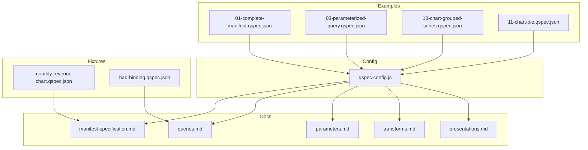
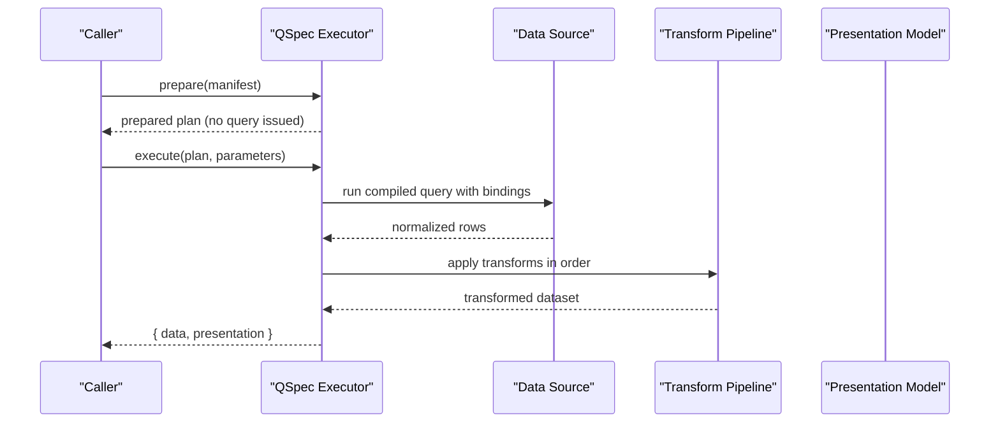
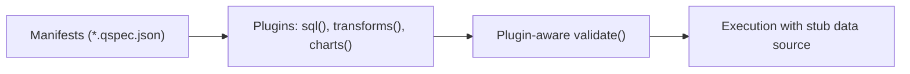

# Examples and Recipes

<cite>
**Referenced Files in This Document**
- [examples/README.md](file://examples/README.md)
- [examples/qspec.config.js](file://examples/qspec.config.js)
- [examples/01-complete-manifest.qspec.json](file://examples/01-complete-manifest.qspec.json)
- [examples/02-minimal-dataset.qspec.json](file://examples/02-minimal-dataset.qspec.json)
- [examples/03-parameterized-query.qspec.json](file://examples/03-parameterized-query.qspec.json)
- [examples/04-transform-filter.qspec.json](file://examples/04-transform-filter.qspec.json)
- [examples/05-transform-select.qspec.json](file://examples/05-transform-select.qspec.json)
- [examples/06-transform-rename.qspec.json](file://examples/06-transform-rename.qspec.json)
- [examples/07-transform-derive.qspec.json](file://examples/07-transform-derive.qspec.json)
- [examples/08-transform-sort.qspec.json](file://examples/08-transform-sort.qspec.json)
- [examples/09-transform-limit.qspec.json](file://examples/09-transform-limit.qspec.json)
- [examples/10-chart-grouped-series.qspec.json](file://examples/10-chart-grouped-series.qspec.json)
- [examples/11-chart-pie.qspec.json](file://examples/11-chart-pie.qspec.json)
- [docs/introduction.md](file://docs/introduction.md)
- [docs/manifest-specification.md](file://docs/manifest-specification.md)
- [docs/queries.md](file://docs/queries.md)
- [docs/parameters.md](file://docs/parameters.md)
- [docs/transforms.md](file://docs/transforms.md)
- [docs/presentations.md](file://docs/presentations.md)
- [docs/data-sources.md](file://docs/data-sources.md)
- [fixtures/valid/monthly-revenue-chart.qspec.json](file://fixtures/valid/monthly-revenue-chart.qspec.json)
- [fixtures/invalid/bad-binding.qspec.json](file://fixtures/invalid/bad-binding.qspec.json)
- [test/pipeline.test.ts](file://test/pipeline.test.ts)
</cite>

## Table of Contents

1. Introduction
2. Project Structure
3. Core Components
4. Architecture Overview
5. Detailed Component Analysis
6. Dependency Analysis
7. Performance Considerations
8. Troubleshooting Guide
9. Conclusion
10. Appendices

## Introduction

This document provides practical, production-ready examples and recipes for QSpec manifests. It is organized by complexity:

- Basic: minimal datasets, parameters, and simple queries
- Intermediate: transforms (filter, select, rename, derive, sort, limit), parameterized SQL, and chart presentations
- Advanced: grouped series charts, pie charts, multi-step transform pipelines, and testing strategies with fixtures and mocks

QSpec’s pipeline is: Parameters → Validation → Query → Data Source → Result → Dataset Validation → Transformations → Normalized Dataset → Presentation. Manifests are validated before execution to catch mis-typed parameters, unknown fields, and invalid bindings early.

**Section sources**

- [docs/introduction.md:1-31](file://docs/introduction.md#L1-L31)

## Project Structure

The repository ships a curated set of example manifests under examples/, each explained in the examples README. A small config file loads plugins so validation runs in plugin-aware mode without requiring real credentials or a database. Fixtures provide valid and invalid manifests used by tests to ensure validators remain consistent.

**Diagram sources**

- [examples/qspec.config.js:1-19](file://examples/qspec.config.js#L1-L19)
- [docs/manifest-specification.md:13-129](file://docs/manifest-specification.md#L13-L129)
- [docs/queries.md:1-42](file://docs/queries.md#L1-L42)
- [docs/parameters.md:1-23](file://docs/parameters.md#L1-L23)
- [docs/transforms.md:1-22](file://docs/transforms.md#L1-L22)
- [docs/presentations.md:1-18](file://docs/presentations.md#L1-L18)
- [fixtures/valid/monthly-revenue-chart.qspec.json:1-111](file://fixtures/valid/monthly-revenue-chart.qspec.json#L1-L111)
- [fixtures/invalid/bad-binding.qspec.json:1-14](file://fixtures/invalid/bad-binding.qspec.json#L1-L14)

**Section sources**

- [examples/README.md:1-23](file://examples/README.md#L1-L23)
- [examples/qspec.config.js:1-19](file://examples/qspec.config.js#L1-L19)
- [docs/manifest-specification.md:13-129](file://docs/manifest-specification.md#L13-L129)

## Core Components

- Parameters: typed inputs with required/optional, defaults, and constraints
- Queries: source + language + statement + bindings; bindings must be parameter references or literals
- Datasets: declared field schema for runtime validation
- Transforms: filter, derive, sort, limit, select, rename executed in order
- Presentations: semantic intent for rendering (line, bar, area, scatter, pie)

Key best practices:

- Always declare dataset fields to enable static projection and presentation validation
- Use $parameters.<name> bindings for query values; never interpolate raw strings
- Keep transforms declarative and ordered; rely on describe() for static checks
- Prefer grouped series when group values are dynamic at render time

**Section sources**

- [docs/parameters.md:1-23](file://docs/parameters.md#L1-L23)
- [docs/queries.md:1-42](file://docs/queries.md#L1-L42)
- [docs/transforms.md:1-22](file://docs/transforms.md#L1-L22)
- [docs/presentations.md:1-18](file://docs/presentations.md#L1-L18)

## Architecture Overview

A typical manifest flows through prepare() then execute():

- prepare() validates structure, parameters, query bindings, dataset schema, transform specs, and presentation field references statically
- execute() runs the data source, normalizes results, validates against dataset schema, applies transforms, and returns the dataset plus presentation model

**Diagram sources**

- [docs/introduction.md:19-26](file://docs/introduction.md#L19-L26)
- [docs/manifest-specification.md:147-207](file://docs/manifest-specification.md#L147-L207)
- [docs/queries.md:125-148](file://docs/queries.md#L125-L148)
- [docs/transforms.md:24-48](file://docs/transforms.md#L24-L48)
- [docs/presentations.md:11-17](file://docs/presentations.md#L11-L17)

## Detailed Component Analysis

### Recipe 1: Complete Chart with Parameters, Query, Dataset Schema, Filter, and Line Presentation

Use this as your starting template. It demonstrates:

- Required and optional parameters with defaults
- Parameterized SQL with bindings
- Typed dataset schema including currency formatting
- A filter transform to exclude unwanted rows
- A line presentation with x-axis and series

Steps:

- Define parameters for date range and optional country
- Bind $parameters.* into SQL placeholders
- Declare dataset fields for month and revenue
- Add a filter transform where revenue > 0
- Configure line presentation with x and series

Validation tip: Run with plugin-aware validation to catch binding and field-name issues before execution.

**Section sources**

- [examples/01-complete-manifest.qspec.json:1-90](file://examples/01-complete-manifest.qspec.json#L1-L90)
- [examples/README.md:27-34](file://examples/README.md#L27-L34)
- [docs/manifest-specification.md:120-129](file://docs/manifest-specification.md#L120-L129)

### Recipe 2: Minimal Dataset

The smallest possible manifest: a Dataset with an empty spec. Useful as a base when you only need validated, transformed data without a query or presentation.

Best practice:

- Start from this shape and add sections incrementally
- Validate early using qspec validate --config with your plugins loaded

**Section sources**

- [examples/02-minimal-dataset.qspec.json](file://examples/02-minimal-dataset.qspec.json)
- [examples/README.md:36-41](file://examples/README.md#L36-L41)
- [docs/manifest-specification.md:27-30](file://docs/manifest-specification.md#L27-L30)

### Recipe 3: Parameterized Query with Multiple Types and Constraints

Demonstrates:

- Two required dates
- Optional string with default
- Optional integer with min/max validation
- All four bound into one SQL statement

Production tips:

- Use $parameters.<name> bindings exclusively
- Constrain integers to safe ranges to avoid excessive LIMIT
- Provide sensible defaults for optional filters

**Section sources**

- [examples/03-parameterized-query.qspec.json:1-55](file://examples/03-parameterized-query.qspec.json#L1-L55)
- [docs/queries.md:43-67](file://docs/queries.md#L43-L67)
- [docs/parameters.md:50-68](file://docs/parameters.md#L50-L68)

### Recipe 4: Transform Filters

Use filter to narrow rows with either:

- Shorthand: { field, operator, value }
- Full AST: { operator, arguments: [{ field }, { literal }] }

Common patterns:

- Numeric thresholds (e.g., revenue > 0)
- Membership checks (in)
- Null handling (isNull)

Note: The shorthand expands to the full AST form during prepare().

**Section sources**

- [examples/04-transform-filter.qspec.json](file://examples/04-transform-filter.qspec.json)
- [docs/transforms.md:65-78](file://docs/transforms.md#L65-L78)
- [docs/transforms.md:239-261](file://docs/transforms.md#L239-L261)

### Recipe 5: Select Columns

Project down to a named subset of fields, dropping internal-only columns before they reach consumers.

Best practice:

- Order fields explicitly via select to stabilize output
- Combine with rename to normalize naming conventions

**Section sources**

- [examples/05-transform-select.qspec.json](file://examples/05-transform-select.qspec.json)
- [docs/transforms.md:157-175](file://docs/transforms.md#L157-L175)

### Recipe 6: Rename Fields

Rename snake_case columns to consumer-friendly names while preserving other fields’ positions.

Important behaviors:

- Collision detection happens both statically (when schema is known) and at runtime
- Prototype-safe lookups prevent accidental property access on built-in names

**Section sources**

- [examples/06-transform-rename.qspec.json](file://examples/06-transform-rename.qspec.json)
- [docs/transforms.md:177-211](file://docs/transforms.md#L177-L211)

### Recipe 7: Derive New Fields

Compute new fields using expressions like multiply(quantity, unit_price).

Guidelines:

- Always declare fieldType explicitly
- Derived fields are nullable even if fieldType is not
- Use the expression AST for complex computations

**Section sources**

- [examples/07-transform-derive.qspec.json](file://examples/07-transform-derive.qspec.json)
- [docs/transforms.md:80-101](file://docs/transforms.md#L80-L101)
- [docs/transforms.md:213-231](file://docs/transforms.md#L213-L231)

### Recipe 8: Sort Rows

Order rows by a single field with direction asc/desc.

Rules:

- Nulls sort last in both directions
- Stable sort preserves original order for ties

**Section sources**

- [examples/08-transform-sort.qspec.json](file://examples/08-transform-sort.qspec.json)
- [docs/transforms.md:114-139](file://docs/transforms.md#L114-L139)

### Recipe 9: Limit and Offset for Pagination

Take a page of results using count and offset.

Usage:

- Pair with sort to make pagination deterministic
- Use offset to fetch subsequent pages

**Section sources**

- [examples/09-transform-limit.qspec.json](file://examples/09-transform-limit.qspec.json)
- [docs/transforms.md:141-155](file://docs/transforms.md#L141-L155)

### Recipe 10: Grouped Series Chart

One line per distinct group (e.g., region) derived at render time.

How it works:

- Use grouped series shape: { field, groupBy, label }
- resolveSeries partitions rows by group values and produces series labels with prefixing behavior

Best practice:

- Ensure dataset includes the grouping field
- Rely on first-appearance order for groups unless you pre-sort upstream

**Section sources**

- [examples/10-chart-grouped-series.qspec.json:1-44](file://examples/10-chart-grouped-series.qspec.json#L1-L44)
- [docs/presentations.md:121-171](file://docs/presentations.md#L121-L171)
- [docs/presentations.md:173-209](file://docs/presentations.md#L173-L209)

### Recipe 11: Pie Chart

Category/value visualization without an x axis or series list.

Requirements:

- category field for slice labels
- value field for slice sizes
- legend and tooltip controls available

**Section sources**

- [examples/11-chart-pie.qspec.json:1-31](file://examples/11-chart-pie.qspec.json#L1-L31)
- [docs/presentations.md:72-119](file://docs/presentations.md#L72-L119)

### Recipe 12: End-to-End Pipeline Test with Memory Source

A complete test that composes memory data source, transforms, and charts to assert:

- Static projection through transforms
- Correct post-transform row ordering and counts
- Presentation model passthrough
- Series resolution with index tracking

Pattern:

- Build a manifest with parameters, memory query, dataset schema, and transforms
- Prepare to verify projected fields
- Execute with parameters and assert result.data.rows and series

**Section sources**

- [test/pipeline.test.ts:1-163](file://test/pipeline.test.ts#L1-L163)

## Dependency Analysis

Example manifests depend on plugins loaded by the config:

- sql() for query language and binding validation
- transforms() for filter/select/rename/derive/sort/limit
- charts() for line/bar/pie presentations and the Chart resource kind

This ensures plugin-aware validation catches unknown operators, misspelled bindings, and series referencing dropped fields.

**Diagram sources**

- [examples/qspec.config.js:1-19](file://examples/qspec.config.js#L1-L19)
- [examples/README.md:10-20](file://examples/README.md#L10-L20)

**Section sources**

- [examples/qspec.config.js:1-19](file://examples/qspec.config.js#L1-L19)
- [examples/README.md:10-20](file://examples/README.md#L10-L20)

## Performance Considerations

- Prefer server-side filtering and aggregation in the query when possible; use transforms for client-side reshaping
- Use limit/offset for pagination to avoid large payloads
- Avoid deep expression nesting; respect maxExpressionDepth limits
- Keep transform chains short and focused; each transform executes sequentially
- For charts, prefer grouped series when group sets are dynamic to reduce configuration overhead

[No sources needed since this section provides general guidance]

## Troubleshooting Guide

### Common Error: Invalid Binding String

Symptom: A binding is a bare string that does not match the parameter reference pattern.
Cause: Using a literal string instead of $parameters.<name> or { literal: ... }.
Resolution:

- Use "$parameters.<name>" for parameters
- Use { "literal": <value> } for constants

Reference:

- [docs/queries.md:68-103](file://docs/queries.md#L68-L103)
- [fixtures/invalid/bad-binding.qspec.json:1-14](file://fixtures/invalid/bad-binding.qspec.json#L1-L14)

### Common Error: Unknown Parameter Reference in Bindings

Symptom: A binding references a parameter name that is not declared.
Cause: Typo in binding or missing parameter declaration.
Resolution:

- Ensure every binding matches a declared parameter key
- Use “did you mean” suggestions provided by core

Reference:

- [docs/queries.md:115-123](file://docs/queries.md#L115-L123)

### Common Error: Presentation Field Not Found After Rename

Symptom: A chart series references a field that was renamed away.
Cause: Presentation still uses the old field name after rename transform.
Resolution:

- Update presentation to use the new field name
- Rely on Stage 6 static validation to catch mismatches early

Reference:

- [docs/transforms.md:177-211](file://docs/transforms.md#L177-L211)
- [docs/presentations.md:11-17](file://docs/presentations.md#L11-L17)

### Common Error: Missing Required Parameters

Symptom: Execution fails because a required parameter was not supplied.
Cause: Omitted or null input for a required parameter.
Resolution:

- Supply all required parameters
- Provide defaults for optional parameters

Reference:

- [docs/parameters.md:50-68](file://docs/parameters.md#L50-L68)

### Common Error: Expression Depth Exceeded

Symptom: prepare() fails due to deeply nested expressions.
Cause: Complex expressions exceed configured depth limit.
Resolution:

- Simplify expressions or move logic to the query layer
- Adjust limits only if necessary and justified

Reference:

- [docs/transforms.md:312-338](file://docs/transforms.md#L312-L338)

**Section sources**

- [docs/queries.md:68-123](file://docs/queries.md#L68-L123)
- [docs/parameters.md:50-68](file://docs/parameters.md#L50-L68)
- [docs/transforms.md:177-211](file://docs/transforms.md#L177-L211)
- [docs/transforms.md:312-338](file://docs/transforms.md#L312-L338)
- [fixtures/invalid/bad-binding.qspec.json:1-14](file://fixtures/invalid/bad-binding.qspec.json#L1-L14)

## Conclusion

These recipes cover the most common QSpec usage patterns:

- Start with minimal datasets and add parameters, queries, and transforms incrementally
- Use typed parameters and strict bindings to keep queries safe and predictable
- Leverage transforms for clean, declarative data shaping
- Describe presentations semantically and rely on static validation to catch field errors early
- Test end-to-end with memory fixtures to validate pipelines without external dependencies

Adopt these patterns to build robust, portable, and maintainable analytical resources.

[No sources needed since this section summarizes without analyzing specific files]

## Appendices

### Appendix A: Quick Reference to Example Manifests

- Complete chart: [examples/01-complete-manifest.qspec.json](file://examples/01-complete-manifest.qspec.json)
- Minimal dataset: [examples/02-minimal-dataset.qspec.json](file://examples/02-minimal-dataset.qspec.json)
- Parameterized query: [examples/03-parameterized-query.qspec.json](file://examples/03-parameterized-query.qspec.json)
- Filter: [examples/04-transform-filter.qspec.json](file://examples/04-transform-filter.qspec.json)
- Select: [examples/05-transform-select.qspec.json](file://examples/05-transform-select.qspec.json)
- Rename: [examples/06-transform-rename.qspec.json](file://examples/06-transform-rename.qspec.json)
- Derive: [examples/07-transform-derive.qspec.json](file://examples/07-transform-derive.qspec.json)
- Sort: [examples/08-transform-sort.qspec.json](file://examples/08-transform-sort.qspec.json)
- Limit: [examples/09-transform-limit.qspec.json](file://examples/09-transform-limit.qspec.json)
- Grouped series chart: [examples/10-chart-grouped-series.qspec.json](file://examples/10-chart-grouped-series.qspec.json)
- Pie chart: [examples/11-chart-pie.qspec.json](file://examples/11-chart-pie.qspec.json)

**Section sources**

- [examples/README.md:25-112](file://examples/README.md#L25-L112)

### Appendix B: Validating with Plugin-Aware Mode

Run validation with the example config to exercise sql(), transforms(), and charts() plugins without executing real queries.

Command:

- qspec validate --config examples/qspec.config.js examples/*.qspec.json

Why:

- Catches unknown transforms, bad bindings, and series referencing dropped fields
- Uses a stub data source; no credentials required

**Section sources**

- [examples/README.md:1-20](file://examples/README.md#L1-L20)
- [examples/qspec.config.js:1-19](file://examples/qspec.config.js#L1-L19)

### Appendix C: End-to-End Testing Patterns

Use the memory data source to compose full pipelines in tests:

- Define tables with columns and rows
- Create a manifest with parameters, memory query, dataset schema, and transforms
- Prepare to assert projected fields
- Execute and assert dataset rows, meta.rowCount, and resolved series

Reference:

- [test/pipeline.test.ts:1-163](file://test/pipeline.test.ts#L1-L163)

**Section sources**

- [test/pipeline.test.ts:1-163](file://test/pipeline.test.ts#L1-L163)
