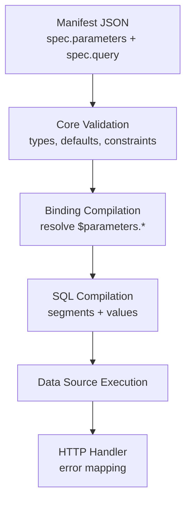
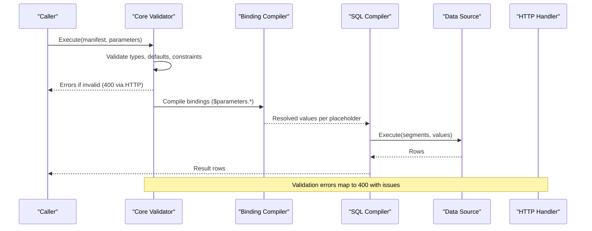
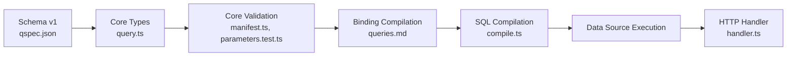

# Parameterized Queries

<cite>
**Referenced Files in This Document**
- [parameters.md](file://docs/parameters.md)
- [queries.md](file://docs/queries.md)
- [security.md](file://docs/security.md)
- [03-parameterized-query.qspec.json](file://examples/03-parameterized-query.qspec.json)
- [01-complete-manifest.qspec.json](file://examples/01-complete-manifest.qspec.json)
- [parameter-types.qspec.json](file://fixtures/valid/parameter-types.qspec.json)
- [qspec.json](file://schemas/v1/qspec.json)
- [manifest.ts](file://packages/core/src/internal/validate/manifest.ts)
- [parameters.test.ts](file://packages/core/src/internal/validate/parameters.test.ts)
- [compile.ts](file://packages/sql/src/internal/compile.ts)
- [query.ts](file://packages/core/src/types/query.ts)
- [handler.ts](file://packages/http/src/internal/handler.ts)
- [protocol.ts](file://packages/http/src/internal/protocol.ts)
</cite>

## Table of Contents

1. [Introduction](#introduction)
2. [Project Structure](#project-structure)
3. [Core Components](#core-components)
4. [Architecture Overview](#architecture-overview)
5. [Detailed Component Analysis](#detailed-component-analysis)
6. [Dependency Analysis](#dependency-analysis)
7. [Performance Considerations](#performance-considerations)
8. [Troubleshooting Guide](#troubleshooting-guide)
9. [Conclusion](#conclusion)
10. [Appendices](#appendices)

## Introduction

This document explains how to build flexible, reusable QSpec manifests with parameterized queries. It covers all supported parameter types (strings, numbers, integers, booleans, dates, datetimes, enums, and arrays), validation rules, defaults, constraints, binding parameters into SQL using $parameters references, naming conventions, security considerations, conditional logic via transforms, error handling for invalid parameters, and debugging techniques. The goal is to help you author safe, maintainable manifests that accept dynamic inputs while preventing injection and runtime surprises.

## Project Structure

QSpec separates manifest declarations from execution:

- Manifests declare typed parameters and bind them into a query.
- The core validates parameters and compiles bindings.
- SQL adapters compile statements into parameterized segments and values.
- HTTP handlers surface errors safely.

**Diagram sources**

- [qspec.json:25-106](file://schemas/v1/qspec.json#L25-L106)
- [parameters.md:25-125](file://docs/parameters.md#L25-L125)
- [queries.md:43-148](file://docs/queries.md#L43-L148)
- [compile.ts:72-103](file://packages/sql/src/internal/compile.ts#L72-L103)
- [handler.ts:74-109](file://packages/http/src/internal/handler.ts#L74-L109)

**Section sources**

- [qspec.json:25-106](file://schemas/v1/qspec.json#L25-L106)
- [parameters.md:25-125](file://docs/parameters.md#L25-L125)
- [queries.md:43-148](file://docs/queries.md#L43-L148)

## Core Components

- Parameters: Declared in spec.parameters with type, required/default, optional presentation metadata, and validation constraints.
- Bindings: Map query placeholders to either $parameters.<name> or literal values; only the $parameters reference string form is allowed for strings.
- SQL compilation: Scans statement for :name placeholders, resolves values from bindings in statement order, and produces segments and values without concatenating user input into text.
- Error handling: Validation errors are collected and surfaced as structured responses; HTTP handler maps validation failures to 400 and internal errors to 500 without leaking sensitive messages.

Key examples:

- A complete dataset manifest with date range, region default, and integer limit with min/max constraints: [03-parameterized-query.qspec.json:9-43](file://examples/03-parameterized-query.qspec.json#L9-L43)
- A chart manifest demonstrating parameter binding into SQL: [01-complete-manifest.qspec.json:11-35](file://examples/01-complete-manifest.qspec.json#L11-L35)
- All supported parameter types in one manifest: [parameter-types.qspec.json:5-15](file://fixtures/valid/parameter-types.qspec.json#L5-L15)

**Section sources**

- [03-parameterized-query.qspec.json:9-43](file://examples/03-parameterized-query.qspec.json#L9-L43)
- [01-complete-manifest.qspec.json:11-35](file://examples/01-complete-manifest.qspec.json#L11-L35)
- [parameter-types.qspec.json:5-15](file://fixtures/valid/parameter-types.qspec.json#L5-L15)

## Architecture Overview

The end-to-end flow for parameterized queries:

**Diagram sources**

- [parameters.md:51-74](file://docs/parameters.md#L51-L74)
- [queries.md:43-148](file://docs/queries.md#L43-L148)
- [compile.ts:72-103](file://packages/sql/src/internal/compile.ts#L72-L103)
- [handler.ts:74-109](file://packages/http/src/internal/handler.ts#L74-L109)

## Detailed Component Analysis

### Parameter Types and Validation Rules

Supported parameter types:

- string, number, integer, boolean, date, datetime, enum, array

Validation highlights:

- Required vs optional: If not supplied and no default, optional parameters are absent from the resolved map; required missing parameters produce an error.
- Defaults: Applied when not supplied; defaults themselves are validated at compile time against type and constraints.
- Type checks:
  - string, number, integer, boolean: basic typeof and numeric constraints (finite numbers).
  - date/datetime: ISO format and real calendar day validation to prevent rollover edge cases.
  - enum: strict equality against declared values.
  - array: each element validated against items.type; minLength/maxLength apply to array length.
- Constraints:
  - min/max for number/integer.
  - minLength/maxLength for string/array; also enforced on coerced date/datetime strings by character count.
  - Boolean and enum bypass scalar constraint branches.

Examples:

- Date range with region default and integer limit with min/max: [03-parameterized-query.qspec.json:10-32](file://examples/03-parameterized-query.qspec.json#L10-L32)
- All types fixture: [parameter-types.qspec.json:6-15](file://fixtures/valid/parameter-types.qspec.json#L6-L15)

Behavioral notes:

- Passing null is treated as absent; it falls through to default or required check rather than type error.
- Unknown parameter keys in caller input are rejected with suggestions.
- Every problem is collected before throwing so callers see all issues together.

**Section sources**

- [parameters.md:25-125](file://docs/parameters.md#L25-L125)
- [parameters.test.ts:38-179](file://packages/core/src/internal/validate/parameters.test.ts#L38-L179)
- [manifest.ts:285-318](file://packages/core/src/internal/validate/manifest.ts#L285-L318)

### Binding Parameters in SQL Using $parameters References

Binding forms:

- String shorthand: "$parameters.<name>"
- Explicit object: { "parameter": "<name>" }
- Literal constant: { "literal": <any JSON value> }

Rules:

- Only the exact $parameters.<name> pattern is accepted for string bindings; any other string is a manifest error.
- Object bindings must have exactly one key: parameter or literal.
- Undeclared parameter references fail during prepare with a “did you mean” suggestion.
- At runtime, absent optional parameters resolve to null in bindings.

SQL compilation:

- Scans statement for :name placeholders.
- Resolves values from bindings in statement order, producing parallel segments and values arrays.
- No concatenated text field exists to prevent accidental interpolation.

Examples:

- Binding four parameters in a single SQL statement: [03-parameterized-query.qspec.json:34-43](file://examples/03-parameterized-query.qspec.json#L34-L43)
- Binding three parameters in a chart manifest: [01-complete-manifest.qspec.json:27-35](file://examples/01-complete-manifest.qspec.json#L27-L35)

Security:

- Native parameterization prevents SQL injection; values never become part of the SQL text.

**Section sources**

- [queries.md:43-148](file://docs/queries.md#L43-L148)
- [compile.ts:72-103](file://packages/sql/src/internal/compile.ts#L72-L103)
- [query.ts:1-16](file://packages/core/src/types/query.ts#L1-L16)
- [security.md:34-62](file://docs/security.md#L34-L62)

### Conditional Logic Based on Parameter Values

Use transforms to implement conditional filtering or derivation based on parameters:

- Filter expressions can reference parameters via { "parameter": "name" }.
- Use operators like gt, lt, eq, and, or, not, coalesce, isNull to shape results conditionally.
- Remember: transform expressions use bare parameter names, not $parameters.* prefixes.

Best practices:

- Keep conditions simple and testable.
- Combine multiple conditions with and/or for complex filters.
- Use coalesce to handle optional parameters gracefully.

Example patterns:

- Filtering rows where a numeric field exceeds a parameter threshold: [expressions.test.ts:55-65](file://packages/core/src/expressions.test.ts#L55-L65)
- Evaluating parameter presence and nullability in expressions: [evaluate.ts:76-120](file://packages/core/src/internal/expression/evaluate.ts#L76-L120)

Note: Transforms operate on result sets after query execution; they do not alter SQL bindings.

**Section sources**

- [evaluate.ts:76-120](file://packages/core/src/internal/expression/evaluate.ts#L76-L120)
- [expressions.test.ts:55-65](file://packages/core/src/expressions.test.ts#L55-L65)

### Advanced Validation Scenarios

- Enforce integer vs number: integer rejects non-integer values.
- Enforce min/max ranges for numeric parameters.
- Enforce minLength/maxLength for strings and arrays.
- Reject malformed dates and impossible calendar dates.
- Reject Date objects; accept ISO strings only.
- Reject NaN and Infinity for number parameters.
- Treat null as absent for optional parameters.
- Freeze returned parameter maps and deep-freeze arrays for immutability.

These behaviors ensure robust contracts between manifests and callers.

**Section sources**

- [parameters.test.ts:94-179](file://packages/core/src/internal/validate/parameters.test.ts#L94-L179)

### Best Practices for Parameter Naming and Security

Naming conventions:

- Use lowercase, descriptive names: from, to, region, limit, ids.
- Avoid special characters; stick to alphanumeric and underscores for parameter names referenced in bindings.
- Keep names stable across versions to avoid breaking downstream consumers.

Security considerations:

- Always use parameterized queries; never interpolate user input into SQL strings.
- Rely on the binding model to keep values separate from statement text.
- Do not include credentials in manifests; configure data sources server-side.
- Sanitize error messages at the HTTP boundary; avoid echoing raw driver messages.

References:

- Binding model and safety guarantees: [queries.md:43-148](file://docs/queries.md#L43-L148)
- Security requirements and mechanisms: [security.md:34-147](file://docs/security.md#L34-L147)

**Section sources**

- [queries.md:43-148](file://docs/queries.md#L43-L148)
- [security.md:34-147](file://docs/security.md#L34-L147)

### Error Handling and Debugging Techniques

Error handling:

- Validation errors (manifest and parameter) aggregate all issues and return structured responses.
- HTTP handler maps validation errors to 400 with code, message, and issues; internal errors map to 500 without leaking sensitive details.
- SQL compilation errors indicate missing bindings or mismatched placeholders with suggestions.

Debugging tips:

- Inspect the issues array in validation responses to locate problematic parameters or bindings.
- Use minimal manifests to isolate issues; add parameters incrementally.
- Verify binding names match both declaration and usage; typos trigger “did you mean” hints.
- For SQL, confirm placeholder names align with binding keys and statement references.

Relevant paths:

- HTTP error mapping: [handler.ts:74-109](file://packages/http/src/internal/handler.ts#L74-L109)
- Protocol sanitization and depth limits: [protocol.ts:172-191](file://packages/http/src/internal/protocol.ts#L172-L191)
- SQL compilation error reporting: [compile.ts:72-103](file://packages/sql/src/internal/compile.ts#L72-L103)

**Section sources**

- [handler.ts:74-109](file://packages/http/src/internal/handler.ts#L74-L109)
- [protocol.ts:172-191](file://packages/http/src/internal/protocol.ts#L172-L191)
- [compile.ts:72-103](file://packages/sql/src/internal/compile.ts#L72-L103)

## Dependency Analysis

Parameterized queries depend on several components working together:

**Diagram sources**

- [qspec.json:25-106](file://schemas/v1/qspec.json#L25-L106)
- [query.ts:1-16](file://packages/core/src/types/query.ts#L1-L16)
- [manifest.ts:285-318](file://packages/core/src/internal/validate/manifest.ts#L285-L318)
- [queries.md:43-148](file://docs/queries.md#L43-L148)
- [compile.ts:72-103](file://packages/sql/src/internal/compile.ts#L72-L103)
- [handler.ts:74-109](file://packages/http/src/internal/handler.ts#L74-L109)

**Section sources**

- [qspec.json:25-106](file://schemas/v1/qspec.json#L25-L106)
- [query.ts:1-16](file://packages/core/src/types/query.ts#L1-L16)
- [manifest.ts:285-318](file://packages/core/src/internal/validate/manifest.ts#L285-L318)
- [queries.md:43-148](file://docs/queries.md#L43-L148)
- [compile.ts:72-103](file://packages/sql/src/internal/compile.ts#L72-L103)
- [handler.ts:74-109](file://packages/http/src/internal/handler.ts#L74-L109)

## Performance Considerations

- Prefer server-side filtering via SQL bindings for large datasets; transforms run after retrieval and may be less efficient.
- Use appropriate parameter types to enable database optimizations (e.g., integer vs string comparisons).
- Limit array sizes with maxLength to avoid excessive IN clauses or payload sizes.
- Keep parameter validation tight to fail fast and reduce unnecessary execution.

[No sources needed since this section provides general guidance]

## Troubleshooting Guide

Common issues and resolutions:

- Missing required parameters: Ensure all required parameters are provided; defaults apply only when optional and not supplied.
- Wrong parameter type: Validate input shapes; use correct types (date/datetime as ISO strings, integers for whole numbers).
- Constraint violations: Adjust values to meet min/max or minLength/maxLength; review validation rules in manifest.
- Binding mismatches: Confirm binding keys match placeholder names in SQL; fix typos using “did you mean” hints.
- Null handling: Remember null is treated as absent; provide explicit values or rely on defaults.
- Error inspection: Read the issues array from validation responses to pinpoint exact locations.

Practical references:

- Parameter validation behavior and error collection: [parameters.md:51-74](file://docs/parameters.md#L51-L74)
- Binding rules and error messages: [queries.md:68-123](file://docs/queries.md#L68-L123)
- SQL compilation errors for missing bindings: [compile.ts:72-103](file://packages/sql/src/internal/compile.ts#L72-L103)
- HTTP error mapping for validation failures: [handler.ts:74-109](file://packages/http/src/internal/handler.ts#L74-L109)

**Section sources**

- [parameters.md:51-74](file://docs/parameters.md#L51-L74)
- [queries.md:68-123](file://docs/queries.md#L68-L123)
- [compile.ts:72-103](file://packages/sql/src/internal/compile.ts#L72-L103)
- [handler.ts:74-109](file://packages/http/src/internal/handler.ts#L74-L109)

## Conclusion

Parameterized queries in QSpec provide a secure, type-safe way to build flexible manifests. By declaring typed parameters, enforcing validation and constraints, and binding values via $parameters references, you can create reusable queries that adapt to dynamic inputs without risking injection or silent failures. Follow best practices for naming, leverage transforms for conditional logic, and use structured error handling to debug issues efficiently.

[No sources needed since this section summarizes without analyzing specific files]

## Appendices

### Example Manifests Reference

- Complete dataset with parameters and SQL bindings: [03-parameterized-query.qspec.json:9-43](file://examples/03-parameterized-query.qspec.json#L9-L43)
- Chart manifest with date range and region filter: [01-complete-manifest.qspec.json:11-35](file://examples/01-complete-manifest.qspec.json#L11-L35)
- All parameter types fixture: [parameter-types.qspec.json:5-15](file://fixtures/valid/parameter-types.qspec.json#L5-L15)

**Section sources**

- [03-parameterized-query.qspec.json:9-43](file://examples/03-parameterized-query.qspec.json#L9-L43)
- [01-complete-manifest.qspec.json:11-35](file://examples/01-complete-manifest.qspec.json#L11-L35)
- [parameter-types.qspec.json:5-15](file://fixtures/valid/parameter-types.qspec.json#L5-L15)
