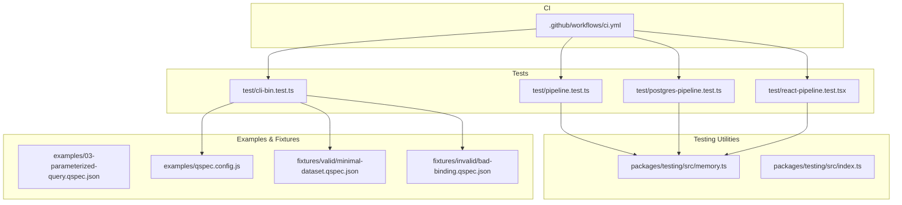
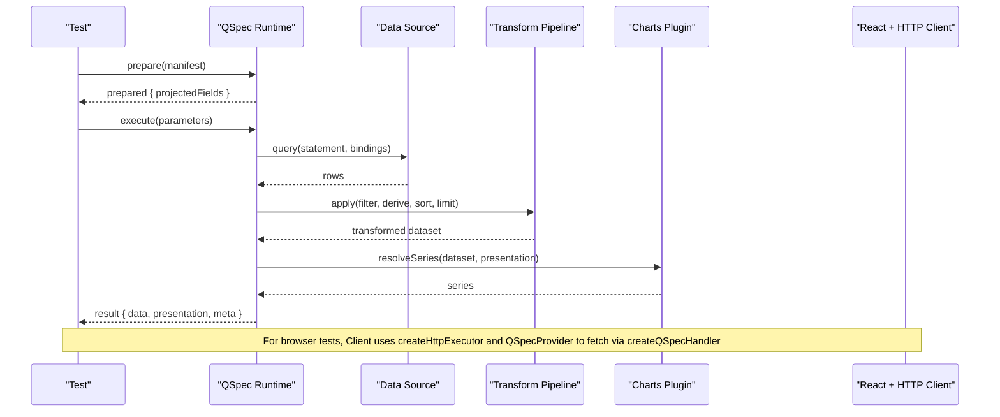
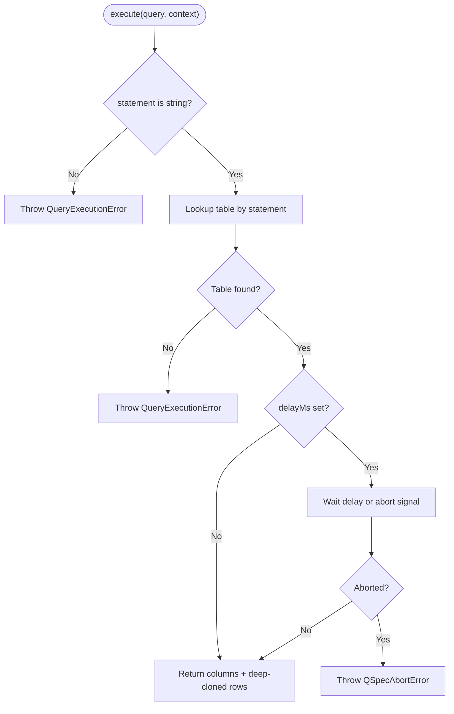
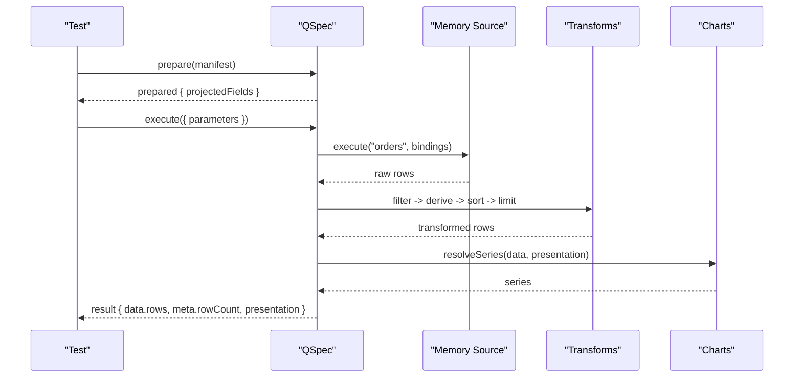
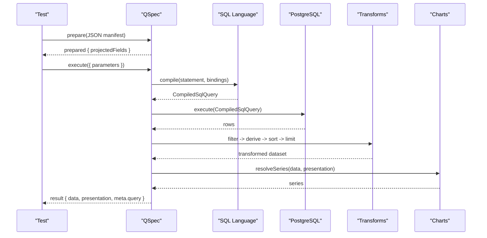
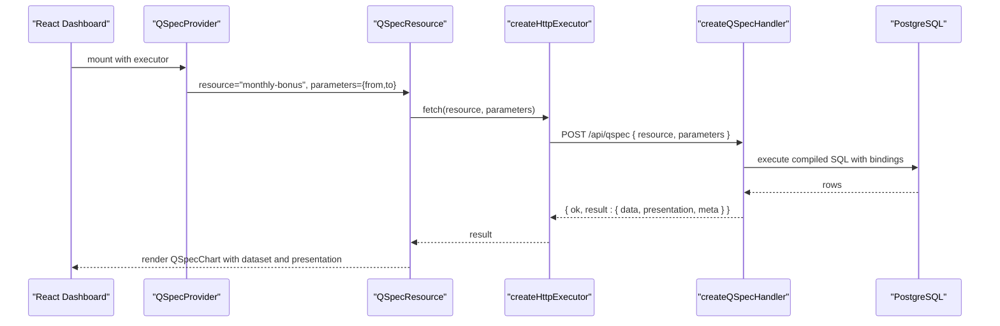
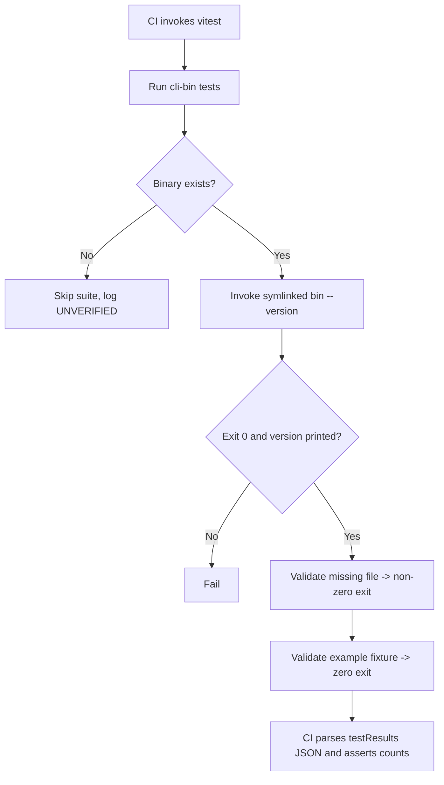
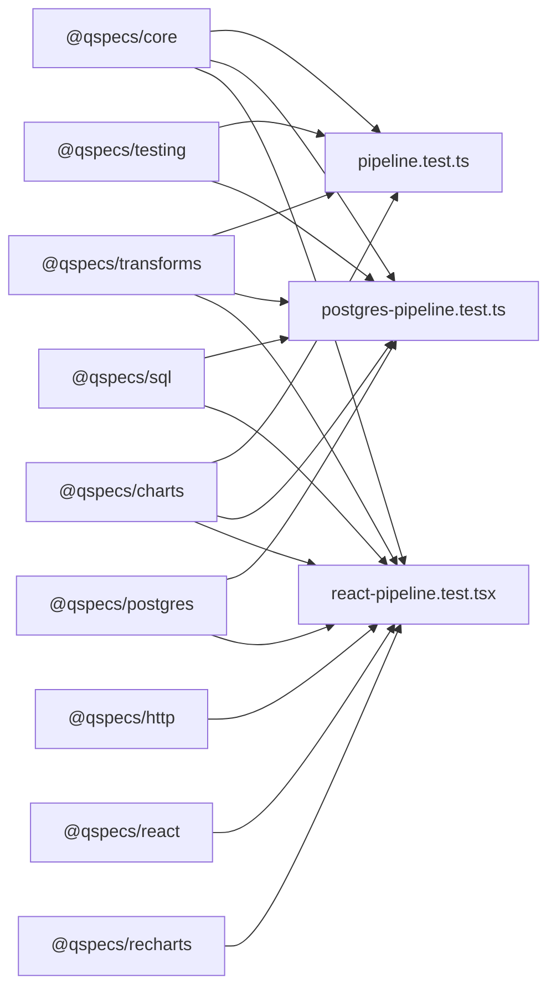

# Testing Examples

<cite>
**Referenced Files in This Document**
- [pipeline.test.ts](file://test/pipeline.test.ts)
- [postgres-pipeline.test.ts](file://test/postgres-pipeline.test.ts)
- [react-pipeline.test.tsx](file://test/react-pipeline.test.tsx)
- [cli-bin.test.ts](file://test/cli-bin.test.ts)
- [memory.ts](file://packages/testing/src/memory.ts)
- [index.ts](file://packages/testing/src/index.ts)
- [03-parameterized-query.qspec.json](file://examples/03-parameterized-query.qspec.json)
- [qspec.config.js](file://examples/qspec.config.js)
- [minimal-dataset.qspec.json](file://fixtures/valid/minimal-dataset.qspec.json)
- [bad-binding.qspec.json](file://fixtures/invalid/bad-binding.qspec.json)
- [ci.yml](file://.github/workflows/ci.yml)
</cite>

## Table of Contents

1. Introduction
2. Project Structure
3. Core Components
4. Architecture Overview
5. Detailed Component Analysis
6. Dependency Analysis
7. Performance Considerations
8. Troubleshooting Guide
9. Conclusion
10. Appendices

## Introduction

This document explains how to test QSpec manifests and applications using the repository’s test fixtures and utilities. It covers unit testing for manifests, validating plugin configurations, testing transform pipelines, parameterized queries, chart presentations, error scenarios, mocking data sources, async operations, output schema validation, CLI validation in CI/CD, and automated workflows. The guidance is grounded in the existing tests and tools under test/, packages/testing/, examples/, fixtures/, and .github/workflows/.

## Project Structure

The testing strategy spans several layers:

- Unit and integration tests under test/ validate end-to-end flows with in-memory and real PostgreSQL backends, React rendering, and HTTP boundaries.
- Test utilities under packages/testing/ provide an in-memory data source and contract test runners for transforms, presentations, and data sources.
- Example manifests under examples/ demonstrate parameterized queries and chart presentations; qspec.config.js configures plugin-aware validation.
- Fixtures under fixtures/ provide valid and invalid manifests used by CLI and schema validation.
- CI workflow under .github/workflows/ci.yml enforces test result shape and gating.

**Diagram sources**

- [pipeline.test.ts:1-230](file://test/pipeline.test.ts#L1-L230)
- [postgres-pipeline.test.ts:1-330](file://test/postgres-pipeline.test.ts#L1-L330)
- [react-pipeline.test.tsx:1-669](file://test/react-pipeline.test.tsx#L1-L669)
- [cli-bin.test.ts:1-142](file://test/cli-bin.test.ts#L1-L142)
- [memory.ts:1-161](file://packages/testing/src/memory.ts#L1-L161)
- [index.ts:1-17](file://packages/testing/src/index.ts#L1-L17)
- [03-parameterized-query.qspec.json:1-55](file://examples/03-parameterized-query.qspec.json#L1-L55)
- [qspec.config.js:1-19](file://examples/qspec.config.js#L1-L19)
- [minimal-dataset.qspec.json:1-7](file://fixtures/valid/minimal-dataset.qspec.json#L1-L7)
- [bad-binding.qspec.json:1-14](file://fixtures/invalid/bad-binding.qspec.json#L1-L14)
- [ci.yml:112-137](file://.github/workflows/ci.yml#L112-L137)

**Section sources**

- [pipeline.test.ts:1-230](file://test/pipeline.test.ts#L1-L230)
- [postgres-pipeline.test.ts:1-330](file://test/postgres-pipeline.test.ts#L1-L330)
- [react-pipeline.test.tsx:1-669](file://test/react-pipeline.test.tsx#L1-L669)
- [cli-bin.test.ts:1-142](file://test/cli-bin.test.ts#L1-L142)
- [memory.ts:1-161](file://packages/testing/src/memory.ts#L1-L161)
- [index.ts:1-17](file://packages/testing/src/index.ts#L1-L17)
- [03-parameterized-query.qspec.json:1-55](file://examples/03-parameterized-query.qspec.json#L1-L55)
- [qspec.config.js:1-19](file://examples/qspec.config.js#L1-L19)
- [minimal-dataset.qspec.json:1-7](file://fixtures/valid/minimal-dataset.qspec.json#L1-L7)
- [bad-binding.qspec.json:1-14](file://fixtures/invalid/bad-binding.qspec.json#L1-L14)
- [ci.yml:112-137](file://.github/workflows/ci.yml#L112-L137)

## Core Components

- In-memory data source plugin: Provides a deterministic, fast data source for unit tests, records calls, supports delays, and abort signals for async testing.
- Contract test runners: Expose helpers to run standardized contract suites for transforms, presentations, and data sources.
- End-to-end pipeline tests: Validate full flows from manifest parsing through SQL compilation, execution against PostgreSQL, dataset normalization, transforms, and presentation resolution.
- React + HTTP integration tests: Exercise the client/server boundary, Suspense-based loading, Recharts rendering, and security constraints (no SQL or credentials on the wire).
- CLI binary tests: Ensure the installed binary runs via symlinks, validates manifests, and reports errors correctly.

**Section sources**

- [memory.ts:1-161](file://packages/testing/src/memory.ts#L1-L161)
- [index.ts:1-17](file://packages/testing/src/index.ts#L1-L17)
- [pipeline.test.ts:1-230](file://test/pipeline.test.ts#L1-L230)
- [postgres-pipeline.test.ts:1-330](file://test/postgres-pipeline.test.ts#L1-L330)
- [react-pipeline.test.tsx:1-669](file://test/react-pipeline.test.tsx#L1-L669)
- [cli-bin.test.ts:1-142](file://test/cli-bin.test.ts#L1-L142)

## Architecture Overview

The testing architecture composes plugins into a runtime that can be exercised at different levels:

- Unit level: In-memory source + transforms + charts to validate projection, transforms, and presentation without external dependencies.
- Integration level: Real PostgreSQL via containers to validate SQL compilation, binding, normalization, transforms, and presentation.
- Browser level: HTTP executor, QSpecProvider/QSpecResource, and Recharts to validate async UI behavior and security boundaries.
- CLI level: Spawning the built binary to validate manifests and enforce exit codes.

**Diagram sources**

- [pipeline.test.ts:27-120](file://test/pipeline.test.ts#L27-L120)
- [postgres-pipeline.test.ts:147-328](file://test/postgres-pipeline.test.ts#L147-L328)
- [react-pipeline.test.tsx:196-317](file://test/react-pipeline.test.tsx#L196-L317)
- [memory.ts:69-160](file://packages/testing/src/memory.ts#L69-L160)

## Detailed Component Analysis

### In-Memory Data Source and Async Abort Support

The memory plugin provides:

- A pass-through query language that compiles queries to a simple form carrying source, statement, and bindings.
- A DataSource implementation per table name that returns fixture columns and rows, optionally delayed.
- Recording of all executions for assertions.
- Proper handling of abort signals during delays to support cancellation tests.

**Diagram sources**

- [memory.ts:69-160](file://packages/testing/src/memory.ts#L69-L160)

**Section sources**

- [memory.ts:1-161](file://packages/testing/src/memory.ts#L1-L161)

### Transform Pipeline Validation

End-to-end tests verify:

- Static projection through transforms (filter, derive, sort, limit) computed before any data is fetched.
- Correct row ordering and counts after transforms.
- Presentation field validation fails early if a series references a field not produced by the pipeline.
- Renamed fields project through to presentation validation.

**Diagram sources**

- [pipeline.test.ts:27-120](file://test/pipeline.test.ts#L27-L120)
- [pipeline.test.ts:165-229](file://test/pipeline.test.ts#L165-L229)

**Section sources**

- [pipeline.test.ts:1-230](file://test/pipeline.test.ts#L1-L230)

### PostgreSQL Integration and Full Flow

Integration tests prove:

- JSON manifest string triggers text-path parsing and schema validation.
- SQL compilation binds :from/:to to $1/$2 placeholders within the Postgres adapter.
- Execution against a containerized PostgreSQL returns normalized rows validated against spec.dataset.
- Transform chain produces expected results and presentation model.
- meta.query contains only safe metadata (source, language, durationMs), never bound values or secrets.

**Diagram sources**

- [postgres-pipeline.test.ts:147-328](file://test/postgres-pipeline.test.ts#L147-L328)

**Section sources**

- [postgres-pipeline.test.ts:1-330](file://test/postgres-pipeline.test.ts#L1-L330)

### React + HTTP End-to-End Rendering

Browser tests validate:

- Server-side handler exposes a resource by name; client requests only resource and parameters.
- QSpecProvider and QSpecResource suspend until data arrives.
- Recharts renders one mark per row after transforms.
- Changing parameters re-executes and updates the chart.
- No SQL, connection strings, or passwords leak to request/response/DOM.

**Diagram sources**

- [react-pipeline.test.tsx:196-317](file://test/react-pipeline.test.tsx#L196-L317)
- [react-pipeline.test.tsx:541-597](file://test/react-pipeline.test.tsx#L541-L597)

**Section sources**

- [react-pipeline.test.tsx:1-669](file://test/react-pipeline.test.tsx#L1-L669)

### CLI Validation in CI/CD

CLI tests ensure:

- The built binary executes when invoked via symlink (as npm installs it).
- Missing manifests produce non-zero exit and informative output.
- Valid fixtures validate successfully.
- CI checks test result JSON to enforce passing counts and no pending/skipped cases.

**Diagram sources**

- [cli-bin.test.ts:40-142](file://test/cli-bin.test.ts#L40-L142)
- [ci.yml:112-137](file://.github/workflows/ci.yml#L112-L137)

**Section sources**

- [cli-bin.test.ts:1-142](file://test/cli-bin.test.ts#L1-L142)
- [ci.yml:112-137](file://.github/workflows/ci.yml#L112-L137)

## Dependency Analysis

Key dependencies across tests:

- @qspecs/core: Runtime, types, and errors used by all tests.
- @qspecs/sql and @qspecs/postgres: Used in integration and React tests for SQL compilation and database execution.
- @qspecs/transforms and @qspecs/charts: Applied in pipeline tests to validate transformations and presentation resolution.
- @qspecs/http, @qspecs/react, @qspecs/recharts: Used in React tests to simulate client-server flow and rendering.
- @qspecs/testing: Provides memory data source and contract test runners.

**Diagram sources**

- [pipeline.test.ts:1-10](file://test/pipeline.test.ts#L1-L10)
- [postgres-pipeline.test.ts:1-10](file://test/postgres-pipeline.test.ts#L1-L10)
- [react-pipeline.test.tsx:1-22](file://test/react-pipeline.test.tsx#L1-L22)
- [index.ts:1-17](file://packages/testing/src/index.ts#L1-L17)

**Section sources**

- [pipeline.test.ts:1-10](file://test/pipeline.test.ts#L1-L10)
- [postgres-pipeline.test.ts:1-10](file://test/postgres-pipeline.test.ts#L1-L10)
- [react-pipeline.test.tsx:1-22](file://test/react-pipeline.test.tsx#L1-L22)
- [index.ts:1-17](file://packages/testing/src/index.ts#L1-L17)

## Performance Considerations

- Prefer in-memory sources for fast unit tests; use PostgreSQL containers only for integration tests where real execution paths must be verified.
- Use minimal datasets and targeted transforms to keep tests quick and deterministic.
- Avoid unnecessary network calls in unit tests; rely on memory plugin recordings and projections.
- For React tests, keep timeouts reasonable for local runs; container startup justifies higher hook timeouts, but individual re-renders should settle quickly.

[No sources needed since this section provides general guidance]

## Troubleshooting Guide

Common issues and resolutions:

- Presentation field misspelled: prepare() throws a presentation error before any data is fetched; ensure series fields match projected fields after transforms.
- Missing or invalid bindings: Fixtures like bad-binding illustrate incorrect binding usage; correct bindings to reference $parameters.*.
- Container runtime unavailable: Suites detect and skip gracefully; ensure Docker/testcontainers are available for integration tests.
- Binary not built: CLI tests skip if dist/bin.js is missing; build before running tests.
- Unexpected console errors in React tests: Capture and assert console.error to avoid hidden failures; ensure no unexpected warnings occur.

**Section sources**

- [pipeline.test.ts:122-149](file://test/pipeline.test.ts#L122-L149)
- [bad-binding.qspec.json:1-14](file://fixtures/invalid/bad-binding.qspec.json#L1-L14)
- [postgres-pipeline.test.ts:58-87](file://test/postgres-pipeline.test.ts#L58-L87)
- [cli-bin.test.ts:43-57](file://test/cli-bin.test.ts#L43-L57)
- [react-pipeline.test.tsx:443-474](file://test/react-pipeline.test.tsx#L443-L474)

## Conclusion

The repository provides a comprehensive testing strategy for QSpec manifests and applications:

- Use in-memory sources for fast, deterministic unit tests of manifests, transforms, and presentations.
- Validate full flows with PostgreSQL containers to ensure SQL compilation, execution, normalization, and presentation work together.
- Exercise the client/server boundary with React and HTTP to confirm async behavior and security constraints.
- Integrate CLI validation into CI/CD to catch manifest issues early and enforce quality gates.
- Follow best practices for test organization, fixture management, and continuous integration setup demonstrated by the existing tests and workflows.

[No sources needed since this section summarizes without analyzing specific files]

## Appendices

### Writing Unit Tests for Manifests

- Create a manifest object or JSON string and call prepare() to validate static aspects like projected fields and presentation correctness.
- Use the memory plugin to supply tables and assert execution calls and results.
- Reference examples for parameterized queries and chart presentations.

**Section sources**

- [pipeline.test.ts:27-120](file://test/pipeline.test.ts#L27-L120)
- [03-parameterized-query.qspec.json:1-55](file://examples/03-parameterized-query.qspec.json#L1-L55)

### Validating Plugin Configurations

- Configure plugins via createQSpec().use(...) and ensure they register languages, sources, transforms, and charts.
- Use qspec.config.js to load plugins for CLI validation so manifests are checked against their actual runtime capabilities.

**Section sources**

- [pipeline.test.ts:71-74](file://test/pipeline.test.ts#L71-L74)
- [qspec.config.js:1-19](file://examples/qspec.config.js#L1-L19)

### Testing Transform Pipelines

- Assert projected fields after transforms to ensure rename/derive propagate correctly.
- Verify row order and count after filter/derive/sort/limit.
- Confirm presentation validation fails when referencing fields removed or renamed by transforms.

**Section sources**

- [pipeline.test.ts:79-103](file://test/pipeline.test.ts#L79-L103)
- [pipeline.test.ts:165-229](file://test/pipeline.test.ts#L165-L229)

### Parameterized Queries

- Define parameters with types and required flags; bind them via $parameters.* in bindings.
- Validate that SQL statements compile to parameterized forms and execute with correct bounds.

**Section sources**

- [03-parameterized-query.qspec.json:1-55](file://examples/03-parameterized-query.qspec.json#L1-L55)
- [postgres-pipeline.test.ts:147-187](file://test/postgres-pipeline.test.ts#L147-L187)

### Chart Presentations

- Assert presentation models remain unchanged from the manifest.
- Use resolveSeries to compute series and validate points and labels.
- In React tests, assert rendered marks and axis ticks reflect transformed data.

**Section sources**

- [pipeline.test.ts:97-119](file://test/pipeline.test.ts#L97-L119)
- [react-pipeline.test.tsx:476-539](file://test/react-pipeline.test.tsx#L476-L539)

### Error Scenarios

- Misspelled presentation fields fail at prepare() with a presentation error.
- Invalid bindings or missing tables throw execution errors.
- CLI reports non-zero exits for malformed or missing manifests.

**Section sources**

- [pipeline.test.ts:122-149](file://test/pipeline.test.ts#L122-L149)
- [memory.ts:84-98](file://packages/testing/src/memory.ts#L84-L98)
- [cli-bin.test.ts:105-116](file://test/cli-bin.test.ts#L105-L116)

### Mocking Data Sources

- Use the memory plugin to provide tables and record calls for assertions.
- Leverage delayMs and abort signals to test async cancellation paths.

**Section sources**

- [memory.ts:14-48](file://packages/testing/src/memory.ts#L14-L48)
- [memory.ts:100-132](file://packages/testing/src/memory.ts#L100-L132)

### Testing Async Operations

- Await prepare() and execute() in tests.
- In React tests, wrap renders in act() and use waitFor to observe updated DOM after parameter changes.

**Section sources**

- [pipeline.test.ts:77-103](file://test/pipeline.test.ts#L77-L103)
- [react-pipeline.test.tsx:321-343](file://test/react-pipeline.test.tsx#L321-L343)
- [react-pipeline.test.tsx:599-667](file://test/react-pipeline.test.tsx#L599-L667)

### Validating Output Schemas

- Assert result.data.rows structure and meta.rowCount.
- Validate meta.query contains only safe keys and no sensitive values.

**Section sources**

- [postgres-pipeline.test.ts:273-328](file://test/postgres-pipeline.test.ts#L273-L328)

### CLI Validation Tools in CI/CD

- Build the CLI and invoke the binary via symlink to mimic npm installation.
- Validate fixtures and ensure non-zero exits for invalid inputs.
- Parse testResults JSON to enforce passing counts and no pending cases.

**Section sources**

- [cli-bin.test.ts:82-142](file://test/cli-bin.test.ts#L82-L142)
- [ci.yml:112-137](file://.github/workflows/ci.yml#L112-L137)

### Automated Testing Workflows

- Use Vitest to run unit and integration tests.
- Skip suites gracefully when container runtime is unavailable and log what remains unverified.
- Enforce test result shapes in CI to prevent silent skips.

**Section sources**

- [postgres-pipeline.test.ts:58-87](file://test/postgres-pipeline.test.ts#L58-L87)
- [react-pipeline.test.tsx:77-114](file://test/react-pipeline.test.tsx#L77-L114)
- [ci.yml:112-137](file://.github/workflows/ci.yml#L112-L137)

### Best Practices for Test Organization and Fixture Management

- Keep unit tests fast with in-memory sources; reserve containers for integration tests.
- Organize fixtures into valid and invalid sets; use them for CLI and schema validation.
- Centralize plugin configuration for CLI validation to match runtime behavior.

**Section sources**

- [memory.ts:69-160](file://packages/testing/src/memory.ts#L69-L160)
- [minimal-dataset.qspec.json:1-7](file://fixtures/valid/minimal-dataset.qspec.json#L1-L7)
- [bad-binding.qspec.json:1-14](file://fixtures/invalid/bad-binding.qspec.json#L1-L14)
- [qspec.config.js:1-19](file://examples/qspec.config.js#L1-L19)
