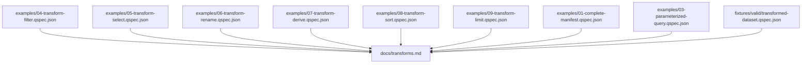
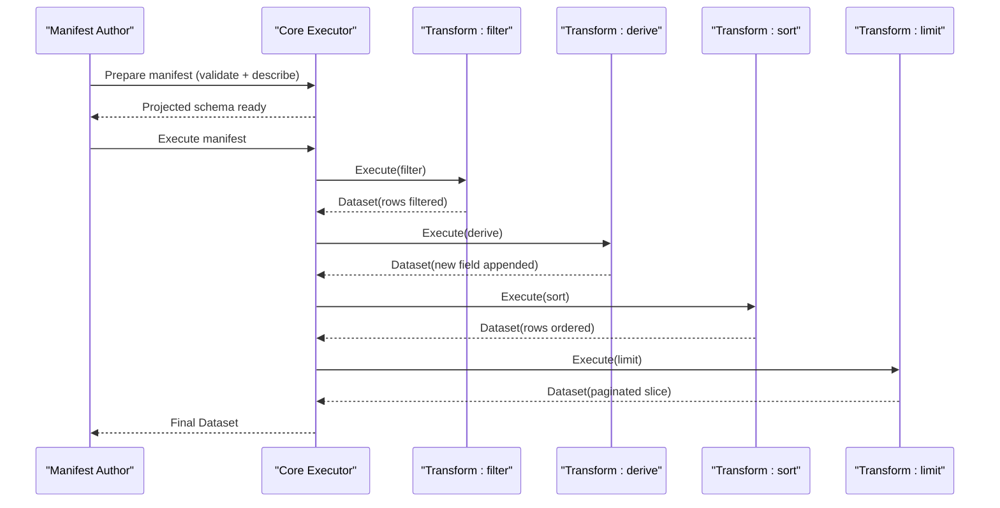
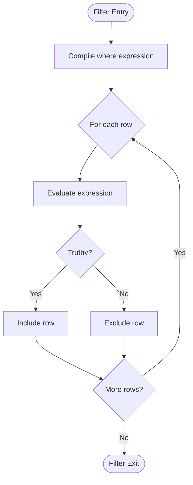
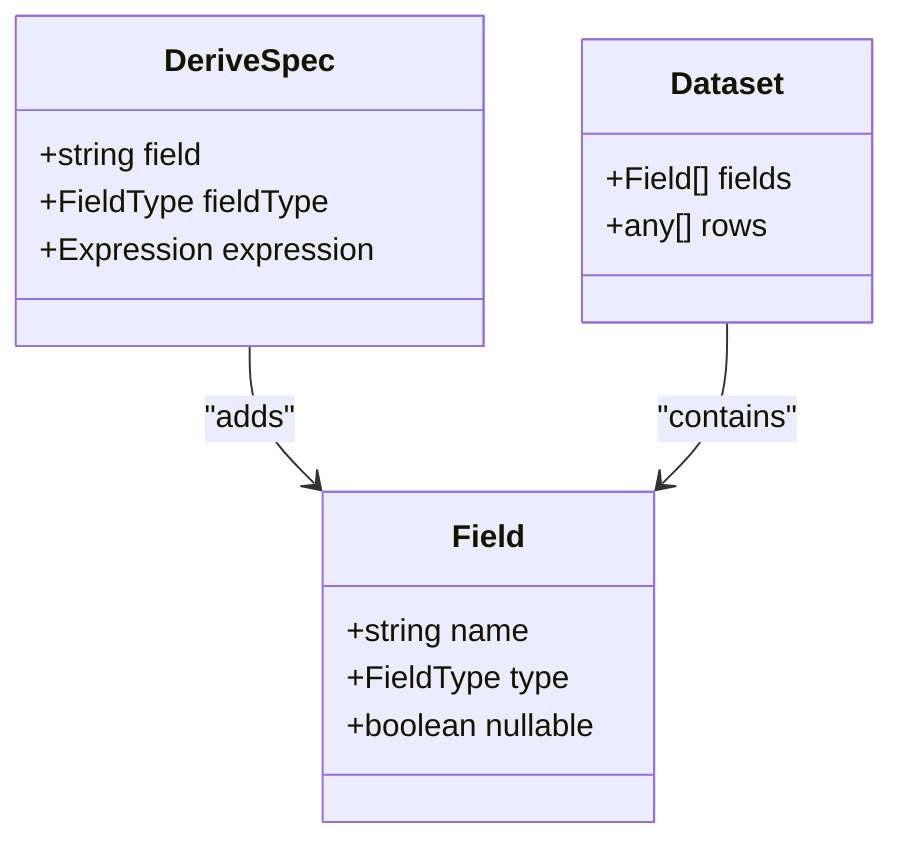
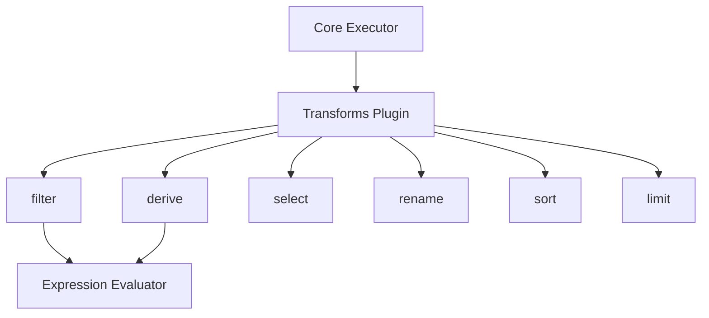

# Transform Pipelines

<cite>
**Referenced Files in This Document**
- [examples/04-transform-filter.qspec.json](file://examples/04-transform-filter.qspec.json)
- [examples/05-transform-select.qspec.json](file://examples/05-transform-select.qspec.json)
- [examples/06-transform-rename.qspec.json](file://examples/06-transform-rename.qspec.json)
- [examples/07-transform-derive.qspec.json](file://examples/07-transform-derive.qspec.json)
- [examples/08-transform-sort.qspec.json](file://examples/08-transform-sort.qspec.json)
- [examples/09-transform-limit.qspec.json](file://examples/09-transform-limit.qspec.json)
- [examples/01-complete-manifest.qspec.json](file://examples/01-complete-manifest.qspec.json)
- [examples/03-parameterized-query.qspec.json](file://examples/03-parameterized-query.qspec.json)
- [examples/README.md](file://examples/README.md)
- [docs/transforms.md](file://docs/transforms.md)
- [fixtures/valid/transformed-dataset.qspec.json](file://fixtures/valid/transformed-dataset.qspec.json)
</cite>

## Table of Contents

1. [Introduction](#introduction)
2. [Project Structure](#project-structure)
3. [Core Components](#core-components)
4. [Architecture Overview](#architecture-overview)
5. [Detailed Component Analysis](#detailed-component-analysis)
6. [Dependency Analysis](#dependency-analysis)
7. [Performance Considerations](#performance-considerations)
8. [Troubleshooting Guide](#troubleshooting-guide)
9. [Conclusion](#conclusion)
10. [Appendices](#appendices)

## Introduction

This document explains how to build complex data processing workflows using QSpec’s transform pipeline. It focuses on the six built-in transforms—filter, select, rename, derive, sort, and limit—and shows how to compose them into robust pipelines with practical examples from the repository. You will learn expression-based filtering and derivation, field projection and renaming, ordering and pagination, and how to chain multiple transforms effectively while maintaining performance and correctness.

The transform pipeline runs after a query result is normalized and validated against the dataset schema. Transforms execute strictly in declared order, each seeing only the previous transform’s output. Every transform returns a new Dataset rather than mutating its input, ensuring deterministic and composable behavior.

**Section sources**

- [docs/transforms.md:1-48](file://docs/transforms.md#L1-L48)

## Project Structure

QSpec organizes transform-related content across example manifests, documentation, and fixtures:

- Example manifests demonstrate each transform individually and in combination.
- The transforms documentation describes semantics, expression AST, and validation rules.
- Fixtures provide additional valid datasets that exercise transforms like sort and limit.

**Diagram sources**

- [examples/04-transform-filter.qspec.json:1-31](file://examples/04-transform-filter.qspec.json#L1-L31)
- [examples/05-transform-select.qspec.json:1-31](file://examples/05-transform-select.qspec.json#L1-L31)
- [examples/06-transform-rename.qspec.json:1-34](file://examples/06-transform-rename.qspec.json#L1-L34)
- [examples/07-transform-derive.qspec.json:1-35](file://examples/07-transform-derive.qspec.json#L1-L35)
- [examples/08-transform-sort.qspec.json:1-30](file://examples/08-transform-sort.qspec.json#L1-L30)
- [examples/09-transform-limit.qspec.json:1-30](file://examples/09-transform-limit.qspec.json#L1-L30)
- [examples/01-complete-manifest.qspec.json:1-90](file://examples/01-complete-manifest.qspec.json#L1-L90)
- [examples/03-parameterized-query.qspec.json:1-55](file://examples/03-parameterized-query.qspec.json#L1-L55)
- [fixtures/valid/transformed-dataset.qspec.json:1-28](file://fixtures/valid/transformed-dataset.qspec.json#L1-L28)
- [docs/transforms.md:1-419](file://docs/transforms.md#L1-L419)

**Section sources**

- [examples/README.md:1-112](file://examples/README.md#L1-L112)
- [docs/transforms.md:1-48](file://docs/transforms.md#L1-L48)

## Core Components

QSpec’s transform pipeline consists of six built-in operators that can be composed sequentially:

- filter: Selects rows based on an expression or comparison shorthand.
- select: Projects a subset of fields in a specified order.
- rename: Renames fields by mapping old names to new names without reordering.
- derive: Adds a new field computed via an expression; always nullable at runtime.
- sort: Orders rows by a single field with stable ordering and nulls-last behavior.
- limit: Slices rows using count and optional offset for pagination.

These transforms are registered by the transforms plugin and executed in strict order. Each transform implements describe() so static schema projection remains accurate through prepare().

**Section sources**

- [docs/transforms.md:49-211](file://docs/transforms.md#L49-L211)

## Architecture Overview

The transform pipeline integrates with QSpec’s execution model:

- After query normalization and dataset validation, transforms run sequentially.
- Each transform receives the previous transform’s Dataset and returns a new one.
- Static analysis (prepare()) uses describe() to project field schemas before any query executes.
- Presentation validation checks field references against the projected schema.

**Diagram sources**

- [docs/transforms.md:24-48](file://docs/transforms.md#L24-L48)
- [docs/transforms.md:340-362](file://docs/transforms.md#L340-L362)

## Detailed Component Analysis

### Filter Transform

Purpose:

- Remove rows that do not satisfy a condition.

Key behaviors:

- Accepts either a full expression AST or a comparison shorthand { field, operator, value }.
- Compiles the expression once per execution and evaluates it per row.
- Does not change the schema; describe() returns input fields unchanged.

Practical example:

- Filtering high-value orders by amount greater than a threshold using the shorthand form.

Expression notes:

- Comparison operators include gt, gte, lt, lte, eq, ne.
- Null comparisons evaluate to false; use isNull to test nullness.

Best practices:

- Prefer filter early in the pipeline to reduce downstream work.
- Use parameters for thresholds to keep expressions declarative and reusable.

**Section sources**

- [docs/transforms.md:65-78](file://docs/transforms.md#L65-L78)
- [docs/transforms.md:213-261](file://docs/transforms.md#L213-L261)
- [examples/04-transform-filter.qspec.json:1-31](file://examples/04-transform-filter.qspec.json#L1-L31)
- [examples/01-complete-manifest.qspec.json:53-68](file://examples/01-complete-manifest.qspec.json#L53-L68)

#### Filter Flowchart

**Diagram sources**

- [docs/transforms.md:65-78](file://docs/transforms.md#L65-L78)

### Select Transform

Purpose:

- Project a named subset of fields in a specified order.

Key behaviors:

- Output field order matches the fields array in spec.
- Unknown field names are silently dropped at runtime but caught statically when schema is available.
- describe() performs identical projection to ensure static and runtime agreement.

Practical example:

- Dropping an internal-only column before passing data to a chart.

Best practices:

- Use select to minimize payload size and expose only consumer-facing fields.
- Order fields explicitly to stabilize downstream expectations.

**Section sources**

- [docs/transforms.md:157-175](file://docs/transforms.md#L157-L175)
- [examples/05-transform-select.qspec.json:1-31](file://examples/05-transform-select.qspec.json#L1-L31)

### Rename Transform

Purpose:

- Rename fields without changing their order.

Key behaviors:

- Only listed fields are renamed; others remain untouched.
- Collision detection occurs both statically (when schema is known) and at runtime.
- Uses safe property access to avoid prototype collisions.

Practical example:

- Mapping raw snake_case columns to canonical names used by the rest of the pipeline.

Best practices:

- Place rename early to normalize naming conventions before other transforms.
- Avoid renaming to names that already exist unless intentional.

**Section sources**

- [docs/transforms.md:177-211](file://docs/transforms.md#L177-L211)
- [examples/06-transform-rename.qspec.json:1-34](file://examples/06-transform-rename.qspec.json#L1-L34)

### Derive Transform

Purpose:

- Add a new field computed from existing fields or literals.

Key behaviors:

- Requires explicit fieldType; derived fields are always nullable at runtime.
- Expression compiled once per execution; evaluated per row.
- describe() appends the same field shape to maintain static/runtime consistency.

Practical example:

- Computing totalPrice as quantity multiplied by unit_price.

Expression capabilities:

- Supports arithmetic, logical, membership, null, and comparison operators.
- Shorthand comparison supported; full AST supports multi-field operations.

Best practices:

- Declare fieldType explicitly to avoid ambiguity.
- Use derive for business calculations that cannot be expressed by earlier transforms.

**Section sources**

- [docs/transforms.md:80-112](file://docs/transforms.md#L80-L112)
- [docs/transforms.md:213-261](file://docs/transforms.md#L213-L261)
- [examples/07-transform-derive.qspec.json:1-35](file://examples/07-transform-derive.qspec.json#L1-L35)

#### Derive Class Diagram

**Diagram sources**

- [docs/transforms.md:80-112](file://docs/transforms.md#L80-L112)

### Sort Transform

Purpose:

- Order rows by a single field with stable ordering.

Key behaviors:

- Null values sort last regardless of direction.
- Stable sort preserves original relative order for equal values.
- describe() returns input fields unchanged.

Practical example:

- Ordering products by revenue descending.

Best practices:

- Combine sort with limit for top-N queries.
- Ensure consistent types in the sort field to avoid incomparable comparisons.

**Section sources**

- [docs/transforms.md:114-139](file://docs/transforms.md#L114-L139)
- [examples/08-transform-sort.qspec.json:1-30](file://examples/08-transform-sort.qspec.json#L1-L30)
- [fixtures/valid/transformed-dataset.qspec.json:22-25](file://fixtures/valid/transformed-dataset.qspec.json#L22-L25)

### Limit Transform

Purpose:

- Slice rows using count and optional offset for pagination.

Key behaviors:

- Implements simple slicing; no cursor state beyond provided offset.
- describe() returns input fields unchanged.

Practical example:

- Returning page two of results using count and offset together.

Best practices:

- Pair with sort to ensure deterministic pages.
- Validate offset/count to prevent excessive memory usage.

**Section sources**

- [docs/transforms.md:141-155](file://docs/transforms.md#L141-L155)
- [examples/09-transform-limit.qspec.json:1-30](file://examples/09-transform-limit.qspec.json#L1-L30)

### Composing Multiple Transforms

A typical pipeline might:

- Filter rows to relevant subsets.
- Derive new fields for calculations.
- Select only needed fields.
- Rename fields to canonical names.
- Sort for deterministic ordering.
- Limit for pagination.

Example composition patterns:

- Filter → Derive → Select → Sort → Limit
- Rename → Select → Filter → Sort → Limit

Parameterization:

- Use parameters in queries and expressions to make pipelines reusable and dynamic.

**Section sources**

- [examples/01-complete-manifest.qspec.json:1-90](file://examples/01-complete-manifest.qspec.json#L1-L90)
- [examples/03-parameterized-query.qspec.json:1-55](file://examples/03-parameterized-query.qspec.json#L1-L55)
- [fixtures/valid/transformed-dataset.qspec.json:1-28](file://fixtures/valid/transformed-dataset.qspec.json#L1-L28)

## Dependency Analysis

Transforms depend on:

- The core executor to run transforms in order.
- The expression evaluator for filter and derive.
- The transforms plugin registry to resolve transform types.

Static dependencies:

- describe() enables schema projection during prepare(), which presentation validation consumes.

Runtime dependencies:

- Each transform reads and writes a Dataset; they must not mutate inputs.

**Diagram sources**

- [docs/transforms.md:24-48](file://docs/transforms.md#L24-L48)
- [docs/transforms.md:49-63](file://docs/transforms.md#L49-L63)
- [docs/transforms.md:213-261](file://docs/transforms.md#L213-L261)

**Section sources**

- [docs/transforms.md:24-63](file://docs/transforms.md#L24-L63)
- [docs/transforms.md:213-261](file://docs/transforms.md#L213-L261)

## Performance Considerations

- Order matters: place filter and select early to reduce row and column counts before expensive operations like sort or derive.
- Avoid unnecessary derives: compute only fields required by downstream consumers.
- Use limit judiciously: combine with sort to ensure deterministic pagination and reduce memory footprint.
- Expression depth limits protect against deeply nested expressions; configure maxExpressionDepth appropriately.
- Stable sorts preserve determinism; rely on sort stability for reproducible outputs.

[No sources needed since this section provides general guidance]

## Troubleshooting Guide

Common issues and strategies:

- Unknown field references: ensure select/rename produce expected fields; rely on describe() for static validation.
- Expression errors: validate operator names and arity; use shorthand only for two-argument comparisons.
- Null handling: remember nulls compare as false in comparisons; use isNull to detect missing values.
- Schema opacity: if a custom transform omits describe(), downstream static checks are lost; implement describe() to preserve validation.
- Pagination pitfalls: ensure sort precedes limit to guarantee consistent pages.

Debugging techniques:

- Inspect intermediate datasets by adding temporary selects to narrow fields.
- Use parameters to isolate variable behavior in filters and derives.
- Leverage CI validation of examples to catch drift early.

**Section sources**

- [docs/transforms.md:340-404](file://docs/transforms.md#L340-L404)
- [examples/README.md:1-21](file://examples/README.md#L1-L21)

## Conclusion

QSpec’s transform pipeline provides a powerful, declarative way to build complex data processing workflows. By composing filter, select, rename, derive, sort, and limit in a strict order, you can create robust, maintainable pipelines that are easy to validate, optimize, and extend. Adhering to best practices—early filtering and projection, explicit field typing, stable sorting, and careful pagination—ensures predictable performance and reliability.

[No sources needed since this section summarizes without analyzing specific files]

## Appendices

### Practical Examples Index

- Filter: High-value orders threshold
- Select: Drop internal-only columns
- Rename: Normalize column names
- Derive: Compute totals from fields
- Sort: Order by revenue descending
- Limit: Paginate results with count and offset
- Complete manifest: Parameters, query bindings, filter, and presentation
- Parameterized query: Bind parameters to SQL statements

**Section sources**

- [examples/04-transform-filter.qspec.json:1-31](file://examples/04-transform-filter.qspec.json#L1-L31)
- [examples/05-transform-select.qspec.json:1-31](file://examples/05-transform-select.qspec.json#L1-L31)
- [examples/06-transform-rename.qspec.json:1-34](file://examples/06-transform-rename.qspec.json#L1-L34)
- [examples/07-transform-derive.qspec.json:1-35](file://examples/07-transform-derive.qspec.json#L1-L35)
- [examples/08-transform-sort.qspec.json:1-30](file://examples/08-transform-sort.qspec.json#L1-L30)
- [examples/09-transform-limit.qspec.json:1-30](file://examples/09-transform-limit.qspec.json#L1-L30)
- [examples/01-complete-manifest.qspec.json:1-90](file://examples/01-complete-manifest.qspec.json#L1-L90)
- [examples/03-parameterized-query.qspec.json:1-55](file://examples/03-parameterized-query.qspec.json#L1-L55)
