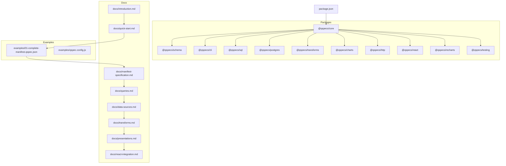
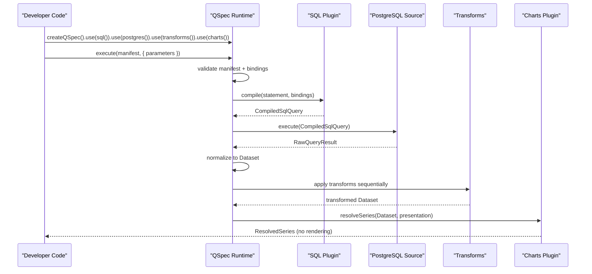
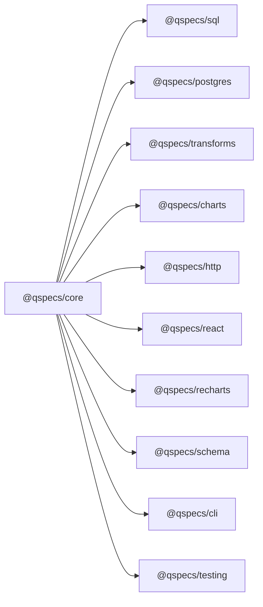

# Getting Started

<cite>
**Referenced Files in This Document**
- [README.md](file://README.md)
- [docs/introduction.md](file://docs/introduction.md)
- [docs/quick-start.md](file://docs/quick-start.md)
- [docs/manifest-specification.md](file://docs/manifest-specification.md)
- [docs/queries.md](file://docs/queries.md)
- [docs/data-sources.md](file://docs/data-sources.md)
- [docs/transforms.md](file://docs/transforms.md)
- [docs/presentations.md](file://docs/presentations.md)
- [docs/react-integration.md](file://docs/react-integration.md)
- [examples/01-complete-manifest.qspec.json](file://examples/01-complete-manifest.qspec.json)
- [examples/qspec.config.js](file://examples/qspec.config.js)
- [package.json](file://package.json)
</cite>

## Table of Contents

1. [Introduction](#introduction)
2. [Project Structure](#project-structure)
3. [Core Components](#core-components)
4. [Architecture Overview](#architecture-overview)
5. [Detailed Component Analysis](#detailed-component-analysis)
6. [Dependency Analysis](#dependency-analysis)
7. [Performance Considerations](#performance-considerations)
8. [Troubleshooting Guide](#troubleshooting-guide)
9. [Conclusion](#conclusion)
10. [Appendices](#appendices)

## Introduction

QSpec is an extensible, declarative specification and runtime for defining parameterized data queries, validating inputs and outputs, transforming datasets, and describing how those datasets should be presented. A QSpec manifest (a plain JSON document) describes analytical resources such as charts, tables, metrics, or datasets without writing application-specific execution or visualization code. The framework separates concerns across a plugin system: core remains small and stable, while domain-specific capabilities like query languages, data sources, transforms, and presentations are added via plugins.

Key principles:

- Manifests are validated before they run, catching issues like misspelled fields or unregistered transforms early.
- Queries use named bindings to parameters; values are never interpolated into SQL text by construction.
- Presentations describe semantic intent; rendering is handled by renderer packages.

**Section sources**

- [docs/introduction.md:3-31](file://docs/introduction.md#L3-L31)
- [README.md:3-12](file://README.md#L3-L12)

## Project Structure

At a high level, the repository organizes functionality into packages under `packages/`, with documentation under `docs/` and runnable examples under `examples/`. The root `package.json` defines workspaces and scripts for building, testing, and formatting.

**Diagram sources**

- [package.json:1-45](file://package.json#L1-L45)
- [docs/introduction.md:3-31](file://docs/introduction.md#L3-L31)
- [docs/quick-start.md:43-97](file://docs/quick-start.md#L43-L97)
- [examples/01-complete-manifest.qspec.json:1-90](file://examples/01-complete-manifest.qspec.json#L1-L90)
- [examples/qspec.config.js:1-19](file://examples/qspec.config.js#L1-L19)

**Section sources**

- [package.json:1-45](file://package.json#L1-L45)
- [README.md:242-258](file://README.md#L242-L258)

## Core Components

This section introduces the essential pieces you will use when getting started with QSpec.

- Manifest: A JSON document that declares what to run (parameters, query, dataset schema, transforms, presentation).
- Runtime: Built with `createQSpec()` and extended with plugins via `.use()`.
- Query language: e.g., SQL via `@qspecs/sql`.
- Data source: e.g., PostgreSQL via `@qspecs/postgres`.
- Transforms: Declarative reshaping steps via `@qspecs/transforms`.
- Presentation: Chart semantics via `@qspecs/charts`; rendering via `@qspecs/recharts`.
- HTTP boundary: Server handler via `@qspecs/http`; browser client via `@qspecs/react`.

Installation highlights:

- Server-side pipeline: install core, sql, postgres, transforms, and charts.
- Browser path: add http, react, and recharts along with React and Recharts.

Execution overview:

- Create a runtime, register plugins, load or define a manifest, call `execute(manifest, { parameters })`, then resolve series from the result for charting.

Security note:

- The HTTP handler is intentionally unauthenticated; host your own auth around it.

**Section sources**

- [README.md:14-41](file://README.md#L14-L41)
- [README.md:43-105](file://README.md#L43-L105)
- [docs/manifest-specification.md:13-118](file://docs/manifest-specification.md#L13-L118)
- [docs/queries.md:23-41](file://docs/queries.md#L23-L41)
- [docs/data-sources.md:1-44](file://docs/data-sources.md#L1-L44)
- [docs/transforms.md:1-48](file://docs/transforms.md#L1-L48)
- [docs/presentations.md:1-37](file://docs/presentations.md#L1-L37)
- [docs/react-integration.md:1-10](file://docs/react-integration.md#L1-L10)

## Architecture Overview

The QSpec pipeline flows from parameters through validation, query compilation, data source execution, dataset normalization, transforms, and finally presentation resolution.

**Diagram sources**

- [README.md:43-105](file://README.md#L43-L105)
- [docs/queries.md:137-148](file://docs/queries.md#L137-L148)
- [docs/data-sources.md:11-44](file://docs/data-sources.md#L11-L44)
- [docs/transforms.md:24-48](file://docs/transforms.md#L24-L48)
- [docs/presentations.md:121-171](file://docs/presentations.md#L121-L171)

## Detailed Component Analysis

### Quick Start: End-to-End Pipeline with PostgreSQL

This quick start demonstrates a real, runnable pipeline using SQL, PostgreSQL, transforms, and chart presentation.

Step-by-step setup:

1. Install required packages:
   - Server-side: `@qspecs/core`, `@qspecs/sql`, `@qspecs/postgres`, `@qspecs/transforms`, `@qspecs/charts`.
   - Browser path additionally requires `@qspecs/http`, `@qspecs/react`, `@qspecs/recharts`, plus React and Recharts.
2. Configure a runtime:
   - Use `sql()` for the query language.
   - Use `postgres({ sources: { analytics: { connectionString: process.env.DATABASE_URL! } } })` to register a logical source name.
   - Use `transforms()` to enable standard transforms.
   - Use `charts()` to enable chart presentations.
3. Load or define a manifest:
   - Use `examples/01-complete-manifest.qspec.json` as a complete example manifest with parameters, SQL query, dataset schema, transform, and presentation.
4. Execute:
   - Call `qspec.execute(manifest, { parameters: { from, to, country } })`.
   - Resolve series with `resolveSeries(result.data, result.presentation)` for charting.

Important notes:

- Connection strings are host configuration passed to `postgres()`, not part of manifests.
- Named bindings (`:from`, `:to`, `:country`) are compiled and bound safely; values never reach the database as SQL text.
- Validate manifests without running them using the CLI or plugin-aware validation.

Validation without a database:

- Use `node packages/cli/dist/bin.js validate examples/01-complete-manifest.qspec.json`.
- For plugin-aware checks, pass `--config examples/qspec.config.js`.

Without a database:

- Use the in-memory data source from `@qspecs/testing` to exercise the same pipeline shape locally.

**Section sources**

- [README.md:14-41](file://README.md#L14-L41)
- [README.md:43-105](file://README.md#L43-L105)
- [docs/quick-start.md:43-138](file://docs/quick-start.md#L43-L138)
- [examples/01-complete-manifest.qspec.json:1-90](file://examples/01-complete-manifest.qspec.json#L1-L90)
- [examples/qspec.config.js:1-19](file://examples/qspec.config.js#L1-L19)

### Browser Path: HTTP Handler and React Components

To render a QSpec chart in the browser:

- On the server, mount `createQSpecHandler` behind your authentication layer. It resolves a resource name against a registry and executes on the host’s runtime.
- In the browser, use `createHttpExecutor` to call the server endpoint, wrap UI with `QSpecProvider`, and fetch a resource with `QSpecResource`. Render with `QSpecChart` from `@qspecs/recharts`.

Key behaviors:

- `QSpecResource` suspends while the query is in flight and rethrows failures to the nearest error boundary.
- The browser only knows a resource name and parameter values; it never sees the query, source name, or credentials.

**Section sources**

- [README.md:107-180](file://README.md#L107-L180)
- [docs/react-integration.md:1-10](file://docs/react-integration.md#L1-L10)
- [docs/react-integration.md:105-177](file://docs/react-integration.md#L105-L177)

### Manifest Creation Basics

A minimal manifest includes top-level fields: `$schema`, `apiVersion`, `kind`, `metadata.name`, and `spec`. For a chart, `spec` typically contains parameters, query, dataset schema, transforms, and presentation.

Example sections:

- Parameters: typed inputs with required/optional flags and defaults.
- Query: source name, language, statement, and bindings mapping placeholders to parameters or literals.
- Dataset: field definitions with types and optional metadata.
- Transforms: ordered list of operations like filter, sort, limit, select, rename, derive.
- Presentation: chart type and axis/series definitions.

Use `examples/01-complete-manifest.qspec.json` as a reference for all sections working together.

**Section sources**

- [docs/manifest-specification.md:13-118](file://docs/manifest-specification.md#L13-L118)
- [examples/01-complete-manifest.qspec.json:1-90](file://examples/01-complete-manifest.qspec.json#L1-L90)

### Queries and Bindings

- `source` names a logical data source configured at runtime; `language` selects a query-language plugin independently.
- `bindings` map placeholders to parameters or literals. String shorthand must match the parameter reference pattern; otherwise, it is a validation error.
- For SQL, statements are compiled into a structure without a raw `text` field; binding happens safely so values cannot be injected as SQL.

**Section sources**

- [docs/queries.md:23-41](file://docs/queries.md#L23-L41)
- [docs/queries.md:43-148](file://docs/queries.md#L43-L148)

### Data Sources

- A data source implements `execute(query, context)` returning a positional result with columns and rows.
- `supportedLanguages` can restrict which query languages a source accepts; omitting it keeps backward compatibility.
- Cancellation and disposal are part of the contract; adapters should propagate cancellation and implement cleanup if needed.

**Section sources**

- [docs/data-sources.md:1-44](file://docs/data-sources.md#L1-L44)
- [docs/data-sources.md:46-67](file://docs/data-sources.md#L46-L67)
- [docs/data-sources.md:68-106](file://docs/data-sources.md#L68-L106)

### Transforms

- Transforms run sequentially over the dataset after normalization and dataset validation.
- Built-in transforms include filter, derive, sort, limit, select, rename.
- Each transform returns a fresh dataset; ordering is strict and immutable per step.
- Expression AST supports comparison, logical, membership, null, arithmetic, and other operators with fixed arity and depth limits.

**Section sources**

- [docs/transforms.md:1-48](file://docs/transforms.md#L1-L48)
- [docs/transforms.md:65-113](file://docs/transforms.md#L65-L113)
- [docs/transforms.md:114-176](file://docs/transforms.md#L114-L176)
- [docs/transforms.md:213-339](file://docs/transforms.md#L213-L339)

### Presentations

- Presentations describe semantic intent for rendering; `@qspecs/charts` registers chart types and the `Chart` resource kind.
- Cartesian types share a common shape; pie has a different shape without x-axis or series list.
- `resolveSeries` computes plottable series from a dataset and presentation, supporting grouped series and consistent labeling.

**Section sources**

- [docs/presentations.md:1-37](file://docs/presentations.md#L1-L37)
- [docs/presentations.md:72-120](file://docs/presentations.md#L72-L120)
- [docs/presentations.md:121-171](file://docs/presentations.md#L121-L171)
- [docs/presentations.md:173-210](file://docs/presentations.md#L173-L210)
- [docs/presentations.md:211-271](file://docs/presentations.md#L211-L271)

## Dependency Analysis

QSpec’s package model separates core from domain features. Core has zero runtime dependencies; additional capabilities are opt-in via plugins.

**Diagram sources**

- [README.md:242-258](file://README.md#L242-L258)
- [package.json:1-45](file://package.json#L1-L45)

**Section sources**

- [README.md:242-258](file://README.md#L242-L258)
- [package.json:1-45](file://package.json#L1-L45)

## Performance Considerations

- Transforms execute sequentially and return new datasets; avoid unnecessary transformations to keep pipelines efficient.
- Use `limit` and `select` to reduce payload size when possible.
- Prefer grouping in presentations where appropriate to minimize redundant computations.
- Be mindful of expression depth limits and operator arities to prevent expensive or invalid expressions.

[No sources needed since this section provides general guidance]

## Troubleshooting Guide

Common issues and resolutions:

- Unknown transform or presentation type: ensure the corresponding plugin is installed and registered with `.use()`.
- Binding errors: verify parameter references match declared parameters and follow the required string pattern; use `{ literal: ... }` for constants.
- Missing dataset fields: check transform projections and presentation field references; use plugin-aware validation to catch issues early.
- Validation mismatches: run both structural validation and plugin-aware validation (`--config`) to surface deeper issues.
- Browser rendering problems: ensure `QSpecProvider`, `<Suspense>`, and error boundaries wrap `QSpecResource`; confirm the executor URL points to a properly mounted handler.

**Section sources**

- [docs/manifest-specification.md:147-207](file://docs/manifest-specification.md#L147-L207)
- [docs/queries.md:68-123](file://docs/queries.md#L68-L123)
- [docs/transforms.md:340-405](file://docs/transforms.md#L340-L405)
- [docs/react-integration.md:105-177](file://docs/react-integration.md#L105-L177)

## Conclusion

You now have a practical understanding of QSpec: what it is, how to install and configure it, how to build and validate manifests, and how to run pipelines both server-side and in the browser. Start with the provided examples, validate manifests early, and extend the runtime with plugins as your needs grow.

[No sources needed since this section summarizes without analyzing specific files]

## Appendices

### Installation Summary

- Server-side: install core, sql, postgres, transforms, charts.
- Browser path: add http, react, recharts, plus React and Recharts.

**Section sources**

- [README.md:14-41](file://README.md#L14-L41)

### Example Manifest Reference

- Use `examples/01-complete-manifest.qspec.json` as a complete example covering parameters, query, dataset schema, transforms, and presentation.

**Section sources**

- [examples/01-complete-manifest.qspec.json:1-90](file://examples/01-complete-manifest.qspec.json#L1-L90)

### CLI Usage

- Validate manifests structurally or with plugin-aware mode using `--config`.
- Run against example manifests to ensure correctness.

**Section sources**

- [docs/quick-start.md:120-138](file://docs/quick-start.md#L120-L138)
- [examples/qspec.config.js:1-19](file://examples/qspec.config.js#L1-L19)
