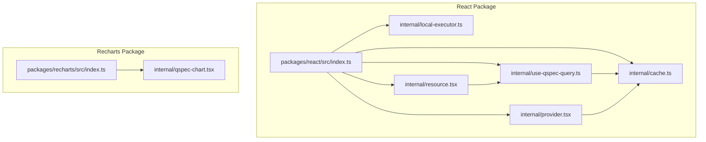
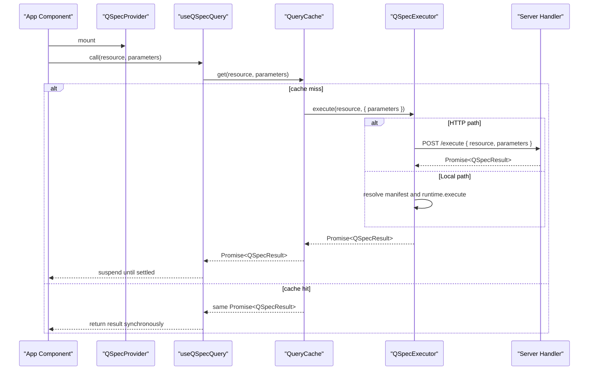
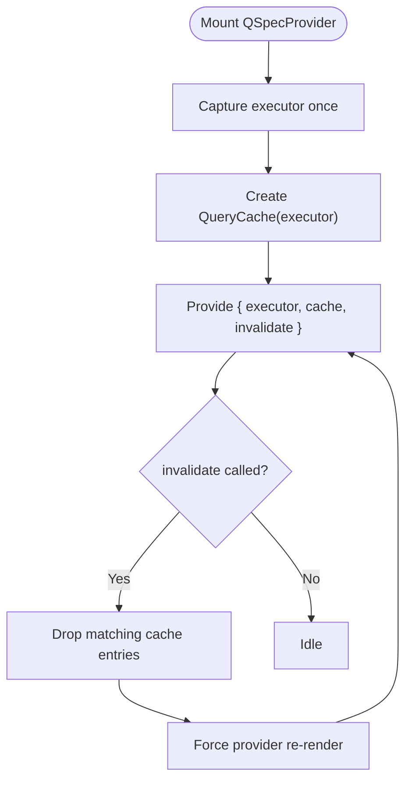
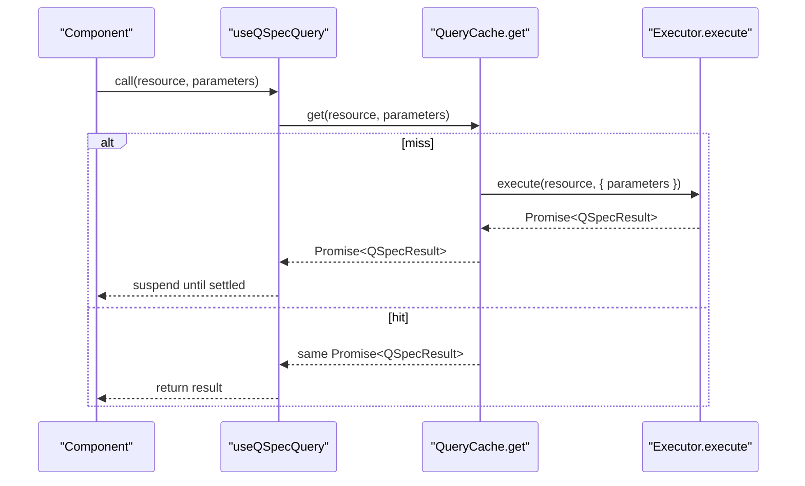
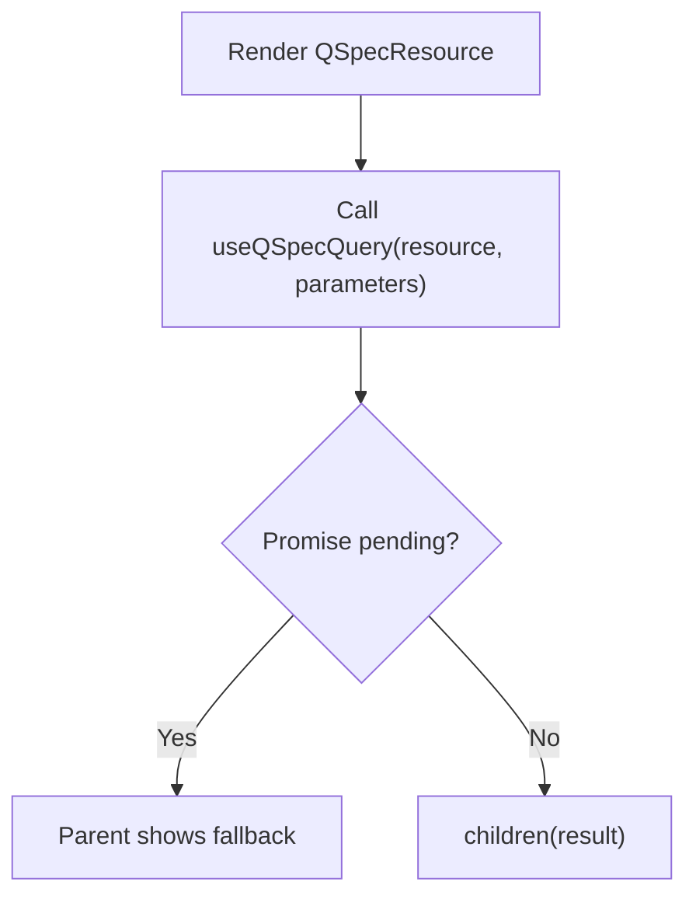
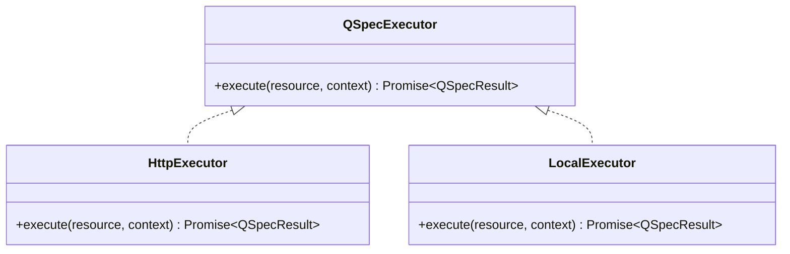
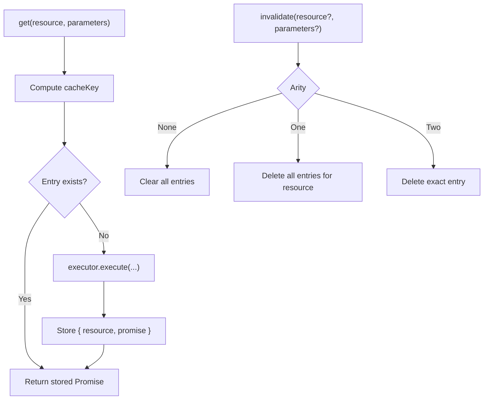
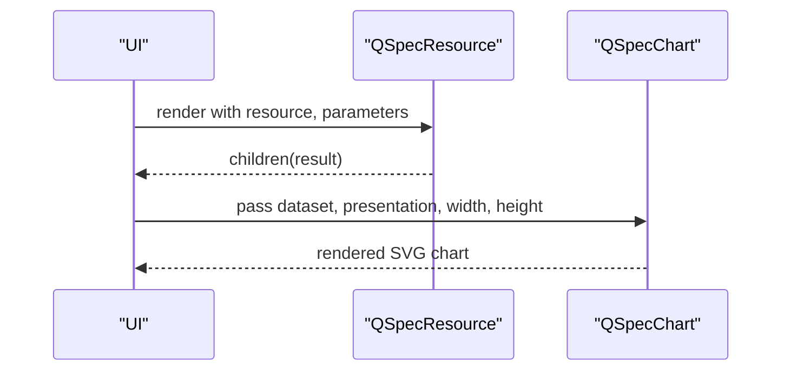
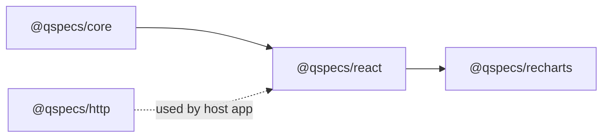

# Browser Integration

<cite>
**Referenced Files in This Document**
- [index.ts](file://packages/react/src/index.ts)
- [provider.tsx](file://packages/react/src/internal/provider.tsx)
- [use-qspec-query.ts](file://packages/react/src/internal/use-qspec-query.ts)
- [cache.ts](file://packages/react/src/internal/cache.ts)
- [local-executor.ts](file://packages/react/src/internal/local-executor.ts)
- [resource.tsx](file://packages/react/src/internal/resource.tsx)
- [react-integration.md](file://docs/react-integration.md)
- [security.md](file://docs/security.md)
- [qspec-chart.tsx](file://packages/recharts/src/internal/qspec-chart.tsx)
- [recharts index.ts](file://packages/recharts/src/index.ts)
</cite>

## Table of Contents

1. Introduction
2. Project Structure
3. Core Components
4. Architecture Overview
5. Detailed Component Analysis
6. Dependency Analysis
7. Performance Considerations
8. Troubleshooting Guide
9. Conclusion
10. Appendices

## Introduction

This document explains how to integrate QSpec into browser applications using React. It covers the provider setup, Suspense-first hooks, declarative resource component, executor seam for HTTP and local execution, promise-based caching and invalidation, performance guidance, Recharts integration, security considerations, CORS configuration, and debugging techniques.

## Project Structure

The browser integration lives primarily in the React package and integrates with Recharts for visualization:

- React bindings: provider, hooks, cache, local executor, and a declarative resource wrapper
- Recharts renderers: chart components that consume QSpec results
- Documentation: integration guide and security model

**Diagram sources**

- [index.ts:16-25](file://packages/react/src/index.ts#L16-L25)
- [provider.tsx:1-150](file://packages/react/src/internal/provider.tsx#L1-L150)
- [use-qspec-query.ts:1-71](file://packages/react/src/internal/use-qspec-query.ts#L1-L71)
- [cache.ts:1-230](file://packages/react/src/internal/cache.ts#L1-L230)
- [local-executor.ts:1-76](file://packages/react/src/internal/local-executor.ts#L1-L76)
- [resource.tsx:1-59](file://packages/react/src/internal/resource.tsx#L1-L59)
- [recharts index.ts:1-32](file://packages/recharts/src/index.ts#L1-L32)
- [qspec-chart.tsx:1-124](file://packages/recharts/src/internal/qspec-chart.tsx#L1-L124)

**Section sources**

- [index.ts:16-25](file://packages/react/src/index.ts#L16-L25)
- [react-integration.md:1-202](file://docs/react-integration.md#L1-L202)

## Core Components

- QSpecProvider: owns a single QueryCache bound to an executor; provides context to all hooks; exposes invalidate via context to trigger re-renders when cache entries are dropped.
- useQSpecExecutor: returns the bound executor for one-off executions outside the cache.
- useQSpecQuery: suspends on a query keyed by (resource, parameters), returning the resolved result directly; no loading or error fields—handled by Suspense and error boundaries.
- useQSpecInvalidate: returns an imperative invalidate function bound to the provider’s cache.
- QSpecResource: a declarative wrapper around useQSpecQuery that renders a child with the result; does not provide its own Suspense fallback or error boundary.
- createLocalExecutor: resolves a resource name against a fixed manifest registry and executes it locally without HTTP.

Key behaviors:

- Parameters are compared by content via a canonical serialization used as cache keys.
- The cache stores promises (not results) to satisfy React’s use() identity requirement.
- Invalidations drop entries and force re-renders across the tree; untouched queries reuse the same cached promise.

**Section sources**

- [provider.tsx:30-149](file://packages/react/src/internal/provider.tsx#L30-L149)
- [use-qspec-query.ts:6-70](file://packages/react/src/internal/use-qspec-query.ts#L6-L70)
- [cache.ts:12-27](file://packages/react/src/internal/cache.ts#L12-L27)
- [cache.ts:49-102](file://packages/react/src/internal/cache.ts#L49-L102)
- [cache.ts:109-174](file://packages/react/src/internal/cache.ts#L109-L174)
- [cache.ts:183-229](file://packages/react/src/internal/cache.ts#L183-L229)
- [local-executor.ts:11-75](file://packages/react/src/internal/local-executor.ts#L11-L75)
- [resource.tsx:6-58](file://packages/react/src/internal/resource.tsx#L6-L58)
- [react-integration.md:55-103](file://docs/react-integration.md#L55-L103)

## Architecture Overview

Suspense-first data fetching with a clear executor seam:

- UI uses <Suspense> and error boundaries around QSpecResource or hook calls.
- Queries are executed through an executor interface; two implementations ship:
  - HTTP executor (from @qspecs/http) for browser-to-server communication
  - Local executor (createLocalExecutor) for same-process execution (Electron, Node rendering, tests)
- A shared promise cache ensures stable promise identity per (resource, parameters).

**Diagram sources**

- [use-qspec-query.ts:20-47](file://packages/react/src/internal/use-qspec-query.ts#L20-L47)
- [cache.ts:109-208](file://packages/react/src/internal/cache.ts#L109-L208)
- [local-executor.ts:41-75](file://packages/react/src/internal/local-executor.ts#L41-L75)
- [react-integration.md:145-177](file://docs/react-integration.md#L145-L177)

## Detailed Component Analysis

### QSpecProvider

- Captures the executor once per instance; ignores prop identity changes to preserve cache promise identity.
- Creates a QueryCache bound to that executor.
- Exposes invalidate via context; calling invalidate drops entries and forces a re-render so consumers re-suspend if needed.

**Diagram sources**

- [provider.tsx:76-149](file://packages/react/src/internal/provider.tsx#L76-L149)

**Section sources**

- [provider.tsx:30-149](file://packages/react/src/internal/provider.tsx#L30-L149)

### useQSpecQuery

- Returns the resolved QSpecResult directly; relies on React’s use() to suspend on the promise from the cache.
- Parameters are compared by content via a canonical key; fresh object literals do not restart queries unless values change.
- Errors propagate as thrown rejections from use(), caught by nearest error boundary.

**Diagram sources**

- [use-qspec-query.ts:20-47](file://packages/react/src/internal/use-qspec-query.ts#L20-L47)
- [cache.ts:183-208](file://packages/react/src/internal/cache.ts#L183-L208)

**Section sources**

- [use-qspec-query.ts:20-47](file://packages/react/src/internal/use-qspec-query.ts#L20-L47)
- [react-integration.md:73-103](file://docs/react-integration.md#L73-L103)

### QSpecResource

- Thin declarative wrapper over useQSpecQuery; passes children the resolved result.
- Does not include its own Suspense fallback or error boundary; callers must wrap appropriately.

**Diagram sources**

- [resource.tsx:29-58](file://packages/react/src/internal/resource.tsx#L29-L58)

**Section sources**

- [resource.tsx:6-58](file://packages/react/src/internal/resource.tsx#L6-L58)
- [react-integration.md:105-129](file://docs/react-integration.md#L105-L129)

### Executor Seam: createHttpExecutor vs createLocalExecutor

- Both implement the same QSpecExecutor interface: execute(resource, context?) => Promise<QSpecResult>.
- createLocalExecutor resolves a resource name against a fixed registry and runs the runtime directly; unknown names throw a generic error without enumerating available resources.
- For browser-to-server flows, use createHttpExecutor (from @qspecs/http) to send resource/parameters to a server handler.

**Diagram sources**

- [cache.ts:12-14](file://packages/react/src/internal/cache.ts#L12-L14)
- [local-executor.ts:41-75](file://packages/react/src/internal/local-executor.ts#L41-L75)
- [react-integration.md:145-177](file://docs/react-integration.md#L145-L177)

**Section sources**

- [local-executor.ts:11-75](file://packages/react/src/internal/local-executor.ts#L11-L75)
- [react-integration.md:145-177](file://docs/react-integration.md#L145-L177)

### Promise Cache Mechanism and Invalidation

- Keys are canonicalized strings derived from (resource, parameters) to ensure stability across key order and nested structures.
- The cache stores promises, not results, to satisfy React’s use() identity requirement.
- Rejections are cached and not retried automatically; only invalidate clears them.
- invalidate supports three arities: clear all, clear by resource, or clear exact entry.

**Diagram sources**

- [cache.ts:49-102](file://packages/react/src/internal/cache.ts#L49-L102)
- [cache.ts:109-174](file://packages/react/src/internal/cache.ts#L109-L174)
- [cache.ts:183-229](file://packages/react/src/internal/cache.ts#L183-L229)

**Section sources**

- [cache.ts:49-102](file://packages/react/src/internal/cache.ts#L49-L102)
- [cache.ts:109-174](file://packages/react/src/internal/cache.ts#L109-L174)
- [cache.ts:183-229](file://packages/react/src/internal/cache.ts#L183-L229)
- [react-integration.md:131-143](file://docs/react-integration.md#L131-L143)

### Recharts Integration Patterns

- Use QSpecResource or useQSpecQuery to obtain a QSpecResult containing a dataset and presentation definition.
- Pass the dataset and presentation to QSpecChart along with width/height; it dispatches to the appropriate renderer based on presentation.type.
- All exports are marked client-only; charts require DOM/SVG measurement APIs.

**Diagram sources**

- [resource.tsx:29-58](file://packages/react/src/internal/resource.tsx#L29-L58)
- [qspec-chart.tsx:27-123](file://packages/recharts/src/internal/qspec-chart.tsx#L27-L123)
- [recharts index.ts:1-32](file://packages/recharts/src/index.ts#L1-L32)

**Section sources**

- [qspec-chart.tsx:27-123](file://packages/recharts/src/internal/qspec-chart.tsx#L27-L123)
- [recharts index.ts:1-32](file://packages/recharts/src/index.ts#L1-L32)

## Dependency Analysis

- @qspecs/react depends on @qspecs/core (types and QSpecError) and react; it redeclares the executor interface to avoid importing transport packages.
- @qspecs/recharts depends on @qspecs/charts’ presentation types and renders SVG via browser APIs.
- The HTTP executor is provided by @qspecs/http and is used at the application boundary, not inside @qspecs/react.

**Diagram sources**

- [cache.ts:1-14](file://packages/react/src/internal/cache.ts#L1-L14)
- [react-integration.md:155-160](file://docs/react-integration.md#L155-L160)
- [recharts index.ts:1-32](file://packages/recharts/src/index.ts#L1-L32)

**Section sources**

- [cache.ts:1-14](file://packages/react/src/internal/cache.ts#L1-L14)
- [react-integration.md:155-160](file://docs/react-integration.md#L155-L160)

## Performance Considerations

- Prefer Suspense-first patterns: let <Suspense> handle loading states; avoid per-component loading booleans.
- Keep parameters stable by value: new objects are fine because the cache compares by serialized content.
- Use invalidate strategically:
  - Clear all: after global mutations
  - Clear by resource: after related resource changes
  - Clear exact entry: targeted refreshes
- Avoid recreating executors frequently; if you must swap credentials, remount QSpecProvider with a new key.
- Large datasets:
  - Limit rows at the server side via limits
  - Use transforms to pre-aggregate or filter before sending to the browser
  - Consider pagination or virtualization in the chart layer if supported by your charting setup
- Memoize expensive computations above the chart where possible; keep chart props stable to minimize re-renders.

[No sources needed since this section provides general guidance]

## Troubleshooting Guide

Common issues and resolutions:

- “Hook called outside QSpecProvider”: Wrap your tree in <QSpecProvider executor={...}>.
- No Suspense fallback visible: Ensure there is an enclosing <Suspense> around any useQSpecQuery or QSpecResource usage.
- Uncaught errors during render: Place an error boundary near the consuming component to catch rejected queries.
- Infinite suspension loop: Verify you are not creating a new executor or cache each render; use a stable provider instance or a new key to intentionally reset.
- Unknown resource name: With createLocalExecutor, ensure the resource is registered; errors are generic to avoid leaking registry details.
- CORS failures (HTTP path): Configure your server to allow the browser origin and required headers for the endpoint used by createHttpExecutor.
- Debugging:
  - Log parameter changes to understand invalidation triggers
  - Inspect network requests to confirm resource/parameters shape
  - Use browser devtools to inspect Suspense boundaries and error boundaries

**Section sources**

- [provider.tsx:66-74](file://packages/react/src/internal/provider.tsx#L66-L74)
- [use-qspec-query.ts:20-47](file://packages/react/src/internal/use-qspec-query.ts#L20-L47)
- [resource.tsx:29-58](file://packages/react/src/internal/resource.tsx#L29-L58)
- [local-executor.ts:61-72](file://packages/react/src/internal/local-executor.ts#L61-L72)
- [security.md:182-198](file://docs/security.md#L182-L198)

## Conclusion

QSpec’s React integration centers on a Suspense-first design with a small, stable executor seam and a promise-backed cache. Providers manage lifecycle and invalidation; hooks return resolved results directly, delegating loading and error handling to React boundaries. For browser deployments, pair createHttpExecutor with proper server-side authentication and CORS, and use createLocalExecutor for same-process scenarios. Recharts integration is straightforward via QSpecChart, enabling efficient visualization of QSpec results.

[No sources needed since this section summarizes without analyzing specific files]

## Appendices

### Security and CORS Notes

- The HTTP handler is unauthenticated by design; hosts must add their own auth and rate limiting.
- Only resource names and parameters cross the wire; never send manifests, queries, or credentials from the browser.
- Enforce prototype pollution resistance and safe key handling throughout the stack.
- Configure CORS on your server to allow the browser origins and methods used by createHttpExecutor.

**Section sources**

- [security.md:9-15](file://docs/security.md#L9-L15)
- [security.md:148-180](file://docs/security.md#L148-L180)
- [security.md:182-198](file://docs/security.md#L182-L198)
