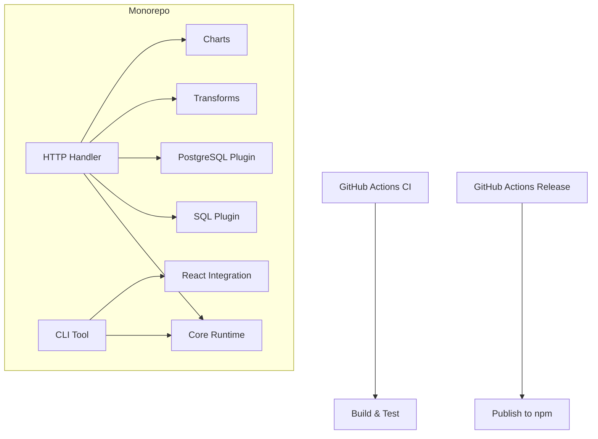
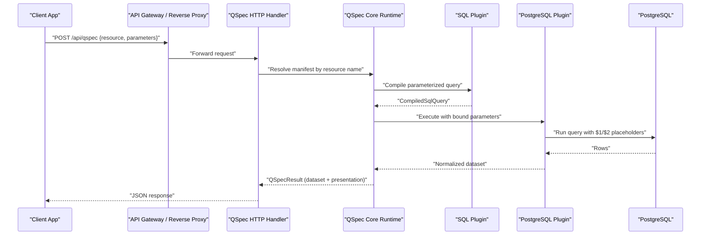
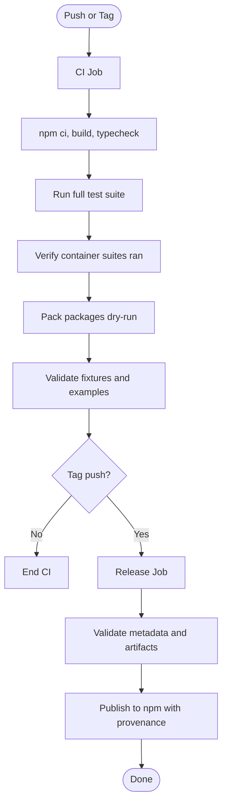
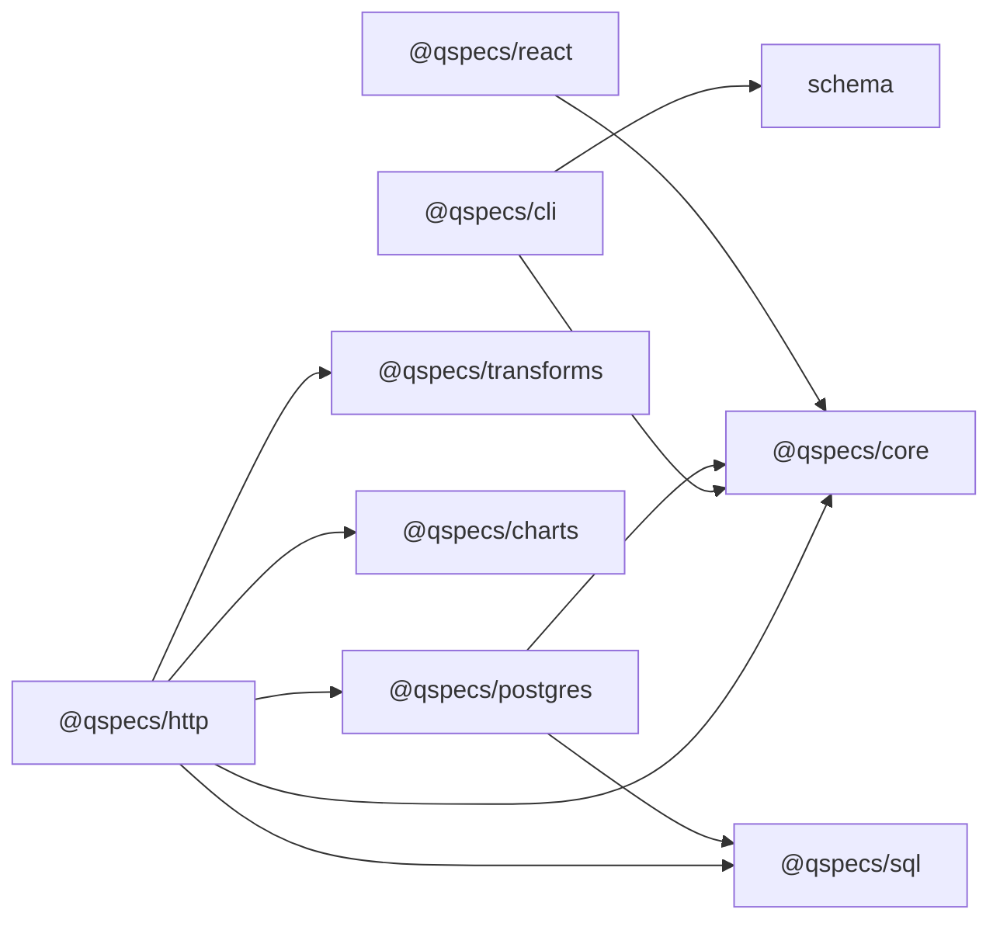

# Deployment Strategies

<cite>
**Referenced Files in This Document**
- [README.md](file://README.md)
- [package.json](file://package.json)
- [.github/workflows/ci.yml](file://.github/workflows/ci.yml)
- [.github/workflows/release.yml](file://.github/workflows/release.yml)
- [RELEASING.md](file://RELEASING.md)
- [packages/cli/package.json](file://packages/cli/package.json)
- [packages/http/package.json](file://packages/http/package.json)
- [packages/postgres/package.json](file://packages/postgres/package.json)
- [packages/core/package.json](file://packages/core/package.json)
- [examples/qspec.config.js](file://examples/qspec.config.js)
- [test/react-pipeline.test.tsx](file://test/react-pipeline.test.tsx)
</cite>

## Table of Contents

1. Introduction
2. Project Structure
3. Core Components
4. Architecture Overview
5. Detailed Component Analysis
6. Dependency Analysis
7. Performance Considerations
8. Troubleshooting Guide
9. Conclusion
10. Appendices

## Introduction

This document provides a comprehensive deployment strategy for QSpec applications across containerized environments, Kubernetes orchestration, and major cloud platforms (AWS, Azure, GCP). It covers CI/CD pipeline configuration, automated testing strategies, release management, monitoring and logging, performance profiling, scaling considerations, and safe rollout patterns such as blue-green deployments, rolling updates, and rollback procedures. It also includes infrastructure-as-code guidance and deployment templates aligned with the repository’s build and release workflows.

QSpec is a monorepo that publishes multiple packages under the @qspecs scope. The runtime is Node.js-based, uses TypeScript, and exposes an HTTP handler to serve QSpec execution over HTTP. Data access is provided via plugins such as PostgreSQL, while transforms and charts are pluggable. The repository ships GitHub Actions workflows for continuous integration and releases, along with scripts to validate manifests and publish packages consistently.

## Project Structure

The repository is organized as a Node.js monorepo using npm workspaces. Each capability is a separate package:

- Core runtime and manifest model
- SQL query compilation
- PostgreSQL data source with connection pooling
- HTTP handler for serving QSpec execution
- CLI tooling for validation and inspection
- React and chart integrations for browser rendering
- Shared schema and transforms

Build and test tooling:

- TypeScript build via tsc
- Vitest for unit and integration tests
- Testcontainers for spinning up PostgreSQL during tests
- Prettier for formatting

CI/CD:

- Continuous integration on push to main and pull requests
- Release workflow triggered by tags, with provenance publishing to npm

**Diagram sources**

- [package.json:13-27](file://package.json#L13-L27)
- [packages/core/package.json:1-37](file://packages/core/package.json#L1-L37)
- [packages/sql/package.json:1-40](file://packages/sql/package.json#L1-L40)
- [packages/postgres/package.json:1-52](file://packages/postgres/package.json#L1-L52)
- [packages/http/package.json:1-44](file://packages/http/package.json#L1-L44)
- [packages/cli/package.json:1-49](file://packages/cli/package.json#L1-L49)
- [packages/charts/package.json:1-40](file://packages/charts/package.json#L1-L40)
- [packages/react/package.json:1-40](file://packages/react/package.json#L1-L40)

**Section sources**

- [package.json:1-45](file://package.json#L1-L45)
- [README.md:14-33](file://README.md#L14-L33)

## Core Components

- Core runtime: Zero-runtime-dependency engine for manifest parsing, parameter validation, plugin registration, and execution pipeline.
- SQL plugin: Compiles parameterized SQL into bound queries; ensures values never reach the database as raw text.
- PostgreSQL plugin: Provides pooled connections, execution, cancellation, and result normalization.
- HTTP handler: Exposes a server-side endpoint to execute QSpec manifests behind your own authentication and authorization.
- CLI: Validates manifests structurally or plugin-awarely without executing queries against real databases.
- Transforms and Charts: Declarative transformations and presentation models for datasets.
- React integration: Suspense-first client binding to consume QSpec results over HTTP.

Deployment implications:

- Serverless or containerized Node.js processes can host the HTTP handler.
- PostgreSQL connections must be configured at runtime via environment variables or secrets managers.
- Validation and linting should run in CI before any deployment artifact is produced.

**Section sources**

- [README.md:10-13](file://README.md#L10-L13)
- [README.md:43-105](file://README.md#L43-L105)
- [README.md:107-180](file://README.md#L107-L180)
- [packages/http/package.json:1-44](file://packages/http/package.json#L1-L44)
- [packages/postgres/package.json:1-52](file://packages/postgres/package.json#L1-L52)
- [packages/cli/package.json:1-49](file://packages/cli/package.json#L1-L49)

## Architecture Overview

A typical production deployment hosts the QSpec HTTP handler behind an API gateway or reverse proxy. Clients send resource names and parameters; the server resolves manifests, executes queries through registered data sources, applies transforms, and returns datasets suitable for presentation.

**Diagram sources**

- [README.md:115-135](file://README.md#L115-L135)
- [README.md:43-105](file://README.md#L43-L105)
- [packages/http/package.json:1-44](file://packages/http/package.json#L1-L44)
- [packages/postgres/package.json:1-52](file://packages/postgres/package.json#L1-L52)

## Detailed Component Analysis

### Containerization Strategy

- Base image: Use a minimal Node.js LTS image matching the engines constraint.
- Build stage: Install dependencies, copy source, run format checks, build TypeScript, and pack artifacts.
- Runtime stage: Copy only dist outputs and required schemas; set environment variables for DATABASE_URL and other secrets.
- Health checks: Expose a lightweight health endpoint or reuse the HTTP handler’s root if appropriate.
- Secrets: Mount secrets via environment variables or secret managers; never bake credentials into images.

Recommended steps:

- Multi-stage Dockerfile with Node 22+ based on the engines field.
- Cache npm installs between stages.
- Run validation and type checks in CI before building images.
- Tag images with commit SHA and semantic version from tags.

[No sources needed since this section provides general guidance]

### Kubernetes Orchestration

- Deployment: Define a Deployment with replicas, resource limits, and readiness/liveness probes.
- Service: Expose the HTTP handler via a ClusterIP Service and Ingress or LoadBalancer.
- ConfigMap/Secret: Store non-sensitive configuration in ConfigMaps and sensitive values in Secrets.
- Horizontal Pod Autoscaler: Scale based on CPU/memory or custom metrics like requests per second.
- Database connectivity: Ensure pods can reach the managed PostgreSQL instance via VPC peering or private endpoints.

Rollout strategies:

- Rolling updates: Configure maxUnavailable and maxSurge for zero-downtime updates.
- Blue-green: Maintain two identical Deployments and switch traffic via Ingress or Service selector changes.
- Canary: Route a small percentage of traffic to a new version and monitor before full rollout.

[No sources needed since this section provides general guidance]

### Cloud Platform Deployments

- AWS:
  - ECS/Fargate: Containerize and deploy behind ALB; use Secrets Manager for credentials.
  - Lambda: If stateless, consider function-based hosting with API Gateway; ensure cold start and memory limits are tuned.
  - RDS PostgreSQL: Use IAM auth or Secrets Manager; configure security groups and VPC settings.
- Azure:
  - Container Apps or AKS: Deploy containers with managed identity for secrets and database access.
  - Azure Database for PostgreSQL: Private link and firewall rules; configure TLS and connection pooling.
- GCP:
  - Cloud Run: Stateless containerized service behind Cloud Endpoints or API Gateway.
  - Cloud SQL: Managed PostgreSQL with private IP; use Secret Manager for credentials.

[No sources needed since this section provides general guidance]

### CI/CD Pipeline Configuration

Continuous integration:

- Matrix builds across supported Node versions.
- Format checks, TypeScript build, and type checking for tests.
- Full test suite execution including PostgreSQL integration and end-to-end browser loop.
- Verification that container-backed suites actually ran to avoid silent skips.
- Package packing verification and CLI validation of fixtures and examples.

Release pipeline:

- Triggered by tags; validates semver and metadata.
- Builds, runs tests, verifies built artifacts, and publishes to npm with provenance.
- Dry-run mode for rehearsal without publishing.

**Diagram sources**

- [.github/workflows/ci.yml:1-164](file://.github/workflows/ci.yml#L1-L164)
- [.github/workflows/release.yml:1-155](file://.github/workflows/release.yml#L1-L155)
- [RELEASING.md:24-89](file://RELEASING.md#L24-L89)

**Section sources**

- [.github/workflows/ci.yml:1-164](file://.github/workflows/ci.yml#L1-L164)
- [.github/workflows/release.yml:1-155](file://.github/workflows/release.yml#L1-L155)
- [RELEASING.md:1-100](file://RELEASING.md#L1-L100)

### Automated Testing Strategies

- Unit tests: Per-package coverage for transforms, charts, and core logic.
- Integration tests: PostgreSQL-backed tests using Testcontainers to spin up a real database.
- End-to-end tests: Browser loop exercising HTTP boundary, React suspension, and Recharts rendering.
- Fixture validation: CLI validates all example manifests with plugin-aware mode to catch drift.

Key safeguards:

- Explicit checks ensure integration suites did not skip due to missing container runtime.
- JSON reporter analysis asserts passing counts, no failures, and no pending tests per critical file.

**Section sources**

- [.github/workflows/ci.yml:25-163](file://.github/workflows/ci.yml#L25-L163)
- [examples/qspec.config.js:1-19](file://examples/qspec.config.js#L1-L19)
- [test/react-pipeline.test.tsx:565-597](file://test/react-pipeline.test.tsx#L565-L597)

### Release Management Processes

- Lockstep releases: All packages share a single version; inter-package dependencies pin exact versions.
- Pre-publish checks: Metadata validation, dependency graph ordering, tarball content verification.
- Provenance: Signed attestations linking tarballs to commits and workflow runs.
- Idempotent publishing: Skips already published versions to allow retries.

Operational notes:

- Use automation tokens without 2FA for CI publishing.
- Optional required approvals via GitHub Environments.
- Manual workflow dispatch for rehearsals without spending versions.

**Section sources**

- [RELEASING.md:1-100](file://RELEASING.md#L1-L100)
- [.github/workflows/release.yml:1-155](file://.github/workflows/release.yml#L1-L155)

### Monitoring and Logging Setup

- Application logs: Emit structured logs (e.g., JSON) with correlation IDs for each request.
- Metrics: Track request latency, error rates, and database query durations; expose Prometheus metrics if applicable.
- Tracing: Propagate trace context across HTTP boundaries; instrument SQL execution paths.
- Health endpoints: Implement liveness/readiness probes returning service status and database connectivity.
- Alerting: Configure alerts for error rate spikes, high latency, and database connection pool exhaustion.

[No sources needed since this section provides general guidance]

### Performance Profiling Techniques

- CPU profiling: Use Node.js profiler or sampling profilers to identify hotspots in transform chains and query compilation.
- Memory profiling: Inspect heap snapshots to detect leaks in long-running services.
- Database profiling: Monitor query plans, slow queries, and connection pool utilization.
- Network profiling: Measure HTTP payload sizes and latency; optimize dataset size and transforms.

[No sources needed since this section provides general guidance]

### Scaling Considerations

Horizontal scaling patterns:

- Stateless HTTP handlers scale horizontally behind load balancers.
- Use connection pooling for PostgreSQL to manage concurrent queries efficiently.
- Cache frequently accessed datasets or presentation-ready series where appropriate.

Database connection pooling:

- Tune pool size based on expected concurrency and database capacity.
- Monitor pool wait times and connection timeouts; adjust accordingly.

Caching strategies:

- In-process cache for short-lived datasets with TTL.
- Distributed cache (e.g., Redis) for cross-instance sharing.
- Cache invalidation tied to parameter changes or data refresh events.

[No sources needed since this section provides general guidance]

### Safe Rollout Procedures

Blue-green deployments:

- Maintain two identical environments; switch traffic atomically when the new version is healthy.
- Use feature flags to toggle behavior without redeploying.

Rolling updates:

- Gradually replace instances with updated versions; configure maxUnavailable and maxSurge.
- Monitor error rates and latency during rollout; auto-rollback on thresholds.

Rollback procedures:

- Keep previous image tags available; revert traffic or redeploy prior version quickly.
- Preserve database compatibility; avoid breaking schema changes without migration strategies.

[No sources needed since this section provides general guidance]

### Infrastructure as Code Examples and Templates

- Terraform modules: Provision ECS/AKS/GKE clusters, services, and managed PostgreSQL instances.
- Helm charts: Package Kubernetes Deployments, Services, ConfigMaps, and Secrets for QSpec services.
- Cloud-specific templates: Use AWS CDK, Azure Bicep, or GCP Deployment Manager for IaC.
- Environment configuration: Centralize environment variables and secrets via platform-native secret stores.

[No sources needed since this section provides general guidance]

## Dependency Analysis

QSpec’s package architecture enforces clear boundaries:

- Core runtime has no runtime dependencies.
- HTTP handler depends on core and peers with it.
- PostgreSQL plugin depends on pg and integrates with core and sql.
- CLI depends on core and schema for validation.
- Tests rely on testcontainers and vitest for integration and end-to-end scenarios.

**Diagram sources**

- [packages/core/package.json:1-37](file://packages/core/package.json#L1-L37)
- [packages/http/package.json:1-44](file://packages/http/package.json#L1-L44)
- [packages/postgres/package.json:1-52](file://packages/postgres/package.json#L1-L52)
- [packages/cli/package.json:1-49](file://packages/cli/package.json#L1-L49)

**Section sources**

- [packages/core/package.json:1-37](file://packages/core/package.json#L1-L37)
- [packages/http/package.json:1-44](file://packages/http/package.json#L1-L44)
- [packages/postgres/package.json:1-52](file://packages/postgres/package.json#L1-L52)
- [packages/cli/package.json:1-49](file://packages/cli/package.json#L1-L49)

## Performance Considerations

- Minimize payload sizes by applying transforms server-side and limiting dataset fields.
- Use prepared statements and bound parameters to reduce query overhead and prevent injection.
- Tune PostgreSQL pool settings and query timeouts to match workload characteristics.
- Profile transform chains to avoid unnecessary computations; cache intermediate results when beneficial.
- Monitor HTTP handler throughput and latency; scale horizontally as demand increases.

[No sources needed since this section provides general guidance]

## Troubleshooting Guide

Common issues and resolutions:

- Missing container runtime: Integration tests skip silently; CI explicitly checks for skipped suites and fails the job.
- Database connectivity errors: Validate connection strings, network policies, and firewall rules; ensure secrets are correctly mounted.
- Manifest validation failures: Use CLI with plugin-aware mode to catch unknown operators, typos, and schema drift early.
- Security leaks: Ensure credentials, SQL statements, and internal identifiers do not appear in responses or rendered DOM.

Verification practices:

- Confirm that PostgreSQL integration and end-to-end suites executed and passed.
- Validate every fixture and example manifest with the CLI before deployment.
- Use structured logs and metrics to pinpoint failures in request flows.

**Section sources**

- [.github/workflows/ci.yml:38-163](file://.github/workflows/ci.yml#L38-L163)
- [test/react-pipeline.test.tsx:565-597](file://test/react-pipeline.test.tsx#L565-L597)

## Conclusion

QSpec’s modular architecture and robust CI/CD pipelines enable reliable deployments across containers, Kubernetes, and major cloud platforms. By following the recommended strategies—containerizing stateless handlers, orchestrating with Kubernetes, configuring secure database access, enforcing strict validation in CI, and adopting safe rollout patterns—you can deliver QSpec-powered analytics features with confidence. Integrate monitoring, logging, and performance profiling to maintain production reliability, and leverage infrastructure as code to automate provisioning and scaling.

[No sources needed since this section summarizes without analyzing specific files]

## Appendices

### Quick Reference: Build and Test Commands

- Install dependencies and build: npm ci, npm run build
- Type check tests: npm run typecheck:tests
- Run tests: npm test
- Validate manifests: qspec validate with optional --config for plugin-aware checks

**Section sources**

- [package.json:16-27](file://package.json#L16-L27)
- [README.md:260-325](file://README.md#L260-L325)

### Quick Reference: Release Workflow

- Tag a release: git tag vX.Y.Z and push
- CI triggers release job: validates metadata, builds, tests, and publishes to npm with provenance
- Dry-run rehearsal: workflow_dispatch without publishing

**Section sources**

- [RELEASING.md:24-89](file://RELEASING.md#L24-L89)
- [.github/workflows/release.yml:1-155](file://.github/workflows/release.yml#L1-L155)
