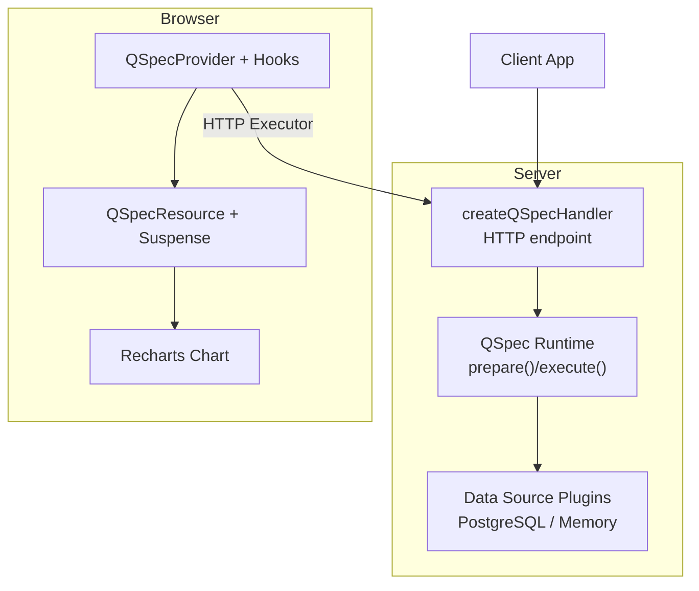
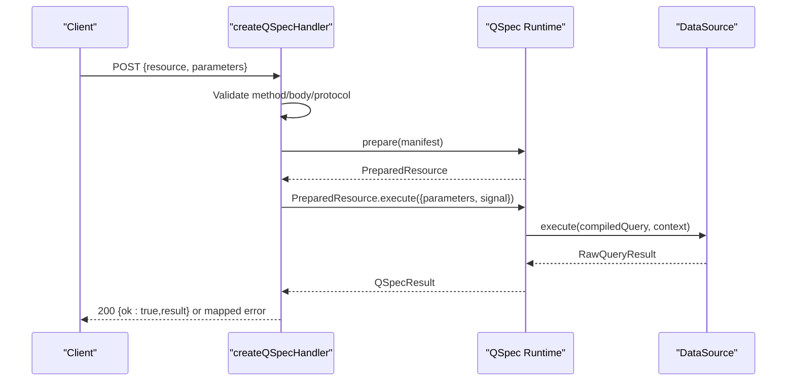
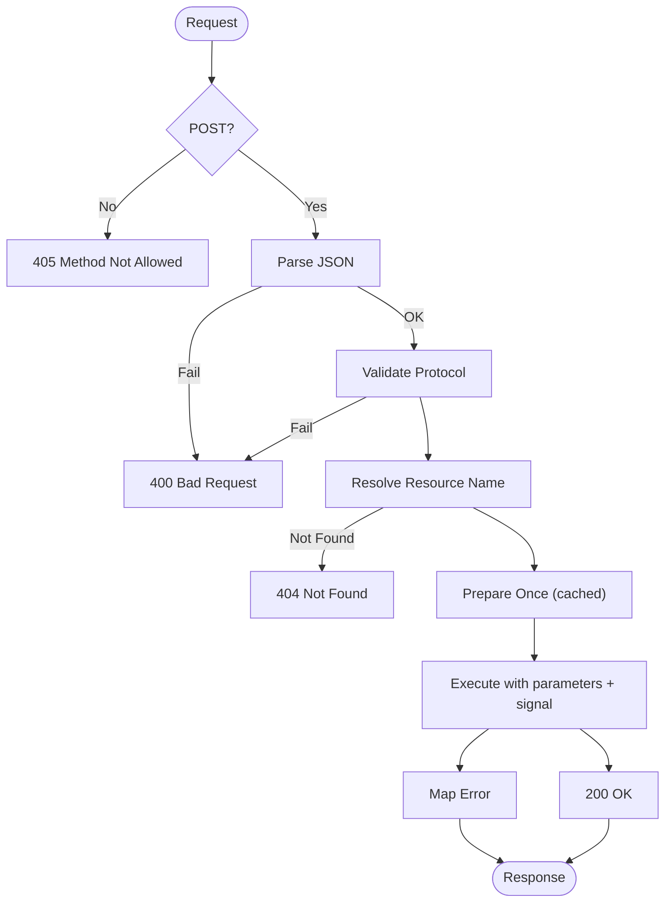
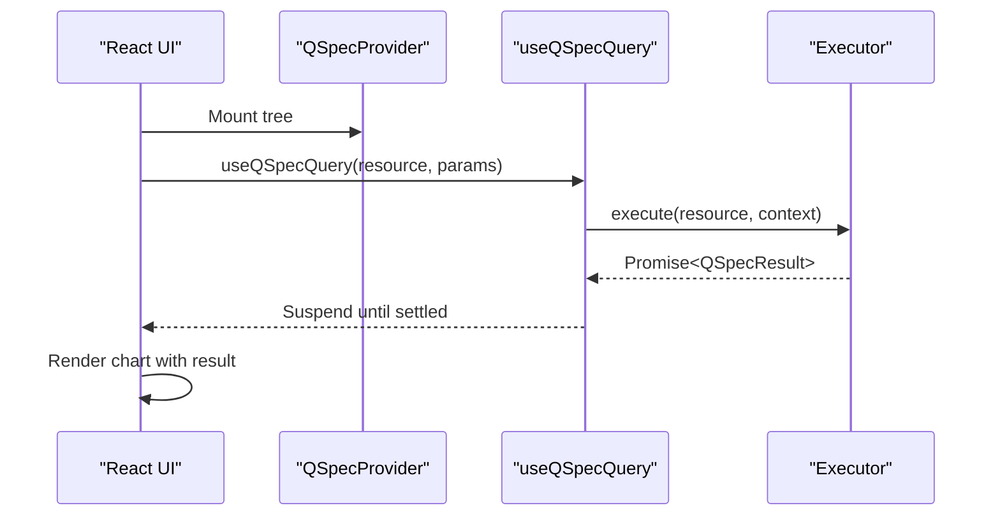
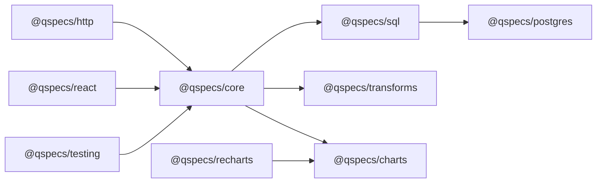

# Integration Guides

<cite>
**Referenced Files in This Document**
- [README.md](file://README.md)
- [package.json](file://package.json)
- [docs/introduction.md](file://docs/introduction.md)
- [docs/architecture.md](file://docs/architecture.md)
- [docs/security.md](file://docs/security.md)
- [docs/react-integration.md](file://docs/react-integration.md)
- [docs/data-sources.md](file://docs/data-sources.md)
- [docs/parameters.md](file://docs/parameters.md)
- [packages/http/src/internal/handler.ts](file://packages/http/src/internal/handler.ts)
- [packages/react/src/internal/provider.tsx](file://packages/react/src/internal/provider.tsx)
- [packages/testing/src/memory.ts](file://packages/testing/src/memory.ts)
- [packages/testing/src/index.ts](file://packages/testing/src/index.ts)
- [examples/qspec.config.js](file://examples/qspec.config.js)
- [examples/03-parameterized-query.qspec.json](file://examples/03-parameterized-query.qspec.json)
- [test/react-pipeline.test.tsx](file://test/react-pipeline.test.tsx)
</cite>

## Table of Contents

1. Introduction
2. Project Structure
3. Core Components
4. Architecture Overview
5. Detailed Component Analysis
6. Dependency Analysis
7. Performance Considerations
8. Troubleshooting Guide
9. Conclusion
10. Appendices

## Introduction

This guide provides production-ready integration instructions for QSpec across server, browser, and deployment environments. It covers HTTP handler configuration, authentication and authorization patterns, connection pooling, error handling, React integration with Suspense and error boundaries, security considerations (parameter binding safety and credential management), performance optimization, testing strategies using provided utilities, monitoring/logging/debugging, and complete examples for popular frameworks and platforms.

QSpec is a declarative specification and runtime for parameterized queries, validation, transformation, and presentation. The core has zero runtime dependencies; domain-specific capabilities are implemented as plugins. The recommended production path mounts the HTTP handler behind your own auth and exposes only resource names to clients, while credentials and queries remain server-side.

**Section sources**

- [README.md:1-42](file://README.md#L1-L42)
- [docs/introduction.md:1-31](file://docs/introduction.md#L1-L31)

## Project Structure

At a high level, the repository is organized into packages that implement the pipeline stages and integrations:

- Server runtime and handlers: @qspecs/core, @qspecs/sql, @qspecs/postgres, @qspecs/http
- Browser UI: @qspecs/react, @qspecs/recharts
- Data transformations and charts: @qspecs/transforms, @qspecs/charts
- Testing utilities: @qspecs/testing
- Documentation and examples: docs/, examples/

**Diagram sources**

- [packages/http/src/internal/handler.ts:131-239](file://packages/http/src/internal/handler.ts#L131-L239)
- [packages/react/src/internal/provider.tsx:103-149](file://packages/react/src/internal/provider.tsx#L103-L149)
- [docs/architecture.md:9-83](file://docs/architecture.md#L9-L83)

**Section sources**

- [README.md:14-32](file://README.md#L14-L32)
- [docs/architecture.md:9-83](file://docs/architecture.md#L9-L83)

## Core Components

- HTTP handler: createQSpecHandler builds a strict POST-only endpoint that validates requests, resolves a resource name against a host-provided registry, prepares manifests once per resource, executes with request cancellation support, and maps errors to safe responses.
- React integration: QSpecProvider owns a query cache keyed by resource and parameters; useQSpecQuery suspends on in-flight promises and returns resolved results directly; useQSpecInvalidate clears cache entries and triggers re-renders; QSpecResource is a thin wrapper requiring explicit Suspense and error boundaries.
- Data sources: DataSource implementations execute compiled queries, propagate AbortSignal cancellation, and return positional results normalized by core.
- Testing utilities: memory plugin provides an in-memory data source and pass-through language for full pipeline tests without a database; contract test runners validate adapters against shared invariants.

**Section sources**

- [packages/http/src/internal/handler.ts:13-33](file://packages/http/src/internal/handler.ts#L13-L33)
- [packages/http/src/internal/handler.ts:131-239](file://packages/http/src/internal/handler.ts#L131-L239)
- [packages/react/src/internal/provider.tsx:103-149](file://packages/react/src/internal/provider.tsx#L103-L149)
- [docs/react-integration.md:55-104](file://docs/react-integration.md#L55-L104)
- [docs/data-sources.md:11-44](file://docs/data-sources.md#L11-L44)
- [packages/testing/src/memory.ts:61-161](file://packages/testing/src/memory.ts#L61-L161)
- [packages/testing/src/index.ts:1-17](file://packages/testing/src/index.ts#L1-L17)

## Architecture Overview

The runtime pipeline separates static preparation from dynamic execution:

- prepare(): parse manifest, structural and capability validation, compile parameters, fold transform describe to project schema, validate presentation references.
- execute(): validate runtime parameters, compile and run query via data source, normalize result, validate dataset, run transforms, build presentation model, return QSpecResult.

**Diagram sources**

- [packages/http/src/internal/handler.ts:131-239](file://packages/http/src/internal/handler.ts#L131-L239)
- [docs/architecture.md:65-83](file://docs/architecture.md#L65-L83)

**Section sources**

- [docs/architecture.md:9-83](file://docs/architecture.md#L9-L83)

## Detailed Component Analysis

### Server-Side HTTP Handler

- Enforces POST-only and rejects other methods with 405.
- Parses JSON body and validates wire protocol before touching registries or runtime.
- Resolves resource names safely using Object.hasOwn to prevent prototype pollution and enumeration.
- Caches prepared resources (including failures) to avoid repeated expensive validation.
- Executes with request.signal for cancellation propagation.
- Maps errors to safe responses: validation errors become 400, aborts become 499, others become generic 500 without leaking driver messages.

**Diagram sources**

- [packages/http/src/internal/handler.ts:131-239](file://packages/http/src/internal/handler.ts#L131-L239)

**Section sources**

- [packages/http/src/internal/handler.ts:13-33](file://packages/http/src/internal/handler.ts#L13-L33)
- [packages/http/src/internal/handler.ts:131-239](file://packages/http/src/internal/handler.ts#L131-L239)

### Authentication and Authorization

- The handler is intentionally unauthenticated; mount it behind your framework’s auth middleware or API gateway.
- Use route-level guards, JWT/session checks, IP allowlists, or WAF rules before reaching createQSpecHandler.
- Keep credentials out of manifests; supply them to data source plugins at runtime.

**Section sources**

- [docs/security.md:9-15](file://docs/security.md#L9-L15)
- [docs/security.md:182-198](file://docs/security.md#L182-L198)
- [README.md:34-41](file://README.md#L34-L41)

### Connection Pooling and Cancellation

- PostgreSQL adapter uses pooling and cancellation via pg_cancel_backend on a separate client to stop statements without destroying sessions.
- Always pass request.signal through to enable cancellation when clients disconnect or abort.
- For other backends, ensure execute checks signal early and propagates cancellation promptly.

**Section sources**

- [docs/architecture.md:346-375](file://docs/architecture.md#L346-L375)
- [docs/data-sources.md:131-163](file://docs/data-sources.md#L131-L163)
- [packages/http/src/internal/handler.ts:220-230](file://packages/http/src/internal/handler.ts#L220-L230)

### Error Handling Strategies

- Validation errors (manifest or parameters) map to 400 with structured issues.
- Abort signals map to 499 with a safe message.
- Internal/runtime errors map to 500 with a fixed message; never forward raw driver messages.
- On the client, wrap QSpecResource trees in Suspense and error boundaries to handle loading and errors gracefully.

**Section sources**

- [packages/http/src/internal/handler.ts:74-109](file://packages/http/src/internal/handler.ts#L74-L109)
- [docs/react-integration.md:105-129](file://docs/react-integration.md#L105-L129)

### Browser Integration with React

- Provide QSpecProvider with an executor (HTTP or local).
- Use QSpecResource inside Suspense and error boundaries; do not rely on loading/error props returned by hooks.
- Cache keys are content-based serializations of (resource, parameters); changes trigger refetches.
- Invalidate caches imperatively via useQSpecInvalidate to force re-execution.

**Diagram sources**

- [packages/react/src/internal/provider.tsx:103-149](file://packages/react/src/internal/provider.tsx#L103-L149)
- [docs/react-integration.md:73-104](file://docs/react-integration.md#L73-L104)

**Section sources**

- [docs/react-integration.md:55-104](file://docs/react-integration.md#L55-L104)
- [docs/react-integration.md:105-143](file://docs/react-integration.md#L105-L143)

### Parameter Binding Safety

- Bindings must reference declared parameters; bare strings are rejected to prevent accidental literal injection.
- SQL compilation produces segments and values; adapters render placeholders and bind values—never interpolate.
- Wire protocol carries only resource name and parameters; no query text crosses the boundary.

**Section sources**

- [docs/security.md:34-62](file://docs/security.md#L34-L62)
- [docs/security.md:148-180](file://docs/security.md#L148-L180)
- [docs/parameters.md:50-74](file://docs/parameters.md#L50-L74)

### Credential Management

- Never embed credentials in manifests; pass connection details to data source plugins at runtime.
- Avoid logging sensitive values; adapters attach driver errors as causes rather than copying messages.

**Section sources**

- [docs/security.md:17-33](file://docs/security.md#L17-L33)
- [docs/security.md:124-147](file://docs/security.md#L124-L147)

### Performance Optimization Techniques

- Cache prepared resources per handler instance to avoid repeated validation.
- Use Suspense and promise caching in React to deduplicate concurrent requests and avoid redundant renders.
- Apply limits (maxRows, queryTimeoutMs, maxTransforms, maxManifestBytes, maxExpressionDepth) at runtime creation.
- Prefer server-side filtering and transforms where appropriate; keep payloads minimal.

**Section sources**

- [packages/http/src/internal/handler.ts:136-167](file://packages/http/src/internal/handler.ts#L136-L167)
- [docs/react-integration.md:131-143](file://docs/react-integration.md#L131-L143)
- [docs/architecture.md:107-122](file://docs/architecture.md#L107-L122)

### Deployment Strategies

- Node.js/Express/Fastify/NestJS: mount createQSpecHandler behind auth middleware and rate limiting.
- Edge/Cloudflare Workers/Vercel: expose a handler function that accepts Request/Response; ensure environment variables for credentials are available.
- Containers: inject DATABASE_URL and secrets via secure secret managers; never bake into images.
- Reverse proxy: enforce HTTPS, CORS, and request size limits before reaching the handler.

[No sources needed since this section provides general guidance]

### Security Considerations

- No eval/new Function; expression evaluation uses a fixed AST interpreter.
- Prototype pollution resistance via Object.hasOwn lookups and unsafe key checks.
- Resource limits enforced in core; configure conservative defaults in production.
- No credential logging; sanitize error messages at the HTTP boundary.

**Section sources**

- [docs/security.md:64-75](file://docs/security.md#L64-L75)
- [docs/security.md:76-109](file://docs/security.md#L76-L109)
- [docs/security.md:110-123](file://docs/security.md#L110-L123)

### Testing Approaches

- Use memory plugin to exercise full pipelines without a database; assert columns, rows, and behavior under abort.
- Run contract tests for custom data sources to ensure compliance with cancellation, immutability, and idempotency guarantees.
- End-to-end tests demonstrate the full loop: server runtime, HTTP boundary, React Suspense, and Recharts rendering.

**Section sources**

- [packages/testing/src/memory.ts:61-161](file://packages/testing/src/memory.ts#L61-L161)
- [docs/data-sources.md:68-105](file://docs/data-sources.md#L68-L105)
- [test/react-pipeline.test.tsx:23-57](file://test/react-pipeline.test.tsx#L23-L57)
- [test/react-pipeline.test.tsx:541-597](file://test/react-pipeline.test.tsx#L541-L597)

### Monitoring, Logging, and Debugging

- Log execution IDs from DataSourceContext for correlation across logs and metrics.
- Capture request/response metadata (status codes, error codes) at the HTTP layer; avoid logging sensitive fields.
- Use provider warnings in development to detect executor prop identity changes; fix by providing stable executors or changing provider key.
- In production, instrument timeouts and abort rates to detect slow queries and client disconnects.

**Section sources**

- [docs/data-sources.md:26-44](file://docs/data-sources.md#L26-L44)
- [packages/react/src/internal/provider.tsx:115-136](file://packages/react/src/internal/provider.tsx#L115-L136)
- [packages/http/src/internal/handler.ts:74-109](file://packages/http/src/internal/handler.ts#L74-L109)

## Dependency Analysis

Core remains dependency-free; optional plugins add capabilities. Browser-safe packages must not import database drivers.

**Diagram sources**

- [README.md:242-257](file://README.md#L242-L257)
- [docs/architecture.md:158-202](file://docs/architecture.md#L158-L202)

**Section sources**

- [README.md:242-257](file://README.md#L242-L257)
- [docs/architecture.md:158-202](file://docs/architecture.md#L158-L202)

## Performance Considerations

- Cache prepared resources per handler to amortize validation cost.
- Use Suspense and promise caching to deduplicate queries and avoid infinite suspend loops.
- Configure limits to bound resource usage; tune queryTimeoutMs based on SLAs.
- Minimize payload sizes with transforms and selective series; avoid unnecessary large datasets.
- Ensure connection pools are sized appropriately for concurrency and latency targets.

[No sources needed since this section provides general guidance]

## Troubleshooting Guide

- 405 Method Not Allowed: Ensure endpoint receives POST requests.
- 400 Bad Request: Check JSON body shape and wire protocol; inspect issues attached to validation errors.
- 404 Not Found: Verify resource name exists in the manifests registry; avoid enumerating registry publicly.
- 499 Aborted: Client disconnected or aborted; consider retry logic and user feedback.
- 500 Internal Error: Review server logs; do not rely on error.message for diagnostics; check cause chains.
- React Suspense hangs: Wrap QSpecResource in Suspense and error boundaries; ensure stable executor identity in provider.

**Section sources**

- [packages/http/src/internal/handler.ts:169-239](file://packages/http/src/internal/handler.ts#L169-L239)
- [docs/react-integration.md:105-143](file://docs/react-integration.md#L105-L143)

## Conclusion

For production deployments, mount createQSpecHandler behind robust authentication and authorization, configure data sources securely with pooled connections and cancellation, enforce resource limits, and structure React UIs with Suspense and error boundaries. Use the testing utilities to validate behavior and contracts, and instrument monitoring to track performance and errors. Keep credentials and queries server-side; expose only resource names and validated parameters to clients.

[No sources needed since this section summarizes without analyzing specific files]

## Appendices

### Complete Example: Server Setup with Postgres and HTTP Handler

- Build a QSpec runtime with sql(), postgres(), transforms(), charts().
- Create a handler with createQSpecHandler(runtime, manifests).
- Mount behind auth and rate limiting.

**Section sources**

- [README.md:115-135](file://README.md#L115-L135)
- [packages/http/src/internal/handler.ts:131-239](file://packages/http/src/internal/handler.ts#L131-L239)

### Complete Example: Browser Integration with React and Recharts

- Create an HTTP executor pointing to the handler URL.
- Wrap UI in QSpecProvider, Suspense, and error boundaries.
- Use QSpecResource to fetch and render charts.

**Section sources**

- [README.md:137-180](file://README.md#L137-L180)
- [docs/react-integration.md:55-143](file://docs/react-integration.md#L55-L143)

### Parameterized Query Manifest Example

- Define typed parameters with required/optional flags and validation constraints.
- Bind parameters using $parameters.<name>.
- Validate with qspec validate --config to catch issues early.

**Section sources**

- [examples/03-parameterized-query.qspec.json:1-55](file://examples/03-parameterized-query.qspec.json#L1-L55)
- [docs/parameters.md:1-74](file://docs/parameters.md#L1-L74)
- [examples/qspec.config.js:1-19](file://examples/qspec.config.js#L1-L19)

### End-to-End Test Reference

- Demonstrates full flow: server runtime, HTTP boundary, React Suspense, Recharts rendering, and security assertions.

**Section sources**

- [test/react-pipeline.test.tsx:23-57](file://test/react-pipeline.test.tsx#L23-L57)
- [test/react-pipeline.test.tsx:541-597](file://test/react-pipeline.test.tsx#L541-L597)
