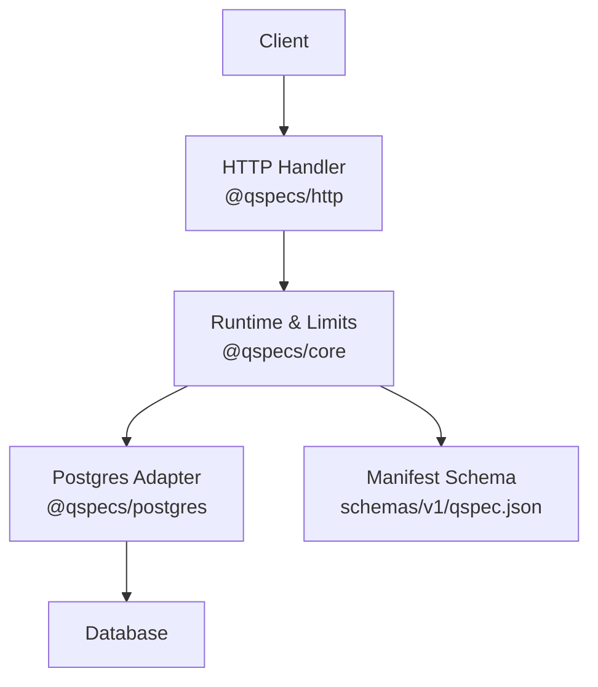
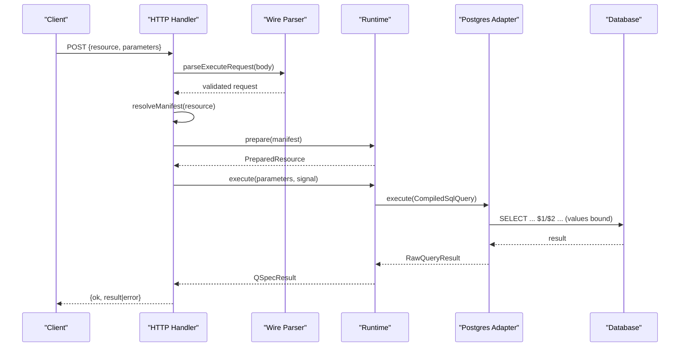
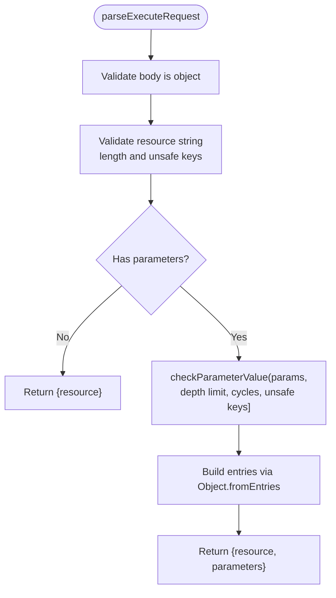
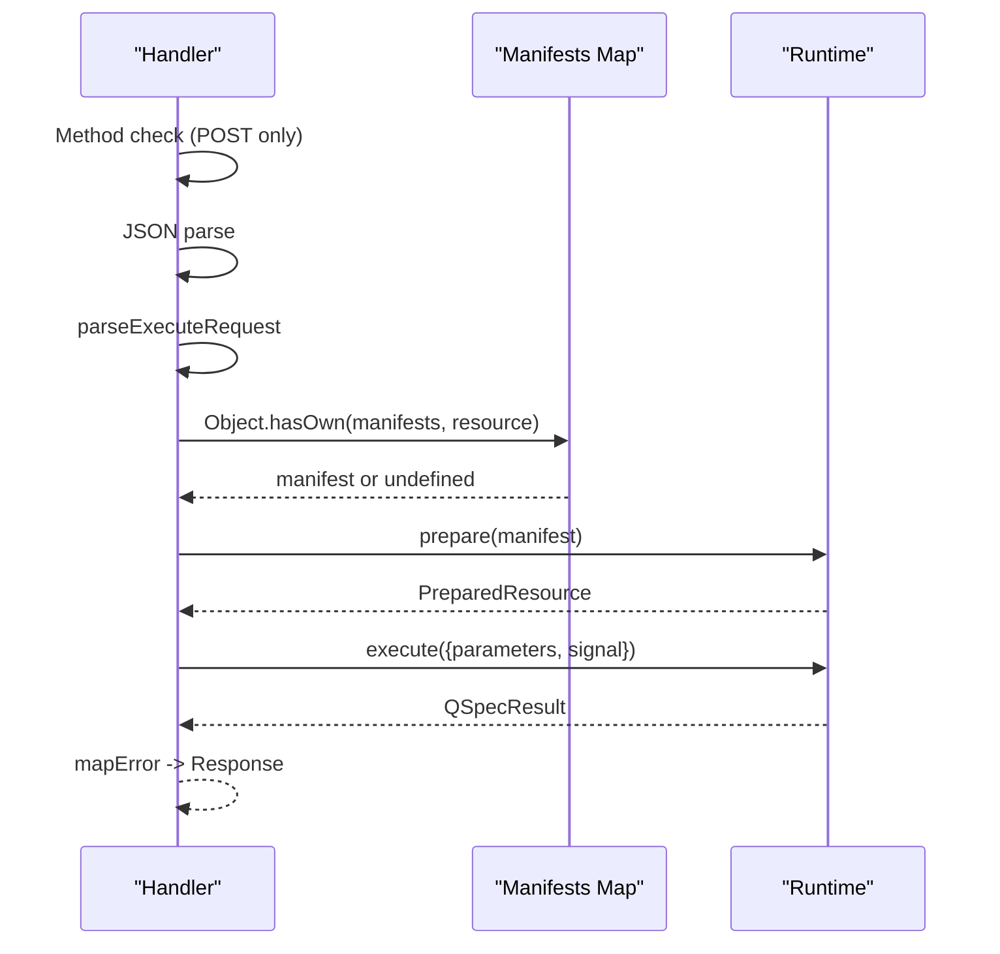
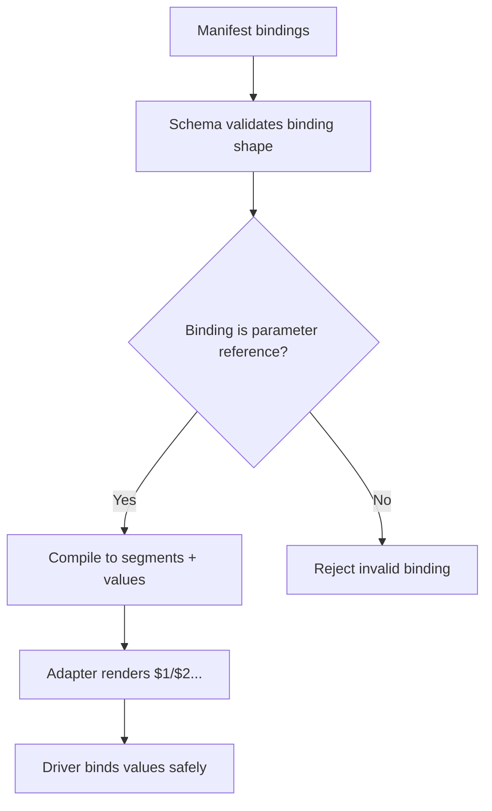
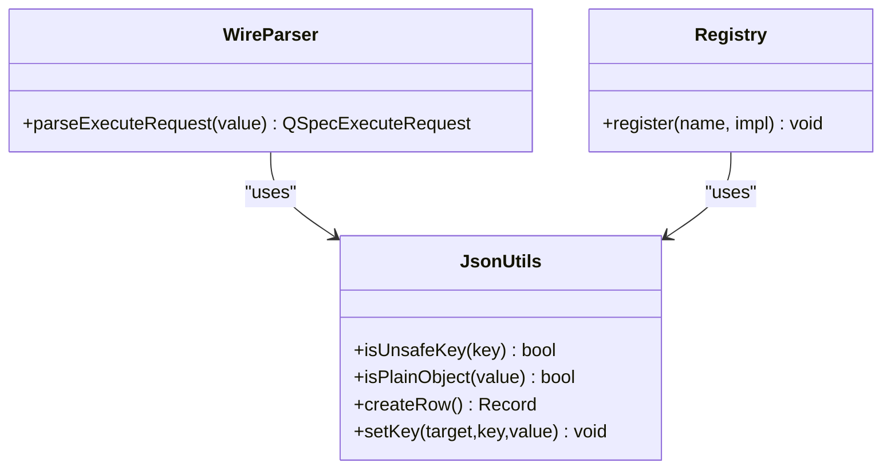
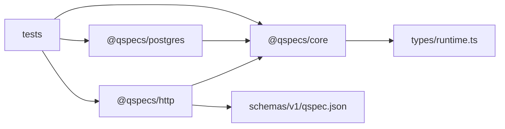

# Security Considerations

<cite>
**Referenced Files in This Document**
- [security.md](file://docs/security.md)
- [protocol.ts](file://packages/http/src/internal/protocol.ts)
- [handler.ts](file://packages/http/src/internal/handler.ts)
- [json.ts](file://packages/core/src/json.ts)
- [source.ts](file://packages/postgres/src/internal/source.ts)
- [runtime.ts](file://packages/core/src/types/runtime.ts)
- [qspec.json](file://schemas/v1/qspec.json)
- [boundaries.test.ts](file://test/boundaries.test.ts)
- [react-pipeline.test.tsx](file://test/react-pipeline.test.tsx)
</cite>

## Table of Contents

1. [Introduction](#introduction)
2. [Project Structure](#project-structure)
3. [Core Components](#core-components)
4. [Architecture Overview](#architecture-overview)
5. [Detailed Component Analysis](#detailed-component-analysis)
6. [Dependency Analysis](#dependency-analysis)
7. [Performance Considerations](#performance-considerations)
8. [Troubleshooting Guide](#troubleshooting-guide)
9. [Conclusion](#conclusion)
10. [Appendices](#appendices)

## Introduction

This document provides comprehensive security guidance for deploying QSpec-based services. It explains the security model, including why manifests never cross the HTTP boundary, how parameter binding prevents injection, and how resource names are validated. It also covers authentication and authorization patterns to protect endpoints, input validation and sanitization, credential management, rate limiting strategies, resource quotas, memory controls, and common vulnerability mitigations such as SQL injection, XSS, and CSRF. Finally, it includes production checklists and best practices.

## Project Structure

QSpec is organized into packages that separate concerns:

- Core runtime and types define limits, execution context, and shared primitives for safe JSON handling and prototype pollution resistance.
- HTTP package defines a strict wire protocol and server handler that only accept a resource name and parameters, resolving manifests on the server side.
- Postgres adapter implements secure query execution with parameterized statements, cancellation, and no credential leakage in logs or messages.
- Schema defines manifest structure and constraints, ensuring parameters and bindings are well-formed.
- Tests enforce boundaries, including no eval usage and no secrets leaking across the network boundary.

**Diagram sources**

- [handler.ts:131-239](file://packages/http/src/internal/handler.ts#L131-L239)
- [protocol.ts:20-317](file://packages/http/src/internal/protocol.ts#L20-L317)
- [runtime.ts:7-28](file://packages/core/src/types/runtime.ts#L7-L28)
- [source.ts:23-33](file://packages/postgres/src/internal/source.ts#L23-L33)
- [qspec.json:1-143](file://schemas/v1/qspec.json#L1-L143)

**Section sources**

- [security.md:1-212](file://docs/security.md#L1-L212)
- [handler.ts:131-239](file://packages/http/src/internal/handler.ts#L131-L239)
- [protocol.ts:20-317](file://packages/http/src/internal/protocol.ts#L20-L317)
- [runtime.ts:7-28](file://packages/core/src/types/runtime.ts#L7-L28)
- [source.ts:23-33](file://packages/postgres/src/internal/source.ts#L23-L33)
- [qspec.json:1-143](file://schemas/v1/qspec.json#L1-L143)

## Core Components

- Wire protocol parser enforces strict request shape: only resource name and parameters; rejects unsafe keys, cycles, excessive depth, and invalid JSON values.
- HTTP handler performs method gating (POST only), JSON parsing, wire validation, manifest resolution via allowlist, prepared resource caching, execution with cancellation support, and error mapping without leaking sensitive details.
- Core runtime exposes limits for rows, transforms, manifest size, expression depth, and query timeout; these are enforced at appropriate stages.
- Postgres adapter uses parameterized queries, avoids logging credentials, supports cancellation, and wraps driver errors safely.
- Manifest schema constrains parameters, bindings, and query definitions to prevent unsafe constructs.

**Section sources**

- [protocol.ts:20-317](file://packages/http/src/internal/protocol.ts#L20-L317)
- [handler.ts:131-239](file://packages/http/src/internal/handler.ts#L131-L239)
- [runtime.ts:7-28](file://packages/core/src/types/runtime.ts#L7-L28)
- [source.ts:23-33](file://packages/postgres/src/internal/source.ts#L23-L33)
- [qspec.json:1-143](file://schemas/v1/qspec.json#L1-L143)

## Architecture Overview

The trust boundary is explicit: clients send only a resource name and typed parameters; the server resolves the manifest from an allowlist and executes it using host-supplied credentials. No executable code or connection strings cross the boundary.

**Diagram sources**

- [handler.ts:131-239](file://packages/http/src/internal/handler.ts#L131-L239)
- [protocol.ts:272-317](file://packages/http/src/internal/protocol.ts#L272-L317)
- [source.ts:236-274](file://packages/postgres/src/internal/source.ts#L236-L274)

## Detailed Component Analysis

### HTTP Boundary and Request Validation

- The wire protocol accepts only two fields: resource and optional parameters. There is no field for queries, statements, or connection strings.
- Resource name length is bounded and must not match unsafe key names.
- Parameters are recursively validated:
  - Must be valid JSON values.
  - Depth is capped to prevent stack overflow.
  - Circular references are rejected.
  - Unsafe keys are rejected at every depth.
- Unknown top-level keys are ignored to maintain forward compatibility.

**Diagram sources**

- [protocol.ts:272-317](file://packages/http/src/internal/protocol.ts#L272-L317)

**Section sources**

- [protocol.ts:20-317](file://packages/http/src/internal/protocol.ts#L20-L317)

### Manifest Resolution and Execution Flow

- Only POST requests are accepted; other methods return method-not-allowed.
- Body is parsed as JSON; malformed bodies return bad-request.
- Resource is resolved against the host-provided manifests map using safe lookup to avoid prototype pollution.
- Prepared resources are cached per resource name; failures are also cached to avoid repeated expensive validation.
- Execution passes request signal for cancellation; results are mapped to responses without leaking sensitive messages.

**Diagram sources**

- [handler.ts:131-239](file://packages/http/src/internal/handler.ts#L131-L239)

**Section sources**

- [handler.ts:131-239](file://packages/http/src/internal/handler.ts#L131-L239)

### Parameter Binding Safety and SQL Injection Prevention

- Bindings must reference declared parameters or use literals; bare string bindings not matching parameter references are rejected by schema and validation.
- Compiled SQL separates literal segments from parameter values; adapters render placeholders and bind values through the database driver, preventing interpolation.
- Postgres adapter uses parameterized cancel statement and binds PID safely.

**Diagram sources**

- [qspec.json:83-106](file://schemas/v1/qspec.json#L83-L106)
- [source.ts:35-39](file://packages/postgres/src/internal/source.ts#L35-L39)

**Section sources**

- [qspec.json:83-106](file://schemas/v1/qspec.json#L83-L106)
- [source.ts:35-39](file://packages/postgres/src/internal/source.ts#L35-L39)

### Prototype Pollution Resistance

- Unsafe keys are explicitly blocked at multiple layers:
  - Wire parser rejects unsafe keys in resource and parameters.
  - Core utilities provide isUnsafeKey and isPlainObject for consistent checks.
  - Dataset rows use null-prototype objects to avoid collisions with Object.prototype.
  - Registries use Maps to store capability names safely.
  - All lookups by caller-supplied names use Object.hasOwn to avoid prototype chain resolution.

**Diagram sources**

- [json.ts:6-63](file://packages/core/src/json.ts#L6-L63)
- [protocol.ts:272-317](file://packages/http/src/internal/protocol.ts#L272-L317)

**Section sources**

- [json.ts:6-63](file://packages/core/src/json.ts#L6-L63)
- [protocol.ts:272-317](file://packages/http/src/internal/protocol.ts#L272-L317)

### Credential Management and Logging Discipline

- Credentials are host configuration passed to data source plugins at setup time; manifests never carry connection strings or secrets.
- Postgres adapter wraps driver errors and never copies driver messages into QSpec error messages; underlying cause is attached separately for deliberate access.
- HTTP handler maps errors to generic messages for non-validation failures, forwarding only safe codes.

**Section sources**

- [source.ts:23-33](file://packages/postgres/src/internal/source.ts#L23-L33)
- [source.ts:47-54](file://packages/postgres/src/internal/source.ts#L47-L54)
- [handler.ts:97-109](file://packages/http/src/internal/handler.ts#L97-L109)

### Resource Limits and Memory Controls

- Runtime limits include maximum rows, maximum transforms, maximum manifest bytes (for string inputs), maximum expression depth, and optional query timeout.
- Wire parser enforces parameter depth and message length caps to prevent denial-of-service via deep recursion or oversized messages.
- Tests assert no eval or Function constructor usage across published source to prevent arbitrary code execution.

**Section sources**

- [runtime.ts:7-28](file://packages/core/src/types/runtime.ts#L7-L28)
- [protocol.ts:44-68](file://packages/http/src/internal/protocol.ts#L44-L68)
- [boundaries.test.ts:174-185](file://test/boundaries.test.ts#L174-L185)

### Authentication and Authorization Patterns

- The HTTP handler has no built-in authentication or authorization; hosts must mount it behind their own auth layer.
- Use framework-level middleware to enforce identity, roles, and permissions before invoking the QSpec handler.
- Restrict which manifests are exposed via the manifests map to implement least privilege.

**Section sources**

- [handler.ts:13-27](file://packages/http/src/internal/handler.ts#L13-L27)

### Input Validation and Sanitization

- Wire parser enforces strict JSON value shapes and rejects cycles and unsafe keys.
- Error messages sanitize control characters and truncate long segments to prevent log injection and message abuse.
- Manifest schema validates parameter types, enums, arrays, and binding references.

**Section sources**

- [protocol.ts:82-129](file://packages/http/src/internal/protocol.ts#L82-L129)
- [qspec.json:35-106](file://schemas/v1/qspec.json#L35-L106)

### Protection Against Injection Attacks

- SQL injection is prevented by parameterized queries; compiled SQL separates literal segments from values, and adapters bind values through the driver.
- Arbitrary code execution is prevented by disallowing eval and Function constructors in core and official plugins.
- Prototype pollution is mitigated by rejecting unsafe keys and using safe lookup patterns.

**Section sources**

- [boundaries.test.ts:174-185](file://test/boundaries.test.ts#L174-L185)
- [source.ts:35-39](file://packages/postgres/src/internal/source.ts#L35-L39)

### XSS and CSRF Considerations

- Responses are JSON payloads; rendering occurs in client applications. Ensure downstream UI frameworks escape outputs when rendering user-controlled data.
- For state-changing operations, ensure your hosting framework enforces CSRF protections if you expose additional endpoints beyond the QSpec execute endpoint.

[No sources needed since this section provides general guidance]

### Rate Limiting Strategies and Quotas

- The HTTP handler does not include rate limiting; hosts should apply rate limiting at the gateway or framework level to prevent abuse.
- Combine rate limiting with resource limits (maxRows, maxTransforms, queryTimeoutMs) to cap computational and I/O costs.

[No sources needed since this section provides general guidance]

### Environment Variables and Secure Configuration

- Store credentials in environment variables or secret managers; pass them to data source plugin configuration at startup.
- Avoid embedding secrets in manifests or configuration files checked into version control.
- Use minimal privileges for database accounts and restrict connection scopes.

**Section sources**

- [source.ts:23-33](file://packages/postgres/src/internal/source.ts#L23-L33)

## Dependency Analysis

QSpec’s security relies on clear separation between trusted server-side components and untrusted client inputs:

- The HTTP package depends on core for JSON utilities and types.
- The Postgres adapter depends on core for error types and logging interfaces.
- Tests enforce boundaries to ensure browser-safe packages do not import database drivers and that no eval usage exists.

**Diagram sources**

- [handler.ts:1-11](file://packages/http/src/internal/handler.ts#L1-11)
- [protocol.ts:1-9](file://packages/http/src/internal/protocol.ts#L1-L9)
- [runtime.ts:1-88](file://packages/core/src/types/runtime.ts#L1-L88)
- [source.ts:1-21](file://packages/postgres/src/internal/source.ts#L1-L21)
- [boundaries.test.ts:100-185](file://test/boundaries.test.ts#L100-L185)

**Section sources**

- [handler.ts:1-11](file://packages/http/src/internal/handler.ts#L1-L11)
- [protocol.ts:1-9](file://packages/http/src/internal/protocol.ts#L1-L9)
- [runtime.ts:1-88](file://packages/core/src/types/runtime.ts#L1-L88)
- [source.ts:1-21](file://packages/postgres/src/internal/source.ts#L1-L21)
- [boundaries.test.ts:100-185](file://test/boundaries.test.ts#L100-L185)

## Performance Considerations

- Prepare/execute split caches prepared resources to reduce repeated validation overhead.
- Parameter depth and message length limits prevent denial-of-service via deep structures or oversized messages.
- Query timeouts and row limits constrain resource consumption during execution.

**Section sources**

- [handler.ts:136-167](file://packages/http/src/internal/handler.ts#L136-L167)
- [protocol.ts:44-68](file://packages/http/src/internal/protocol.ts#L44-L68)
- [runtime.ts:7-28](file://packages/core/src/types/runtime.ts#L7-L28)

## Troubleshooting Guide

- If requests fail with bad request, inspect wire validation errors for resource length, unsafe keys, or invalid parameter shapes.
- If executions abort, verify that signals are propagated correctly and that cancellation paths are implemented in adapters.
- If errors contain unexpected details, ensure you are not logging raw driver messages; rely on mapped error codes and generic messages.

**Section sources**

- [protocol.ts:272-317](file://packages/http/src/internal/protocol.ts#L272-L317)
- [handler.ts:97-109](file://packages/http/src/internal/handler.ts#L97-L109)
- [source.ts:145-172](file://packages/postgres/src/internal/source.ts#L145-L172)

## Conclusion

QSpec’s security model centers on a strict trust boundary: clients supply only resource names and typed parameters; servers resolve manifests from an allowlist and execute them with host-managed credentials. Parameter binding prevents injection, prototype pollution is mitigated at multiple layers, and resource limits guard against abuse. Hosts must add authentication, authorization, rate limiting, and secure configuration practices to deploy safely in production.

## Appendices

### Production Security Checklist

- Mount the QSpec HTTP handler behind your framework’s authentication and authorization middleware.
- Configure strict manifests allowlist; never expose internal resources.
- Set runtime limits appropriate to your workload (rows, transforms, expression depth, manifest size, query timeout).
- Apply rate limiting and request size limits at the gateway or framework layer.
- Store credentials in environment variables or secret managers; never embed in manifests.
- Use parameterized queries exclusively; validate bindings via schema.
- Enable structured logging without sensitive data; avoid logging driver messages.
- Test for leaks: ensure no SQL, connection strings, or credentials appear in request/response/DOM.
- Enforce HTTPS and secure headers at the reverse proxy.
- Monitor resource usage and set alerts for anomalies.

**Section sources**

- [security.md:1-212](file://docs/security.md#L1-L212)
- [react-pipeline.test.tsx:565-597](file://test/react-pipeline.test.tsx#L565-L597)
