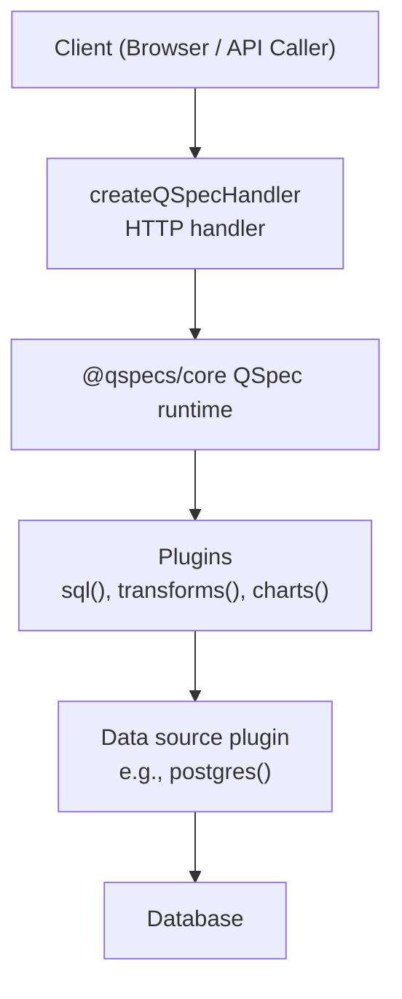
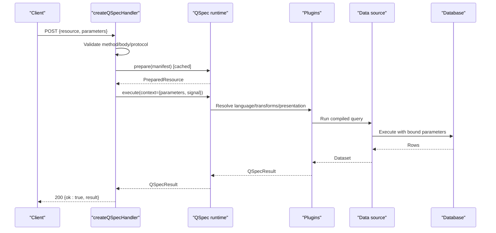
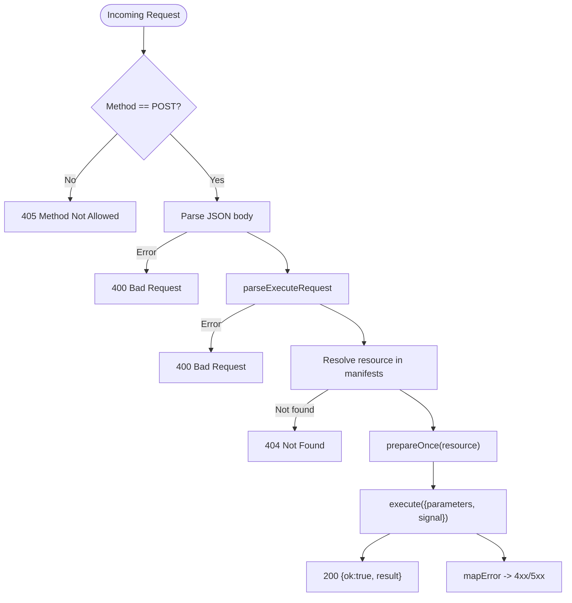
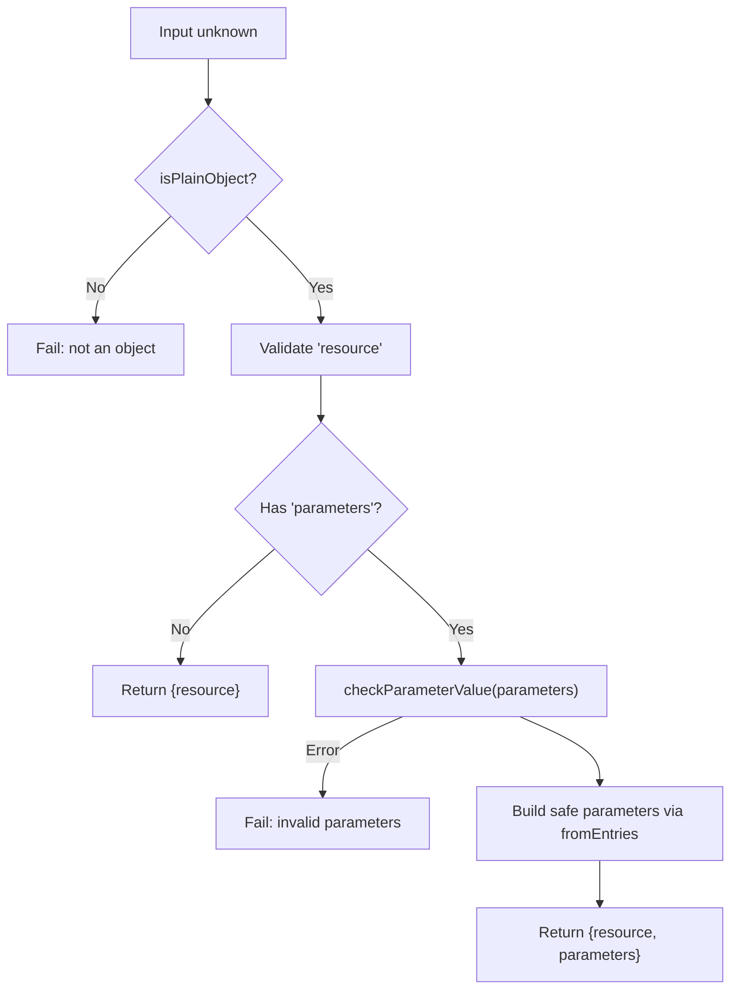
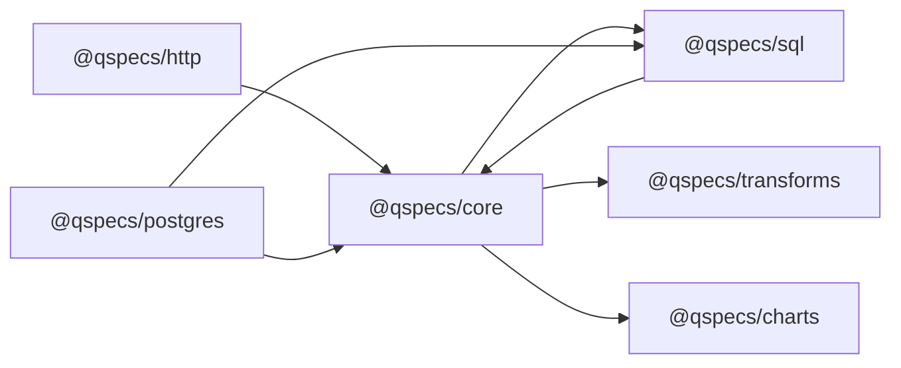

# Server-Side Setup

<cite>
**Referenced Files in This Document**
- [README.md](file://README.md)
- [quick-start.md](file://docs/quick-start.md)
- [security.md](file://docs/security.md)
- [public-api.md](file://docs/public-api.md)
- [handler.ts](file://packages/http/src/internal/handler.ts)
- [protocol.ts](file://packages/http/src/internal/protocol.ts)
- [index.ts](file://packages/http/src/index.ts)
- [runtime.ts](file://packages/core/src/types/runtime.ts)
- [qspec.config.js](file://examples/qspec.config.js)
</cite>

## Table of Contents

1. [Introduction](#introduction)
2. [Project Structure](#project-structure)
3. [Core Components](#core-components)
4. [Architecture Overview](#architecture-overview)
5. [Detailed Component Analysis](#detailed-component-analysis)
6. [Dependency Analysis](#dependency-analysis)
7. [Performance Considerations](#performance-considerations)
8. [Troubleshooting Guide](#troubleshooting-guide)
9. [Conclusion](#conclusion)
10. [Appendices](#appendices)

## Introduction

This document explains how to set up QSpec on the server side and expose it safely over HTTP using createQSpecHandler. It covers endpoint configuration, middleware integration patterns, request/response handling, authentication and authorization strategies, connection pooling for databases, error handling, runtime configuration, manifest loading, plugin registration, security considerations, production examples with popular frameworks, and performance optimization techniques.

Key principles:

- The HTTP handler is intentionally unauthenticated by design; mount it behind your own auth and rate limiting.
- Only resource names cross the wire; queries, sources, and credentials never leave the server.
- Parameter binding uses parameterized queries; values are never interpolated into SQL text.
- Resource limits protect execution from abuse.

**Section sources**

- [README.md:34-41](file://README.md#L34-L41)
- [security.md:9-15](file://docs/security.md#L9-L15)
- [security.md:148-180](file://docs/security.md#L148-L180)

## Project Structure

The server-side surface relevant to this guide lives primarily in the HTTP package and core runtime types:

- @qspecs/http exports a handler factory and wire protocol types.
- @qspecs/core defines runtime options, limits, and execution context.
- Examples and docs show plugin registration and validation workflows.

**Diagram sources**

- [handler.ts:131-239](file://packages/http/src/internal/handler.ts#L131-L239)
- [runtime.ts:72-87](file://packages/core/src/types/runtime.ts#L72-L87)

**Section sources**

- [index.ts:25-36](file://packages/http/src/index.ts#L25-L36)
- [runtime.ts:7-34](file://packages/core/src/types/runtime.ts#L7-L34)

## Core Components

- createQSpecHandler: Builds a Request => Response handler that validates input, resolves a registered resource name, prepares once per resource, executes with cancellation support, and maps errors to safe responses.
- parseExecuteRequest: Validates the wire-format execute request, enforcing strict JSON value constraints, depth limits, cycle detection, and unsafe key protection.
- QSpec runtime: Provides use(), ready(), prepare(), execute(), on(), dispose(), and limits enforcement.

Typical setup:

- Build a QSpec runtime with plugins (SQL, transforms, charts).
- Configure data sources with credentials at runtime (never in manifests).
- Create a handler with a fixed registry of manifests keyed by resource name.
- Mount the handler behind framework-level authentication and rate limiting.

**Section sources**

- [handler.ts:131-239](file://packages/http/src/internal/handler.ts#L131-L239)
- [protocol.ts:272-317](file://packages/http/src/internal/protocol.ts#L272-L317)
- [runtime.ts:72-87](file://packages/core/src/types/runtime.ts#L72-L87)

## Architecture Overview

End-to-end flow for an execute request:

**Diagram sources**

- [handler.ts:169-236](file://packages/http/src/internal/handler.ts#L169-L236)
- [protocol.ts:272-317](file://packages/http/src/internal/protocol.ts#L272-L317)
- [runtime.ts:72-87](file://packages/core/src/types/runtime.ts#L72-L87)

## Detailed Component Analysis

### HTTP Handler: createQSpecHandler

Responsibilities:

- Enforce POST-only requests.
- Parse and validate JSON body via parseExecuteRequest.
- Resolve resource against a host-supplied manifests map using safe lookup.
- Cache prepared resources (including failures) to avoid repeated static validation.
- Execute with request.signal for cancellation propagation.
- Map errors to safe HTTP responses without leaking driver messages.

Security notes:

- No auth hook or rate limiter inside the handler; rely on framework-level guards.
- Unknown resources return a generic 404 without enumerating available resources.
- Error messages do not include raw driver output; only safe codes are forwarded.

**Diagram sources**

- [handler.ts:169-236](file://packages/http/src/internal/handler.ts#L169-L236)

**Section sources**

- [handler.ts:13-33](file://packages/http/src/internal/handler.ts#L13-L33)
- [handler.ts:54-72](file://packages/http/src/internal/handler.ts#L54-L72)
- [handler.ts:74-109](file://packages/http/src/internal/handler.ts#L74-L109)
- [handler.ts:131-239](file://packages/http/src/internal/handler.ts#L131-L239)

### Wire Protocol: parseExecuteRequest

Validates the execute request shape:

- resource must be a non-empty string within a length limit and not an unsafe key.
- parameters, if present, must be a plain object containing only valid JSON values.
- Recursively checks parameter values for cycles, unsafe keys, and depth limits.
- Returns a sanitized copy built via Object.fromEntries to avoid prototype mutation risks.

**Diagram sources**

- [protocol.ts:272-317](file://packages/http/src/internal/protocol.ts#L272-L317)
- [protocol.ts:131-233](file://packages/http/src/internal/protocol.ts#L131-L233)

**Section sources**

- [protocol.ts:11-24](file://packages/http/src/internal/protocol.ts#L11-L24)
- [protocol.ts:44-68](file://packages/http/src/internal/protocol.ts#L44-L68)
- [protocol.ts:131-233](file://packages/http/src/internal/protocol.ts#L131-L233)
- [protocol.ts:272-317](file://packages/http/src/internal/protocol.ts#L272-L317)

### Runtime Configuration and Limits

Runtime options:

- limits: maxRows, maxTransforms, maxManifestBytes, maxExpressionDepth, queryTimeoutMs.
- logger: optional logging hook.
- Execution context supports parameters, AbortSignal, locale/timezone, and metadata.

Defaults enforce reasonable caps; hosts can tighten them per deployment needs.

**Section sources**

- [runtime.ts:7-34](file://packages/core/src/types/runtime.ts#L7-L34)
- [runtime.ts:36-43](file://packages/core/src/types/runtime.ts#L36-L43)
- [runtime.ts:57-87](file://packages/core/src/types/runtime.ts#L57-L87)

### Manifest Loading and Plugin Registration

- Build a runtime with .use(...) to register plugins: sql(), transforms(), charts().
- Data sources (e.g., postgres()) receive credentials at runtime, never in manifests.
- For CLI validation with plugin-aware checks, provide a config module exporting plugins.

Example references:

- Quick start shows full pipeline wiring and execute call.
- Example config demonstrates plugin registration for validation.

**Section sources**

- [quick-start.md:63-97](file://docs/quick-start.md#L63-L97)
- [qspec.config.js:1-19](file://examples/qspec.config.js#L1-L19)
- [README.md:49-96](file://README.md#L49-L96)

### Authentication and Authorization Patterns

- Mount createQSpecHandler behind your framework’s authentication and authorization middleware.
- Use route-level guards to restrict which users/roles can reach the QSpec endpoint.
- Apply rate limiting and IP allowlisting at the gateway or framework level.
- Keep credentials out of manifests; pass them to data source plugins at runtime.

Security rationale:

- The handler has no auth hooks; exposing it without host-level auth allows arbitrary execution with server credentials.

**Section sources**

- [security.md:9-15](file://docs/security.md#L9-L15)
- [security.md:182-198](file://docs/security.md#L182-L198)
- [README.md:34-41](file://README.md#L34-L41)

### Connection Pooling Strategies

- Use a pooled data source plugin (e.g., postgres()) configured with connection details at runtime.
- Ensure pool sizing matches expected concurrency and database capacity.
- Leverage request.signal to cancel long-running queries when clients disconnect.
- Dispose the runtime on shutdown to release connections gracefully.

**Section sources**

- [quick-start.md:71-85](file://docs/quick-start.md#L71-L85)
- [handler.ts:220-230](file://packages/http/src/internal/handler.ts#L220-L230)
- [runtime.ts:84-87](file://packages/core/src/types/runtime.ts#L84-L87)

### Error Handling Approaches

- Validation errors (manifest or parameter) return 400 with structured issues.
- Aborted requests return 499 with a safe message.
- All other errors return 500 with a generic message; only safe error codes are forwarded.
- Driver messages are never included in response bodies to prevent credential leakage.

**Section sources**

- [handler.ts:74-109](file://packages/http/src/internal/handler.ts#L74-L109)
- [security.md:124-147](file://docs/security.md#L124-L147)

### Security Considerations

- Parameter binding safety: Queries are parameterized; values never become part of SQL text.
- Resource name validation: Strict parsing prevents unsafe keys and excessive lengths.
- Prototype pollution resistance: Safe lookups and object construction avoid prototype mutation.
- Credential management: Credentials are runtime-only; never embedded in manifests or responses.
- No eval/new Function: Execution uses a fixed expression AST, not dynamic code evaluation.

**Section sources**

- [security.md:17-63](file://docs/security.md#L17-L63)
- [security.md:64-108](file://docs/security.md#L64-L108)
- [security.md:110-147](file://docs/security.md#L110-L147)
- [public-api.md:10-28](file://docs/public-api.md#L10-L28)

### Production-Ready Server Setups

#### Express

- Install dependencies and build a QSpec runtime with plugins and data sources.
- Create a handler with a fixed manifests registry.
- Mount the handler under a route guarded by your auth middleware.
- Add rate limiting and request size limits at the Express layer.

References:

- Handler creation and mounting pattern.
- Runtime setup and plugin registration.

**Section sources**

- [README.md:115-135](file://README.md#L115-L135)
- [handler.ts:131-239](file://packages/http/src/internal/handler.ts#L131-L239)
- [quick-start.md:63-97](file://docs/quick-start.md#L63-L97)

#### Fastify

- Register a single route that forwards to createQSpecHandler.
- Use Fastify’s schema validation to accept only the wire format.
- Apply fastify-rate-limit and secure headers globally or per route.
- Ensure graceful shutdown disposes the runtime.

References:

- Handler contract and response mapping.
- Runtime disposal and limits.

**Section sources**

- [handler.ts:131-239](file://packages/http/src/internal/handler.ts#L131-L239)
- [runtime.ts:84-87](file://packages/core/src/types/runtime.ts#L84-L87)

#### Next.js API Routes

- Export a handler function that calls createQSpecHandler and returns a Response.
- Protect the route with Next.js middleware for authentication and authorization.
- Configure request size limits and timeouts at the platform level.

References:

- Handler usage and mounting guidance.
- Runtime configuration and plugin registration.

**Section sources**

- [README.md:115-135](file://README.md#L115-L135)
- [quick-start.md:63-97](file://docs/quick-start.md#L63-L97)

## Dependency Analysis

High-level dependency relationships between server components:

**Diagram sources**

- [index.ts:25-36](file://packages/http/src/index.ts#L25-L36)
- [runtime.ts:72-87](file://packages/core/src/types/runtime.ts#L72-L87)

**Section sources**

- [public-api.md:10-28](file://docs/public-api.md#L10-L28)

## Performance Considerations

- Prepare/execute split: prepare() is cached per resource across requests, avoiding repeated static validation.
- Query caching: Implement application-level caching around execute() results keyed by resource and parameters where appropriate.
- Connection management: Use pooled data sources sized for concurrency; ensure proper disposal on shutdown.
- Resource limits: Tune maxRows, maxTransforms, maxManifestBytes, maxExpressionDepth, and queryTimeoutMs for your workload.
- Cancellation: Propagate request signals to abort long-running queries promptly.
- Payload limits: Enforce request body size limits at the framework/gateway layer to mitigate large-parameter attacks.

**Section sources**

- [handler.ts:136-167](file://packages/http/src/internal/handler.ts#L136-L167)
- [runtime.ts:7-34](file://packages/core/src/types/runtime.ts#L7-L34)
- [protocol.ts:44-68](file://packages/http/src/internal/protocol.ts#L44-L68)

## Troubleshooting Guide

Common issues and resolutions:

- 405 Method Not Allowed: Ensure requests are POST.
- 400 Bad Request: Invalid JSON or malformed wire protocol; check resource and parameters shape.
- 404 Not Found: Unknown resource name; verify the manifests registry includes the requested name.
- 499 Aborted: Client disconnected or aborted; consider retry logic with backoff.
- 500 Internal Error: Generic failure; inspect logs and ensure no sensitive data is being logged.

Diagnostic tips:

- Validate manifests offline using the CLI with plugin-aware mode to catch issues before deployment.
- Use structured error responses (code, message, issues) to pinpoint problems quickly.
- Confirm that parameters match declared types and bindings in manifests.

**Section sources**

- [handler.ts:169-236](file://packages/http/src/internal/handler.ts#L169-L236)
- [security.md:124-147](file://docs/security.md#L124-L147)

## Conclusion

By mounting createQSpecHandler behind robust authentication, applying strict request validation, configuring runtime limits, and using parameterized queries with pooled connections, you can expose QSpec securely and efficiently in production. Keep credentials out of manifests, rely on framework-level security controls, and tune performance through caching, limits, and connection management.

## Appendices

### Quick Reference: Handler Options and Types

- QSpecHandlerOptions: runtime, manifests
- QSpecExecuteRequest: resource, parameters
- QSpecErrorBody: code, message, issues
- QSpecLimits: maxRows, maxTransforms, maxManifestBytes, maxExpressionDepth, queryTimeoutMs

**Section sources**

- [handler.ts:28-33](file://packages/http/src/internal/handler.ts#L28-L33)
- [protocol.ts:20-42](file://packages/http/src/internal/protocol.ts#L20-L42)
- [runtime.ts:7-34](file://packages/core/src/types/runtime.ts#L7-L34)
