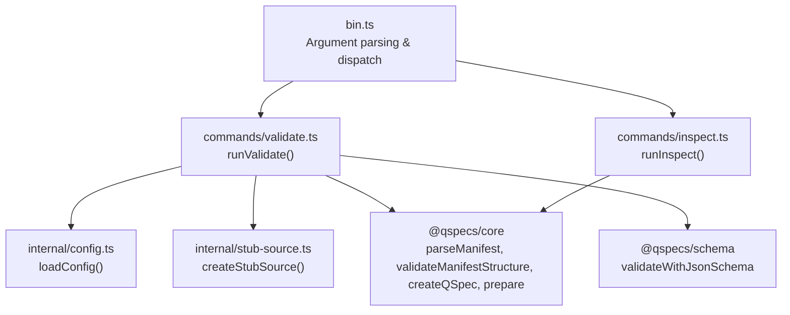
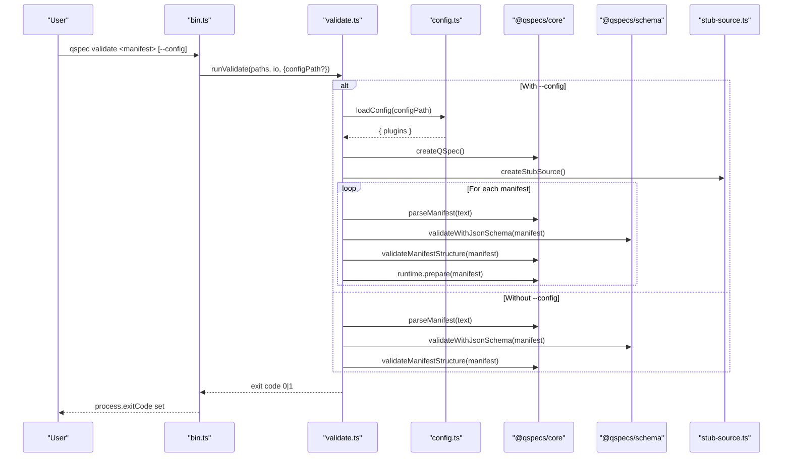
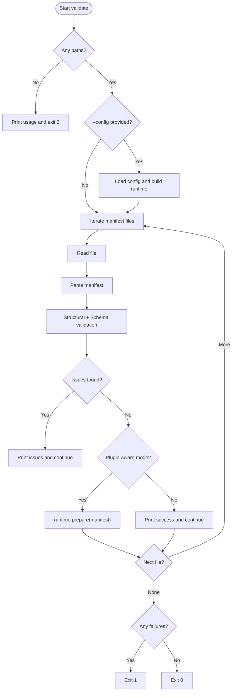
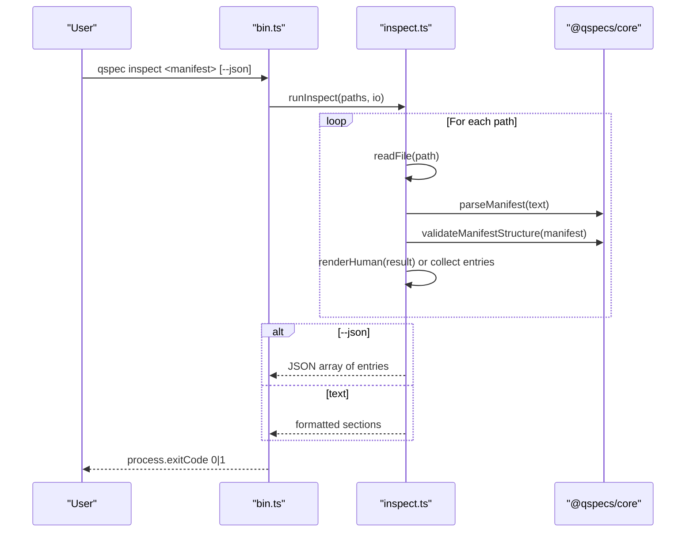
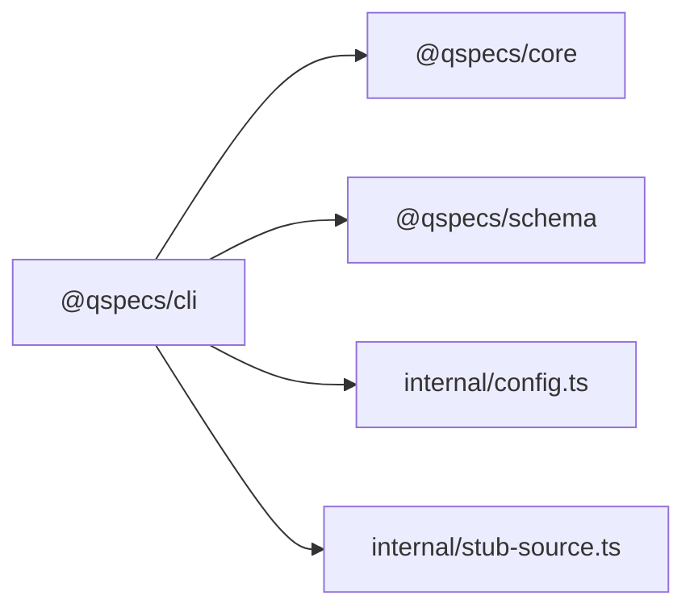

# CLI Tools (@qspecs/cli)

<cite>
**Referenced Files in This Document**
- [package.json](file://packages/cli/package.json)
- [bin.ts](file://packages/cli/src/bin.ts)
- [validate.ts](file://packages/cli/src/commands/validate.ts)
- [inspect.ts](file://packages/cli/src/commands/inspect.ts)
- [config.ts](file://packages/cli/src/internal/config.ts)
- [stub-source.ts](file://packages/cli/src/internal/stub-source.ts)
- [cli.md](file://docs/cli.md)
- [qspec.config.js](file://examples/qspec.config.js)
</cite>

## Table of Contents

1. [Introduction](#introduction)
2. [Project Structure](#project-structure)
3. [Core Components](#core-components)
4. [Architecture Overview](#architecture-overview)
5. [Detailed Component Analysis](#detailed-component-analysis)
6. [Dependency Analysis](#dependency-analysis)
7. [Performance Considerations](#performance-considerations)
8. [Troubleshooting Guide](#troubleshooting-guide)
9. [Conclusion](#conclusion)
10. [Appendices](#appendices)

## Introduction

This document provides comprehensive documentation for the @qspecs/cli package, which ships the qspec command-line tool for QSpec manifest development and validation. It covers all available commands, options, configuration file support, output formats, CI/CD integration, batch processing, scripting automation, exit codes, logging behavior, debugging techniques, installation, setup, and troubleshooting.

The CLI currently exposes two commands:

- validate: structural and optional plugin-aware validation of one or more manifests
- inspect: static inspection of one or more manifests with human-readable or JSON output

It does not connect to data sources or execute queries; it only reads manifests from disk and reports diagnostics.

**Section sources**

- [cli.md:1-8](file://docs/cli.md#L1-L8)

## Project Structure

The CLI is a Node.js package that exports a binary named qspec. The entry point parses arguments and dispatches to command handlers. Command implementations live under src/commands, with shared internal utilities under src/internal.

**Diagram sources**

- [bin.ts:1-149](file://packages/cli/src/bin.ts#L1-L149)
- [validate.ts:1-262](file://packages/cli/src/commands/validate.ts#L1-L262)
- [inspect.ts:1-327](file://packages/cli/src/commands/inspect.ts#L1-L327)
- [config.ts:1-124](file://packages/cli/src/internal/config.ts#L1-L124)
- [stub-source.ts:1-33](file://packages/cli/src/internal/stub-source.ts#L1-L33)

**Section sources**

- [package.json:1-49](file://packages/cli/package.json#L1-L49)
- [bin.ts:1-149](file://packages/cli/src/bin.ts#L1-L149)

## Core Components

- Binary entrypoint (bin.ts): Parses argv, handles help/version, routes to validate or inspect, enforces option constraints, and sets process.exitCode.
- Validate command (validate.ts): Reads manifests, runs structural validation via core and schema, optionally loads a config module and runs prepare() against each manifest using a stub data source to avoid real execution.
- Inspect command (inspect.ts): Reads manifests, performs structural validation, and emits either a structured human-readable report or a machine-readable JSON array of inspection entries.
- Config loader (config.ts): Loads a user-provided config module by path, extracts a plugins array, and validates its shape.
- Stub data source (stub-source.ts): Provides a DataSource that refuses execution, ensuring plugin-aware validation never runs queries during prepare().

Key behaviors:

- validate without --config runs no plugins and executes no user code.
- validate with --config dynamically imports the config module and installs plugins before calling prepare() on each manifest.
- inspect never loads plugins and never calls prepare(); it works even if referenced plugins are not installed.
- inspect supports --json to emit a single JSON array of entries, one per successfully inspected manifest.

**Section sources**

- [bin.ts:1-149](file://packages/cli/src/bin.ts#L1-L149)
- [validate.ts:1-262](file://packages/cli/src/commands/validate.ts#L1-L262)
- [inspect.ts:1-327](file://packages/cli/src/commands/inspect.ts#L1-L327)
- [config.ts:1-124](file://packages/cli/src/internal/config.ts#L1-L124)
- [stub-source.ts:1-33](file://packages/cli/src/internal/stub-source.ts#L1-L33)

## Architecture Overview

The CLI architecture separates argument handling, command logic, and shared internals. Validation can operate in two modes:

- Structural-only mode: fast, safe, no user code execution.
- Plugin-aware mode (--config): dynamic import of a config module, installation of plugins, and preparation of manifests against a stub data source.

**Diagram sources**

- [bin.ts:55-114](file://packages/cli/src/bin.ts#L55-L114)
- [validate.ts:158-262](file://packages/cli/src/commands/validate.ts#L158-L262)
- [config.ts:94-124](file://packages/cli/src/internal/config.ts#L94-L124)
- [stub-source.ts:15-33](file://packages/cli/src/internal/stub-source.ts#L15-L33)

## Detailed Component Analysis

### Command: validate

Purpose:

- Read one or more manifest files.
- Parse and structurally validate them using both core and JSON Schema validators.
- Optionally load a config module and run plugin-aware validation via prepare() without executing queries.

Options:

- Positional paths: one or more manifest files.
- --config <path>: opt-in plugin-aware validation by loading a config module that exports a plugins array.

Outputs:

- Success: prints a confirmation line and resource identity (API version, kind, name).
- Failure: prints detailed issues with paths and suggestions where applicable.

Exit codes:

- 0: all manifests validated successfully.
- 1: at least one manifest failed read/parse/validation or an internal validator mismatch occurred.
- 2: usage error (no paths provided, unknown flags, etc.).

Notes:

- Without --config, no plugins are loaded and no user code runs.
- With --config, a stub DataSource is registered for each declared source so prepare() completes without querying.

Common workflows:

- Structural-only validation: qspec validate report.json
- Plugin-aware validation: qspec validate --config examples/qspec.config.js examples/*.qspec.json

Batching:

- Accepts multiple manifest paths in a single invocation.

CI/CD integration:

- Use exit code 0 for success and non-zero for failure in CI steps.
- Combine with --config to enforce plugin-specific rules in CI.

**Section sources**

- [validate.ts:158-262](file://packages/cli/src/commands/validate.ts#L158-L262)
- [cli.md:15-112](file://docs/cli.md#L15-L112)
- [qspec.config.js:1-19](file://examples/qspec.config.js#L1-L19)

#### Validate Flowchart

**Diagram sources**

- [validate.ts:158-262](file://packages/cli/src/commands/validate.ts#L158-L262)

### Command: inspect

Purpose:

- Read one or more manifest files and print their static content: resource identity, parameters, query metadata, dataset fields, and presentation field references.
- Supports human-readable output or machine-readable JSON via --json.

Options:

- Positional paths: one or more manifest files.
- --json: emit a single JSON array of inspection entries, one per successfully inspected manifest.

Outputs:

- Human-readable sections for Resource, Parameters, Query, Dataset, Presentation.
- JSON array when --json is used.

Constraints:

- --config is not supported by inspect; passing it returns exit code 2.
- No plugins are loaded; no prepare() is called.

Batching:

- Accepts multiple manifest paths; outputs one block per file in text mode or one entry per file in JSON mode.

CI/CD integration:

- Use --json to pipe results into scripts or tools.
- Exit code indicates whether any manifest failed to read/parse/validate.

**Section sources**

- [inspect.ts:248-327](file://packages/cli/src/commands/inspect.ts#L248-L327)
- [cli.md:114-198](file://docs/cli.md#L114-L198)

#### Inspect Sequence

**Diagram sources**

- [bin.ts:96-113](file://packages/cli/src/bin.ts#L96-L113)
- [inspect.ts:265-327](file://packages/cli/src/commands/inspect.ts#L265-L327)

### Configuration File Support (--config)

- Path resolution: resolved against the current working directory and imported via a file: URL. There is no fallback search or default filename discovery.
- Module shape: must export a plugins array either as a named export or as a default export shaped like { plugins: [...] }. If both exist, the named export wins.
- Safety: loading a config executes arbitrary code; therefore, --config is opt-in and required explicitly.
- Example: see examples/qspec.config.js for installing sql(), transforms(), and charts() plugins.

Validation behavior with --config:

- Builds a QSpec runtime, installs plugins, registers a stub DataSource for each declared source, and calls prepare() on each manifest.
- Catches plugin-specific issues such as unknown transform types, invalid expressions, or SQL binding mismatches.

**Section sources**

- [config.ts:32-124](file://packages/cli/src/internal/config.ts#L32-L124)
- [qspec.config.js:1-19](file://examples/qspec.config.js#L1-L19)
- [validate.ts:127-156](file://packages/cli/src/commands/validate.ts#L127-L156)
- [cli.md:53-112](file://docs/cli.md#L53-L112)

### Output Formats

- validate:
  - Text: success banner plus resource identity lines; errors include path, message, and optional suggestion.
  - No JSON mode; --json is silently ignored for validate.
- inspect:
  - Text: structured sections per manifest.
  - JSON: single array of entries with fields: path, resource, parameters, query, dataset, presentation.fieldReferences.

**Section sources**

- [validate.ts:73-92](file://packages/cli/src/commands/validate.ts#L73-L92)
- [inspect.ts:39-58](file://packages/cli/src/commands/inspect.ts#L39-L58)
- [inspect.ts:210-246](file://packages/cli/src/commands/inspect.ts#L210-L246)
- [cli.md:161-198](file://docs/cli.md#L161-L198)

### Exit Codes

- 0: All manifests processed successfully.
- 1: At least one manifest failed read/parse/validation or an internal validator mismatch was detected.
- 2: Usage error (no paths, unknown command, unsupported flag combination, unrecognized option).

Behavior details:

- Unrecognized flags trigger parseArgs errors caught and converted to exit code 2.
- inspect rejects --config with exit code 2.

**Section sources**

- [bin.ts:61-113](file://packages/cli/src/bin.ts#L61-L113)
- [validate.ts:158-181](file://packages/cli/src/commands/validate.ts#L158-L181)
- [validate.ts:219-230](file://packages/cli/src/commands/validate.ts#L219-L230)
- [cli.md:199-213](file://docs/cli.md#L199-L213)

### Logging Levels and Diagnostics

- Errors and diagnostics are written to stderr; successes to stdout.
- Colorized output is enabled based on terminal capabilities.
- Diagnostics include precise paths and suggestions where available.
- No configurable log levels; output is deterministic and suitable for CI consumption.

**Section sources**

- [bin.ts:40-46](file://packages/cli/src/bin.ts#L40-L46)
- [validate.ts:73-92](file://packages/cli/src/commands/validate.ts#L73-L92)

### Integration with Development Tools

- Linters and IDEs can invoke qspec validate without --config for fast structural checks.
- For stricter checks, integrate qspec validate --config with your project’s config module in pre-commit hooks or IDE tasks.
- Use qspec inspect --json to generate dependency maps or documentation from manifests.

**Section sources**

- [cli.md:45-51](file://docs/cli.md#L45-L51)
- [cli.md:114-159](file://docs/cli.md#L114-L159)

### Installation and Setup

- Install the package to expose the qspec binary.
- Ensure Node.js engine compatibility as specified by the package.
- Create a config module exporting plugins for plugin-aware validation.

**Section sources**

- [package.json:1-49](file://packages/cli/package.json#L1-L49)
- [qspec.config.js:1-19](file://examples/qspec.config.js#L1-L19)

### Common CLI Workflows

- Validate a single manifest: qspec validate report.json
- Validate multiple manifests: qspec validate a.qspec.json b.qspec.json
- Plugin-aware validation: qspec validate --config examples/qspec.config.js examples/*.qspec.json
- Inspect a manifest: qspec inspect report.json
- Inspect in JSON: qspec inspect report.json --json

**Section sources**

- [cli.md:10-13](file://docs/cli.md#L10-L13)
- [cli.md:15-13](file://docs/cli.md#L15-L13)
- [cli.md:110-112](file://docs/cli.md#L110-L112)
- [cli.md:116-118](file://docs/cli.md#L116-L118)
- [cli.md:161-188](file://docs/cli.md#L161-L188)

### Batch Processing and Scripting Automation

- Pass multiple manifest paths to process many files in one run.
- Use inspect --json to produce a stable JSON array for downstream scripts.
- Combine with shell loops or CI jobs to iterate over directories.

**Section sources**

- [inspect.ts:248-327](file://packages/cli/src/commands/inspect.ts#L248-L327)
- [cli.md:161-198](file://docs/cli.md#L161-L198)

### CI/CD Pipeline Integration

- Add steps that call qspec validate (with or without --config) and assert exit code 0.
- Fail the pipeline on non-zero exit codes to catch issues early.
- Use inspect --json to generate artifacts or feed analysis tools.

**Section sources**

- [cli.md:199-213](file://docs/cli.md#L199-L213)
- [validate.ts:158-262](file://packages/cli/src/commands/validate.ts#L158-L262)

### Error Diagnosis and Debugging Techniques

- Start with structural-only validation to isolate manifest shape issues.
- Add --config to detect plugin-specific problems (unknown transforms, SQL bindings, expression depth).
- Review stderr diagnostics for exact paths and suggestions.
- Confirm the config module exports a valid plugins array and resolves correctly.
- Verify that no real data source is executed; the CLI uses a stub DataSource during prepare().

**Section sources**

- [validate.ts:127-156](file://packages/cli/src/commands/validate.ts#L127-L156)
- [stub-source.ts:15-33](file://packages/cli/src/internal/stub-source.ts#L15-L33)
- [cli.md:45-112](file://docs/cli.md#L45-L112)

## Dependency Analysis

The CLI depends on:

- @qspecs/core for parsing, structural validation, runtime creation, and prepare()
- @qspecs/schema for JSON Schema validation
- Internal modules for config loading and stub data source

**Diagram sources**

- [package.json:36-44](file://packages/cli/package.json#L36-L44)
- [validate.ts:1-16](file://packages/cli/src/commands/validate.ts#L1-L16)
- [inspect.ts:1-11](file://packages/cli/src/commands/inspect.ts#L1-L11)
- [config.ts:1-8](file://packages/cli/src/internal/config.ts#L1-L8)
- [stub-source.ts:1-3](file://packages/cli/src/internal/stub-source.ts#L1-L3)

**Section sources**

- [package.json:36-44](file://packages/cli/package.json#L36-L44)

## Performance Considerations

- Structural-only validation is fast and safe; use it for frequent checks.
- Plugin-aware validation incurs dynamic module import and prepare() overhead; prefer it in CI or pre-commit stages rather than interactive editing.
- Batch processing reduces startup costs by validating multiple manifests per invocation.

[No sources needed since this section provides general guidance]

## Troubleshooting Guide

Common issues:

- Unknown command or missing paths: ensure correct syntax and provide at least one manifest path.
- Unrecognized flags: check spelling; --json applies only to inspect; --config applies only to validate.
- Config not found: verify the path resolves relative to the current working directory and the module exists.
- Invalid config shape: ensure the config exports a plugins array either as a named export or as a default object with a plugins property.
- Unexpected execution: confirm you did not intend to call execute(); the CLI only calls prepare() during plugin-aware validation.

Diagnostics:

- Inspect stderr for detailed messages and paths.
- Use inspect --json to validate expected structure without side effects.

**Section sources**

- [bin.ts:61-113](file://packages/cli/src/bin.ts#L61-L113)
- [config.ts:45-92](file://packages/cli/src/internal/config.ts#L45-L92)
- [validate.ts:158-181](file://packages/cli/src/commands/validate.ts#L158-L181)
- [inspect.ts:265-327](file://packages/cli/src/commands/inspect.ts#L265-L327)

## Conclusion

The @qspecs/cli provides a focused, safe, and efficient interface for validating and inspecting QSpec manifests. Structural validation is always available and fast; plugin-aware validation adds deeper checks through optional configuration. The CLI integrates cleanly into development workflows and CI/CD pipelines via clear exit codes, deterministic output, and batch processing capabilities.

[No sources needed since this section summarizes without analyzing specific files]

## Appendices

### Command Reference Summary

- qspec validate <manifest.json> [...] [--config <path>]
  - Validates manifests structurally and optionally with plugins.
  - Exits 0 on success, 1 on validation failure, 2 on usage errors.
- qspec inspect <manifest.json> [...] [--json]
  - Prints static manifest information or emits JSON array.
  - Exits 0 on success, 1 on read/parse/validation failure, 2 on usage errors.

**Section sources**

- [cli.md:10-13](file://docs/cli.md#L10-L13)
- [cli.md:199-213](file://docs/cli.md#L199-L213)
