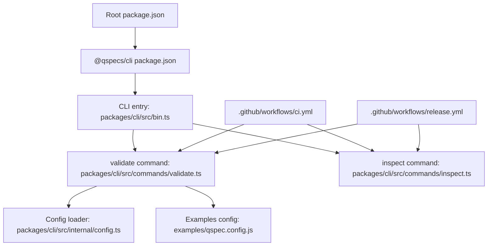
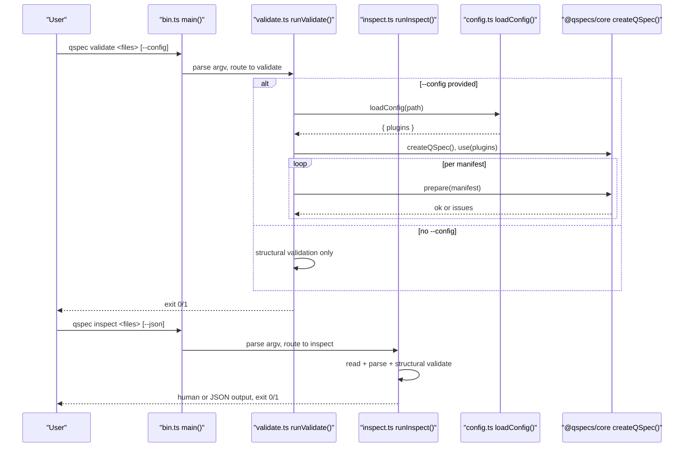
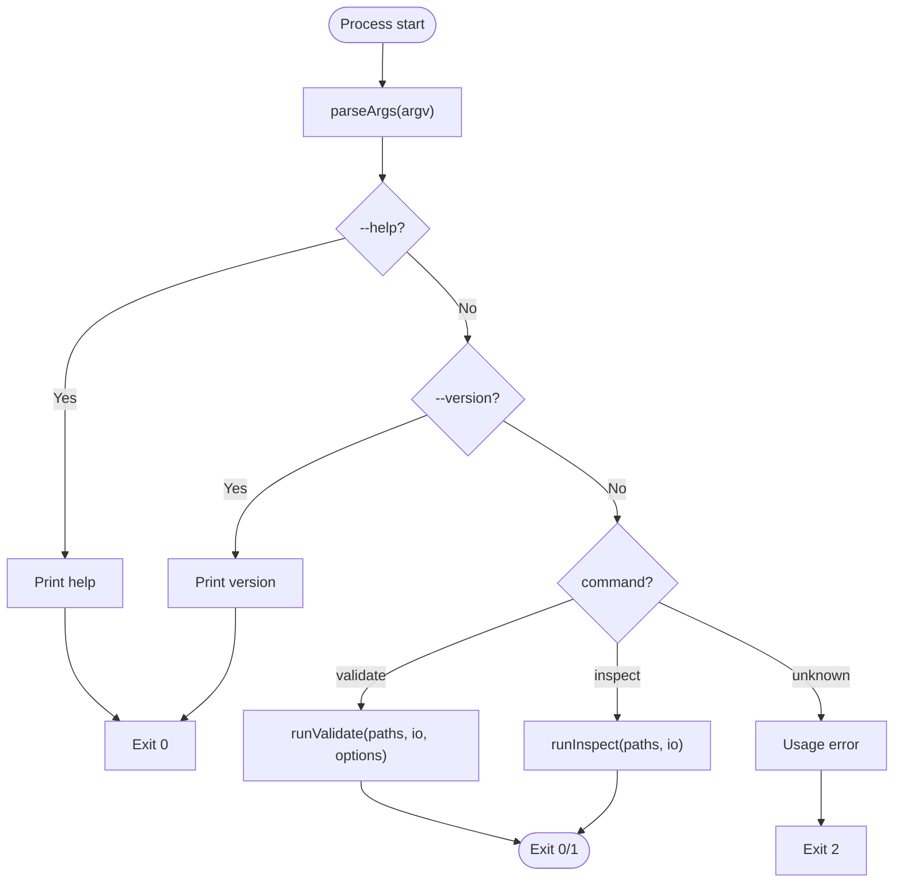
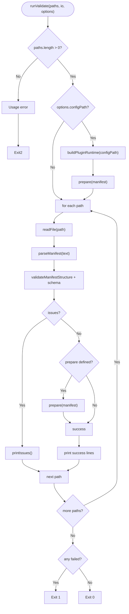
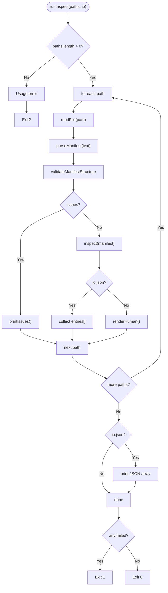
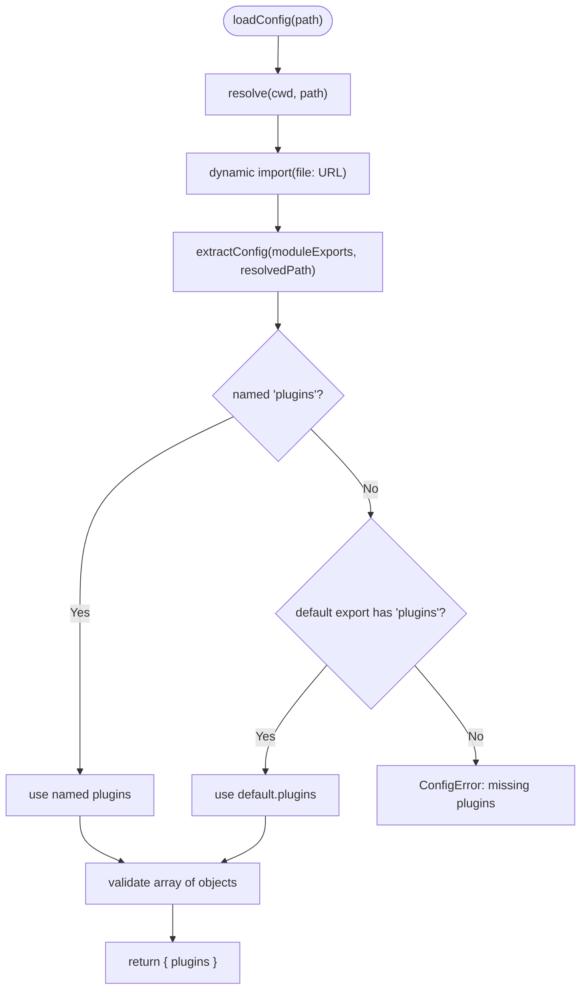
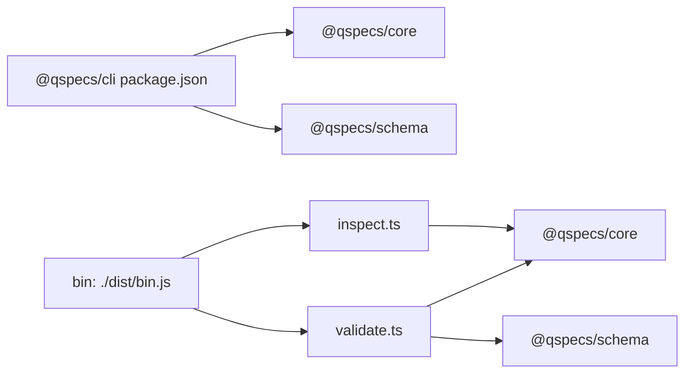
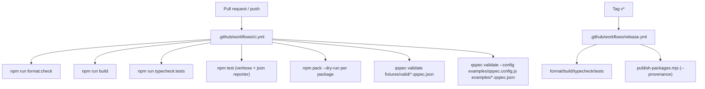

# CLI Workflows and Integration

<cite>
**Referenced Files in This Document**
- [package.json](file://package.json)
- [ci.yml](file://.github/workflows/ci.yml)
- [release.yml](file://.github/workflows/release.yml)
- [cli.md](file://docs/cli.md)
- [bin.ts](file://packages/cli/src/bin.ts)
- [validate.ts](file://packages/cli/src/commands/validate.ts)
- [inspect.ts](file://packages/cli/src/commands/inspect.ts)
- [config.ts](file://packages/cli/src/internal/config.ts)
- [qspec.config.js](file://examples/qspec.config.js)
- [cli package.json](file://packages/cli/package.json)
</cite>

## Table of Contents

1. [Introduction](#introduction)
2. [Project Structure](#project-structure)
3. [Core Components](#core-components)
4. [Architecture Overview](#architecture-overview)
5. [Detailed Component Analysis](#detailed-component-analysis)
6. [Dependency Analysis](#dependency-analysis)
7. [Performance Considerations](#performance-considerations)
8. [Troubleshooting Guide](#troubleshooting-guide)
9. [Conclusion](#conclusion)
10. [Appendices](#appendices)

## Introduction

This document explains how to use the QSpec CLI for batch validation, inspection, scripting automation, and integration with CI/CD pipelines. It covers command usage, configuration loading, exit codes, logging behavior, environment considerations, and performance tips for large-scale validation runs. It also provides guidance on integrating these workflows into development environments and build tools.

## Project Structure

The repository is a Node.js monorepo that exposes a CLI binary through the @qspecs/cli package. The CLI provides two commands:

- validate: structural and optional plugin-aware validation of QSpec manifests
- inspect: static inspection of manifest contents without loading plugins

CI/CD is implemented via GitHub Actions workflows for continuous integration and release publishing.

**Diagram sources**

- [package.json:16-27](file://package.json#L16-L27)
- [cli package.json:26-28](file://packages/cli/package.json#L26-L28)
- [bin.ts:55-113](file://packages/cli/src/bin.ts#L55-L113)
- [validate.ts:158-261](file://packages/cli/src/commands/validate.ts#L158-L261)
- [inspect.ts:265-326](file://packages/cli/src/commands/inspect.ts#L265-L326)
- [config.ts:94-123](file://packages/cli/src/internal/config.ts#L94-L123)
- [qspec.config.js:14-18](file://examples/qspec.config.js#L14-L18)
- [ci.yml:151-163](file://.github/workflows/ci.yml#L151-L163)
- [release.yml:91-137](file://.github/workflows/release.yml#L91-L137)

**Section sources**

- [package.json:16-27](file://package.json#L16-L27)
- [cli package.json:26-28](file://packages/cli/package.json#L26-L28)
- [ci.yml:151-163](file://.github/workflows/ci.yml#L151-L163)
- [release.yml:91-137](file://.github/workflows/release.yml#L91-L137)

## Core Components

- CLI entrypoint parses arguments and dispatches to validate or inspect.
- validate performs structural checks and optionally loads a config module to run plugin-aware prepare() against each manifest.
- inspect reads manifests and prints resource identity, parameters, query, dataset, and presentation references without loading plugins.
- Config loader dynamically imports an explicit config file and validates its shape before extracting the plugins array.

Key behaviors:

- Exit codes: 0 (all valid), 1 (validation failure), 2 (usage error).
- Logging: diagnostics go to stderr; success messages go to stdout.
- Safety: --config executes arbitrary code; omitting it runs no user code.

**Section sources**

- [bin.ts:55-113](file://packages/cli/src/bin.ts#L55-L113)
- [validate.ts:158-261](file://packages/cli/src/commands/validate.ts#L158-L261)
- [inspect.ts:265-326](file://packages/cli/src/commands/inspect.ts#L265-L326)
- [config.ts:94-123](file://packages/cli/src/internal/config.ts#L94-L123)
- [cli.md:199-213](file://docs/cli.md#L199-L213)

## Architecture Overview

The CLI architecture separates argument parsing, command logic, and configuration loading. Validation can be purely structural or extended by plugins loaded from a user-provided config. Inspection remains plugin-free and deterministic.

**Diagram sources**

- [bin.ts:55-113](file://packages/cli/src/bin.ts#L55-L113)
- [validate.ts:127-156](file://packages/cli/src/commands/validate.ts#L127-L156)
- [validate.ts:158-261](file://packages/cli/src/commands/validate.ts#L158-L261)
- [inspect.ts:265-326](file://packages/cli/src/commands/inspect.ts#L265-L326)
- [config.ts:94-123](file://packages/cli/src/internal/config.ts#L94-L123)

## Detailed Component Analysis

### CLI Entry and Argument Parsing

- Parses help, version, json, and config flags using Node’s parseArgs.
- Routes to validate or inspect; rejects unknown commands and flags with exit code 2.
- Version and help are handled early; otherwise delegates to command functions.

**Diagram sources**

- [bin.ts:55-113](file://packages/cli/src/bin.ts#L55-L113)

**Section sources**

- [bin.ts:55-113](file://packages/cli/src/bin.ts#L55-L113)

### Validate Command

- Reads files, parses JSON, runs two structural validators, and optionally runs plugin-aware prepare().
- When --config is provided, loads the config module, installs plugins, registers stub data sources for declared sources, and calls prepare() per manifest.
- Prints structured diagnostics with path hints and suggestions where available.

**Diagram sources**

- [validate.ts:158-261](file://packages/cli/src/commands/validate.ts#L158-L261)
- [validate.ts:127-156](file://packages/cli/src/commands/validate.ts#L127-L156)

**Section sources**

- [validate.ts:158-261](file://packages/cli/src/commands/validate.ts#L158-L261)
- [validate.ts:127-156](file://packages/cli/src/commands/validate.ts#L127-L156)
- [cli.md:15-112](file://docs/cli.md#L15-L112)

### Inspect Command

- Reads and structurally validates manifests without loading any plugins.
- Outputs either human-readable sections or a single JSON array when --json is used.
- Always returns exit 0 if all inputs succeed; exit 1 if any input fails.

**Diagram sources**

- [inspect.ts:265-326](file://packages/cli/src/commands/inspect.ts#L265-L326)

**Section sources**

- [inspect.ts:265-326](file://packages/cli/src/commands/inspect.ts#L265-L326)
- [cli.md:114-197](file://docs/cli.md#L114-L197)

### Configuration Loading (--config)

- Resolves the given path relative to the current working directory and dynamically imports it as a module.
- Accepts either a named export const plugins or a default export shaped { plugins: [...] }, preferring the named export when both exist.
- Validates that plugins is an array of objects; errors include clear diagnostics naming the resolved path.

**Diagram sources**

- [config.ts:45-92](file://packages/cli/src/internal/config.ts#L45-L92)
- [config.ts:94-123](file://packages/cli/src/internal/config.ts#L94-L123)

**Section sources**

- [config.ts:45-92](file://packages/cli/src/internal/config.ts#L45-L92)
- [config.ts:94-123](file://packages/cli/src/internal/config.ts#L94-L123)
- [cli.md:53-87](file://docs/cli.md#L53-L87)

### Example Plugin-Aware Config

- The example config installs SQL, transforms, and charts plugins so validate can catch operator and binding issues beyond structural checks.
- Deliberately omits database adapters to avoid requiring credentials during validation.

**Section sources**

- [qspec.config.js:14-18](file://examples/qspec.config.js#L14-L18)
- [cli.md:53-87](file://docs/cli.md#L53-L87)

## Dependency Analysis

- The CLI depends on @qspecs/core for parsing, structural validation, and runtime creation, and on @qspecs/schema for JSON Schema validation.
- The bin entry is exposed via the package’s bin field, making the qspec command available after installation.
- CI uses npm scripts to build, type-check, test, and validate fixtures and examples with the CLI.

**Diagram sources**

- [cli package.json:36-39](file://packages/cli/package.json#L36-L39)
- [cli package.json:26-28](file://packages/cli/package.json#L26-L28)
- [validate.ts:1-15](file://packages/cli/src/commands/validate.ts#L1-L15)
- [inspect.ts:1-11](file://packages/cli/src/commands/inspect.ts#L1-L11)

**Section sources**

- [cli package.json:26-28](file://packages/cli/package.json#L26-L28)
- [cli package.json:36-39](file://packages/cli/package.json#L36-L39)
- [validate.ts:1-15](file://packages/cli/src/commands/validate.ts#L1-L15)
- [inspect.ts:1-11](file://packages/cli/src/commands/inspect.ts#L1-L11)

## Performance Considerations

- Batch processing: Both validate and inspect accept multiple manifest paths, enabling efficient one-pass runs over directories.
- Structural-only mode: Without --config, validate performs fast structural checks without loading plugins or executing user code.
- Parallelization: The CLI itself processes manifests sequentially. To parallelize across many manifests, wrap the CLI invocation with your shell or task runner (e.g., xargs -P, npm-run-all --parallel, or a custom script).
- Resource management: Avoid including heavy adapters in --config unless necessary; the example config intentionally excludes database adapters to keep validation lightweight.
- Output modes: Use inspect --json for machine-readable output to streamline downstream processing and reduce parsing overhead.

[No sources needed since this section provides general guidance]

## Troubleshooting Guide

Common issues and resolutions:

- Unknown command or flag: Exit code 2 with usage message. Ensure correct spelling and supported flags.
- Missing config file: Exit code 1 with a clear diagnostic naming the resolved path. Verify the path exists and is reachable from the current working directory.
- Invalid manifest: Exit code 1 with detailed path and suggestion where applicable. Fix reported issues or use inspect to review structure.
- Internal validator mismatch: Exit code 1 indicating disagreement between core and schema validators; report as a bug.
- Integration tests skipped: CI verifies container-backed suites actually ran; ensure Docker/testcontainers is available in local or CI environments.

**Section sources**

- [cli.md:199-213](file://docs/cli.md#L199-L213)
- [validate.ts:158-261](file://packages/cli/src/commands/validate.ts#L158-L261)
- [inspect.ts:265-326](file://packages/cli/src/commands/inspect.ts#L265-L326)
- [config.ts:94-123](file://packages/cli/src/internal/config.ts#L94-L123)
- [ci.yml:38-110](file://.github/workflows/ci.yml#L38-L110)

## Conclusion

The QSpec CLI provides a safe, extensible way to validate and inspect QSpec manifests. Use structural validation for speed and safety, and enable plugin-aware validation with --config when you need deeper checks. Integrate these commands into CI/CD for consistent quality gates, and adopt inspect --json for scripting and tooling integrations.

[No sources needed since this section summarizes without analyzing specific files]

## Appendices

### CI/CD Pipeline Integration

- Continuous Integration:
  - Format check, build, typecheck, full test suite, pack verification, and CLI validations for fixtures and examples.
  - Ensures container-backed suites actually ran and did not skip silently.
- Release:
  - Validates metadata, builds, tests, and publishes with provenance when triggered by a tag; dry-run otherwise.

**Diagram sources**

- [ci.yml:151-163](file://.github/workflows/ci.yml#L151-L163)
- [ci.yml:21-37](file://.github/workflows/ci.yml#L21-L37)
- [release.yml:91-137](file://.github/workflows/release.yml#L91-L137)

**Section sources**

- [ci.yml:21-37](file://.github/workflows/ci.yml#L21-L37)
- [ci.yml:151-163](file://.github/workflows/ci.yml#L151-L163)
- [release.yml:91-137](file://.github/workflows/release.yml#L91-L137)

### Common Automation Scripts

- Validate all fixtures structurally:
  - node packages/cli/dist/bin.js validate fixtures/valid/*.qspec.json
- Validate all examples with plugins:
  - node packages/cli/dist/bin.js validate --config examples/qspec.config.js examples/*.qspec.json
- Inspect manifests as JSON for tooling:
  - node packages/cli/dist/bin.js inspect examples/*.qspec.json --json

**Section sources**

- [ci.yml:151-163](file://.github/workflows/ci.yml#L151-L163)
- [cli.md:11-13](file://docs/cli.md#L11-L13)

### Environment Variables and Configuration Precedence

- No implicit config discovery: --config must be explicitly provided; otherwise, no user code runs.
- Config resolution: resolved against the current working directory; no fallback search.
- Preferred exports: named export const plugins takes precedence over default export { plugins }.
- Node engine: the project requires Node >= 22.19; ensure compatible runtime in CI and local environments.

**Section sources**

- [config.ts:94-123](file://packages/cli/src/internal/config.ts#L94-L123)
- [config.ts:45-92](file://packages/cli/src/internal/config.ts#L45-L92)
- [package.json:10-12](file://package.json#L10-L12)

### IDE and Editor Integration

- Use the published qspec binary to integrate with editor extensions or task runners:
  - Configure tasks to run validate or inspect on save or as part of lint steps.
  - Prefer inspect --json for machine-readable diffs and quick feedback loops.
- Keep Node version aligned with engines requirement to avoid runtime mismatches.

[No sources needed since this section provides general guidance]
