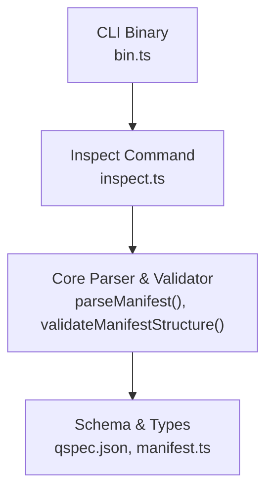
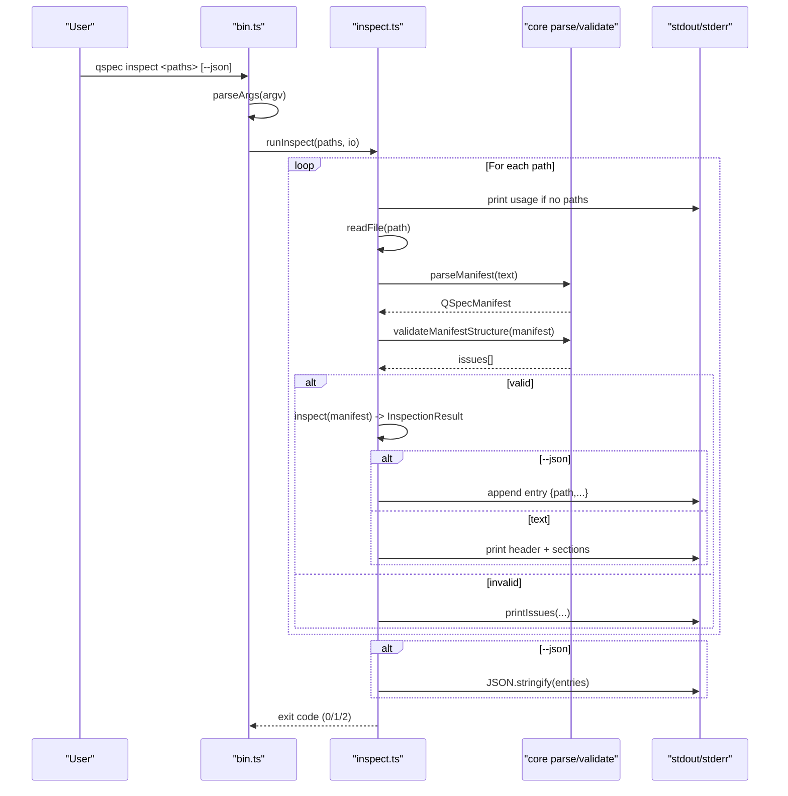
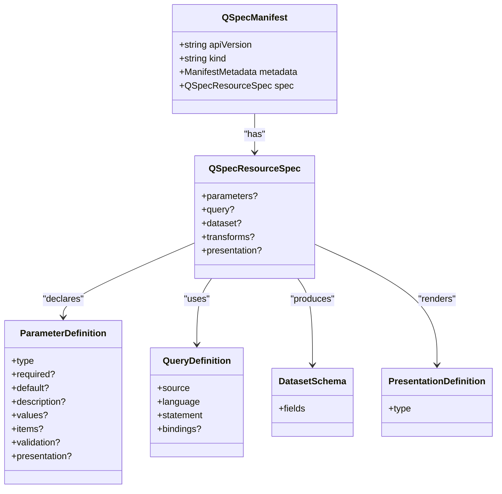
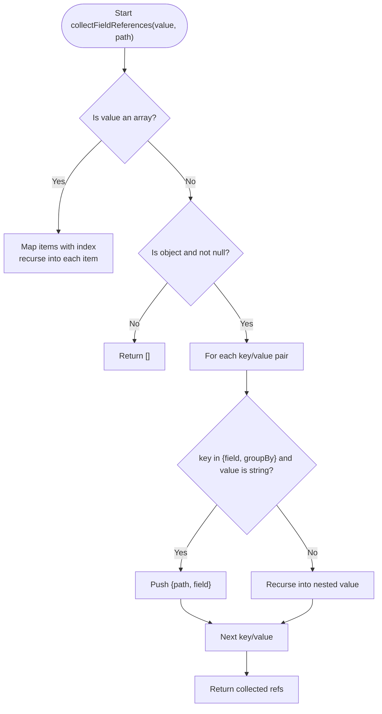
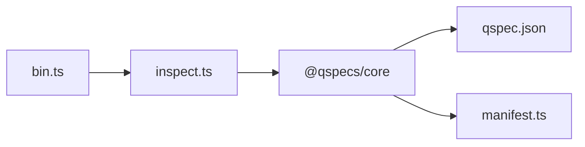

# Inspect Command

<cite>
**Referenced Files in This Document**
- [inspect.ts](file://packages/cli/src/commands/inspect.ts)
- [bin.ts](file://packages/cli/src/bin.ts)
- [cli.md](file://docs/cli.md)
- [qspec.json](file://schemas/v1/qspec.json)
- [manifest.ts](file://packages/core/src/types/manifest.ts)
- [index.ts](file://packages/core/src/index.ts)
- [inspect.test.ts](file://packages/cli/src/commands/inspect.test.ts)
</cite>

## Table of Contents

1. Introduction
2. Project Structure
3. Core Components
4. Architecture Overview
5. Detailed Component Analysis
6. Dependency Analysis
7. Performance Considerations
8. Troubleshooting Guide
9. Conclusion
10. Appendices

## Introduction

The inspect command provides a safe, plugin-free way to read and summarize QSpec manifests. It reports resource identity, declared parameters, query metadata, dataset schema, and the dataset fields referenced by presentation definitions. It is designed for debugging manifests, understanding resource relationships, and generating documentation without executing user code or loading plugins.

Key characteristics:

- Reads manifest files from disk only; no data sources are contacted.
- Performs structural parsing and validation using core utilities.
- Outputs either human-readable sections or a structured JSON array via --json.
- Never loads transforms or presentation plugins; therefore it works even when plugins are not installed.

## Project Structure

The inspect command lives in the CLI package and delegates parsing/validation to the core package. The binary wires argument parsing to the inspect handler.

**Diagram sources**

- [bin.ts:56-113](file://packages/cli/src/bin.ts#L56-L113)
- [inspect.ts:1-12](file://packages/cli/src/commands/inspect.ts#L1-L12)
- [qspec.json:1-143](file://schemas/v1/qspec.json#L1-L143)
- [manifest.ts:1-40](file://packages/core/src/types/manifest.ts#L1-L40)

**Section sources**

- [bin.ts:56-113](file://packages/cli/src/bin.ts#L56-L113)
- [inspect.ts:1-12](file://packages/cli/src/commands/inspect.ts#L1-L12)
- [qspec.json:1-143](file://schemas/v1/qspec.json#L1-L143)
- [manifest.ts:1-40](file://packages/core/src/types/manifest.ts#L1-L40)

## Core Components

- Argument parsing and routing: bin.ts parses argv, recognizes inspect, enforces that --config is not used with inspect, and forwards paths to runInspect.
- Manifest inspection: inspect.ts reads each file, parses and validates the manifest, builds an InspectionResult summarizing resource identity, parameters, query, dataset, and presentation field references, then renders output.
- Output formats:
  - Human-readable: aligned sections per SPEC.md §87 (Resource, Parameters, Query, Dataset, Presentation).
  - Machine-readable: --json emits a single JSON array with one entry per successfully inspected manifest.
- Field reference discovery: a generic walker finds dataset field references inside spec.presentation by recognizing known property names (field, groupBy), independent of any presentation plugin.

**Section sources**

- [bin.ts:56-113](file://packages/cli/src/bin.ts#L56-L113)
- [inspect.ts:116-166](file://packages/cli/src/commands/inspect.ts#L116-L166)
- [inspect.ts:168-246](file://packages/cli/src/commands/inspect.ts#L168-L246)
- [inspect.ts:265-327](file://packages/cli/src/commands/inspect.ts#L265-L327)
- [cli.md:114-198](file://docs/cli.md#L114-L198)

## Architecture Overview

The inspect workflow is intentionally minimal and deterministic:

**Diagram sources**

- [bin.ts:56-113](file://packages/cli/src/bin.ts#L56-L113)
- [inspect.ts:265-327](file://packages/cli/src/commands/inspect.ts#L265-L327)
- [inspect.ts:116-166](file://packages/cli/src/commands/inspect.ts#L116-L166)

## Detailed Component Analysis

### Command Entry and Options

- Supported options:
  - --json: Emit a JSON array of inspection entries instead of human-readable text. Always an array, even for a single manifest.
  - --config: Not supported by inspect; passing it returns a usage error (exit code 2).
- Behavior:
  - If no paths are provided, prints usage and exits with code 2.
  - For each path, reads the file, parses, validates structure, and produces output.
  - Exit codes: 0 success, 1 failure on read/parse/validation errors, 2 usage errors.

**Section sources**

- [bin.ts:56-113](file://packages/cli/src/bin.ts#L56-L113)
- [inspect.ts:265-327](file://packages/cli/src/commands/inspect.ts#L265-L327)
- [cli.md:114-198](file://docs/cli.md#L114-L198)

### Manifest Inspection Logic

- Resource identity: name, kind, apiVersion from manifest metadata and top-level fields.
- Parameters: enumerates declared parameters with type and required flag.
- Query: reports source and language (not the statement itself).
- Dataset: lists fields with type and optional semanticType.
- Presentation: reports type and discovered dataset field references grouped by top-level presentation keys.

Field reference discovery:

- Walks spec.presentation recursively.
- Recognizes property names field and groupBy as dataset field references.
- Groups references by their top-level key for readable output.

Transforms:

- Not included in inspect output; inspect deliberately avoids resolving transforms against a registry.

**Section sources**

- [inspect.ts:116-166](file://packages/cli/src/commands/inspect.ts#L116-L166)
- [inspect.ts:168-246](file://packages/cli/src/commands/inspect.ts#L168-L246)

### Output Formats

#### Human-readable (default)

- Sections printed in order: Resource, Parameters, Query, Dataset, Presentation.
- Alignment uses column widths based on content.
- Each file gets a per-file header indicating validity and path.

Example shape (from tests):

- Resource block with Name, Kind, API.
- Parameters table with name, type, required/optional.
- Query block with Source and Language.
- Dataset block with name and type (and semanticType when present).
- Presentation block with Type and grouped field references.

**Section sources**

- [inspect.ts:191-246](file://packages/cli/src/commands/inspect.ts#L191-L246)
- [inspect.test.ts:58-81](file://packages/cli/src/commands/inspect.test.ts#L58-L81)
- [cli.md:127-152](file://docs/cli.md#L127-L152)

#### JSON (--json)

- Emits a JSON array where each element contains:
  - path: original file path
  - resource: { name, kind, apiVersion }
  - parameters: [{ name, type, required }]
  - query?: { source, language }
  - dataset: [{ name, type, semanticType? }]
  - presentation?: { type, fieldReferences: [{ path, field }] }
- Always an array, even for one manifest.
- Failed manifests contribute no entry but still produce diagnostics and non-zero exit.

**Section sources**

- [inspect.ts:36-58](file://packages/cli/src/commands/inspect.ts#L36-L58)
- [inspect.ts:307-323](file://packages/cli/src/commands/inspect.ts#L307-L323)
- [inspect.test.ts:156-231](file://packages/cli/src/commands/inspect.test.ts#L156-L231)
- [cli.md:161-198](file://docs/cli.md#L161-L198)

### Data Model Relationships

**Diagram sources**

- [manifest.ts:10-40](file://packages/core/src/types/manifest.ts#L10-L40)
- [qspec.json:25-140](file://schemas/v1/qspec.json#L25-L140)

### Processing Flow for Field References

**Diagram sources**

- [inspect.ts:85-114](file://packages/cli/src/commands/inspect.ts#L85-L114)

## Dependency Analysis

- bin.ts depends on inspect.ts for the inspect command and on color support for output styling.
- inspect.ts depends on:
  - Node fs/promises for reading files.
  - @qspecs/core for parseManifest, validateManifestStructure, and types.
  - Local helpers for color and shared issue printing utilities.
- Core types and schema define the contract for manifests, parameters, queries, datasets, and presentations.

**Diagram sources**

- [bin.ts:1-8](file://packages/cli/src/bin.ts#L1-L8)
- [inspect.ts:1-12](file://packages/cli/src/commands/inspect.ts#L1-L12)
- [index.ts:14-71](file://packages/core/src/index.ts#L14-L71)
- [qspec.json:1-143](file://schemas/v1/qspec.json#L1-L143)
- [manifest.ts:1-40](file://packages/core/src/types/manifest.ts#L1-L40)

**Section sources**

- [bin.ts:1-8](file://packages/cli/src/bin.ts#L1-L8)
- [inspect.ts:1-12](file://packages/cli/src/commands/inspect.ts#L1-L12)
- [index.ts:14-71](file://packages/core/src/index.ts#L14-L71)

## Performance Considerations

- File I/O: Sequential reads per path; consider batching or parallelization at the caller level if inspecting many large manifests.
- Parsing and validation: Lightweight structural checks; no plugin execution or network calls.
- Output generation: Minimal transformations; grouping and width calculations are linear in the size of parameters/dataset/presentation references.
- Memory: No caching; results are streamed to stdout. JSON mode accumulates entries in memory before printing; for very large batches, consider streaming consumers.

[No sources needed since this section provides general guidance]

## Troubleshooting Guide

Common issues and behaviors:

- Missing paths: Usage message and exit code 2.
- Unreadable file: Diagnostic printed; process continues with other paths; exit code 1 if any failure occurred.
- Malformed JSON: Human-friendly diagnostic; no stack traces; exit code 1.
- Structural validation failures: Issues printed with paths; no array entry in --json; exit code 1.
- Unknown flags: Caught by argument parser; usage error with exit code 2.
- --config with inspect: Explicitly rejected with usage error and exit code 2.

Exit codes summary:

- 0: All manifests processed successfully.
- 1: At least one manifest failed to read, parse, or validate.
- 2: Usage error (no paths, unknown command, unsupported flags).

**Section sources**

- [inspect.ts:265-327](file://packages/cli/src/commands/inspect.ts#L265-L327)
- [inspect.test.ts:281-331](file://packages/cli/src/commands/inspect.test.ts#L281-L331)
- [bin.ts:56-113](file://packages/cli/src/bin.ts#L56-L113)
- [cli.md:199-213](file://docs/cli.md#L199-L213)

## Conclusion

The inspect command offers a fast, safe, and predictable way to understand QSpec manifests without executing user code or connecting to data sources. It supports both human-readable and machine-readable outputs, enabling debugging, documentation generation, and automated analysis of manifest structure and presentation field usage.

[No sources needed since this section summarizes without analyzing specific files]

## Appendices

### Command Reference

- Command: qspec inspect
- Syntax: qspec inspect <manifest.json> [...] [--json]
- Options:
  - --json: Emit a JSON array of inspection entries.
  - --config: Not supported by inspect; results in a usage error.

**Section sources**

- [bin.ts:56-113](file://packages/cli/src/bin.ts#L56-L113)
- [cli.md:114-198](file://docs/cli.md#L114-L198)

### Example Workflows

- Inspect a single manifest in human-readable form:
  - qspec inspect examples/01-complete-manifest.qspec.json
- Inspect multiple manifests and export structured data:
  - qspec inspect examples/*.qspec.json --json > inspections.json
- Validate presence of dataset field references across presentations:
  - Use --json output and filter entries by presentation.fieldReferences[].field

**Section sources**

- [cli.md:114-198](file://docs/cli.md#L114-L198)
- [inspect.test.ts:156-231](file://packages/cli/src/commands/inspect.test.ts#L156-L231)
