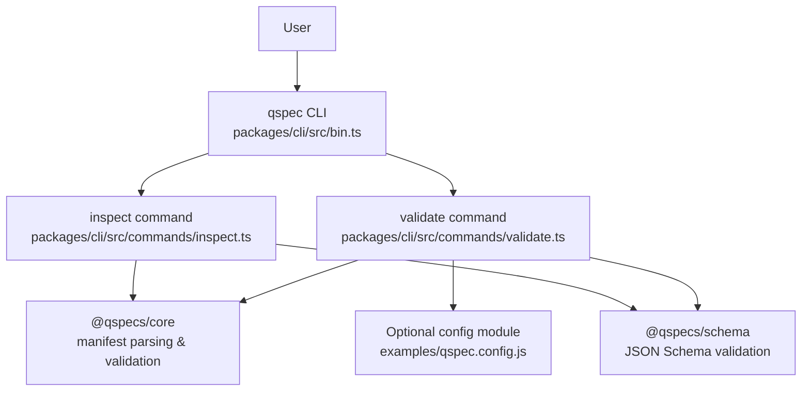
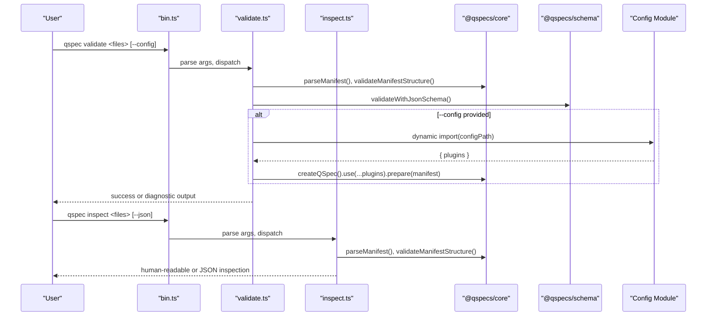
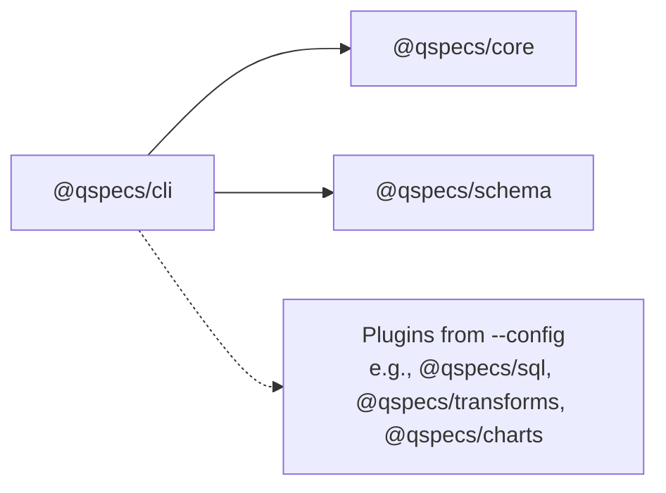

# Installation and Setup

<cite>
**Referenced Files in This Document**
- [packages/cli/package.json](file://packages/cli/package.json)
- [package.json](file://package.json)
- [README.md](file://README.md)
- [docs/cli.md](file://docs/cli.md)
- [docs/quick-start.md](file://docs/quick-start.md)
- [examples/qspec.config.js](file://examples/qspec.config.js)
- [packages/cli/src/bin.ts](file://packages/cli/src/bin.ts)
- [packages/cli/src/commands/validate.ts](file://packages/cli/src/commands/validate.ts)
- [packages/cli/src/commands/inspect.ts](file://packages/cli/src/commands/inspect.ts)
</cite>

## Table of Contents

1. [Introduction](#introduction)
2. [Project Structure](#project-structure)
3. [Core Components](#core-components)
4. [Architecture Overview](#architecture-overview)
5. [Detailed Component Analysis](#detailed-component-analysis)
6. [Dependency Analysis](#dependency-analysis)
7. [Performance Considerations](#performance-considerations)
8. [Troubleshooting Guide](#troubleshooting-guide)
9. [Conclusion](#conclusion)
10. [Appendices](#appendices)

## Introduction

This document explains how to install and set up the @qspecs/cli package, including Node.js requirements, installation options (global vs local), environment configuration, initial setup steps, creating a plugin-aware configuration for validation, and verifying that the CLI works. It also covers common troubleshooting scenarios such as permission issues, path resolution, and integration with development workflows.

## Project Structure

The repository is a monorepo where @qspecs/cli lives under packages/cli. The CLI exposes a binary named qspec that provides two commands: validate and inspect. The CLI depends on core runtime and schema packages for manifest parsing and validation. A sample plugin-aware configuration is provided in examples/qspec.config.js to enable richer validation beyond structural checks.

**Diagram sources**

- [packages/cli/src/bin.ts:1-149](file://packages/cli/src/bin.ts#L1-L149)
- [packages/cli/src/commands/validate.ts:1-262](file://packages/cli/src/commands/validate.ts#L1-L262)
- [packages/cli/src/commands/inspect.ts:1-327](file://packages/cli/src/commands/inspect.ts#L1-L327)
- [examples/qspec.config.js:1-19](file://examples/qspec.config.js#L1-L19)

**Section sources**

- [packages/cli/package.json:1-49](file://packages/cli/package.json#L1-L49)
- [package.json:1-45](file://package.json#L1-L45)
- [README.md:261-327](file://README.md#L261-L327)
- [docs/cli.md:1-226](file://docs/cli.md#L1-L226)

## Core Components

- Binary entry point: The CLI is exposed via the bin field in the package metadata, mapping to the compiled dist/bin.js. The source entry point is packages/cli/src/bin.ts.
- Commands:
  - validate: Performs structural validation and optional plugin-aware validation when --config is provided.
  - inspect: Reads manifests and prints static information about parameters, query, dataset, and presentation without loading plugins.
- Configuration:
  - Plugin-aware validation uses a config module that exports a plugins array. An example is provided at examples/qspec.config.js.

Key behaviors:

- Without --config, validate runs only structural checks and executes no user code.
- With --config, validate loads the config module, installs plugins, registers stub data sources for declared sources, and calls prepare() against each manifest to catch plugin-specific issues.
- inspect never loads plugins and does not call prepare().

**Section sources**

- [packages/cli/package.json:26-28](file://packages/cli/package.json#L26-L28)
- [packages/cli/src/bin.ts:9-32](file://packages/cli/src/bin.ts#L9-L32)
- [packages/cli/src/commands/validate.ts:94-156](file://packages/cli/src/commands/validate.ts#L94-L156)
- [packages/cli/src/commands/inspect.ts:116-166](file://packages/cli/src/commands/inspect.ts#L116-L166)
- [examples/qspec.config.js:1-19](file://examples/qspec.config.js#L1-L19)

## Architecture Overview

The CLI architecture centers around a small argv parser and two command handlers. The validate command optionally loads a user-provided config module to build a runtime with plugins and run prepare() against manifests. The inspect command reads and parses manifests and renders static information. Both commands rely on core and schema packages for parsing and validation.

**Diagram sources**

- [packages/cli/src/bin.ts:55-113](file://packages/cli/src/bin.ts#L55-L113)
- [packages/cli/src/commands/validate.ts:158-262](file://packages/cli/src/commands/validate.ts#L158-L262)
- [packages/cli/src/commands/inspect.ts:248-327](file://packages/cli/src/commands/inspect.ts#L248-L327)

## Detailed Component Analysis

### Prerequisites and Environment

- Node.js version: The CLI requires Node.js version greater than or equal to 22.19.
- System dependencies: None beyond Node.js. The CLI itself has no native system dependencies; it relies on Node’s built-in modules and the published packages.

**Section sources**

- [packages/cli/package.json:17-19](file://packages/cli/package.json#L17-L19)
- [package.json:10-12](file://package.json#L10-L12)

### Installation Methods

#### Local installation (recommended for projects)

Install the CLI into your project so you can invoke it via npm scripts or npx. This keeps versions scoped to the project and avoids global permission issues.

- Install as a dev dependency:
  - npm install --save-dev @qspecs/cli
  - yarn add --dev @qspecs/cli
- Run via npx:
  - npx qspec validate examples/01-complete-manifest.qspec.json
  - npx qspec inspect examples/01-complete-manifest.qspec.json --json

Notes:

- When installed locally, the binary is available through node_modules/.bin/qspec and npx resolves it automatically.
- You can add an npm script to wrap the CLI, e.g., "scripts": { "qspec:validate": "qspec validate ..." }.

**Section sources**

- [packages/cli/package.json:26-28](file://packages/cli/package.json#L26-L28)
- [README.md:261-327](file://README.md#L261-L327)
- [docs/quick-start.md:120-133](file://docs/quick-start.md#L120-L133)

#### Global installation

Install the CLI globally to access the qspec command from any directory.

- npm install -g @qspecs/cli
- yarn global add @qspecs/cli

Notes:

- On systems with strict permissions, you may need to adjust npm’s global prefix or use sudo carefully. See Troubleshooting Guide for guidance.
- Global installations are convenient for ad-hoc validation but can lead to version drift across projects.

**Section sources**

- [packages/cli/package.json:26-28](file://packages/cli/package.json#L26-L28)

#### Direct execution from source

If you are working within this repository, you can run the built CLI directly:

- node packages/cli/dist/bin.js validate examples/*.qspec.json
- node packages/cli/dist/bin.js inspect examples/*.qspec.json --json

**Section sources**

- [README.md:322-327](file://README.md#L322-L327)
- [docs/quick-start.md:120-133](file://docs/quick-start.md#L120-L133)

### Initial Setup Steps

1. Verify Node.js version:
   - Ensure Node.js >= 22.19.

2. Install the CLI:
   - Choose local or global installation as described above.

3. Create a plugin-aware configuration (optional but recommended):
   - Create a config file exporting a plugins array. An example exists at examples/qspec.config.js.
   - Typical plugins include sql(), transforms(), and charts() to enable richer validation.

4. Validate a manifest:
   - Structural validation only:
     - qspec validate examples/01-complete-manifest.qspec.json
   - Plugin-aware validation:
     - qspec validate examples/01-complete-manifest.qspec.json --config examples/qspec.config.js

5. Inspect a manifest:
   - Human-readable output:
     - qspec inspect examples/01-complete-manifest.qspec.json
   - Machine-readable JSON:
     - qspec inspect examples/01-complete-manifest.qspec.json --json

**Section sources**

- [docs/cli.md:15-113](file://docs/cli.md#L15-L113)
- [docs/cli.md:114-198](file://docs/cli.md#L114-L198)
- [examples/qspec.config.js:1-19](file://examples/qspec.config.js#L1-L19)

### Basic CLI Verification

After installation, verify the CLI is accessible:

- Show help:
  - qspec --help
- Show version:
  - qspec --version
- Validate a known good manifest:
  - qspec validate examples/01-complete-manifest.qspec.json
- Inspect a manifest:
  - qspec inspect examples/01-complete-manifest.qspec.json

Expected outcomes:

- Help displays usage and options.
- Version prints the CLI version number.
- Valid manifest prints a success message and resource details.
- Invalid manifest prints detailed diagnostics with paths and suggestions.

**Section sources**

- [packages/cli/src/bin.ts:9-32](file://packages/cli/src/bin.ts#L9-L32)
- [packages/cli/src/bin.ts:79-113](file://packages/cli/src/bin.ts#L79-L113)
- [docs/cli.md:15-113](file://docs/cli.md#L15-L113)

### Environment Configuration

- No special environment variables are required to run the CLI.
- For plugin-aware validation, provide a config module path via --config. The CLI dynamically imports the module and installs its plugins.
- The config module must export a plugins array. An example is provided in examples/qspec.config.js.

Important security note:

- Using --config executes arbitrary code from the specified module. Only use --config with trusted configuration files.

**Section sources**

- [docs/cli.md:53-87](file://docs/cli.md#L53-L87)
- [packages/cli/src/commands/validate.ts:127-156](file://packages/cli/src/commands/validate.ts#L127-L156)
- [examples/qspec.config.js:1-19](file://examples/qspec.config.js#L1-L19)

### Integration with Development Workflows

- CI pipelines:
  - Add a step to run qspec validate with --config to enforce plugin-aware checks on every commit.
  - Use exit codes to fail builds on invalid manifests.
- Pre-commit hooks:
  - Run qspec validate on changed manifest files before committing.
- Linting and reporting:
  - Use qspec inspect --json to generate machine-readable reports for dashboards or downstream tools.

Exit codes:

- 0: All manifests validated successfully.
- 1: At least one manifest failed to read, parse, or validate.
- 2: Usage error (e.g., unknown command, unrecognized flags, missing arguments).

**Section sources**

- [docs/cli.md:199-213](file://docs/cli.md#L199-L213)
- [packages/cli/src/bin.ts:61-75](file://packages/cli/src/bin.ts#L61-L75)

## Dependency Analysis

The CLI depends on:

- @qspecs/core: Manifest parsing, structure validation, and runtime preparation.
- @qspecs/schema: JSON Schema-based validation.

Optional plugin-aware validation depends on plugins exported by your config module (e.g., @qspecs/sql, @qspecs/transforms, @qspecs/charts).

**Diagram sources**

- [packages/cli/package.json:36-44](file://packages/cli/package.json#L36-L44)
- [examples/qspec.config.js:14-18](file://examples/qspec.config.js#L14-L18)

**Section sources**

- [packages/cli/package.json:36-44](file://packages/cli/package.json#L36-L44)
- [examples/qspec.config.js:14-18](file://examples/qspec.config.js#L14-L18)

## Performance Considerations

- Structural validation is fast and does not require plugins or network access.
- Plugin-aware validation performs additional checks via prepare() but still avoids executing queries by using stub data sources for declared sources.
- Avoid unnecessary plugin loading in CI by limiting --config to only the plugins needed for your manifests.

[No sources needed since this section provides general guidance]

## Troubleshooting Guide

Common installation issues:

- Node.js version mismatch:
  - Symptom: CLI fails to start or throws engine errors.
  - Resolution: Upgrade Node.js to >= 22.19.

- Permission problems (global install):
  - Symptom: npm/yarn cannot write to global directories.
  - Resolution: Adjust npm’s global prefix or use appropriate system permissions. Avoid sudo unless necessary.

- Path configuration:
  - Symptom: qspec command not found after global install.
  - Resolution: Ensure the global bin directory is in PATH. If using nvm, verify the active Node version includes the global bin path.

- Unknown command or flags:
  - Symptom: Exit code 2 with usage error.
  - Resolution: Check command spelling and supported flags. Use qspec --help for reference.

- Config module errors:
  - Symptom: Cannot load config or plugin registration failures.
  - Resolution: Verify the path passed to --config is correct and the module exports a plugins array. Ensure all referenced plugins are installed.

- File not found or parse errors:
  - Symptom: Validation fails with read or parse errors.
  - Resolution: Confirm manifest paths exist and contain valid JSON. Use inspect to diagnose structural issues.

- Unrecognized flags:
  - Symptom: Exit code 2 due to unknown option.
  - Resolution: Review supported flags. Note that --json applies only to inspect; passing it to validate is silently accepted but has no effect.

- macOS symlink behavior:
  - The CLI handles symlinks robustly when determining whether it is the entry point. If invoking via node directly, ensure the resolved path matches the expected entry point.

**Section sources**

- [packages/cli/package.json:17-19](file://packages/cli/package.json#L17-L19)
- [docs/cli.md:199-213](file://docs/cli.md#L199-L213)
- [packages/cli/src/bin.ts:61-75](file://packages/cli/src/bin.ts#L61-L75)
- [packages/cli/src/bin.ts:116-149](file://packages/cli/src/bin.ts#L116-L149)
- [packages/cli/src/commands/validate.ts:169-181](file://packages/cli/src/commands/validate.ts#L169-L181)
- [packages/cli/src/commands/inspect.ts:265-287](file://packages/cli/src/commands/inspect.ts#L265-L287)

## Conclusion

You can install @qspecs/cli locally or globally and use it to validate and inspect QSpec manifests. For robust validation, provide a plugin-aware configuration via --config to catch plugin-specific issues without executing queries. The CLI integrates well into CI and pre-commit workflows using its deterministic exit codes and machine-readable output modes.

[No sources needed since this section summarizes without analyzing specific files]

## Appendices

### Example Scenarios

- Local project validation:
  - Install @qspecs/cli as a dev dependency.
  - Add an npm script to run qspec validate with --config.
  - Commit manifests and run the script in CI.

- Global quick checks:
  - Install @qspecs/cli globally.
  - Run qspec validate on any manifest file from the terminal.

- Inspecting manifests for documentation:
  - Use qspec inspect --json to generate structured reports for tooling.

**Section sources**

- [README.md:261-327](file://README.md#L261-L327)
- [docs/cli.md:114-198](file://docs/cli.md#L114-L198)
- [examples/qspec.config.js:1-19](file://examples/qspec.config.js#L1-L19)
