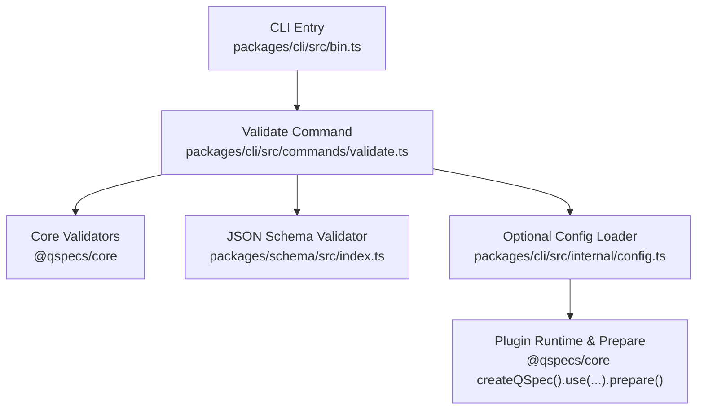
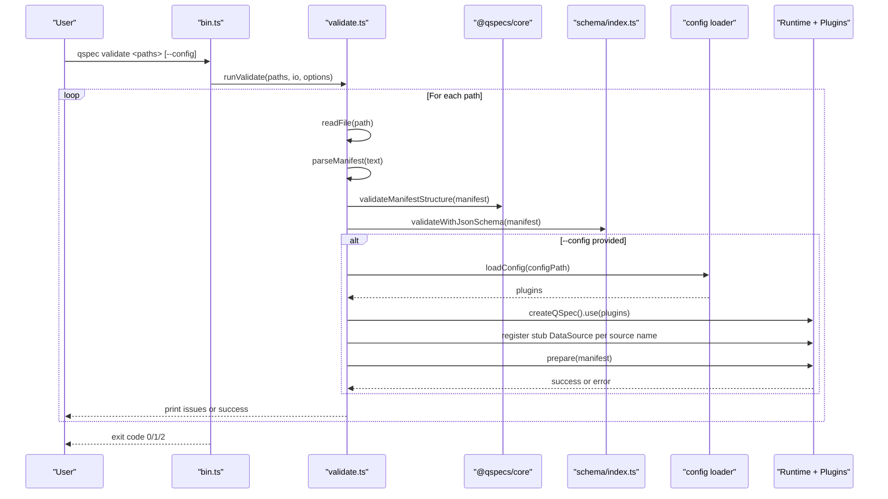
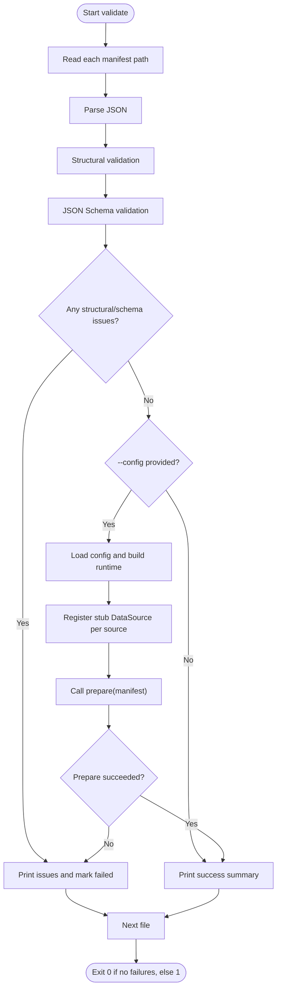
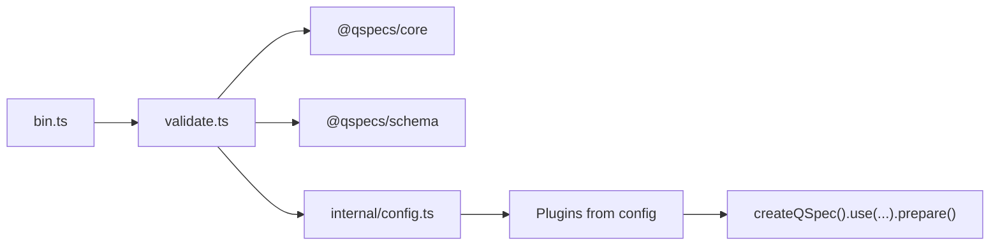

# Validate Command

<cite>
**Referenced Files in This Document**
- [bin.ts](file://packages/cli/src/bin.ts)
- [validate.ts](file://packages/cli/src/commands/validate.ts)
- [cli.md](file://docs/cli.md)
- [ci.yml](file://.github/workflows/ci.yml)
- [qspec.config.js](file://examples/qspec.config.js)
- [index.ts (schema)](file://packages/schema/src/index.ts)
- [01-complete-manifest.qspec.json](file://examples/01-complete-manifest.qspec.json)
- [bad-binding.qspec.json](file://fixtures/invalid/bad-binding.qspec.json)
</cite>

## Table of Contents

1. [Introduction](#introduction)
2. [Project Structure](#project-structure)
3. [Core Components](#core-components)
4. [Architecture Overview](#architecture-overview)
5. [Detailed Component Analysis](#detailed-component-analysis)
6. [Dependency Analysis](#dependency-analysis)
7. [Performance Considerations](#performance-considerations)
8. [Troubleshooting Guide](#troubleshooting-guide)
9. [Conclusion](#conclusion)
10. [Appendices](#appendices)

## Introduction

The validate command checks QSpec manifest files against the schema specification and, optionally, against plugin-aware rules. It supports validating single files, multiple files, and directory structures via shell expansion. It provides human-readable output by default and integrates with CI/CD pipelines through deterministic exit codes. With the optional plugin configuration flag, it can run static preparation to catch transform, query-language, and presentation issues that structural validation alone cannot detect.

## Project Structure

The validate command is implemented in the CLI package and orchestrates file reading, parsing, structural validation, JSON Schema validation, and optional plugin-aware preparation. The CLI entry point parses arguments and dispatches to the validate implementation.

**Diagram sources**

- [bin.ts:55-114](file://packages/cli/src/bin.ts#L55-L114)
- [validate.ts:158-261](file://packages/cli/src/commands/validate.ts#L158-L261)
- [index.ts (schema):43-64](file://packages/schema/src/index.ts#L43-L64)

**Section sources**

- [bin.ts:55-114](file://packages/cli/src/bin.ts#L55-L114)
- [validate.ts:158-261](file://packages/cli/src/commands/validate.ts#L158-L261)
- [cli.md:1-226](file://docs/cli.md#L1-L226)

## Core Components

- Argument parsing and command routing: Parses flags and routes to validate or inspect.
- File I/O and parsing: Reads manifests from disk and parses JSON into objects.
- Structural validation: Validates manifest shape using core validators.
- JSON Schema validation: Validates against the published schema for editor/CI use.
- Optional plugin-aware validation: Loads a config module, installs plugins, registers stub data sources, and runs prepare() to catch deeper issues without executing queries.
- Diagnostics rendering: Formats errors with paths and suggestions; prints success summaries.
- Exit codes: Returns standardized codes for usage, validation failures, and internal mismatches.

**Section sources**

- [bin.ts:55-114](file://packages/cli/src/bin.ts#L55-L114)
- [validate.ts:158-261](file://packages/cli/src/commands/validate.ts#L158-L261)
- [cli.md:15-113](file://docs/cli.md#L15-L113)
- [index.ts (schema):43-64](file://packages/schema/src/index.ts#L43-L64)

## Architecture Overview

The validate command follows a layered pipeline:

- Parse argv and route to validate.
- For each manifest path:
  - Read file content.
  - Parse JSON.
  - Run structural validation.
  - Run JSON Schema validation.
  - If a config is provided, build a runtime with plugins and call prepare() using stub data sources.
  - Print diagnostics or success summary.
  - Accumulate failure state for exit code.

**Diagram sources**

- [bin.ts:55-114](file://packages/cli/src/bin.ts#L55-L114)
- [validate.ts:127-156](file://packages/cli/src/commands/validate.ts#L127-L156)
- [validate.ts:183-261](file://packages/cli/src/commands/validate.ts#L183-L261)
- [index.ts (schema):43-64](file://packages/schema/src/index.ts#L43-L64)

## Detailed Component Analysis

### Command-line Options and Usage

- Basic usage: `qspec validate <manifest.json> [...]`
- Plugin-aware mode: `qspec validate --config <path> <manifest.json> [...]`
- Help and version flags are supported globally.
- The `--json` flag is accepted by validate but has no effect; it only applies to inspect.

Output modes:

- Human-readable output by default, including success lines and detailed issue paths with suggestions when available.
- No machine-readable JSON output for validate; use inspect with `--json` for structured inspection results.

Validation modes:

- Structural-only (default): validates manifest shape and schema without loading plugins or user code.
- Plugin-aware (opt-in via `--config`): loads a config module exporting a `plugins` array, builds a runtime, installs plugins, registers stub data sources for declared sources, and calls `prepare()` to catch transform/query/presentation defects.

File path specifications:

- Accepts one or more file paths.
- Directory structures can be validated using shell expansion (e.g., `*.qspec.json`).

Examples:

- Single file: `qspec validate report.json`
- Multiple files: `qspec validate a.qspec.json b.qspec.json`
- Directory structure: `qspec validate examples/*.qspec.json`
- Plugin-aware: `qspec validate --config examples/qspec.config.js examples/*.qspec.json`

**Section sources**

- [bin.ts:9-32](file://packages/cli/src/bin.ts#L9-L32)
- [bin.ts:55-114](file://packages/cli/src/bin.ts#L55-L114)
- [cli.md:15-113](file://docs/cli.md#L15-L113)
- [qspec.config.js:1-19](file://examples/qspec.config.js#L1-L19)

### Error Reporting and Warnings

- Errors include exact paths into the manifest and, where applicable, “Did you mean” suggestions.
- Aggregate messages (e.g., invalid JSON) are surfaced above per-issue details for clarity.
- Unknown resource kinds, languages, or data sources surface hints via core errors lifted into issues.
- Internal validator mismatch (core accepts while schema rejects) is reported as an error condition.

Warning levels:

- There is no separate warning level; all diagnostics are printed as issues. Success is indicated by a green checkmark and summary lines.

Exit codes:

- 0: All manifests read, parsed, and validated successfully (and prepared if `--config` was used).
- 1: At least one manifest failed to read, parse, or validate; also used for internal validator mismatch.
- 2: Usage error such as no paths given, unknown command, unsupported flag combination, or unrecognized flag.

**Section sources**

- [validate.ts:25-92](file://packages/cli/src/commands/validate.ts#L25-L92)
- [validate.ts:183-261](file://packages/cli/src/commands/validate.ts#L183-L261)
- [cli.md:199-213](file://docs/cli.md#L199-L213)

### Integration with CI/CD Pipelines

- CI validates fixtures structurally and examples plugin-awarely using the CLI.
- Steps ensure both structural and plugin-aware validation run across Node versions and fail fast on any issue.
- Example commands:
  - `node packages/cli/dist/bin.js validate fixtures/valid/*.qspec.json`
  - `node packages/cli/dist/bin.js validate --config examples/qspec.config.js examples/*.qspec.json`

Pre-commit hooks:

- Integrate by invoking the same commands used in CI to enforce local validation before commits.
- Use shell expansion to target changed manifests or directories.

Automated workflows:

- Add steps to validate all manifests in your repository using the CLI.
- Prefer plugin-aware validation in CI to catch operator and binding issues not visible to structural validation.

**Section sources**

- [ci.yml:151-163](file://.github/workflows/ci.yml#L151-L163)
- [cli.md:109-113](file://docs/cli.md#L109-L113)

### Advanced Validation Options and Custom Validators

- Plugin-aware validation via `--config`:
  - Load a config module exporting a `plugins` array.
  - Builds a runtime, installs plugins, and calls `prepare()` against each manifest.
  - Registers stub data sources for declared sources so `prepare()` completes without credentials or real connections.
- Custom validators:
  - Implement plugin `validate()` hooks to add domain-specific checks.
  - Include these plugins in your config module to enable them during validation.
- Debugging validation errors:
  - Review detailed paths and suggestions in the printed issues.
  - Use plugin-aware mode to surface issues that require registry context (transform operators, SQL bindings, presentation field references).
  - Confirm that your config includes all necessary plugins for the manifests being validated.

**Section sources**

- [validate.ts:94-156](file://packages/cli/src/commands/validate.ts#L94-L156)
- [cli.md:53-113](file://docs/cli.md#L53-L113)
- [qspec.config.js:1-19](file://examples/qspec.config.js#L1-L19)

### Data Flow and Processing Logic

**Diagram sources**

- [validate.ts:183-261](file://packages/cli/src/commands/validate.ts#L183-L261)
- [validate.ts:127-156](file://packages/cli/src/commands/validate.ts#L127-L156)

## Dependency Analysis

The validate command depends on:

- Core library for manifest parsing, structural validation, and runtime preparation.
- Schema package for JSON Schema validation used by editors and CI.
- CLI internals for argument parsing, color support, and optional config loading.
- Plugins installed via a config module to enable advanced validation.

**Diagram sources**

- [bin.ts:55-114](file://packages/cli/src/bin.ts#L55-L114)
- [validate.ts:158-261](file://packages/cli/src/commands/validate.ts#L158-L261)
- [index.ts (schema):43-64](file://packages/schema/src/index.ts#L43-L64)

**Section sources**

- [bin.ts:55-114](file://packages/cli/src/bin.ts#L55-L114)
- [validate.ts:158-261](file://packages/cli/src/commands/validate.ts#L158-L261)
- [index.ts (schema):43-64](file://packages/schema/src/index.ts#L43-L64)

## Performance Considerations

- Structural and schema validation are lightweight and suitable for large batches of manifests.
- Plugin-aware validation invokes `prepare()` per manifest; avoid unnecessary plugin complexity in CI configs to keep validation fast.
- Stub data sources prevent network access and database queries during validation.
- Prefer targeted globs in CI to validate only changed files when possible.

[No sources needed since this section provides general guidance]

## Troubleshooting Guide

Common issues and resolutions:

- Malformed JSON: Ensure the manifest is valid JSON; the CLI surfaces aggregate messages alongside per-issue details.
- Missing file: Verify paths exist and are accessible; the CLI reports unreadable files with their paths.
- Unknown transform or binding: Enable plugin-aware validation with `--config` to catch registry-dependent issues.
- Validator mismatch: Indicates a discrepancy between core and schema validators; report as a bug.
- Usage errors: Provide at least one path; avoid unsupported flags like `--json` for validate.

Diagnostics features:

- Paths pinpoint exact locations in the manifest.
- Suggestions help correct typos in names and fields.
- Success summaries confirm API version, kind, and name for valid manifests.

**Section sources**

- [validate.ts:183-261](file://packages/cli/src/commands/validate.ts#L183-L261)
- [cli.md:199-213](file://docs/cli.md#L199-L213)

## Conclusion

The validate command provides robust, developer-friendly validation for QSpec manifests. It supports both structural and plugin-aware modes, offers clear diagnostics with paths and suggestions, and integrates seamlessly into CI/CD pipelines. Use plugin-aware validation to catch deep issues and rely on standardized exit codes for automation.

[No sources needed since this section summarizes without analyzing specific files]

## Appendices

### Examples of Validating Manifests

- Single file: `qspec validate report.json`
- Multiple files: `qspec validate a.qspec.json b.qspec.json`
- Directory structure: `qspec validate examples/*.qspec.json`
- Plugin-aware: `qspec validate --config examples/qspec.config.js examples/*.qspec.json`

**Section sources**

- [cli.md:15-113](file://docs/cli.md#L15-L113)
- [ci.yml:151-163](file://.github/workflows/ci.yml#L151-L163)

### Sample Manifests Referenced

- Complete chart manifest demonstrating parameters, query, dataset, transforms, and presentation.
- Invalid binding example illustrating a case caught by plugin-aware validation.

**Section sources**

- [01-complete-manifest.qspec.json:1-90](file://examples/01-complete-manifest.qspec.json#L1-L90)
- [bad-binding.qspec.json:1-14](file://fixtures/invalid/bad-binding.qspec.json#L1-L14)
