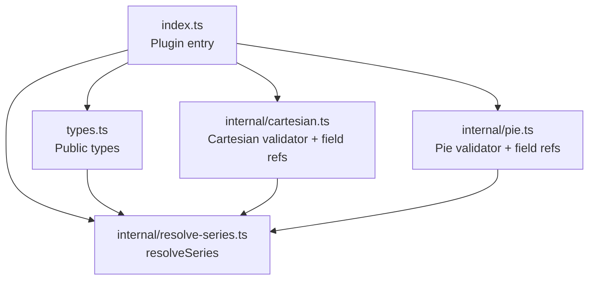
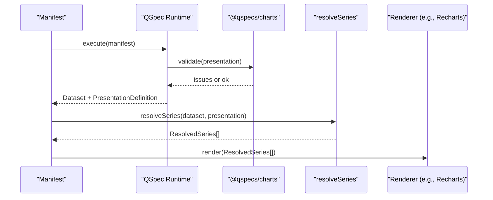
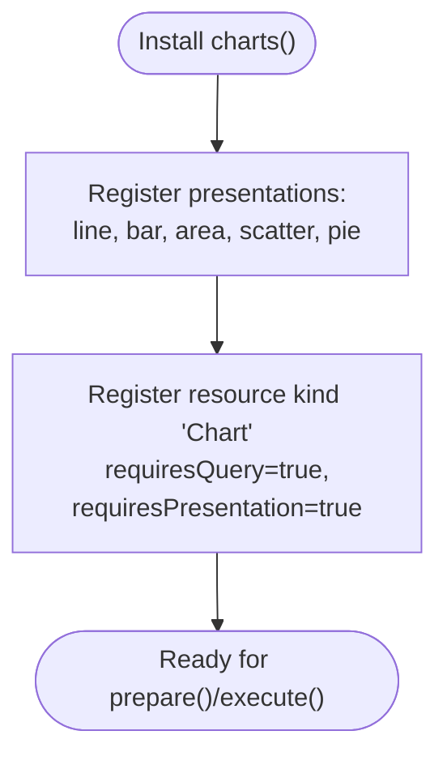
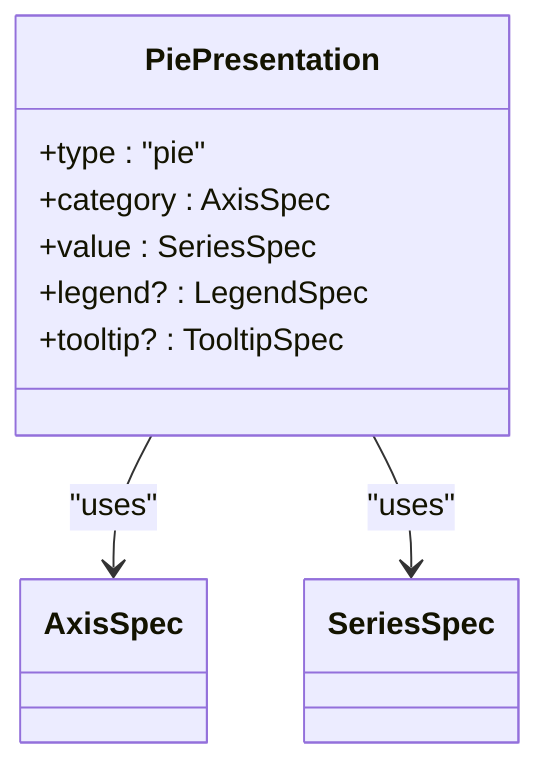
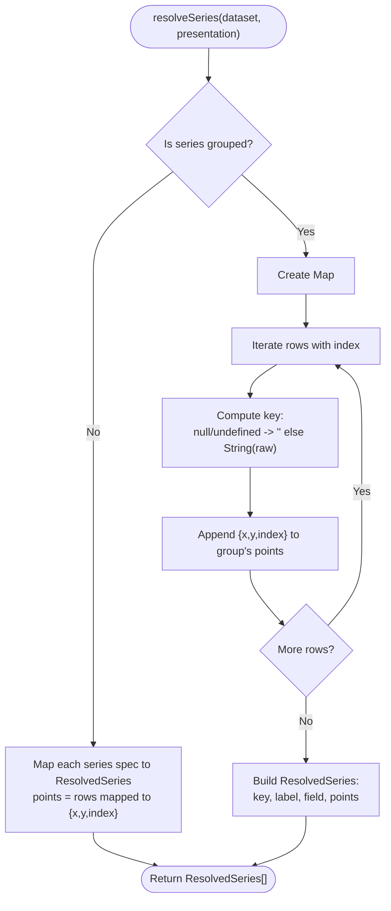
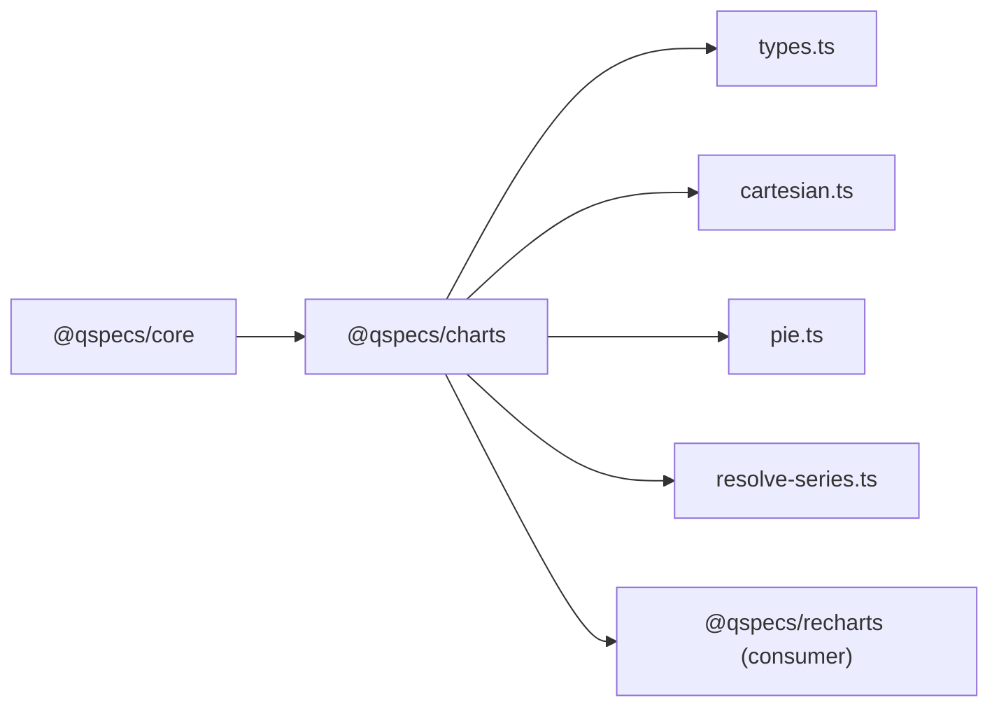

# Chart Presentations (@qspecs/charts)

<cite>
**Referenced Files in This Document**
- [README.md](file://README.md)
- [presentations.md](file://docs/presentations.md)
- [index.ts](file://packages/charts/src/index.ts)
- [types.ts](file://packages/charts/src/types.ts)
- [cartesian.ts](file://packages/charts/src/internal/cartesian.ts)
- [pie.ts](file://packages/charts/src/internal/pie.ts)
- [resolve-series.ts](file://packages/charts/src/internal/resolve-series.ts)
- [10-chart-grouped-series.qspec.json](file://examples/10-chart-grouped-series.qspec.json)
- [11-chart-pie.qspec.json](file://examples/11-chart-pie.qspec.json)
</cite>

## Table of Contents

1. [Introduction](#introduction)
2. [Project Structure](#project-structure)
3. [Core Components](#core-components)
4. [Architecture Overview](#architecture-overview)
5. [Detailed Component Analysis](#detailed-component-analysis)
6. [Dependency Analysis](#dependency-analysis)
7. [Performance Considerations](#performance-considerations)
8. [Troubleshooting Guide](#troubleshooting-guide)
9. [Conclusion](#conclusion)
10. [Appendices](#appendices)

## Introduction

This document explains the chart presentation models and rendering infrastructure provided by the @qspecs/charts package. It covers supported chart types, configuration options, series resolution, data mapping, axis configuration, styling customization, responsive design principles, accessibility considerations, performance optimization for large datasets, integration with popular charting libraries, export capabilities, and cross-browser compatibility. The package defines chart semantics and resolves plottable series without rendering pixels; actual rendering is delegated to renderer packages such as @qspecs/recharts.

Key points:

- @qspecs/charts registers five presentation types: line, bar, area, scatter, and pie.
- It provides a shared resolver, resolveSeries, that turns a dataset and a Cartesian presentation into one or more ResolvedSeries ready for any renderer.
- It does not render charts itself; it only defines chart semantics and series resolution.

**Section sources**

- [README.md:1-33](file://README.md#L1-L33)
- [presentations.md:1-11](file://docs/presentations.md#L1-L11)

## Project Structure

The @qspecs/charts package exposes a plugin that registers presentation types and a Chart resource kind, along with public types and the resolveSeries function. Internally, it implements validation and field-reference extraction for both Cartesian and pie presentations, and performs series resolution.



**Diagram sources**

- [index.ts:1-55](file://packages/charts/src/index.ts#L1-L55)
- [cartesian.ts:1-161](file://packages/charts/src/internal/cartesian.ts#L1-L161)
- [pie.ts:1-96](file://packages/charts/src/internal/pie.ts#L1-L96)
- [types.ts:1-87](file://packages/charts/src/types.ts#L1-L87)
- [resolve-series.ts:1-86](file://packages/charts/src/internal/resolve-series.ts#L1-L86)

**Section sources**

- [index.ts:1-55](file://packages/charts/src/index.ts#L1-L55)
- [types.ts:1-87](file://packages/charts/src/types.ts#L1-L87)

## Core Components

- Presentation plugin: Registers line, bar, area, scatter, and pie presentation types and the Chart resource kind with requirements for query and presentation.
- Types: AxisSpec, SeriesSpec, GroupedSeriesSpec, LegendSpec, TooltipSpec, CartesianPresentation, PiePresentation, SeriesPoint, ResolvedSeries, and a grouped-series guard.
- Validators and field references: Validate presentation shapes and extract dataset field references for static validation.
- Series resolver: Converts a dataset and a Cartesian presentation into ResolvedSeries arrays suitable for rendering.

Supported chart types:

- Line, bar, area, scatter (Cartesian): x axis plus one or more series.
- Pie: category and value fields; no x axis or series list.

Configuration highlights:

- AxisSpec: field and optional label.
- SeriesSpec: field and optional label.
- GroupedSeriesSpec: field, groupBy, and optional label.
- LegendSpec and TooltipSpec: visibility toggles.

**Section sources**

- [index.ts:19-55](file://packages/charts/src/index.ts#L19-L55)
- [types.ts:1-87](file://packages/charts/src/types.ts#L1-L87)
- [cartesian.ts:18-151](file://packages/charts/src/internal/cartesian.ts#L18-L151)
- [pie.ts:18-86](file://packages/charts/src/internal/pie.ts#L18-L86)

## Architecture Overview

@qspecs/charts integrates with the QSpec runtime via a plugin. It declares presentation types and a Chart resource kind, validates definitions, extracts field references, and resolves series. Renderers consume the resolved series without needing to re-implement grouping logic or null handling.



**Diagram sources**

- [index.ts:19-55](file://packages/charts/src/index.ts#L19-L55)
- [cartesian.ts:18-151](file://packages/charts/src/internal/cartesian.ts#L18-L151)
- [pie.ts:18-86](file://packages/charts/src/internal/pie.ts#L18-L86)
- [resolve-series.ts:12-86](file://packages/charts/src/internal/resolve-series.ts#L12-L86)

## Detailed Component Analysis

### Presentation Plugin and Resource Kind

The plugin registers five presentation types under distinct names and registers the Chart resource kind requiring both a query and a presentation. This ensures manifests are validated early and cannot produce empty results at execution time.



**Diagram sources**

- [index.ts:19-55](file://packages/charts/src/index.ts#L19-L55)

**Section sources**

- [index.ts:19-55](file://packages/charts/src/index.ts#L19-L55)

### Cartesian Presentations (line, bar, area, scatter)

All four share the same shape: an x axis and one or more series. Validation enforces required fields, guards against duplicates in explicit series arrays, and supports grouped series. Field references include x.field, each series.field, and optionally series.groupBy.

Key behaviors:

- Explicit series array: each entry becomes one ResolvedSeries keyed by its field name.
- Grouped series: rows partitioned by groupBy into multiple ResolvedSeries, preserving first-appearance order and merging null/undefined with empty-string groups under a special label.
- Optional y.label for axis labeling.

```mermaid
classDiagram
class CartesianPresentation {
+type : "line" | "bar" | "area" | "scatter"
+x : AxisSpec
+series : SeriesSpec[] | GroupedSeriesSpec
+y? : { label? : string }
+legend? : LegendSpec
+tooltip? : TooltipSpec
}
class AxisSpec {
+field : string
+label? : string
}
class SeriesSpec {
+field : string
+label? : string
}
class GroupedSeriesSpec {
+field : string
+groupBy : string
+label? : string
}
CartesianPresentation --> AxisSpec : "uses"
CartesianPresentation --> SeriesSpec : "uses"
CartesianPresentation --> GroupedSeriesSpec : "uses"
```

**Diagram sources**

- [types.ts:3-43](file://packages/charts/src/types.ts#L3-L43)
- [cartesian.ts:18-151](file://packages/charts/src/internal/cartesian.ts#L18-L151)

**Section sources**

- [cartesian.ts:18-151](file://packages/charts/src/internal/cartesian.ts#L18-L151)
- [types.ts:3-43](file://packages/charts/src/types.ts#L3-L43)

### Pie Presentation

A pie presentation uses category and value fields to describe slices. There is no x axis and no series list. Validation ensures both category and value objects exist and contain non-empty field strings. Field references include category.field and value.field.



**Diagram sources**

- [types.ts:80-86](file://packages/charts/src/types.ts#L80-L86)
- [pie.ts:18-86](file://packages/charts/src/internal/pie.ts#L18-L86)

**Section sources**

- [pie.ts:18-86](file://packages/charts/src/internal/pie.ts#L18-L86)
- [types.ts:80-86](file://packages/charts/src/types.ts#L80-L86)

### Series Resolution and Data Mapping

resolveSeries converts a dataset and a Cartesian presentation into ResolvedSeries. For explicit series, each series maps every row to a point. For grouped series, rows are partitioned by groupBy into per-group series, preserving dataset order within groups and using first-appearance order across groups. Nullish and empty-string group values merge into one series labeled "(none)". Each point carries index to enable downstream renderers to reconstruct global ordering when pivoting multiple series onto a shared axis.



**Diagram sources**

- [resolve-series.ts:12-86](file://packages/charts/src/internal/resolve-series.ts#L12-L86)

**Section sources**

- [resolve-series.ts:12-86](file://packages/charts/src/internal/resolve-series.ts#L12-L86)
- [presentations.md:121-210](file://docs/presentations.md#L121-L210)

### Examples: Grouped Line and Pie

- Grouped line chart manifest demonstrates dynamic series derived from a grouping field.
- Pie chart manifest demonstrates category/value mapping for slice sizing.

Use these examples as reference configurations for your own manifests.

**Section sources**

- [10-chart-grouped-series.qspec.json:1-44](file://examples/10-chart-grouped-series.qspec.json#L1-L44)
- [11-chart-pie.qspec.json:1-31](file://examples/11-chart-pie.qspec.json#L1-L31)

## Dependency Analysis

@qspecs/charts depends on @qspecs/core for the plugin system, presentation registry, and type contracts. It exports types and utilities consumed by renderer packages like @qspecs/recharts.



**Diagram sources**

- [index.ts:1-55](file://packages/charts/src/index.ts#L1-L55)
- [types.ts:1-87](file://packages/charts/src/types.ts#L1-L87)
- [cartesian.ts:1-161](file://packages/charts/src/internal/cartesian.ts#L1-L161)
- [pie.ts:1-96](file://packages/charts/src/internal/pie.ts#L1-L96)
- [resolve-series.ts:1-86](file://packages/charts/src/internal/resolve-series.ts#L1-L86)

**Section sources**

- [index.ts:1-55](file://packages/charts/src/index.ts#L1-L55)

## Performance Considerations

- Series resolution allocates new arrays and objects for each call, allowing callers to mutate results safely. Point values reference original dataset cells to avoid cloning costs on large datasets.
- Grouped series preserve first-appearance order and use a Map for efficient grouping.
- For very large datasets, prefer server-side transforms (filter, sort, limit) before presenting to reduce payload size.
- Avoid unnecessary repeated calls to resolveSeries; cache results if the underlying dataset has not changed.

[No sources needed since this section provides general guidance]

## Troubleshooting Guide

Common validation issues and their causes:

- Missing or invalid x.axis: ensure x is an object with a non-empty field string.
- Empty or invalid series: provide at least one series entry or a grouped series object with field and groupBy.
- Duplicate series fields: explicit series must not repeat the same field; duplicates cause validation errors.
- Invalid legend/tooltip: they must be objects with optional visible flags.
- Pie category/value: both must be objects with non-empty field strings.

Field reference validation catches misspelled or missing dataset fields during prepare(), providing “did you mean” suggestions where applicable.

**Section sources**

- [cartesian.ts:18-94](file://packages/charts/src/internal/cartesian.ts#L18-L94)
- [pie.ts:18-43](file://packages/charts/src/internal/pie.ts#L18-L43)
- [presentations.md:52-70](file://docs/presentations.md#L52-L70)

## Conclusion

@qspecs/charts defines a clear, portable model for chart presentations and a shared series resolver that decouples semantic intent from rendering details. By registering standard presentation types, validating configurations, extracting field references, and resolving series deterministically, it enables consistent behavior across renderers while keeping the package free of rendering dependencies. Use the provided types and resolveSeries to build custom or library-specific renderers that honor the same semantics.

[No sources needed since this section summarizes without analyzing specific files]

## Appendices

### Supported Chart Types and Configuration Summary

- Line, bar, area, scatter:
  - Required: x.field; series (array or grouped).
  - Optional: y.label; legend.visible; tooltip.visible.
- Pie:
  - Required: category.field; value.field.
  - Optional: legend.visible; tooltip.visible.

**Section sources**

- [types.ts:3-43](file://packages/charts/src/types.ts#L3-L43)
- [types.ts:80-86](file://packages/charts/src/types.ts#L80-L86)
- [cartesian.ts:18-94](file://packages/charts/src/internal/cartesian.ts#L18-L94)
- [pie.ts:18-43](file://packages/charts/src/internal/pie.ts#L18-L43)

### Integration with Popular Charting Libraries

- Use resolveSeries to obtain ResolvedSeries and pass them to your renderer.
- The @qspecs/recharts package consumes these series to render charts; other renderers can follow the same contract.

**Section sources**

- [README.md:108-181](file://README.md#L108-L181)
- [presentations.md:121-162](file://docs/presentations.md#L121-L162)

### Accessibility Considerations

- Provide meaningful labels via AxisSpec.label and SeriesSpec.label to improve screen reader output and legends.
- Enable tooltips and legends where appropriate to aid interpretation.
- Ensure color choices are distinguishable and consider patterns or markers for colorblind users when implementing renderers.

[No sources needed since this section provides general guidance]

### Responsive Design Principles

- Defer sizing to the renderer; @qspecs/charts does not impose pixel dimensions.
- Use container queries or resize observers in your renderer to adapt chart width/height based on available space.
- Avoid fixed aspect ratios that may clip content on small screens.

[No sources needed since this section provides general guidance]

### Export Capabilities and Cross-Browser Compatibility

- Export functionality belongs to the renderer layer; @qspecs/charts does not implement export.
- Choose a renderer that supports your target export formats (PNG, SVG, PDF) and test across browsers for consistent behavior.

[No sources needed since this section provides general guidance]
