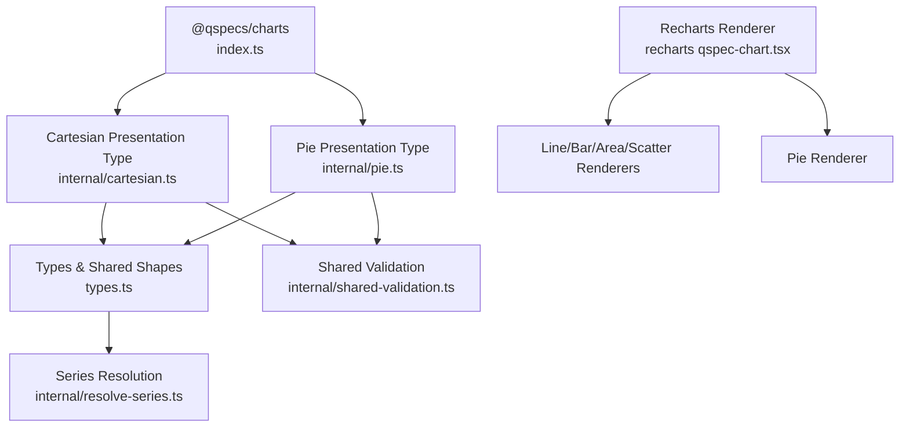
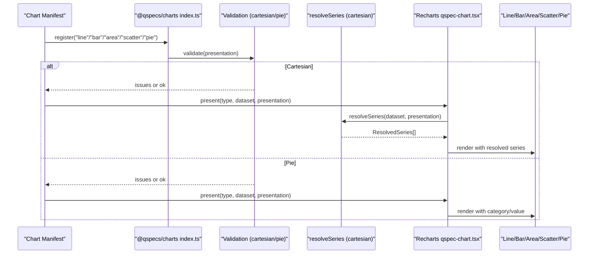
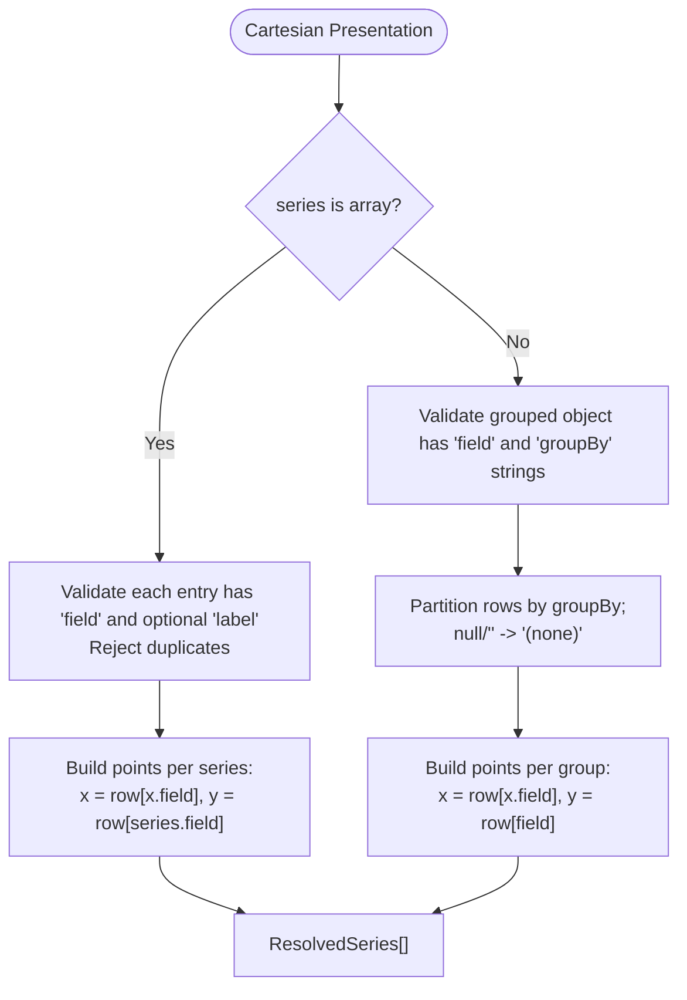
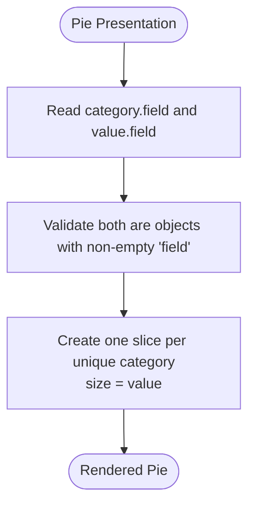
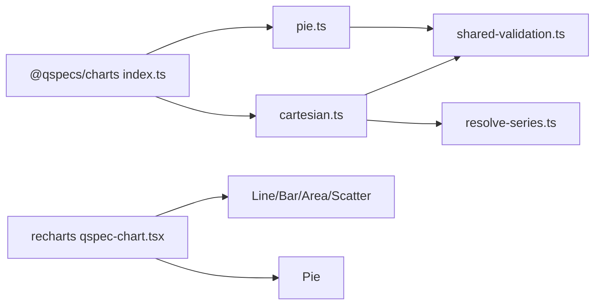

# Chart Types and Configuration

<cite>
**Referenced Files in This Document**
- [index.ts](file://packages/charts/src/index.ts)
- [types.ts](file://packages/charts/src/types.ts)
- [cartesian.ts](file://packages/charts/src/internal/cartesian.ts)
- [pie.ts](file://packages/charts/src/internal/pie.ts)
- [resolve-series.ts](file://packages/charts/src/internal/resolve-series.ts)
- [shared-validation.ts](file://packages/charts/src/internal/shared-validation.ts)
- [qspec-chart.tsx](file://packages/recharts/src/internal/qspec-chart.tsx)
- [10-chart-grouped-series.qspec.json](file://examples/10-chart-grouped-series.qspec.json)
- [11-chart-pie.qspec.json](file://examples/11-chart-pie.qspec.json)
- [01-complete-manifest.qspec.json](file://examples/01-complete-manifest.qspec.json)
- [grouped-series-chart.qspec.json](file://fixtures/valid/grouped-series-chart.qspec.json)
- [monthly-revenue-chart.qspec.json](file://fixtures/valid/monthly-revenue-chart.qspec.json)
</cite>

## Table of Contents

1. [Introduction](#introduction)
2. [Project Structure](#project-structure)
3. [Core Components](#core-components)
4. [Architecture Overview](#architecture-overview)
5. [Detailed Component Analysis](#detailed-component-analysis)
6. [Dependency Analysis](#dependency-analysis)
7. [Performance Considerations](#performance-considerations)
8. [Troubleshooting Guide](#troubleshooting-guide)
9. [Conclusion](#conclusion)
10. [Appendices](#appendices)

## Introduction

This document explains the chart types supported by @qspecs/charts: line, bar, area, scatter, and pie. It covers configuration options, rendering behavior, axis configuration, series mapping, and data binding patterns for each type. It also clarifies the structural difference between cartesian charts (line, bar, area, scatter), which share an x-axis and a series structure, and pie charts, which have no x-axis and use a category/value shape with dynamic series derived from data.

## Project Structure

The @qspecs/charts package defines presentation types and shared validation logic for chart manifests. The recharts renderer maps these presentations to concrete visual components.

**Diagram sources**

- [index.ts:1-39](file://packages/charts/src/index.ts#L1-L39)
- [cartesian.ts:1-161](file://packages/charts/src/internal/cartesian.ts#L1-L161)
- [pie.ts:1-96](file://packages/charts/src/internal/pie.ts#L1-L96)
- [types.ts:1-87](file://packages/charts/src/types.ts#L1-L87)
- [shared-validation.ts:1-39](file://packages/charts/src/internal/shared-validation.ts#L1-L39)
- [qspec-chart.tsx:27-96](file://packages/recharts/src/internal/qspec-chart.tsx#L27-L96)

**Section sources**

- [index.ts:1-39](file://packages/charts/src/index.ts#L1-L39)
- [qspec-chart.tsx:27-96](file://packages/recharts/src/internal/qspec-chart.tsx#L27-L96)

## Core Components

- Cartesian presentation types: line, bar, area, scatter share one PresentationType implementation because they all require an x-axis and one or more series. They differ only in how renderers draw them.
- Pie presentation type: distinct shape with category and value fields; no x-axis and no explicit series list. Series are derived dynamically from unique category values.
- Shared types and utilities: AxisSpec, SeriesSpec, GroupedSeriesSpec, LegendSpec, TooltipSpec, ResolvedSeries, SeriesPoint, and helpers like isGroupedSeries.
- Series resolution: resolveSeries transforms a CartesianPresentation into plottable series, handling both explicit arrays and grouped series.

Key responsibilities:

- Validate presentation definitions at parse time.
- Extract field references for dataset schema checks.
- Resolve series points for cartesian charts.
- Map presentation.type to a renderer in the Recharts integration.

**Section sources**

- [types.ts:1-87](file://packages/charts/src/types.ts#L1-L87)
- [cartesian.ts:18-151](file://packages/charts/src/internal/cartesian.ts#L18-L151)
- [pie.ts:18-86](file://packages/charts/src/internal/pie.ts#L18-L86)
- [resolve-series.ts:1-86](file://packages/charts/src/internal/resolve-series.ts#L1-L86)
- [shared-validation.ts:1-39](file://packages/charts/src/internal/shared-validation.ts#L1-L39)
- [index.ts:19-39](file://packages/charts/src/index.ts#L19-L39)

## Architecture Overview

The plugin registers five presentation types. Four share the same validator and field-reference extractor; pie has its own. At render time, the Recharts layer selects a component based on presentation.type.

**Diagram sources**

- [index.ts:19-39](file://packages/charts/src/index.ts#L19-L39)
- [cartesian.ts:141-151](file://packages/charts/src/internal/cartesian.ts#L141-L151)
- [pie.ts:76-86](file://packages/charts/src/internal/pie.ts#L76-L86)
- [resolve-series.ts:28-86](file://packages/charts/src/internal/resolve-series.ts#L28-L86)
- [qspec-chart.tsx:40-96](file://packages/recharts/src/internal/qspec-chart.tsx#L40-L96)

## Detailed Component Analysis

### Line, Bar, Area, Scatter (Cartesian Charts)

All four types share:

- An x-axis defined by AxisSpec.
- One or more series defined either as an array of SeriesSpec or a single GroupedSeriesSpec that partitions rows by a groupBy field.
- Optional y label container.
- Optional legend and tooltip display blocks.

Configuration highlights:

- x.field must exist in the dataset; optional x.label controls axis label.
- series can be:
  - Array of SeriesSpec: each entry plots one series using a fixed field; labels default to field name if omitted.
  - GroupedSeriesSpec: one series per unique groupBy value; label becomes “label: groupValue” when provided, otherwise uses the group value. Null or empty-string groups merge into one series labeled “(none)”.
- legend.visible and tooltip.visible control visibility.

Rendering behavior:

- The Recharts renderer dispatches to LineChart, BarChart, AreaChart, or ScatterChart based on presentation.type.
- For multiple series sharing one x-axis, points are interleaved and ordered by original dataset row index to preserve correct category ordering across series.

Examples:

- Explicit series: see [01-complete-manifest.qspec.json:69-87](file://examples/01-complete-manifest.qspec.json#L69-L87).
- Grouped series: see [10-chart-grouped-series.qspec.json:31-41](file://examples/10-chart-grouped-series.qspec.json#L31-L41) and [grouped-series-chart.qspec.json:64-85](file://fixtures/valid/grouped-series-chart.qspec.json#L64-L85).

Axis configuration:

- x.axis: AxisSpec with field and optional label.
- y.axis: optional label-only object; actual scaling and ticks are handled by renderers.

Series mapping and data binding:

- Explicit series map directly to dataset fields.
- Grouped series partition rows by groupBy and produce one series per group; null/empty groups merge under a special label.

Validation rules:

- x must be an object with non-empty string field.
- series must be a non-empty array of objects with non-empty string field, or a grouped object with field and groupBy strings.
- Duplicate series fields are rejected to avoid React key collisions.
- legend and tooltip must be objects with boolean visible property.

**Diagram sources**

- [cartesian.ts:18-93](file://packages/charts/src/internal/cartesian.ts#L18-L93)
- [resolve-series.ts:28-86](file://packages/charts/src/internal/resolve-series.ts#L28-L86)

**Section sources**

- [types.ts:28-49](file://packages/charts/src/types.ts#L28-L49)
- [cartesian.ts:18-151](file://packages/charts/src/internal/cartesian.ts#L18-L151)
- [resolve-series.ts:1-86](file://packages/charts/src/internal/resolve-series.ts#L1-L86)
- [shared-validation.ts:1-39](file://packages/charts/src/internal/shared-validation.ts#L1-L39)
- [qspec-chart.tsx:40-84](file://packages/recharts/src/internal/qspec-chart.tsx#L40-L84)
- [01-complete-manifest.qspec.json:69-87](file://examples/01-complete-manifest.qspec.json#L69-L87)
- [10-chart-grouped-series.qspec.json:31-41](file://examples/10-chart-grouped-series.qspec.json#L31-L41)
- [grouped-series-chart.qspec.json:64-85](file://fixtures/valid/grouped-series-chart.qspec.json#L64-L85)

### Pie Charts

Pie charts do not use an x-axis or series list. Instead, they define:

- category: AxisSpec specifying the slice label field and optional label.
- value: SeriesSpec specifying the slice size field and optional label.
- Optional legend and tooltip display blocks.

Rendering behavior:

- Each unique category value produces one slice sized by the corresponding value.
- No y-axis exists; there is no groupBy pivot.

Examples:

- See [11-chart-pie.qspec.json:22-28](file://examples/11-chart-pie.qspec.json#L22-L28).

Validation rules:

- category and value must be objects with non-empty string field properties.
- legend and tooltip must be objects with boolean visible property.

**Diagram sources**

- [pie.ts:18-86](file://packages/charts/src/internal/pie.ts#L18-L86)
- [11-chart-pie.qspec.json:22-28](file://examples/11-chart-pie.qspec.json#L22-L28)

**Section sources**

- [types.ts:80-86](file://packages/charts/src/types.ts#L80-L86)
- [pie.ts:18-86](file://packages/charts/src/internal/pie.ts#L18-L86)
- [shared-validation.ts:1-39](file://packages/charts/src/internal/shared-validation.ts#L1-L39)
- [11-chart-pie.qspec.json:22-28](file://examples/11-chart-pie.qspec.json#L22-L28)

## Dependency Analysis

- Registration: The plugin registers five presentation types. Four share one implementation; pie is separate.
- Validation: Both cartesian and pie validators rely on shared helpers for label and display block validation.
- Rendering: The Recharts layer maps presentation.type to specific chart components.
- Series resolution: Only cartesian charts use resolveSeries; pie charts derive slices directly from category/value.

**Diagram sources**

- [index.ts:19-39](file://packages/charts/src/index.ts#L19-L39)
- [cartesian.ts:141-151](file://packages/charts/src/internal/cartesian.ts#L141-L151)
- [pie.ts:76-86](file://packages/charts/src/internal/pie.ts#L76-L86)
- [shared-validation.ts:1-39](file://packages/charts/src/internal/shared-validation.ts#L1-L39)
- [resolve-series.ts:1-86](file://packages/charts/src/internal/resolve-series.ts#L1-L86)
- [qspec-chart.tsx:40-96](file://packages/recharts/src/internal/qspec-chart.tsx#L40-L96)

**Section sources**

- [index.ts:19-39](file://packages/charts/src/index.ts#L19-L39)
- [qspec-chart.tsx:40-96](file://packages/recharts/src/internal/qspec-chart.tsx#L40-L96)

## Performance Considerations

- Series resolution allocates new series and point structures; this avoids mutating the dataset but may incur memory overhead for large datasets.
- Grouped series partitioning uses a Map keyed by group value; insertion order preserves first-appearance order, avoiding extra sorting passes.
- Cartesian renderers interleave points across series and sort by original dataset row index to maintain correct category ordering; this ensures correctness at the cost of additional processing during merge.
- Avoid duplicate series fields to prevent redundant work and potential rendering issues.

[No sources needed since this section provides general guidance]

## Troubleshooting Guide

Common validation issues and their causes:

- Missing or invalid x field in cartesian charts: ensure x.field is a non-empty string referencing a dataset column.
- Empty series array: provide at least one series entry.
- Invalid series entries: each series must have a non-empty string field; grouped series must include both field and groupBy.
- Duplicate series fields: remove duplicates to avoid React key collisions.
- Invalid legend/tooltip: these must be objects with a boolean visible property.
- Pie category/value missing: ensure both category.field and value.field are present and valid.

Where to look:

- Validation logic for cartesian and pie presentations.
- Shared validation helpers for labels and display blocks.
- Examples and fixtures for correct configuration shapes.

**Section sources**

- [cartesian.ts:18-93](file://packages/charts/src/internal/cartesian.ts#L18-L93)
- [pie.ts:18-43](file://packages/charts/src/internal/pie.ts#L18-L43)
- [shared-validation.ts:11-38](file://packages/charts/src/internal/shared-validation.ts#L11-L38)
- [01-complete-manifest.qspec.json:69-87](file://examples/01-complete-manifest.qspec.json#L69-L87)
- [10-chart-grouped-series.qspec.json:31-41](file://examples/10-chart-grouped-series.qspec.json#L31-L41)
- [11-chart-pie.qspec.json:22-28](file://examples/11-chart-pie.qspec.json#L22-L28)

## Conclusion

@qspecs/charts standardizes chart configuration across line, bar, area, scatter, and pie types. Cartesian charts share a consistent x-axis and series model, supporting both explicit series and dynamic grouping. Pie charts use a simpler category/value model without an x-axis. Validation and series resolution ensure consistent behavior across renderers, while the Recharts integration maps declarations to concrete visuals. Use the examples and fixtures as templates for correct configuration and customization.

[No sources needed since this section summarizes without analyzing specific files]

## Appendices

### Quick Reference: Configuration Options by Chart Type

- Line, Bar, Area, Scatter (Cartesian)
  - x: { field: string, label?: string }
  - series:
    - Array: [{ field: string, label?: string }, ...]
    - Grouped: { field: string, groupBy: string, label?: string }
  - y?: { label?: string }
  - legend?: { visible?: boolean }
  - tooltip?: { visible?: boolean }

- Pie
  - category: { field: string, label?: string }
  - value: { field: string, label?: string }
  - legend?: { visible?: boolean }
  - tooltip?: { visible?: boolean }

**Section sources**

- [types.ts:3-49](file://packages/charts/src/types.ts#L3-L49)
- [types.ts:80-86](file://packages/charts/src/types.ts#L80-L86)

### Example Declarations

- Single-series line chart:
  - See [01-complete-manifest.qspec.json:69-87](file://examples/01-complete-manifest.qspec.json#L69-L87)

- Multi-series line chart via grouping:
  - See [10-chart-grouped-series.qspec.json:31-41](file://examples/10-chart-grouped-series.qspec.json#L31-L41)
  - See [grouped-series-chart.qspec.json:64-85](file://fixtures/valid/grouped-series-chart.qspec.json#L64-L85)

- Pie chart:
  - See [11-chart-pie.qspec.json:22-28](file://examples/11-chart-pie.qspec.json#L22-L28)

**Section sources**

- [01-complete-manifest.qspec.json:69-87](file://examples/01-complete-manifest.qspec.json#L69-L87)
- [10-chart-grouped-series.qspec.json:31-41](file://examples/10-chart-grouped-series.qspec.json#L31-L41)
- [grouped-series-chart.qspec.json:64-85](file://fixtures/valid/grouped-series-chart.qspec.json#L64-L85)
- [11-chart-pie.qspec.json:22-28](file://examples/11-chart-pie.qspec.json#L22-L28)
