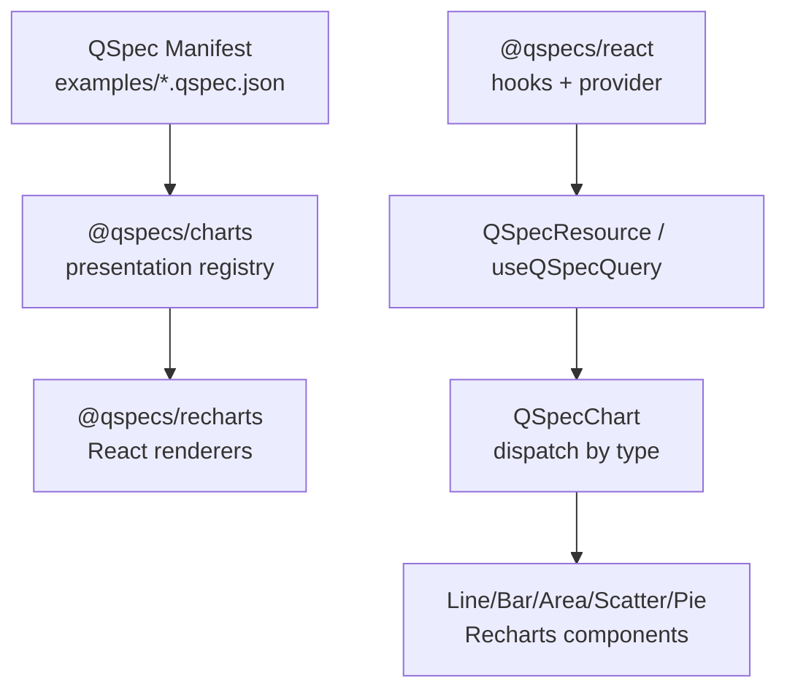
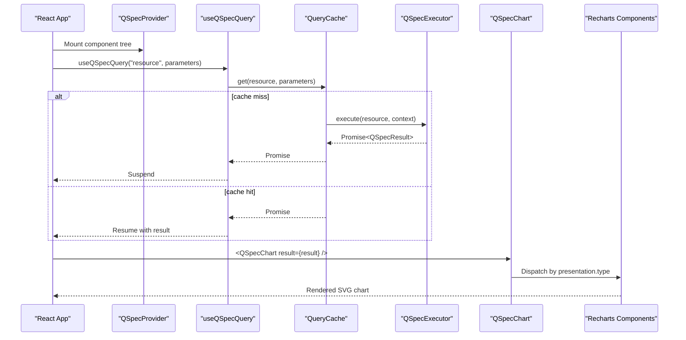
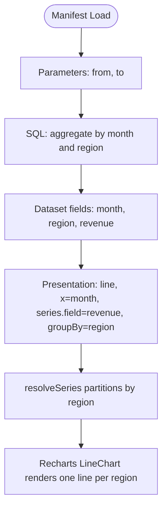
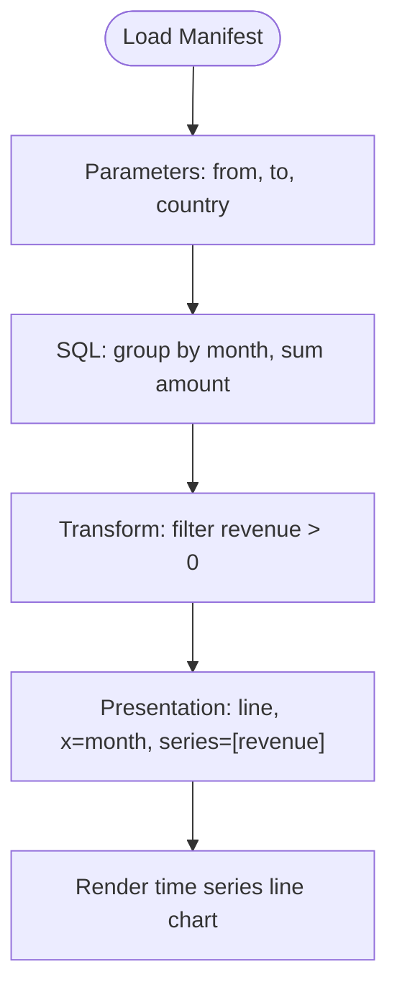
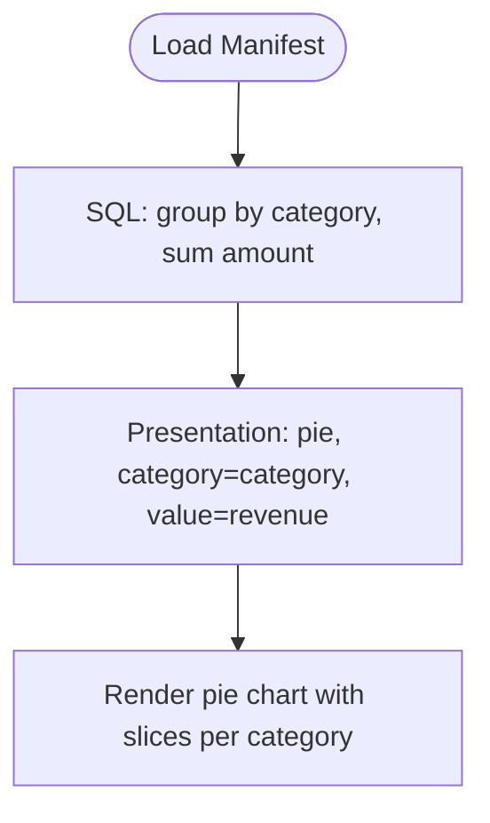
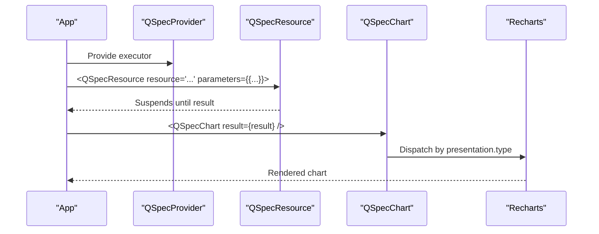
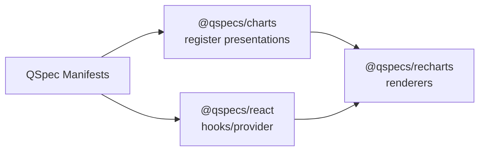

# Integration Examples and Best Practices

<cite>
**Referenced Files in This Document**
- [examples/10-chart-grouped-series.qspec.json](file://examples/10-chart-grouped-series.qspec.json)
- [examples/11-chart-pie.qspec.json](file://examples/11-chart-pie.qspec.json)
- [fixtures/valid/grouped-series-chart.qspec.json](file://fixtures/valid/grouped-series-chart.qspec.json)
- [fixtures/valid/monthly-revenue-chart.qspec.json](file://fixtures/valid/monthly-revenue-chart.qspec.json)
- [packages/charts/src/index.ts](file://packages/charts/src/index.ts)
- [packages/charts/src/types.ts](file://packages/charts/src/types.ts)
- [packages/recharts/src/index.ts](file://packages/recharts/src/index.ts)
- [packages/recharts/src/internal/qspec-chart.tsx](file://packages/recharts/src/internal/qspec-chart.tsx)
- [packages/recharts/src/internal/cartesian.tsx](file://packages/recharts/src/internal/cartesian.tsx)
- [packages/recharts/src/internal/pie.tsx](file://packages/recharts/src/internal/pie.tsx)
- [packages/react/src/internal/resource.tsx](file://packages/react/src/internal/resource.tsx)
- [docs/react-integration.md](file://docs/react-integration.md)
- [docs/presentations.md](file://docs/presentations.md)
- [examples/README.md](file://examples/README.md)
</cite>

## Table of Contents

1. Introduction
2. Project Structure
3. Core Components
4. Architecture Overview
5. Detailed Component Analysis
6. Dependency Analysis
7. Performance Considerations
8. Troubleshooting Guide
9. Conclusion
10. Appendices

## Introduction

This document provides practical integration examples and best practices for using @qspecs/charts in real applications, with a focus on Recharts-based rendering. It covers:

- Complete working examples for grouped series charts, time series visualizations, and interactive charts
- Common integration patterns with React and Recharts
- Performance optimization techniques, error handling strategies, and debugging approaches
- Responsive chart implementation guidance and cross-browser considerations

The goal is to help you author QSpec manifests that describe semantic intent and render them consistently across different environments while keeping performance and reliability in mind.

## Project Structure

At a high level:

- Manifests define data sources, transformations, dataset schemas, and presentation intent (e.g., line, bar, area, scatter, pie).
- The charts package registers presentation types and the Chart resource kind without rendering anything.
- The recharts package provides concrete React components that consume a resolved dataset and presentation to render charts.
- The react package provides Suspense-first hooks and a declarative wrapper to fetch results and pass them to renderers.



**Diagram sources**

- [packages/charts/src/index.ts:1-55](file://packages/charts/src/index.ts#L1-L55)
- [packages/recharts/src/index.ts:1-32](file://packages/recharts/src/index.ts#L1-L32)
- [packages/recharts/src/internal/qspec-chart.tsx:27-123](file://packages/recharts/src/internal/qspec-chart.tsx#L27-L123)
- [packages/react/src/internal/resource.tsx:1-59](file://packages/react/src/internal/resource.tsx#L1-L59)

**Section sources**

- [examples/README.md:1-112](file://examples/README.md#L1-L112)
- [docs/presentations.md:1-120](file://docs/presentations.md#L1-L120)

## Core Components

- Presentation model and types: Cartesian presentations (line, bar, area, scatter) share an x-axis plus one or more series; pie uses category/value semantics. Grouped series allow dynamic series derived from a grouping field at render time.
- Charts plugin: Registers presentation types and the Chart resource kind with validation requirements (requires query and presentation).
- Recharts renderers: Provide LineChart, BarChart, AreaChart, ScatterChart, PieChart, and a dispatcher QSpecChart that maps presentation.type to the correct renderer.
- React integration: QSpecResource wraps useQSpecQuery to suspend until data is ready and passes the result to child components.

Key responsibilities:

- Define semantic intent via presentation (not pixel details).
- Resolve series deterministically so any renderer can produce consistent output.
- Render with Recharts while preserving portability guarantees.

**Section sources**

- [packages/charts/src/types.ts:1-87](file://packages/charts/src/types.ts#L1-L87)
- [packages/charts/src/index.ts:19-54](file://packages/charts/src/index.ts#L19-L54)
- [packages/recharts/src/index.ts:1-32](file://packages/recharts/src/index.ts#L1-L32)
- [packages/recharts/src/internal/qspec-chart.tsx:27-123](file://packages/recharts/src/internal/qspec-chart.tsx#L27-L123)
- [packages/react/src/internal/resource.tsx:1-59](file://packages/react/src/internal/resource.tsx#L1-L59)
- [docs/presentations.md:19-120](file://docs/presentations.md#L19-L120)

## Architecture Overview

The end-to-end flow from manifest to rendered chart:



**Diagram sources**

- [packages/react/src/internal/resource.tsx:1-59](file://packages/react/src/internal/resource.tsx#L1-L59)
- [docs/react-integration.md:55-103](file://docs/react-integration.md#L55-L103)
- [packages/recharts/src/internal/qspec-chart.tsx:27-123](file://packages/recharts/src/internal/qspec-chart.tsx#L27-L123)

## Detailed Component Analysis

### Grouped Series Chart Example

A grouped series chart derives one series per distinct value of a grouping field at render time. This example shows a monthly revenue line chart with one line per region.

- Manifest shape: Uses a cartesian presentation with series defined as a grouped spec { field, groupBy, label }.
- Query binds date parameters to filter rows before aggregation.
- Dataset schema declares field types and optional formatting.
- Presentation configures legend and tooltip visibility.



**Diagram sources**

- [examples/10-chart-grouped-series.qspec.json:1-44](file://examples/10-chart-grouped-series.qspec.json#L1-L44)
- [fixtures/valid/grouped-series-chart.qspec.json:1-88](file://fixtures/valid/grouped-series-chart.qspec.json#L1-L88)
- [packages/charts/src/types.ts:13-49](file://packages/charts/src/types.ts#L13-L49)
- [docs/presentations.md:121-210](file://docs/presentations.md#L121-L210)

**Section sources**

- [examples/10-chart-grouped-series.qspec.json:1-44](file://examples/10-chart-grouped-series.qspec.json#L1-L44)
- [fixtures/valid/grouped-series-chart.qspec.json:1-88](file://fixtures/valid/grouped-series-chart.qspec.json#L1-L88)
- [docs/presentations.md:121-210](file://docs/presentations.md#L121-L210)

### Time Series Visualization Example

A time series line chart aggregates revenue by month and optionally filters by country. This demonstrates parameterized queries, transforms, and explicit series definitions.

- Parameters include required dates and an optional string with a default.
- SQL statement binds parameters and groups by month.
- Transform filters out non-positive revenue values.
- Presentation defines x-axis as month and a single series for revenue.



**Diagram sources**

- [fixtures/valid/monthly-revenue-chart.qspec.json:1-111](file://fixtures/valid/monthly-revenue-chart.qspec.json#L1-L111)

**Section sources**

- [fixtures/valid/monthly-revenue-chart.qspec.json:1-111](file://fixtures/valid/monthly-revenue-chart.qspec.json#L1-L111)

### Interactive Chart Example (Pie)

A pie chart displays revenue share by category using category/value semantics.

- No x-axis or series list; instead, category and value fields define slices.
- Legend and tooltip are enabled for interactivity.



**Diagram sources**

- [examples/11-chart-pie.qspec.json:1-31](file://examples/11-chart-pie.qspec.json#L1-L31)

**Section sources**

- [examples/11-chart-pie.qspec.json:1-31](file://examples/11-chart-pie.qspec.json#L1-L31)

### React Integration Pattern with Recharts

Use the React provider and hooks to fetch results and render charts declaratively.

- Wrap your app with QSpecProvider to supply an executor.
- Use QSpecResource or useQSpecQuery to fetch a named resource with parameters.
- Pass the resulting dataset and presentation to QSpecChart or specific Recharts components.
- Ensure Suspense and ErrorBoundary boundaries are present around resources.



**Diagram sources**

- [packages/react/src/internal/resource.tsx:1-59](file://packages/react/src/internal/resource.tsx#L1-L59)
- [packages/recharts/src/internal/qspec-chart.tsx:27-123](file://packages/recharts/src/internal/qspec-chart.tsx#L27-L123)
- [docs/react-integration.md:55-129](file://docs/react-integration.md#L55-L129)

**Section sources**

- [packages/react/src/internal/resource.tsx:1-59](file://packages/react/src/internal/resource.tsx#L1-L59)
- [docs/react-integration.md:55-129](file://docs/react-integration.md#L55-L129)

### Class Model of Presentations and Types

```mermaid
classDiagram
class AxisSpec {
+string field
+string label?
}
class SeriesSpec {
+string field
+string label?
}
class GroupedSeriesSpec {
+string field
+string groupBy
+string label?
}
class CartesianPresentation {
+type "line"|"bar"|"area"|"scatter"
+AxisSpec x
+SeriesSpec[]|GroupedSeriesSpec series
+{label? : string} y?
+LegendSpec legend?
+TooltipSpec tooltip?
}
class PiePresentation {
+type "pie"
+AxisSpec category
+SeriesSpec value
+LegendSpec legend?
+TooltipSpec tooltip?
}
class ResolvedSeries {
+string key
+string label
+string field
+SeriesPoint[] points
}
class SeriesPoint {
+unknown x
+unknown y
+number index
}
CartesianPresentation --> AxisSpec : "uses"
CartesianPresentation --> SeriesSpec : "uses"
CartesianPresentation --> GroupedSeriesSpec : "uses"
PiePresentation --> AxisSpec : "uses"
PiePresentation --> SeriesSpec : "uses"
ResolvedSeries --> SeriesPoint : "contains"
```

**Diagram sources**

- [packages/charts/src/types.ts:1-87](file://packages/charts/src/types.ts#L1-L87)

**Section sources**

- [packages/charts/src/types.ts:1-87](file://packages/charts/src/types.ts#L1-L87)

## Dependency Analysis

- @qspecs/charts registers presentation types and the Chart resource kind; it does not render anything.
- @qspecs/recharts implements renderers for those presentation types and dispatches via QSpecChart.
- @qspecs/react provides hooks and a provider to fetch results and integrate with React’s Suspense model.
- Manifests declare semantic intent; renderers interpret that intent consistently.



**Diagram sources**

- [packages/charts/src/index.ts:19-54](file://packages/charts/src/index.ts#L19-L54)
- [packages/recharts/src/index.ts:1-32](file://packages/recharts/src/index.ts#L1-L32)
- [packages/react/src/internal/resource.tsx:1-59](file://packages/react/src/internal/resource.tsx#L1-L59)

**Section sources**

- [packages/charts/src/index.ts:19-54](file://packages/charts/src/index.ts#L19-L54)
- [packages/recharts/src/index.ts:1-32](file://packages/recharts/src/index.ts#L1-L32)
- [packages/react/src/internal/resource.tsx:1-59](file://packages/react/src/internal/resource.tsx#L1-L59)

## Performance Considerations

- Prefer grouped series when you have many categories to avoid manually enumerating series; this reduces manifest size and keeps rendering logic centralized.
- Aggregate in SQL where possible (e.g., GROUP BY month, region) to minimize client-side processing.
- Use transforms to filter early (e.g., remove non-positive values) to reduce dataset size before rendering.
- Avoid unnecessary re-renders by relying on content-based parameter comparison in the query cache; fresh object literals do not trigger refetches if serialized values are unchanged.
- For large datasets, consider limiting rows or paginating upstream to keep chart rendering responsive.
- Be mindful of wide-row pivoting in cartesian charts; ensure each series has unique x values per point to avoid duplicate-x errors.

[No sources needed since this section provides general guidance]

## Troubleshooting Guide

Common issues and how to address them:

- Unrecognized presentation type: QSpecChart throws a named error listing supported types. Ensure your manifest’s presentation.type matches a registered type.
- Duplicate x values within a series: Cartesian renderers throw when two points share the same x in one series. Aggregate your data before charting.
- Missing fields: If a series references a field absent from the dataset, renderers will fail fast with a clear message. Verify dataset schema and transforms.
- Empty charts: Zero-row datasets render empty charts rather than throwing. Check query bindings and filters.
- Provider usage: Calling hooks outside QSpecProvider causes explicit errors. Wrap your app with QSpecProvider and ensure Suspense/ErrorBoundary are present around resources.

**Section sources**

- [packages/recharts/src/internal/qspec-chart.tsx:98-123](file://packages/recharts/src/internal/qspec-chart.tsx#L98-L123)
- [packages/recharts/src/internal/cartesian.tsx:157-196](file://packages/recharts/src/internal/cartesian.tsx#L157-L196)
- [packages/react/src/internal/resource.tsx:29-59](file://packages/react/src/internal/resource.tsx#L29-L59)
- [docs/react-integration.md:55-103](file://docs/react-integration.md#L55-L103)

## Conclusion

By defining semantic intent in QSpec manifests and delegating rendering to @qspecs/recharts, you achieve portable, maintainable charts. Use grouped series for dynamic series, aggregate in SQL, leverage transforms to prune data early, and rely on React’s Suspense-first integration for predictable loading and error handling. Follow the examples and guidelines here to build robust, performant, and interactive visualizations across browsers.

[No sources needed since this section summarizes without analyzing specific files]

## Appendices

### Appendix A: Example Manifests Reference

- Grouped series line chart: See the grouped series example manifest for a line chart with one series per region derived at render time.
- Pie chart: See the pie example manifest for category/value-based visualization.
- Monthly revenue time series: See the monthly revenue manifest for parameterized queries, transforms, and explicit series.

**Section sources**

- [examples/10-chart-grouped-series.qspec.json:1-44](file://examples/10-chart-grouped-series.qspec.json#L1-L44)
- [examples/11-chart-pie.qspec.json:1-31](file://examples/11-chart-pie.qspec.json#L1-L31)
- [fixtures/valid/monthly-revenue-chart.qspec.json:1-111](file://fixtures/valid/monthly-revenue-chart.qspec.json#L1-L111)
- [examples/README.md:88-101](file://examples/README.md#L88-L101)

### Appendix B: React Integration Checklist

- Provide QSpecProvider with an executor.
- Use QSpecResource or useQSpecQuery inside Suspense and ErrorBoundary.
- Pass result.dataset and result.presentation to QSpecChart or specific Recharts components.
- Ensure parameters change only when meaningful data changes to benefit from caching.

**Section sources**

- [packages/react/src/internal/resource.tsx:1-59](file://packages/react/src/internal/resource.tsx#L1-L59)
- [docs/react-integration.md:55-129](file://docs/react-integration.md#L55-L129)

### Appendix C: Cross-Browser and Responsiveness Notes

- Recharts renders SVG via browser APIs; mark exports as client-only to ensure proper bundling in environments supporting React Server Components.
- Explicit width and height are recommended for deterministic sizing; avoid relying solely on responsive containers when precise dimensions are required.
- Animations may behave differently in non-interactive contexts; some renderers disable animations by default to ensure immediate, complete output.

**Section sources**

- [packages/recharts/src/index.ts:17-21](file://packages/recharts/src/index.ts#L17-L21)
- [packages/recharts/src/internal/pie.tsx:72-96](file://packages/recharts/src/internal/pie.tsx#L72-L96)
