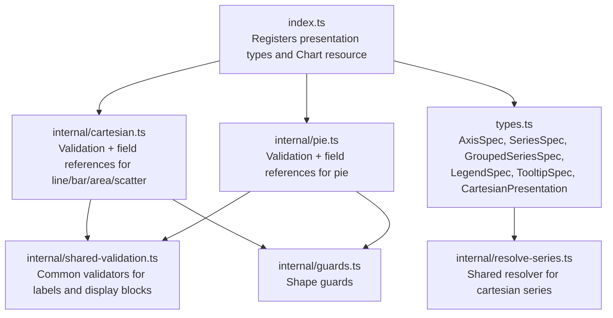
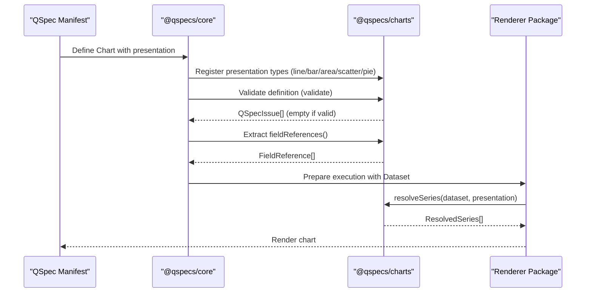
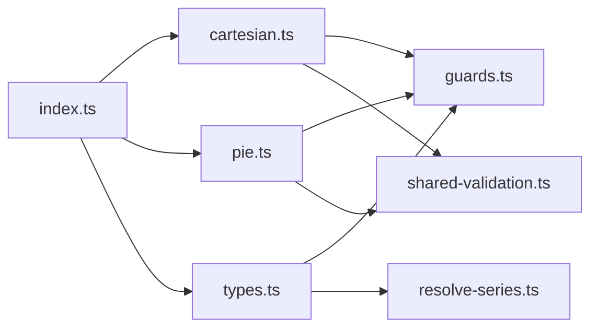

# Presentation Models and Interfaces

<cite>
**Referenced Files in This Document**
- [index.ts](file://packages/charts/src/index.ts)
- [types.ts](file://packages/charts/src/types.ts)
- [cartesian.ts](file://packages/charts/src/internal/cartesian.ts)
- [pie.ts](file://packages/charts/src/internal/pie.ts)
- [resolve-series.ts](file://packages/charts/src/internal/resolve-series.ts)
- [guards.ts](file://packages/charts/src/internal/guards.ts)
- [shared-validation.ts](file://packages/charts/src/internal/shared-validation.ts)
- [presentations.md](file://docs/presentations.md)
</cite>

## Table of Contents

1. [Introduction](#introduction)
2. [Project Structure](#project-structure)
3. [Core Components](#core-components)
4. [Architecture Overview](#architecture-overview)
5. [Detailed Component Analysis](#detailed-component-analysis)
6. [Dependency Analysis](#dependency-analysis)
7. [Performance Considerations](#performance-considerations)
8. [Troubleshooting Guide](#troubleshooting-guide)
9. [Conclusion](#conclusion)
10. [Appendices](#appendices)

## Introduction

This document explains the presentation models and TypeScript interfaces defined by @qspecs/charts, focusing on AxisSpec, SeriesSpec, LegendSpec, TooltipSpec, and CartesianPresentation. It also documents how these models integrate with rendering engines through a shared resolver, how configuration validation works, what defaults apply, and how inheritance patterns are used via type composition. Examples of complete configurations, styling options, responsive design patterns, accessibility, internationalization, and theme integration are provided at a conceptual level to guide implementation without altering the package’s render-free contract.

## Project Structure

@qspecs/charts defines chart semantics and registration but does not render charts itself. It:

- Exports types for axis, series, legend, tooltip, and cartesian presentations.
- Registers five presentation types (line, bar, area, scatter, pie) and the Chart resource kind.
- Provides a shared resolver that turns presentation definitions into concrete series data for renderers.

**Diagram sources**

- [index.ts:1-55](file://packages/charts/src/index.ts#L1-L55)
- [cartesian.ts:1-161](file://packages/charts/src/internal/cartesian.ts#L1-L161)
- [pie.ts:1-96](file://packages/charts/src/internal/pie.ts#L1-L96)
- [types.ts:1-49](file://packages/charts/src/types.ts#L1-L49)
- [shared-validation.ts:1-39](file://packages/charts/src/internal/shared-validation.ts#L1-L39)
- [guards.ts:1-21](file://packages/charts/src/internal/guards.ts#L1-L21)
- [resolve-series.ts:1-86](file://packages/charts/src/internal/resolve-series.ts#L1-L86)

**Section sources**

- [index.ts:1-55](file://packages/charts/src/index.ts#L1-L55)
- [presentations.md:1-120](file://docs/presentations.md#L1-L120)

## Core Components

- AxisSpec: Declares an axis field and optional label. Used by x-axis in cartesian and category/value axes in pie.
- SeriesSpec: Declares a plotted field and optional label. Used as explicit series entries in cartesian.
- GroupedSeriesSpec: Declares a single series that is partitioned at runtime by a groupBy field; produces multiple resolved series.
- LegendSpec and TooltipSpec: Optional display blocks with a visible flag.
- CartesianPresentation: Shared shape for line, bar, area, and scatter: requires an x axis, one or more series (explicit array or grouped), optional y label, and optional legend/tooltip.

Key behaviors:

- Validation enforces required fields, non-empty strings where needed, and correct shapes for arrays vs objects.
- Field reference extraction enables static validation against dataset schemas.
- The shared resolver converts presentation definitions into ResolvedSeries for renderers.

**Section sources**

- [types.ts:1-49](file://packages/charts/src/types.ts#L1-L49)
- [cartesian.ts:18-94](file://packages/charts/src/internal/cartesian.ts#L18-L94)
- [shared-validation.ts:11-38](file://packages/charts/src/internal/shared-validation.ts#L11-L38)
- [resolve-series.ts:28-86](file://packages/charts/src/internal/resolve-series.ts#L28-L86)

## Architecture Overview

The package registers presentation types and provides a renderer-neutral model. Renderers consume the model via:

- Validation and field reference extraction during prepare/validate phases.
- resolveSeries to obtain concrete series data for cartesian charts.
- Pie-specific validation and field references for slice definitions.

**Diagram sources**

- [index.ts:19-54](file://packages/charts/src/index.ts#L19-L54)
- [cartesian.ts:141-151](file://packages/charts/src/internal/cartesian.ts#L141-L151)
- [pie.ts:76-86](file://packages/charts/src/internal/pie.ts#L76-L86)
- [resolve-series.ts:28-86](file://packages/charts/src/internal/resolve-series.ts#L28-L86)

## Detailed Component Analysis

### AxisSpec

Purpose:

- Declares which dataset field maps to an axis (x for cartesian, category/value for pie).
- Optional label for human-readable axis titles.

Validation rules:

- Must be an object with a non-empty string field.
- Optional label must be a string when present.

Inheritance pattern:

- Reused across cartesian x-axis and pie category/value specs to keep axis semantics consistent.

Example usage:

- Cartesian x-axis: { field: "month", label: "Month" }
- Pie category: { field: "region", label: "Region" }
- Pie value: { field: "revenue", label: "Revenue" }

**Section sources**

- [types.ts:3-11](file://packages/charts/src/types.ts#L3-L11)
- [cartesian.ts:21-27](file://packages/charts/src/internal/cartesian.ts#L21-L27)
- [pie.ts:21-37](file://packages/charts/src/internal/pie.ts#L21-L37)
- [shared-validation.ts:29-38](file://packages/charts/src/internal/shared-validation.ts#L29-L38)

### SeriesSpec and GroupedSeriesSpec

Purpose:

- SeriesSpec declares a single plotted field per series with an optional label.
- GroupedSeriesSpec declares a single series that is partitioned by a groupBy field at resolution time, producing multiple series.

Validation rules:

- Explicit series array must contain at least one entry; each entry must have a non-empty string field; duplicate fields are rejected.
- Grouped series must have non-empty string field and groupBy; optional label supported.

Resolution behavior:

- Explicit series map directly to ResolvedSeries keyed by field name.
- Grouped series produce one ResolvedSeries per distinct group value; null/undefined and empty-string groups merge under a common key and use UNGROUPED_LABEL.

Example usage:

- Explicit series: [{ field: "revenue", label: "Revenue" }]
- Grouped series: { field: "revenue", groupBy: "region", label: "Revenue" }

**Section sources**

- [types.ts:8-18](file://packages/charts/src/types.ts#L8-L18)
- [cartesian.ts:29-79](file://packages/charts/src/internal/cartesian.ts#L29-L79)
- [resolve-series.ts:34-86](file://packages/charts/src/internal/resolve-series.ts#L34-L86)

### LegendSpec and TooltipSpec

Purpose:

- Optional display controls for legends and tooltips.
- Only a visible boolean flag is supported today.

Validation rules:

- If present, must be an object.
- If visible is set, must be a boolean.

Example usage:

- legend: { visible: true }
- tooltip: { visible: false }

**Section sources**

- [types.ts:20-26](file://packages/charts/src/types.ts#L20-L26)
- [shared-validation.ts:11-20](file://packages/charts/src/internal/shared-validation.ts#L11-L20)

### CartesianPresentation

Purpose:

- Unified shape for line, bar, area, and scatter charts.
- Requires x axis and series; supports optional y label and display blocks.

Validation rules:

- x must be an object with a non-empty string field.
- series must be either a non-empty array of SeriesSpec or a GroupedSeriesSpec.
- y, if present, must be an object; optional label validated.
- legend and tooltip validated as display blocks.

Field references:

- Extracts references from x.field, series[].field, and grouped series field/groupBy to enable schema validation.

Example usage:

- { type: "line", x: { field: "month" }, series: [{ field: "revenue" }], legend: { visible: true }, tooltip: { visible: true } }

**Section sources**

- [types.ts:28-43](file://packages/charts/src/types.ts#L28-L43)
- [cartesian.ts:18-94](file://packages/charts/src/internal/cartesian.ts#L18-L94)
- [cartesian.ts:107-132](file://packages/charts/src/internal/cartesian.ts#L107-L132)

### Pie Presentation (for completeness)

Purpose:

- Defines a pie chart with category (slice label) and value (slice size).
- Supports legend and tooltip display blocks.

Validation rules:

- category and value must be objects with non-empty string fields.
- legend and tooltip validated as display blocks.

Example usage:

- { type: "pie", category: { field: "region" }, value: { field: "revenue" }, legend: { visible: true } }

**Section sources**

- [pie.ts:18-43](file://packages/charts/src/internal/pie.ts#L18-L43)
- [pie.ts:53-67](file://packages/charts/src/internal/pie.ts#L53-L67)

### Shared Resolver: resolveSeries

Purpose:

- Converts a CartesianPresentation into ResolvedSeries for renderers.
- Ensures consistent ordering, grouping, and labeling across all renderers.

Behavior:

- For explicit series: maps each spec to a ResolvedSeries with points derived from dataset rows.
- For grouped series: partitions rows by groupBy, merges null/undefined and empty-string groups, and labels them using UNGROUPED_LABEL when applicable.
- Each point includes index to help renderers reconstruct global row order when pivoting.

Example usage:

- const series = resolveSeries(dataset, presentation);

**Section sources**

- [resolve-series.ts:1-86](file://packages/charts/src/internal/resolve-series.ts#L1-L86)

### Registration and Resource Kind

Purpose:

- Registers presentation types and declares that a Chart requires both a query and a presentation.

Behavior:

- Registers line, bar, area, scatter under a shared cartesian validator.
- Registers pie under its own validator.
- Declares Chart resource kind with requiresQuery and requiresPresentation.

**Section sources**

- [index.ts:19-54](file://packages/charts/src/index.ts#L19-L54)

## Dependency Analysis

**Diagram sources**

- [types.ts:1-49](file://packages/charts/src/types.ts#L1-L49)
- [guards.ts:1-21](file://packages/charts/src/internal/guards.ts#L1-L21)
- [shared-validation.ts:1-39](file://packages/charts/src/internal/shared-validation.ts#L1-L39)
- [cartesian.ts:1-161](file://packages/charts/src/internal/cartesian.ts#L1-L161)
- [pie.ts:1-96](file://packages/charts/src/internal/pie.ts#L1-L96)
- [resolve-series.ts:1-86](file://packages/charts/src/internal/resolve-series.ts#L1-L86)
- [index.ts:1-55](file://packages/charts/src/index.ts#L1-L55)

**Section sources**

- [index.ts:1-55](file://packages/charts/src/index.ts#L1-L55)
- [cartesian.ts:1-161](file://packages/charts/src/internal/cartesian.ts#L1-L161)
- [pie.ts:1-96](file://packages/charts/src/internal/pie.ts#L1-L96)
- [resolve-series.ts:1-86](file://packages/charts/src/internal/resolve-series.ts#L1-L86)
- [shared-validation.ts:1-39](file://packages/charts/src/internal/shared-validation.ts#L1-L39)
- [guards.ts:1-21](file://packages/charts/src/internal/guards.ts#L1-L21)
- [types.ts:1-49](file://packages/charts/src/types.ts#L1-L49)

## Performance Considerations

- resolveSeries allocates fresh arrays and objects per call; this avoids mutation hazards and allows callers to reorder or splice results safely.
- Point values reference dataset cells directly to avoid cloning costs; mutating composite cell values through points can reach back into the dataset.
- Grouping uses a Map to preserve first-appearance order, avoiding extra sorting overhead.
- Duplicate series field detection prevents silent collisions that could corrupt rendering keys.

[No sources needed since this section provides general guidance]

## Troubleshooting Guide

Common validation issues and their causes:

- Missing or invalid x: Ensure x is an object with a non-empty string field.
- Invalid series: Provide at least one series; ensure each has a non-empty string field; avoid duplicate fields in explicit series arrays; for grouped series, include both field and groupBy.
- Invalid y: If present, must be an object; optional label must be a string.
- Invalid legend/tooltip: Must be objects; visible must be a boolean if provided.

Diagnostic approach:

- Inspect QSpecIssue paths returned by validate to locate exact problem locations.
- Use fieldReferences to confirm which dataset fields are referenced and verify they exist in the projected schema.

**Section sources**

- [cartesian.ts:18-94](file://packages/charts/src/internal/cartesian.ts#L18-L94)
- [pie.ts:18-43](file://packages/charts/src/internal/pie.ts#L18-L43)
- [shared-validation.ts:11-38](file://packages/charts/src/internal/shared-validation.ts#L11-L38)

## Conclusion

@qspecs/charts defines a clear, validated, and renderer-neutral model for chart presentations. AxisSpec, SeriesSpec, GroupedSeriesSpec, LegendSpec, TooltipSpec, and CartesianPresentation provide a consistent foundation. Validation ensures correctness early, fieldReferences enable schema checks, and resolveSeries guarantees consistent series derivation across renderers. While the package remains render-free, it equips consumers with robust contracts for building accessible, internationalized, and themed visualizations.

[No sources needed since this section summarizes without analyzing specific files]

## Appendices

### Example: Complete Cartesian Presentation Configuration

- Type: line
- X axis: { field: "month", label: "Month" }
- Series: [{ field: "revenue", label: "Revenue" }]
- Y label: { label: "Revenue" }
- Legend: { visible: true }
- Tooltip: { visible: true }

**Section sources**

- [types.ts:28-43](file://packages/charts/src/types.ts#L28-L43)
- [cartesian.ts:18-94](file://packages/charts/src/internal/cartesian.ts#L18-L94)

### Example: Complete Pie Presentation Configuration

- Type: pie
- Category: { field: "region", label: "Region" }
- Value: { field: "revenue", label: "Revenue" }
- Legend: { visible: true }
- Tooltip: { visible: false }

**Section sources**

- [pie.ts:18-43](file://packages/charts/src/internal/pie.ts#L18-L43)

### Custom Styling Options

- Today, only visible flags are supported for legend and tooltip.
- Styling beyond visibility is intentionally outside the scope of @qspecs/charts; implement custom styling in your renderer layer while preserving the semantic intent defined here.

**Section sources**

- [shared-validation.ts:11-20](file://packages/charts/src/internal/shared-validation.ts#L11-L20)
- [presentations.md:110-120](file://docs/presentations.md#L110-L120)

### Responsive Design Patterns

- Use resolveSeries to derive series independent of layout; let your renderer handle responsive sizing and reflow based on container dimensions.
- Avoid encoding responsive behavior in the presentation model; keep it renderer-specific.

[No sources needed since this section provides general guidance]

### Accessibility Features

- Provide meaningful labels via AxisSpec.label and SeriesSpec.label to improve screen reader support.
- Enable tooltips for detailed context when appropriate.
- Ensure contrast and color choices are handled by your renderer; the model focuses on semantics.

**Section sources**

- [types.ts:3-11](file://packages/charts/src/types.ts#L3-L11)
- [shared-validation.ts:29-38](file://packages/charts/src/internal/shared-validation.ts#L29-L38)

### Internationalization Support

- Use label fields to localize axis and series names.
- For grouped series, consider providing a label prefix to clarify meaning across locales.
- Handle locale-specific formatting in your renderer.

**Section sources**

- [resolve-series.ts:70-84](file://packages/charts/src/internal/resolve-series.ts#L70-L84)

### Theme Integration Capabilities

- Themes should be applied in the renderer layer; the presentation model remains neutral.
- Use labels and visibility toggles to adapt content per theme requirements.

[No sources needed since this section provides general guidance]
