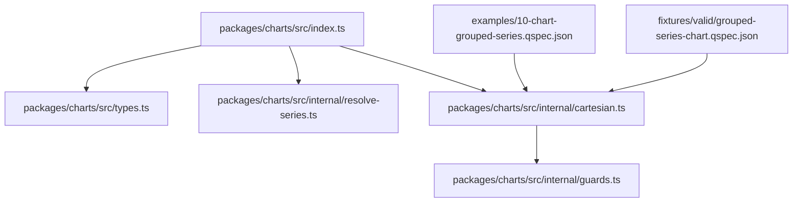
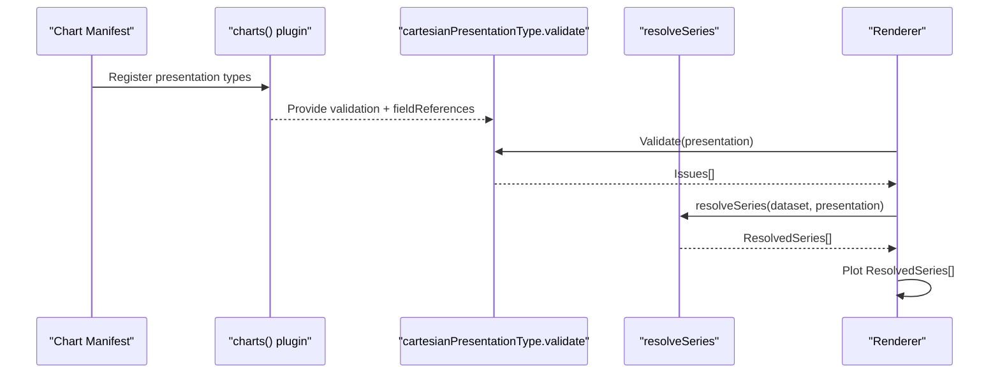
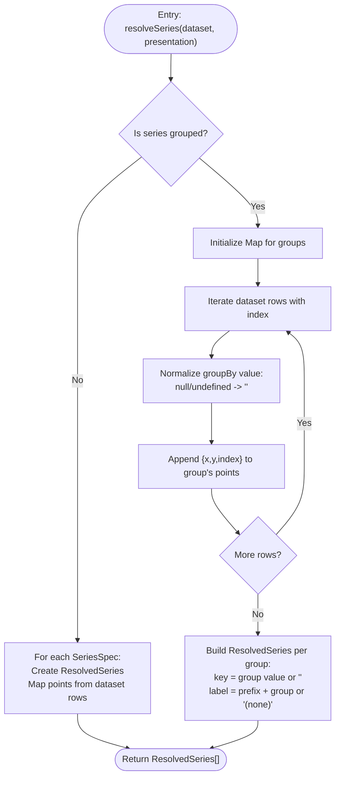
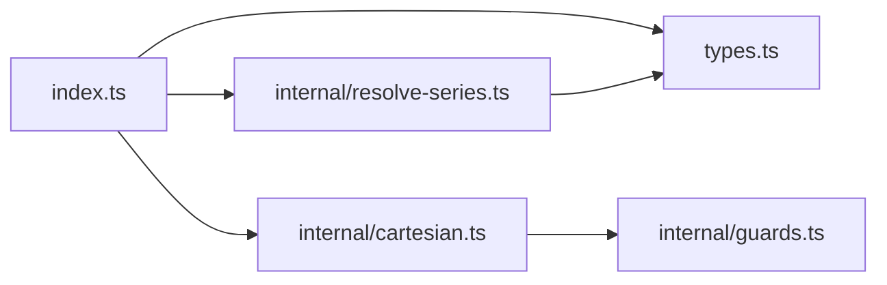

# Series Resolution and Data Mapping

<cite>
**Referenced Files in This Document**
- [index.ts](file://packages/charts/src/index.ts)
- [types.ts](file://packages/charts/src/types.ts)
- [resolve-series.ts](file://packages/charts/src/internal/resolve-series.ts)
- [cartesian.ts](file://packages/charts/src/internal/cartesian.ts)
- [guards.ts](file://packages/charts/src/internal/guards.ts)
- [10-chart-grouped-series.qspec.json](file://examples/10-chart-grouped-series.qspec.json)
- [grouped-series-chart.qspec.json](file://fixtures/valid/grouped-series-chart.qspec.json)
</cite>

## Table of Contents

1. Introduction
2. Project Structure
3. Core Components
4. Architecture Overview
5. Detailed Component Analysis
6. Dependency Analysis
7. Performance Considerations
8. Troubleshooting Guide
9. Conclusion
10. Appendices

## Introduction

This document explains how series are resolved from datasets in the @qspecs/charts package. It covers both grouped and ungrouped series, the resolveSeries function, the SeriesSpec and GroupedSeriesSpec interfaces, and the ResolvedSeries structure. It also details data mapping strategies, field selection, label handling, and aggregation behavior (or lack thereof), with examples of complex configurations and performance considerations for large datasets.

## Project Structure

The series resolution logic is implemented in a small, focused set of files:

- Public API exports types and the resolver
- Types define presentation shapes and series structures
- Internal modules validate presentations and implement series resolution
- Examples and fixtures demonstrate real-world chart manifests using grouped series

**Diagram sources**

- [index.ts:1-17](file://packages/charts/src/index.ts#L1-L17)
- [types.ts:1-87](file://packages/charts/src/types.ts#L1-L87)
- [resolve-series.ts:1-86](file://packages/charts/src/internal/resolve-series.ts#L1-L86)
- [cartesian.ts:1-161](file://packages/charts/src/internal/cartesian.ts#L1-L161)
- [guards.ts:1-22](file://packages/charts/src/internal/guards.ts#L1-L22)
- [10-chart-grouped-series.qspec.json:1-44](file://examples/10-chart-grouped-series.qspec.json#L1-L44)
- [grouped-series-chart.qspec.json:1-88](file://fixtures/valid/grouped-series-chart.qspec.json#L1-L88)

**Section sources**

- [index.ts:1-55](file://packages/charts/src/index.ts#L1-L55)
- [types.ts:1-87](file://packages/charts/src/types.ts#L1-L87)
- [cartesian.ts:1-161](file://packages/charts/src/internal/cartesian.ts#L1-L161)
- [resolve-series.ts:1-86](file://packages/charts/src/internal/resolve-series.ts#L1-L86)
- [guards.ts:1-22](file://packages/charts/src/internal/guards.ts#L1-L22)
- [10-chart-grouped-series.qspec.json:1-44](file://examples/10-chart-grouped-series.qspec.json#L1-L44)
- [grouped-series-chart.qspec.json:1-88](file://fixtures/valid/grouped-series-chart.qspec.json#L1-L88)

## Core Components

- SeriesSpec: Declares an explicit series by specifying the y field to plot; optional label overrides default naming.
- GroupedSeriesSpec: Declares a dynamic series derived at render time by partitioning rows on a groupBy field; optional label acts as a prefix for each group’s label.
- CartesianPresentation: The shared shape for line, bar, area, and scatter charts; includes x axis spec, series (either array of SeriesSpec or a single GroupedSeriesSpec), and display options.
- ResolvedSeries: One plottable series after resolution; includes stable key, label, source field, and ordered points.
- SeriesPoint: A single point with x, y, and index into the original dataset row.

Key behaviors:

- Ungrouped series map each dataset row to a point in order, preserving dataset row order.
- Grouped series partition rows by groupBy value, producing one series per distinct group in first-appearance order.
- Null or undefined group values are merged into a single “ungrouped” series labeled “(none)”.
- Labels: For explicit series, label falls back to field name; for grouped series, a declared label prefixes each group’s label with “: ”.

**Section sources**

- [types.ts:8-18](file://packages/charts/src/types.ts#L8-L18)
- [types.ts:36-43](file://packages/charts/src/types.ts#L36-L43)
- [types.ts:51-78](file://packages/charts/src/types.ts#L51-L78)
- [resolve-series.ts:9-85](file://packages/charts/src/internal/resolve-series.ts#L9-L85)

## Architecture Overview

The series resolution pipeline is intentionally renderer-agnostic. Presentations are validated, field references are extracted, and then resolveSeries transforms a dataset and a CartesianPresentation into ResolvedSeries that any renderer can consume consistently.

**Diagram sources**

- [index.ts:31-54](file://packages/charts/src/index.ts#L31-L54)
- [cartesian.ts:18-94](file://packages/charts/src/internal/cartesian.ts#L18-L94)
- [cartesian.ts:141-151](file://packages/charts/src/internal/cartesian.ts#L141-L151)
- [resolve-series.ts:28-85](file://packages/charts/src/internal/resolve-series.ts#L28-L85)

## Detailed Component Analysis

### resolveSeries Function

Purpose: Convert a dataset and a CartesianPresentation into a list of ResolvedSeries suitable for rendering.

Behavior:

- Ungrouped path: For each SeriesSpec, create a ResolvedSeries whose points are mapped directly from dataset rows, preserving order and including the original row index.
- Grouped path: Partition rows by groupBy into groups using a Map keyed by normalized group value; null/undefined become empty string keys and are labeled “(none)”; first-appearance order determines series order; labels use a declared prefix when provided.

Data mapping:

- x comes from presentation.x.field
- y comes from series.field
- index is the original dataset row index

Ownership:

- Returns fresh arrays and objects; point values reference dataset cells directly (no deep clone).

**Diagram sources**

- [resolve-series.ts:28-85](file://packages/charts/src/internal/resolve-series.ts#L28-L85)

**Section sources**

- [resolve-series.ts:1-86](file://packages/charts/src/internal/resolve-series.ts#L1-L86)

### SeriesSpec and GroupedSeriesSpec Interfaces

- SeriesSpec: field (string), optional label (string). Used for explicit series where each entry maps directly to a dataset column.
- GroupedSeriesSpec: field (string), groupBy (string), optional label (string). Used to derive multiple series dynamically by partitioning rows.

Label rules:

- Explicit series: label defaults to field if not provided.
- Grouped series: if label is provided, it becomes a prefix joined with “: ” to the group value; otherwise, the group value itself is used as label.

**Section sources**

- [types.ts:8-18](file://packages/charts/src/types.ts#L8-L18)
- [resolve-series.ts:34-44](file://packages/charts/src/internal/resolve-series.ts#L34-L44)
- [resolve-series.ts:70-84](file://packages/charts/src/internal/resolve-series.ts#L70-L84)

### ResolvedSeries and SeriesPoint Structures

- ResolvedSeries: key (stable identity), label (display name), field (source y field), points (ordered list of SeriesPoint).
- SeriesPoint: x (axis value), y (series value), index (original dataset row index).

Index usage:

- Enables downstream renderers to merge multiple series onto a shared axis while preserving dataset ordering across series.

**Section sources**

- [types.ts:51-78](file://packages/charts/src/types.ts#L51-L78)

### Cartesian Presentation Validation and Field References

Validation ensures:

- x is present and has a non-empty field
- series is either a non-empty array of valid entries or a grouped series object with required fields
- optional y, legend, tooltip blocks are well-formed
- Duplicate series fields are rejected to avoid unstable renderer keys

Field references:

- Extracts all referenced fields (x.field, series[].field, and for grouped series, both series.field and series.groupBy) so upstream systems can verify dataset schema compatibility before execution.

**Section sources**

- [cartesian.ts:18-94](file://packages/charts/src/internal/cartesian.ts#L18-L94)
- [cartesian.ts:107-132](file://packages/charts/src/internal/cartesian.ts#L107-L132)
- [guards.ts:15-21](file://packages/charts/src/internal/guards.ts#L15-L21)

### Example Configurations

- Ungrouped series: Multiple explicit series plotted against a shared x axis.
- Grouped series: A single series declaration partitions rows by a dimension (e.g., region), producing one series per distinct group in first-appearance order.

Examples in repository:

- Grouped series example manifest demonstrates a query returning month, region, revenue and a presentation that groups by region.
- Fixture shows a similar configuration with metadata, parameters, query bindings, dataset fields, and presentation.

**Section sources**

- [10-chart-grouped-series.qspec.json:1-44](file://examples/10-chart-grouped-series.qspec.json#L1-L44)
- [grouped-series-chart.qspec.json:1-88](file://fixtures/valid/grouped-series-chart.qspec.json#L1-L88)

## Dependency Analysis

The module dependencies form a clear separation between public API, type definitions, validation, and resolution logic.

**Diagram sources**

- [index.ts:1-17](file://packages/charts/src/index.ts#L1-L17)
- [types.ts:1-87](file://packages/charts/src/types.ts#L1-L87)
- [resolve-series.ts:1-86](file://packages/charts/src/internal/resolve-series.ts#L1-L86)
- [cartesian.ts:1-161](file://packages/charts/src/internal/cartesian.ts#L1-L161)
- [guards.ts:1-22](file://packages/charts/src/internal/guards.ts#L1-L22)

**Section sources**

- [index.ts:1-55](file://packages/charts/src/index.ts#L1-L55)
- [cartesian.ts:1-161](file://packages/charts/src/internal/cartesian.ts#L1-L161)
- [resolve-series.ts:1-86](file://packages/charts/src/internal/resolve-series.ts#L1-L86)
- [types.ts:1-87](file://packages/charts/src/types.ts#L1-L87)
- [guards.ts:1-22](file://packages/charts/src/internal/guards.ts#L1-L22)

## Performance Considerations

- Time complexity:
  - Ungrouped series: O(N) per series, where N is the number of dataset rows.
  - Grouped series: O(N) to partition rows into groups using a Map; subsequent series construction is proportional to total points.
- Memory:
  - Freshly allocated series and points arrays per call; point values alias dataset cell values (no deep cloning), reducing memory overhead but requiring callers to avoid mutating composite cell internals.
- Large datasets:
  - Prefer grouping by low-cardinality dimensions to keep the number of series manageable.
  - Use dataset transforms (filter, select, limit) upstream to reduce N before resolution.
  - Avoid excessive nested groupings; if you need multi-level grouping, pre-aggregate in the query or transform layer.
- Stability:
  - First-appearance order for groups avoids extra sorting passes; this is deterministic and efficient.
- Label computation:
  - Prefix concatenation for grouped labels is minimal overhead compared to I/O and rendering costs.

[No sources needed since this section provides general guidance]

## Troubleshooting Guide

Common issues and resolutions:

- Missing or invalid x field: Ensure presentation.x.field exists in the dataset; validation will flag missing or empty values.
- Invalid series definition: series must be either a non-empty array of SeriesSpec or a GroupedSeriesSpec with field and groupBy; validation reports precise paths.
- Duplicate series fields: Rejects duplicate field names in explicit series to prevent unstable renderer keys.
- Null or empty group values: These are merged into a single “(none)” series; ensure your visualization handles this gracefully.
- Unexpected series order: Grouped series appear in first-appearance order; do not assume alphabetical order.
- Mutating point values: Point values alias dataset cells; avoid mutating object/array-valued cells reached through points.

**Section sources**

- [cartesian.ts:18-94](file://packages/charts/src/internal/cartesian.ts#L18-L94)
- [resolve-series.ts:53-68](file://packages/charts/src/internal/resolve-series.ts#L53-L68)
- [resolve-series.ts:70-84](file://packages/charts/src/internal/resolve-series.ts#L70-L84)

## Conclusion

The @qspecs/charts series resolution system provides a consistent, renderer-agnostic way to convert datasets and presentation specs into plottable series. It supports both explicit and dynamic grouped series, preserves dataset order, and offers predictable labeling and error reporting. By understanding the interfaces and the resolveSeries algorithm, consumers can build robust visualizations that scale to large datasets and remain portable across renderers.

[No sources needed since this section summarizes without analyzing specific files]

## Appendices

### API Surface Summary

- Exports:
  - Types: AxisSpec, SeriesSpec, GroupedSeriesSpec, CartesianPresentation, LegendSpec, TooltipSpec, SeriesPoint, ResolvedSeries, PiePresentation
  - Utilities: isGroupedSeries
  - Resolver: resolveSeries, UNGROUPED_LABEL
- Plugin registration:
  - Registers standard presentation types and Chart resource requirements

**Section sources**

- [index.ts:5-17](file://packages/charts/src/index.ts#L5-L17)
- [index.ts:31-54](file://packages/charts/src/index.ts#L31-L54)
