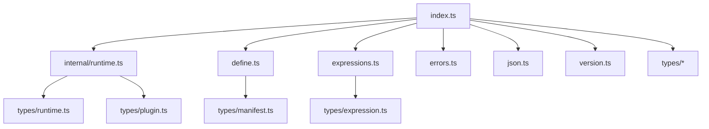
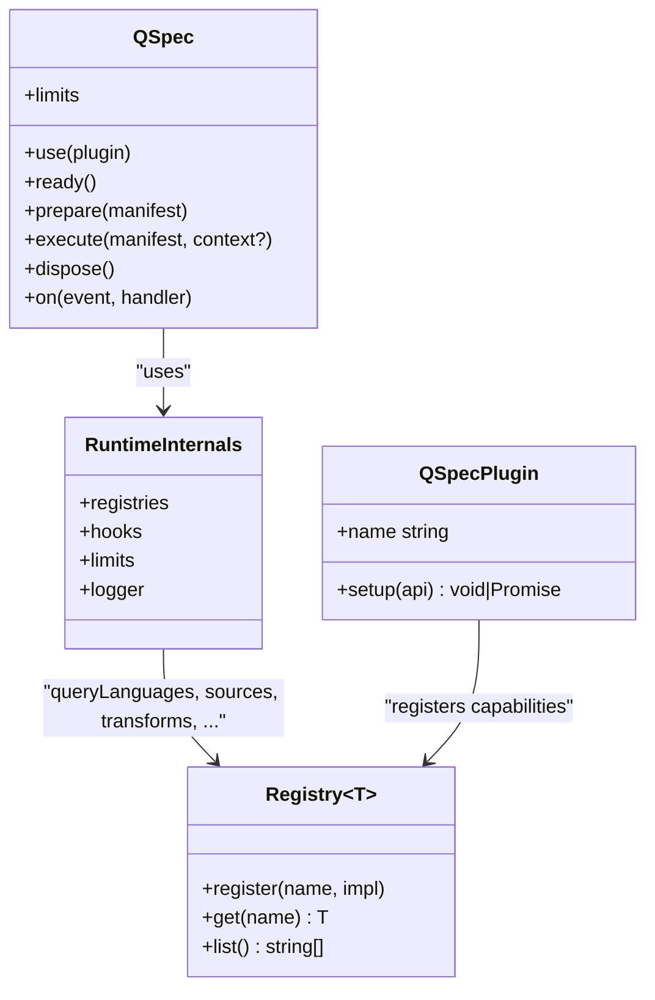
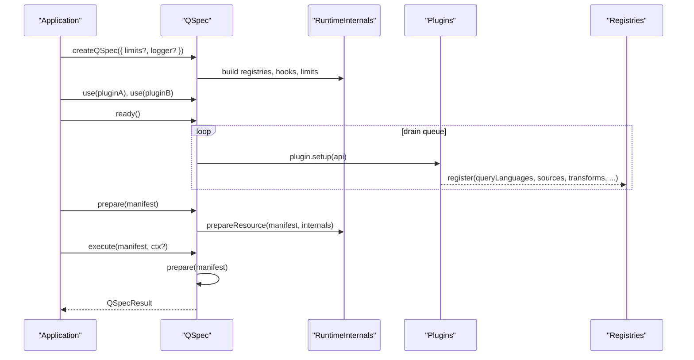
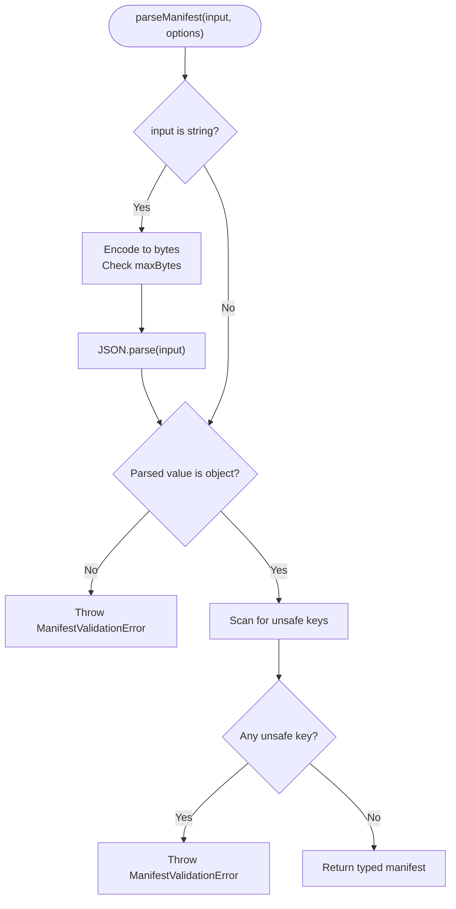
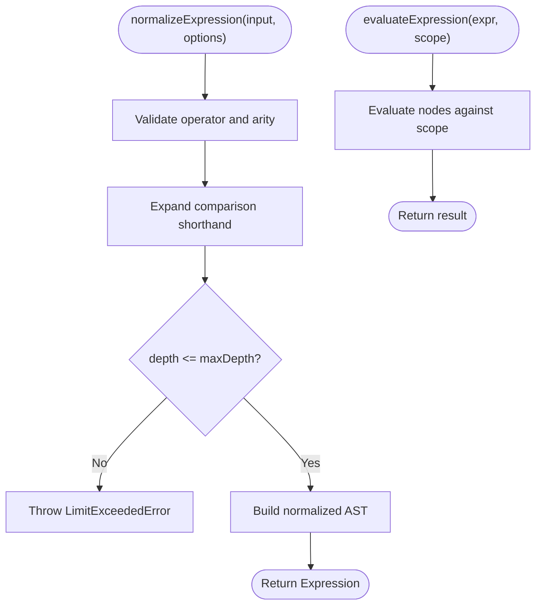
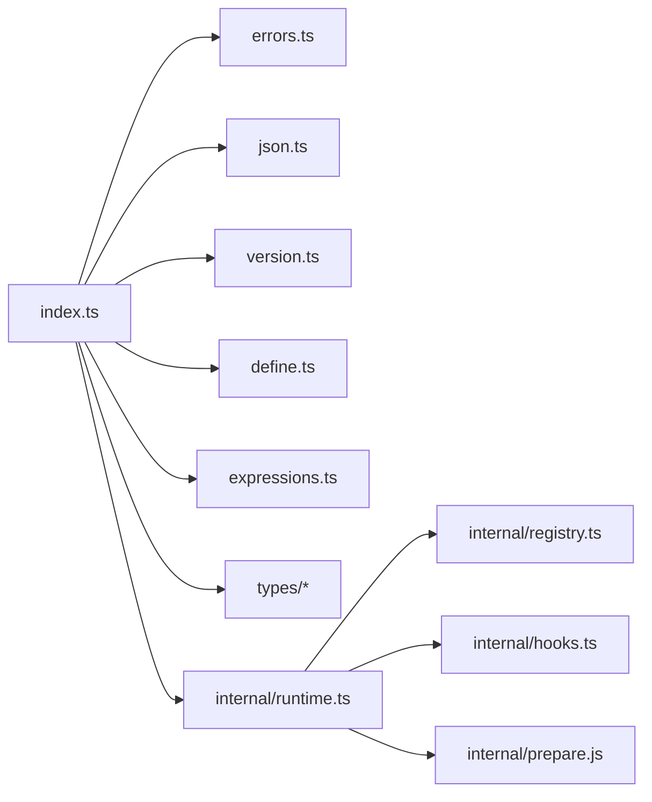

# Core Runtime (@qspecs/core)

<cite>
**Referenced Files in This Document**
- [index.ts](file://packages/core/src/index.ts)
- [runtime.ts](file://packages/core/src/internal/runtime.ts)
- [define.ts](file://packages/core/src/define.ts)
- [expressions.ts](file://packages/core/src/expressions.ts)
- [errors.ts](file://packages/core/src/errors.ts)
- [json.ts](file://packages/core/src/json.ts)
- [version.ts](file://packages/core/src/version.ts)
- [plugin.ts](file://packages/core/src/types/plugin.ts)
- [runtime.ts (types)](file://packages/core/src/types/runtime.ts)
- [manifest.ts](file://packages/core/src/types/manifest.js)
- [parameters.ts](file://packages/core/src/types/parameters.js)
- [dataset.ts](file://packages/core/src/types/dataset.js)
</cite>

## Table of Contents

1. [Introduction](#introduction)
2. [Project Structure](#project-structure)
3. [Core Components](#core-components)
4. [Architecture Overview](#architecture-overview)
5. [Detailed Component Analysis](#detailed-component-analysis)
6. [Dependency Analysis](#dependency-analysis)
7. [Performance Considerations](#performance-considerations)
8. [Troubleshooting Guide](#troubleshooting-guide)
9. [Conclusion](#conclusion)
10. [Appendices](#appendices)

## Introduction

This document provides comprehensive API documentation for the @qspecs/core package, the zero-dependency runtime foundation of QSpec. It covers:

- The createQSpec() factory and its configuration options, including plugin registration, limits, and event handlers
- Manifest definition and parsing via defineManifest(), parseManifest(), and definePlugin()
- Expression evaluation with evaluateExpression(), normalizeExpression(), and supported expression syntax
- Core types such as QSpec, ExecutionContext, Dataset, ParameterDefinition, and Plugin interfaces
- Examples of plugin registration, manifest parsing, execution context setup, and error handling patterns
- Security considerations, performance limits, and integration patterns with other QSpec packages

## Project Structure

The core package exposes a focused public surface through a single index that re-exports types and functions from internal modules. Key responsibilities:

- Factory and lifecycle: createQSpec() builds a runtime instance with registries, hooks, limits, and logger
- Manifest handling: defineManifest(), parseManifest(), definePlugin()
- Expressions: normalizeExpression(), evaluateExpression()
- Types: QSpec, ExecutionContext, Dataset, ParameterDefinition, Plugin interfaces
- Errors: structured error classes and helpers
- JSON utilities: unsafe key detection, row creation, deep freeze

**Diagram sources**

- [index.ts:1-106](file://packages/core/src/index.ts#L1-L106)
- [runtime.ts:44-171](file://packages/core/src/internal/runtime.ts#L44-L171)
- [define.ts:10-123](file://packages/core/src/define.ts#L10-L123)
- [expressions.ts:1-35](file://packages/core/src/expressions.ts#L1-L35)
- [errors.ts:44-180](file://packages/core/src/errors.ts#L44-L180)
- [json.ts:1-64](file://packages/core/src/json.ts#L1-L64)
- [version.ts:1-6](file://packages/core/src/version.ts#L1-L6)

**Section sources**

- [index.ts:1-106](file://packages/core/src/index.ts#L1-L106)

## Core Components

- createQSpec(options): Creates a runtime instance with configurable limits, logger, and plugin lifecycle management. Provides use(), ready(), prepare(), execute(), dispose(), and on() for events.
- defineManifest(manifest): Identity helper to preserve literal types for manifests.
- parseManifest(input, options): Parses string or object manifests, enforces maxBytes, rejects unsafe keys, and returns a typed manifest.
- definePlugin(plugin): Identity helper to preserve literal types for plugins.
- normalizeExpression(input, options): Validates and canonicalizes expressions, enforcing depth limits and rejecting unknown operators.
- evaluateExpression(expression, scope): Evaluates normalized expressions against an execution scope.
- Error types: Structured errors like ManifestValidationError, LimitExceededError, QueryExecutionError, etc.
- JSON utilities: isUnsafeKey, createRow, setKey, deepFreeze, isPlainObject.

**Section sources**

- [runtime.ts:44-171](file://packages/core/src/internal/runtime.ts#L44-L171)
- [define.ts:10-123](file://packages/core/src/define.ts#L10-L123)
- [expressions.ts:1-35](file://packages/core/src/expressions.ts#L1-L35)
- [errors.ts:44-180](file://packages/core/src/errors.ts#L44-L180)
- [json.ts:1-64](file://packages/core/src/json.ts#L1-L64)

## Architecture Overview

The runtime composes registries for query languages, data sources, transforms, semantic types, resource kinds, presentations, and renderers. Plugins register capabilities during setup. The runtime enforces limits and provides hooks for lifecycle events.

**Diagram sources**

- [runtime.ts:28-78](file://packages/core/src/internal/runtime.ts#L28-L78)
- [runtime.ts:117-171](file://packages/core/src/internal/runtime.ts#L117-L171)
- [plugin.ts:1-200](file://packages/core/src/types/plugin.ts#L1-L200)

## Detailed Component Analysis

### createQSpec() Factory

- Purpose: Build a runtime instance with merged limits, optional logger, hook system, and capability registries.
- Configuration:
  - limits: Merge with DEFAULT_LIMITS; enforce constraints like maxExpressionDepth, maxTransforms, maxRows.
  - logger: Optional logging interface used by hooks and lifecycle.
  - Hooks: on() registers event handlers; failures in handlers are logged but not propagated.
- Methods:
  - use(plugin): Queue a plugin for setup; supports chaining.
  - ready(): Drains queued plugins sequentially; poisons runtime on first failure to prevent inconsistent state.
  - prepare(manifest): Prepares a resource using installed plugins and registries.
  - execute(manifest, context?): Executes prepared resource with optional execution context.
  - dispose(): Calls source-specific disposal if provided.
  - on(event, handler): Registers lifecycle event handlers.

**Diagram sources**

- [runtime.ts:44-171](file://packages/core/src/internal/runtime.ts#L44-L171)

**Section sources**

- [runtime.ts:44-171](file://packages/core/src/internal/runtime.ts#L44-L171)
- [version.ts:1-6](file://packages/core/src/version.ts#L1-L6)

### Manifest Definition and Parsing

- defineManifest(manifest): Preserves literal types for compile-time checks without runtime overhead.
- parseManifest(input, options):
  - Accepts string or already-parsed object.
  - Enforces maxBytes when input is a string to bound untrusted JSON parsing cost.
  - Rejects unsafe keys that can corrupt prototypes.
  - Throws ManifestValidationError for invalid JSON or non-object roots.
- definePlugin(plugin): Preserves literal types for plugin definitions.

**Diagram sources**

- [define.ts:74-114](file://packages/core/src/define.ts#L74-L114)
- [json.ts:6-16](file://packages/core/src/json.ts#L6-L16)

**Section sources**

- [define.ts:10-123](file://packages/core/src/define.ts#L10-L123)
- [json.ts:6-16](file://packages/core/src/json.ts#L6-L16)

### Expression Evaluation Subsystem

- normalizeExpression(input, options):
  - Expands comparison shorthands.
  - Rejects unknown operators and wrong arity.
  - Enforces maxDepth to prevent deep recursion.
  - Supports path prefixing for diagnostics.
- evaluateExpression(expression, scope):
  - Evaluates normalized expressions against an execution scope.
  - Used by transforms and queries to compute values safely.

**Diagram sources**

- [expressions.ts:1-35](file://packages/core/src/expressions.ts#L1-L35)
- [errors.ts:173-180](file://packages/core/src/errors.ts#L173-L180)

**Section sources**

- [expressions.ts:1-35](file://packages/core/src/expressions.ts#L1-L35)

### Core Types Overview

- QSpec: Runtime instance with limits, lifecycle methods, and event subscription.
- ExecutionContext: Context passed to execute() for parameter binding and runtime data.
- Dataset: Data model for tabular results with schema and rows.
- ParameterDefinition: Defines parameters with type, validation, and presentation hints.
- Plugin interfaces: QSpecPlugin, QSpecPluginAPI, DataSource, Transform, Renderer, ResourceKind, SemanticType, QueryLanguage.

These types are exported from the package’s index and defined under types/*.

**Section sources**

- [index.ts:21-105](file://packages/core/src/index.ts#L21-L105)
- [runtime.ts (types):1-200](file://packages/core/src/types/runtime.ts#L1-L200)
- [plugin.ts:1-200](file://packages/core/src/types/plugin.ts#L1-L200)
- [manifest.ts:1-200](file://packages/core/src/types/manifest.js#L1-L200)
- [parameters.ts:1-200](file://packages/core/src/types/parameters.js#L1-L200)
- [dataset.ts:1-200](file://packages/core/src/types/dataset.js#L1-L200)

## Dependency Analysis

- Public exports are centralized in index.ts, which re-exports:
  - Errors and JSON utilities
  - Version constants
  - Manifest tools (defineManifest, parseManifest, definePlugin)
  - Expression subsystem (normalizeExpression, evaluateExpression)
  - Types for datasets, parameters, presentations, plugins, runtime
  - Validation helpers and suggest utility
- Internal runtime composes registries and hooks, and delegates preparation and execution to internal modules.

**Diagram sources**

- [index.ts:1-106](file://packages/core/src/index.ts#L1-L106)
- [runtime.ts:28-78](file://packages/core/src/internal/runtime.ts#L28-L78)

**Section sources**

- [index.ts:1-106](file://packages/core/src/index.ts#L1-L106)

## Performance Considerations

- Limits:
  - maxManifestBytes: Bounds untrusted JSON parsing cost; enforced only for string inputs.
  - maxExpressionDepth: Prevents deep recursion in expression normalization and evaluation.
  - maxTransforms, maxRows: Applied during prepare/execute pipelines.
- Memory:
  - Dataset rows use null-prototype objects to avoid prototype pollution and reduce overhead.
  - Prepared structures can be deep-frozen to guarantee immutability after preparation.
- Concurrency:
  - Plugin setup is serialized; ready() ensures at most one drain runs at a time.
  - Concurrent ready() calls share a draining promise to avoid duplicate work.

[No sources needed since this section provides general guidance]

## Troubleshooting Guide

Common errors and handling patterns:

- ManifestValidationError: Thrown for invalid JSON, non-object root, or unsafe keys. Inspect issues array for code, message, and path.
- LimitExceededError: Thrown when configured limits (e.g., maxManifestBytes, maxExpressionDepth) are exceeded.
- QueryCompilationError / QueryExecutionError: Thrown during query compilation or execution phases.
- TransformError: Thrown when transform logic fails; includes path information for diagnostics.
- PluginRegistrationError: Thrown if a plugin is already installed or setup fails.
- QSpecAbortError: Thrown when execution is aborted via AbortSignal.

Best practices:

- Catch QSpecError subclasses to handle specific failure modes.
- Use formatPath() to render diagnostic paths consistently.
- Log warnings from hooks; hook exceptions are caught and logged, not propagated.

**Section sources**

- [errors.ts:44-180](file://packages/core/src/errors.ts#L44-L180)
- [runtime.ts:93-115](file://packages/core/src/internal/runtime.ts#L93-L115)

## Conclusion

@qspecs/core provides a secure, zero-dependency runtime for QSpec with strong typing, robust error reporting, and clear extension points via plugins. Use createQSpec() to configure limits and logging, register plugins, parse and validate manifests, and evaluate expressions safely. Integrate with downstream packages (http, postgres, sql, transforms, charts) by registering their capabilities during plugin setup.

[No sources needed since this section summarizes without analyzing specific files]

## Appendices

### API Reference Summary

- Factory: createQSpec(options)
  - Options: limits, logger
  - Methods: use(), ready(), prepare(), execute(), dispose(), on()
- Manifest: defineManifest(), parseManifest(input, { maxBytes? }), definePlugin()
- Expressions: normalizeExpression(input, { maxDepth, path? }), evaluateExpression(expr, scope)
- Types: QSpec, ExecutionContext, Dataset, ParameterDefinition, Plugin interfaces
- Errors: QSpecError hierarchy and helpers

**Section sources**

- [index.ts:1-106](file://packages/core/src/index.ts#L1-L106)
- [runtime.ts:44-171](file://packages/core/src/internal/runtime.ts#L44-L171)
- [define.ts:10-123](file://packages/core/src/define.ts#L10-L123)
- [expressions.ts:1-35](file://packages/core/src/expressions.ts#L1-L35)
- [errors.ts:44-180](file://packages/core/src/errors.ts#L44-L180)
