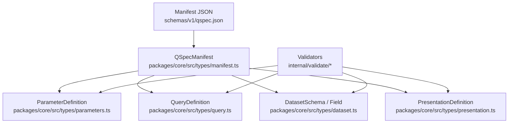
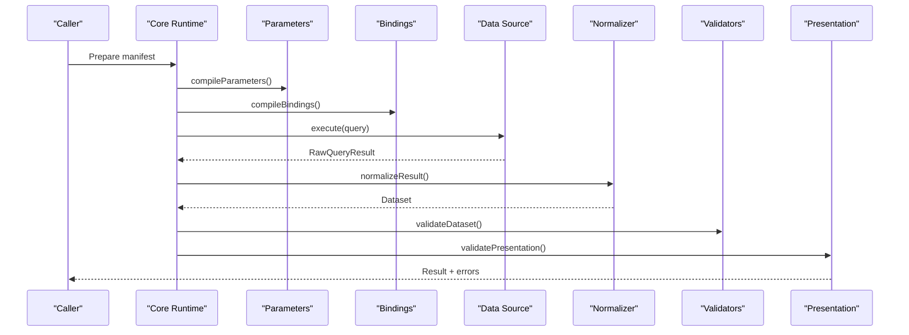
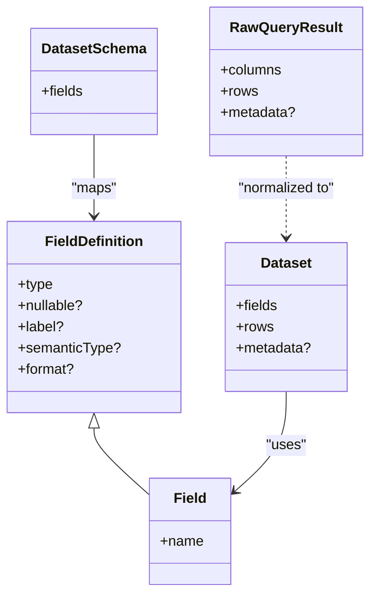
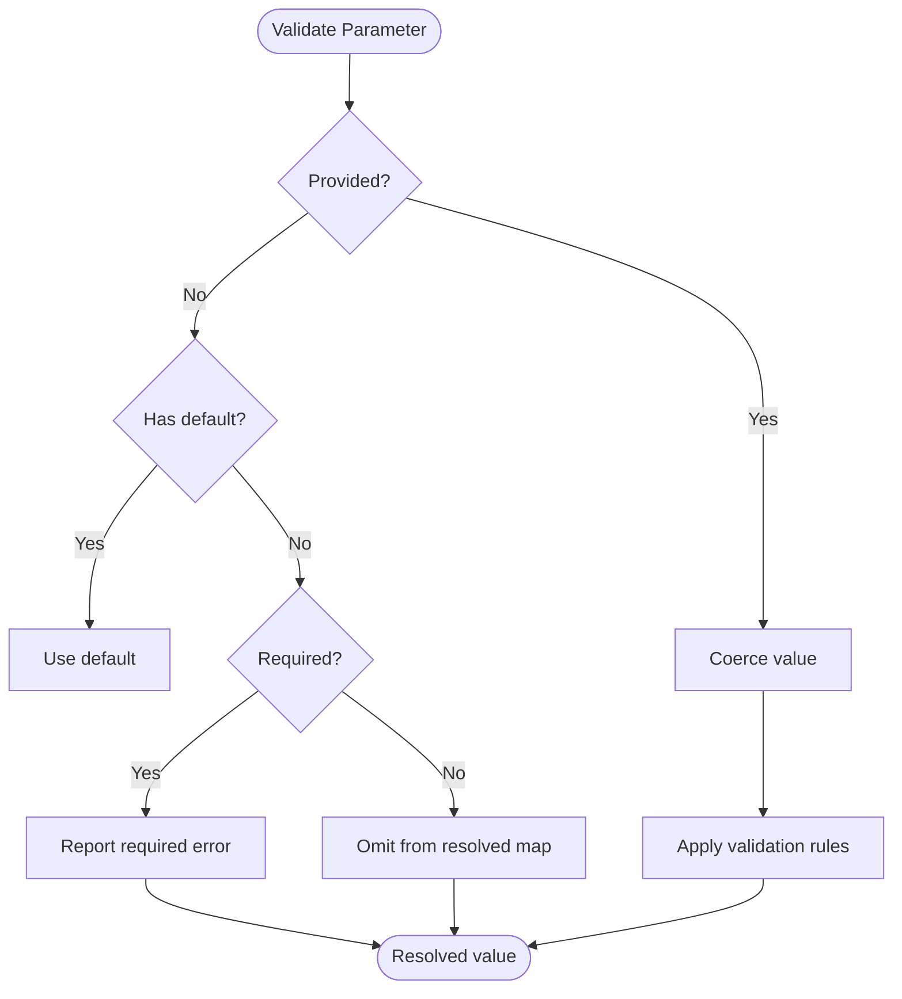
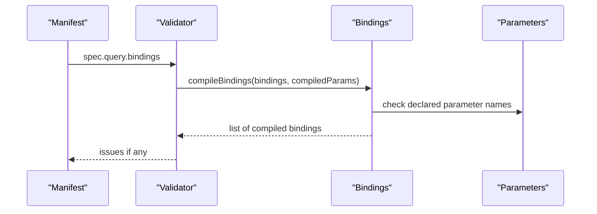
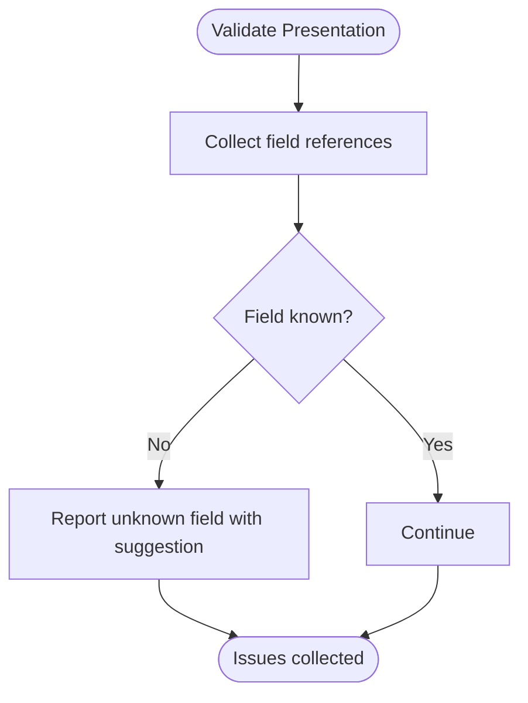
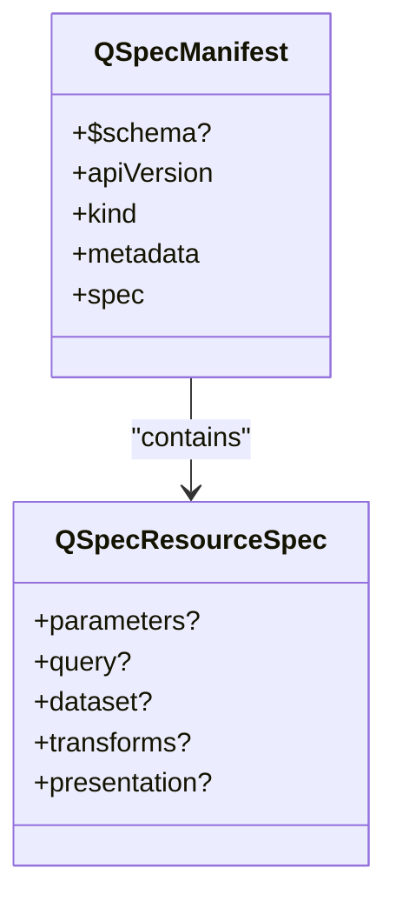
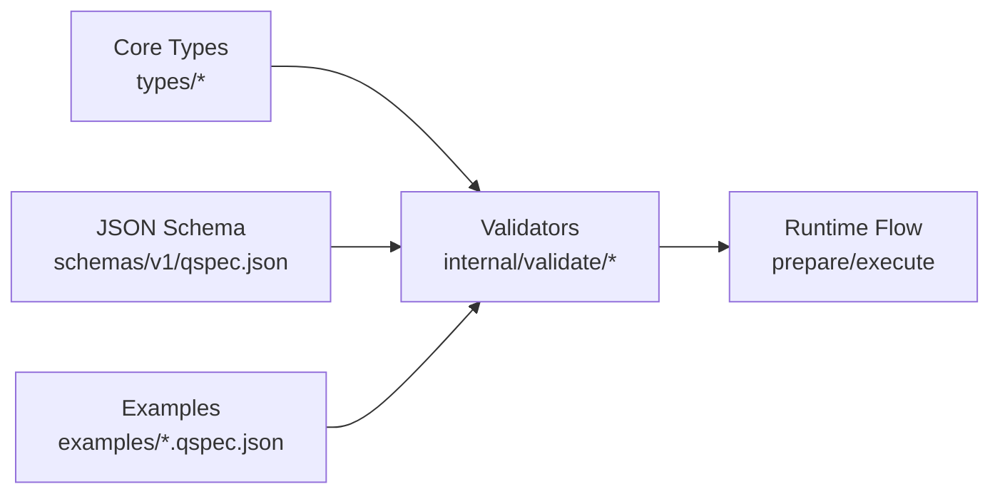

# Core Type Definitions

<cite>
**Referenced Files in This Document**
- [dataset.ts](file://packages/core/src/types/dataset.ts)
- [parameters.ts](file://packages/core/src/types/parameters.ts)
- [query.ts](file://packages/core/src/types/query.ts)
- [presentation.ts](file://packages/core/src/types/presentation.ts)
- [manifest.ts](file://packages/core/src/types/manifest.ts)
- [qspec.json](file://schemas/v1/qspec.json)
- [parameters.ts (validator)](file://packages/core/src/internal/validate/parameters.ts)
- [bindings.ts](file://packages/core/src/internal/bindings.ts)
- [manifest validator](file://packages/core/src/internal/validate/manifest.ts)
- [dataset validator](file://packages/core/src/internal/validate/dataset.ts)
- [presentation validator](file://packages/core/src/internal/validate/presentation.ts)
- [datasets.md](file://docs/datasets.md)
- [parameters.md](file://docs/parameters.md)
- [01-complete-manifest.qspec.json](file://examples/01-complete-manifest.qspec.json)
- [03-parameterized-query.qspec.json](file://examples/03-parameterized-query.qspec.json)
</cite>

## Table of Contents

1. [Introduction](#introduction)
2. [Project Structure](#project-structure)
3. [Core Components](#core-components)
4. [Architecture Overview](#architecture-overview)
5. [Detailed Component Analysis](#detailed-component-analysis)
6. [Dependency Analysis](#dependency-analysis)
7. [Performance Considerations](#performance-considerations)
8. [Troubleshooting Guide](#troubleshooting-guide)
9. [Conclusion](#conclusion)
10. [Appendices](#appendices)

## Introduction

This document explains the core type system used by QSpec manifests and runtime: Dataset, Field, ParameterDefinition, QueryDefinition, and PresentationDefinition. It covers type hierarchies, validation rules, relationships between type systems, field types, parameter validation schemas, query binding patterns, dataset schema evolution, field metadata, data transformation contracts, TypeScript usage examples, type guards, common manipulation patterns, compile-time safety benefits, and integration with external type systems.

## Project Structure

The type definitions are centralized in the core package’s types module and enforced by validators and JSON Schema. Manifests reference these types through a versioned JSON Schema and typed interfaces consumed by tooling and plugins.

**Diagram sources**

- [qspec.json:1-143](file://schemas/v1/qspec.json#L1-L143)
- [manifest.ts:1-40](file://packages/core/src/types/manifest.ts#L1-L40)
- [parameters.ts:1-39](file://packages/core/src/types/parameters.ts#L1-L39)
- [query.ts:1-17](file://packages/core/src/types/query.ts#L1-L17)
- [dataset.ts:1-75](file://packages/core/src/types/dataset.ts#L1-L75)
- [presentation.ts:1-25](file://packages/core/src/types/presentation.ts#L1-L25)

**Section sources**

- [qspec.json:1-143](file://schemas/v1/qspec.json#L1-L143)
- [manifest.ts:1-40](file://packages/core/src/types/manifest.ts#L1-L40)

## Core Components

- Dataset: Normalized result of query execution with fields, rows, and optional metadata.
- Field: Declared or inferred column definition with name, type, nullability, label, semanticType, and format.
- ParameterDefinition: Typed input declaration with required/default/validation/presentation.
- QueryDefinition: Source, language, statement, and bindings to parameters or literals.
- PresentationDefinition: Extensible presentation configuration keyed by a discriminator type.

Key relationships:

- Manifest spec composes parameters, query, dataset schema, transforms, and presentation.
- Query bindings resolve to compiled parameters; datasets validate against declared schemas.
- Presentations reference dataset fields produced after transforms.

**Section sources**

- [dataset.ts:25-58](file://packages/core/src/types/dataset.ts#L25-L58)
- [parameters.ts:27-38](file://packages/core/src/types/parameters.ts#L27-L38)
- [query.ts:1-17](file://packages/core/src/types/query.ts#L1-L17)
- [presentation.ts:1-25](file://packages/core/src/types/presentation.ts#L1-L25)
- [manifest.ts:23-39](file://packages/core/src/types/manifest.ts#L23-L39)

## Architecture Overview

The runtime validates and normalizes inputs in stages:

1. Manifest structure validated against JSON Schema and internal checks.
2. Parameters compiled and validated (required, defaults, constraints).
3. Query bindings compiled and resolved to values.
4. Data source returns RawQueryResult; normalized into Dataset.
5. Dataset validated against declared schema (field presence, types, nullability).
6. Transforms applied immutably.
7. Presentation validated against projected fields.

**Diagram sources**

- [parameters.ts (validator):53-108](file://packages/core/src/internal/validate/parameters.ts#L53-L108)
- [bindings.ts:67-79](file://packages/core/src/internal/bindings.ts#L67-L79)
- [dataset.ts:60-75](file://packages/core/src/types/dataset.ts#L60-L75)
- [dataset validator:35-100](file://packages/core/src/internal/validate/dataset.ts#L35-L100)
- [presentation validator:47-78](file://packages/core/src/internal/validate/presentation.ts#L47-L78)

## Detailed Component Analysis

### Dataset and Field Types

- FieldType enumerates supported column types for datasets: string, number, integer, boolean, date, datetime, object, array.
- FieldDefinition declares a column’s type, nullable flag, label, semanticType, and free-form format.
- Field extends FieldDefinition with name; order is significant.
- DatasetSchema maps field names to FieldDefinition.
- Dataset carries fields, rows (null-prototype objects), and optional metadata (e.g., truncated).
- RawQueryResult is positional: columns plus arrays of row cells; normalization converts to named rows.

Validation highlights:

- Missing declared fields reported with suggestions.
- Type mismatches reported per field.
- Non-nullable violations flagged per row index.
- Extra undeclared fields are allowed.

**Diagram sources**

- [dataset.ts:4-42](file://packages/core/src/types/dataset.ts#L4-L42)
- [dataset.ts:53-75](file://packages/core/src/types/dataset.ts#L53-L75)

**Section sources**

- [dataset.ts:4-42](file://packages/core/src/types/dataset.ts#L4-L42)
- [dataset.ts:53-75](file://packages/core/src/types/dataset.ts#L53-L75)
- [dataset validator:35-100](file://packages/core/src/internal/validate/dataset.ts#L35-L100)
- [datasets.md:22-61](file://docs/datasets.md#L22-L61)
- [datasets.md:63-112](file://docs/datasets.md#L63-L112)
- [datasets.md:113-163](file://docs/datasets.md#L113-L163)

### ParameterDefinition and Validation

- ParameterType includes string, number, integer, boolean, date, datetime, enum, array.
- ParameterValidation supports min/max for numbers and minLength/maxLength for strings and arrays.
- ParameterPresentation provides advisory UI hints (control, label, placeholder, help).
- ParameterDefinition includes type, required, default, description, values (for enum), items (for array), validation, presentation.

Runtime validation:

- Defaults validated at compile time using the same coercion logic as runtime inputs.
- Date/datetime must be valid ISO strings and real calendar dates.
- Enum requires exact match among declared values.
- Array elements validated recursively via scalar checks; length constraints apply to arrays.
- Unknown parameters in caller input are rejected.

**Diagram sources**

- [parameters.ts (validator):120-169](file://packages/core/src/internal/validate/parameters.ts#L120-L169)
- [parameters.ts (validator):171-209](file://packages/core/src/internal/validate/parameters.ts#L171-L209)
- [parameters.ts (validator):211-256](file://packages/core/src/internal/validate/parameters.ts#L211-L256)
- [parameters.ts (validator):278-332](file://packages/core/src/internal/validate/parameters.ts#L278-L332)

**Section sources**

- [parameters.ts:1-39](file://packages/core/src/types/parameters.ts#L1-L39)
- [parameters.ts (validator):53-108](file://packages/core/src/internal/validate/parameters.ts#L53-L108)
- [parameters.ts (validator):120-169](file://packages/core/src/internal/validate/parameters.ts#L120-L169)
- [parameters.ts (validator):171-209](file://packages/core/src/internal/validate/parameters.ts#L171-L209)
- [parameters.ts (validator):211-256](file://packages/core/src/internal/validate/parameters.ts#L211-L256)
- [parameters.ts (validator):278-332](file://packages/core/src/internal/validate/parameters.ts#L278-L332)
- [parameters.md:25-49](file://docs/parameters.md#L25-L49)
- [parameters.md:50-74](file://docs/parameters.md#L50-L74)
- [parameters.md:76-115](file://docs/parameters.md#L76-L115)
- [parameters.md:116-151](file://docs/parameters.md#L116-L151)

### QueryDefinition and Binding Patterns

- Binding can be:
  - String reference to a parameter: "$parameters.<name>"
  - Object with exactly one of "parameter" or "literal"
- QueryDefinition has source, language, statement (typed generically), and optional bindings map.

Binding compilation and validation:

- String form must match the parameter reference pattern; otherwise it is a manifest error.
- Object form enforces mutual exclusivity of "parameter" and "literal".
- References to undeclared parameters are reported with suggestions.

**Diagram sources**

- [query.ts:1-17](file://packages/core/src/types/query.ts#L1-L17)
- [bindings.ts:67-79](file://packages/core/src/internal/bindings.ts#L67-L79)
- [manifest validator:111-189](file://packages/core/src/internal/validate/manifest.ts#L111-L189)

**Section sources**

- [query.ts:1-17](file://packages/core/src/types/query.ts#L1-L17)
- [bindings.ts:67-79](file://packages/core/src/internal/bindings.ts#L67-L79)
- [manifest validator:111-189](file://packages/core/src/internal/validate/manifest.ts#L111-L189)

### PresentationDefinition and Field References

- PresentationDefinition is extensible with a discriminator "type" and arbitrary additional properties.
- FieldReference captures where a presentation references a dataset field and its path.
- Presentation validation checks that referenced fields exist in the projected dataset after transforms.

**Diagram sources**

- [presentation.ts:1-25](file://packages/core/src/types/presentation.ts#L1-L25)
- [presentation validator:47-78](file://packages/core/src/internal/validate/presentation.ts#L47-L78)

**Section sources**

- [presentation.ts:1-25](file://packages/core/src/types/presentation.ts#L1-L25)
- [presentation validator:47-78](file://packages/core/src/internal/validate/presentation.ts#L47-L78)

### Manifest Composition and Schema

- QSpecManifest composes apiVersion, kind, metadata, and spec.
- QSpecResourceSpec includes parameters, query, dataset, transforms, presentation, and allows vendor extensions.
- JSON Schema v1 defines structural constraints for all sections, including parameter types, binding forms, dataset fields, and presentation.

**Diagram sources**

- [manifest.ts:10-39](file://packages/core/src/types/manifest.ts#L10-L39)
- [qspec.json:1-143](file://schemas/v1/qspec.json#L1-L143)

**Section sources**

- [manifest.ts:10-39](file://packages/core/src/types/manifest.ts#L10-L39)
- [qspec.json:1-143](file://schemas/v1/qspec.json#L1-L143)

## Dependency Analysis

- Core types depend on shared JSON primitives (JsonValue, JsonObject).
- Validators depend on types and produce structured issues with paths and suggestions.
- JSON Schema acts as a contract for manifests consumed by tooling and CLI.
- Examples demonstrate end-to-end usage of parameters, queries, datasets, and presentations.

**Diagram sources**

- [parameters.ts:1-39](file://packages/core/src/types/parameters.ts#L1-L39)
- [dataset.ts:1-75](file://packages/core/src/types/dataset.ts#L1-L75)
- [query.ts:1-17](file://packages/core/src/types/query.ts#L1-L17)
- [presentation.ts:1-25](file://packages/core/src/types/presentation.ts#L1-L25)
- [qspec.json:1-143](file://schemas/v1/qspec.json#L1-L143)
- [01-complete-manifest.qspec.json:1-90](file://examples/01-complete-manifest.qspec.json#L1-L90)
- [03-parameterized-query.qspec.json:1-55](file://examples/03-parameterized-query.qspec.json#L1-L55)

**Section sources**

- [01-complete-manifest.qspec.json:1-90](file://examples/01-complete-manifest.qspec.json#L1-L90)
- [03-parameterized-query.qspec.json:1-55](file://examples/03-parameterized-query.qspec.json#L1-L55)

## Performance Considerations

- Parameter validation collects all issues before throwing to minimize round-trips and improve developer experience.
- Dataset validation caps reported row issues to avoid excessive overhead on large datasets.
- Normalization uses null-prototype rows to prevent prototype pollution and supports duplicate column names safely.
- Date normalization only touches top-level Date values; nested Dates inside composite columns are left to adapters to handle.

[No sources needed since this section provides general guidance]

## Troubleshooting Guide

Common issues and their origins:

- Unknown parameter type or missing values/items for enum/array parameters: caught during parameter compilation.
- Invalid binding forms (bare string not a parameter reference, both parameter and literal present): caught during binding compilation.
- Undeclared parameter references in bindings: caught with suggestions.
- Dataset field type mismatch or non-nullable nulls: caught during dataset validation with precise row paths.
- Unknown dataset field references in presentation: caught during presentation validation with suggestions.

Relevant code locations:

- Parameter compilation and validation
- Binding compilation and validation
- Dataset validation
- Presentation validation

**Section sources**

- [parameters.ts (validator):53-108](file://packages/core/src/internal/validate/parameters.ts#L53-L108)
- [parameters.ts (validator):278-332](file://packages/core/src/internal/validate/parameters.ts#L278-L332)
- [bindings.ts:67-79](file://packages/core/src/internal/bindings.ts#L67-L79)
- [manifest validator:111-189](file://packages/core/src/internal/validate/manifest.ts#L111-L189)
- [dataset validator:35-100](file://packages/core/src/internal/validate/dataset.ts#L35-L100)
- [presentation validator:47-78](file://packages/core/src/internal/validate/presentation.ts#L47-L78)

## Conclusion

The QSpec type system provides strong guarantees across parameters, queries, datasets, and presentations. Centralized types and validators ensure consistency between manifests and runtime behavior. The design supports safe evolution through explicit schemas, clear validation messages, and extensibility points for vendors and plugins.

[No sources needed since this section summarizes without analyzing specific files]

## Appendices

### TypeScript Usage Examples and Type Guards

- Define a manifest using QSpecManifest and QSpecResourceSpec to get full IntelliSense and compile-time checks.
- Use ParameterDefinition to declare typed inputs; rely on compileParameters and validateParameters for runtime enforcement.
- Use QueryDefinition with generic TStatement to type SQL or other query languages.
- Use DatasetSchema and Field to assert output shape; use validateDataset to enforce contracts at runtime.
- Use PresentationDefinition for extensible visualization configs; validate against projected fields.

Typical patterns:

- Guard unknown parameter keys by iterating over compiled parameter names.
- Use FIELD_TYPES to validate derived field types in transforms.
- Use PathSegment arrays to report precise issue locations.

[No sources needed since this section provides general guidance]

### Integration with External Type Systems

- JSON Schema v1 serves as the machine-readable contract for tools and IDEs.
- SemanticType and format allow downstream renderers to interpret meaning without changing storage types.
- Vendor extensions via [key: string]: unknown enable plugin-specific options while preserving core compatibility.

**Section sources**

- [qspec.json:1-143](file://schemas/v1/qspec.json#L1-L143)
- [dataset.ts:4-42](file://packages/core/src/types/dataset.ts#L4-L42)
- [manifest.ts:23-39](file://packages/core/src/types/manifest.ts#L23-L39)
