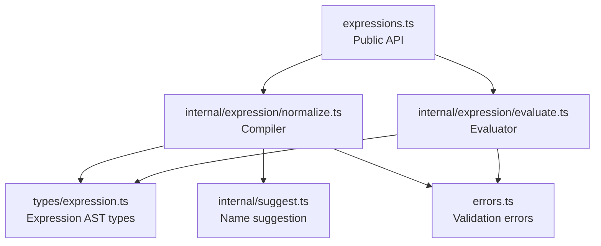
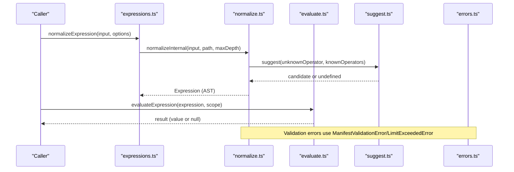
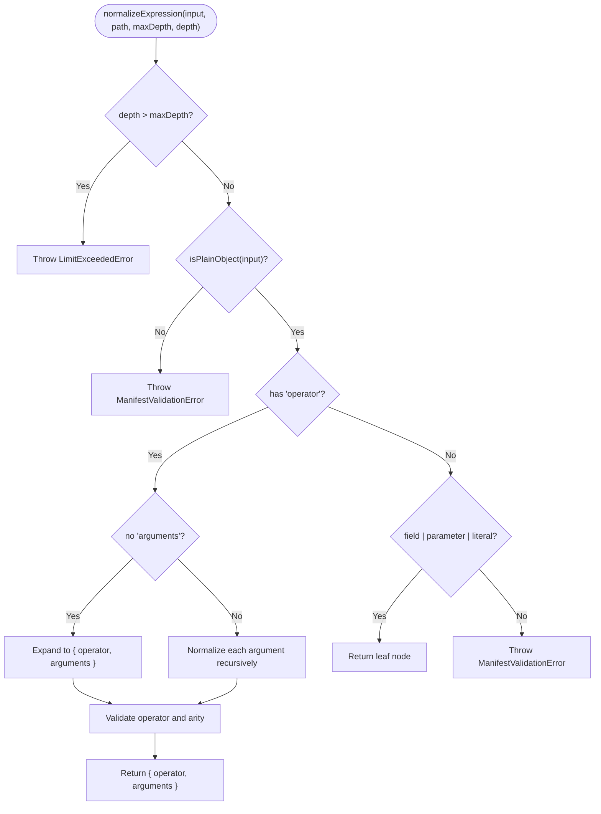
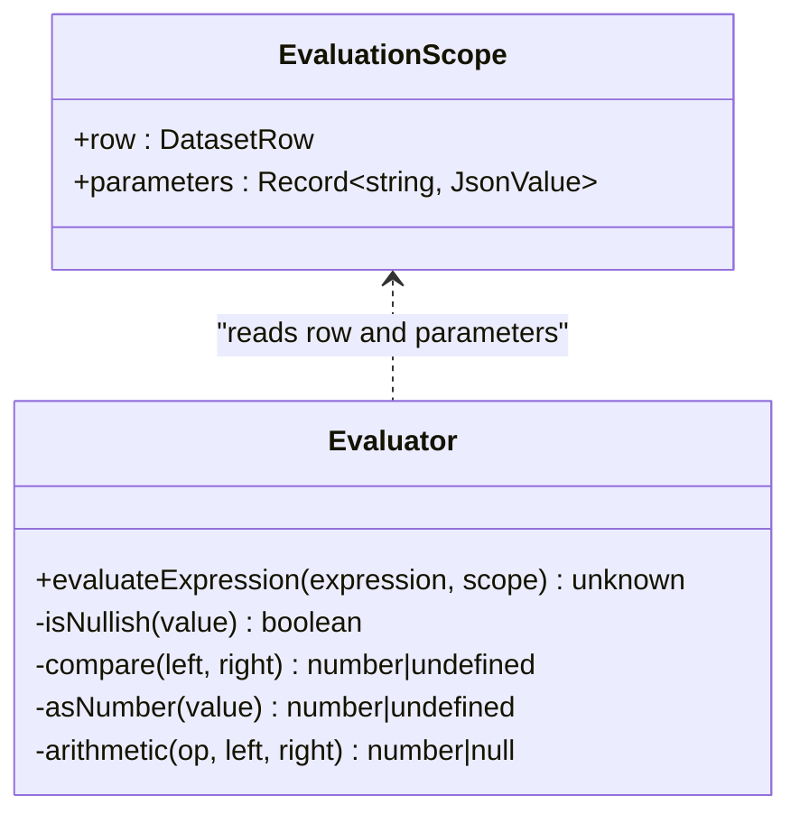
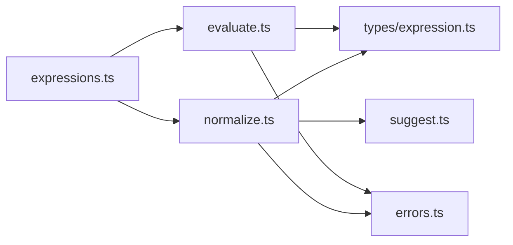

# Expression Evaluation Engine

<cite>
**Referenced Files in This Document**
- [evaluate.ts](file://packages/core/src/internal/expression/evaluate.ts)
- [normalize.ts](file://packages/core/src/internal/expression/normalize.ts)
- [expressions.ts](file://packages/core/src/expressions.ts)
- [expression.ts](file://packages/core/src/types/expression.ts)
- [suggest.ts](file://packages/core/src/internal/suggest.ts)
- [errors.ts](file://packages/core/src/errors.ts)
- [evaluate.test.ts](file://packages/core/src/internal/expression/evaluate.test.ts)
- [expressions.test.ts](file://packages/core/src/expressions.test.ts)
</cite>

## Table of Contents

1. [Introduction](#introduction)
2. [Project Structure](#project-structure)
3. [Core Components](#core-components)
4. [Architecture Overview](#architecture-overview)
5. [Detailed Component Analysis](#detailed-component-analysis)
6. [Dependency Analysis](#dependency-analysis)
7. [Performance Considerations](#performance-considerations)
8. [Troubleshooting Guide](#troubleshooting-guide)
9. [Conclusion](#conclusion)
10. [Appendices](#appendices)

## Introduction

This document explains the expression evaluation subsystem used by QSpec to evaluate expressions against dataset rows and parameters. It covers:

- The public API functions evaluateExpression() and normalizeExpression()
- Supported expression syntax, including arithmetic, comparisons, logical operators, null handling, membership checks, field references, and parameter references
- The EvaluationScope interface for variable binding and context resolution
- The compilation process via normalization (AST canonicalization, arity validation, depth limits)
- Performance characteristics and security restrictions
- Examples of complex expressions, nested function-like calls, array operations, and error handling patterns
- The suggest() helper for name suggestions and debugging techniques

## Project Structure

The expression engine is implemented under packages/core with a clear separation between normalization (compilation) and evaluation (interpretation).

**Diagram sources**

- [expressions.ts:1-35](file://packages/core/src/expressions.ts#L1-L35)
- [normalize.ts:1-145](file://packages/core/src/internal/expression/normalize.ts#L1-L145)
- [evaluate.ts:1-155](file://packages/core/src/internal/expression/evaluate.ts#L1-L155)
- [expression.ts:1-22](file://packages/core/src/types/expression.ts#L1-L22)
- [suggest.ts:1-48](file://packages/core/src/internal/suggest.ts#L1-L48)
- [errors.ts:1-180](file://packages/core/src/errors.ts#L1-L180)

**Section sources**

- [expressions.ts:1-35](file://packages/core/src/expressions.ts#L1-L35)
- [normalize.ts:1-145](file://packages/core/src/internal/expression/normalize.ts#L1-L145)
- [evaluate.ts:1-155](file://packages/core/src/internal/expression/evaluate.ts#L1-L155)
- [expression.ts:1-22](file://packages/core/src/types/expression.ts#L1-L22)
- [suggest.ts:1-48](file://packages/core/src/internal/suggest.ts#L1-L48)
- [errors.ts:1-180](file://packages/core/src/errors.ts#L1-L180)

## Core Components

- Expression AST: A limited, JSON-safe tree representing literals, field references, parameter references, and operator applications.
- Normalizer: Compiles user input into the canonical AST, validates operators and arity, enforces nesting depth, and provides suggestions for typos.
- Evaluator: Interprets normalized expressions safely without eval or Function constructor, using a fixed operator set.
- EvaluationScope: Provides row data and parameters available during evaluation.
- Suggestions: Levenshtein-based fuzzy matching to propose corrections for unknown names.

Key responsibilities:

- normalizeExpression(): Validates and converts input into a canonical AST, enforcing safety and structure.
- evaluateExpression(): Executes the AST against a scope containing row fields and parameters.

**Section sources**

- [expression.ts:1-22](file://packages/core/src/types/expression.ts#L1-L22)
- [expressions.ts:1-35](file://packages/core/src/expressions.ts#L1-L35)
- [normalize.ts:1-145](file://packages/core/src/internal/expression/normalize.ts#L1-L145)
- [evaluate.ts:1-155](file://packages/core/src/internal/expression/evaluate.ts#L1-L155)
- [suggest.ts:1-48](file://packages/core/src/internal/suggest.ts#L1-L48)

## Architecture Overview

The system follows a two-phase pipeline:

1. Compilation (Normalization): Transforms any accepted expression form into a strict AST, validating operator names, arity, and maximum nesting depth. Unknown operators trigger helpful suggestions.
2. Interpretation (Evaluation): Safely evaluates the AST against a scope that includes dataset row values and parameters. No dynamic code execution occurs.

**Diagram sources**

- [expressions.ts:1-35](file://packages/core/src/expressions.ts#L1-L35)
- [normalize.ts:1-145](file://packages/core/src/internal/expression/normalize.ts#L1-L145)
- [evaluate.ts:1-155](file://packages/core/src/internal/expression/evaluate.ts#L1-L155)
- [suggest.ts:1-48](file://packages/core/src/internal/suggest.ts#L1-L48)
- [errors.ts:1-180](file://packages/core/src/errors.ts#L1-L180)

## Detailed Component Analysis

### Expression AST and Types

- Literal: A constant value.
- Field: Reads from the current dataset row.
- Parameter: Reads from the provided parameters map.
- Operator: An application of a supported operator to one or more sub-expressions.

Supported operators include:

- Comparisons: eq, ne, gt, gte, lt, lte
- Logical: and, or, not
- Null handling: isNull, coalesce
- Membership: in
- Arithmetic: add, subtract, multiply, divide

Comparison shorthand is supported during normalization and converted to the canonical AST form.

**Section sources**

- [expression.ts:1-22](file://packages/core/src/types/expression.ts#L1-L22)
- [normalize.ts:18-35](file://packages/core/src/internal/expression/normalize.ts#L18-L35)
- [normalize.ts:77-103](file://packages/core/src/internal/expression/normalize.ts#L77-L103)

### Normalization (Compilation)

Normalization performs:

- Input validation: Ensures the input is an object and identifies node type.
- Shorthand expansion: Converts { field, operator, value } into the canonical { operator, arguments } form.
- Recursive normalization: Normalizes each argument with incremented depth.
- Operator validation: Checks against a fixed operator registry and enforces arity constraints.
- Depth limit enforcement: Throws when nesting exceeds configured maxDepth.
- Suggestions: For unknown operators, suggests closest matches using edit distance.

**Diagram sources**

- [normalize.ts:54-114](file://packages/core/src/internal/expression/normalize.ts#L54-L114)
- [normalize.ts:116-145](file://packages/core/src/internal/expression/normalize.ts#L116-L145)
- [errors.ts:74-79](file://packages/core/src/errors.ts#L74-L79)
- [errors.ts:173-179](file://packages/core/src/errors.ts#L173-L179)

**Section sources**

- [normalize.ts:1-145](file://packages/core/src/internal/expression/normalize.ts#L1-L145)
- [errors.ts:1-180](file://packages/core/src/errors.ts#L1-L180)

### Evaluation (Interpretation)

Evaluation interprets a normalized AST safely:

- Literals return their values directly.
- Field reads from the row using safe property checks to avoid prototype pollution.
- Parameter reads from the parameters map similarly protected.
- Logical operators short-circuit: and stops on first false; or stops on first true.
- Comparison operators compare numbers and strings; booleans are coerced numerically; mismatched or nullish operands yield false for ordering comparisons.
- Arithmetic requires finite numeric operands; division by zero yields null instead of Infinity.
- Membership uses strict equality within arrays.
- Null helpers: isNull detects nullish values; coalesce returns the first non-nullish argument.

**Diagram sources**

- [evaluate.ts:6-9](file://packages/core/src/internal/expression/evaluate.ts#L6-L9)
- [evaluate.ts:73-154](file://packages/core/src/internal/expression/evaluate.ts#L73-L154)

**Section sources**

- [evaluate.ts:1-155](file://packages/core/src/internal/expression/evaluate.ts#L1-L155)

### Supported Syntax Summary

- Literals: Any JSON-compatible value.
- Field references: Access to current row fields; missing fields resolve to null.
- Parameter references: Access to runtime parameters; missing parameters resolve to null.
- Comparisons: eq, ne, gt, gte, lt, lte
- Logical: and, or, not
- Null handling: isNull, coalesce
- Membership: in (checks presence in an array literal)
- Arithmetic: add, subtract, multiply, divide

Notes:

- String functions, date operations, and other domain-specific functions are not part of this core expression engine.
- Array operations beyond membership checks are not included; only in supports checking membership against an array literal.

**Section sources**

- [normalize.ts:18-35](file://packages/core/src/internal/expression/normalize.ts#L18-L35)
- [evaluate.ts:73-154](file://packages/core/src/internal/expression/evaluate.ts#L73-L154)

### EvaluationScope Interface and Context Resolution

- row: The dataset row being evaluated; field access uses safe property checks to prevent inherited properties from leaking into results.
- parameters: A map of named parameters; parameter access also uses safe property checks.

Resolution behavior:

- Missing fields or parameters yield null rather than throwing.
- Inherited properties are ignored to avoid prototype pollution.

**Section sources**

- [evaluate.ts:6-9](file://packages/core/src/internal/expression/evaluate.ts#L6-L9)
- [evaluate.ts:76-87](file://packages/core/src/internal/expression/evaluate.ts#L76-L87)

### Security Restrictions

- No dynamic code execution: The evaluator never uses eval or the Function constructor.
- Fixed operator set: Operators are explicitly enumerated and cannot be extended at runtime.
- Safe property access: Uses explicit property checks to avoid prototype chain traversal.
- Strict typing and validation: Normalization rejects unknown nodes and operators early.

**Section sources**

- [evaluate.ts:69-72](file://packages/core/src/internal/expression/evaluate.ts#L69-L72)
- [normalize.ts:13-17](file://packages/core/src/internal/expression/normalize.ts#L13-L17)
- [evaluate.ts:76-87](file://packages/core/src/internal/expression/evaluate.ts#L76-L87)

### Error Handling Patterns

- Validation errors: ManifestValidationError aggregates multiple issues with paths and optional suggestions.
- Limit exceeded: LimitExceededError thrown when expression nesting exceeds configured maxDepth.
- Missing arguments: If an un-normalized expression reaches the evaluator, a QSpecError indicates missing arguments.
- Path reporting: Errors include structured paths to help locate issues in manifests.

Common scenarios:

- Unknown operator: Reports message with suggested correction.
- Wrong arity: Reports expected vs received argument count.
- Non-object input: Reports required object shape.

**Section sources**

- [normalize.ts:37-48](file://packages/core/src/internal/expression/normalize.ts#L37-L48)
- [normalize.ts:60-65](file://packages/core/src/internal/expression/normalize.ts#L60-L65)
- [normalize.ts:123-142](file://packages/core/src/internal/expression/normalize.ts#L123-L142)
- [evaluate.ts:22-31](file://packages/core/src/internal/expression/evaluate.ts#L22-L31)
- [errors.ts:74-79](file://packages/core/src/errors.ts#L74-L79)
- [errors.ts:173-179](file://packages/core/src/errors.ts#L173-L179)

### Examples and Use Cases

- Complex expressions: Combine logical and comparison operators to filter rows based on multiple conditions.
- Nested expressions: Nest comparisons and logical operators to build compound predicates.
- Array operations: Use in to check if a field value is present in an array literal.
- Null handling: Use coalesce to provide fallbacks and isNull to detect missing values.
- Arithmetic: Perform calculations with add, subtract, multiply, divide; division by zero yields null.

Examples can be constructed using the AST forms validated by tests:

- Comparison shorthand expanded to canonical form
- Evaluating against row fields and parameters
- Short-circuiting behavior verified by tests

**Section sources**

- [expressions.test.ts:1-66](file://packages/core/src/expressions.test.ts#L1-L66)
- [evaluate.test.ts:20-211](file://packages/core/src/internal/expression/evaluate.test.ts#L20-L211)

### Debugging Techniques

- Inspect normalized AST: Call normalizeExpression to see the canonical form before evaluation.
- Use path information: Errors include structured paths to pinpoint problematic sections.
- Leverage suggestions: When encountering unknown operators, rely on suggested corrections.
- Test incrementally: Build expressions step-by-step and validate intermediate results.
- Verify short-circuit behavior: Ensure expensive or side-effecting operations are guarded by logical operators.

**Section sources**

- [expressions.test.ts:26-43](file://packages/core/src/expressions.test.ts#L26-L43)
- [evaluate.test.ts:90-153](file://packages/core/src/internal/expression/evaluate.test.ts#L90-L153)

## Dependency Analysis

The expression engine has minimal external dependencies and strong internal cohesion:

- Public API exposes normalizeExpression and evaluateExpression.
- Normalizer depends on suggestion utilities and error types.
- Evaluator depends on error types and expression types.
- Tests validate both normalization and evaluation behaviors.

**Diagram sources**

- [expressions.ts:1-35](file://packages/core/src/expressions.ts#L1-L35)
- [normalize.ts:1-145](file://packages/core/src/internal/expression/normalize.ts#L1-L145)
- [evaluate.ts:1-155](file://packages/core/src/internal/expression/evaluate.ts#L1-L155)
- [expression.ts:1-22](file://packages/core/src/types/expression.ts#L1-L22)
- [errors.ts:1-180](file://packages/core/src/errors.ts#L1-L180)
- [suggest.ts:1-48](file://packages/core/src/internal/suggest.ts#L1-L48)

**Section sources**

- [expressions.ts:1-35](file://packages/core/src/expressions.ts#L1-L35)
- [normalize.ts:1-145](file://packages/core/src/internal/expression/normalize.ts#L1-L145)
- [evaluate.ts:1-155](file://packages/core/src/internal/expression/evaluate.ts#L1-L155)

## Performance Considerations

- Short-circuit evaluation: Logical operators avoid unnecessary computation.
- Safe property access: Avoids prototype chain traversal overhead and prevents security risks.
- Finite numeric checks: Arithmetic operations guard against non-finite values.
- Depth limits: Prevents excessive recursion and potential stack exhaustion.
- Minimal allocations: Uses simple control flow and avoids heavy data structures.

Recommendations:

- Keep expressions shallow to minimize normalization and evaluation cost.
- Prefer direct comparisons and logical combinations over deeply nested constructs.
- Use coalesce strategically to avoid repeated null checks.

[No sources needed since this section provides general guidance]

## Troubleshooting Guide

Common issues and resolutions:

- Unknown operator: NormalizeExpression throws with a suggestion; correct the operator name.
- Wrong arity: Adjust the number of arguments to match operator requirements.
- Excessive nesting: Reduce depth or refactor expressions to stay within maxDepth.
- Missing fields/parameters: Expect null results; use coalesce to provide defaults.
- Division by zero: Results in null; handle downstream accordingly.
- Prototype pollution: Field/parameter access ignores inherited properties; ensure keys exist in row/parameters.

Diagnostic steps:

- Normalize first to inspect AST and catch structural issues early.
- Review error messages and paths to locate problematic segments.
- Use tests as templates for building valid expressions.

**Section sources**

- [normalize.ts:60-65](file://packages/core/src/internal/expression/normalize.ts#L60-L65)
- [normalize.ts:123-142](file://packages/core/src/internal/expression/normalize.ts#L123-L142)
- [evaluate.test.ts:149-153](file://packages/core/src/internal/expression/evaluate.test.ts#L149-L153)
- [errors.ts:74-79](file://packages/core/src/errors.ts#L74-L79)
- [errors.ts:173-179](file://packages/core/src/errors.ts#L173-L179)

## Conclusion

The expression evaluation engine provides a secure, efficient, and well-validated mechanism for evaluating expressions against dataset rows and parameters. Its design emphasizes safety through a fixed operator set, strict validation, and safe property access. The two-phase approach—normalization followed by interpretation—ensures robustness and clarity. While it does not include string or date functions, its core capabilities cover essential arithmetic, comparisons, logic, null handling, and membership checks, making it suitable for a wide range of filtering and transformation needs.

[No sources needed since this section summarizes without analyzing specific files]

## Appendices

### API Reference

- normalizeExpression(input, options): Validates and compiles an expression into a canonical AST. Options include maxDepth and optional path prefix for diagnostics.
- evaluateExpression(expression, scope): Evaluates a normalized expression against a scope containing row fields and parameters.

**Section sources**

- [expressions.ts:8-34](file://packages/core/src/expressions.ts#L8-L34)
- [evaluate.ts:73-154](file://packages/core/src/internal/expression/evaluate.ts#L73-L154)

### Operator Reference

- Comparisons: eq, ne, gt, gte, lt, lte
- Logical: and, or, not
- Null handling: isNull, coalesce
- Membership: in
- Arithmetic: add, subtract, multiply, divide

**Section sources**

- [normalize.ts:18-35](file://packages/core/src/internal/expression/normalize.ts#L18-L35)
