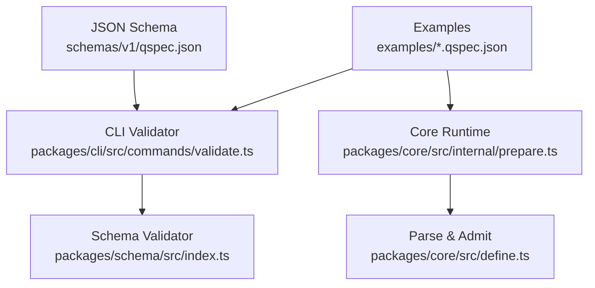
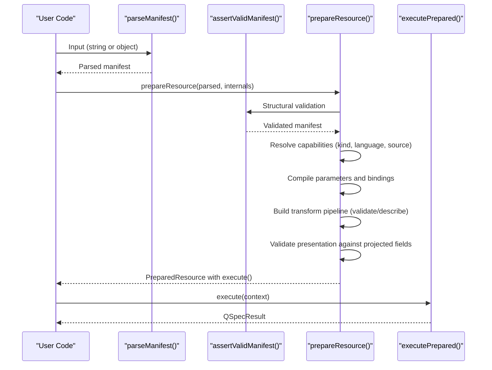
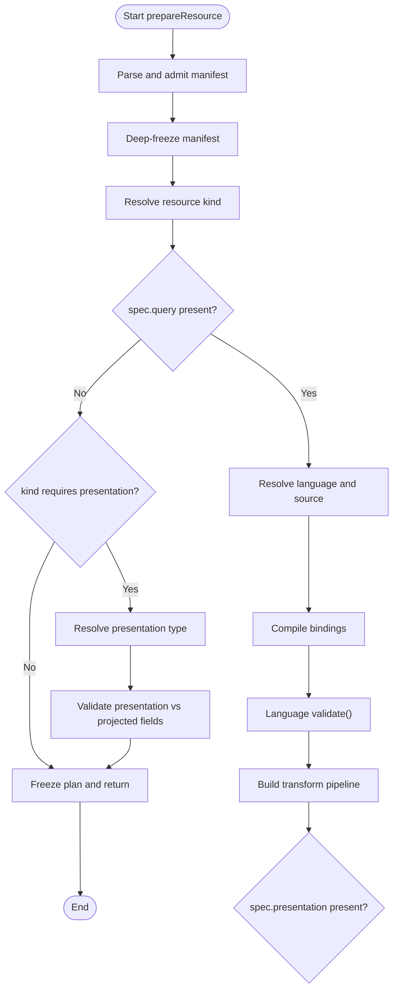
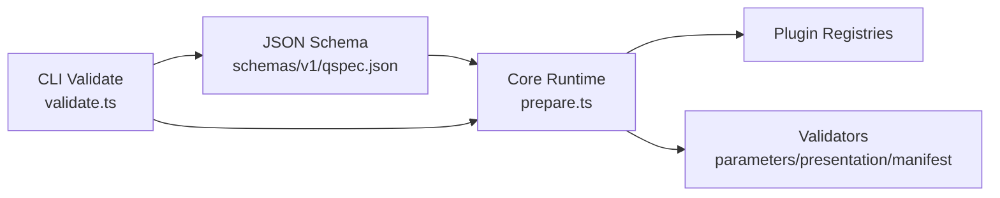

# Manifest Definition System

<cite>
**Referenced Files in This Document**
- [define.ts](file://packages/core/src/define.ts)
- [prepare.ts](file://packages/core/src/internal/prepare.ts)
- [qspec.json](file://schemas/v1/qspec.json)
- [manifest-specification.md](file://docs/manifest-specification.md)
- [01-complete-manifest.qspec.json](file://examples/01-complete-manifest.qspec.json)
- [02-minimal-dataset.qspec.json](file://examples/02-minimal-dataset.qspec.json)
- [03-parameterized-query.qspec.json](file://examples/03-parameterized-query.qspec.json)
- [04-transform-filter.qspec.json](file://examples/04-transform-filter.qspec.json)
- [10-chart-grouped-series.qspec.json](file://examples/10-chart-grouped-series.qspec.json)
- [bad-binding.qspec.json](file://fixtures/invalid/bad-binding.qspec.json)
- [validate.ts](file://packages/cli/src/commands/validate.ts)
- [index.ts](file://packages/schema/src/index.ts)
</cite>

## Table of Contents

1. [Introduction](#introduction)
2. [Project Structure](#project-structure)
3. [Core Components](#core-components)
4. [Architecture Overview](#architecture-overview)
5. [Detailed Component Analysis](#detailed-component-analysis)
6. [Dependency Analysis](#dependency-analysis)
7. [Performance Considerations](#performance-considerations)
8. [Troubleshooting Guide](#troubleshooting-guide)
9. [Conclusion](#conclusion)
10. [Appendices](#appendices)

## Introduction

This document explains the manifest definition system built around defineManifest() and parseManifest(), how manifests are validated, compiled, and prepared for execution, and how parameters, queries, transforms, and presentations fit together. It covers schema enforcement, type safety, lifecycle phases (parse, validate, prepare), and provides examples ranging from minimal datasets to parameterized queries, transforms, and chart presentations. It also includes guidance on common validation errors, debugging techniques, and best practices for organizing manifests.

## Project Structure

At a high level:

- The JSON Schema defines the structural contract for manifests.
- Core runtime functions parse, validate, and prepare manifests into an executable plan.
- CLI tooling validates manifests using both core validators and the published JSON Schema.
- Examples demonstrate complete manifests across resource kinds and features.

**Diagram sources**

- [qspec.json:1-143](file://schemas/v1/qspec.json#L1-L143)
- [validate.ts:183-217](file://packages/cli/src/commands/validate.ts#L183-L217)
- [index.ts:43-64](file://packages/schema/src/index.ts#L43-L64)
- [prepare.ts:140-166](file://packages/core/src/internal/prepare.ts#L140-L166)
- [define.ts:70-114](file://packages/core/src/define.ts#L70-L114)

**Section sources**

- [manifest-specification.md:13-118](file://docs/manifest-specification.md#L13-L118)
- [qspec.json:1-143](file://schemas/v1/qspec.json#L1-L143)

## Core Components

- defineManifest(): Type-level helper that preserves literal types for editor autocomplete and static checks without runtime work.
- parseManifest(): Parses string or object input, enforces size limits for strings, rejects unsafe keys, and returns a typed manifest.
- prepareResource(): Orchestrates parsing, structural validation, capability resolution (resource kind, query language, data source), parameter compilation, transform pipeline setup, presentation validation, and freezing of the prepared plan for safe repeated execution.

Key responsibilities:

- Structural admission and safety checks at parse time.
- Semantic validation via plugin registries and dedicated validators.
- Compilation of bindings and parameters.
- Projection of dataset fields through transforms.
- Validation of presentation against projected fields.
- Freezing of immutable structures to prevent mutation during execution.

**Section sources**

- [define.ts:6-31](file://packages/core/src/define.ts#L6-L31)
- [define.ts:39-114](file://packages/core/src/define.ts#L39-L114)
- [prepare.ts:140-348](file://packages/core/src/internal/prepare.ts#L140-L348)

## Architecture Overview

The manifest lifecycle flows through distinct phases:

**Diagram sources**

- [prepare.ts:140-348](file://packages/core/src/internal/prepare.ts#L140-L348)
- [define.ts:70-114](file://packages/core/src/define.ts#L70-L114)

## Detailed Component Analysis

### Manifest Schema and Structure

- Top-level fields: $schema (optional), apiVersion (required), kind (required), metadata (required), spec (required).
- Metadata requires name matching a slug-like pattern; title, description, tags are optional.
- Spec sections: parameters, query, dataset, transforms, presentation — all structurally optional; kind-specific requirements enforced later.
- Parameter types include string, number, integer, boolean, date, datetime, enum, array; enums require values; arrays require items; validation supports min/max/minLength/maxLength; presentation hints supported.
- Query requires source, language, statement; bindings map placeholders to parameters or literals.
- Dataset declares field names and their types, nullability, labels, semantic types, and formats.
- Transforms declare type and transform-specific options; each transform can validate its spec and describe output fields.
- Presentation declares type and rendering configuration; validated against projected fields.

**Section sources**

- [qspec.json:1-143](file://schemas/v1/qspec.json#L1-L143)
- [manifest-specification.md:13-118](file://docs/manifest-specification.md#L13-L118)

### Parsing and Safety

- parseManifest() accepts either a JSON string or a parsed object.
- For string inputs, enforces maxBytes limit before parsing to bound untrusted input cost.
- Rejects invalid JSON with structured issues.
- Ensures the document is a plain object and walks it to reject unsafe keys that could corrupt prototypes.
- Returns a strongly-typed manifest for downstream stages.

**Section sources**

- [define.ts:70-114](file://packages/core/src/define.ts#L70-L114)

### Preparation and Validation Pipeline

- prepareResource() performs staged validation:
  - Stage 1: Parse and structural validation (deep-freeze to prevent mutation).
  - Stage 2: Resolve resource kind, query language, and data source from registries; enforce required capabilities.
  - Parameters: compileParameters() validates and compiles parameter definitions.
  - Query: If present, validates language/source support and compiles bindings; language.validate may reject invalid statements.
  - Transforms: Validates each transform’s type exists, runs transform.validate, and folds describe() to project fields; unknown transforms produce actionable errors with suggestions.
  - Presentation: If present, resolves presentation type and validates against projected fields; missing presentation for kinds that require it is rejected.
  - Freezes the prepared plan so repeated executions avoid re-validation and protect immutability.

**Diagram sources**

- [prepare.ts:140-348](file://packages/core/src/internal/prepare.ts#L140-L348)

**Section sources**

- [prepare.ts:140-348](file://packages/core/src/internal/prepare.ts#L140-L348)

### Parameter Definitions and Query Bindings

- Parameters:
  - Types: string, number, integer, boolean, date, datetime, enum, array.
  - Required flags, defaults, descriptions, and value sets for enums.
  - Array items specify element types.
  - Validation constraints: numeric ranges and string lengths.
  - Presentation hints: control, label, placeholder, help.
- Bindings:
  - Reference parameters via "$parameters.<name>" or object form { parameter: "<name>" }.
  - Literal binding { literal: true } marks constant values.
  - Unknown or malformed bindings are rejected during binding compilation.

Examples:

- Simple dataset with no parameters or query.
- Parameterized query with date range and region filter.
- Chart with grouped series driven by parameters.

**Section sources**

- [qspec.json:35-106](file://schemas/v1/qspec.json#L35-L106)
- [02-minimal-dataset.qspec.json:1-9](file://examples/02-minimal-dataset.qspec.json#L1-L9)
- [03-parameterized-query.qspec.json:1-55](file://examples/03-parameterized-query.qspec.json#L1-L55)
- [10-chart-grouped-series.qspec.json:1-44](file://examples/10-chart-grouped-series.qspec.json#L1-L44)

### Transform Pipelines

- Each transform has a type and options; transforms can:
  - Validate their spec statically.
  - Describe output fields to enable downstream static checks.
  - Execute to transform rows immutably.
- prepareResource() builds the pipeline, validates each step, and projects fields through describe().
- If a transform omits describe(), projection becomes opaque and subsequent static checks are skipped.

Example:

- Filter transform applied to a dataset to select rows based on conditions.

**Section sources**

- [prepare.ts:241-284](file://packages/core/src/internal/prepare.ts#L241-L284)
- [04-transform-filter.qspec.json:1-31](file://examples/04-transform-filter.qspec.json#L1-L31)

### Presentation Configurations

- Presentation declares a type and rendering configuration.
- During preparation, the presentation type is resolved and validated against the projected fields from the transform pipeline.
- Missing presentation for kinds that require it results in a validation error.

Example:

- Line chart with x-axis mapped to a date field and series mapped to revenue grouped by region.

**Section sources**

- [prepare.ts:286-317](file://packages/core/src/internal/prepare.ts#L286-L317)
- [10-chart-grouped-series.qspec.json:1-44](file://examples/10-chart-grouped-series.qspec.json#L1-L44)

### Multi-Resource Manifests

- While individual manifests represent single resources, multi-resource workflows are achieved by composing multiple manifests (e.g., a Dataset followed by a Chart) and executing them in sequence.
- Each manifest is independently validated and prepared; outputs feed into downstream resources as needed.

[No sources needed since this section describes conceptual composition rather than specific files]

## Dependency Analysis

- Core runtime depends on:
  - JSON Schema for structural rules.
  - Plugin registries for resource kinds, query languages, data sources, transforms, and presentations.
  - Validators for parameters, presentations, and manifest structure.
- CLI integrates both core validation and JSON Schema validation to ensure parity and provide user-friendly diagnostics.

**Diagram sources**

- [qspec.json:1-143](file://schemas/v1/qspec.json#L1-L143)
- [prepare.ts:140-348](file://packages/core/src/internal/prepare.ts#L140-L348)
- [validate.ts:183-217](file://packages/cli/src/commands/validate.ts#L183-L217)

**Section sources**

- [manifest-specification.md:147-207](file://docs/manifest-specification.md#L147-L207)
- [index.ts:43-64](file://packages/schema/src/index.ts#L43-L64)

## Performance Considerations

- parseManifest() enforces maxBytes on string inputs to bound memory usage and parsing costs.
- prepareResource() deep-freezes the manifest and frozen prepared plan to avoid repeated static work and prevent mutation.
- Transform pipelines stop field projection when a transform is schema-opaque (no describe()), reducing unnecessary checks.
- Limits (e.g., maxTransforms) guard against excessive complexity in transforms.

[No sources needed since this section provides general guidance derived from analyzed code behavior]

## Troubleshooting Guide

Common validation errors and debugging techniques:

- Invalid JSON: parseManifest() throws a structured error with path and message.
- Unsafe keys: Walking the document rejects prototype-corrupting keys.
- Unknown resource kind/language/source: Errors include registered lists and suggestions.
- Unknown transform or presentation type: Errors list available types and suggest close matches.
- Missing required sections per kind: prepareResource() reports missing query or presentation when required by the kind.
- Bad bindings: Binding compilation rejects invalid references; example fixture demonstrates a non-conforming binding.

Debugging tips:

- Use qspec validate to run both core and JSON Schema validators; core messages are surfaced with paths and suggestions.
- Inspect the prepared plan’s projectedFields to understand what fields are available to transforms and presentations.
- Review transform validate and describe implementations to ensure they agree on output schemas.

**Section sources**

- [define.ts:39-114](file://packages/core/src/define.ts#L39-L114)
- [prepare.ts:168-239](file://packages/core/src/internal/prepare.ts#L168-L239)
- [prepare.ts:262-317](file://packages/core/src/internal/prepare.ts#L262-L317)
- [bad-binding.qspec.json:1-14](file://fixtures/invalid/bad-binding.qspec.json#L1-L14)
- [validate.ts:183-217](file://packages/cli/src/commands/validate.ts#L183-L217)

## Conclusion

The manifest definition system provides robust, type-safe, and extensible configuration for data resources and presentations. Through clear separation of concerns—parsing, validation, capability resolution, transformation, and presentation—the system ensures early detection of errors, safe execution, and predictable behavior. By following best practices for parameterization, transform design, and presentation mapping, authors can build reliable, maintainable manifests that scale across complex analytics workflows.

[No sources needed since this section summarizes without analyzing specific files]

## Appendices

### Examples Index

- Minimal dataset: [02-minimal-dataset.qspec.json:1-9](file://examples/02-minimal-dataset.qspec.json#L1-L9)
- Complete manifest (Chart): [01-complete-manifest.qspec.json:1-90](file://examples/01-complete-manifest.qspec.json#L1-L90)
- Parameterized query: [03-parameterized-query.qspec.json:1-55](file://examples/03-parameterized-query.qspec.json#L1-L55)
- Transform filter: [04-transform-filter.qspec.json:1-31](file://examples/04-transform-filter.qspec.json#L1-L31)
- Grouped series chart: [10-chart-grouped-series.qspec.json:1-44](file://examples/10-chart-grouped-series.qspec.json#L1-L44)

[No sources needed since this section lists file references already cited above]
