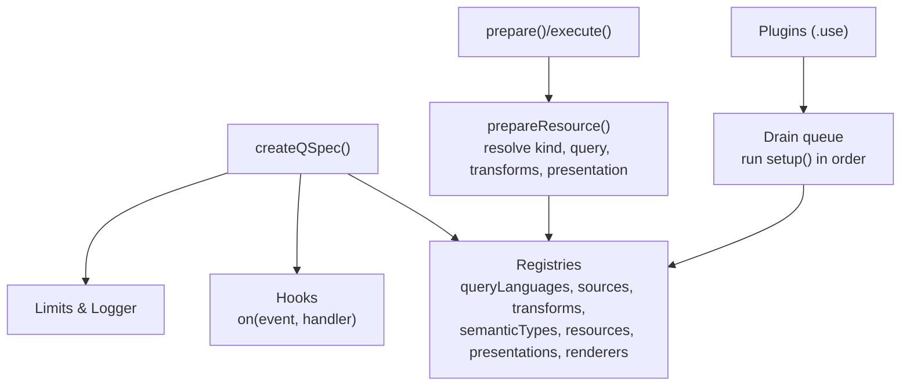
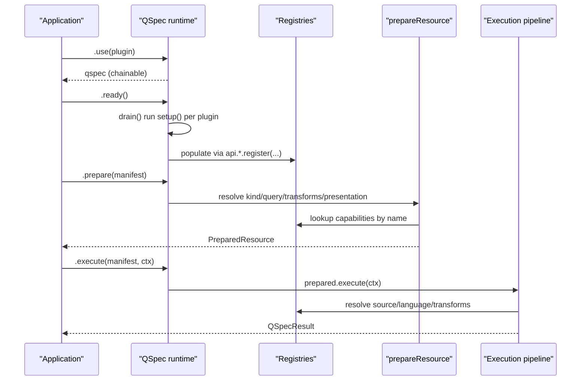
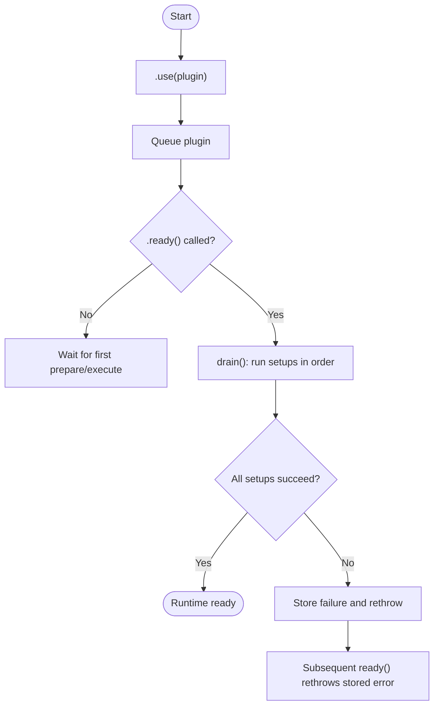
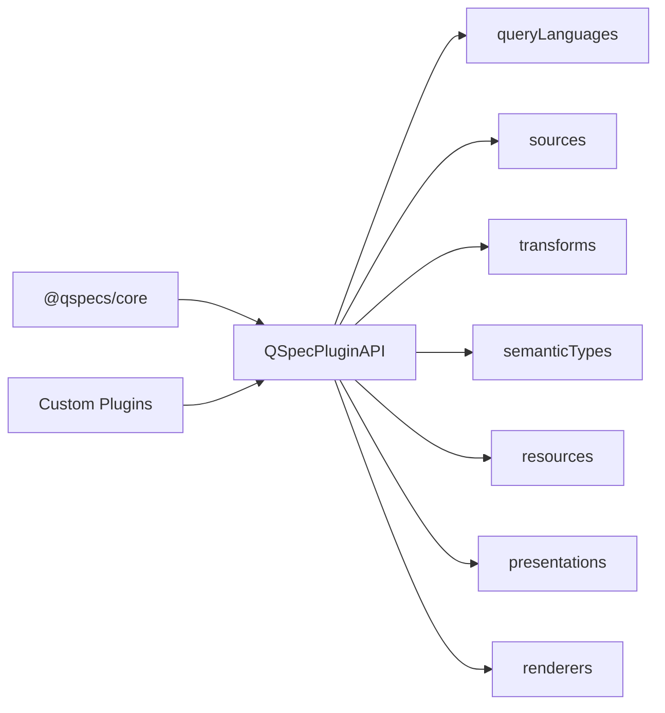

# Plugin Architecture and Interfaces

<cite>
**Referenced Files in This Document**
- [runtime.ts](file://packages/core/src/internal/runtime.ts)
- [plugin.ts](file://packages/core/src/types/plugin.ts)
- [define.ts](file://packages/core/src/define.ts)
- [registry.ts](file://packages/core/src/internal/registry.ts)
- [plugins.md](file://docs/plugins.md)
- [plugin-authoring.md](file://docs/plugin-authoring.md)
- [data-sources.md](file://docs/data-sources.md)
- [security.md](file://docs/security.md)
- [specification-versioning.md](file://docs/specification-versioning.md)
- [memory.ts](file://packages/testing/src/memory.ts)
- [index.ts](file://packages/core/src/index.ts)
</cite>

## Table of Contents

1. [Introduction](#introduction)
2. [Project Structure](#project-structure)
3. [Core Components](#core-components)
4. [Architecture Overview](#architecture-overview)
5. [Detailed Component Analysis](#detailed-component-analysis)
6. [Dependency Analysis](#dependency-analysis)
7. [Performance Considerations](#performance-considerations)
8. [Troubleshooting Guide](#troubleshooting-guide)
9. [Conclusion](#conclusion)
10. [Appendices](#appendices)

## Introduction

This document explains the QSpec plugin architecture: how plugins extend the runtime, how capabilities are discovered and resolved, and how lifecycle events coordinate execution. It covers the QSpecPlugin interface, the seven capability registries exposed via QSpecPluginAPI, all plugin types (QueryLanguage, DataSource, Transform, Presentation, ResourceKind), context objects used during compilation, transformation, and rendering, inter-plugin communication through shared registries and hooks, and the runtime’s discovery, dependency resolution, error handling, versioning, compatibility, and security considerations.

## Project Structure

At a high level:

- The core runtime creates registries for each capability type and exposes them to plugins through QSpecPluginAPI.
- Plugins register implementations into these registries during setup.
- The runtime drains queued plugins on first use or explicit ready(), then prepares and executes manifests using the registered capabilities.
- Tests and examples demonstrate usage patterns for transforms, data sources, and presentation kinds.

**Diagram sources**

- [runtime.ts:44-78](file://packages/core/src/internal/runtime.ts#L44-L78)
- [runtime.ts:93-167](file://packages/core/src/internal/runtime.ts#L93-L167)
- [plugins.md:1-33](file://docs/plugins.md#L1-L33)

**Section sources**

- [runtime.ts:44-167](file://packages/core/src/internal/runtime.ts#L44-L167)
- [plugins.md:1-33](file://docs/plugins.md#L1-L33)

## Core Components

- QSpecPlugin: minimal shape with name, optional version, and setup(api).
- QSpecPluginAPI: surface exposing seven registries, hooks, logger, and limits.
- Registries: Map-backed containers for capabilities; support register, replace, get, has, list.
- Runtime: createQSpec builds registries, queues plugins, drains on ready(), prepares and executes resources.

Key responsibilities:

- Discovery: plugins register capabilities into registries during setup.
- Resolution: prepare/execute resolve manifest components by name from registries.
- Lifecycle: hooks provide event-driven observability without mutation of execution flow.

**Section sources**

- [plugin.ts:11-136](file://packages/core/src/types/plugin.ts#L11-L136)
- [registry.ts:1-45](file://packages/core/src/internal/registry.ts#L1-L45)
- [runtime.ts:44-167](file://packages/core/src/internal/runtime.ts#L44-L167)
- [plugins.md:35-130](file://docs/plugins.md#L35-L130)

## Architecture Overview

The runtime is registry-driven. Each plugin receives QSpecPluginAPI and registers capabilities. The runtime ensures deterministic install order and safe concurrent access to setup. After ready(), prepare resolves resource kinds, queries, transforms, and presentations using the registries. Execution runs compiled queries through data sources and applies transforms immutably. Rendering is separate and uses renderers.

**Diagram sources**

- [runtime.ts:117-167](file://packages/core/src/internal/runtime.ts#L117-L167)
- [plugins.md:132-164](file://docs/plugins.md#L132-L164)

## Detailed Component Analysis

### QSpecPlugin and QSpecPluginAPI

- QSpecPlugin: name, optional version, setup(api).
- QSpecPluginAPI:
  - queryLanguages: Registry<QueryLanguage>
  - sources: Registry<DataSource>
  - transforms: Registry<Transform>
  - semanticTypes: Registry<SemanticType>
  - resources: Registry<ResourceKind>
  - presentations: Registry<PresentationType>
  - renderers: Registry<Renderer>
  - hooks: { on }
  - logger: QSpecLogger
  - limits: Readonly<QSpecLimits>

Access pattern:

- In setup(api), call api.<capability>.register(name, implementation) or replace(name, implementation).
- Use api.hooks.on("event", handler) to observe lifecycle events.
- Read api.limits and api.logger for configuration and diagnostics.

**Section sources**

- [plugin.ts:119-136](file://packages/core/src/types/plugin.ts#L119-L136)
- [plugins.md:62-93](file://docs/plugins.md#L62-L93)

### Capability Registries

- Implemented via createRegistry(label): Map-backed storage.
- Methods:
  - register(name, impl): throws if empty name or duplicate.
  - replace(name, impl): overwrites silently (except empty-name guard).
  - get(name), has(name), list(): sorted names for diagnostics.

Behavioral guarantees:

- Deterministic ordering: later plugins can override earlier ones via replace.
- Safe keys: Map avoids prototype pollution issues for names like constructor.

**Section sources**

- [registry.ts:1-45](file://packages/core/src/internal/registry.ts#L1-L45)
- [plugins.md:94-130](file://docs/plugins.md#L94-L130)

### Plugin Lifecycle Management

- .use(plugin) queues plugins; does not run setup immediately.
- .ready() drains queue sequentially, awaiting each setup.
- First .prepare() or .execute() triggers ready() automatically.
- Concurrent ready() calls share one in-flight drain; new plugins queued mid-drain are picked up by that same pass.
- Setup failures poison the runtime: subsequent ready() rethrows stored error; no rollback.

**Diagram sources**

- [runtime.ts:80-167](file://packages/core/src/internal/runtime.ts#L80-L167)
- [plugins.md:132-164](file://docs/plugins.md#L132-L164)

**Section sources**

- [runtime.ts:80-167](file://packages/core/src/internal/runtime.ts#L80-L167)
- [plugins.md:132-164](file://docs/plugins.md#L132-L164)

### Inter-Plugin Communication

- Shared registries: plugins read/write capabilities via QSpecPluginAPI registries.
- Hooks: plugins subscribe to lifecycle events via api.hooks.on(...).
- Limits and logger: shared configuration and logging channel.

Constraints:

- Only observe events; cannot emit them directly.
- Registration order determines override precedence.

**Section sources**

- [plugin.ts:119-136](file://packages/core/src/types/plugin.ts#L119-L136)
- [plugins.md:82-93](file://docs/plugins.md#L82-L93)

### Plugin Types and Contexts

#### QueryLanguage

- Purpose: compile portable query declarations into a source-specific compiled query.
- Interface: compile(query, context), optional validate(query).
- Context: QueryCompileContext includes source, bindings, parameters.
- Static validation runs during prepare() before any database access.

Example reference:

- See memory language in testing package for a pass-through compile example.

**Section sources**

- [plugin.ts:37-56](file://packages/core/src/types/plugin.ts#L37-L56)
- [memory.ts:72-78](file://packages/testing/src/memory.ts#L72-L78)

#### DataSource

- Purpose: execute compiled queries and return raw results; handle connectivity, cancellation, disposal.
- Interface: execute(query, context), optional dispose(), supportedLanguages?
- Context: DataSourceContext includes executionId, signal?, locale?, timezone?, logger.
- Behavior: must respect AbortSignal; should implement dispose for cleanup.

Example reference:

- Memory source demonstrates cancellation, table lookup, and positional rows.

**Section sources**

- [plugin.ts:11-35](file://packages/core/src/types/plugin.ts#L11-L35)
- [data-sources.md:1-33](file://docs/data-sources.md#L1-L33)
- [memory.ts:80-141](file://packages/testing/src/memory.ts#L80-L141)

#### Transform

- Purpose: transform datasets immutably; optional schema inference and validation.
- Interface: execute(dataset, spec, context), describe?(fields, spec), validate?(spec, fields?).
- Context: TransformContext includes executionId, parameters, signal?.
- Contract: never mutate input dataset; return fresh Dataset; describe must match actual output.

Example reference:

- Authoring guide shows an uppercase transform implementing execute, describe, validate.

**Section sources**

- [plugin.ts:58-79](file://packages/core/src/types/plugin.ts#L58-L79)
- [plugin-authoring.md:11-115](file://docs/plugin-authoring.md#L11-L115)

#### Presentation and Renderer

- PresentationType: validates presentation definitions and extracts field references.
- Renderer: render(dataset, presentation, context) produces output outside query execution.
- Context: RenderContext includes locale?, timezone?.

Usage:

- Registered via api.presentations and api.renderers.

**Section sources**

- [plugin.ts:103-111](file://packages/core/src/types/plugin.ts#L103-L111)
- [plugins.md:166-183](file://docs/plugins.md#L166-L183)

#### ResourceKind

- Purpose: define custom resource kinds beyond Dataset.
- Interface: requiresQuery?, requiresPresentation?, validate?(spec, context).
- Context: ResourceKindContext includes presentations registry.

Built-in:

- Core registers Dataset with requiresPresentation: false.

**Section sources**

- [plugin.ts:87-101](file://packages/core/src/types/plugin.ts#L87-L101)
- [runtime.ts:61-63](file://packages/core/src/internal/runtime.ts#L61-L63)

### Examples of Implementing Each Plugin Type

- QueryLanguage: see memory language compile returning a compiled query shape.
- DataSource: see memory source execute with cancellation and disposal patterns.
- Transform: see authoring guide uppercase transform with execute/describe/validate.
- Presentation: see charts package registration patterns referenced in docs.
- ResourceKind: see Chart kind registration referenced in tests and docs.

For concrete code paths:

- [memory.ts:72-78](file://packages/testing/src/memory.ts#L72-L78)
- [memory.ts:80-141](file://packages/testing/src/memory.ts#L80-L141)
- [plugin-authoring.md:23-85](file://docs/plugin-authoring.md#L23-L85)
- [plugins.md:166-183](file://docs/plugins.md#L166-L183)

**Section sources**

- [memory.ts:72-141](file://packages/testing/src/memory.ts#L72-L141)
- [plugin-authoring.md:23-85](file://docs/plugin-authoring.md#L23-L85)
- [plugins.md:166-183](file://docs/plugins.md#L166-L183)

### Registering Custom Plugins

- Create a plugin object with name and setup(api).
- Use definePlugin for editor autocomplete (identity function).
- Install via createQSpec().use(plugin).
- Capabilities become available after ready() or first prepare/execute.

Reference:

- [define.ts:116-123](file://packages/core/src/define.ts#L116-L123)
- [plugins.md:10-33](file://docs/plugins.md#L10-L33)

**Section sources**

- [define.ts:116-123](file://packages/core/src/define.ts#L116-L123)
- [plugins.md:10-33](file://docs/plugins.md#L10-L33)

### Debugging Plugin Interactions

- Subscribe to lifecycle events via api.hooks.on(...) to trace parse, validation, compile, execute, transform stages.
- Use api.logger to log diagnostic information consistently.
- Inspect registries via list() for available capabilities during setup or diagnostics.

Event categories include manifest parsing, validation, query compile/execute, dataset normalization, transform start/end, execution complete/error.

**Section sources**

- [plugin.ts:119-136](file://packages/core/src/types/plugin.ts#L119-L136)
- [plugins.md:82-93](file://docs/plugins.md#L82-L93)

### Plugin Discovery, Dependency Resolution, and Error Handling

- Discovery: via registries populated during plugin setup.
- Dependency resolution: by name lookup in registries when preparing/executing manifests.
- Error handling:
  - Duplicate registration: register throws PluginRegistrationError; use replace to intentionally override.
  - Duplicate plugin name: setup fails with PluginRegistrationError if already installed.
  - Setup failure: poisons runtime; subsequent ready() rethrows stored error.
  - Manifest parsing/validation errors: structured issues with codes and paths.

**Section sources**

- [registry.ts:1-45](file://packages/core/src/internal/registry.ts#L1-L45)
- [runtime.ts:93-167](file://packages/core/src/internal/runtime.ts#L93-L167)
- [define.ts:33-37](file://packages/core/src/define.ts#L33-L37)

### Versioning, Compatibility Checks, and Security Considerations

- Specification versioning: apiVersion checked against SUPPORTED_API_VERSIONS; unsupported versions produce manifest validation issues.
- Plugin compatibility: recommended via npm peerDependencies; QSpecPlugin.version exists but is not enforced at runtime.
- Security:
  - No eval/new Function allowed in core and official plugins; enforced by boundary tests.
  - Manifest parsing rejects unsafe keys that could corrupt prototypes.
  - Registries use Map to avoid prototype collisions for capability names.

**Section sources**

- [specification-versioning.md:10-53](file://docs/specification-versioning.md#L10-L53)
- [specification-versioning.md:81-93](file://docs/specification-versioning.md#L81-L93)
- [security.md:64-74](file://docs/security.md#L64-L74)
- [define.ts:47-68](file://packages/core/src/define.ts#L47-L68)
- [registry.ts:1-7](file://packages/core/src/internal/registry.ts#L1-L7)

## Dependency Analysis

Capabilities are decoupled via registries. Plugins depend only on QSpecPluginAPI and types exported from core. The runtime coordinates lifecycle and provides hooks for cross-cutting concerns.

**Diagram sources**

- [plugin.ts:119-136](file://packages/core/src/types/plugin.ts#L119-L136)
- [runtime.ts:51-78](file://packages/core/src/internal/runtime.ts#L51-L78)

**Section sources**

- [plugin.ts:119-136](file://packages/core/src/types/plugin.ts#L119-L136)
- [runtime.ts:51-78](file://packages/core/src/internal/runtime.ts#L51-L78)

## Performance Considerations

- Transforms are immutable; avoid mutating input datasets to prevent unintended side effects and ensure determinism.
- Data sources should check AbortSignal early to avoid unnecessary work.
- Registries use Map for O(1) lookups and safe key handling.
- Hooks snapshot listeners to allow safe unsubscription during emission without breaking execution.

[No sources needed since this section provides general guidance]

## Troubleshooting Guide

Common issues and resolutions:

- Duplicate capability name: use replace() to intentionally override; otherwise choose a unique name.
- Duplicate plugin name: ensure unique plugin names; runtime enforces uniqueness during setup.
- Setup failure: inspect logs via api.logger; fix plugin setup logic; note that runtime becomes poisoned until reset.
- Unsupported apiVersion: update manifest to a supported version or upgrade runtime.
- Prototype pollution risks: avoid unsafe keys in manifests; rely on core’s validation.

Diagnostic tips:

- Subscribe to lifecycle events to trace where failures occur.
- List registered capabilities to verify expected plugins loaded.
- Use contract test suites from @qspecs/testing to validate transforms and data sources.

**Section sources**

- [registry.ts:12-31](file://packages/core/src/internal/registry.ts#L12-L31)
- [runtime.ts:93-115](file://packages/core/src/internal/runtime.ts#L93-L115)
- [specification-versioning.md:22-53](file://docs/specification-versioning.md#L22-L53)
- [plugin-authoring.md:116-143](file://docs/plugin-authoring.md#L116-L143)

## Conclusion

QSpec’s plugin architecture centers on a small, stable core and extensible registries. Plugins register capabilities during setup, which the runtime discovers and resolves at prepare/execute time. Strong contracts around immutability, cancellation, and safety ensure predictable behavior. Versioning and compatibility are managed via specification versions and npm peer dependencies, while security is enforced through strict parsing and boundary checks.

[No sources needed since this section summarizes without analyzing specific files]

## Appendices

### Quick Reference: Key Interfaces and Paths

- QSpecPlugin and QSpecPluginAPI: [plugin.ts:119-136](file://packages/core/src/types/plugin.ts#L119-L136)
- Registries: [registry.ts:1-45](file://packages/core/src/internal/registry.ts#L1-L45)
- Runtime lifecycle: [runtime.ts:80-167](file://packages/core/src/internal/runtime.ts#L80-L167)
- Plugin authoring examples: [plugin-authoring.md:11-115](file://docs/plugin-authoring.md#L11-L115)
- Data source contract: [data-sources.md:1-33](file://docs/data-sources.md#L1-L33)
- Testing memory plugin: [memory.ts:69-159](file://packages/testing/src/memory.ts#L69-L159)
- Public exports: [index.ts:66-105](file://packages/core/src/index.ts#L66-L105)
