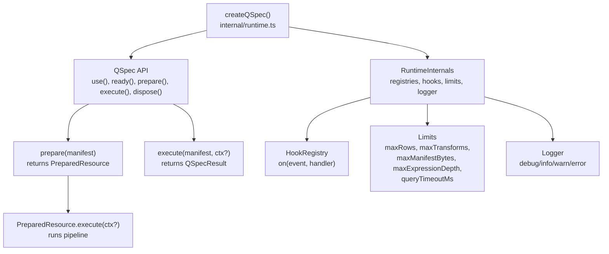
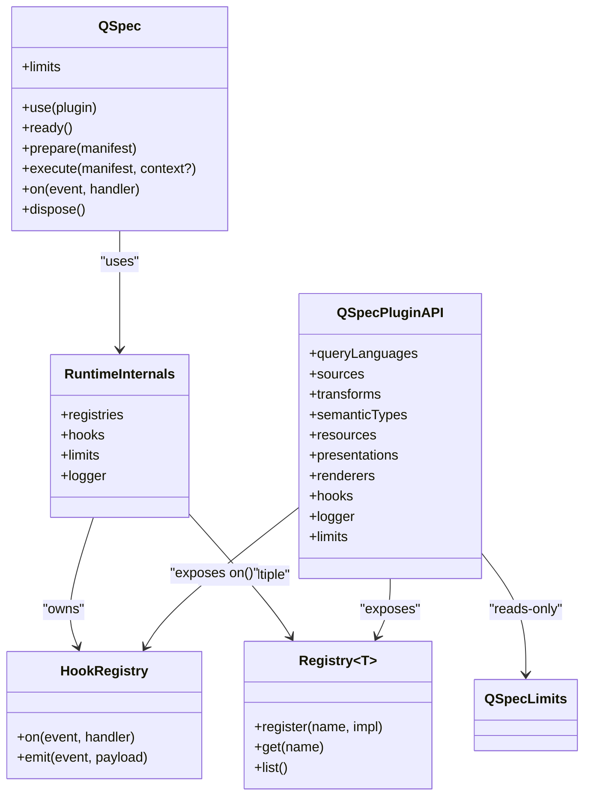
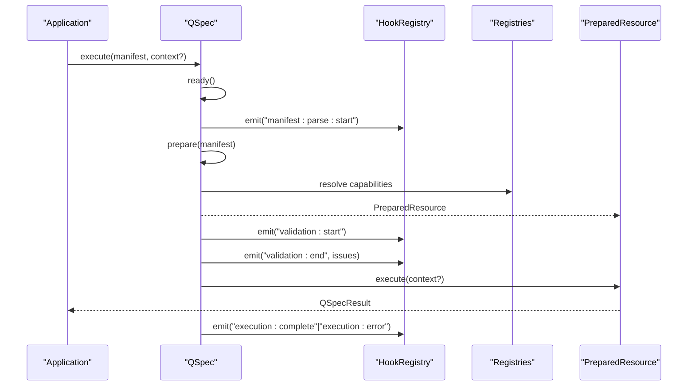
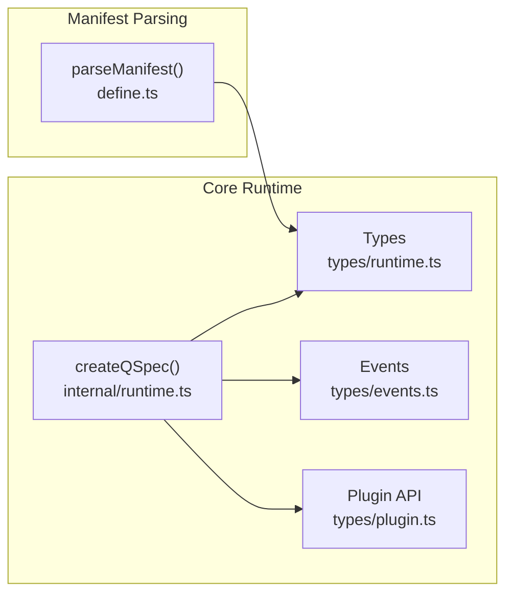

# Runtime Factory and Configuration

<cite>
**Referenced Files in This Document**
- [runtime.ts](file://packages/core/src/internal/runtime.ts)
- [runtime.ts](file://packages/core/src/types/runtime.ts)
- [events.ts](file://packages/core/src/types/events.ts)
- [plugin.ts](file://packages/core/src/types/plugin.ts)
- [define.ts](file://packages/core/src/define.ts)
- [index.ts](file://packages/core/src/index.ts)
</cite>

## Table of Contents

1. [Introduction](#introduction)
2. [Project Structure](#project-structure)
3. [Core Components](#core-components)
4. [Architecture Overview](#architecture-overview)
5. [Detailed Component Analysis](#detailed-component-analysis)
6. [Dependency Analysis](#dependency-analysis)
7. [Performance Considerations](#performance-considerations)
8. [Troubleshooting Guide](#troubleshooting-guide)
9. [Conclusion](#conclusion)
10. [Appendices](#appendices)

## Introduction

This document explains the runtime factory createQSpec() and its configuration model for QSpec. It covers how to register plugins, configure limits, set up event handlers and logging, and how prepare(), execute(), and validate() work at runtime. It also details ExecutionContext creation and management, execution metadata tracking, result handling patterns, and provides examples and security/performance guidance.

## Project Structure

The runtime is implemented in the core package:

- The factory createQSpec() lives in internal/runtime.ts and exposes the public QSpec interface.
- Types for options, limits, execution context, results, and events are defined under types/.
- Manifest parsing utilities live in define.ts and enforce size limits and unsafe key checks.
- The core index re-exports createQSpec and related types for consumers.

**Diagram sources**

- [runtime.ts:44-170](file://packages/core/src/internal/runtime.ts#L44-L170)
- [runtime.ts:7-88](file://packages/core/src/types/runtime.ts#L7-L88)
- [events.ts:1-74](file://packages/core/src/types/events.ts#L1-L74)

**Section sources**

- [runtime.ts:44-170](file://packages/core/src/internal/runtime.ts#L44-L170)
- [runtime.ts:7-88](file://packages/core/src/types/runtime.ts#L7-L88)
- [events.ts:1-74](file://packages/core/src/types/events.ts#L1-L74)
- [define.ts:14-31](file://packages/core/src/define.ts#L14-L31)
- [index.ts:80-90](file://packages/core/src/index.ts#L80-L90)

## Core Components

- createQSpec(options): Creates a runtime instance with merged limits, optional logger, hook registry, and capability registries (query languages, data sources, transforms, semantic types, resources, presentations, renderers). It queues plugin setup and ensures ordered, idempotent installation via ready().
- QSpecOptions: Optional limits override and logger. Limits include maxRows, maxTransforms, maxManifestBytes, maxExpressionDepth, and queryTimeoutMs.
- QSpec API:
  - use(plugin): Queue a plugin; returns the runtime for chaining.
  - ready(): Await all queued plugin setups; fails fast if any setup throws.
  - prepare(manifest): Validates and prepares a manifest into a PreparedResource.
  - execute(manifest, context?): Prepare then execute with an ExecutionContext.
  - on(event, handler): Subscribe to lifecycle events.
  - dispose(): Dispose registered data sources that implement dispose.
- PreparedResource: Holds prepared manifest metadata and exposes execute(context?).
- QSpecResult: Returns dataset, optional presentation definition, and ExecutionMetadata.

**Section sources**

- [runtime.ts:44-170](file://packages/core/src/internal/runtime.ts#L44-L170)
- [runtime.ts:7-88](file://packages/core/src/types/runtime.ts#L7-L88)
- [events.ts:1-74](file://packages/core/src/types/events.ts#L1-L74)
- [plugin.ts:119-136](file://packages/core/src/types/plugin.ts#L119-L136)

## Architecture Overview

The runtime composes several subsystems:

- Registries: Capability registries for query languages, data sources, transforms, semantic types, resource kinds, presentations, and renderers.
- Hooks: Event system for lifecycle instrumentation.
- Limits: Enforced caps for rows, transforms, expression depth, manifest bytes, and optional per-query timeout.
- Logger: Optional structured logging surface.

**Diagram sources**

- [runtime.ts:28-78](file://packages/core/src/internal/runtime.ts#L28-L78)
- [events.ts:61-74](file://packages/core/src/types/events.ts#L61-L74)
- [plugin.ts:119-136](file://packages/core/src/types/plugin.ts#L119-L136)

## Detailed Component Analysis

### createQSpec() and QSpecOptions

- Merges provided limits with defaults.
- Accepts an optional logger implementing debug/info/warn/error.
- Creates a HookRegistry that wraps handler errors by logging them as warnings.
- Initializes registries for capabilities and registers the built-in Dataset resource kind.
- Builds a read-only QSpecPluginAPI for plugin setup.
- Queues plugins and serializes their setup through ready().

Key behaviors:

- Plugin registration is idempotent; duplicate names throw a registration error.
- Any setup failure poisons the runtime; subsequent ready() calls rethrow the original error.
- dispose() iterates registered data sources and calls optional dispose methods.

**Section sources**

- [runtime.ts:44-170](file://packages/core/src/internal/runtime.ts#L44-L170)
- [runtime.ts:7-88](file://packages/core/src/types/runtime.ts#L7-L88)
- [events.ts:61-74](file://packages/core/src/types/events.ts#L61-L74)
- [plugin.ts:119-136](file://packages/core/src/types/plugin.ts#L119-L136)

### Limits Configuration (QSpecLimits)

Defaults and purpose:

- maxRows: Maximum rows returned by execution.
- maxTransforms: Maximum number of transforms allowed in a pipeline.
- maxManifestBytes: Maximum UTF-8 byte size when parsing manifests from strings.
- maxExpressionDepth: Maximum nesting depth for expressions evaluated during execution.
- queryTimeoutMs: Optional wall-clock timeout per query; undefined means no timeout.

Usage:

- Provide limits via QSpecOptions.limits to override defaults.
- Plugins receive a read-only view of limits via QSpecPluginAPI.limits.

Security note:

- These limits protect against denial-of-service and resource exhaustion. Always set conservative values in untrusted environments.

**Section sources**

- [runtime.ts:7-28](file://packages/core/src/types/runtime.ts#L7-L28)
- [runtime.ts:44-78](file://packages/core/src/internal/runtime.ts#L44-L78)
- [plugin.ts:119-136](file://packages/core/src/types/plugin.ts#L119-L136)

### Event Handlers and Lifecycle Events

Subscribe to events using qspec.on(event, handler). Common events include:

- manifest:parse:start / manifest:parse:end
- validation:start / validation:end
- query:compile:start / query:compile:end
- query:execute:start / query:execute:end
- transform:start / transform:end
- dataset:normalize:duplicate-column
- execution:complete / execution:error

Event payloads exclude sensitive data such as bound parameter values or connection details.

Example pattern:

- Track durations and row counts for queries and transforms.
- Log validation issues and normalize warnings.

**Section sources**

- [events.ts:1-74](file://packages/core/src/types/events.ts#L1-L74)
- [runtime.ts:44-78](file://packages/core/src/internal/runtime.ts#L44-L78)

### Logger Setup

Provide a logger object implementing debug/info/warn/error via QSpecOptions.logger. Core uses it to log warnings about misbehaving lifecycle handlers and can be used by plugins for diagnostics.

Best practice:

- Route logs to your application’s logging infrastructure.
- Avoid logging sensitive fields; rely on event payloads which are intentionally non-sensitive.

**Section sources**

- [events.ts:67-74](file://packages/core/src/types/events.ts#L67-L74)
- [runtime.ts:44-78](file://packages/core/src/internal/runtime.ts#L44-L78)

### prepare(), execute(), and Validation Flow

- prepare(manifest): Ensures plugins are ready, then validates and prepares the manifest into a PreparedResource.
- execute(manifest, context?): Prepares and executes with an ExecutionContext, returning a QSpecResult.
- Validation occurs during prepare and is exposed via validation events. Query language and transform implementations may perform additional static validation.

**Diagram sources**

- [runtime.ts:117-170](file://packages/core/src/internal/runtime.ts#L117-L170)
- [events.ts:14-55](file://packages/core/src/types/events.ts#L14-L55)

**Section sources**

- [runtime.ts:117-170](file://packages/core/src/internal/runtime.ts#L117-L170)
- [events.ts:14-55](file://packages/core/src/types/events.ts#L14-L55)

### ExecutionContext Creation and Management

ExecutionContext carries per-execution inputs:

- parameters: Bindings resolved against validated parameters.
- signal: AbortSignal to cancel long-running operations.
- locale/timezone: Localization and time zone for formatting and date logic.
- metadata: Arbitrary execution-scoped metadata attached to results.

Management:

- Pass context to execute(manifest, context?) or PreparedResource.execute(context?).
- Use signal to support cancellation across transforms and data source execution.
- Locale/timezone propagate to data sources and renderers where applicable.

**Section sources**

- [runtime.ts:36-43](file://packages/core/src/types/runtime.ts#L36-L43)
- [plugin.ts:11-17](file://packages/core/src/types/plugin.ts#L11-L17)

### Execution Metadata Tracking and Result Handling

ExecutionMetadata includes:

- executionId: Unique identifier for the run.
- durationMs: Total execution duration.
- rowCount: Number of rows produced.
- query: Optional per-query metadata (source, language, durationMs).

QSpecResult contains:

- data: The resulting Dataset.
- presentation?: Optional PresentationDefinition for downstream rendering.
- meta: ExecutionMetadata.

Patterns:

- Use meta.executionId to correlate logs and events.
- Inspect meta.query.durationMs for performance profiling.
- Handle presentation separately from data processing.

**Section sources**

- [runtime.ts:45-61](file://packages/core/src/types/runtime.ts#L45-L61)

### Example Scenarios

- Basic runtime setup
  - Create a QSpec instance with default limits and optional logger.
  - Register plugins via use() and call ready() before preparing manifests.

- Custom limit configuration
  - Override limits like maxRows, maxTransforms, maxExpressionDepth, and queryTimeoutMs to fit your environment.

- Event subscription patterns
  - Subscribe to query:execute:start/end to measure end-to-end latency.
  - Subscribe to transform:start/end to profile transform performance.
  - Subscribe to execution:complete/error for final outcome tracking.

- Error handling strategies
  - Catch exceptions from ready() to detect fatal plugin setup failures.
  - Use validation events to collect and report issues without halting early.
  - Leverage AbortSignal in ExecutionContext to cancel long-running executions.

[No sources needed since this section provides usage patterns derived from analyzed files]

## Dependency Analysis

- createQSpec depends on:
  - HookRegistry for eventing.
  - Registries for capabilities (query languages, sources, transforms, etc.).
  - Limits and logger from options.
- Plugins depend on QSpecPluginAPI to register capabilities and subscribe to events.
- Manifest parsing enforces size limits and rejects unsafe keys.

**Diagram sources**

- [runtime.ts:44-170](file://packages/core/src/internal/runtime.ts#L44-L170)
- [runtime.ts:7-88](file://packages/core/src/types/runtime.ts#L7-L88)
- [events.ts:1-74](file://packages/core/src/types/events.ts#L1-L74)
- [plugin.ts:119-136](file://packages/core/src/types/plugin.ts#L119-L136)
- [define.ts:74-114](file://packages/core/src/define.ts#L74-L114)

**Section sources**

- [runtime.ts:44-170](file://packages/core/src/internal/runtime.ts#L44-L170)
- [define.ts:74-114](file://packages/core/src/define.ts#L74-L114)

## Performance Considerations

- Set conservative limits:
  - maxRows to cap output size.
  - maxTransforms to prevent deep pipelines.
  - maxExpressionDepth to avoid expensive evaluations.
  - queryTimeoutMs to bound long-running queries.
- Use event subscriptions to measure durations and identify bottlenecks.
- Prefer PreparedResource.execute(context?) for repeated executions of the same manifest to avoid re-preparation overhead.
- Avoid logging large payloads; rely on event metrics instead.
- Use AbortSignal to cancel slow or stalled executions promptly.

[No sources needed since this section provides general guidance]

## Troubleshooting Guide

Common issues and remedies:

- Plugin setup failure:
  - Symptom: ready() throws; subsequent ready() calls rethrow the same error.
  - Action: Inspect plugin setup code and ensure dependencies are available.
- Duplicate plugin name:
  - Symptom: Registration error when installing the same plugin twice.
  - Action: Ensure unique plugin names or guard against double registration.
- Manifest too large:
  - Symptom: LimitExceededError when parsing string manifests exceeding maxManifestBytes.
  - Action: Reduce manifest size or adjust maxManifestBytes carefully.
- Unsafe keys in manifest:
  - Symptom: Validation error for prototype-polluting keys.
  - Action: Remove disallowed keys from the manifest.
- Event handler exceptions:
  - Symptom: Warnings logged for thrown handlers.
  - Action: Wrap handler logic in try/catch and avoid throwing inside event callbacks.

**Section sources**

- [runtime.ts:93-115](file://packages/core/src/internal/runtime.ts#L93-L115)
- [define.ts:80-114](file://packages/core/src/define.ts#L80-L114)
- [events.ts:61-74](file://packages/core/src/types/events.ts#L61-L74)

## Conclusion

createQSpec() centralizes runtime configuration, plugin management, and execution orchestration. By configuring limits, subscribing to events, and providing a logger, you gain control over performance, observability, and safety. Use ExecutionContext to pass per-run inputs and leverage ExecutionMetadata for robust monitoring. Apply the recommended security and performance practices to keep your QSpec runtime resilient and efficient.

[No sources needed since this section summarizes without analyzing specific files]

## Appendices

### Quick Reference: QSpecOptions and Limits

- QSpecOptions.limits: Partial<QSpecLimits>
  - maxRows: number
  - maxTransforms: number
  - maxManifestBytes: number
  - maxExpressionDepth: number
  - queryTimeoutMs: number | undefined
- QSpecOptions.logger: QSpecLogger (optional)

**Section sources**

- [runtime.ts:7-34](file://packages/core/src/types/runtime.ts#L7-L34)
- [events.ts:67-74](file://packages/core/src/types/events.ts#L67-L74)

### Security Considerations for Resource Limits

- Always set explicit limits in production, especially maxRows, maxTransforms, maxExpressionDepth, and queryTimeoutMs.
- Treat maxManifestBytes as a first line of defense against oversized inputs.
- Avoid logging sensitive data; rely on event payloads designed to be safe.

**Section sources**

- [runtime.ts:7-28](file://packages/core/src/types/runtime.ts#L7-L28)
- [define.ts:14-31](file://packages/core/src/define.ts#L14-L31)
- [events.ts:9-13](file://packages/core/src/types/events.ts#L9-L13)
