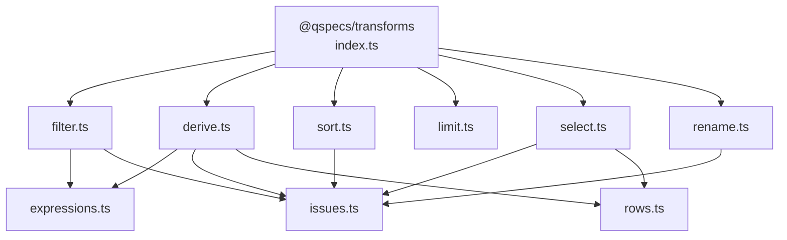
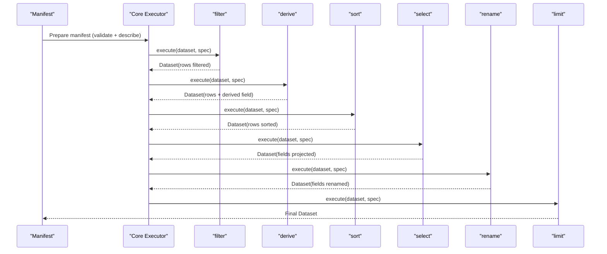
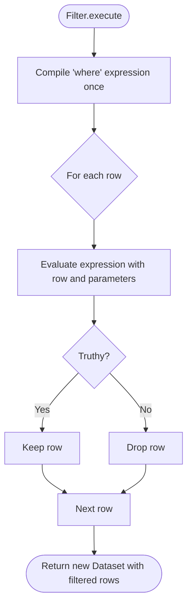
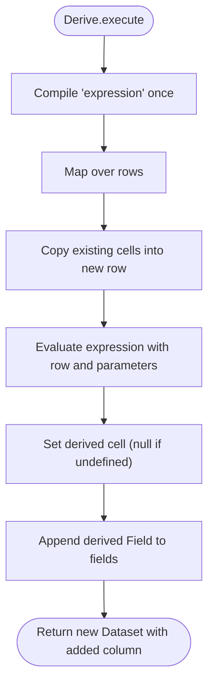
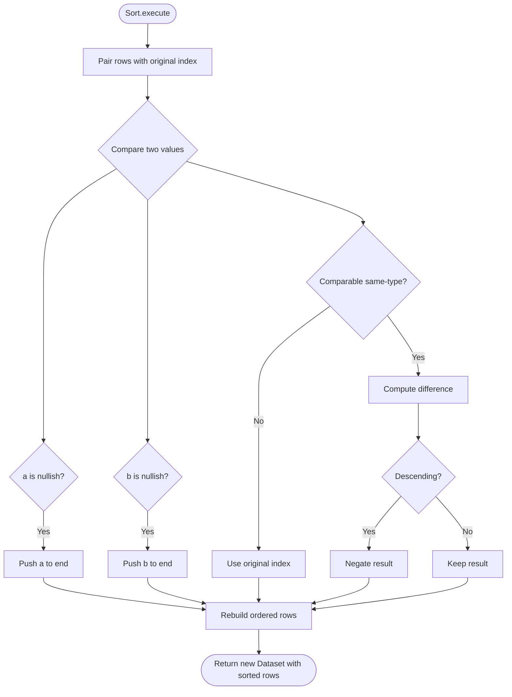
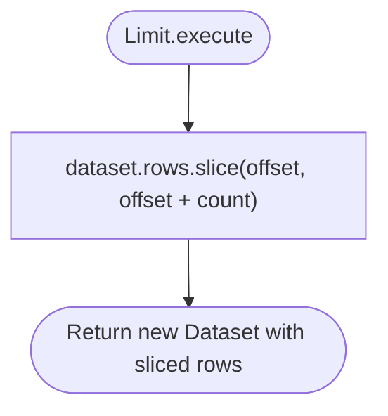
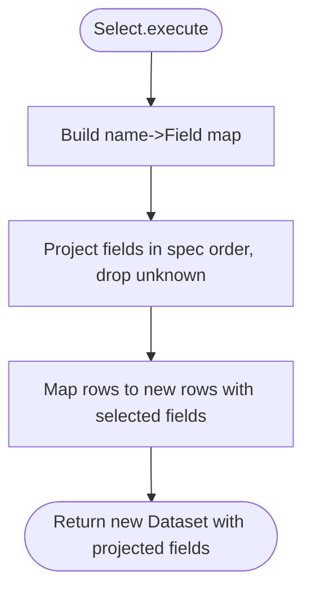
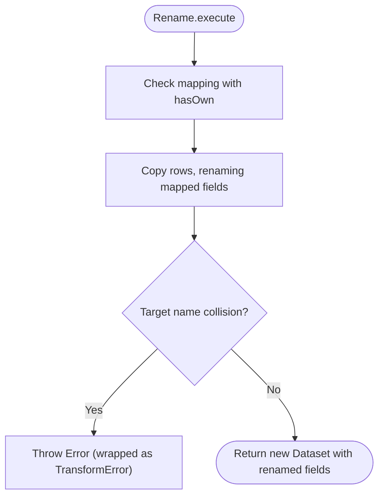
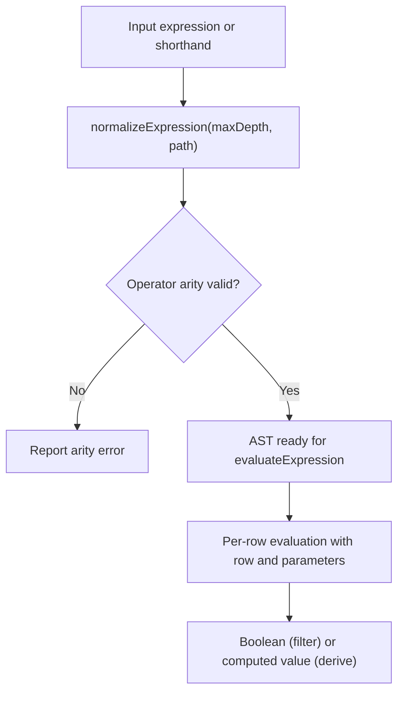
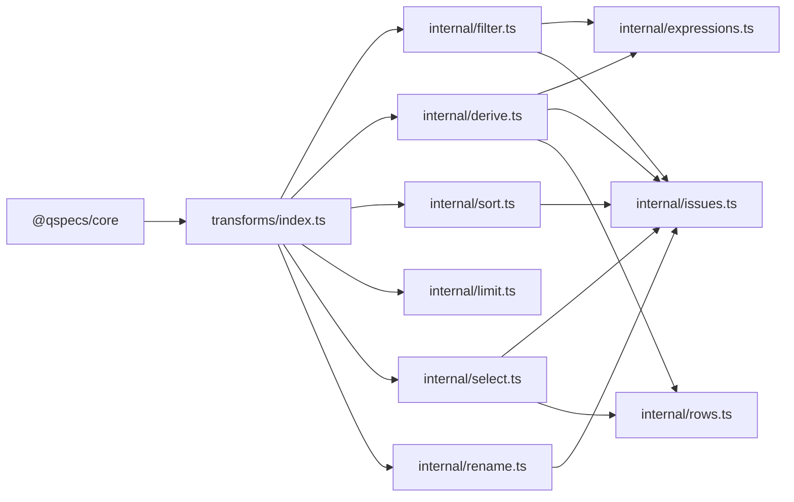

# Data Transformations (@qspecs/transforms)

<cite>
**Referenced Files in This Document**
- [index.ts](file://packages/transforms/src/index.ts)
- [filter.ts](file://packages/transforms/src/internal/filter.ts)
- [derive.ts](file://packages/transforms/src/internal/derive.ts)
- [sort.ts](file://packages/transforms/src/internal/sort.ts)
- [limit.ts](file://packages/transforms/src/internal/limit.ts)
- [select.ts](file://packages/transforms/src/internal/select.ts)
- [rename.ts](file://packages/transforms/src/internal/rename.ts)
- [expressions.ts](file://packages/transforms/src/internal/expressions.ts)
- [issues.ts](file://packages/transforms/src/internal/issues.ts)
- [rows.ts](file://packages/transforms/src/internal/rows.ts)
- [transforms.md](file://docs/transforms.md)
- [04-transform-filter.qspec.json](file://examples/04-transform-filter.qspec.json)
- [05-transform-select.qspec.json](file://examples/05-transform-select.qspec.json)
- [06-transform-rename.qspec.json](file://examples/06-transform-rename.qspec.json)
- [07-transform-derive.qspec.json](file://examples/07-transform-derive.qspec.json)
- [08-transform-sort.qspec.json](file://examples/08-transform-sort.qspec.json)
- [09-transform-limit.qspec.json](file://examples/09-transform-limit.qspec.json)
</cite>

## Table of Contents

1. Introduction
2. Project Structure
3. Core Components
4. Architecture Overview
5. Detailed Component Analysis
6. Dependency Analysis
7. Performance Considerations
8. Troubleshooting Guide
9. Conclusion

## Introduction

This document explains the @qspecs/transforms package, which provides declarative data transformation capabilities for QSpec manifests. It covers all built-in transforms (filter, select, rename, derive, sort, limit), how to compose and chain them, the expression syntax used in filter and derive, common transformation patterns, error handling and validation, debugging techniques, and performance strategies for large datasets.

Transforms execute sequentially on a normalized Dataset after query results are validated against the dataset schema. Each transform returns a new Dataset without mutating its input, ensuring deterministic, composable pipelines where declaration order is the only order.

**Section sources**

- [transforms.md:1-48](file://docs/transforms.md#L1-L48)

## Project Structure

The transforms plugin registers six transforms via a single plugin entry point. Each transform lives in its own internal module with dedicated spec types, execution logic, static describe() projections, and validate() checks. Shared utilities handle expressions, row helpers, and issue formatting.

**Diagram sources**

- [index.ts:1-39](file://packages/transforms/src/index.ts#L1-L39)
- [filter.ts:1-83](file://packages/transforms/src/internal/filter.ts#L1-L83)
- [derive.ts:1-146](file://packages/transforms/src/internal/derive.ts#L1-L146)
- [sort.ts:1-72](file://packages/transforms/src/internal/sort.ts#L1-L72)
- [select.ts:1-67](file://packages/transforms/src/internal/select.ts#L1-L67)

**Section sources**

- [index.ts:1-39](file://packages/transforms/src/index.ts#L1-L39)
- [transforms.md:49-63](file://docs/transforms.md#L49-L63)

## Core Components

- Plugin registration: The transforms plugin registers filter, derive, sort, limit, select, and rename. Expression-based transforms are created as factories that capture maxExpressionDepth from runtime limits.
- Transform contract: Each transform implements execute(), optional describe(), and optional validate(). describe() projects field schemas statically; validate() performs pre-execution checks and can compile expressions early.
- Built-ins:
  - filter: Keeps rows where an expression evaluates truthy.
  - derive: Adds a computed column using an expression; derived fields are always nullable.
  - sort: Stable, nulls-last ordering by one field with asc/desc.
  - limit: Slices rows by count and offset.
  - select: Projects a subset of fields in the specified order.
  - rename: Renames listed fields while preserving positions; detects collisions at runtime.

**Section sources**

- [index.ts:16-39](file://packages/transforms/src/index.ts#L16-L39)
- [transforms.md:49-212](file://docs/transforms.md#L49-L212)

## Architecture Overview

The pipeline executes transforms in declared order. Each step receives the previous step’s output Dataset and returns a fresh Dataset. Expressions in filter and derive are compiled once per execution and evaluated per row. Static schema projection flows through describe() so downstream stages can validate field references before any query runs.

**Diagram sources**

- [transforms.md:24-48](file://docs/transforms.md#L24-L48)
- [index.ts:21-39](file://packages/transforms/src/index.ts#L21-L39)

## Detailed Component Analysis

### Filter Transform

- Purpose: Keep rows where an expression evaluates truthy.
- Spec: { type: "filter", where } where where accepts either the full expression AST or a comparison shorthand { field, operator, value }.
- Behavior: Compiles the expression once per execution; filters rows; returns a new Dataset with unchanged fields.
- Validation: Ensures where exists; compiles expression during validate() to report precise errors; checks referenced fields against known schema when available.
- Example: Filtering orders above a threshold using the comparison shorthand.

**Diagram sources**

- [filter.ts:26-38](file://packages/transforms/src/internal/filter.ts#L26-L38)
- [transforms.md:65-78](file://docs/transforms.md#L65-L78)

**Section sources**

- [filter.ts:15-83](file://packages/transforms/src/internal/filter.ts#L15-L83)
- [transforms.md:65-78](file://docs/transforms.md#L65-L78)
- [04-transform-filter.qspec.json:1-31](file://examples/04-transform-filter.qspec.json#L1-L31)

### Derive Transform

- Purpose: Compute a new field per row using an expression.
- Spec: { type: "derive", field, fieldType, expression }. fieldType is required and never inferred; derived fields are always nullable.
- Behavior: Compiles expression once per execution; maps over rows to append the computed cell; appends a matching Field to fields; returns a new Dataset.
- Validation: Validates field name, fieldType, expression; compiles expression early; checks for field name collisions and referenced fields.
- Example: Multiplying quantity and unit_price to compute totalPrice.

**Diagram sources**

- [derive.ts:46-66](file://packages/transforms/src/internal/derive.ts#L46-L66)
- [transforms.md:80-113](file://docs/transforms.md#L80-L113)

**Section sources**

- [derive.ts:19-146](file://packages/transforms/src/internal/derive.ts#L19-L146)
- [transforms.md:80-113](file://docs/transforms.md#L80-L113)
- [07-transform-derive.qspec.json:1-35](file://examples/07-transform-derive.qspec.json#L1-L35)

### Sort Transform

- Purpose: Order rows by a single field with stable, nulls-last semantics.
- Spec: { type: "sort", field, direction? }. Direction defaults to "asc".
- Behavior: Decorates rows with original indices; sorts with nulls last regardless of direction; uses a compare function consistent with expression evaluation rules; returns a new Dataset.
- Validation: Checks field presence and direction values; validates field names against schema when available.

**Diagram sources**

- [sort.ts:9-49](file://packages/transforms/src/internal/sort.ts#L9-L49)
- [transforms.md:114-140](file://docs/transforms.md#L114-L140)

**Section sources**

- [sort.ts:1-72](file://packages/transforms/src/internal/sort.ts#L1-L72)
- [transforms.md:114-140](file://docs/transforms.md#L114-L140)
- [08-transform-sort.qspec.json:1-30](file://examples/08-transform-sort.qspec.json#L1-L30)

### Limit Transform

- Purpose: Slice rows by count and optional offset.
- Spec: { type: "limit", count, offset? }. Both are non-negative integers; offset defaults to 0.
- Behavior: Returns a slice of rows; does not implement cursor-based pagination beyond offset/count.
- Validation: Enforces integer constraints and non-negativity.

**Diagram sources**

- [transforms.md:141-156](file://docs/transforms.md#L141-L156)

**Section sources**

- [transforms.md:141-156](file://docs/transforms.md#L141-L156)
- [09-transform-limit.qspec.json:1-30](file://examples/09-transform-limit.qspec.json#L1-L30)

### Select Transform

- Purpose: Project a subset of fields in the exact order specified.
- Spec: { type: "select", fields: string[] }.
- Behavior: Builds a map of field names to Field objects; filters unknown names silently at runtime; returns a new Dataset with reordered fields; describe() mirrors this mapping for static schema projection.
- Validation: Ensures fields is a non-empty array of unique strings; validates field names against schema when available.

**Diagram sources**

- [select.ts:9-25](file://packages/transforms/src/internal/select.ts#L9-L25)
- [transforms.md:157-176](file://docs/transforms.md#L157-L176)

**Section sources**

- [select.ts:1-67](file://packages/transforms/src/internal/select.ts#L1-L67)
- [transforms.md:157-176](file://docs/transforms.md#L157-L176)
- [05-transform-select.qspec.json:1-31](file://examples/05-transform-select.qspec.json#L1-L31)

### Rename Transform

- Purpose: Rename listed fields while preserving other fields’ names and positions.
- Spec: { type: "rename", fields: Record<string,string> }.
- Behavior: Uses safe property access to avoid prototype pollution; detects collisions at both validate() (when schema is known) and execute() time; returns a new Dataset with renamed fields.
- Validation: Detects duplicate target names and missing source fields when possible.

**Diagram sources**

- [transforms.md:177-212](file://docs/transforms.md#L177-L212)

**Section sources**

- [transforms.md:177-212](file://docs/transforms.md#L177-L212)
- [06-transform-rename.qspec.json:1-34](file://examples/06-transform-rename.qspec.json#L1-L34)

### Expression Syntax (filter.where and derive.expression)

- Shape: Accepts either the full expression AST or a comparison shorthand { field, operator, value }, which is expanded to { operator, arguments: [{ field }, { literal: value }] }.
- Operators: Fixed set including comparison, logical, membership, null, arithmetic, and other operators. Arity is enforced; unknown operators produce suggestions.
- Semantics: Null propagation in arithmetic; comparisons with null yield false; eq/ne treat null/undefined equality like SQL IS NULL semantics.
- Limits: Depth capped by maxExpressionDepth; violations are reported during validate() and again at execution if validate() was skipped.

**Diagram sources**

- [transforms.md:213-339](file://docs/transforms.md#L213-L339)
- [filter.ts:26-38](file://packages/transforms/src/internal/filter.ts#L26-L38)
- [derive.ts:46-66](file://packages/transforms/src/internal/derive.ts#L46-L66)

**Section sources**

- [transforms.md:213-339](file://docs/transforms.md#L213-L339)

## Dependency Analysis

- Plugin composition: The plugin wires expression depth limits into factory-created transforms and registers all six transforms.
- Internal dependencies:
  - filter and derive depend on expression normalization and evaluation, plus shared utilities for referencing fields and generating issues.
  - select and derive use row helpers to build new rows safely.
  - All transforms rely on core types and validators.

**Diagram sources**

- [index.ts:1-39](file://packages/transforms/src/index.ts#L1-L39)
- [filter.ts:1-83](file://packages/transforms/src/internal/filter.ts#L1-L83)
- [derive.ts:1-146](file://packages/transforms/src/internal/derive.ts#L1-L146)
- [select.ts:1-67](file://packages/transforms/src/internal/select.ts#L1-L67)
- [sort.ts:1-72](file://packages/transforms/src/internal/sort.ts#L1-L72)

**Section sources**

- [index.ts:1-39](file://packages/transforms/src/index.ts#L1-L39)
- [transforms.md:49-63](file://docs/transforms.md#L49-L63)

## Performance Considerations

- Sequential, immutable pipeline: Transforms run in declared order and return new Datasets. Avoid unnecessary intermediate steps; prefer combining operations logically (e.g., filter before sort).
- Expression compilation: Expressions are compiled once per execution, not per row. Keep expressions concise and within maxExpressionDepth to minimize overhead.
- Sorting cost: Sort is O(n log n) with stable, nulls-last behavior. Use it judiciously and consider limiting rows before sorting.
- Pagination: Use limit with offset for paging; be aware there is no server-side cursor—offset must be supplied consistently by the caller.
- Memory management: Each transform creates new row structures. For large datasets, minimize the number of transforms and project only needed fields early with select to reduce memory footprint.
- Schema projection: Implement describe() in custom transforms to preserve static validation downstream; opaque transforms disable later static checks.

[No sources needed since this section provides general guidance]

## Troubleshooting Guide

- Unknown field references:
  - filter and derive validate referenced fields against the projected schema when available; unknown fields surface as precise issues with paths.
  - select drops unknown fields at runtime but reports them during validate() when schema is present.
- Expression errors:
  - Unknown operators, wrong arity, or exceeding maxExpressionDepth are caught during validate() and surfaced with helpful messages and suggestions.
- Collisions:
  - rename detects target-name collisions at both validate() and execute() time; runtime collisions throw errors wrapped as TransformError.
- Debugging tips:
  - Run qspec validate to catch structural and expression issues before executing queries.
  - Inspect describe() outputs to ensure your pipeline’s projected schema matches expectations.
  - Use small sample datasets and stepwise transforms to isolate issues.

**Section sources**

- [filter.ts:45-83](file://packages/transforms/src/internal/filter.ts#L45-L83)
- [derive.ts:72-146](file://packages/transforms/src/internal/derive.ts#L72-L146)
- [select.ts:34-67](file://packages/transforms/src/internal/select.ts#L34-L67)
- [sort.ts:55-72](file://packages/transforms/src/internal/sort.ts#L55-L72)
- [transforms.md:340-405](file://docs/transforms.md#L340-L405)

## Conclusion

The @qspecs/transforms package offers a robust, declarative toolkit for reshaping datasets with predictable semantics. Its fixed operator set, strict expression limits, and strong separation between static schema projection (describe) and runtime execution (execute) enable safe, composable pipelines. By following best practices—ordering transforms thoughtfully, leveraging select early, keeping expressions simple, and validating manifests—you can build efficient, maintainable transformations suitable for large-scale analytics workloads.

[No sources needed since this section summarizes without analyzing specific files]
