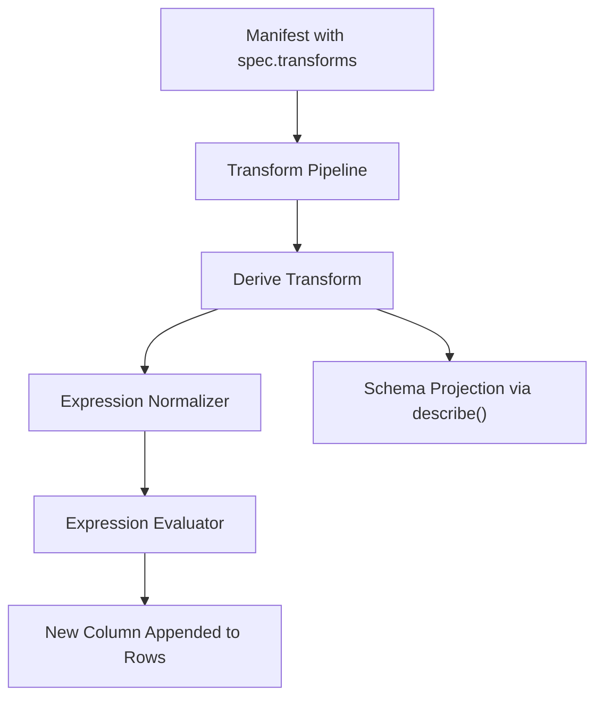
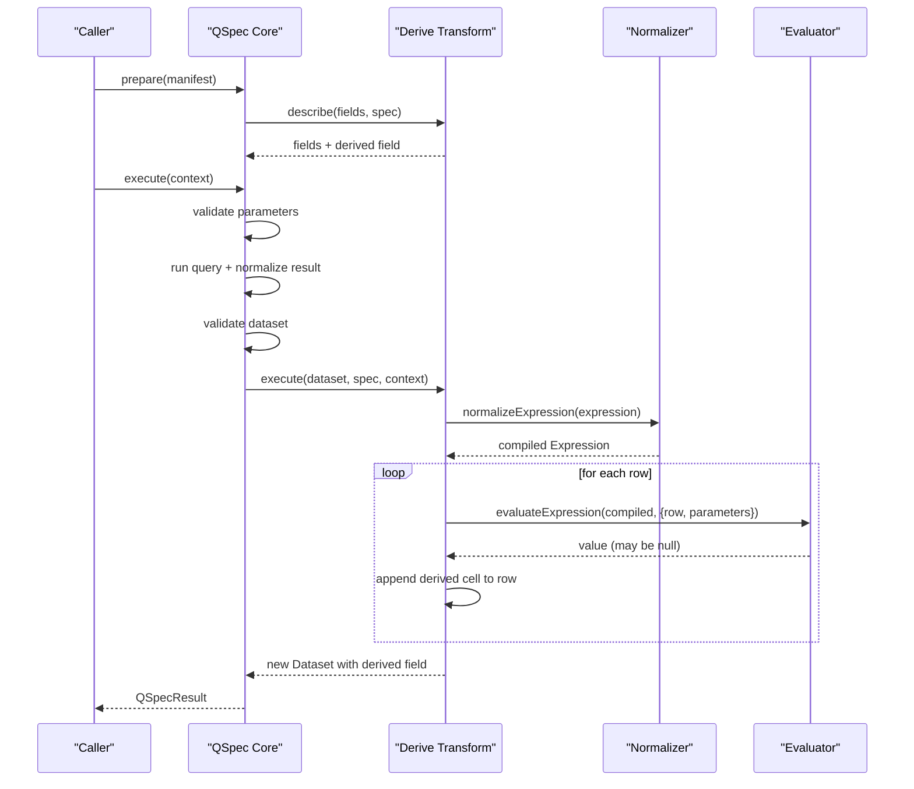
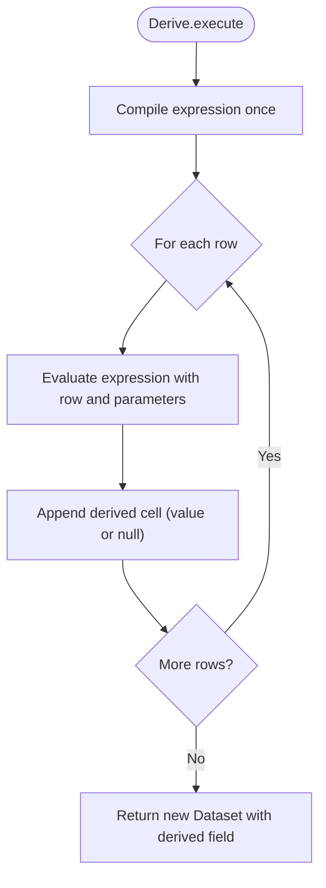
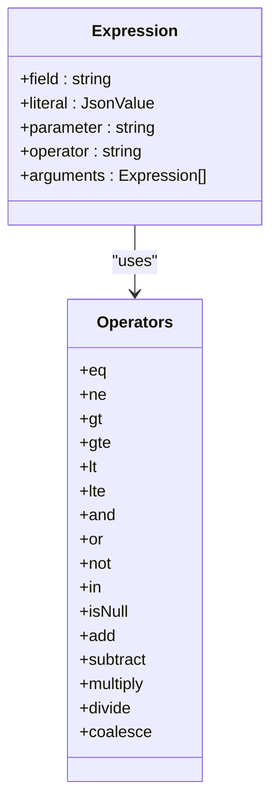
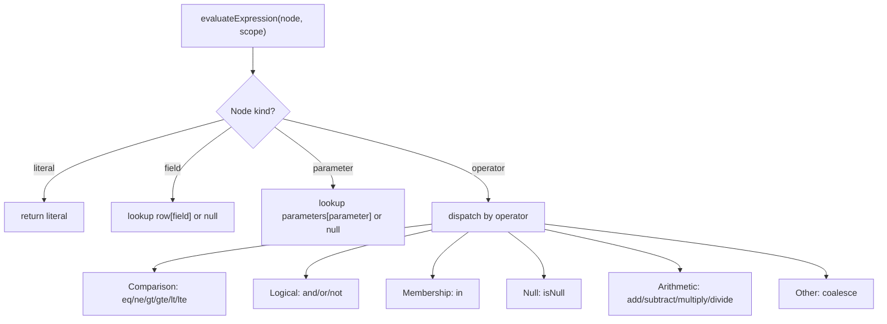
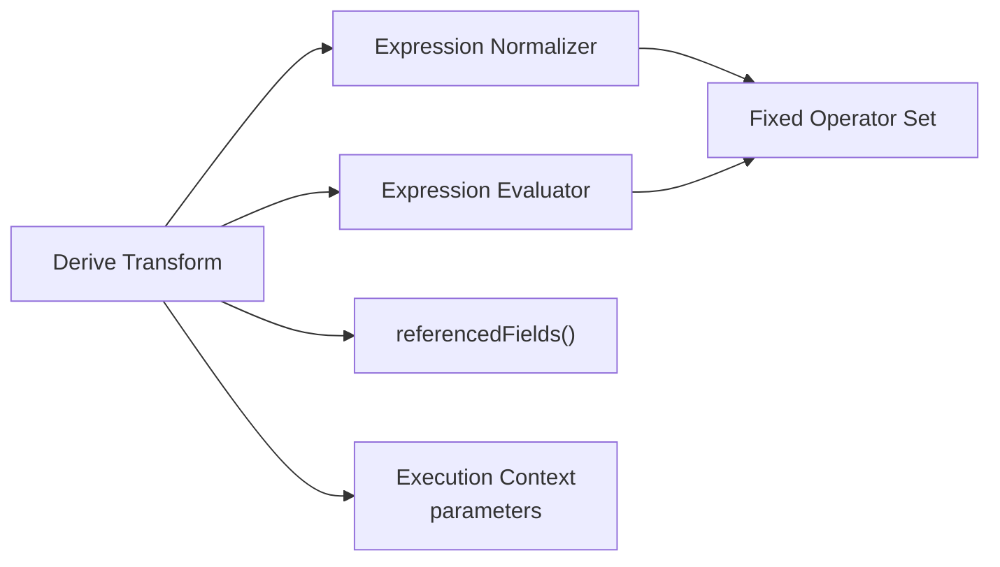

# Derive Transform

<cite>
**Referenced Files in This Document**
- [transforms.md](file://docs/transforms.md)
- [derive.ts](file://packages/transforms/src/internal/derive.ts)
- [evaluate.ts](file://packages/core/src/internal/expression/evaluate.ts)
- [normalize.ts](file://packages/core/src/internal/expression/normalize.ts)
- [expressions.ts](file://packages/transforms/src/internal/expressions.ts)
- [07-transform-derive.qspec.json](file://examples/07-transform-derive.qspec.json)
- [architecture.md](file://docs/architecture.md)
- [parameters.md](file://docs/parameters.md)
</cite>

## Table of Contents

1. [Introduction](#introduction)
2. [Project Structure](#project-structure)
3. [Core Components](#core-components)
4. [Architecture Overview](#architecture-overview)
5. [Detailed Component Analysis](#detailed-component-analysis)
6. [Dependency Analysis](#dependency-analysis)
7. [Performance Considerations](#performance-considerations)
8. [Troubleshooting Guide](#troubleshooting-guide)
9. [Conclusion](#conclusion)

## Introduction

The derive transform computes a new column from existing row data and parameters by evaluating a declarative expression for every row. It is part of the ordered, sequential transform pipeline that runs after query results are normalized into a Dataset and validated against the declared dataset schema. The derive transform adds one field to the output schema and appends one computed cell per row.

Key characteristics:

- Expression-based derivation using a fixed, non-extensible operator set.
- Parameters can be referenced inside expressions.
- The derived field is always nullable because any expression may evaluate to null at runtime.
- Validation occurs both statically (during prepare) and at execution time.

**Section sources**

- [transforms.md:24-48](file://docs/transforms.md#L24-L48)
- [transforms.md:80-112](file://docs/transforms.md#L80-L112)
- [architecture.md:65-82](file://docs/architecture.md#L65-L82)

## Project Structure

The derive capability spans three layers:

- Transform implementation: registers and executes derive logic over a Dataset.
- Expression system: normalizes and evaluates a safe, structured expression AST.
- Examples and documentation: show how to declare derive transforms and how they fit into manifests.

**Diagram sources**

- [derive.ts:46-69](file://packages/transforms/src/internal/derive.ts#L46-L69)
- [normalize.ts:54-114](file://packages/core/src/internal/expression/normalize.ts#L54-L114)
- [evaluate.ts:73-154](file://packages/core/src/internal/expression/evaluate.ts#L73-L154)
- [transforms.md:24-48](file://docs/transforms.md#L24-L48)

**Section sources**

- [transforms.md:24-48](file://docs/transforms.md#L24-L48)
- [derive.ts:46-69](file://packages/transforms/src/internal/derive.ts#L46-L69)

## Core Components

- Derive transform:
  - Adds a new field with a required fieldType and an expression.
  - Always marks the derived field as nullable.
  - Compiles the expression once per execution and evaluates it per row.
  - Projects the new field through describe() so static validation remains accurate.
- Expression AST:
  - Supports field references, literals, parameters, and operators.
  - Fixed operator set with arity enforcement and depth limits.
  - Safe evaluation without eval or Function usage.
- Parameter integration:
  - Expressions can read resolved parameter values via { parameter }.
  - Parameters are validated before execution and bound into the evaluation scope.

**Section sources**

- [derive.ts:19-44](file://packages/transforms/src/internal/derive.ts#L19-L44)
- [derive.ts:46-69](file://packages/transforms/src/internal/derive.ts#L46-L69)
- [transforms.md:213-331](file://docs/transforms.md#L213-L331)
- [evaluate.ts:6-9](file://packages/core/src/internal/expression/evaluate.ts#L6-L9)
- [parameters.md:1-23](file://docs/parameters.md#L1-L23)

## Architecture Overview

The derive transform participates in the standard QSpec pipeline:

- prepare(): validates manifest structure, resolves capabilities, compiles parameters, folds Transform.describe across the pipeline, and validates presentation field references against the projected schema.
- execute(): validates runtime parameters, runs the query, normalizes results, validates the dataset, then runs transforms sequentially. Each transform returns a fresh Dataset; derive appends a new field and computed cells.

**Diagram sources**

- [architecture.md:65-82](file://docs/architecture.md#L65-L82)
- [derive.ts:46-69](file://packages/transforms/src/internal/derive.ts#L46-L69)
- [normalize.ts:54-114](file://packages/core/src/internal/expression/normalize.ts#L54-L114)
- [evaluate.ts:73-154](file://packages/core/src/internal/expression/evaluate.ts#L73-L154)

## Detailed Component Analysis

### Derive Transform Specification and Behavior

- Spec shape:
  - field: string — name of the new column; must not collide with existing fields.
  - fieldType: FieldType — required; determines the type of the derived column.
  - expression: unknown — an expression AST accepted by the expression normalizer.
- Execution behavior:
  - Compiles the expression once per execution.
  - For each row, evaluates the expression in the context of the current row and parameters.
  - Appends the computed value (or null) to the new column.
  - Returns a new Dataset with the added field appended to fields.
- Schema projection:
  - describe() appends the same derived Field used at runtime, ensuring static and dynamic outputs agree.

**Diagram sources**

- [derive.ts:46-69](file://packages/transforms/src/internal/derive.ts#L46-L69)

**Section sources**

- [derive.ts:19-44](file://packages/transforms/src/internal/derive.ts#L19-L44)
- [derive.ts:46-69](file://packages/transforms/src/internal/derive.ts#L46-L69)
- [transforms.md:80-112](file://docs/transforms.md#L80-L112)

### Expression Syntax and Operators

- Expression nodes:
  - { field } reads a cell from the current row.
  - { literal } is a constant JSON value.
  - { parameter } reads a resolved parameter value by its bare name.
  - { operator, arguments } composes operations.
- Comparison shorthand:
  - { field, operator, value } expands to the full AST form during normalization.
- Operator set (fixed):
  - Comparison: eq, ne, gt, gte, lt, lte
  - Logical: and, or, not
  - Membership: in
  - Null: isNull
  - Arithmetic: add, subtract, multiply, divide
  - Other: coalesce
- Arity rules:
  - Most operators take exactly two arguments.
  - not and isNull take exactly one argument.
  - and, or, coalesce are variadic (at least one).
- Depth limit:
  - maxExpressionDepth bounds nesting; exceeding it fails during normalization.

**Diagram sources**

- [normalize.ts:18-35](file://packages/core/src/internal/expression/normalize.ts#L18-L35)
- [normalize.ts:54-114](file://packages/core/src/internal/expression/normalize.ts#L54-L114)
- [transforms.md:213-296](file://docs/transforms.md#L213-L296)

**Section sources**

- [transforms.md:213-331](file://docs/transforms.md#L213-L331)
- [normalize.ts:54-114](file://packages/core/src/internal/expression/normalize.ts#L54-L114)

### Evaluation Context and Built-in Functions

- Evaluation scope:
  - row: current Dataset row values.
  - parameters: resolved parameter map passed from the execution context.
- Field access:
  - Missing fields resolve to null.
- Parameter access:
  - Missing parameters resolve to null.
- Operator semantics:
  - Arithmetic on non-numeric operands yields null.
  - Division by zero yields null (avoids NaN/Infinity).
  - Comparisons involving null operands yield false.
  - eq/ne treat two nullish values as equal.
  - in checks membership against an array literal.
  - isNull detects nullish values.
  - coalesce returns the first non-null argument.

**Diagram sources**

- [evaluate.ts:6-9](file://packages/core/src/internal/expression/evaluate.ts#L6-L9)
- [evaluate.ts:73-154](file://packages/core/src/internal/expression/evaluate.ts#L73-L154)

**Section sources**

- [evaluate.ts:73-154](file://packages/core/src/internal/expression/evaluate.ts#L73-L154)
- [transforms.md:298-310](file://docs/transforms.md#L298-L310)

### Examples of Derived Fields

- Basic calculation:
  - Multiply quantity by unit_price to compute a total price.
- Conditional logic:
  - Use logical operators and comparisons to branch based on field values.
- Data type considerations:
  - Arithmetic requires numeric operands; otherwise, the result is null.
  - Dates are normalized to ISO strings at the top level of cells; composite nested dates are not converted by core normalization.

Example manifest reference:

- See the derive example manifest for a concrete derive step computing a total from two fields.

**Section sources**

- [07-transform-derive.qspec.json:22-32](file://examples/07-transform-derive.qspec.json#L22-L32)
- [datasets.md:113-132](file://docs/datasets.md#L113-L132)

### Error Handling for Invalid Expressions

- Unknown operator:
  - Reported during normalization with a “did you mean” suggestion.
- Wrong arity:
  - Reported with expected vs. received argument count.
- Exceeding maxExpressionDepth:
  - During prepare(), downgraded to a ManifestValidationError issue; during execute(), propagates as LimitExceededError if validate was skipped.
- Referencing missing fields:
  - validate() collects issues when a projected schema is available and references unknown fields.
- Type mismatches in arithmetic:
  - Non-numeric operands produce null rather than throwing.

**Section sources**

- [normalize.ts:60-65](file://packages/core/src/internal/expression/normalize.ts#L60-L65)
- [normalize.ts:123-143](file://packages/core/src/internal/expression/normalize.ts#L123-L143)
- [transforms.md:312-338](file://docs/transforms.md#L312-L338)
- [derive.ts:72-143](file://packages/transforms/src/internal/derive.ts#L72-L143)
- [evaluate.ts:50-67](file://packages/core/src/internal/expression/evaluate.ts#L50-L67)

## Dependency Analysis

The derive transform depends on:

- Expression normalization and evaluation from core.
- Field referencing utilities to validate field names statically.
- Parameter resolution from the execution context.

**Diagram sources**

- [derive.ts:1-17](file://packages/transforms/src/internal/derive.ts#L1-L17)
- [expressions.ts:1-17](file://packages/transforms/src/internal/expressions.ts#L1-L17)
- [normalize.ts:18-35](file://packages/core/src/internal/expression/normalize.ts#L18-L35)
- [evaluate.ts:73-154](file://packages/core/src/internal/expression/evaluate.ts#L73-L154)

**Section sources**

- [derive.ts:1-17](file://packages/transforms/src/internal/derive.ts#L1-L17)
- [expressions.ts:1-17](file://packages/transforms/src/internal/expressions.ts#L1-L17)
- [normalize.ts:18-35](file://packages/core/src/internal/expression/normalize.ts#L18-L35)
- [evaluate.ts:73-154](file://packages/core/src/internal/expression/evaluate.ts#L73-L154)

## Performance Considerations

- Expression compilation:
  - Compiled once per execution, not per row, minimizing overhead.
- Row mapping:
  - Uses immutable row updates to avoid mutating prior datasets.
- Operator efficiency:
  - Arithmetic short-circuits on non-numeric inputs by returning null.
  - Logical operators short-circuit (and/or) to minimize evaluations.
- Limits:
  - maxExpressionDepth prevents deeply nested expressions from degrading performance.
- Best practices:
  - Prefer simple expressions where possible.
  - Use coalesce to provide defaults instead of complex conditionals.
  - Avoid unnecessary deep nesting; flatten logic where feasible.

**Section sources**

- [derive.ts:46-69](file://packages/transforms/src/internal/derive.ts#L46-L69)
- [evaluate.ts:92-117](file://packages/core/src/internal/expression/evaluate.ts#L92-L117)
- [transforms.md:312-331](file://docs/transforms.md#L312-L331)

## Troubleshooting Guide

Common issues and resolutions:

- Unknown operator:
  - Check spelling against the fixed operator set; use suggestions provided by validation.
- Wrong number of arguments:
  - Ensure each operator receives the correct arity; consult operator definitions.
- Exceeded expression depth:
  - Reduce nesting or split logic into multiple transforms.
- Missing field references:
  - Ensure all referenced fields exist in the incoming dataset; verify earlier transforms’ outputs.
- Unexpected nulls:
  - Arithmetic on non-numeric fields yields null; use isNull and coalesce to handle missing data.
- Division by zero:
  - Results in null; guard with conditional logic if needed.

**Section sources**

- [normalize.ts:123-143](file://packages/core/src/internal/expression/normalize.ts#L123-L143)
- [transforms.md:291-310](file://docs/transforms.md#L291-L310)
- [derive.ts:72-143](file://packages/transforms/src/internal/derive.ts#L72-L143)
- [evaluate.ts:50-67](file://packages/core/src/internal/expression/evaluate.ts#L50-L67)

## Conclusion

The derive transform provides a safe, declarative way to compute new columns from existing data and parameters. Its fixed operator set, strict normalization, and robust error handling ensure predictable behavior and portability. By leveraging expression composition, parameters, and careful validation, authors can build both simple and complex derived fields while maintaining performance and reliability within the QSpec pipeline.
