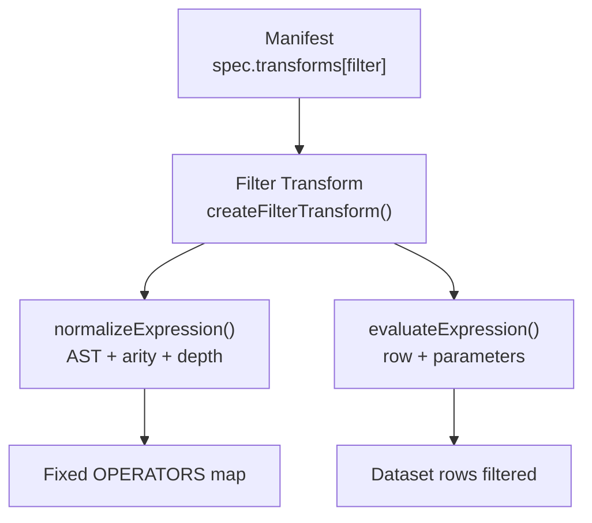
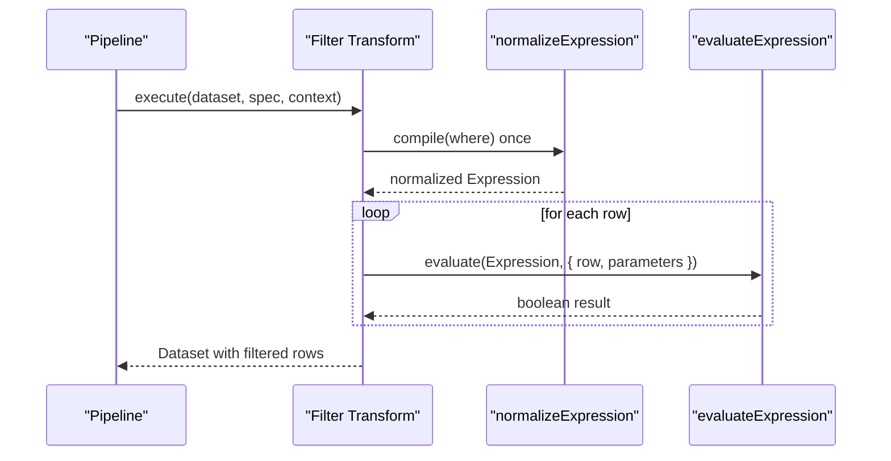
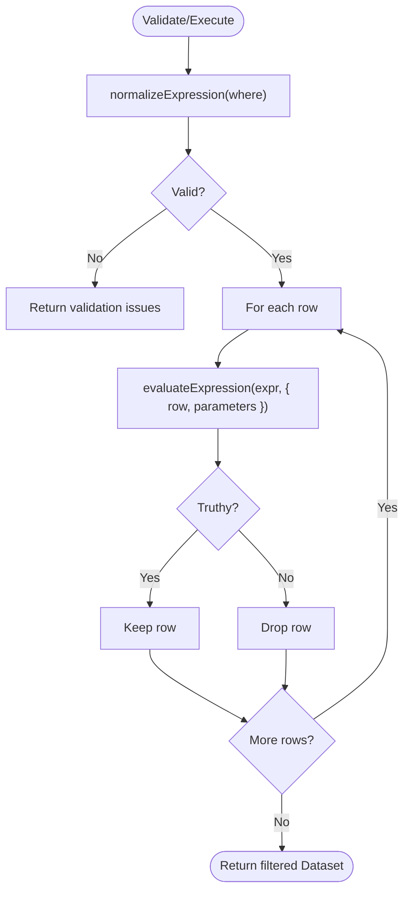
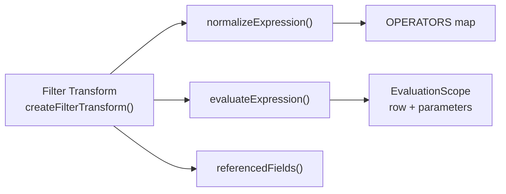

# Filter Transform

<cite>
**Referenced Files in This Document**
- [filter.ts](file://packages/transforms/src/internal/filter.ts)
- [normalize.ts](file://packages/core/src/internal/expression/normalize.ts)
- [evaluate.ts](file://packages/core/src/internal/expression/evaluate.ts)
- [transforms.md](file://docs/transforms.md)
- [04-transform-filter.qspec.json](file://examples/04-transform-filter.qspec.json)
- [07-transform-derive.qspec.json](file://examples/07-transform-derive.qspec.json)
- [filter.test.ts](file://packages/transforms/src/internal/filter.test.ts)
</cite>

## Table of Contents

1. [Introduction](#introduction)
2. [Project Structure](#project-structure)
3. [Core Components](#core-components)
4. [Architecture Overview](#architecture-overview)
5. [Detailed Component Analysis](#detailed-component-analysis)
6. [Dependency Analysis](#dependency-analysis)
7. [Performance Considerations](#performance-considerations)
8. [Troubleshooting Guide](#troubleshooting-guide)
9. [Conclusion](#conclusion)
10. [Appendices](#appendices)

## Introduction

The filter transform enables conditional row filtering in data transformations by evaluating a declarative expression against each dataset row. It compiles the provided condition into a safe, fixed-expression AST once per execution and then evaluates it for every row, keeping only those that evaluate to truthy. The filter supports both a concise comparison shorthand and the full expression AST, including logical operators (and, or, not), membership checks (in), null handling (isNull), arithmetic helpers, and parameter resolution.

## Project Structure

The filter transform is implemented as part of the transforms package and relies on core expression utilities for normalization and evaluation:

- Transform implementation: packages/transforms/src/internal/filter.ts
- Expression normalization and operator registry: packages/core/src/internal/expression/normalize.ts
- Expression evaluator: packages/core/src/internal/expression/evaluate.ts
- User-facing documentation and examples: docs/transforms.md and examples/04-transform-filter.qspec.json

**Diagram sources**

- [filter.ts:26-38](file://packages/transforms/src/internal/filter.ts#L26-L38)
- [normalize.ts:54-144](file://packages/core/src/internal/expression/normalize.ts#L54-L144)
- [evaluate.ts:73-154](file://packages/core/src/internal/expression/evaluate.ts#L73-L154)

**Section sources**

- [filter.ts:15-83](file://packages/transforms/src/internal/filter.ts#L15-L83)
- [normalize.ts:18-35](file://packages/core/src/internal/expression/normalize.ts#L18-L35)
- [evaluate.ts:6-9](file://packages/core/src/internal/expression/evaluate.ts#L6-L9)
- [transforms.md:65-78](file://docs/transforms.md#L65-L78)

## Core Components

- FilterSpec: Declares a where clause that can be either the comparison shorthand or a full expression AST.
- createFilterTransform(maxExpressionDepth): Factory that builds a transform with a configured maximum expression nesting depth.
- execute(dataset, spec, context): Compiles the where expression once, then filters rows by evaluating the compiled expression against each row’s fields and the provided parameters.
- describe(fields): Returns fields unchanged because filtering removes rows but never columns.
- validate(spec, fields): Ensures where exists, normalizes the expression (catching errors early), and checks referenced field names against the projected schema when available.

Key behaviors:

- Comparison shorthand { field, operator, value } expands to { operator, arguments: [{ field }, { literal: value }] }.
- Logical short-circuiting: and stops at the first false; or stops at the first true.
- Null semantics: comparisons involving null are false; eq/ne treat two nulls as equal; isNull detects nullness; arithmetic propagates null.

**Section sources**

- [filter.ts:15-83](file://packages/transforms/src/internal/filter.ts#L15-L83)
- [transforms.md:239-310](file://docs/transforms.md#L239-L310)
- [evaluate.ts:11-14](file://packages/core/src/internal/expression/evaluate.ts#L11-L14)
- [evaluate.ts:91-154](file://packages/core/src/internal/expression/evaluate.ts#L91-L154)

## Architecture Overview

The filter transform integrates into the pipeline as a sequential step. Each transform receives the previous transform’s output and returns a new Dataset without mutating inputs.

**Diagram sources**

- [filter.ts:26-38](file://packages/transforms/src/internal/filter.ts#L26-L38)
- [normalize.ts:54-144](file://packages/core/src/internal/expression/normalize.ts#L54-L144)
- [evaluate.ts:73-154](file://packages/core/src/internal/expression/evaluate.ts#L73-L154)

## Detailed Component Analysis

### Filter Syntax and Expression Forms

- Shorthand form: { field, operator, value } is accepted and expanded to the canonical AST form during normalization.
- Full AST form: { operator, arguments: [...] } allows multi-field expressions and complex logic.
- Leaf nodes:
  - { field: "name" } reads from the current row.
  - { literal: value } is a constant JSON value.
  - { parameter: "name" } reads from resolved parameters passed via context.

Supported operators (fixed set):

- Comparison: eq, ne, gt, gte, lt, lte
- Logical: and, or, not
- Membership: in
- Null: isNull
- Arithmetic: add, subtract, multiply, divide
- Other: coalesce

Arity rules:

- Most operators take exactly 2 arguments.
- not and isNull take exactly 1.
- and, or, coalesce are variadic (at least 1).

Examples in manifests:

- Simple comparison shorthand: see example manifest using amount > threshold.
- Multi-field expression: see derive example showing multiplication of two fields (same AST machinery applies to filter expressions).

**Section sources**

- [transforms.md:65-78](file://docs/transforms.md#L65-L78)
- [transforms.md:239-296](file://docs/transforms.md#L239-L296)
- [normalize.ts:77-103](file://packages/core/src/internal/expression/normalize.ts#L77-L103)
- [normalize.ts:116-144](file://packages/core/src/internal/expression/normalize.ts#L116-L144)
- [04-transform-filter.qspec.json:23-28](file://examples/04-transform-filter.qspec.json#L23-L28)
- [07-transform-derive.qspec.json:22-32](file://examples/07-transform-derive.qspec.json#L22-L32)

### Evaluation Semantics and Null Handling

- Comparisons with null operands evaluate to false.
- eq/ne special-case: two nulls are considered equal (eq → true, ne → false).
- Arithmetic with missing or non-numeric operands yields null rather than NaN or Infinity.
- isNull tests for nullness directly.
- coalesce returns the first non-null argument.

Logical operators short-circuit:

- and stops evaluating further arguments once a false is encountered.
- or stops evaluating further arguments once a true is encountered.

Field and parameter access:

- Field access uses safe property checks to avoid inherited properties.
- Parameter access reads from the parameters object provided by the execution context.

**Section sources**

- [evaluate.ts:33-67](file://packages/core/src/internal/expression/evaluate.ts#L33-L67)
- [evaluate.ts:91-154](file://packages/core/src/internal/expression/evaluate.ts#L91-L154)
- [transforms.md:298-310](file://docs/transforms.md#L298-L310)

### Common Filtering Patterns

- Date ranges: Use comparison operators on date-like strings or datetime values (e.g., month between two values using and with gt/lte).
- Value lists: Use in with an array literal to match any of several values.
- Pattern matching: Combine string comparisons (eq, ne, gt, etc.) with derived fields if needed; note that the fixed operator set does not include regex—use other transforms or query-time logic for advanced patterns.
- Nested object filtering: Access nested properties via additional derive steps before filtering, since field references resolve top-level keys. Alternatively, normalize data upstream so the filter can reference flattened fields.

Practical references:

- Shorthand usage in a real manifest: see high-value orders example.
- Multi-field expressions: see derive example demonstrating two-field operations using the same AST.

**Section sources**

- [04-transform-filter.qspec.json:23-28](file://examples/04-transform-filter.qspec.json#L23-L28)
- [07-transform-derive.qspec.json:22-32](file://examples/07-transform-derive.qspec.json#L22-L32)
- [evaluate.ts:143-144](file://packages/core/src/internal/expression/evaluate.ts#L143-L144)

### Execution Flow and Validation

- Compilation: normalizeExpression validates operator names, arity, and nesting depth, expanding shorthand into AST.
- Evaluation: evaluateExpression interprets the AST safely without eval.
- Validation: filter.validate compiles the expression early and checks referenced fields against the projected schema when available, providing suggestions for typos.

**Diagram sources**

- [filter.ts:26-83](file://packages/transforms/src/internal/filter.ts#L26-L83)
- [normalize.ts:54-144](file://packages/core/src/internal/expression/normalize.ts#L54-L144)
- [evaluate.ts:73-154](file://packages/core/src/internal/expression/evaluate.ts#L73-L154)

**Section sources**

- [filter.ts:26-83](file://packages/transforms/src/internal/filter.ts#L26-L83)
- [normalize.ts:54-144](file://packages/core/src/internal/expression/normalize.ts#L54-L144)
- [evaluate.ts:73-154](file://packages/core/src/internal/expression/evaluate.ts#L73-L154)

## Dependency Analysis

The filter transform depends on core expression utilities and participates in the transform pipeline:

- Depends on normalizeExpression for AST creation and validation.
- Depends on evaluateExpression for row-wise evaluation.
- Uses referencedFields (from internal expressions utility) during validation to check field existence against the projected schema.

**Diagram sources**

- [filter.ts:1-13](file://packages/transforms/src/internal/filter.ts#L1-L13)
- [normalize.ts:18-35](file://packages/core/src/internal/expression/normalize.ts#L18-L35)
- [evaluate.ts:6-9](file://packages/core/src/internal/expression/evaluate.ts#L6-L9)

**Section sources**

- [filter.ts:1-13](file://packages/transforms/src/internal/filter.ts#L1-L13)
- [normalize.ts:18-35](file://packages/core/src/internal/expression/normalize.ts#L18-L35)
- [evaluate.ts:6-9](file://packages/core/src/internal/expression/evaluate.ts#L6-L9)

## Performance Considerations

- Expression compilation is performed once per execution, not per row, minimizing overhead.
- Logical short-circuiting avoids unnecessary evaluations in and/or chains.
- Null-safe comparisons prevent expensive error paths; comparisons with null yield false quickly.
- Depth limits protect against deeply nested expressions; exceeding maxExpressionDepth fails fast during normalization.
- For large datasets:
  - Prefer simple, selective filters early in the pipeline to reduce downstream work.
  - Use in for value lists instead of multiple or conditions when appropriate.
  - Avoid heavy computations inside expressions; consider precomputing derived fields earlier.
  - Ensure upstream queries return only necessary fields to minimize memory and evaluation cost.

**Section sources**

- [filter.ts:31-38](file://packages/transforms/src/internal/filter.ts#L31-L38)
- [evaluate.ts:91-105](file://packages/core/src/internal/expression/evaluate.ts#L91-L105)
- [normalize.ts:60-65](file://packages/core/src/internal/expression/normalize.ts#L60-L65)
- [transforms.md:24-43](file://docs/transforms.md#L24-L43)

## Troubleshooting Guide

Common issues and how they surface:

- Missing where clause: validate returns an issue pointing to where.
- Unknown operator: normalizeExpression reports a precise path and provides a suggestion based on the fixed operator set.
- Wrong arity: normalizeExpression enforces expected argument counts and reports them explicitly.
- Exceeded expression depth: normalizeExpression throws LimitExceededError; filter.validate downgrades this to a QSpecIssue with the path ["where"].
- Referencing unknown fields: validate compares referenced fields against the projected schema and suggests corrections when possible.
- Parameters not resolving: ensure parameters are provided in the execution context; missing parameters resolve to null.

Behavioral notes:

- eq/ne treat two nulls as equal; use isNull to explicitly test for nullness.
- Comparisons involving null evaluate to false; combine with isNull to handle missing data intentionally.
- Arithmetic with non-numeric or missing operands yields null; use coalesce to provide fallbacks.

**Section sources**

- [filter.ts:45-83](file://packages/transforms/src/internal/filter.ts#L45-L83)
- [normalize.ts:60-65](file://packages/core/src/internal/expression/normalize.ts#L60-L65)
- [normalize.ts:123-144](file://packages/core/src/internal/expression/normalize.ts#L123-L144)
- [evaluate.ts:11-14](file://packages/core/src/internal/expression/evaluate.ts#L11-L14)
- [evaluate.ts:122-154](file://packages/core/src/internal/expression/evaluate.ts#L122-L154)
- [filter.test.ts:82-128](file://packages/transforms/src/internal/filter.test.ts#L82-L128)

## Conclusion

The filter transform provides a safe, efficient, and expressive way to conditionally filter dataset rows using a fixed, well-defined expression language. It supports concise shorthand for common comparisons and a full AST for complex logic, including logical operators, membership checks, null handling, and parameterization. With strict validation, predictable semantics, and performance-conscious design, it fits cleanly into the sequential transform pipeline while enabling powerful data conditioning prior to presentation.

## Appendices

### Quick Reference: Supported Operators and Behaviors

- Comparison: eq, ne, gt, gte, lt, lte
  - Null operand behavior: comparisons with null evaluate to false.
  - eq/ne special case: two nulls are equal.
- Logical: and, or, not
  - Short-circuit evaluation for and/or.
- Membership: in
  - Matches against array literals.
- Null: isNull
  - Detects null or undefined.
- Arithmetic: add, subtract, multiply, divide
  - Non-numeric or missing operands yield null; division by zero yields null.
- Other: coalesce
  - Returns first non-null argument.

**Section sources**

- [normalize.ts:18-35](file://packages/core/src/internal/expression/normalize.ts#L18-L35)
- [evaluate.ts:91-154](file://packages/core/src/internal/expression/evaluate.ts#L91-L154)
- [transforms.md:263-310](file://docs/transforms.md#L263-L310)
