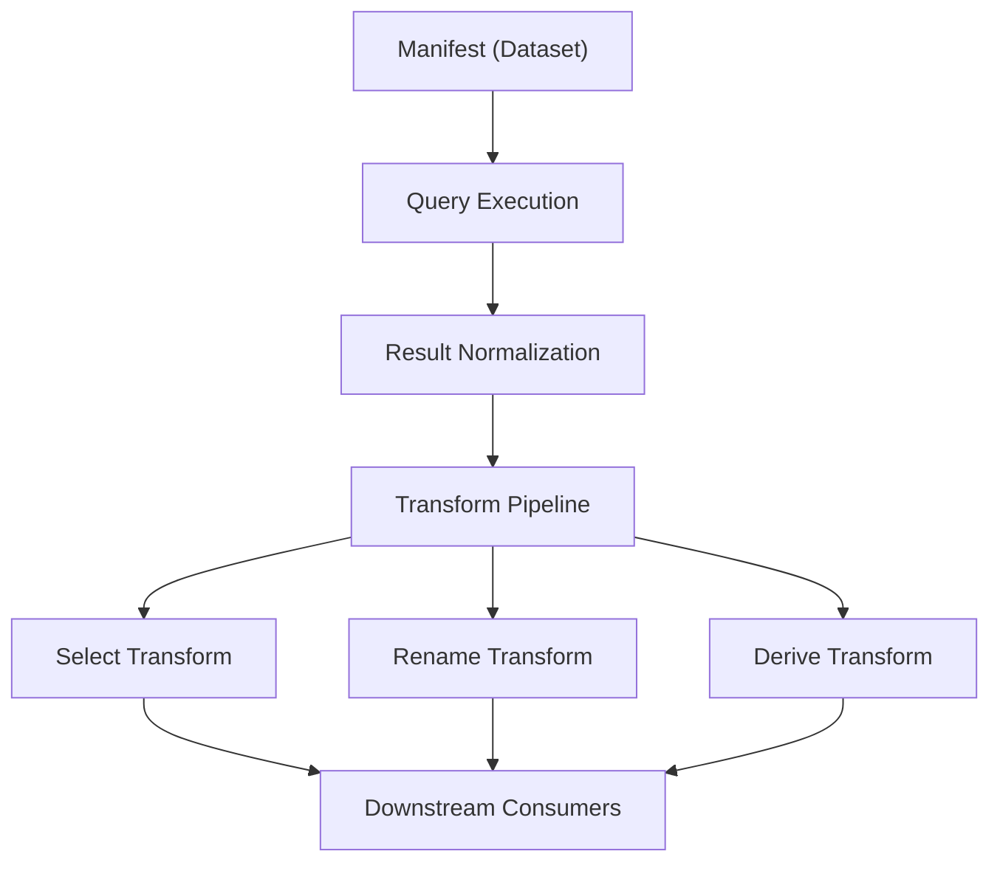
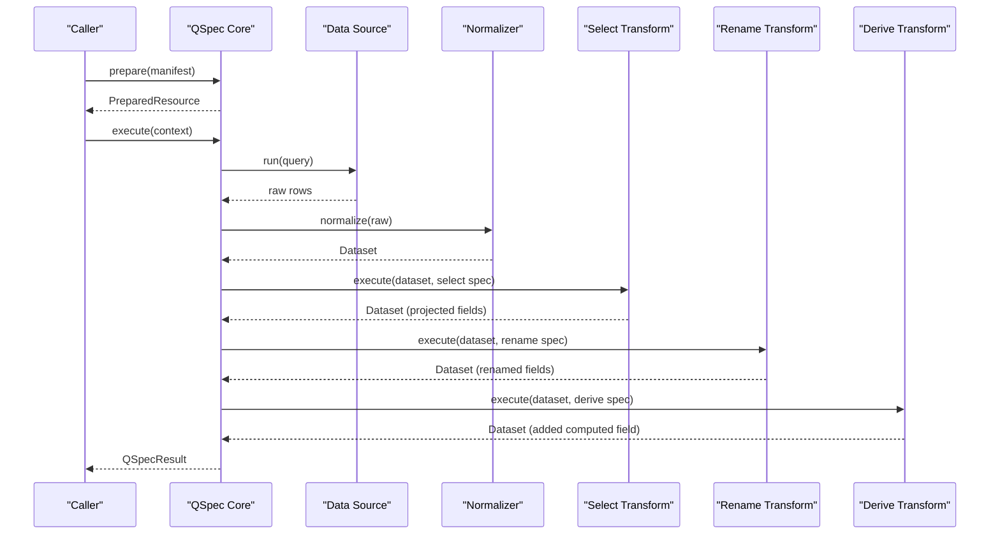
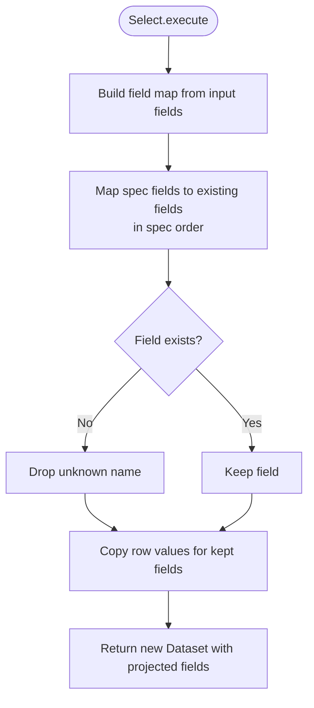
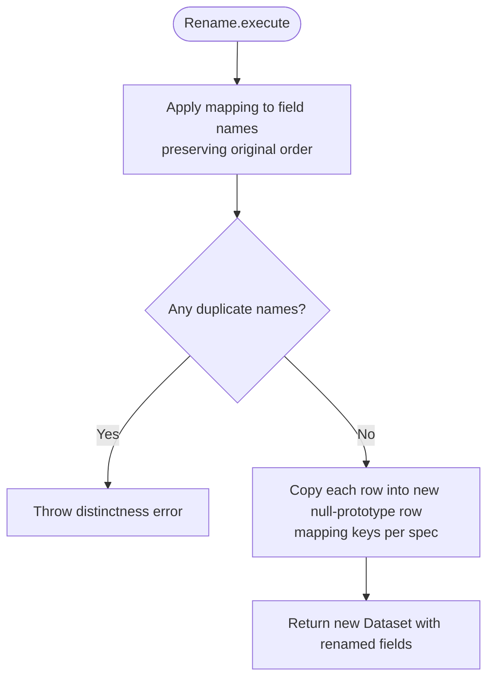
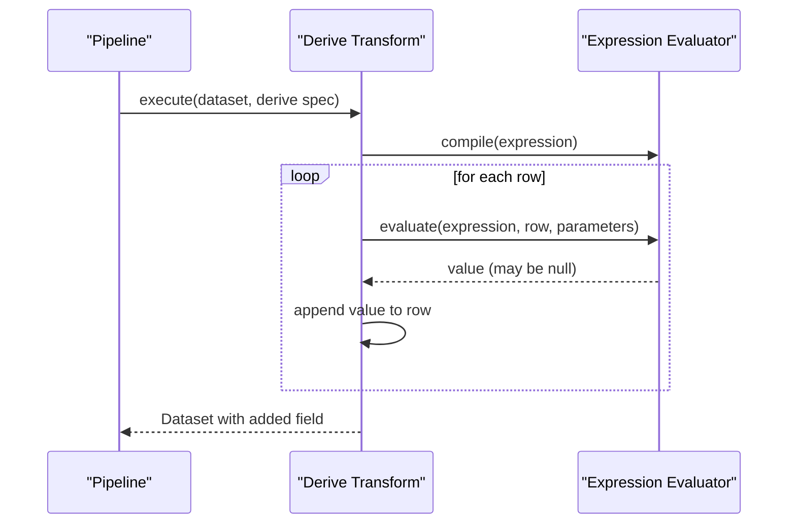
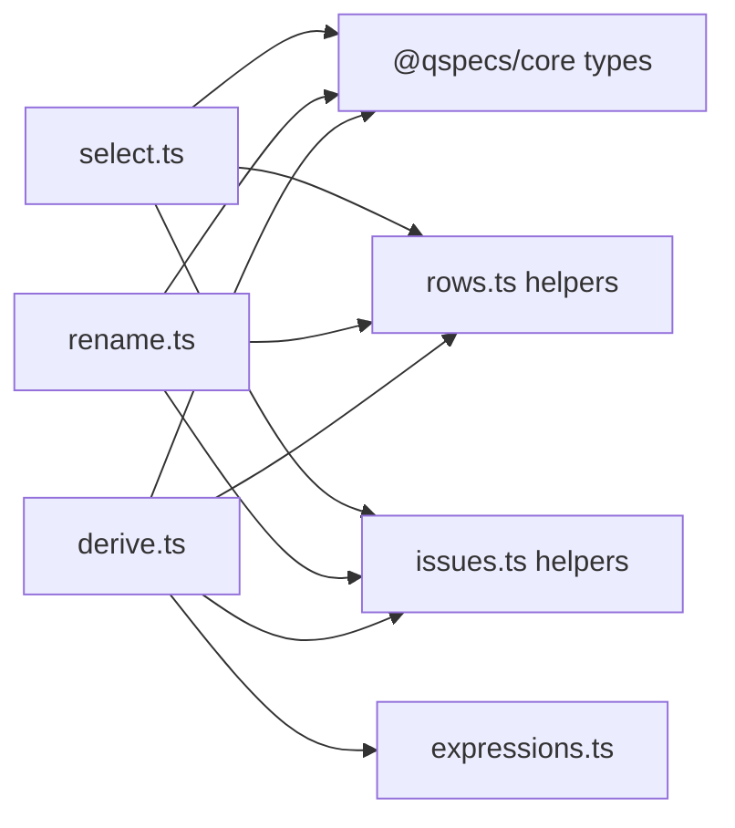

# Select and Rename Transforms

<cite>
**Referenced Files in This Document**
- [select.ts](file://packages/transforms/src/internal/select.ts)
- [rename.ts](file://packages/transforms/src/internal/rename.ts)
- [transforms.md](file://docs/transforms.md)
- [architecture.md](file://docs/architecture.md)
- [05-transform-select.qspec.json](file://examples/05-transform-select.qspec.json)
- [06-transform-rename.qspec.json](file://examples/06-transform-rename.qspec.json)
- [07-transform-derive.qspec.json](file://examples/07-transform-derive.qspec.json)
- [expressions.ts](file://packages/transforms/src/internal/expressions.ts)
- [evaluate.ts](file://packages/core/src/internal/expression/evaluate.ts)
</cite>

## Table of Contents

1. [Introduction](#introduction)
2. [Project Structure](#project-structure)
3. [Core Components](#core-components)
4. [Architecture Overview](#architecture-overview)
5. [Detailed Component Analysis](#detailed-component-analysis)
6. [Dependency Analysis](#dependency-analysis)
7. [Performance Considerations](#performance-considerations)
8. [Troubleshooting Guide](#troubleshooting-guide)
9. [Conclusion](#conclusion)
10. [Appendices](#appendices)

## Introduction

This document explains the select and rename transforms used for column manipulation in QSpec’s transform pipeline. It covers:

- Selecting specific columns (projection), reordering them, and dropping unused ones.
- Renaming columns while preserving all data and original field order.
- Creating computed columns via the derive transform to enable derived fields that can be selected or renamed afterward.
- Practical examples such as selective projection, aliasing, and reordering.
- Performance implications and best practices for optimizing query performance through strategic column selection.

The transforms execute sequentially after a query result is normalized into a Dataset and validated against the declared dataset schema. Each transform returns a new Dataset without mutating its input, ensuring deterministic, composable pipelines.

**Section sources**

- [transforms.md:24-47](file://docs/transforms.md#L24-L47)
- [architecture.md:65-82](file://docs/architecture.md#L65-L82)

## Project Structure

The select and rename transforms are implemented in the transforms package under internal modules, with tests and documentation alongside example manifests demonstrating usage.

**Diagram sources**

- [architecture.md:11-63](file://docs/architecture.md#L11-L63)
- [transforms.md:49-63](file://docs/transforms.md#L49-L63)

**Section sources**

- [architecture.md:11-63](file://docs/architecture.md#L11-L63)
- [transforms.md:49-63](file://docs/transforms.md#L49-L63)

## Core Components

- Select transform: Projects the dataset to exactly the named fields in the order specified by the manifest. Unknown names are silently dropped at runtime but caught statically when a schema projection is available.
- Rename transform: Renames listed fields using an old-name-to-new-name mapping; unlisted fields remain unchanged. Field order is preserved; this is not a reorder.
- Derive transform: Adds a computed column based on an expression AST. The new field is appended to the dataset and can subsequently be selected or renamed.

Key behaviors:

- Immutability: All transforms return a fresh Dataset without mutating inputs.
- Static validation: describe() projects the output schema before execution, enabling presentation validation and early error detection.
- Safety: Prototype-safe property access avoids issues with special property names like constructor.

**Section sources**

- [select.ts:9-32](file://packages/transforms/src/internal/select.ts#L9-L32)
- [rename.ts:10-28](file://packages/transforms/src/internal/rename.ts#L10-L28)
- [transforms.md:157-211](file://docs/transforms.md#L157-L211)
- [architecture.md:65-82](file://docs/architecture.md#L65-L82)

## Architecture Overview

The transform pipeline runs after normalization and dataset validation. Each transform executes in declared order, receiving the previous transform’s output.

**Diagram sources**

- [architecture.md:65-82](file://docs/architecture.md#L65-L82)
- [transforms.md:24-47](file://docs/transforms.md#L24-L47)

## Detailed Component Analysis

### Select Transform

Purpose:

- Selects a subset of columns from the dataset.
- Enforces the exact order specified in the manifest.
- Drops any fields not listed.

Behavior:

- Spec order wins over dataset order.
- Unknown field names are ignored at runtime; static validation reports unknown fields when a schema projection exists.
- Validates that fields is a non-empty array of unique strings.

Examples:

- Selective projection: choose only id, name, price from a product catalog dataset.
- Column reordering: list fields in the desired order to control downstream consumption.

Computed columns:

- Use derive to create a new field first; then use select to include it in the output.

Nested object field selection:

- Select operates on top-level fields. For nested objects, compute a flattened field via derive if needed, then select that derived field.

**Diagram sources**

- [select.ts:10-25](file://packages/transforms/src/internal/select.ts#L10-L25)

**Section sources**

- [select.ts:9-66](file://packages/transforms/src/internal/select.ts#L9-L66)
- [transforms.md:157-175](file://docs/transforms.md#L157-L175)
- [05-transform-select.qspec.json:1-31](file://examples/05-transform-select.qspec.json#L1-L31)

### Rename Transform

Purpose:

- Renames listed fields according to a mapping from old names to new names.
- Preserves original field positions; this is not a reorder.
- Leaves unlisted fields untouched.

Behavior:

- Collision detection occurs both statically (when schema is known) and at runtime to prevent duplicate field names.
- Uses prototype-safe checks to handle special property names safely.
- Validates that the mapping is an object with string keys and non-empty string values; detects duplicate targets.

Examples:

- Aliasing: rename snake_case columns returned by a source to canonical names used downstream.
- Rebranding: change internal field names to user-friendly names without altering data.

**Diagram sources**

- [rename.ts:58-73](file://packages/transforms/src/internal/rename.ts#L58-L73)

**Section sources**

- [rename.ts:5-130](file://packages/transforms/src/internal/rename.ts#L5-L130)
- [transforms.md:177-211](file://docs/transforms.md#L177-L211)
- [06-transform-rename.qspec.json:1-34](file://examples/06-transform-rename.qspec.json#L1-L34)

### Derived Columns (for Computed Fields)

Purpose:

- Create a new computed field from existing fields and parameters using an expression AST.
- Appends the derived field to the dataset; subsequent transforms can select or rename it.

Behavior:

- Expression compilation happens once per execution; evaluation occurs per row.
- The derived field is always nullable because expressions may yield null.
- Supports parameters and arithmetic/logical operators within a fixed operator set.

Example:

- Compute totalPrice from quantity and unit_price, then select or rename it.

**Diagram sources**

- [derive.ts:46-66](file://packages/transforms/src/internal/derive.ts#L46-L66)
- [evaluate.ts:76-120](file://packages/core/src/internal/expression/evaluate.ts#L76-L120)

**Section sources**

- [07-transform-derive.qspec.json:1-35](file://examples/07-transform-derive.qspec.json#L1-L35)
- [transforms.md:80-101](file://docs/transforms.md#L80-L101)
- [expressions.ts:1-16](file://packages/transforms/src/internal/expressions.ts#L1-L16)
- [evaluate.ts:76-120](file://packages/core/src/internal/expression/evaluate.ts#L76-L120)

## Dependency Analysis

The select and rename transforms depend on core types and utilities for datasets, fields, and row handling. They also rely on shared helpers for creating safe row objects and setting cell values.

**Diagram sources**

- [select.ts:1-3](file://packages/transforms/src/internal/select.ts#L1-L3)
- [rename.ts:1-3](file://packages/transforms/src/internal/rename.ts#L1-L3)
- [derive.ts:1-17](file://packages/transforms/src/internal/derive.ts#L1-L17)
- [expressions.ts:1-16](file://packages/transforms/src/internal/expressions.ts#L1-L16)

**Section sources**

- [select.ts:1-66](file://packages/transforms/src/internal/select.ts#L1-L66)
- [rename.ts:1-130](file://packages/transforms/src/internal/rename.ts#L1-L130)
- [derive.ts:1-78](file://packages/transforms/src/internal/derive.ts#L1-L78)
- [expressions.ts:1-16](file://packages/transforms/src/internal/expressions.ts#L1-L16)

## Performance Considerations

- Prefer selecting only the columns you need. Reducing the number of fields decreases memory usage and speeds up downstream processing and rendering.
- Place select early in the pipeline to minimize work done by later transforms and consumers.
- Use derive to compute only necessary fields; avoid adding large intermediate structures unless required.
- Be mindful of expression depth limits and operator costs when designing derived fields.
- Avoid unnecessary renames; they preserve all data and do not reduce payload size.

Best practices:

- Define minimal field sets in select to match consumer needs.
- Order fields in select to match downstream expectations, avoiding extra reordering steps.
- Combine derive and select to produce lean outputs tailored to presentations.

[No sources needed since this section provides general guidance]

## Troubleshooting Guide

Common issues and how to resolve them:

- Unknown field in select: If a field name does not exist, it is dropped at runtime; static validation will report unknown fields when a schema projection is available. Ensure the field exists before the select step or remove it from the list.
- Duplicate field names in rename: Renaming two fields to the same target causes a collision. Adjust the mapping so each target is unique.
- Overwriting existing fields in rename: If renaming a field to a name that already exists (and is not being renamed away), a collision is reported. Resolve by renaming the existing field or changing the target.
- Invalid select.fields: Must be a non-empty array of unique strings. Correct the type and ensure no duplicates.
- Invalid rename.fields: Must be an object mapping old names to non-empty string names. Validate the structure and targets.

Static vs runtime checks:

- Static checks occur during prepare() using describe() projections; runtime checks catch issues when schema information is unavailable earlier in the pipeline.

**Section sources**

- [select.ts:34-66](file://packages/transforms/src/internal/select.ts#L34-L66)
- [rename.ts:79-129](file://packages/transforms/src/internal/rename.ts#L79-L129)
- [transforms.md:157-211](file://docs/transforms.md#L157-L211)

## Conclusion

Select and rename transforms provide precise control over dataset shape and naming. Use select to project and reorder columns efficiently, and rename to align field names with downstream conventions. When you need new fields, use derive to compute them, then integrate them into your pipeline with select or rename. Following these patterns yields leaner datasets, faster processing, and more maintainable manifests.

[No sources needed since this section summarizes without analyzing specific files]

## Appendices

### Example Manifests

- Select example: Demonstrates projecting a subset of columns and dropping internal-only fields.
- Rename example: Shows aliasing snake_case columns to canonical names.
- Derive example: Computes a new field from existing columns, which can then be selected or renamed.

**Section sources**

- [05-transform-select.qspec.json:1-31](file://examples/05-transform-select.qspec.json#L1-L31)
- [06-transform-rename.qspec.json:1-34](file://examples/06-transform-rename.qspec.json#L1-L34)
- [07-transform-derive.qspec.json:1-35](file://examples/07-transform-derive.qspec.json#L1-L35)
