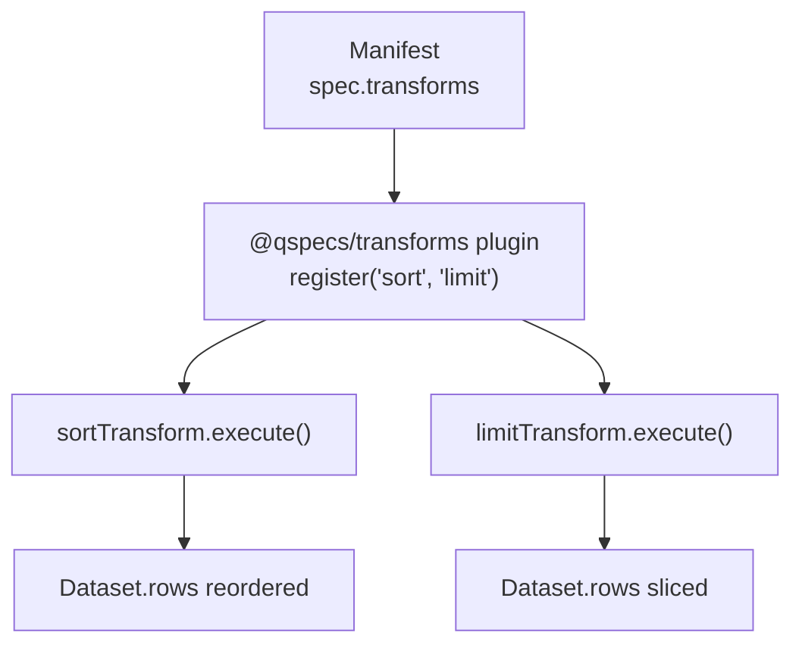
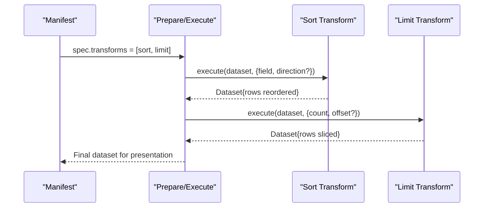
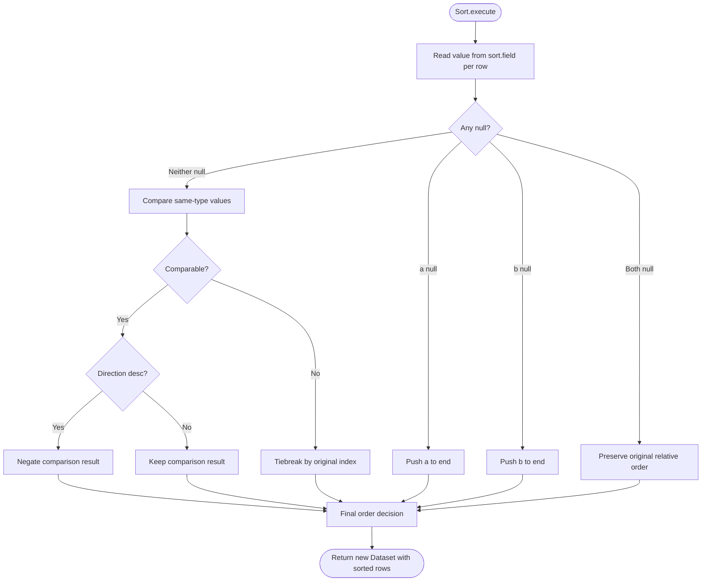
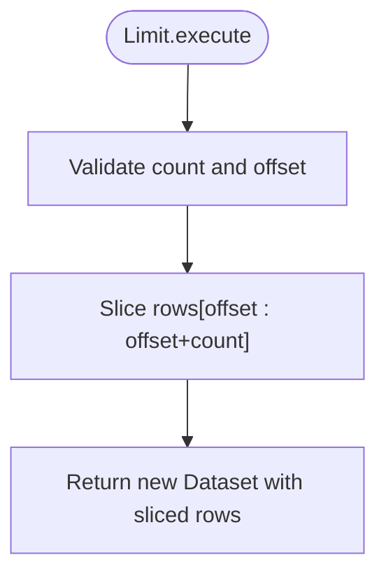
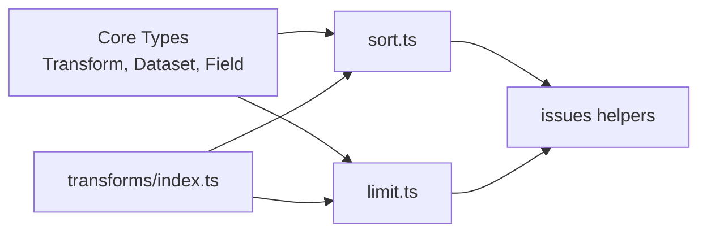

# Sort and Limit Transforms

<cite>
**Referenced Files in This Document**
- [transforms.md](file://docs/transforms.md)
- [sort.ts](file://packages/transforms/src/internal/sort.ts)
- [limit.ts](file://packages/transforms/src/internal/limit.ts)
- [index.ts](file://packages/transforms/src/index.ts)
- [08-transform-sort.qspec.json](file://examples/08-transform-sort.qspec.json)
- [09-transform-limit.qspec.json](file://examples/09-transform-limit.qspec.json)
- [plugin.ts](file://packages/core/src/types/plugin.ts)
- [architecture.md](file://docs/architecture.md)
</cite>

## Table of Contents

1. Introduction
2. Project Structure
3. Core Components
4. Architecture Overview
5. Detailed Component Analysis
6. Dependency Analysis
7. Performance Considerations
8. Troubleshooting Guide
9. Conclusion

## Introduction

This document explains the sort and limit transforms used for result ordering and pagination in QSpec. It covers single-column sorting, ascending and descending order, null handling, stability guarantees, offset-based pagination, and performance considerations for large datasets. It also provides guidance on combining these transforms with UI components that require paginated data.

## Project Structure

The sort and limit transforms are part of the built-in transform plugin. They are implemented as small, focused modules and registered by the transforms plugin so manifests can reference them by type name.

**Diagram sources**

- [index.ts:21-37](file://packages/transforms/src/index.ts#L21-L37)
- [sort.ts:25-49](file://packages/transforms/src/internal/sort.ts#L25-L49)
- [limit.ts:14-18](file://packages/transforms/src/internal/limit.ts#L14-L18)

**Section sources**

- [index.ts:21-37](file://packages/transforms/src/index.ts#L21-L37)

## Core Components

- Sort transform: Reorders rows by a single field with optional direction (ascending or descending). Nulls always sort last regardless of direction. The sort is stable; equal values preserve their original relative order.
- Limit transform: Slices the row set using count and an optional offset. It implements offset-based pagination rather than cursor-based paging.

Key behaviors:

- Sort preserves schema; it only reorders rows.
- Limit preserves schema; it only reduces the number of rows.
- Both transforms validate their spec during prepare and return issues for invalid inputs.

**Section sources**

- [transforms.md:114-155](file://docs/transforms.md#L114-L155)
- [sort.ts:4-7](file://packages/transforms/src/internal/sort.ts#L4-L7)
- [limit.ts:4-8](file://packages/transforms/src/internal/limit.ts#L4-L8)

## Architecture Overview

Transforms execute sequentially in declared order. Each transform receives the output of the previous one and must not mutate its input dataset. The Transform interface defines execute, describe, and validate, which together enable static schema projection and runtime execution.

**Diagram sources**

- [plugin.ts:64-79](file://packages/core/src/types/plugin.ts#L64-L79)
- [sort.ts:25-49](file://packages/transforms/src/internal/sort.ts#L25-L49)
- [limit.ts:14-18](file://packages/transforms/src/internal/limit.ts#L14-L18)

**Section sources**

- [plugin.ts:64-79](file://packages/core/src/types/plugin.ts#L64-L79)
- [architecture.md:248-257](file://docs/architecture.md#L248-L257)

## Detailed Component Analysis

### Sort Transform

Purpose:

- Order rows by a single field.
- Support ascending (default) and descending order.
- Ensure nulls sort last in both directions.
- Maintain stability for equal keys.

Behavior details:

- Comparator supports numbers, strings, and booleans. Mixed types are treated as incomparable and fall back to original index order.
- Stable ordering via indexed decorate-sort-undecorate ensures deterministic results when values compare equal.
- Validation checks that field is a non-empty string and direction is asc or desc. If a projected schema is available, unknown fields are reported with suggestions.

Complex sorting scenarios:

- Single-column numeric sort: order by revenue ascending or descending.
- Single-column string sort: alphabetical ordering.
- Boolean sort: false before true in ascending order.
- Null handling: nulls move to the end regardless of direction; two nulls keep original relative order.

Multi-column sorting:

- Not supported directly by this transform. To achieve multi-column sorting, chain multiple sort transforms in the desired precedence order. For example, first sort by department, then by revenue within each department.

Custom comparators:

- Not supported. The comparator is fixed to mirror expression evaluator rules for consistency across sort and filter. Domain-specific ordering should be modeled upstream (e.g., derive a sortable field) or implemented as a custom transform.

Examples:

- See manifest examples for single-field descending sort and combined sort + limit usage.

**Section sources**

- [sort.ts:4-7](file://packages/transforms/src/internal/sort.ts#L4-L7)
- [sort.ts:9-23](file://packages/transforms/src/internal/sort.ts#L9-L23)
- [sort.ts:25-49](file://packages/transforms/src/internal/sort.ts#L25-L49)
- [sort.ts:51-70](file://packages/transforms/src/internal/sort.ts#L51-L70)
- [transforms.md:114-139](file://docs/transforms.md#L114-L139)
- [08-transform-sort.qspec.json:21-27](file://examples/08-transform-sort.qspec.json#L21-L27)

#### Sort Flowchart

**Diagram sources**

- [sort.ts:25-49](file://packages/transforms/src/internal/sort.ts#L25-L49)

### Limit Transform

Purpose:

- Control the size of the result set.
- Implement offset-based pagination via count and optional offset.

Behavior details:

- Executes as a slice over the incoming rows array: skip offset rows, then take up to count rows.
- Validates that count is a non-negative integer and offset (if provided) is a non-negative integer.
- Preserves schema; does not reorder rows.

Offset-based pagination:

- Use count to define page size and offset to jump into the ordered sequence.
- Example: page 1 with count=10 uses offset=0; page 2 uses offset=10; page n uses offset=(n-1)*count.

Performance notes:

- Since limit operates after all prior transforms, ensure expensive operations (like sort) are placed before limit to minimize work on large intermediate sets.
- Avoid very large offsets; they still scan skipped rows. Prefer server-side pagination where possible.

Examples:

- See manifest examples demonstrating top-N slices and second-page retrieval with offset.

**Section sources**

- [limit.ts:4-8](file://packages/transforms/src/internal/limit.ts#L4-L8)
- [limit.ts:10-18](file://packages/transforms/src/internal/limit.ts#L10-L18)
- [limit.ts:24-33](file://packages/transforms/src/internal/limit.ts#L24-L33)
- [transforms.md:141-155](file://docs/transforms.md#L141-L155)
- [09-transform-limit.qspec.json:21-27](file://examples/09-transform-limit.qspec.json#L21-L27)

#### Limit Flowchart

**Diagram sources**

- [limit.ts:14-18](file://packages/transforms/src/internal/limit.ts#L14-L18)
- [limit.ts:24-33](file://packages/transforms/src/internal/limit.ts#L24-L33)

## Dependency Analysis

- The transforms plugin registers sort and limit under their type names, making them available to manifests.
- Both transforms depend on core types (Dataset, Field, Transform) and use shared validation helpers to report issues consistently.
- Static schema projection relies on describe implementations; sort and limit return fields unchanged, preserving downstream validation.

**Diagram sources**

- [index.ts:21-37](file://packages/transforms/src/index.ts#L21-L37)
- [sort.ts:1-2](file://packages/transforms/src/internal/sort.ts#L1-L2)
- [limit.ts:1-2](file://packages/transforms/src/internal/limit.ts#L1-L2)
- [plugin.ts:64-79](file://packages/core/src/types/plugin.ts#L64-L79)

**Section sources**

- [index.ts:21-37](file://packages/transforms/src/index.ts#L21-L37)
- [plugin.ts:64-79](file://packages/core/src/types/plugin.ts#L64-L79)

## Performance Considerations

- Place sort before limit whenever possible to reduce the cost of sorting large datasets. Sorting is O(n log n); limiting is O(1) slice after transforms have run.
- Be cautious with large offsets. Even though limit is a simple slice, earlier transforms may have already processed many rows. Prefer smaller pages or server-side pagination strategies at the query layer when feasible.
- Null handling in sort adds minimal overhead but ensures consistent behavior; avoid relying on nulls as sentinels for extreme values.
- Stability guarantees come from pairing rows with original indices; this is lightweight and avoids undefined behavior on ties.

[No sources needed since this section provides general guidance]

## Troubleshooting Guide

Common issues and how to address them:

- Unknown field in sort:
  - Cause: The field name does not exist in the current dataset schema.
  - Resolution: Verify the field exists after prior transforms; use correct casing and names. The validator will suggest similar field names when available.
- Invalid direction in sort:
  - Cause: direction is not "asc" or "desc".
  - Resolution: Use one of the allowed values; omit direction to default to ascending.
- Invalid count or offset in limit:
  - Cause: Non-integer or negative values.
  - Resolution: Provide non-negative integers for count and offset.
- Unexpected null placement:
  - Behavior: Nulls always sort last regardless of direction.
  - Resolution: If you need nulls first, derive a boolean flag or separate column to control ordering explicitly.

Validation and error reporting:

- Both transforms implement validate to catch spec errors early during prepare.
- Errors include precise paths and messages, aiding quick fixes.

**Section sources**

- [sort.ts:55-70](file://packages/transforms/src/internal/sort.ts#L55-L70)
- [limit.ts:24-33](file://packages/transforms/src/internal/limit.ts#L24-L33)
- [transforms.md:114-155](file://docs/transforms.md#L114-L155)

## Conclusion

The sort transform provides reliable, stable, single-field ordering with predictable null handling, while the limit transform offers straightforward offset-based pagination. Together, they form a practical foundation for ordering and paging results in QSpec pipelines. For complex needs like multi-column sorting or custom comparators, extend the pipeline by chaining sorts or introducing derived fields. Always place sort before limit to optimize performance, and rely on static validation to catch configuration mistakes early.
