# Transform Composition and Pipelines

<cite>
**Referenced Files in This Document**
- [transforms.md](file://docs/transforms.md)
- [execute.ts](file://packages/core/src/internal/execute.ts)
- [prepare.ts](file://packages/core/src/internal/prepare.ts)
- [index.ts](file://packages/transforms/src/index.ts)
- [filter.ts](file://packages/transforms/src/internal/filter.ts)
- [derive.ts](file://packages/transforms/src/internal/derive.ts)
- [sort.ts](file://packages/transforms/src/internal/sort.ts)
- [limit.ts](file://packages/transforms/src/internal/limit.ts)
- [select.ts](file://packages/transforms/src/internal/select.ts)
- [rename.ts](file://packages/transforms/src/internal/rename.ts)
- [pipeline.test.ts](file://test/pipeline.test.ts)
</cite>

## Table of Contents

1. [Introduction](#introduction)
2. [Project Structure](#project-structure)
3. [Core Components](#core-components)
4. [Architecture Overview](#architecture-overview)
5. [Detailed Component Analysis](#detailed-component-analysis)
6. [Dependency Analysis](#dependency-analysis)
7. [Performance Considerations](#performance-considerations)
8. [Troubleshooting Guide](#troubleshooting-guide)
9. [Conclusion](#conclusion)
10. [Appendices](#appendices)

## Introduction

This document explains how to compose multiple transforms into efficient transformation pipelines in QSpec. It covers execution order, dependency resolution via static schema projection, pipeline optimization strategies, chaining transforms for complex workflows, handling intermediate results, managing transform state, conditional execution patterns, error handling across chains, debugging techniques, performance and memory considerations, and best practices for maintainable transformation code.

## Project Structure

Transforms are implemented as a plugin that registers six built-in transforms: filter, derive, sort, limit, select, rename. The core runtime orchestrates preparation (static validation and schema projection) and execution (query, normalization, transform pipeline). Tests demonstrate end-to-end composition with data sources and presentations.

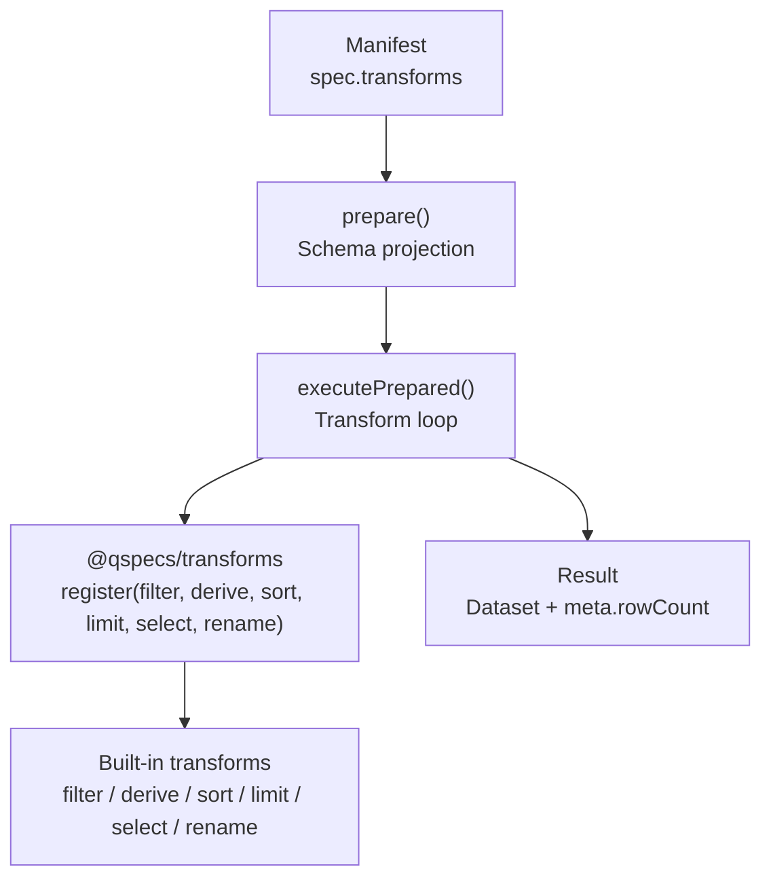

**Diagram sources**

- [prepare.ts:262-284](file://packages/core/src/internal/prepare.ts#L262-L284)
- [execute.ts:187-223](file://packages/core/src/internal/execute.ts#L187-L223)
- [index.ts:21-39](file://packages/transforms/src/index.ts#L21-L39)

**Section sources**

- [transforms.md:24-58](file://docs/transforms.md#L24-L58)
- [index.ts:21-39](file://packages/transforms/src/index.ts#L21-L39)
- [prepare.ts:262-284](file://packages/core/src/internal/prepare.ts#L262-L284)
- [execute.ts:187-223](file://packages/core/src/internal/execute.ts#L187-L223)

## Core Components

- Transform interface contract: execute(dataset, spec, context), optional describe(fields, spec), optional validate(spec, fields).
- Pipeline executor: runs transforms sequentially, reassigning dataset from each return value; enforces immutability by not mutating inputs.
- Schema projection: prepare() folds describe() across the declared transforms to compute projected fields before any query runs; presentation validates against this projection.
- Built-in transforms:
  - filter: row filtering using expression AST; describe returns input fields unchanged.
  - derive: adds a new field per row using an expression; describe appends derived field; always nullable.
  - sort: stable sort with nulls-last; describe returns input fields unchanged.
  - limit: slice rows by offset and count; describe returns input fields unchanged.
  - select: projects fields in specified order; describe mirrors selection.
  - rename: renames fields preserving order; describe applies same mapping; collision detection at both validate and execute time.

Key behaviors:

- Execution order is strict and sequential; declaration order is the only order.
- Every transform returns a fresh Dataset; inputs must survive untouched.
- Expression-based transforms compile expressions once per execution, not per row.
- Missing describe() makes a transform schema-opaque, disabling downstream static field checks.

**Section sources**

- [transforms.md:24-58](file://docs/transforms.md#L24-L58)
- [transforms.md:65-212](file://docs/transforms.md#L65-L212)
- [transforms.md:340-405](file://docs/transforms.md#L340-L405)
- [execute.ts:187-223](file://packages/core/src/internal/execute.ts#L187-L223)
- [prepare.ts:262-284](file://packages/core/src/internal/prepare.ts#L262-L284)

## Architecture Overview

The pipeline has two phases:

- Prepare phase: parse manifest, resolve capabilities, project schema through transforms using describe(), validate presentation against projected fields.
- Execute phase: validate parameters, run query, normalize result, validate dataset, then run transform pipeline sequentially, emitting hooks and timing metrics.

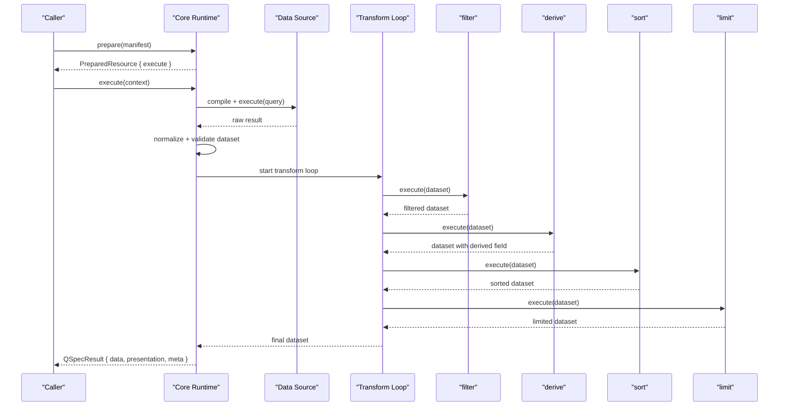

**Diagram sources**

- [prepare.ts:262-284](file://packages/core/src/internal/prepare.ts#L262-L284)
- [execute.ts:187-223](file://packages/core/src/internal/execute.ts#L187-L223)
- [index.ts:21-39](file://packages/transforms/src/index.ts#L21-L39)

**Section sources**

- [transforms.md:24-58](file://docs/transforms.md#L24-L58)
- [execute.ts:187-223](file://packages/core/src/internal/execute.ts#L187-L223)
- [prepare.ts:262-284](file://packages/core/src/internal/prepare.ts#L262-L284)

## Detailed Component Analysis

### Pipeline Execution Order and Immutability

- Transforms run in declared order; each receives the previous transform’s output.
- Inputs are never mutated; outputs are new Dataset objects.
- Hooks emit per-transform start/end with duration and row counts for observability.

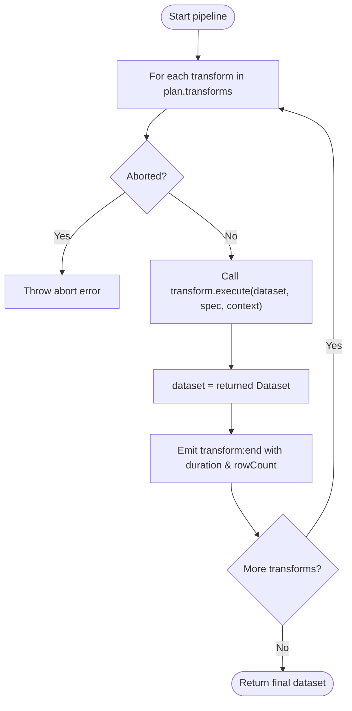

**Diagram sources**

- [execute.ts:187-223](file://packages/core/src/internal/execute.ts#L187-L223)

**Section sources**

- [execute.ts:187-223](file://packages/core/src/internal/execute.ts#L187-L223)

### Static Dependency Resolution via describe()

- prepare() folds describe() across transforms to compute projected fields before any query runs.
- If any transform omits describe(), projection stops and downstream static field checks are disabled.
- Presentation validation uses projected fields to catch misspelled or missing references early.

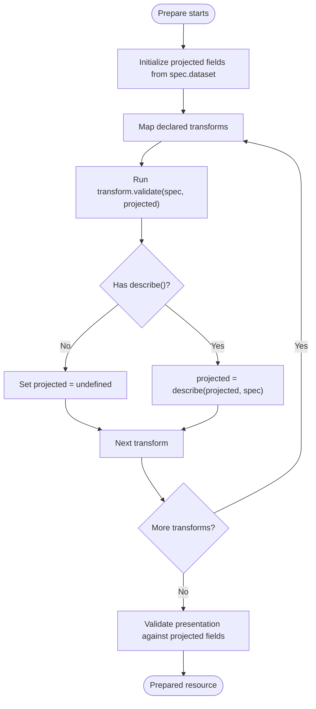

**Diagram sources**

- [prepare.ts:262-284](file://packages/core/src/internal/prepare.ts#L262-L284)

**Section sources**

- [prepare.ts:262-284](file://packages/core/src/internal/prepare.ts#L262-L284)
- [transforms.md:340-405](file://docs/transforms.md#L340-L405)

### Filter Transform

- Compiles where expression once per execution; filters rows based on truthy evaluation.
- describe() returns input fields unchanged.
- validate() compiles expression during prepare() to report precise issues and checks referenced fields exist.

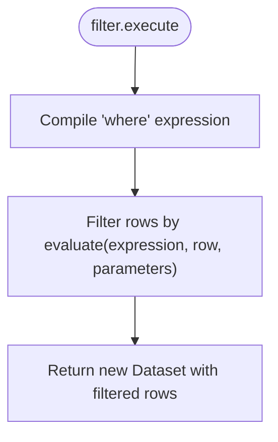

**Diagram sources**

- [filter.ts:26-43](file://packages/transforms/src/internal/filter.ts#L26-L43)

**Section sources**

- [filter.ts:26-83](file://packages/transforms/src/internal/filter.ts#L26-L83)
- [transforms.md:65-79](file://docs/transforms.md#L65-L79)

### Derive Transform

- Adds a new field per row by evaluating an expression; always marks derived field nullable.
- describe() appends derived field so execute() and prepare() agree on schema.
- validate() checks required fields, fieldType validity, expression compilation, and referenced fields.

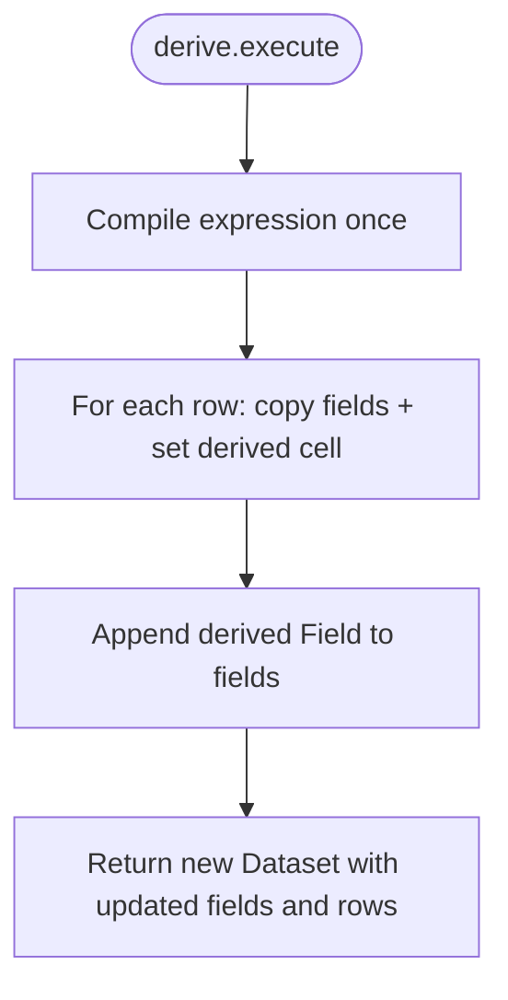

**Diagram sources**

- [derive.ts:46-70](file://packages/transforms/src/internal/derive.ts#L46-L70)

**Section sources**

- [derive.ts:46-146](file://packages/transforms/src/internal/derive.ts#L46-L146)
- [transforms.md:80-102](file://docs/transforms.md#L80-L102)

### Sort Transform

- Stable sort with nulls-last in both directions; uses indexed decorate-sort-undecorate to preserve original order for ties.
- compare() mirrors expression evaluator rules to keep consistency with filter comparisons.

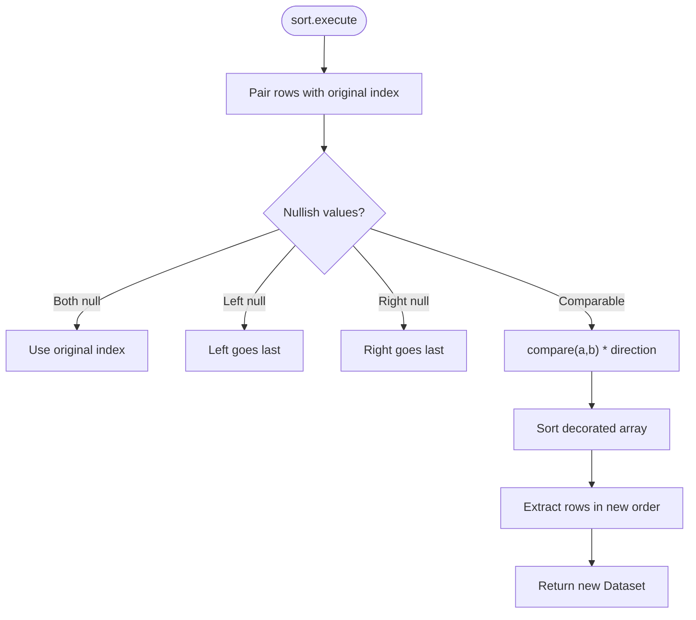

**Diagram sources**

- [sort.ts:25-49](file://packages/transforms/src/internal/sort.ts#L25-L49)

**Section sources**

- [sort.ts:25-72](file://packages/transforms/src/internal/sort.ts#L25-L72)
- [transforms.md:114-140](file://docs/transforms.md#L114-L140)

### Limit Transform

- Returns a slice of rows by offset and count; no cursor semantics beyond offset/count.
- describe() returns input fields unchanged.

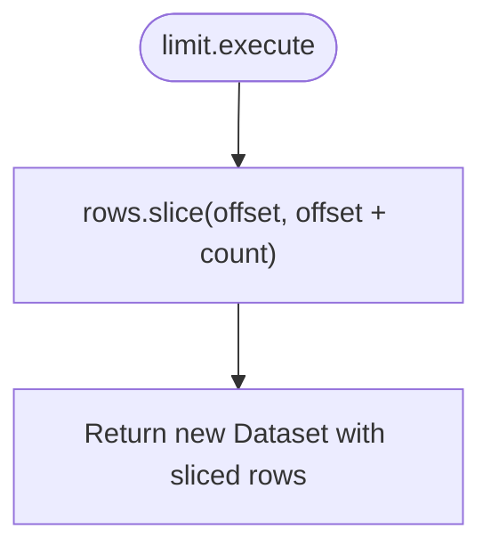

**Diagram sources**

- [limit.ts:14-18](file://packages/transforms/src/internal/limit.ts#L14-L18)

**Section sources**

- [limit.ts:14-35](file://packages/transforms/src/internal/limit.ts#L14-L35)
- [transforms.md:141-156](file://docs/transforms.md#L141-L156)

### Select Transform

- Projects exactly the named fields in the order specified; unknown names are silently dropped at runtime but validated statically when possible.
- describe() mirrors selection logic to ensure static and runtime agree.

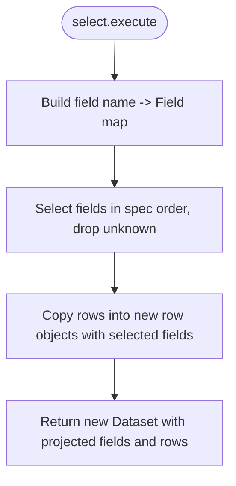

**Diagram sources**

- [select.ts:9-25](file://packages/transforms/src/internal/select.ts#L9-L25)

**Section sources**

- [select.ts:9-67](file://packages/transforms/src/internal/select.ts#L9-L67)
- [transforms.md:157-176](file://docs/transforms.md#L157-L176)

### Rename Transform

- Renames listed fields while preserving original positions; collisions detected at both validate and execute time.
- Uses safe property access to avoid prototype hazards; describe() applies same mapping.

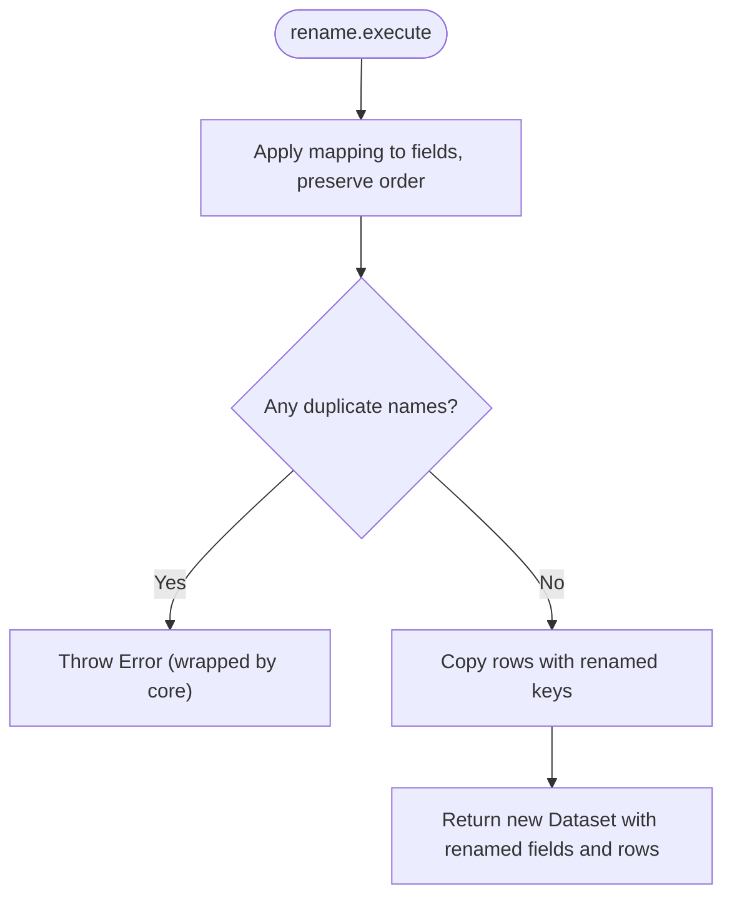

**Diagram sources**

- [rename.ts:58-73](file://packages/transforms/src/internal/rename.ts#L58-L73)

**Section sources**

- [rename.ts:58-130](file://packages/transforms/src/internal/rename.ts#L58-L130)
- [transforms.md:177-212](file://docs/transforms.md#L177-L212)

### Chaining Transforms for Complex Workflows

A typical multi-step workflow:

- filter to remove unwanted rows
- derive to compute new metrics
- sort to order by computed metric
- limit to cap result size
- select to expose only needed fields
- rename to align with presentation expectations

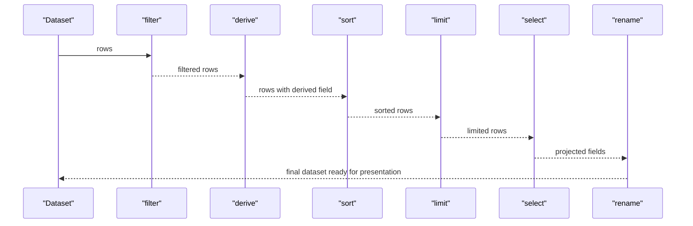

**Diagram sources**

- [pipeline.test.ts:49-66](file://test/pipeline.test.ts#L49-L66)

**Section sources**

- [pipeline.test.ts:49-66](file://test/pipeline.test.ts#L49-L66)
- [transforms.md:24-58](file://docs/transforms.md#L24-L58)

### Conditional Transform Execution

- While the pipeline itself executes every declared transform in order, you can implement conditional behavior inside a transform:
  - Use expressions in filter to conditionally include rows.
  - In custom transforms, check spec flags or context to short-circuit or skip work.
- Always return a valid Dataset even if no changes are made.

[No sources needed since this section provides general guidance]

### Error Handling Across Transform Chains

- Errors thrown by a transform are wrapped in TransformError with path and cause; QSpecError subclasses pass through unwrapped.
- Abort signals are preserved; cancellation is not treated as a transform defect.
- Validation errors from transform.validate() are folded into ManifestValidationError during prepare().

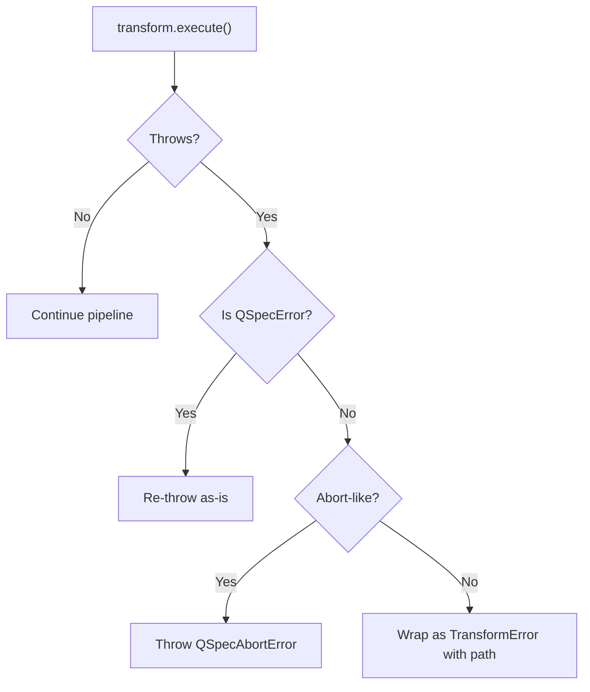

**Diagram sources**

- [execute.ts:187-223](file://packages/core/src/internal/execute.ts#L187-L223)

**Section sources**

- [execute.ts:187-223](file://packages/core/src/internal/execute.ts#L187-L223)
- [prepare.ts:262-284](file://packages/core/src/internal/prepare.ts#L262-L284)

### Debugging Techniques for Complex Pipelines

- Use prepare() to validate manifests and inspect projectedFields before running queries.
- Leverage transform:start and transform:end hooks to measure per-transform duration and row counts.
- Prefer small, composable transforms with clear describe() implementations to enable static validation and easier reasoning.
- When diagnosing failures, inspect TransformError.path to locate the failing transform index.

**Section sources**

- [execute.ts:187-223](file://packages/core/src/internal/execute.ts#L187-L223)
- [pipeline.test.ts:76-103](file://test/pipeline.test.ts#L76-L103)

## Dependency Analysis

- The transforms plugin registers built-ins into the core transforms registry.
- prepare() resolves transform types to implementations and invokes validate/describe.
- execute() iterates over prepared transforms and calls their execute methods.

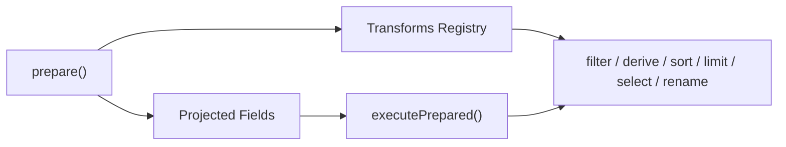

**Diagram sources**

- [index.ts:21-39](file://packages/transforms/src/index.ts#L21-L39)
- [prepare.ts:262-284](file://packages/core/src/internal/prepare.ts#L262-L284)
- [execute.ts:187-223](file://packages/core/src/internal/execute.ts#L187-L223)

**Section sources**

- [index.ts:21-39](file://packages/transforms/src/index.ts#L21-L39)
- [prepare.ts:262-284](file://packages/core/src/internal/prepare.ts#L262-L284)
- [execute.ts:187-223](file://packages/core/src/internal/execute.ts#L187-L223)

## Performance Considerations

- Expression compilation: filter and derive compile expressions once per execution, not per row.
- Sorting: stable sort with nulls-last; uses indexed decorate-sort-undecorate to guarantee deterministic ordering.
- Memory management:
  - All transforms return new Dataset objects; do not mutate inputs to avoid shared-state bugs.
  - Use select early to reduce payload size for downstream transforms and presentation.
  - Apply limit after sort/filter to minimize work on large datasets.
- Limits:
  - maxExpressionDepth enforced during prepare() and again at execution for expression-based transforms.
  - maxTransforms limits pipeline length; exceeding fails at prepare().

[No sources needed since this section provides general guidance]

## Troubleshooting Guide

Common issues and resolutions:

- Unknown transform type: ensure the transforms plugin is registered and the type matches one of the built-ins.
- Missing describe(): if a custom transform omits describe(), downstream static validation is disabled; add describe() to restore schema opacity.
- Field collisions in rename: validate catches many collisions; execute also asserts distinctness to prevent silent column loss.
- Expression depth exceeded: configure maxExpressionDepth appropriately; errors are reported during prepare() for filter and derive.
- Presentation field misspellings: caught at prepare() via projected fields; fix field names to match post-transform schema.

**Section sources**

- [prepare.ts:262-284](file://packages/core/src/internal/prepare.ts#L262-L284)
- [rename.ts:58-130](file://packages/transforms/src/internal/rename.ts#L58-L130)
- [filter.ts:26-83](file://packages/transforms/src/internal/filter.ts#L26-L83)
- [derive.ts:46-146](file://packages/transforms/src/internal/derive.ts#L46-L146)
- [pipeline.test.ts:122-149](file://test/pipeline.test.ts#L122-L149)

## Conclusion

QSpec’s transform pipeline provides a predictable, immutable, and statically verifiable way to compose data transformations. By leveraging describe() for schema projection, validating early with prepare(), and composing small, focused transforms, you can build robust, maintainable pipelines. Use hooks and error wrapping to debug and monitor performance, and apply limits and selective projections to optimize memory and throughput.

## Appendices

### Best Practices Checklist

- Always implement describe() for custom transforms to preserve static validation.
- Keep transforms pure and return new Dataset instances.
- Place expensive operations (sort, derive) after filtering and limiting where possible.
- Use select to reduce field sets early.
- Configure maxExpressionDepth and maxTransforms to fit your workload.
- Inspect projectedFields from prepare() to verify pipeline schema.
- Use hooks to track transform durations and row counts.

[No sources needed since this section provides general guidance]
