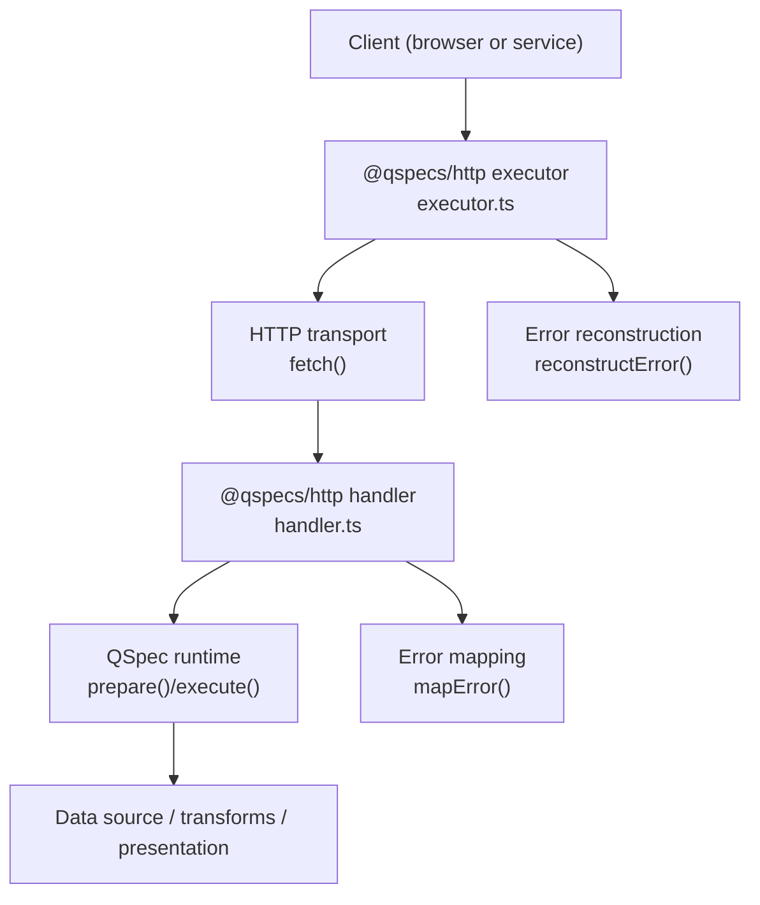
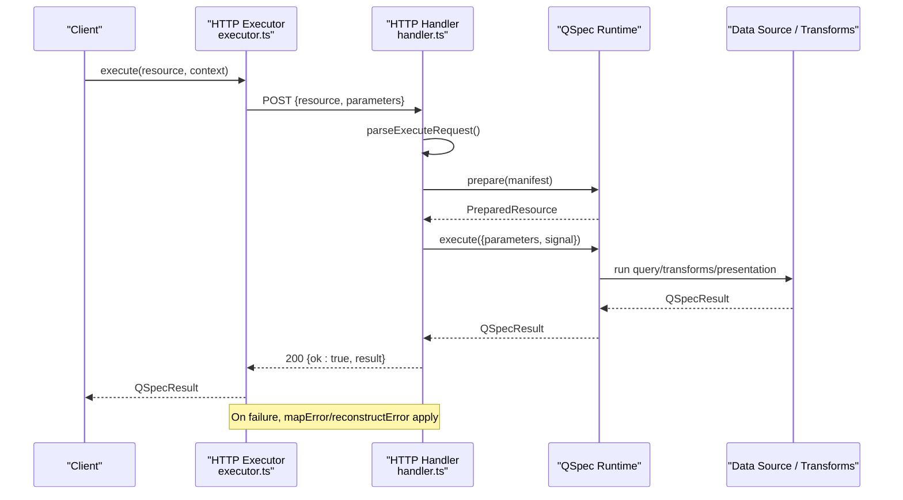
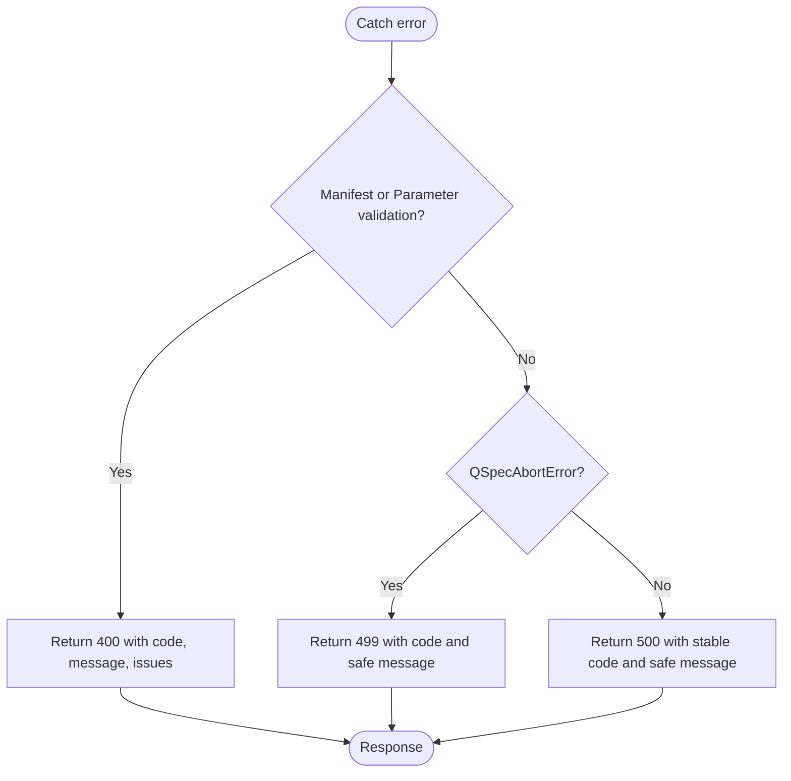
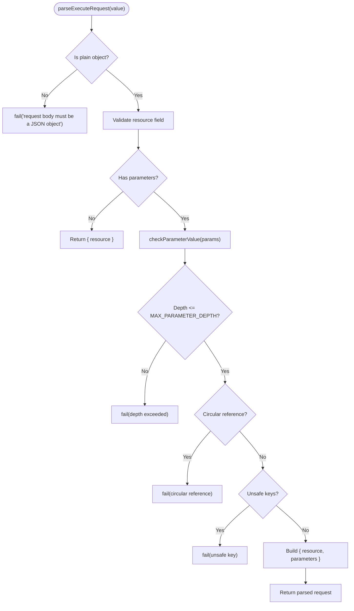
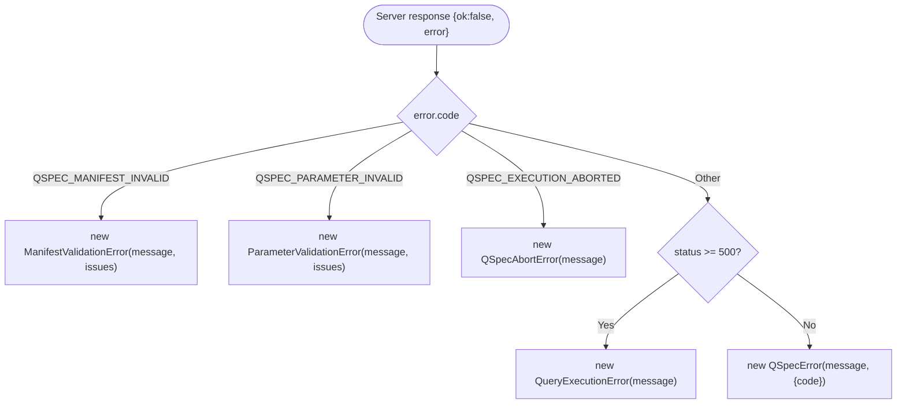
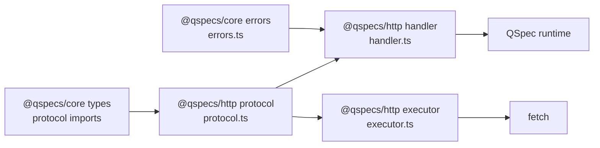

# Error Handling and Debugging

<cite>
**Referenced Files in This Document**
- [handler.ts](file://packages/http/src/internal/handler.ts)
- [protocol.ts](file://packages/http/src/internal/protocol.ts)
- [executor.ts](file://packages/http/src/internal/executor.ts)
- [index.ts](file://packages/http/src/index.ts)
- [errors.ts](file://packages/core/src/errors.ts)
</cite>

## Table of Contents

1. [Introduction](#introduction)
2. [Project Structure](#project-structure)
3. [Core Components](#core-components)
4. [Architecture Overview](#architecture-overview)
5. [Detailed Component Analysis](#detailed-component-analysis)
6. [Dependency Analysis](#dependency-analysis)
7. [Performance Considerations](#performance-considerations)
8. [Troubleshooting Guide](#troubleshooting-guide)
9. [Conclusion](#conclusion)
10. [Appendices](#appendices)

## Introduction

This document explains error handling and debugging for QSpec HTTP services built with the @qspecs/http package. It covers how errors are categorized, how status codes are used, what error response formats look like, and how clients reconstruct errors to match local execution behavior. It also provides guidance on logging strategies, monitoring approaches, production debugging tools, performance profiling, and recovery patterns such as graceful degradation and cancellation.

## Project Structure

The HTTP boundary is implemented across three internal modules:

- Wire protocol and request validation: protocol.ts
- Server handler that maps runtime errors to HTTP responses: handler.ts
- Client executor that sends requests and reconstructs server errors into core error types: executor.ts

The public entry point re-exports the wire types, the server handler factory, and the client executor factory.

**Diagram sources**

- [handler.ts:131-238](file://packages/http/src/internal/handler.ts#L131-L238)
- [executor.ts:225-264](file://packages/http/src/internal/executor.ts#L225-L264)
- [protocol.ts:272-317](file://packages/http/src/internal/protocol.ts#L272-L317)

**Section sources**

- [index.ts:1-37](file://packages/http/src/index.ts#L1-L37)

## Core Components

- Request parsing and validation: The server validates incoming JSON bodies and enforces strict constraints on resource names and parameter shapes before any runtime access.
- Error categorization and status codes: Validation failures return 400; aborted requests return 499; all other runtime errors return 500 with a safe, generic message.
- Response shape: Success returns ok:true with result; failure returns ok:false with an error object containing code, message, and optional issues.
- Client-side error reconstruction: The client maps server error codes and status codes back to core error classes so callers can use consistent instanceof checks.

Key responsibilities by file:

- protocol.ts: Defines wire types, parses and hardens execute requests, sanitizes messages, and bounds input sizes and depths.
- handler.ts: Implements createQSpecHandler, orchestrates prepare/execute, and maps errors to HTTP responses.
- executor.ts: Implements createHttpExecutor, serializes requests, handles fetch lifecycle, parses responses, and reconstructs errors.
- errors.ts: Defines core error classes and their stable codes used across the stack.

**Section sources**

- [protocol.ts:272-317](file://packages/http/src/internal/protocol.ts#L272-L317)
- [handler.ts:74-109](file://packages/http/src/internal/handler.ts#L74-L109)
- [executor.ts:112-197](file://packages/http/src/internal/executor.ts#L112-L197)
- [errors.ts:44-86](file://packages/core/src/errors.ts#L44-L86)

## Architecture Overview

End-to-end flow for a successful request and for error paths:

**Diagram sources**

- [handler.ts:169-236](file://packages/http/src/internal/handler.ts#L169-L236)
- [executor.ts:225-264](file://packages/http/src/internal/executor.ts#L225-L264)
- [protocol.ts:272-317](file://packages/http/src/internal/protocol.ts#L272-L317)

## Detailed Component Analysis

### Server Error Mapping and Status Codes

The handler centralizes error mapping to ensure no raw driver or user-supplied messages leak into responses. It distinguishes between:

- 400 Bad Request: manifest or parameter validation failures, including structured issues.
- 499 Client Abort: when the request is aborted (client disconnect or explicit abort).
- 500 Internal Error: all other runtime errors, using only the stable error code from QSpecError and a safe, composed message.

**Diagram sources**

- [handler.ts:74-109](file://packages/http/src/internal/handler.ts#L74-L109)

**Section sources**

- [handler.ts:74-109](file://packages/http/src/internal/handler.ts#L74-L109)

### Request Parsing and Input Hardening

The protocol parser enforces:

- Resource name must be a non-empty string within a maximum length and not an unsafe key.
- Parameters must be a plain object with values restricted to JSON-safe primitives, arrays, and objects.
- Deep recursion limits protect against stack overflow via maximum nesting depth.
- Circular references in parameters are rejected.
- Unsafe keys at any depth are blocked.
- Messages embedded in errors sanitize control characters and truncate long segments.

**Diagram sources**

- [protocol.ts:272-317](file://packages/http/src/internal/protocol.ts#L272-L317)
- [protocol.ts:176-233](file://packages/http/src/internal/protocol.ts#L176-L233)

**Section sources**

- [protocol.ts:272-317](file://packages/http/src/internal/protocol.ts#L272-L317)
- [protocol.ts:176-233](file://packages/http/src/internal/protocol.ts#L176-L233)

### Client Error Reconstruction

The client maps server responses back to core error classes:

- 400 with specific codes becomes ManifestValidationError or ParameterValidationError, preserving issues when present.
- 499 becomes QSpecAbortError.
- Any 5xx becomes QueryExecutionError, carrying the server’s message.
- Other 4xx become base QSpecError with the server’s code and message.

**Diagram sources**

- [executor.ts:153-197](file://packages/http/src/internal/executor.ts#L153-L197)

**Section sources**

- [executor.ts:112-197](file://packages/http/src/internal/executor.ts#L112-L197)

### Error Response Format

Wire format for errors:

- ok: false
- error:
  - code: stable string identifying the error category
  - message: safe, composed message (never raw driver output)
  - issues: optional array of QSpecIssue for validation errors

Success format:

- ok: true
- result: QSpecResult

These shapes are enforced on both sides: the server constructs them, and the client validates them before use.

**Section sources**

- [protocol.ts:26-42](file://packages/http/src/internal/protocol.ts#L26-L42)
- [executor.ts:112-151](file://packages/http/src/internal/executor.ts#L112-L151)

### Error Categories and Status Codes Summary

- 400 Bad Request: malformed request body, invalid wire shape, unknown or unsafe resource name, invalid parameters. Includes structured issues for manifest/parameter validation.
- 404 Not Found: requested resource name not registered.
- 405 Method Not Allowed: non-POST method.
- 499 Client Abort: request aborted by client or upstream.
- 500 Internal Error: any other runtime error (query, transform, dataset, presentation, plugin registration, etc.). Message is sanitized; code is trusted only if it comes from a QSpecError.

**Section sources**

- [handler.ts:169-236](file://packages/http/src/internal/handler.ts#L169-L236)
- [errors.ts:44-86](file://packages/core/src/errors.ts#L44-L86)

## Dependency Analysis

The HTTP layer depends on core error types and utilities but remains framework-agnostic. It exposes a small surface area:

- Server: createQSpecHandler(runtime, manifests)
- Client: createHttpExecutor({ url, headers?, fetch? })
- Wire types: parseExecuteRequest and response/error shapes

**Diagram sources**

- [handler.ts:1-11](file://packages/http/src/internal/handler.ts#L1-L11)
- [executor.ts:1-11](file://packages/http/src/internal/executor.ts#L1-L11)
- [protocol.ts:1-9](file://packages/http/src/internal/protocol.ts#L1-L9)
- [errors.ts:44-86](file://packages/core/src/errors.ts#L44-L86)

**Section sources**

- [index.ts:1-37](file://packages/http/src/index.ts#L1-L37)

## Performance Considerations

- Prepare caching: The handler caches prepared resources per resource name, including cached rejections, to avoid repeated static validation overhead.
- Input size and depth limits: Maximum resource length and parameter nesting depth prevent excessive memory and stack usage.
- Message bounding: Error messages are truncated to a fixed maximum length to avoid unbounded payloads.
- Safe serialization: Responses are constructed from known-safe fields; messages are sanitized to avoid injecting control characters into logs or UI.

[No sources needed since this section provides general guidance]

## Troubleshooting Guide

### Common Errors and How to Diagnose Them

- 400 Bad Request:
  - Cause: malformed JSON, invalid wire shape, unsafe resource name, invalid parameters.
  - Diagnosis: check request body structure, resource name length and safety, and parameter types and nesting.
  - Resolution: fix request payload; ensure parameters conform to declared manifest types.

- 404 Not Found:
  - Cause: resource name not registered in the handler’s manifest registry.
  - Diagnosis: verify the resource name matches one provided to createQSpecHandler.
  - Resolution: register the correct manifest under the requested name.

- 405 Method Not Allowed:
  - Cause: non-POST request.
  - Diagnosis: ensure the endpoint is called with POST.
  - Resolution: update client to use POST.

- 499 Client Abort:
  - Cause: client disconnected or explicitly aborted the request.
  - Diagnosis: inspect client-side abort signals and network conditions.
  - Resolution: handle QSpecAbortError gracefully; retry only if appropriate.

- 500 Internal Error:
  - Cause: runtime error during prepare or execute (e.g., query compilation/execution, transform, dataset validation, presentation).
  - Diagnosis: server-side logs should capture the underlying cause; do not rely on the returned message for sensitive details.
  - Resolution: fix configuration or data pipeline; add guards around external dependencies.

### Logging Strategy

- Log request metadata without secrets: resource name, parameter keys (not values), timing, and outcome.
- Do not log raw error messages from drivers or user inputs; they may contain sensitive data.
- For 500 errors, record the stable error code and a correlation ID to correlate with server-side logs.
- Sanitize any path segments included in logs to remove control characters.

### Monitoring and Alerting

- Track error rates by status code and error code.
- Monitor 499 rate spikes to detect client-side instability or network issues.
- Alert on elevated 500 rates, especially for specific error codes indicating systemic failures.
- Measure p50/p95 latency for execute calls to detect regressions.

### Custom Error Handlers

- Server: wrap createQSpecHandler with your framework’s middleware to add authentication, rate limiting, and structured logging. Always preserve the handler’s error mapping to avoid leaking sensitive information.
- Client: wrap createHttpExecutor with a custom fetch implementation to inject headers, retries, and observability. Handle QSpecAbortError distinctly from transient network errors.

### Graceful Degradation and Recovery

- Use request signals to cancel long-running queries when clients disconnect or timeouts occur.
- Implement retries with exponential backoff for transient network errors, but not for 4xx client errors.
- Provide fallback responses or cached results for non-critical reads when the service is degraded.
- Surface structured issues to clients for 400 validation errors so they can prompt users to correct inputs.

**Section sources**

- [handler.ts:169-236](file://packages/http/src/internal/handler.ts#L169-L236)
- [executor.ts:225-264](file://packages/http/src/internal/executor.ts#L225-L264)
- [protocol.ts:272-317](file://packages/http/src/internal/protocol.ts#L272-L317)

## Conclusion

QSpec’s HTTP layer provides a secure, predictable boundary between clients and the QSpec runtime. Errors are categorized with stable codes, mapped to appropriate HTTP status codes, and rendered with safe messages. Clients reconstruct these errors into core types for consistent handling. By combining input hardening, prepare caching, and careful error mapping, the system supports robust debugging, monitoring, and graceful degradation in production environments.

## Appendices

### API Reference: Error Codes and Statuses

- 400: QSPEC_BAD_REQUEST, QSPEC_MANIFEST_INVALID, QSPEC_PARAMETER_INVALID
- 404: QSPEC_RESOURCE_NOT_FOUND
- 405: QSPEC_METHOD_NOT_ALLOWED
- 499: QSPEC_EXECUTION_ABORTED
- 500: QSPEC_INTERNAL_ERROR or another QSpecError code (message is sanitized)

**Section sources**

- [handler.ts:169-236](file://packages/http/src/internal/handler.ts#L169-L236)
- [errors.ts:44-86](file://packages/core/src/errors.ts#L44-L86)
