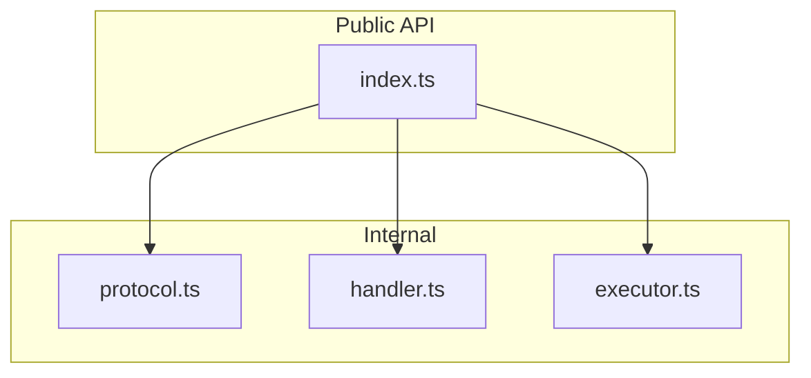
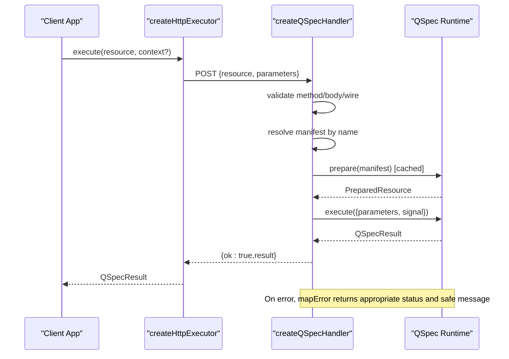
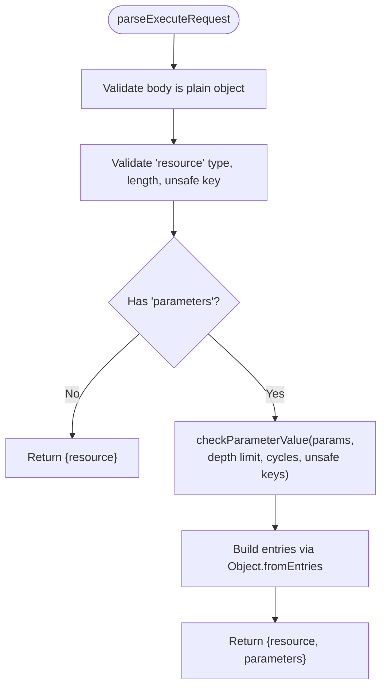
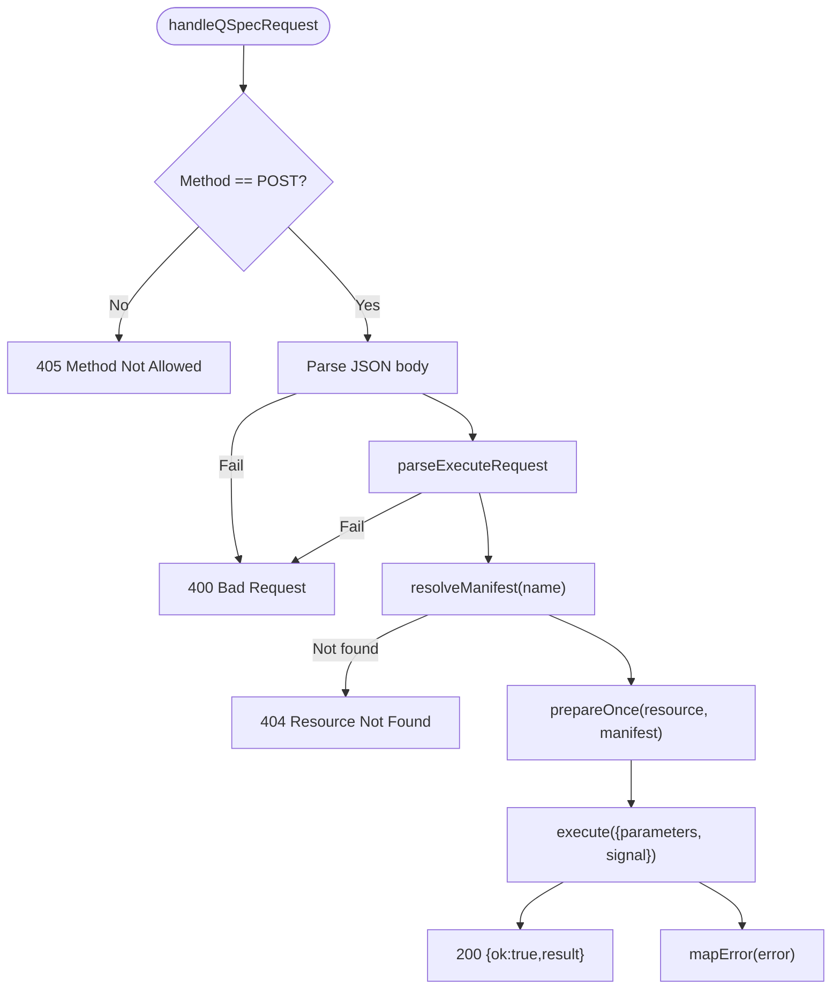
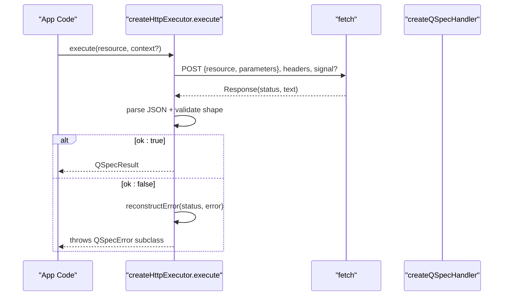
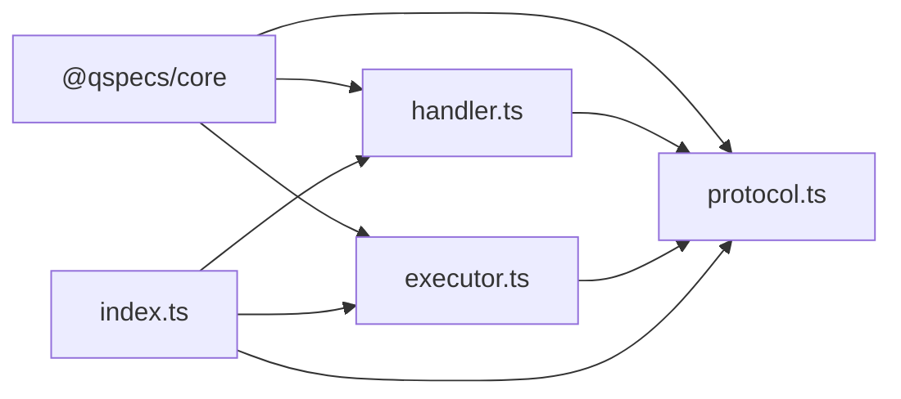

# HTTP Handler (@qspecs/http)

<cite>
**Referenced Files in This Document**
- [index.ts](file://packages/http/src/index.ts)
- [protocol.ts](file://packages/http/src/internal/protocol.ts)
- [handler.ts](file://packages/http/src/internal/handler.ts)
- [executor.ts](file://packages/http/src/internal/executor.ts)
- [package.json](file://packages/http/package.json)
- [tsconfig.build.json](file://packages/http/tsconfig.build.json)
- [index.test.ts](file://packages/http/src/index.test.ts)
- [handler.test.ts](file://packages/http/src/internal/handler.test.ts)
- [executor.test.ts](file://packages/http/src/internal/executor.test.ts)
</cite>

## Table of Contents

1. [Introduction](#introduction)
2. [Project Structure](#project-structure)
3. [Core Components](#core-components)
4. [Architecture Overview](#architecture-overview)
5. [Detailed Component Analysis](#detailed-component-analysis)
6. [Dependency Analysis](#dependency-analysis)
7. [Performance Considerations](#performance-considerations)
8. [Troubleshooting Guide](#troubleshooting-guide)
9. [Conclusion](#conclusion)
10. [Appendices](#appendices)

## Introduction

The @qspecs/http package provides the wire protocol and runtime integration for executing QSpec resources over HTTP. It exposes:

- A server-side handler factory that validates requests, resolves manifests, prepares resources once per resource name, executes with cancellation support, and maps errors to standardized responses.
- A client-side executor that POSTs a minimal request body, validates the response shape, and reconstructs core error types so clients can handle local and remote execution uniformly.
- A hardened wire protocol that enforces safe parameter shapes, depth limits, cycle detection, and message sanitization to protect both server and client from malformed or malicious input.

This package intentionally keeps transport concerns separate from business logic. Authentication, rate limiting, CORS, logging, and monitoring are implemented by the host application around the handler and executor.

**Section sources**

- [index.ts:1-37](file://packages/http/src/index.ts#L1-L37)
- [package.json:1-44](file://packages/http/package.json#L1-L44)

## Project Structure

The package is organized into a small, focused surface:

- Public exports re-export the protocol types, the handler factory, and the executor factory.
- Internal modules implement:
  - Wire protocol parsing and validation.
  - Server handler lifecycle (method check, JSON parse, wire parse, manifest resolution, prepare cache, execute, error mapping).
  - Client executor (request building, fetch, response parsing, error reconstruction).

**Diagram sources**

- [index.ts:25-36](file://packages/http/src/index.ts#L25-L36)
- [protocol.ts:20-42](file://packages/http/src/internal/protocol.ts#L20-L42)
- [handler.ts:131-239](file://packages/http/src/internal/handler.ts#L131-L239)
- [executor.ts:225-265](file://packages/http/src/internal/executor.ts#L225-L265)

**Section sources**

- [index.ts:25-36](file://packages/http/src/index.ts#L25-L36)
- [tsconfig.build.json:1-8](file://packages/http/tsconfig.build.json#L1-L8)

## Core Components

- Wire protocol:
  - Request: resource name plus optional parameters. No executable content travels over the wire; the server resolves the resource against its own registry.
  - Response: discriminated union with ok/result or ok/error. Errors carry a stable code, message, and optional issues.
- Server handler:
  - Enforces POST-only method.
  - Parses JSON and validates via the hardened parser.
  - Resolves manifests safely using Object.hasOwn to prevent prototype pollution.
  - Caches prepared resources per resource name across requests.
  - Executes with request signal propagation for cancellation.
  - Maps errors to specific HTTP status codes and safe messages.
- Client executor:
  - Builds a minimal JSON body and sets default headers.
  - Validates response shape before trusting it.
  - Reconstructs core error classes based on status and error code.
  - Forwards AbortSignal to cancel in-flight requests.

**Section sources**

- [protocol.ts:20-42](file://packages/http/src/internal/protocol.ts#L20-L42)
- [handler.ts:131-239](file://packages/http/src/internal/handler.ts#L131-L239)
- [executor.ts:225-265](file://packages/http/src/internal/executor.ts#L225-L265)

## Architecture Overview

End-to-end flow from client to server and back:

**Diagram sources**

- [executor.ts:225-265](file://packages/http/src/internal/executor.ts#L225-L265)
- [handler.ts:131-239](file://packages/http/src/internal/handler.ts#L131-L239)
- [protocol.ts:20-42](file://packages/http/src/internal/protocol.ts#L20-L42)

## Detailed Component Analysis

### Wire Protocol

- Request shape:
  - resource: required non-empty string, bounded length, unsafe keys rejected.
  - parameters: optional object; values validated as JSON-compatible primitives, arrays, and plain objects with no cycles and no unsafe keys at any depth. Depth limit enforced.
- Response shape:
  - Success: ok:true with result.
  - Failure: ok:false with error containing code, message, and optional issues.

Security and robustness features:

- Parameter recursion depth cap prevents stack exhaustion.
- Cycle detection uses two WeakSets for linear-time validation of DAGs.
- Message sanitization strips dangerous control characters and truncates segments/messages to bounded lengths.
- Resource names are validated and never used for direct property access without guards.

**Diagram sources**

- [protocol.ts:272-317](file://packages/http/src/internal/protocol.ts#L272-L317)
- [protocol.ts:176-233](file://packages/http/src/internal/protocol.ts#L176-L233)

**Section sources**

- [protocol.ts:20-42](file://packages/http/src/internal/protocol.ts#L20-L42)
- [protocol.ts:131-233](file://packages/http/src/internal/protocol.ts#L131-L233)
- [protocol.ts:272-317](file://packages/http/src/internal/protocol.ts#L272-L317)

### Server Handler

Responsibilities:

- Method enforcement: only POST accepted; otherwise 405 with Allow header.
- Transport-level JSON parse: malformed bodies return 400 with a stable code.
- Wire-level validation: delegates to parseExecuteRequest; failures return 400.
- Manifest resolution: uses Object.hasOwn to avoid prototype pollution; unknown resources return 404 without disclosing registered names.
- Prepare caching: prepares once per resource name; even failures are cached to avoid repeated work.
- Execution: passes parameters and request.signal to propagate client aborts.
- Error mapping:
  - Manifest or parameter validation errors -> 400 with issues.
  - Abort signals -> 499 with a clear message.
  - Other QSpec errors -> 500 with a safe message; raw driver messages are not exposed.

**Diagram sources**

- [handler.ts:131-239](file://packages/http/src/internal/handler.ts#L131-L239)

**Section sources**

- [handler.ts:13-33](file://packages/http/src/internal/handler.ts#L13-L33)
- [handler.ts:67-72](file://packages/http/src/internal/handler.ts#L67-L72)
- [handler.ts:97-109](file://packages/http/src/internal/handler.ts#L97-L109)
- [handler.ts:131-239](file://packages/http/src/internal/handler.ts#L131-L239)

### Client Executor

Responsibilities:

- Build request body: resource plus optional parameters from ExecutionContext.
- Set headers: default content-type; allow caller-supplied headers to override case-insensitively.
- Send request: forwards AbortSignal when provided.
- Parse response: validates JSON and protocol shape; wraps parse failures as QueryExecutionError.
- Error reconstruction:
  - 400 with specific codes -> corresponding core error classes with issues preserved.
  - 499 -> QSpecAbortError.
  - 5xx -> QueryExecutionError with safe message.
  - Other 4xx -> base QSpecError with server code/message.

**Diagram sources**

- [executor.ts:225-265](file://packages/http/src/internal/executor.ts#L225-L265)
- [executor.ts:183-197](file://packages/http/src/internal/executor.ts#L183-L197)

**Section sources**

- [executor.ts:20-38](file://packages/http/src/internal/executor.ts#L20-L38)
- [executor.ts:64-89](file://packages/http/src/internal/executor.ts#L64-L89)
- [executor.ts:102-151](file://packages/http/src/internal/executor.ts#L102-L151)
- [executor.ts:183-197](file://packages/http/src/internal/executor.ts#L183-L197)
- [executor.ts:225-265](file://packages/http/src/internal/executor.ts#L225-L265)

### Integration Examples

#### Express.js Integration

- Mount the handler returned by createQSpecHandler on a POST route.
- Provide your QSpec runtime and an explicit registry of manifests keyed by resource name.
- Add authentication, rate limiting, CORS, and logging around the route as needed.

Reference implementation patterns:

- Route registration and mounting: see handler usage in tests.
- Request/response handling: see handler lifecycle and error mapping.

**Section sources**

- [handler.test.ts:181-219](file://packages/http/src/internal/handler.test.ts#L181-L219)
- [handler.ts:131-239](file://packages/http/src/internal/handler.ts#L131-L239)

#### Fastify Integration

- Register the handler as a POST route.
- Use Fastify’s pre-validation hooks for authentication and rate limiting if desired.
- The handler itself remains framework-agnostic, accepting a standard Request and returning a Response.

**Section sources**

- [handler.ts:131-239](file://packages/http/src/internal/handler.ts#L131-L239)

### Parameter Validation

- Resource name validation:
  - Must be a non-empty string within a maximum length.
  - Unsafe keys are rejected to prevent prototype corruption.
- Parameters validation:
  - Must be a plain object.
  - Values must be valid JSON values at any depth.
  - Depth limit enforced to prevent stack overflow.
  - Circular references detected and rejected.
  - Unsafe keys at any depth are rejected.
- Messages are sanitized and truncated to bounded lengths to avoid log injection or excessive output.

**Section sources**

- [protocol.ts:131-233](file://packages/http/src/internal/protocol.ts#L131-L233)
- [protocol.ts:272-317](file://packages/http/src/internal/protocol.ts#L272-L317)

### Authentication Integration

- The handler does not perform authentication. Wrap the handler with your auth middleware to inspect and authorize requests before invoking the handler.
- Pass authenticated context downstream via your framework’s request context or attach tokens to executor headers.

**Section sources**

- [handler.ts:13-33](file://packages/http/src/internal/handler.ts#L13-L33)
- [executor.ts:20-33](file://packages/http/src/internal/executor.ts#L20-L33)

### CORS Configuration

- The handler returns standard JSON responses. Configure CORS at the HTTP framework level (e.g., Express cors middleware or Fastify cors plugin) to set allowed origins, methods, and headers.

[No sources needed since this section provides general guidance]

### Error Handling

- Client-side:
  - Network or stream read failures become QueryExecutionError unless aborted, in which case QSpecAbortError is thrown.
  - Non-JSON or malformed responses raise descriptive QueryExecutionError.
  - Server error responses are reconstructed to core error classes with stable codes and messages.
- Server-side:
  - Malformed request bodies and invalid wire payloads return 400 with a stable code.
  - Unknown resources return 404 without revealing registered names.
  - Validation errors return 400 with issues attached.
  - Aborted requests return 499 with a clear message.
  - Internal/server errors return 500 with a safe message; sensitive details (e.g., connection strings) are never included.

**Section sources**

- [handler.ts:97-109](file://packages/http/src/internal/handler.ts#L97-L109)
- [handler.ts:169-239](file://packages/http/src/internal/handler.ts#L169-L239)
- [executor.ts:102-151](file://packages/http/src/internal/executor.ts#L102-L151)
- [executor.ts:183-197](file://packages/http/src/internal/executor.ts#L183-L197)
- [executor.ts:225-265](file://packages/http/src/internal/executor.ts#L225-L265)

### Logging and Monitoring

- The handler does not include built-in logging. Log requests, responses, durations, and errors in your framework layer.
- Monitor metrics such as:
  - Request rate and latency.
  - Error rates by status code and error code.
  - Resource preparation cache hit ratio.
  - Abort frequency and duration.

[No sources needed since this section provides general guidance]

### Rate Limiting and Caching Strategies

- Rate limiting: apply at the HTTP framework level before invoking the handler.
- Caching strategies:
  - The handler caches PreparedResource per resource name across requests, including cached rejections for deterministic configuration errors.
  - Application-level caching (e.g., Redis) can be layered above the handler for read-heavy datasets, ensuring cache invalidation aligns with data updates.

**Section sources**

- [handler.ts:136-167](file://packages/http/src/internal/handler.ts#L136-L167)

### Performance Optimization for High Throughput

- Leverage prepare caching to avoid repeated expensive preparation.
- Keep request bodies small and well-formed to minimize parsing overhead.
- Use compression at the proxy/load balancer layer.
- Tune concurrency and timeouts at the HTTP framework and reverse proxy levels.
- Avoid sending large datasets over the wire when possible; consider pagination or streaming where supported by your application design.

[No sources needed since this section provides general guidance]

### Deployment and Scaling Patterns

- Stateless handlers scale horizontally behind a load balancer.
- Ensure consistent runtime and manifest configuration across instances.
- Use process managers or container orchestration to restart unhealthy instances.
- Centralize logs and metrics collection for observability.
- Protect endpoints with TLS, authentication, and rate limiting at the edge.

[No sources needed since this section provides general guidance]

## Dependency Analysis

The package depends on @qspecs/core for runtime, error types, and utilities. It exposes a minimal public API that re-exports internal modules.

**Diagram sources**

- [index.ts:25-36](file://packages/http/src/index.ts#L25-L36)
- [handler.ts:1-11](file://packages/http/src/internal/handler.ts#L1-L11)
- [protocol.ts:1-9](file://packages/http/src/internal/protocol.ts#L1-L9)
- [executor.ts:1-11](file://packages/http/src/internal/executor.ts#L1-L11)

**Section sources**

- [package.json:33-38](file://packages/http/package.json#L33-L38)
- [index.ts:25-36](file://packages/http/src/index.ts#L25-L36)

## Performance Considerations

- Prepare caching reduces repeated validation and compilation costs per resource.
- Input validation bounds prevent denial-of-service via deep or cyclic parameters.
- Error messages are sanitized and truncated to avoid excessive payload sizes.
- Cancellation via AbortSignal ensures resources are released promptly when clients disconnect.

**Section sources**

- [handler.ts:136-167](file://packages/http/src/internal/handler.ts#L136-L167)
- [protocol.ts:44-68](file://packages/http/src/internal/protocol.ts#L44-L68)
- [protocol.ts:176-233](file://packages/http/src/internal/protocol.ts#L176-L233)
- [handler.ts:221-230](file://packages/http/src/internal/handler.ts#L221-L230)

## Troubleshooting Guide

Common issues and resolutions:

- 400 Bad Request:
  - Invalid JSON body or invalid wire shape. Check request format and ensure resource name and parameters conform to the protocol.
- 404 Resource Not Found:
  - The requested resource name is not registered. Verify the manifest registry passed to the handler includes the intended resource.
- 405 Method Not Allowed:
  - Only POST is accepted. Ensure your client uses POST.
- 499 Execution Aborted:
  - Client aborted the request. Confirm AbortSignal behavior and network stability.
- 500 Internal Server Error:
  - Unexpected server-side failure. Inspect logs and ensure the runtime and plugins are correctly configured.

Validation tips:

- Confirm parameters match declared types and constraints.
- Avoid deeply nested structures or circular references in parameters.
- Ensure resource names are short and free of unsafe keys.

**Section sources**

- [handler.test.ts:181-342](file://packages/http/src/internal/handler.test.ts#L181-L342)
- [executor.test.ts:236-306](file://packages/http/src/internal/executor.test.ts#L236-L306)
- [executor.test.ts:361-550](file://packages/http/src/internal/executor.test.ts#L361-L550)

## Conclusion

@qspecs/http delivers a secure, efficient, and framework-agnostic HTTP boundary for QSpec execution. It enforces strict input validation, provides robust error mapping, and supports cancellation and performance optimizations through prepare caching. Host applications should add authentication, rate limiting, CORS, logging, and monitoring around the handler and executor to meet production requirements.

[No sources needed since this section summarizes without analyzing specific files]

## Appendices

### End-to-End Smoke Test Reference

A minimal test demonstrates wiring the handler and executor together without a real network, validating success and error paths.

**Section sources**

- [index.test.ts:11-82](file://packages/http/src/index.test.ts#L11-L82)
